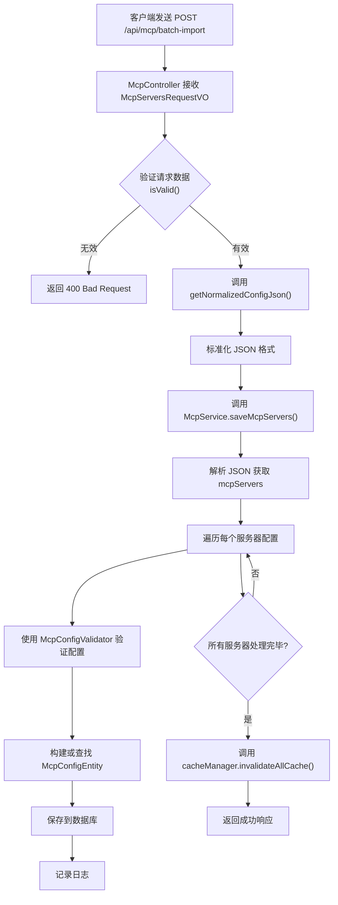

# 配置导入API

<cite>
**本文档中引用的文件**  
- [McpController.java](file://src/main/java/com/alibaba/cloud/ai/lynxe/mcp/controller/McpController.java)
- [McpServersRequestVO.java](file://src/main/java/com/alibaba/cloud/ai/lynxe/mcp/model/vo/McpServersRequestVO.java)
- [McpService.java](file://src/main/java/com/alibaba/cloud/ai/lynxe/mcp/service/McpService.java)
- [IMcpService.java](file://src/main/java/com/alibaba/cloud/ai/lynxe/mcp/service/IMcpService.java)
- [McpConfigValidator.java](file://src/main/java/com/alibaba/cloud/ai/lynxe/mcp/service/McpConfigValidator.java)
- [McpServerConfig.java](file://src/main/java/com/alibaba/cloud/ai/lynxe/mcp/model/vo/McpServerConfig.java)
- [McpConfigEntity.java](file://src/main/java/com/alibaba/cloud/ai/lynxe/mcp/model/po/McpConfigEntity.java)
- [McpConfigStatus.java](file://src/main/java/com/alibaba/cloud/ai/lynxe/mcp/model/po/McpConfigStatus.java)
</cite>

## 目录
1. [简介](#简介)
2. [核心功能](#核心功能)
3. [数据结构说明](#数据结构说明)
4. [导入流程分析](#导入流程分析)
5. [错误处理机制](#错误处理机制)
6. [示例配置](#示例配置)
7. [总结](#总结)

## 简介
`batchImportMcpServers` 是 JManus 系统中的一个关键 API 端点，用于通过 JSON 格式批量导入多个 MCP（Model Control Protocol）服务器配置。该功能允许用户一次性提交多个服务器的配置信息，极大地简化了系统配置的初始化和更新过程。本文档将详细说明此 API 的功能、数据结构、处理流程以及错误处理机制。

**Section sources**
- [McpController.java](file://src/main/java/com/alibaba/cloud/ai/lynxe/mcp/controller/McpController.java#L65-L79)

## 核心功能
`batchImportMcpServers` 端点的核心功能是接收一个 `McpServersRequestVO` 对象，该对象包含一个名为 `configJson` 的字符串字段，该字段内嵌了所有要导入的 MCP 服务器的配置。API 会解析此 JSON 字符串，验证每个服务器的配置，然后将它们批量保存到数据库中，并刷新相关缓存以确保配置立即生效。

该功能的关键特性包括：
- **批量操作**：支持一次导入多个 MCP 服务器配置，提高配置效率。
- **格式标准化**：自动将简化的 JSON 格式转换为标准格式，降低用户使用门槛。
- **事务性处理**：虽然每个服务器的保存是独立的，但整个流程通过统一的验证和缓存刷新机制保证了数据的一致性。
- **状态管理**：在导入过程中，可以为每个服务器指定启用或禁用状态。

**Section sources**
- [McpController.java](file://src/main/java/com/alibaba/cloud/ai/lynxe/mcp/controller/McpController.java#L65-L79)
- [McpService.java](file://src/main/java/com/alibaba/cloud/ai/lynxe/mcp/service/McpService.java#L71-L141)

## 数据结构说明
### McpServersRequestVO
这是批量导入请求的顶层数据传输对象（DTO），包含两个主要字段：
- **configJson**：一个字符串，其内容是一个 JSON 对象。该 JSON 必须包含一个名为 `mcpServers` 的根对象，该对象的键是服务器名称，值是该服务器的具体配置。
- **overwrite**：一个布尔值，表示是否覆盖已存在的配置。根据代码分析，此字段目前在 `McpService` 的实现中存在但未被实际使用。

### configJson 结构
`configJson` 字段的内部结构必须遵循以下规则：
- 必须包含一个顶层的 `mcpServers` 对象。
- `mcpServers` 对象的每个子对象代表一个 MCP 服务器，其键为服务器名称（字符串），其值为一个 `McpServerConfig` 对象。

### McpServerConfig
`McpServerConfig` 类定义了单个 MCP 服务器的配置，其主要字段包括：
- **command**：用于启动服务器的命令（如 `npx`, `python`）。
- **args**：传递给命令的参数列表。
- **env**：启动服务器时需要设置的环境变量。
- **headers**：HTTP 请求头，用于与服务器通信。
- **url**：服务器的访问地址。
- **status**：服务器的初始状态，可以是 `ENABLE`（启用）或 `DISABLE`（禁用），默认为 `ENABLE`。

服务器的连接类型（`connectionType`）由配置自动推断：
- 如果 `command` 字段存在，则为 `STUDIO` 类型。
- 如果 `url` 字段存在且路径中包含 `sse`，则为 `SSE` 类型。
- 其他情况为 `STREAMING` 类型。

**Section sources**
- [McpServersRequestVO.java](file://src/main/java/com/alibaba/cloud/ai/lynxe/mcp/model/vo/McpServersRequestVO.java#L45-L52)
- [McpServerConfig.java](file://src/main/java/com/alibaba/cloud/ai/lynxe/mcp/model/vo/McpServerConfig.java#L51-L123)
- [McpConfigEntity.java](file://src/main/java/com/alibaba/cloud/ai/lynxe/mcp/model/po/McpConfigEntity.java#L40-L47)
- [McpConfigStatus.java](file://src/main/java/com/alibaba/cloud/ai/lynxe/mcp/model/po/McpConfigStatus.java#L21-L24)

## 导入流程分析
批量导入的处理流程如下：



**Diagram sources**
- [McpController.java](file://src/main/java/com/alibaba/cloud/ai/lynxe/mcp/controller/McpController.java#L65-L79)
- [McpService.java](file://src/main/java/com/alibaba/cloud/ai/lynxe/mcp/service/McpService.java#L71-L141)
- [McpConfigValidator.java](file://src/main/java/com/alibaba/cloud/ai/lynxe/mcp/service/McpConfigValidator.java#L80-L107)

### getNormalizedConfigJson 方法
此方法负责处理 JSON 格式的兼容性问题。如果用户提交的 JSON 是一个简化的格式（即直接是一个服务器配置的映射对象），该方法会自动将其包装成标准格式。例如，如果用户提交：
```json
{"server1": {"command": "npx", "args": ["-y"]}}
```
该方法会将其转换为：
```json
{
  "mcpServers": {
    "server1": {"command": "npx", "args": ["-y"]}
  }
}
```
这使得 API 更加灵活，能够接受多种输入格式。

**Section sources**
- [McpServersRequestVO.java](file://src/main/java/com/alibaba/cloud/ai/lynxe/mcp/model/vo/McpServersRequestVO.java#L156-L180)

## 错误处理机制
API 在处理过程中包含了多层错误处理，以确保系统的健壮性和用户体验。

### 客户端错误
- **JSON 格式无效**：如果 `configJson` 无法被解析为有效的 JSON，或者缺少 `mcpServers` 字段，`isValidJson()` 方法会返回 `false`，API 将返回 `400 Bad Request` 状态码和错误信息。
- **配置验证失败**：`McpConfigValidator` 会对每个服务器的配置进行验证。例如，如果 `command` 和 `url` 均为空，或者 `url` 格式不正确，都会抛出 `IllegalArgumentException`，最终返回 `400 Bad Request`。

### 服务端错误
- **数据库操作失败**：虽然代码中没有显式捕获数据库异常，但 `McpConfigRepository.save()` 方法可能会抛出持久化异常，这些异常会被上层的 `Exception` 捕获，并返回 `400 Bad Request`。
- **DNS 解析失败**：当配置包含 `url` 时，验证器会尝试进行 DNS 预解析。如果域名无法解析，会抛出 `IOException`，并返回相应的错误信息。

**Section sources**
- [McpServersRequestVO.java](file://src/main/java/com/alibaba/cloud/ai/lynxe/mcp/model/vo/McpServersRequestVO.java#L75-L103)
- [McpConfigValidator.java](file://src/main/java/com/alibaba/cloud/ai/lynxe/mcp/service/McpConfigValidator.java#L80-L387)
- [McpController.java](file://src/main/java/com/alibaba/cloud/ai/lynxe/mcp/controller/McpController.java#L68-L70)

## 示例配置
以下是一个有效的批量导入 JSON 示例，展示了两个 MCP 服务器的配置：

```json
{
  "configJson": "{\n  \"mcpServers\": {\n    \"my-python-server\": {\n      \"command\": \"python\",\n      \"args\": [\"-m\", \"my_mcp_server\"],\n      \"env\": {\n        \"PYTHONPATH\": \"/path/to/lib\"\n      },\n      \"status\": \"ENABLE\"\n    },\n    \"my-node-server\": {\n      \"url\": \"https://api.example.com/sse\",\n      \"headers\": {\n        \"Authorization\": \"Bearer xxx\"\n      },\n      \"status\": \"DISABLE\"\n    }\n  }\n}",
  "overwrite": false
}
```

**Section sources**
- [McpServersRequestVO.java](file://src/main/java/com/alibaba/cloud/ai/lynxe/mcp/model/vo/McpServersRequestVO.java#L41-L43)

## 总结
`batchImportMcpServers` API 提供了一个强大且灵活的机制来批量管理 MCP 服务器配置。它通过清晰的数据结构、自动化的格式转换和严格的验证流程，确保了配置导入的准确性和可靠性。尽管 `overwrite` 字段目前未被使用，但整体设计为未来的功能扩展留下了空间。开发者在使用此 API 时，应确保 `configJson` 的结构正确，并理解其内部的验证和处理逻辑，以避免常见的配置错误。

[无来源，此部分为总结性内容]