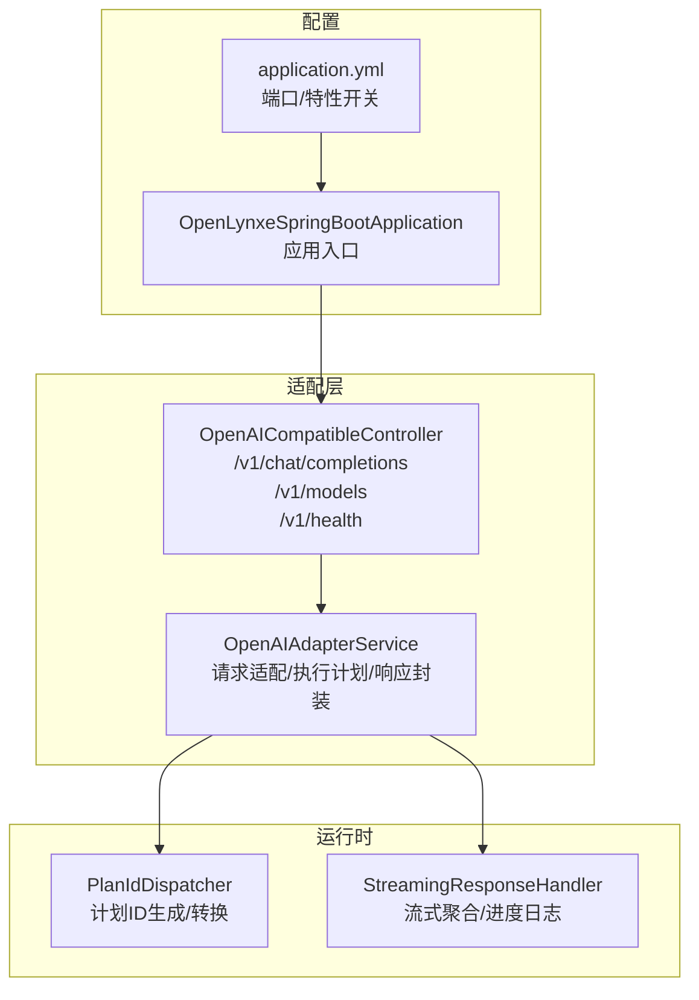
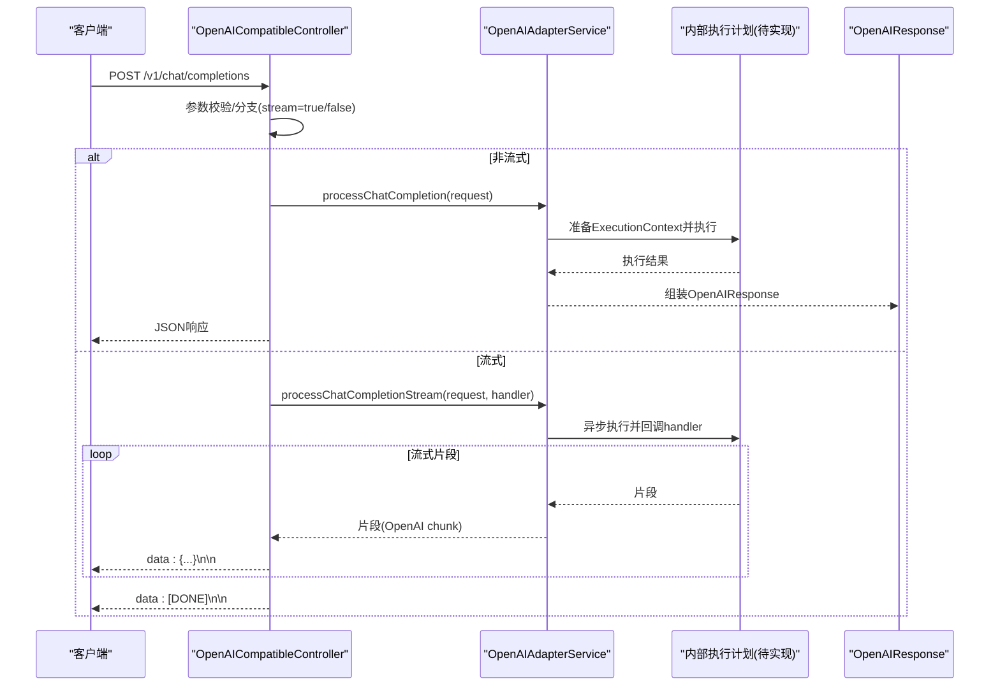
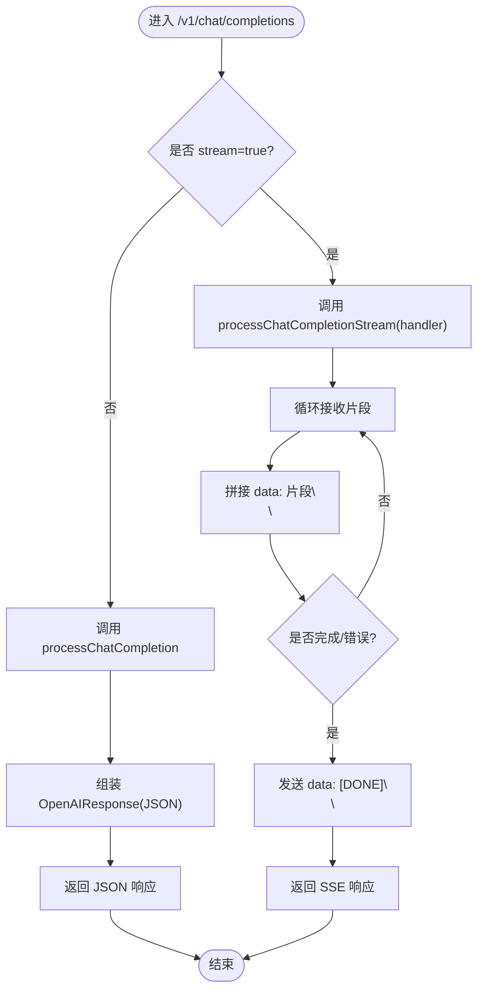
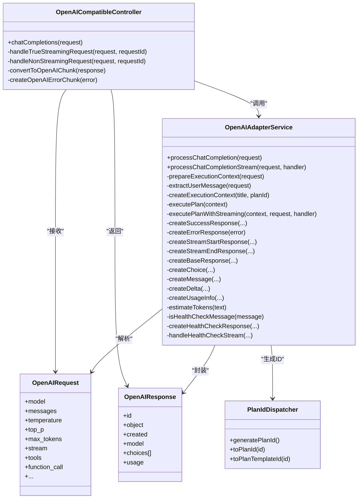
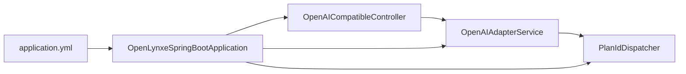

# OpenAI兼容API

<cite>
**本文引用的文件**
- [OpenAICompatibleController.java](file://src/main/java/com/alibaba/cloud/ai/lynxe/adapter/controller/OpenAICompatibleController.java)
- [OpenAIAdapterService.java](file://src/main/java/com/alibaba/cloud/ai/lynxe/adapter/service/OpenAIAdapterService.java)
- [OpenAIRequest.java](file://src/main/java/com/alibaba/cloud/ai/lynxe/adapter/model/OpenAIRequest.java)
- [OpenAIResponse.java](file://src/main/java/com/alibaba/cloud/ai/lynxe/adapter/model/OpenAIResponse.java)
- [PlanIdDispatcher.java](file://src/main/java/com/alibaba/cloud/ai/lynxe/runtime/service/PlanIdDispatcher.java)
- [StreamingResponseHandler.java](file://src/main/java/com/alibaba/cloud/ai/lynxe/llm/StreamingResponseHandler.java)
- [application.yml](file://src/main/resources/application.yml)
- [OpenLynxeSpringBootApplication.java](file://src/main/java/com/alibaba/cloud/ai/lynxe/OpenLynxeSpringBootApplication.java)
</cite>

## 目录
1. [简介](#简介)
2. [项目结构](#项目结构)
3. [核心组件](#核心组件)
4. [架构总览](#架构总览)
5. [详细组件分析](#详细组件分析)
6. [依赖关系分析](#依赖关系分析)
7. [性能考量](#性能考量)
8. [故障排查指南](#故障排查指南)
9. [结论](#结论)
10. [附录](#附录)

## 简介
本文件为 JManus 项目中 OpenAI 兼容 API 的参考文档，聚焦于 OpenAICompatibleController 提供的 OpenAI 兼容端点，包括：
- chat/completions：支持流式与非流式响应
- models：返回可用模型列表
- health：健康检查端点

文档将详细说明：
- 请求/响应模式与兼容性
- 将 OpenAI 请求转换为内部执行计划的流程
- 将内部执行结果转换为 OpenAI 兼容响应格式
- 流式响应的 SSE 实现机制（数据块格式、完成标记、错误处理）
- listModels 返回的模型信息结构
- health 健康检查机制
- 错误处理策略与性能优化建议
- 与 OpenAI API 的兼容性说明、差异点与迁移指南

## 项目结构
OpenAI 兼容 API 的核心位于 adapter 子模块，控制器负责路由与响应封装，适配服务负责请求解析与内部执行计划的生成与调用，模型对象用于请求/响应的序列化。

图表来源
- [OpenAICompatibleController.java](file://src/main/java/com/alibaba/cloud/ai/lynxe/adapter/controller/OpenAICompatibleController.java#L82-L356)
- [OpenAIAdapterService.java](file://src/main/java/com/alibaba/cloud/ai/lynxe/adapter/service/OpenAIAdapterService.java#L66-L559)
- [PlanIdDispatcher.java](file://src/main/java/com/alibaba/cloud/ai/lynxe/runtime/service/PlanIdDispatcher.java#L1-L292)
- [StreamingResponseHandler.java](file://src/main/java/com/alibaba/cloud/ai/lynxe/llm/StreamingResponseHandler.java#L1-L565)
- [application.yml](file://src/main/resources/application.yml#L1-L98)
- [OpenLynxeSpringBootApplication.java](file://src/main/java/com/alibaba/cloud/ai/lynxe/OpenLynxeSpringBootApplication.java#L1-L71)

章节来源
- [OpenAICompatibleController.java](file://src/main/java/com/alibaba/cloud/ai/lynxe/adapter/controller/OpenAICompatibleController.java#L82-L356)
- [OpenAIAdapterService.java](file://src/main/java/com/alibaba/cloud/ai/lynxe/adapter/service/OpenAIAdapterService.java#L66-L559)
- [application.yml](file://src/main/resources/application.yml#L1-L98)

## 核心组件
- OpenAICompatibleController：暴露 /v1/chat/completions、/v1/models、/v1/health 三个端点；负责参数校验、流式/非流式分支、SSE 头部设置、错误响应封装。
- OpenAIAdapterService：将 OpenAIRequest 转换为内部 ExecutionContext 并执行计划；提供同步与异步两种执行路径；负责生成 OpenAIResponse；内置健康检查短路逻辑。
- OpenAIRequest/OpenAIResponse：遵循 OpenAI 规范的数据模型，用于请求解析与响应序列化。
- PlanIdDispatcher：生成/转换计划ID，确保唯一性与可追踪性。
- StreamingResponseHandler：通用流式响应聚合与进度日志工具（在 OpenAI 兼容层当前未直接使用，但具备能力）。

章节来源
- [OpenAICompatibleController.java](file://src/main/java/com/alibaba/cloud/ai/lynxe/adapter/controller/OpenAICompatibleController.java#L82-L356)
- [OpenAIAdapterService.java](file://src/main/java/com/alibaba/cloud/ai/lynxe/adapter/service/OpenAIAdapterService.java#L66-L559)
- [OpenAIRequest.java](file://src/main/java/com/alibaba/cloud/ai/lynxe/adapter/model/OpenAIRequest.java#L1-L490)
- [OpenAIResponse.java](file://src/main/java/com/alibaba/cloud/ai/lynxe/adapter/model/OpenAIResponse.java#L1-L630)
- [PlanIdDispatcher.java](file://src/main/java/com/alibaba/cloud/ai/lynxe/runtime/service/PlanIdDispatcher.java#L1-L292)
- [StreamingResponseHandler.java](file://src/main/java/com/alibaba/cloud/ai/lynxe/llm/StreamingResponseHandler.java#L1-L565)

## 架构总览
下图展示从客户端到内部执行计划的整体调用链与关键节点。

图表来源
- [OpenAICompatibleController.java](file://src/main/java/com/alibaba/cloud/ai/lynxe/adapter/controller/OpenAICompatibleController.java#L118-L185)
- [OpenAICompatibleController.java](file://src/main/java/com/alibaba/cloud/ai/lynxe/adapter/controller/OpenAICompatibleController.java#L246-L261)
- [OpenAICompatibleController.java](file://src/main/java/com/alibaba/cloud/ai/lynxe/adapter/controller/OpenAICompatibleController.java#L186-L245)
- [OpenAIAdapterService.java](file://src/main/java/com/alibaba/cloud/ai/lynxe/adapter/service/OpenAIAdapterService.java#L99-L135)
- [OpenAIAdapterService.java](file://src/main/java/com/alibaba/cloud/ai/lynxe/adapter/service/OpenAIAdapterService.java#L207-L269)

## 详细组件分析

### chat/completions 端点
- 端点：POST /v1/chat/completions
- 支持：
  - 非流式：一次性返回完整 JSON 响应
  - 流式：SSE 格式，逐块推送 data: {...}\n\n，以 data: [DONE]\n\n 结束
- 请求体：OpenAIRequest（兼容 OpenAI 字段，如 model、messages、temperature、top_p、max_tokens、stream、tools、function_call 等）
- 响应体：OpenAIResponse（兼容 OpenAI 字段，如 id、object、created、model、choices[].delta/message、usage 等）

请求/响应模式与兼容性要点
- 非流式：控制器直接调用适配服务的同步方法，序列化为 JSON 后返回。
- 流式：控制器内部收集所有片段，按 OpenAI chunk 格式拼接，最后发送 [DONE] 完成标记；同时设置正确的 Content-Type 与缓存控制头。
- 健康检查短路：当检测到“健康检查”消息（如 hello/hi/health/ping/test 等）时，直接返回简短问候内容，不进入复杂执行流程。

SSE 实现机制
- 数据块格式：每条数据以 data: 开头，后跟 JSON 片段，再以 \n\n 结尾
- 完成标记：data: [DONE]\n\n
- 错误处理：捕获内部异常或适配服务回调错误时，构造 OpenAI 风格的错误 chunk，并返回 [DONE] 结束

图表来源
- [OpenAICompatibleController.java](file://src/main/java/com/alibaba/cloud/ai/lynxe/adapter/controller/OpenAICompatibleController.java#L118-L185)
- [OpenAICompatibleController.java](file://src/main/java/com/alibaba/cloud/ai/lynxe/adapter/controller/OpenAICompatibleController.java#L186-L245)
- [OpenAICompatibleController.java](file://src/main/java/com/alibaba/cloud/ai/lynxe/adapter/controller/OpenAICompatibleController.java#L246-L261)

章节来源
- [OpenAICompatibleController.java](file://src/main/java/com/alibaba/cloud/ai/lynxe/adapter/controller/OpenAICompatibleController.java#L82-L356)
- [OpenAIAdapterService.java](file://src/main/java/com/alibaba/cloud/ai/lynxe/adapter/service/OpenAIAdapterService.java#L66-L135)

### 将 OpenAI 请求转换为内部执行计划
- 请求解析：OpenAICompatibleController 校验请求合法性（messages 非空且每条消息 role/content 有效），随后根据 stream 分支。
- 上下文准备：OpenAIAdapterService 从 OpenAIRequest 中提取用户消息，生成 ExecutionContext（包含标题、计划ID、根计划ID、是否需要摘要等），并调用 PlanIdDispatcher 生成唯一 planId。
- 执行计划：当前实现抛出未实现异常，预留了通过 PlanningCoordinator/PlanExecutorFactory 等执行复杂任务的扩展点；在健康检查场景下会直接返回问候内容。
- 响应封装：将内部结果映射为 OpenAIResponse（id/object/created/model/choices/usage），并估算 token 数量。

图表来源
- [OpenAICompatibleController.java](file://src/main/java/com/alibaba/cloud/ai/lynxe/adapter/controller/OpenAICompatibleController.java#L82-L356)
- [OpenAIAdapterService.java](file://src/main/java/com/alibaba/cloud/ai/lynxe/adapter/service/OpenAIAdapterService.java#L66-L559)
- [OpenAIRequest.java](file://src/main/java/com/alibaba/cloud/ai/lynxe/adapter/model/OpenAIRequest.java#L1-L490)
- [OpenAIResponse.java](file://src/main/java/com/alibaba/cloud/ai/lynxe/adapter/model/OpenAIResponse.java#L1-L630)
- [PlanIdDispatcher.java](file://src/main/java/com/alibaba/cloud/ai/lynxe/runtime/service/PlanIdDispatcher.java#L1-L292)

章节来源
- [OpenAIAdapterService.java](file://src/main/java/com/alibaba/cloud/ai/lynxe/adapter/service/OpenAIAdapterService.java#L137-L206)
- [OpenAIAdapterService.java](file://src/main/java/com/alibaba/cloud/ai/lynxe/adapter/service/OpenAIAdapterService.java#L207-L269)
- [PlanIdDispatcher.java](file://src/main/java/com/alibaba/cloud/ai/lynxe/runtime/service/PlanIdDispatcher.java#L121-L160)

### 流式响应的 SSE 实现细节
- 数据块格式：每条片段前缀 data:，后接 JSON 片段，再以 \n\n 结束
- 完成标记：data: [DONE]\n\n
- 错误处理：捕获适配服务回调错误或内部异常，构造 OpenAI 风格错误 chunk 并返回 [DONE]
- 控制流：控制器内部等待适配服务回调完成或超时（默认 3 分钟），期间轮询检查完成状态

章节来源
- [OpenAICompatibleController.java](file://src/main/java/com/alibaba/cloud/ai/lynxe/adapter/controller/OpenAICompatibleController.java#L118-L185)
- [OpenAICompatibleController.java](file://src/main/java/com/alibaba/cloud/ai/lynxe/adapter/controller/OpenAICompatibleController.java#L186-L245)

### listModels 端点
- 端点：GET /v1/models
- 返回结构：object=list，data=[{id, object=model, created, owned_by, root, parent}]
- 当前固定返回一个 Lynxe 内部模型标识与拥有者信息

章节来源
- [OpenAICompatibleController.java](file://src/main/java/com/alibaba/cloud/ai/lynxe/adapter/controller/OpenAICompatibleController.java#L273-L324)

### health 端点
- 端点：GET /v1/health
- 返回结构：包含 status、service、timestamp、model 等字段，用于外部探活

章节来源
- [OpenAICompatibleController.java](file://src/main/java/com/alibaba/cloud/ai/lynxe/adapter/controller/OpenAICompatibleController.java#L291-L298)

## 依赖关系分析
- 控制器依赖适配服务进行请求处理与响应封装
- 适配服务依赖 PlanIdDispatcher 生成执行计划ID
- 应用配置通过 application.yml 设置端口与特性开关
- 应用入口类负责启动与组件扫描

图表来源
- [OpenAICompatibleController.java](file://src/main/java/com/alibaba/cloud/ai/lynxe/adapter/controller/OpenAICompatibleController.java#L82-L356)
- [OpenAIAdapterService.java](file://src/main/java/com/alibaba/cloud/ai/lynxe/adapter/service/OpenAIAdapterService.java#L66-L559)
- [PlanIdDispatcher.java](file://src/main/java/com/alibaba/cloud/ai/lynxe/runtime/service/PlanIdDispatcher.java#L1-L292)
- [OpenLynxeSpringBootApplication.java](file://src/main/java/com/alibaba/cloud/ai/lynxe/OpenLynxeSpringBootApplication.java#L1-L71)
- [application.yml](file://src/main/resources/application.yml#L1-L98)

章节来源
- [OpenLynxeSpringBootApplication.java](file://src/main/java/com/alibaba/cloud/ai/lynxe/OpenLynxeSpringBootApplication.java#L1-L71)
- [application.yml](file://src/main/resources/application.yml#L1-L98)

## 性能考量
- 流式等待与超时：控制器对流式响应设置了 3 分钟超时与 100ms 轮询间隔，避免长时间阻塞；可根据业务调整轮询间隔与超时阈值。
- token 估算：usage 中的 prompt_tokens/completion_tokens 采用字符长度除以固定比率估算，实际值可能与真实 token 不一致，建议在集成 LLM 时替换为真实计数。
- 健康检查短路：对简单问候消息直接返回，减少不必要的执行开销。
- 日志与监控：StreamingResponseHandler 提供流式进度日志与聚合统计，有助于定位慢响应与异常。

章节来源
- [OpenAICompatibleController.java](file://src/main/java/com/alibaba/cloud/ai/lynxe/adapter/controller/OpenAICompatibleController.java#L57-L61)
- [OpenAICompatibleController.java](file://src/main/java/com/alibaba/cloud/ai/lynxe/adapter/controller/OpenAICompatibleController.java#L154-L158)
- [OpenAIAdapterService.java](file://src/main/java/com/alibaba/cloud/ai/lynxe/adapter/service/OpenAIAdapterService.java#L451-L466)
- [StreamingResponseHandler.java](file://src/main/java/com/alibaba/cloud/ai/lynxe/llm/StreamingResponseHandler.java#L153-L210)

## 故障排查指南
- 常见错误
  - 非法请求：messages 为空或消息缺少 role/content 时返回 400
  - 内部异常：控制器捕获异常并返回 500；流式场景下返回 OpenAI 风格错误 chunk 并结束
  - 执行未实现：适配服务当前抛出未实现异常，需补充执行计划实现
- 排查步骤
  - 检查请求体是否符合 OpenAIRequest 规范
  - 查看控制器日志中的请求 ID 与消息预览
  - 对流式响应，确认客户端正确处理 data: 片段与 [DONE] 结束标记
  - 如需真实 token 统计，检查是否已接入 LLM 并替换 token 估算逻辑

章节来源
- [OpenAICompatibleController.java](file://src/main/java/com/alibaba/cloud/ai/lynxe/adapter/controller/OpenAICompatibleController.java#L103-L116)
- [OpenAICompatibleController.java](file://src/main/java/com/alibaba/cloud/ai/lynxe/adapter/controller/OpenAICompatibleController.java#L160-L185)
- [OpenAICompatibleController.java](file://src/main/java/com/alibaba/cloud/ai/lynxe/adapter/controller/OpenAICompatibleController.java#L257-L261)
- [OpenAIAdapterService.java](file://src/main/java/com/alibaba/cloud/ai/lynxe/adapter/service/OpenAIAdapterService.java#L268-L269)

## 结论
本 OpenAI 兼容 API 在控制器与适配服务层面实现了对 OpenAI 协议的高兼容封装，覆盖 chat/completions（流式/非流式）、models、health 三大端点。当前执行计划仍处于预留实现阶段，建议尽快补齐与 LLM/规划器的对接，以发挥 Lynxe 的多智能体协作与工具调用能力。流式响应严格遵循 SSE 格式，具备良好的客户端兼容性；健康检查短路提升了系统可用性与响应速度。

## 附录

### API 定义与示例（路径引用）
- chat/completions（非流式）
  - 请求：POST /v1/chat/completions
  - 示例请求体字段：model、messages、temperature、top_p、max_tokens、n、stop、seed、user、tools、function_call 等
  - 示例响应体字段：id、object、created、model、choices[].message、usage
  - 参考路径
    - [OpenAICompatibleController.java](file://src/main/java/com/alibaba/cloud/ai/lynxe/adapter/controller/OpenAICompatibleController.java#L82-L116)
    - [OpenAICompatibleController.java](file://src/main/java/com/alibaba/cloud/ai/lynxe/adapter/controller/OpenAICompatibleController.java#L246-L261)
    - [OpenAIRequest.java](file://src/main/java/com/alibaba/cloud/ai/lynxe/adapter/model/OpenAIRequest.java#L1-L242)
    - [OpenAIResponse.java](file://src/main/java/com/alibaba/cloud/ai/lynxe/adapter/model/OpenAIResponse.java#L1-L102)
- chat/completions（流式）
  - 请求：POST /v1/chat/completions，stream=true
  - 数据块格式：data: {...}\n\n，结束标记：data: [DONE]\n\n
  - 参考路径
    - [OpenAICompatibleController.java](file://src/main/java/com/alibaba/cloud/ai/lynxe/adapter/controller/OpenAICompatibleController.java#L118-L185)
    - [OpenAICompatibleController.java](file://src/main/java/com/alibaba/cloud/ai/lynxe/adapter/controller/OpenAICompatibleController.java#L186-L245)
- models
  - 请求：GET /v1/models
  - 响应：object=list，data=[{id, object=model, created, owned_by, root, parent}]
  - 参考路径
    - [OpenAICompatibleController.java](file://src/main/java/com/alibaba/cloud/ai/lynxe/adapter/controller/OpenAICompatibleController.java#L273-L324)
- health
  - 请求：GET /v1/health
  - 响应：status、service、timestamp、model
  - 参考路径
    - [OpenAICompatibleController.java](file://src/main/java/com/alibaba/cloud/ai/lynxe/adapter/controller/OpenAICompatibleController.java#L291-L298)

### 兼容性说明、差异点与迁移指南
- 兼容性
  - 端点与字段基本与 OpenAI 兼容，支持常用参数（如 temperature、top_p、max_tokens、stream、tools、function_call 等）
  - 流式响应严格遵循 SSE 格式，客户端可按标准处理
- 已知差异
  - 执行计划尚未实现：当前适配服务在执行计划处抛出未实现异常，导致非健康检查消息无法进入复杂执行流程
  - token 估算为字符长度估算，非真实 token 计数
- 迁移建议
  - 补齐执行计划实现：接入 PlanningCoordinator/PlanExecutorFactory 等，将 OpenAIRequest 映射为内部计划并执行
  - 替换 token 估算：接入真实 LLM 计数或外部 token 包
  - 增强错误处理：在适配服务与控制器中统一错误响应格式，便于前端/SDK 识别
  - 健康检查扩展：可增加更多健康探测语句与更丰富的响应内容

章节来源
- [OpenAIAdapterService.java](file://src/main/java/com/alibaba/cloud/ai/lynxe/adapter/service/OpenAIAdapterService.java#L268-L269)
- [OpenAIAdapterService.java](file://src/main/java/com/alibaba/cloud/ai/lynxe/adapter/service/OpenAIAdapterService.java#L451-L466)
- [OpenAICompatibleController.java](file://src/main/java/com/alibaba/cloud/ai/lynxe/adapter/controller/OpenAICompatibleController.java#L118-L185)