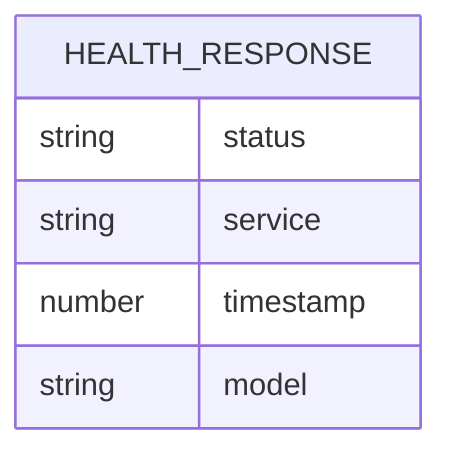
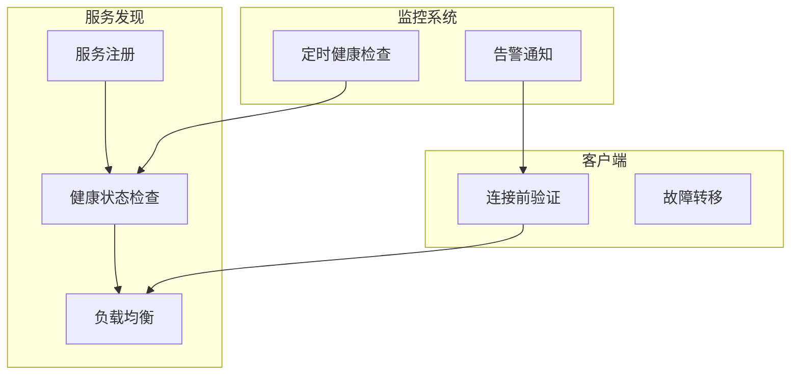
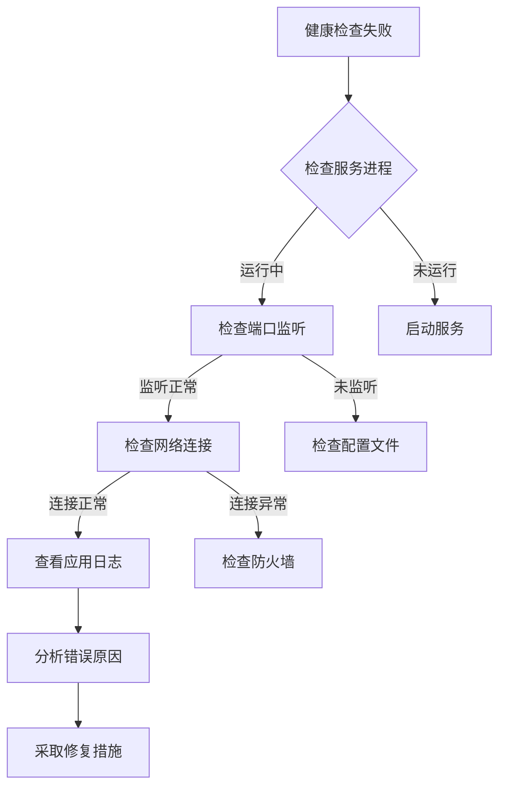
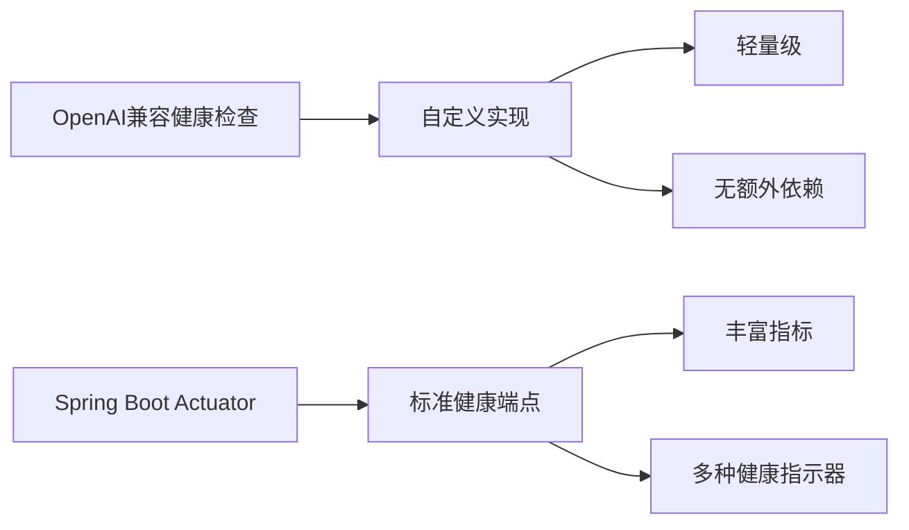

# 健康检查API

<cite>
**本文档引用的文件**  
- [OpenAICompatibleController.java](file://src/main/java/com/alibaba/cloud/ai/lynxe/adapter/controller/OpenAICompatibleController.java)
- [OpenAIAdapterService.java](file://src/main/java/com/alibaba/cloud/ai/lynxe/adapter/service/OpenAIAdapterService.java)
- [application.yml](file://src/main/resources/application.yml)
- [pom.xml](file://pom.xml)
</cite>

## 目录
1. [简介](#简介)
2. [健康检查端点实现机制](#健康检查端点实现机制)
3. [响应字段说明](#响应字段说明)
4. [API调用示例](#api调用示例)
5. [系统监控与服务发现](#系统监控与服务发现)
6. [健康检查频率与最佳实践](#健康检查频率与最佳实践)
7. [错误情况与排查步骤](#错误情况与排查步骤)
8. [与Spring Boot Actuator集成关系](#与spring-boot-actuator集成关系)
9. [结论](#结论)

## 简介
JManus系统提供了与OpenAI兼容的健康检查API，用于验证服务的可用性和运行状态。`/v1/health`端点作为系统健康状态的轻量级检查接口，允许客户端快速确认服务是否正常运行。该端点设计遵循OpenAI API规范，确保与现有客户端工具和集成的兼容性。

**Section sources**
- [OpenAICompatibleController.java](file://src/main/java/com/alibaba/cloud/ai/lynxe/adapter/controller/OpenAICompatibleController.java#L290-L298)

## 健康检查端点实现机制
`/v1/health`端点通过`OpenAICompatibleController`类中的`health()`方法实现。该方法处理HTTP GET请求并返回包含系统健康状态信息的JSON响应。实现机制包括：

- **端点映射**：使用`@GetMapping("/v1/health")`注解将HTTP GET请求映射到`health()`方法
- **响应构建**：使用`ResponseEntity.ok()`创建成功的HTTP响应
- **状态信息**：返回包含服务状态、服务名称、时间戳和模型ID的Map对象
- **日志记录**：在处理健康检查请求时记录INFO级别的日志

该端点独立于主要的聊天完成功能，提供了一个轻量级的健康检查机制，不会触发复杂的AI处理流程。

```mermaid
flowchart TD
A[客户端请求] --> B{GET /v1/health}
B --> C[OpenAICompatibleController.health()]
C --> D[构建健康状态响应]
D --> E[返回JSON响应]
E --> F[客户端接收健康状态]
```

**Diagram sources**
- [OpenAICompatibleController.java](file://src/main/java/com/alibaba/cloud/ai/lynxe/adapter/controller/OpenAICompatibleController.java#L290-L298)

**Section sources**
- [OpenAICompatibleController.java](file://src/main/java/com/alibaba/cloud/ai/lynxe/adapter/controller/OpenAICompatibleController.java#L290-L298)

## 响应字段说明
健康检查响应包含以下关键字段：

| 字段 | 类型 | 说明 |
|------|------|------|
| status | 字符串 | 系统当前状态，正常时返回"healthy" |
| service | 字符串 | 服务名称，标识为"Lynxe OpenAI Compatible API" |
| timestamp | 数字 | 当前时间戳（秒级），表示健康检查的时间点 |
| model | 字符串 | 模型ID，固定为"lynxe-1.0" |

这些字段的含义如下：
- **status**：表示服务的整体健康状况，"healthy"表示所有系统组件正常运行
- **service**：提供服务的名称标识，便于在多服务环境中识别
- **timestamp**：用于验证服务的实时性，客户端可以检查响应是否及时
- **model**：关联的模型ID，与系统配置的`LYNXE_MODEL_ID`常量一致



**Diagram sources**
- [OpenAICompatibleController.java](file://src/main/java/com/alibaba/cloud/ai/lynxe/adapter/controller/OpenAICompatibleController.java#L296-L297)

**Section sources**
- [OpenAICompatibleController.java](file://src/main/java/com/alibaba/cloud/ai/lynxe/adapter/controller/OpenAICompatibleController.java#L296-L297)

## API调用示例
以下是健康检查API的调用示例和成功响应：

**API调用**
```bash
curl -X GET "http://localhost:18080/v1/health"
```

**成功响应**
```json
{
  "status": "healthy",
  "service": "Lynxe OpenAI Compatible API",
  "timestamp": 1740592800,
  "model": "lynxe-1.0"
}
```

**HTTP响应头**
```
Content-Type: application/json; charset=utf-8
Access-Control-Allow-Origin: *
```

该端点不需要身份验证，可以被任何客户端直接调用，便于集成到各种监控系统中。

**Section sources**
- [OpenAICompatibleController.java](file://src/main/java/com/alibaba/cloud/ai/lynxe/adapter/controller/OpenAICompatibleController.java#L293-L298)

## 系统监控与服务发现
`/v1/health`端点在系统监控、服务发现和客户端连接测试中发挥着重要作用：

- **系统监控**：监控系统可以定期调用此端点来验证服务的可用性，当连续多次健康检查失败时触发告警
- **服务发现**：在微服务架构中，服务注册中心可以使用此端点来确定服务实例的健康状态，决定是否将流量路由到该实例
- **客户端连接测试**：客户端在建立连接前可以调用此端点验证服务是否可用，避免向不可用的服务发送重要请求
- **部署验证**：在新版本部署后，运维人员可以使用此端点快速验证服务是否成功启动并正常运行

该端点的设计考虑了性能影响，响应生成过程简单高效，不会对系统造成额外负担。



**Diagram sources**
- [OpenAICompatibleController.java](file://src/main/java/com/alibaba/cloud/ai/lynxe/adapter/controller/OpenAICompatibleController.java)
- [application.yml](file://src/main/resources/application.yml)

**Section sources**
- [OpenAICompatibleController.java](file://src/main/java/com/alibaba/cloud/ai/lynxe/adapter/controller/OpenAICompatibleController.java#L290-L298)

## 健康检查频率与最佳实践
### 健康检查频率建议
- **生产环境**：建议每30-60秒进行一次健康检查
- **开发环境**：可以根据需要调整为每10-30秒一次
- **高可用系统**：对于关键服务，可以设置为每5-10秒一次

### 部署环境中的最佳实践
1. **合理设置检查间隔**：避免过于频繁的健康检查对系统造成不必要的压力
2. **实现超时机制**：客户端应设置合理的请求超时时间（建议5-10秒）
3. **重试策略**：对于临时性网络问题，应实现指数退避重试机制
4. **监控响应时间**：不仅检查服务是否可用，还应监控健康检查的响应时间
5. **环境差异化配置**：在不同环境（开发、测试、生产）中使用不同的健康检查策略
6. **日志分析**：定期分析健康检查相关的日志，及时发现潜在问题

**Section sources**
- [OpenAICompatibleController.java](file://src/main/java/com/alibaba/cloud/ai/lynxe/adapter/controller/OpenAICompatibleController.java)
- [application.yml](file://src/main/resources/application.yml)

## 错误情况与排查步骤
### 可能的错误情况
1. **连接拒绝**：服务未启动或端口未正确监听
2. **超时错误**：服务响应过慢或网络延迟过高
3. **5xx服务器错误**：服务内部异常导致无法处理请求
4. **4xx客户端错误**：请求方法或路径错误

### 排查步骤
1. **检查服务状态**：确认JManus服务是否正在运行
2. **验证端口监听**：使用`netstat`或`lsof`命令检查18080端口是否被监听
3. **查看日志文件**：检查`./logs/info.log`中的错误信息
4. **检查依赖服务**：确认数据库、Nacos等依赖服务是否正常
5. **验证网络连接**：使用`ping`和`telnet`测试网络连通性
6. **检查防火墙设置**：确保没有防火墙规则阻止访问
7. **查看系统资源**：检查CPU、内存和磁盘使用情况



**Diagram sources**
- [OpenAICompatibleController.java](file://src/main/java/com/alibaba/cloud/ai/lynxe/adapter/controller/OpenAICompatibleController.java)
- [application.yml](file://src/main/resources/application.yml)

**Section sources**
- [OpenAICompatibleController.java](file://src/main/java/com/alibaba/cloud/ai/lynxe/adapter/controller/OpenAICompatibleController.java)
- [application.yml](file://src/main/resources/application.yml)

## 与Spring Boot Actuator集成关系
经过代码库分析，JManus系统的健康检查实现与Spring Boot Actuator存在以下关系：

- **独立实现**：`/v1/health`端点是独立实现的，不直接依赖Spring Boot Actuator的健康检查机制
- **无Actuator依赖**：在`pom.xml`中未发现`spring-boot-starter-actuator`依赖
- **自定义健康检查**：系统使用自定义的健康检查逻辑，而非Actuator的标准健康指示器
- **兼容性设计**：虽然不使用Actuator，但响应格式设计为与OpenAI API兼容
- **差异说明**：与Actuator相比，此实现更轻量级，专注于基本的可用性检查，而不提供详细的健康指标

这种设计选择可能是为了保持与OpenAI API的兼容性，同时避免引入额外的依赖和复杂性。



**Diagram sources**
- [pom.xml](file://pom.xml)
- [OpenAICompatibleController.java](file://src/main/java/com/alibaba/cloud/ai/lynxe/adapter/controller/OpenAICompatibleController.java)

**Section sources**
- [pom.xml](file://pom.xml)
- [OpenAICompatibleController.java](file://src/main/java/com/alibaba/cloud/ai/lynxe/adapter/controller/OpenAICompatibleController.java)

## 结论
JManus系统的`/v1/health`端点提供了一个简单而有效的健康检查机制，用于验证服务的可用性。该实现独立于Spring Boot Actuator，采用自定义设计以确保与OpenAI API的兼容性。端点返回包含状态、服务名称、时间戳和模型ID的关键信息，便于客户端和服务发现系统使用。建议在生产环境中合理配置健康检查频率，并结合监控系统实现全面的服务可用性保障。