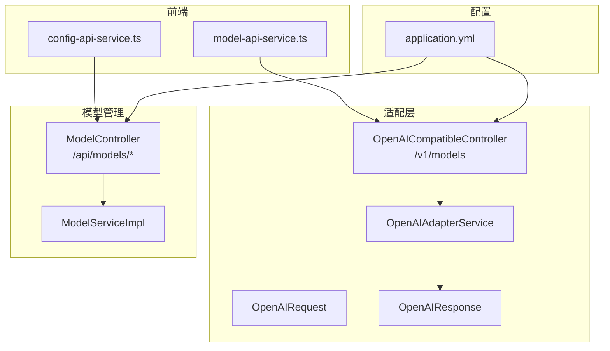
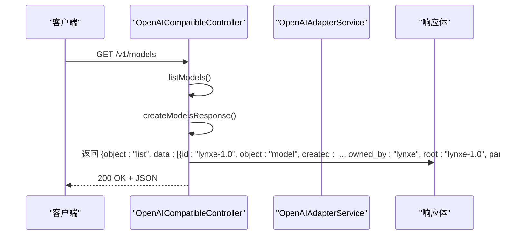
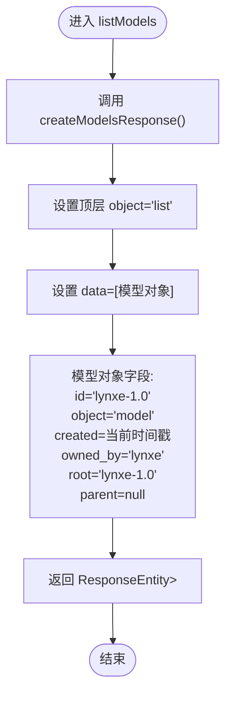
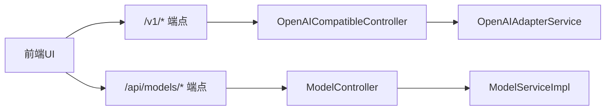

# 模型管理API

<cite>
**本文引用的文件**
- [OpenAICompatibleController.java](file://src/main/java/com/alibaba/cloud/ai/lynxe/adapter/controller/OpenAICompatibleController.java)
- [OpenAIAdapterService.java](file://src/main/java/com/alibaba/cloud/ai/lynxe/adapter/service/OpenAIAdapterService.java)
- [OpenAIRequest.java](file://src/main/java/com/alibaba/cloud/ai/lynxe/adapter/model/OpenAIRequest.java)
- [OpenAIResponse.java](file://src/main/java/com/alibaba/cloud/ai/lynxe/adapter/model/OpenAIResponse.java)
- [ModelController.java](file://src/main/java/com/alibaba/cloud/ai/lynxe/model/controller/ModelController.java)
- [ModelServiceImpl.java](file://src/main/java/com/alibaba/cloud/ai/lynxe/model/service/ModelServiceImpl.java)
- [application.yml](file://src/main/resources/application.yml)
- [README.md](file://README.md)
- [model-api-service.ts](file://ui-vue3/src/api/model-api-service.ts)
- [config-api-service.ts](file://ui-vue3/src/api/config-api-service.ts)
</cite>

## 目录
1. [简介](#简介)
2. [项目结构](#项目结构)
3. [核心组件](#核心组件)
4. [架构总览](#架构总览)
5. [详细组件分析](#详细组件分析)
6. [依赖关系分析](#依赖关系分析)
7. [性能考量](#性能考量)
8. [故障排查指南](#故障排查指南)
9. [结论](#结论)
10. [附录](#附录)

## 简介
本文件面向JManus（Lynxe）的OpenAI兼容模型管理API，聚焦/v1/models端点的实现与行为，解释listModels方法如何构建符合OpenAI规范的模型列表响应；阐述createModelsResponse方法生成的模型数据结构及字段语义；说明返回的JSON响应格式（object类型为“list”，data数组中包含的模型对象）；介绍模型元数据的静态配置方式及其在系统中的作用；并提供API调用示例、响应解析指南、健康检查与可用性验证最佳实践，以及在客户端（如Cherry Studio）中的典型使用场景与集成方法。

## 项目结构
JManus后端采用Spring Boot，OpenAI兼容接口位于适配层，模型管理API位于模型层。关键路径如下：
- 适配层控制器：/src/main/java/.../adapter/controller/OpenAICompatibleController.java
- 适配层服务：/src/main/java/.../adapter/service/OpenAIAdapterService.java
- 请求/响应模型：/src/main/java/.../adapter/model/OpenAIRequest.java、/src/main/java/.../adapter/model/OpenAIResponse.java
- 模型管理控制器：/src/main/java/.../model/controller/ModelController.java
- 模型管理服务：/src/main/java/.../model/service/ModelServiceImpl.java
- 客户端集成（前端）：/ui-vue3/src/api/model-api-service.ts、/ui-vue3/src/api/config-api-service.ts
- 应用配置：/src/main/resources/application.yml

图表来源
- [OpenAICompatibleController.java](file://src/main/java/com/alibaba/cloud/ai/lynxe/adapter/controller/OpenAICompatibleController.java#L273-L323)
- [OpenAIAdapterService.java](file://src/main/java/com/alibaba/cloud/ai/lynxe/adapter/service/OpenAIAdapterService.java#L65-L96)
- [OpenAIRequest.java](file://src/main/java/com/alibaba/cloud/ai/lynxe/adapter/model/OpenAIRequest.java#L1-L240)
- [OpenAIResponse.java](file://src/main/java/com/alibaba/cloud/ai/lynxe/adapter/model/OpenAIResponse.java#L1-L120)
- [ModelController.java](file://src/main/java/com/alibaba/cloud/ai/lynxe/model/controller/ModelController.java#L1-L176)
- [ModelServiceImpl.java](file://src/main/java/com/alibaba/cloud/ai/lynxe/model/service/ModelServiceImpl.java#L398-L485)
- [application.yml](file://src/main/resources/application.yml#L1-L98)

章节来源
- [OpenAICompatibleController.java](file://src/main/java/com/alibaba/cloud/ai/lynxe/adapter/controller/OpenAICompatibleController.java#L273-L323)
- [ModelController.java](file://src/main/java/com/alibaba/cloud/ai/lynxe/model/controller/ModelController.java#L1-L176)
- [application.yml](file://src/main/resources/application.yml#L1-L98)

## 核心组件
- OpenAICompatibleController：提供/v1/models端点，负责构建OpenAI兼容的模型列表响应；同时提供/v1/health健康检查端点。
- OpenAIAdapterService：处理聊天补全请求，内部用于健康检查消息识别与响应构造。
- OpenAIRequest/OpenAIResponse：定义OpenAI兼容的请求与响应模型结构。
- ModelController：提供/api/models系列端点（查询、新增、更新、删除、默认模型设置、可用模型列表），并与第三方模型供应商交互。
- ModelServiceImpl：实现模型配置的增删改查、默认模型切换、第三方模型列表拉取与缓存、配置校验等逻辑。
- 前端集成：model-api-service.ts与config-api-service.ts分别对接后端模型管理与可用模型列表。

章节来源
- [OpenAICompatibleController.java](file://src/main/java/com/alibaba/cloud/ai/lynxe/adapter/controller/OpenAICompatibleController.java#L273-L323)
- [OpenAIAdapterService.java](file://src/main/java/com/alibaba/cloud/ai/lynxe/adapter/service/OpenAIAdapterService.java#L65-L96)
- [OpenAIRequest.java](file://src/main/java/com/alibaba/cloud/ai/lynxe/adapter/model/OpenAIRequest.java#L1-L240)
- [OpenAIResponse.java](file://src/main/java/com/alibaba/cloud/ai/lynxe/adapter/model/OpenAIResponse.java#L1-L120)
- [ModelController.java](file://src/main/java/com/alibaba/cloud/ai/lynxe/model/controller/ModelController.java#L1-L176)
- [ModelServiceImpl.java](file://src/main/java/com/alibaba/cloud/ai/lynxe/model/service/ModelServiceImpl.java#L398-L485)
- [model-api-service.ts](file://ui-vue3/src/api/model-api-service.ts#L1-L252)
- [config-api-service.ts](file://ui-vue3/src/api/config-api-service.ts#L1-L31)

## 架构总览
/v1/models端点由OpenAICompatibleController提供，其listModels方法直接返回一个OpenAI兼容的模型列表响应。该响应遵循OpenAI规范，包含顶层object字段为“list”，以及data数组，其中每个元素是一个模型对象，包含id、object、created、owned_by、root、parent等字段。这些字段值来自控制器内的静态常量与当前时间戳。

图表来源
- [OpenAICompatibleController.java](file://src/main/java/com/alibaba/cloud/ai/lynxe/adapter/controller/OpenAICompatibleController.java#L273-L323)

章节来源
- [OpenAICompatibleController.java](file://src/main/java/com/alibaba/cloud/ai/lynxe/adapter/controller/OpenAICompatibleController.java#L273-L323)

## 详细组件分析

### /v1/models 端点与listModels方法
- 端点路径：/v1/models
- 方法签名：listModels()
- 行为概述：
  - 记录日志
  - 调用createModelsResponse()构建响应体
  - 捕获异常并返回500错误（包含error与message字段）
- 响应结构：
  - 顶层字段：object（固定为“list”）
  - data：数组，包含一个模型对象
  - 模型对象字段：
    - id：固定为“lynxe-1.0”
    - object：固定为“model”
    - created：当前Unix时间戳（秒）
    - owned_by：固定为“lynxe”
    - root：固定为“lynxe-1.0”
    - parent：null

图表来源
- [OpenAICompatibleController.java](file://src/main/java/com/alibaba/cloud/ai/lynxe/adapter/controller/OpenAICompatibleController.java#L273-L323)

章节来源
- [OpenAICompatibleController.java](file://src/main/java/com/alibaba/cloud/ai/lynxe/adapter/controller/OpenAICompatibleController.java#L273-L323)

### createModelsResponse方法与模型数据结构
- 字段含义（来自控制器静态常量与当前时间戳）：
  - id：模型标识符，固定为“lynxe-1.0”
  - object：对象类型，固定为“model”
  - created：Unix时间戳（秒），表示模型创建时间
  - owned_by：所有者标识，固定为“lynxe”
  - root：根模型标识，固定为“lynxe-1.0”
  - parent：父模型标识，固定为null
- 返回结构：
  - 外层Map包含两个键：
    - object：固定为“list”
    - data：数组，包含上述模型对象

章节来源
- [OpenAICompatibleController.java](file://src/main/java/com/alibaba/cloud/ai/lynxe/adapter/controller/OpenAICompatibleController.java#L311-L322)

### JSON响应格式说明
- 顶层字段：
  - object：字符串，固定为“list”
  - data：数组，包含一个或多个模型对象
- 模型对象字段：
  - id：字符串，模型唯一标识
  - object：字符串，固定为“model”
  - created：整数，Unix时间戳（秒）
  - owned_by：字符串，所有者名称
  - root：字符串，根模型标识
  - parent：null或字符串，父模型标识（此处为null）

章节来源
- [OpenAICompatibleController.java](file://src/main/java/com/alibaba/cloud/ai/lynxe/adapter/controller/OpenAICompatibleController.java#L311-L322)

### 模型元数据的静态配置方式与作用
- 静态配置位置：
  - 控制器内定义了固定常量：LYNXE_MODEL_ID（“lynxe-1.0”）、LYNXE_OWNER（“lynxe”）
  - createModelsResponse方法使用这些常量与当前时间戳生成响应
- 作用：
  - 保证/v1/models返回的模型信息与OpenAI规范一致
  - 便于客户端（如Cherry Studio）识别与展示模型列表
  - 作为健康检查与兼容性验证的基础数据

章节来源
- [OpenAICompatibleController.java](file://src/main/java/com/alibaba/cloud/ai/lynxe/adapter/controller/OpenAICompatibleController.java#L60-L63)
- [OpenAICompatibleController.java](file://src/main/java/com/alibaba/cloud/ai/lynxe/adapter/controller/OpenAICompatibleController.java#L311-L322)

### 与第三方模型供应商的集成
- ModelController提供/api/models/available-models端点，用于获取第三方供应商的可用模型列表。
- ModelServiceImpl通过RestTemplate向第三方供应商的/v1/models端点发起请求，并解析标准OpenAI格式的响应（期望包含data数组）。
- 该机制与/v1/models不同：前者返回第三方供应商的真实模型列表，后者返回JManus内置的固定模型信息。

章节来源
- [ModelController.java](file://src/main/java/com/alibaba/cloud/ai/lynxe/model/controller/ModelController.java#L131-L173)
- [ModelServiceImpl.java](file://src/main/java/com/alibaba/cloud/ai/lynxe/model/service/ModelServiceImpl.java#L422-L485)

### 健康检查与可用性验证
- /v1/health端点：
  - 返回包含status、service、timestamp、model字段的JSON
  - model字段值为“lynxe-1.0”，与/v1/models返回的模型ID保持一致
- 建议的验证流程：
  - 先访问/v1/health确认服务存活与模型标识一致
  - 再访问/v1/models确认返回的模型列表结构正确
  - 若需验证第三方模型列表，可访问/api/models/available-models

章节来源
- [OpenAICompatibleController.java](file://src/main/java/com/alibaba/cloud/ai/lynxe/adapter/controller/OpenAICompatibleController.java#L292-L298)
- [OpenAICompatibleController.java](file://src/main/java/com/alibaba/cloud/ai/lynxe/adapter/controller/OpenAICompatibleController.java#L273-L323)

### 客户端（Cherry Studio）集成方法
- Cherry Studio通常通过/v1/models获取模型列表，以进行模型选择与会话初始化。
- 前端集成参考：
  - model-api-service.ts：封装对/api/models系列端点的调用（如获取全部模型、类型、校验配置、设为默认等）
  - config-api-service.ts：封装对/api/models/available-models的调用，用于获取第三方供应商可用模型列表
- 使用建议：
  - 在应用启动或用户打开模型配置页面时，先调用/v1/health进行连通性检查
  - 调用/v1/models获取本地/内置模型列表
  - 如需从第三方供应商动态获取模型列表，调用/api/models/available-models

章节来源
- [model-api-service.ts](file://ui-vue3/src/api/model-api-service.ts#L1-L252)
- [config-api-service.ts](file://ui-vue3/src/api/config-api-service.ts#L1-L31)

## 依赖关系分析
- OpenAICompatibleController依赖OpenAIAdapterService进行聊天补全处理（非本端点），但其/v1/models与/v1/health端点不依赖外部LLM执行。
- ModelController与ModelServiceImpl共同完成模型配置与第三方模型列表的拉取与缓存。
- 前端通过model-api-service.ts与config-api-service.ts分别对接后端不同端点。

图表来源
- [OpenAICompatibleController.java](file://src/main/java/com/alibaba/cloud/ai/lynxe/adapter/controller/OpenAICompatibleController.java#L273-L323)
- [ModelController.java](file://src/main/java/com/alibaba/cloud/ai/lynxe/model/controller/ModelController.java#L1-L176)
- [OpenAIAdapterService.java](file://src/main/java/com/alibaba/cloud/ai/lynxe/adapter/service/OpenAIAdapterService.java#L65-L96)
- [ModelServiceImpl.java](file://src/main/java/com/alibaba/cloud/ai/lynxe/model/service/ModelServiceImpl.java#L398-L485)

章节来源
- [OpenAICompatibleController.java](file://src/main/java/com/alibaba/cloud/ai/lynxe/adapter/controller/OpenAICompatibleController.java#L273-L323)
- [ModelController.java](file://src/main/java/com/alibaba/cloud/ai/lynxe/model/controller/ModelController.java#L1-L176)

## 性能考量
- /v1/models与/v1/health均为轻量级端点，不涉及复杂计算或外部调用，响应时间短。
- 第三方模型列表获取存在网络开销，ModelServiceImpl已实现2秒缓存，避免频繁重复请求。
- 建议：
  - 客户端侧对/v1/models与/v1/health进行合理缓存
  - 对/api/models/available-models的调用频率进行限制，避免触发缓存失效

章节来源
- [ModelServiceImpl.java](file://src/main/java/com/alibaba/cloud/ai/lynxe/model/service/ModelServiceImpl.java#L398-L485)

## 故障排查指南
- /v1/models返回500错误：
  - 检查服务器日志，定位异常堆栈
  - 确认控制器未抛出未捕获异常
- /v1/health返回异常：
  - 确认服务正常运行
  - 校验model字段是否为“lynxe-1.0”
- 第三方模型列表为空：
  - 检查/api/models/available-models的请求URL是否正确（自动拼接/v1/models）
  - 校验baseUrl与apiKey格式与权限
  - 查看缓存是否过期（2秒）

章节来源
- [OpenAICompatibleController.java](file://src/main/java/com/alibaba/cloud/ai/lynxe/adapter/controller/OpenAICompatibleController.java#L273-L323)
- [ModelController.java](file://src/main/java/com/alibaba/cloud/ai/lynxe/model/controller/ModelController.java#L131-L173)
- [ModelServiceImpl.java](file://src/main/java/com/alibaba/cloud/ai/lynxe/model/service/ModelServiceImpl.java#L422-L485)

## 结论
/v1/models端点通过OpenAICompatibleController提供OpenAI兼容的模型列表响应，采用静态配置的模型元数据（id、owner、root等）与当前时间戳生成响应，确保与OpenAI规范一致。结合/v1/health健康检查与/api/models/available-models第三方模型列表，可满足Cherry Studio等客户端的模型发现与配置需求。前端通过model-api-service.ts与config-api-service.ts实现对后端端点的统一调用与错误处理。

## 附录

### API调用示例与响应解析
- 调用/v1/health
  - 方法：GET
  - 路径：/v1/health
  - 响应字段：status、service、timestamp、model
  - 解析要点：校验model为“lynxe-1.0”
- 调用/v1/models
  - 方法：GET
  - 路径：/v1/models
  - 响应字段：object（固定“list”）、data（数组）
  - data元素：id（“lynxe-1.0”）、object（“model”）、created（Unix秒）、owned_by（“lynxe”）、root（“lynxe-1.0”）、parent（null）
- 调用/api/models/available-models（第三方模型）
  - 方法：GET
  - 路径：/api/models/available-models
  - 响应字段：options（数组，每项含value与label）、total、error（可选）
  - 解析要点：按value显示模型名，按label显示带描述的模型名

章节来源
- [OpenAICompatibleController.java](file://src/main/java/com/alibaba/cloud/ai/lynxe/adapter/controller/OpenAICompatibleController.java#L292-L298)
- [OpenAICompatibleController.java](file://src/main/java/com/alibaba/cloud/ai/lynxe/adapter/controller/OpenAICompatibleController.java#L273-L323)
- [ModelController.java](file://src/main/java/com/alibaba/cloud/ai/lynxe/model/controller/ModelController.java#L131-L173)
- [model-api-service.ts](file://ui-vue3/src/api/model-api-service.ts#L1-L252)
- [config-api-service.ts](file://ui-vue3/src/api/config-api-service.ts#L1-L31)

### 配置与部署参考
- 应用端口与配置：application.yml
  - server.port：18080
  - spring.profiles.active：prod,docker
  - 其他相关配置项见application.yml
- 项目文档与快速开始：README.md

章节来源
- [application.yml](file://src/main/resources/application.yml#L1-L98)
- [README.md](file://README.md#L1-L271)