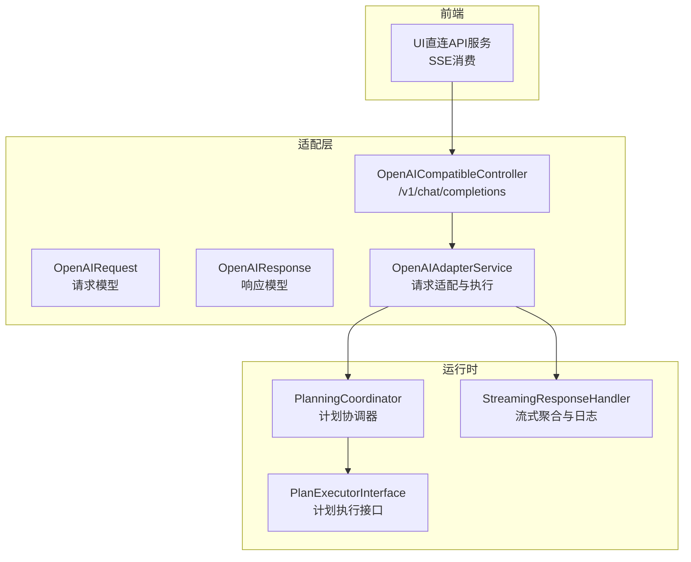
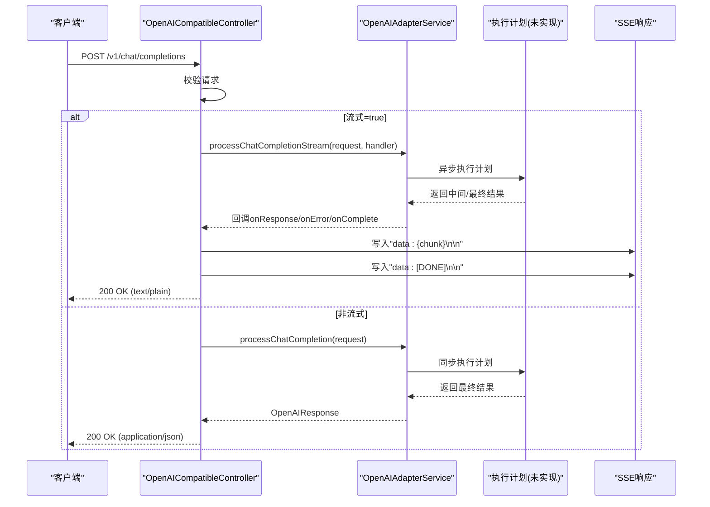
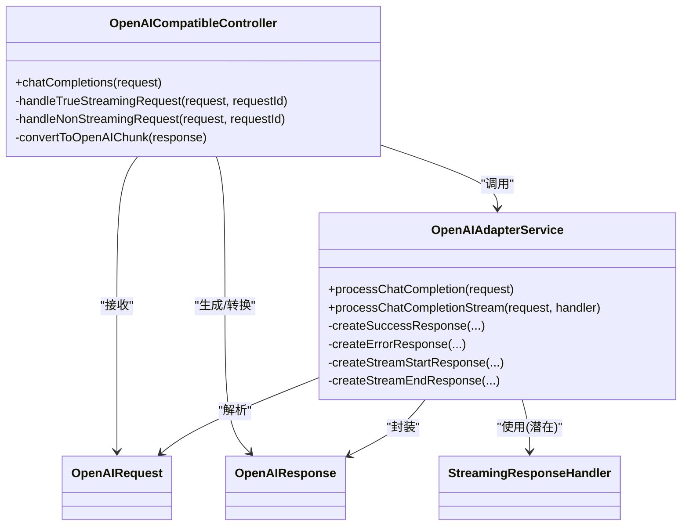

# 聊天补全API

<cite>
**本文引用的文件**
- [OpenAICompatibleController.java](file://src/main/java/com/alibaba/cloud/ai/lynxe/adapter/controller/OpenAICompatibleController.java)
- [OpenAIRequest.java](file://src/main/java/com/alibaba/cloud/ai/lynxe/adapter/model/OpenAIRequest.java)
- [OpenAIResponse.java](file://src/main/java/com/alibaba/cloud/ai/lynxe/adapter/model/OpenAIResponse.java)
- [OpenAIAdapterService.java](file://src/main/java/com/alibaba/cloud/ai/lynxe/adapter/service/OpenAIAdapterService.java)
- [StreamingResponseHandler.java](file://src/main/java/com/alibaba/cloud/ai/lynxe/llm/StreamingResponseHandler.java)
- [application.yml](file://src/main/resources/application.yml)
- [direct-api-service.ts](file://ui-vue3/src/api/direct-api-service.ts)
</cite>

## 目录
1. [简介](#简介)
2. [项目结构](#项目结构)
3. [核心组件](#核心组件)
4. [架构总览](#架构总览)
5. [详细组件分析](#详细组件分析)
6. [依赖关系分析](#依赖关系分析)
7. [性能与参数](#性能与参数)
8. [请求/响应示例](#请求响应示例)
9. [兼容性与差异说明](#兼容性与差异说明)
10. [故障排查指南](#故障排查指南)
11. [结论](#结论)

## 简介
本文件面向JManus项目的OpenAI兼容聊天补全API，聚焦/v1/chat/completions端点的实现机制，覆盖：
- 请求参数与消息格式
- 流式与非流式响应模式
- chatCompletions方法如何处理OpenAIRequest并委托OpenAIAdapterService执行内部计划转换
- handleTrueStreamingRequest中的SSE流式响应机制（数据块生成、完成标记“[DONE]”、错误处理）
- convertToOpenAIChunk如何将内部OpenAIResponse转换为OpenAI兼容的流式数据格式
- 包含多轮对话、工具调用等复杂场景的请求/响应示例
- 性能相关参数：超时（3分钟）、轮询间隔（100ms）
- 与OpenAI API的兼容性差异与常见问题排查

## 项目结构
OpenAI兼容API位于adapter模块，控制器负责路由与响应格式化，模型类承载请求/响应结构，适配服务负责将OpenAI格式转换为内部执行计划，并通过运行时协调器执行任务；前端通过SSE消费流式数据。

图表来源
- [OpenAICompatibleController.java](file://src/main/java/com/alibaba/cloud/ai/lynxe/adapter/controller/OpenAICompatibleController.java#L82-L116)
- [OpenAIAdapterService.java](file://src/main/java/com/alibaba/cloud/ai/lynxe/adapter/service/OpenAIAdapterService.java#L66-L97)
- [StreamingResponseHandler.java](file://src/main/java/com/alibaba/cloud/ai/lynxe/llm/StreamingResponseHandler.java#L153-L210)

章节来源
- [OpenAICompatibleController.java](file://src/main/java/com/alibaba/cloud/ai/lynxe/adapter/controller/OpenAICompatibleController.java#L82-L116)
- [OpenAIAdapterService.java](file://src/main/java/com/alibaba/cloud/ai/lynxe/adapter/service/OpenAIAdapterService.java#L66-L97)

## 核心组件
- OpenAICompatibleController：暴露/v1/chat/completions与/v1/models、/v1/health端点，负责请求校验、流式/非流式分支、SSE响应头与完成标记、错误转OpenAI格式。
- OpenAIRequest：承载OpenAI兼容的请求体，支持messages数组、temperature/top_p/max_tokens、stream/stream_options、tools/tool_choice、functions/function_call等标准字段。
- OpenAIResponse：承载OpenAI兼容的响应体，支持choices、usage、delta/message等字段。
- OpenAIAdapterService：将OpenAIRequest转换为内部执行上下文，调度执行计划，生成OpenAI兼容的响应或流式chunk。
- StreamingResponseHandler：对底层流式响应进行聚合、进度日志、早期终止（仅在非调试模式下）等处理。

章节来源
- [OpenAICompatibleController.java](file://src/main/java/com/alibaba/cloud/ai/lynxe/adapter/controller/OpenAICompatibleController.java#L82-L116)
- [OpenAIRequest.java](file://src/main/java/com/alibaba/cloud/ai/lynxe/adapter/model/OpenAIRequest.java#L24-L77)
- [OpenAIResponse.java](file://src/main/java/com/alibaba/cloud/ai/lynxe/adapter/model/OpenAIResponse.java#L24-L41)
- [OpenAIAdapterService.java](file://src/main/java/com/alibaba/cloud/ai/lynxe/adapter/service/OpenAIAdapterService.java#L66-L97)
- [StreamingResponseHandler.java](file://src/main/java/com/alibaba/cloud/ai/lynxe/llm/StreamingResponseHandler.java#L153-L210)

## 架构总览
/v1/chat/completions入口将请求分派到OpenAIAdapterService，后者根据是否流式选择同步或异步执行路径。非流式直接返回完整JSON；流式通过SSE向客户端推送多个“data: ...”行，最后以“data: [DONE]”结束。convertToOpenAIChunk负责把内部OpenAIResponse转换为OpenAI兼容的chunk格式。

图表来源
- [OpenAICompatibleController.java](file://src/main/java/com/alibaba/cloud/ai/lynxe/adapter/controller/OpenAICompatibleController.java#L108-L176)
- [OpenAICompatibleController.java](file://src/main/java/com/alibaba/cloud/ai/lynxe/adapter/controller/OpenAICompatibleController.java#L246-L261)
- [OpenAICompatibleController.java](file://src/main/java/com/alibaba/cloud/ai/lynxe/adapter/controller/OpenAICompatibleController.java#L187-L227)
- [OpenAIAdapterService.java](file://src/main/java/com/alibaba/cloud/ai/lynxe/adapter/service/OpenAIAdapterService.java#L102-L135)

## 详细组件分析

### 控制器：OpenAICompatibleController
- 入口：/v1/chat/completions
  - 校验请求合法性（messages非空且每条消息role/content有效）
  - 分支：stream=true走handleTrueStreamingRequest，否则走handleNonStreamingRequest
- 流式处理：
  - 使用OpenAIAdapterService.StreamResponseHandler回调收集chunk
  - 将每个OpenAIResponse转换为OpenAI兼容chunk（convertToOpenAIChunk），拼接为“data: ...”行
  - 完成后追加“data: [DONE]\n\n”
  - 超时控制：阻塞等待最多3分钟，轮询间隔100ms
  - 错误处理：捕获异常或回调onError，构造OpenAI格式错误chunk并返回
- 非流式处理：
  - 直接调用OpenAIAdapterService.processChatCompletion获取完整响应
  - 序列化为JSON并返回
- 响应头：
  - 流式：Content-Type=text/plain; Cache-Control=no-cache; Connection=keep-alive
  - 非流式：Content-Type=application/json

章节来源
- [OpenAICompatibleController.java](file://src/main/java/com/alibaba/cloud/ai/lynxe/adapter/controller/OpenAICompatibleController.java#L82-L116)
- [OpenAICompatibleController.java](file://src/main/java/com/alibaba/cloud/ai/lynxe/adapter/controller/OpenAICompatibleController.java#L118-L185)
- [OpenAICompatibleController.java](file://src/main/java/com/alibaba/cloud/ai/lynxe/adapter/controller/OpenAICompatibleController.java#L187-L227)
- [OpenAICompatibleController.java](file://src/main/java/com/alibaba/cloud/ai/lynxe/adapter/controller/OpenAICompatibleController.java#L246-L261)

### 适配服务：OpenAIAdapterService
- processChatCompletion：提取用户消息，准备执行上下文，执行计划（当前抛出未实现异常），封装为OpenAIResponse（含usage估算）。
- processChatCompletionStream：提取用户消息，健康检查短路返回，否则准备执行上下文并启动异步执行（当前抛出未实现异常），通过StreamResponseHandler回调推送开始/内容/完成事件。
- createSuccessResponse/createErrorResponse/createStreamStartResponse/createStreamEndResponse：统一生成OpenAI兼容响应结构。
- isHealthCheckMessage/generateHealthCheckContent：对简单问候/健康检查快速返回。

注意：当前执行计划（executePlan/executePlanWithStreaming）在适配服务中为占位实现，抛出未实现异常。这意味着实际流式/非流式执行逻辑尚未接入。

章节来源
- [OpenAIAdapterService.java](file://src/main/java/com/alibaba/cloud/ai/lynxe/adapter/service/OpenAIAdapterService.java#L66-L97)
- [OpenAIAdapterService.java](file://src/main/java/com/alibaba/cloud/ai/lynxe/adapter/service/OpenAIAdapterService.java#L102-L135)
- [OpenAIAdapterService.java](file://src/main/java/com/alibaba/cloud/ai/lynxe/adapter/service/OpenAIAdapterService.java#L348-L399)
- [OpenAIAdapterService.java](file://src/main/java/com/alibaba/cloud/ai/lynxe/adapter/service/OpenAIAdapterService.java#L498-L524)

### 请求模型：OpenAIRequest
- 支持字段：model、messages（Message数组）、temperature、top_p、max_tokens、stream、stream_options、functions、function_call、tools、tool_choice、user、seed、n、stop、frequency_penalty、presence_penalty、logit_bias、logprobs、top_logprobs
- Message：role、content（字符串或包含text元素的数组）、name、function_call、tool_calls
- 工具相关：Tool.function、ToolCall.function

章节来源
- [OpenAIRequest.java](file://src/main/java/com/alibaba/cloud/ai/lynxe/adapter/model/OpenAIRequest.java#L24-L77)
- [OpenAIRequest.java](file://src/main/java/com/alibaba/cloud/ai/lynxe/adapter/model/OpenAIRequest.java#L244-L351)
- [OpenAIRequest.java](file://src/main/java/com/alibaba/cloud/ai/lynxe/adapter/model/OpenAIRequest.java#L392-L488)

### 响应模型：OpenAIResponse
- 字段：id、object、created、model、system_fingerprint、choices（Choice）、usage（Usage）
- Choice：index、message、delta、finish_reason、logprobs
- Message/Delta：role、content、function_call、tool_calls
- Usage：prompt_tokens、completion_tokens、total_tokens、prompt_tokens_details、completion_tokens_details

章节来源
- [OpenAIResponse.java](file://src/main/java/com/alibaba/cloud/ai/lynxe/adapter/model/OpenAIResponse.java#L24-L41)
- [OpenAIResponse.java](file://src/main/java/com/alibaba/cloud/ai/lynxe/adapter/model/OpenAIResponse.java#L104-L162)
- [OpenAIResponse.java](file://src/main/java/com/alibaba/cloud/ai/lynxe/adapter/model/OpenAIResponse.java#L164-L218)
- [OpenAIResponse.java](file://src/main/java/com/alibaba/cloud/ai/lynxe/adapter/model/OpenAIResponse.java#L220-L274)
- [OpenAIResponse.java](file://src/main/java/com/alibaba/cloud/ai/lynxe/adapter/model/OpenAIResponse.java#L276-L423)
- [OpenAIResponse.java](file://src/main/java/com/alibaba/cloud/ai/lynxe/adapter/model/OpenAIResponse.java#L424-L629)

### 流式聚合与日志：StreamingResponseHandler
- 对Flux<ChatResponse>进行合并，累积文本与工具调用，周期性输出进度日志
- 在非调试模式下，当检测到仅有思考文本而无工具调用时可提前终止流
- 提供文本-only与带工具调用两种处理路径

章节来源
- [StreamingResponseHandler.java](file://src/main/java/com/alibaba/cloud/ai/lynxe/llm/StreamingResponseHandler.java#L153-L210)
- [StreamingResponseHandler.java](file://src/main/java/com/alibaba/cloud/ai/lynxe/llm/StreamingResponseHandler.java#L210-L347)
- [StreamingResponseHandler.java](file://src/main/java/com/alibaba/cloud/ai/lynxe/llm/StreamingResponseHandler.java#L451-L468)

## 依赖关系分析
- 控制器依赖适配服务进行请求处理与响应格式化
- 适配服务当前未实现具体执行逻辑，仅负责结构化转换与错误封装
- 流式聚合组件用于底层流式响应的合并与日志，与控制器的SSE输出解耦

图表来源
- [OpenAICompatibleController.java](file://src/main/java/com/alibaba/cloud/ai/lynxe/adapter/controller/OpenAICompatibleController.java#L82-L116)
- [OpenAIAdapterService.java](file://src/main/java/com/alibaba/cloud/ai/lynxe/adapter/service/OpenAIAdapterService.java#L66-L97)
- [OpenAIRequest.java](file://src/main/java/com/alibaba/cloud/ai/lynxe/adapter/model/OpenAIRequest.java#L24-L77)
- [OpenAIResponse.java](file://src/main/java/com/alibaba/cloud/ai/lynxe/adapter/model/OpenAIResponse.java#L24-L41)
- [StreamingResponseHandler.java](file://src/main/java/com/alibaba/cloud/ai/lynxe/llm/StreamingResponseHandler.java#L153-L210)

## 性能与参数
- 流式超时：3分钟（180秒）
- 轮询间隔：100ms
- 轮询配置（计划执行相关）：轮询开关、最大尝试次数、轮询间隔、连接/读取超时、指数退避参数（来自应用配置）

章节来源
- [OpenAICompatibleController.java](file://src/main/java/com/alibaba/cloud/ai/lynxe/adapter/controller/OpenAICompatibleController.java#L57-L61)
- [application.yml](file://src/main/resources/application.yml#L60-L78)

## 请求/响应示例

### 非流式：基础问答
- 请求
  - 方法：POST
  - 路径：/v1/chat/completions
  - 头部：Content-Type: application/json
  - 请求体：包含model、messages（至少一条role=user）、可选temperature/top_p/max_tokens等
- 响应
  - 状态码：200
  - 头部：Content-Type: application/json
  - 响应体：包含choices（含message/content）、usage等

章节来源
- [OpenAICompatibleController.java](file://src/main/java/com/alibaba/cloud/ai/lynxe/adapter/controller/OpenAICompatibleController.java#L246-L261)
- [OpenAIRequest.java](file://src/main/java/com/alibaba/cloud/ai/lynxe/adapter/model/OpenAIRequest.java#L24-L77)
- [OpenAIResponse.java](file://src/main/java/com/alibaba/cloud/ai/lynxe/adapter/model/OpenAIResponse.java#L24-L41)

### 流式：SSE数据块与完成标记
- 请求
  - 方法：POST
  - 路径：/v1/chat/completions
  - 头部：Content-Type: application/json
  - 请求体：包含stream=true与messages等
- 响应
  - 状态码：200
  - 头部：Content-Type: text/plain; charset=utf-8, Cache-Control: no-cache, Connection: keep-alive
  - 数据块：每条以"data: "开头的JSON行，最后以"data: [DONE]"结束
  - 错误：若发生错误，会先返回一个OpenAI格式的错误chunk，再发送完成标记

章节来源
- [OpenAICompatibleController.java](file://src/main/java/com/alibaba/cloud/ai/lynxe/adapter/controller/OpenAICompatibleController.java#L118-L185)
- [OpenAICompatibleController.java](file://src/main/java/com/alibaba/cloud/ai/lynxe/adapter/controller/OpenAICompatibleController.java#L187-L227)

### 多轮对话与工具调用
- 多轮对话：messages数组按时间顺序包含多条Message，最后一条通常为用户消息
- 工具调用：OpenAIRequest支持tools/tool_choice与function_call；OpenAIResponse支持choices[].delta/message.tool_calls
- 注意：当前适配服务的执行计划尚未实现，工具调用链路仍为占位

章节来源
- [OpenAIRequest.java](file://src/main/java/com/alibaba/cloud/ai/lynxe/adapter/model/OpenAIRequest.java#L24-L77)
- [OpenAIRequest.java](file://src/main/java/com/alibaba/cloud/ai/lynxe/adapter/model/OpenAIRequest.java#L244-L351)
- [OpenAIResponse.java](file://src/main/java/com/alibaba/cloud/ai/lynxe/adapter/model/OpenAIResponse.java#L104-L162)
- [OpenAIResponse.java](file://src/main/java/com/alibaba/cloud/ai/lynxe/adapter/model/OpenAIResponse.java#L164-L218)

## 兼容性与差异说明
- 兼容点
  - 端点与请求/响应字段与OpenAI v1/chat/completions高度一致（model、messages、stream、tools、function_call、usage等）
  - 流式响应采用SSE格式，逐行"data: ..."，最后"[DONE]"
- 已知差异
  - 执行计划未实现：OpenAIAdapterService.executePlan/executePlanWithStreaming当前抛出未实现异常，导致流式/非流式均无法产生真实输出
  - usage估算：基于字符长度粗略估算token数，非精确统计
  - 健康检查短路：当检测到简单问候/健康检查时，控制器直接返回预设响应，不进入执行流程

章节来源
- [OpenAICompatibleController.java](file://src/main/java/com/alibaba/cloud/ai/lynxe/adapter/controller/OpenAICompatibleController.java#L118-L185)
- [OpenAIAdapterService.java](file://src/main/java/com/alibaba/cloud/ai/lynxe/adapter/service/OpenAIAdapterService.java#L207-L235)
- [OpenAIAdapterService.java](file://src/main/java/com/alibaba/cloud/ai/lynxe/adapter/service/OpenAIAdapterService.java#L348-L399)

## 故障排查指南
- 400错误：请求非法（messages为空或消息缺少role/content）
  - 排查：确认messages非空且每条消息role与content有效
- 500错误：内部异常或执行计划未实现
  - 排查：查看控制器与适配服务的日志；确认执行计划实现已接入
- 流式无输出或提前结束
  - 排查：确认适配服务已正确实现executePlanWithStreaming；检查SSE写入与完成标记
- 前端SSE解析失败
  - 排查：确保按“data: ...”行分割，遇到“data: [DONE]”停止；参考前端实现的读取与解析逻辑

章节来源
- [OpenAICompatibleController.java](file://src/main/java/com/alibaba/cloud/ai/lynxe/adapter/controller/OpenAICompatibleController.java#L118-L185)
- [OpenAICompatibleController.java](file://src/main/java/com/alibaba/cloud/ai/lynxe/adapter/controller/OpenAICompatibleController.java#L187-L227)
- [OpenAICompatibleController.java](file://src/main/java/com/alibaba/cloud/ai/lynxe/adapter/controller/OpenAICompatibleController.java#L246-L261)
- [direct-api-service.ts](file://ui-vue3/src/api/direct-api-service.ts#L113-L211)

## 结论
JManus的OpenAI兼容聊天补全API在控制器与模型层面已基本对齐OpenAI规范，SSE流式响应与错误处理也已实现。但当前执行计划尚未接入，导致所有请求（包括流式）均无法产生真实输出。建议优先完成OpenAIAdapterService的执行计划实现，并完善工具调用与usage统计，以达到与OpenAI API一致的功能与性能表现。