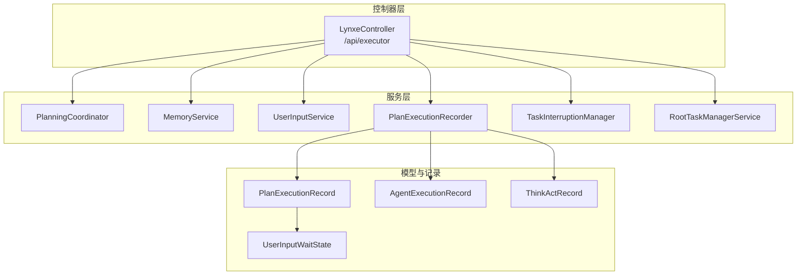
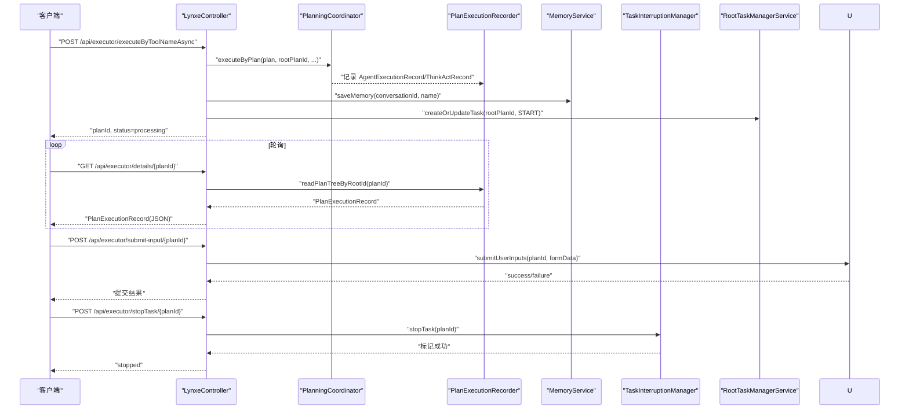
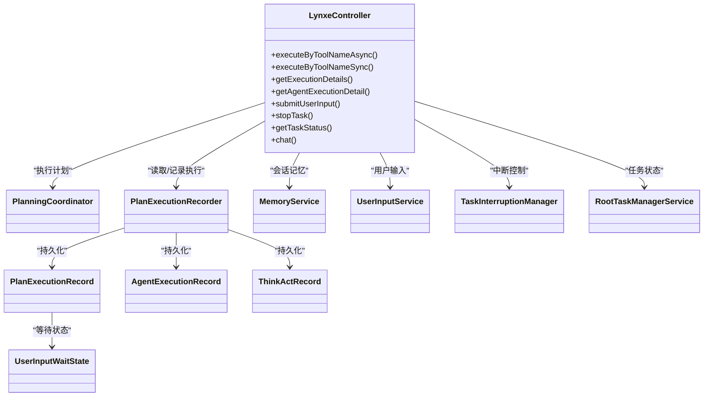
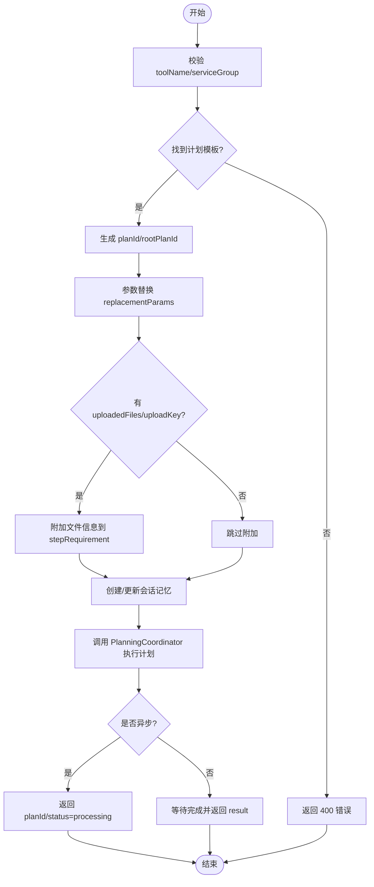

# REST API

<cite>
**本文引用的文件**
- [LynxeController.java](file://src/main/java/com/alibaba/cloud/ai/lynxe/runtime/controller/LynxeController.java)
- [PlanExecutionRecord.java](file://src/main/java/com/alibaba/cloud/ai/lynxe/recorder/entity/vo/PlanExecutionRecord.java)
- [UserInputWaitState.java](file://src/main/java/com/alibaba/cloud/ai/lynxe/runtime/entity/vo/UserInputWaitState.java)
- [AgentExecutionRecord.java](file://src/main/java/com/alibaba/cloud/ai/lynxe/recorder/entity/vo/AgentExecutionRecord.java)
- [ThinkActRecord.java](file://src/main/java/com/alibaba/cloud/ai/lynxe/recorder/entity/vo/ThinkActRecord.java)
- [PlanExecutionRecorder.java](file://src/main/java/com/alibaba/cloud/ai/lynxe/recorder/service/NewRepoPlanExecutionRecorder.java)
- [README-dev.md](file://README-dev.md)
- [application.yml](file://src/main/resources/application.yml)
- [common-api-service.ts](file://ui-vue3/src/api/common-api-service.ts)
</cite>

## 目录
1. [简介](#简介)
2. [项目结构](#项目结构)
3. [核心组件](#核心组件)
4. [架构总览](#架构总览)
5. [详细组件分析](#详细组件分析)
6. [依赖关系分析](#依赖关系分析)
7. [性能考量](#性能考量)
8. [故障排查指南](#故障排查指南)
9. [结论](#结论)
10. [附录](#附录)

## 简介
本文件为 JManus 平台 Lynxe 执行器 REST API 参考文档，聚焦 LynxeController 提供的核心执行与查询接口，覆盖以下能力：
- 异步执行：executeByToolNameAsync
- 同步执行：executeByToolNameSync（含 GET 兼容入口）
- 执行详情查询：getExecutionDetails
- 步骤详情查询：getAgentExecutionDetail
- 用户输入提交：submitUserInput
- 任务中断：stopTask
- 任务状态查询：getTaskStatus
- 聊天流式接口：chat（SSE）

本文档对每个端点的 HTTP 方法、URL、请求参数、请求体、响应格式、状态码、错误处理、认证方式、使用场景与最佳实践进行系统性说明，并给出多语言客户端调用指引与排障建议。

## 项目结构
- 控制器层：LynxeController 提供 /api/executor 下的全部执行与查询接口
- 记录与模型：PlanExecutionRecord、AgentExecutionRecord、ThinkActRecord、UserInputWaitState 等 VO/实体承载执行状态与结果
- 服务层：Planner 协调、参数映射、文件上传同步、内存管理、任务中断管理等
- 前端示例：ui-vue3 提供通用 API 服务封装与轮询逻辑，便于客户端对接

图表来源
- [LynxeController.java](file://src/main/java/com/alibaba/cloud/ai/lynxe/runtime/controller/LynxeController.java#L91-L120)
- [PlanExecutionRecord.java](file://src/main/java/com/alibaba/cloud/ai/lynxe/recorder/entity/vo/PlanExecutionRecord.java#L1-L120)
- [AgentExecutionRecord.java](file://src/main/java/com/alibaba/cloud/ai/lynxe/recorder/entity/vo/AgentExecutionRecord.java#L60-L113)
- [ThinkActRecord.java](file://src/main/java/com/alibaba/cloud/ai/lynxe/recorder/entity/vo/ThinkActRecord.java#L18-L157)
- [UserInputWaitState.java](file://src/main/java/com/alibaba/cloud/ai/lynxe/runtime/entity/vo/UserInputWaitState.java#L1-L84)

章节来源
- [LynxeController.java](file://src/main/java/com/alibaba/cloud/ai/lynxe/runtime/controller/LynxeController.java#L91-L120)
- [PlanExecutionRecord.java](file://src/main/java/com/alibaba/cloud/ai/lynxe/recorder/entity/vo/PlanExecutionRecord.java#L1-L120)

## 核心组件
- LynxeController：统一入口，负责接收请求、参数校验、调用规划协调器、记录执行状态、返回响应
- PlanExecutionRecord：执行记录核心数据结构，包含计划标识、执行阶段、代理执行序列、用户输入等待状态、结构化结果等
- AgentExecutionRecord：单个代理的执行记录，包含思考-行动步骤、子计划记录、状态与结果
- ThinkActRecord：思考-行动阶段记录，包含输入输出、工具调用信息、字符计数、状态与错误
- UserInputWaitState：用户输入等待状态，用于表单输入场景
- PlanExecutionRecorder：执行记录持久化与查询服务
- TaskInterruptionManager/RootTaskManagerService：任务中断与状态管理
- MemoryService：会话记忆管理（conversationId）
- UserInputService：用户输入提交与等待状态管理

章节来源
- [LynxeController.java](file://src/main/java/com/alibaba/cloud/ai/lynxe/runtime/controller/LynxeController.java#L91-L120)
- [PlanExecutionRecord.java](file://src/main/java/com/alibaba/cloud/ai/lynxe/recorder/entity/vo/PlanExecutionRecord.java#L1-L200)
- [AgentExecutionRecord.java](file://src/main/java/com/alibaba/cloud/ai/lynxe/recorder/entity/vo/AgentExecutionRecord.java#L60-L113)
- [ThinkActRecord.java](file://src/main/java/com/alibaba/cloud/ai/lynxe/recorder/entity/vo/ThinkActRecord.java#L18-L157)
- [UserInputWaitState.java](file://src/main/java/com/alibaba/cloud/ai/lynxe/runtime/entity/vo/UserInputWaitState.java#L1-L84)
- [PlanExecutionRecorder.java](file://src/main/java/com/alibaba/cloud/ai/lynxe/recorder/service/NewRepoPlanExecutionRecorder.java#L411-L440)

## 架构总览
下图展示 LynxeController 与各服务之间的交互关系与数据流向。

图表来源
- [LynxeController.java](file://src/main/java/com/alibaba/cloud/ai/lynxe/runtime/controller/LynxeController.java#L219-L315)
- [LynxeController.java](file://src/main/java/com/alibaba/cloud/ai/lynxe/runtime/controller/LynxeController.java#L377-L440)
- [LynxeController.java](file://src/main/java/com/alibaba/cloud/ai/lynxe/runtime/controller/LynxeController.java#L466-L497)
- [LynxeController.java](file://src/main/java/com/alibaba/cloud/ai/lynxe/runtime/controller/LynxeController.java#L828-L865)
- [PlanExecutionRecorder.java](file://src/main/java/com/alibaba/cloud/ai/lynxe/recorder/service/NewRepoPlanExecutionRecorder.java#L411-L440)

## 详细组件分析

### API：executeByToolNameAsync（异步执行）
- HTTP 方法：POST
- URL：/api/executor/executeByToolNameAsync
- 请求体参数
  - toolName：字符串，必填，工具名称
  - serviceGroup：字符串，可选，服务分组，用于区分同名工具
  - replacementParams：对象，可选，用于替换计划模板中的占位符 <<param>>
  - uploadedFiles：字符串数组，可选，上传文件名列表（与 uploadKey 配合使用）
  - uploadKey：字符串，可选，上传会话标识，用于同步文件到计划工作目录
  - conversationId：字符串，可选，会话标识；当请求源为 VUE_DIALOG/VUE_SIDEBAR 且启用会话记忆时会生成新会话
  - requestSource：枚举字符串，可选，请求来源（HTTP_REQUEST/VUE_SIDEBAR/VUE_DIALOG），默认 HTTP_REQUEST
- 响应
  - planId：字符串，任务根计划 ID
  - status：字符串，初始状态 processing
  - message：字符串，提示信息
  - conversationId：字符串，会话 ID
  - toolName：字符串，工具名称
  - planTemplateId：字符串，计划模板 ID
- 状态码
  - 200：成功
  - 400：参数缺失或工具不存在
  - 500：内部错误
- 使用场景
  - 长耗时任务，立即返回 planId，后续轮询 details 获取结果
- 注意事项
  - 若未提供 conversationId 且请求源为 VUE_DIALOG/VUE_SIDEBAR，将生成新会话
  - uploadedFiles 与 uploadKey 需配对使用，确保文件同步到计划目录
- 错误处理
  - 工具名为空或未找到：返回 400
  - 执行异常：返回 500，包含错误信息
- 认证方式
  - 从请求头读取 Authorization 与 USERNAME，并写入 AuthContext，用于后续工具调用
- 请求示例（JSON）
  - {
      "toolName": "my-tool",
      "serviceGroup": "research",
      "replacementParams": {"param1": "value1"},
      "uploadedFiles": ["file1.pdf", "file2.txt"],
      "uploadKey": "upload-xxx",
      "conversationId": "conv-123",
      "requestSource": "HTTP_REQUEST"
    }
- 响应示例（JSON）
  - {
      "planId": "plan-123456",
      "status": "processing",
      "message": "Task submitted, processing",
      "conversationId": "conv-123",
      "toolName": "my-tool",
      "planTemplateId": "template-456"
    }

章节来源
- [LynxeController.java](file://src/main/java/com/alibaba/cloud/ai/lynxe/runtime/controller/LynxeController.java#L219-L315)
- [README-dev.md](file://README-dev.md#L37-L101)

### API：executeByToolNameSync（同步执行）
- HTTP 方法：POST
- URL：/api/executor/executeByToolNameSync
- 请求体参数：同 executeByToolNameAsync
- 响应
  - status：字符串，completed
  - result：对象或字符串，最终执行结果
  - conversationId：字符串，会话 ID
- 状态码
  - 200：成功
  - 400：参数缺失或工具不存在
  - 500：执行失败
- 使用场景
  - 快速任务，等待完成后直接返回结果
- 错误处理
  - 工具名为空或未找到：返回 400
  - 执行异常：返回 500，包含错误信息
- 认证方式
  - 同上，从请求头读取 Authorization 与 USERNAME
- 请求示例（JSON）
  - 同上
- 响应示例（JSON）
  - {
      "status": "completed",
      "result": "执行结果",
      "conversationId": "conv-123"
    }

章节来源
- [LynxeController.java](file://src/main/java/com/alibaba/cloud/ai/lynxe/runtime/controller/LynxeController.java#L322-L368)

### API：executeByToolNameSync（GET 兼容入口）
- HTTP 方法：GET
- URL：/api/executor/executeByToolNameSync/{toolName}
- 查询参数
  - allParams：键值对，可选，作为参数传入
  - serviceGroup：字符串，可选，服务分组
- 响应：同 POST 同步执行
- 使用场景
  - 兼容 GET 方式触发同步执行
- 注意事项
  - 参数通过查询字符串 allParams 传递，不支持复杂对象

章节来源
- [LynxeController.java](file://src/main/java/com/alibaba/cloud/ai/lynxe/runtime/controller/LynxeController.java#L183-L212)

### API：getExecutionDetails（执行详情）
- HTTP 方法：GET
- URL：/api/executor/details/{planId}
- 路径参数
  - planId：字符串，必填，根计划 ID
- 响应
  - PlanExecutionRecord 对象，包含：
    - currentPlanId/rootPlanId/title/status/completed/summary
    - agentExecutionSequence：代理执行序列
    - userInputWaitState：用户输入等待状态（若存在）
    - structureResult：任务完成时提取的最后工具调用结果（结构化）
    - subPlanExecutionRecords：子计划执行记录（支持嵌套）
- 状态码
  - 200：成功
  - 400：planId 为空
  - 404：未找到
  - 500：序列化错误
- 使用场景
  - 前端轮询跟踪任务进度、查看完整执行历史、判断是否需要用户输入
- 错误处理
  - planId 为空：返回 400
  - 未找到：返回 404
  - 序列化异常：返回 500
- 认证方式
  - 无特殊认证要求
- 响应示例（JSON）
  - 包含 PlanExecutionRecord 的完整结构，详见“数据模型”章节

章节来源
- [LynxeController.java](file://src/main/java/com/alibaba/cloud/ai/lynxe/runtime/controller/LynxeController.java#L377-L440)
- [PlanExecutionRecord.java](file://src/main/java/com/alibaba/cloud/ai/lynxe/recorder/entity/vo/PlanExecutionRecord.java#L1-L200)

### API：getAgentExecutionDetail（步骤详情）
- HTTP 方法：GET
- URL：/api/executor/agent-execution/{stepId}
- 路径参数
  - stepId：字符串，必填，步骤 ID
- 响应
  - AgentExecutionRecord 对象，包含：
    - agentName/agentRequest/agentDescription/result/errorMessage/status
    - thinkActSteps：思考-行动记录列表
- 状态码
  - 200：成功
  - 404：未找到
  - 500：内部错误
- 使用场景
  - 查看单个步骤的思考过程与工具调用明细
- 响应示例（JSON）
  - 包含 AgentExecutionRecord 的结构，详见“数据模型”章节

章节来源
- [LynxeController.java](file://src/main/java/com/alibaba/cloud/ai/lynxe/runtime/controller/LynxeController.java#L688-L706)
- [AgentExecutionRecord.java](file://src/main/java/com/alibaba/cloud/ai/lynxe/recorder/entity/vo/AgentExecutionRecord.java#L60-L113)

### API：submitUserInput（提交用户输入）
- HTTP 方法：POST
- URL：/api/executor/submit-input/{planId}
- 路径参数
  - planId：字符串，必填，根计划 ID
- 请求体
  - 表单字段键值对，例如：{"field1":"value1","field2":"value2"}
- 响应
  - message：字符串，提交成功提示
  - planId：字符串，提交的目标计划 ID
- 状态码
  - 200：成功
  - 400：当前计划未处于等待用户输入状态
  - 500：内部错误
- 使用场景
  - 当任务因表单输入而暂停时，前端引导用户填写并提交
- 错误处理
  - 未等待输入：返回 400
  - 异常：返回 500
- 认证方式
  - 无特殊认证要求

章节来源
- [LynxeController.java](file://src/main/java/com/alibaba/cloud/ai/lynxe/runtime/controller/LynxeController.java#L466-L497)
- [UserInputWaitState.java](file://src/main/java/com/alibaba/cloud/ai/lynxe/runtime/entity/vo/UserInputWaitState.java#L1-L84)

### API：stopTask（停止任务）
- HTTP 方法：POST
- URL：/api/executor/stopTask/{planId}
- 路径参数
  - planId：字符串，必填，根计划 ID
- 响应
  - status：字符串，stopped
  - planId：字符串
  - message：字符串
  - taskMarkedForStop：布尔，是否成功标记停止
  - wasRunning：布尔，是否当时处于运行中
- 状态码
  - 200：成功
  - 400：未找到活动任务
  - 500：内部错误
- 使用场景
  - 用户主动中断长时间运行的任务
- 错误处理
  - 未找到任务：返回 400
  - 异常：返回 500
- 认证方式
  - 无特殊认证要求

章节来源
- [LynxeController.java](file://src/main/java/com/alibaba/cloud/ai/lynxe/runtime/controller/LynxeController.java#L828-L865)

### API：getTaskStatus（任务状态）
- HTTP 方法：GET
- URL：/api/executor/taskStatus/{planId}
- 路径参数
  - planId：字符串，必填
- 响应
  - planId/isRunning/exists
  - desiredState/startTime/endTime/lastUpdated/taskResult（若存在）
- 状态码
  - 200：成功
  - 500：内部错误
- 使用场景
  - 快速判断任务是否存在、是否运行中、运行时长等元信息

章节来源
- [LynxeController.java](file://src/main/java/com/alibaba/cloud/ai/lynxe/runtime/controller/LynxeController.java#L871-L909)

### API：chat（SSE 流式聊天）
- HTTP 方法：POST
- URL：/api/executor/chat
- 请求体
  - input：字符串，必填，用户消息
  - conversationId：字符串，可选
  - uploadedFiles：字符串数组，可选
  - uploadKey：字符串，可选
- 响应
  - 文本事件流（SSE），逐段返回增量文本片段
- 状态码
  - 200：成功
  - 400：输入为空
  - 500：内部错误
- 使用场景
  - 无需计划执行的纯对话式 LLM 交互，支持流式输出

章节来源
- [LynxeController.java](file://src/main/java/com/alibaba/cloud/ai/lynxe/runtime/controller/LynxeController.java#L1005-L1019)

## 依赖关系分析

图表来源
- [LynxeController.java](file://src/main/java/com/alibaba/cloud/ai/lynxe/runtime/controller/LynxeController.java#L91-L120)
- [PlanExecutionRecord.java](file://src/main/java/com/alibaba/cloud/ai/lynxe/recorder/entity/vo/PlanExecutionRecord.java#L1-L120)
- [AgentExecutionRecord.java](file://src/main/java/com/alibaba/cloud/ai/lynxe/recorder/entity/vo/AgentExecutionRecord.java#L60-L113)
- [ThinkActRecord.java](file://src/main/java/com/alibaba/cloud/ai/lynxe/recorder/entity/vo/ThinkActRecord.java#L18-L157)
- [UserInputWaitState.java](file://src/main/java/com/alibaba/cloud/ai/lynxe/runtime/entity/vo/UserInputWaitState.java#L1-L84)

## 性能考量
- 异步执行优先：长任务使用 executeByToolNameAsync，避免阻塞线程
- 轮询策略：前端默认每 1 秒轮询一次，可在应用配置中调整轮询间隔与最大尝试次数
- 文件上传：建议同时提供 uploadedFiles 与 uploadKey，确保文件同步到计划目录
- 会话记忆：当启用会话记忆时，VUE_DIALOG/VUE_SIDEBAR 请求会生成新会话，避免跨会话干扰
- 数据序列化：PlanExecutionRecord 使用 Jackson 序列化，注意避免过大的响应体导致网络压力

章节来源
- [application.yml](file://src/main/resources/application.yml#L60-L98)
- [LynxeController.java](file://src/main/java/com/alibaba/cloud/ai/lynxe/runtime/controller/LynxeController.java#L922-L950)

## 故障排查指南
- 工具名无效
  - 现象：返回 400，提示工具不存在
  - 处理：确认 toolName 与 serviceGroup 组合正确
- 未找到执行记录
  - 现象：details 返回 404
  - 处理：确认 planId 正确，或检查任务是否已结束
- 未处于等待输入状态
  - 现象：submit-input 返回 400
  - 处理：先调用 details 确认 userInputWaitState，再提交
- 无法停止任务
  - 现象：stopTask 返回 400
  - 处理：确认 planId 是否有效，或任务是否仍在运行
- 响应序列化失败
  - 现象：details 返回 500
  - 处理：检查 PlanExecutionRecord 结构是否异常
- 前端轮询
  - 建议：使用前端封装的 getDetails 方法，自动处理 404 与网络异常

章节来源
- [LynxeController.java](file://src/main/java/com/alibaba/cloud/ai/lynxe/runtime/controller/LynxeController.java#L377-L440)
- [LynxeController.java](file://src/main/java/com/alibaba/cloud/ai/lynxe/runtime/controller/LynxeController.java#L466-L497)
- [LynxeController.java](file://src/main/java/com/alibaba/cloud/ai/lynxe/runtime/controller/LynxeController.java#L828-L865)
- [common-api-service.ts](file://ui-vue3/src/api/common-api-service.ts#L1-L125)

## 结论
LynxeController 提供了完善的执行与查询接口，覆盖异步执行、同步执行、执行详情、步骤详情、用户输入、任务中断与状态查询等核心能力。通过 PlanExecutionRecord 等数据模型，系统实现了对复杂执行流程的可观测与可控性。建议在生产环境中优先采用异步执行+轮询模式，并结合会话记忆与文件上传策略提升用户体验与稳定性。

## 附录

### 数据模型：PlanExecutionRecord
- 关键字段
  - currentPlanId/rootPlanId/parentPlanId/toolCallId/title/userRequest
  - startTime/endTime/currentStepIndex/completed/summary
  - agentExecutionSequence：代理执行序列
  - userInputWaitState：用户输入等待状态
  - modelName/parentActToolCall/structureResult/subPlanExecutionRecords
- 说明
  - 该对象由后端记录并返回，前端可据此渲染执行树与子计划

章节来源
- [PlanExecutionRecord.java](file://src/main/java/com/alibaba/cloud/ai/lynxe/recorder/entity/vo/PlanExecutionRecord.java#L1-L200)

### 数据模型：AgentExecutionRecord
- 关键字段
  - stepId/conversationId/agentName/agentDescription/startTime/endTime
  - maxSteps/currentStep/status/agentRequest/result/errorMessage/modelName
  - thinkActSteps：思考-行动记录列表
  - subPlanExecutionRecords：子计划执行记录列表

章节来源
- [AgentExecutionRecord.java](file://src/main/java/com/alibaba/cloud/ai/lynxe/recorder/entity/vo/AgentExecutionRecord.java#L60-L113)

### 数据模型：ThinkActRecord
- 关键字段
  - thinkStartTime/thinkInput/thinkOutput/thinkEndTime
  - actStartTime/actionNeeded/actionDescription/actionResult/actEndTime
  - status/errorMessage/inputCharCount/outputCharCount/toolName/toolParameters
  - actToolInfoList：工具调用信息列表

章节来源
- [ThinkActRecord.java](file://src/main/java/com/alibaba/cloud/ai/lynxe/recorder/entity/vo/ThinkActRecord.java#L18-L157)

### 数据模型：UserInputWaitState
- 关键字段
  - planId/title/waiting/formDescription/formInputs

章节来源
- [UserInputWaitState.java](file://src/main/java/com/alibaba/cloud/ai/lynxe/runtime/entity/vo/UserInputWaitState.java#L1-L84)

### API 版本管理策略
- 当前仓库未发现显式的 API 版本号或路径版本化（如 /api/v1/）。建议在接入层增加版本前缀，以便未来演进与兼容性管理。

章节来源
- [LynxeController.java](file://src/main/java/com/alibaba/cloud/ai/lynxe/runtime/controller/LynxeController.java#L91-L120)

### 速率限制与安全性
- 速率限制
  - 未发现内置限流策略。建议在网关或反向代理层引入基于 IP/Key 的限流规则
- 安全性
  - 认证：后端从请求头读取 Authorization 与 USERNAME，并写入 AuthContext，用于后续工具调用
  - 建议：在网关层强制鉴权，确保 Authorization 有效性；敏感头部避免泄露
- CORS
  - 未在控制器层显式声明跨域策略，建议在全局配置中明确允许的来源与方法

章节来源
- [LynxeController.java](file://src/main/java/com/alibaba/cloud/ai/lynxe/runtime/controller/LynxeController.java#L585-L596)

### 客户端开发指南（多语言）
- 通用建议
  - 使用异步执行 + 轮询模式，避免阻塞
  - 保持 conversationId 一致性，确保会话记忆生效
  - 同时提供 uploadedFiles 与 uploadKey，确保文件可用
- 前端（Vue/TS）
  - 参考 common-api-service.ts 的封装，统一处理 404、网络异常与 JSON 解析
  - 使用 getDetails 轮询执行详情，根据 completed 字段切换 UI
- Java 客户端
  - 使用 RestTemplate/OkHttp/HttpClient 发送 POST/GET 请求
  - 设置 Content-Type: application/json
  - 处理 400/404/500 状态码与错误消息
- Python 客户端
  - 使用 requests 库发送请求
  - 对于 SSE 场景，可使用 sseclient 或自定义循环读取
- Go 客户端
  - 使用 net/http 发送请求，解析 JSON
  - 对于 SSE，使用第三方库或自建 Reader

章节来源
- [README-dev.md](file://README-dev.md#L100-L279)
- [common-api-service.ts](file://ui-vue3/src/api/common-api-service.ts#L1-L125)

### 执行流程与参数替换流程

图表来源
- [LynxeController.java](file://src/main/java/com/alibaba/cloud/ai/lynxe/runtime/controller/LynxeController.java#L219-L315)
- [LynxeController.java](file://src/main/java/com/alibaba/cloud/ai/lynxe/runtime/controller/LynxeController.java#L569-L681)