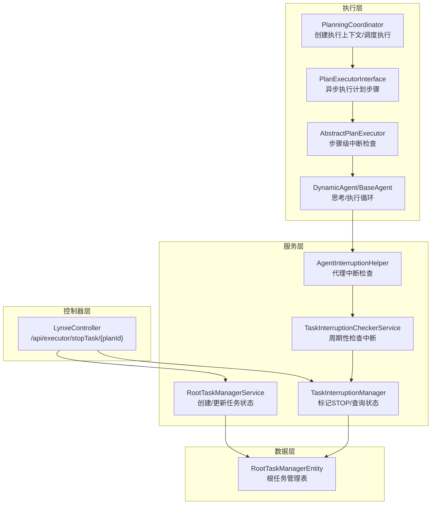
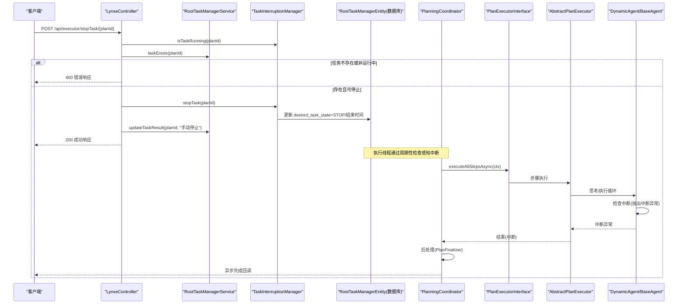
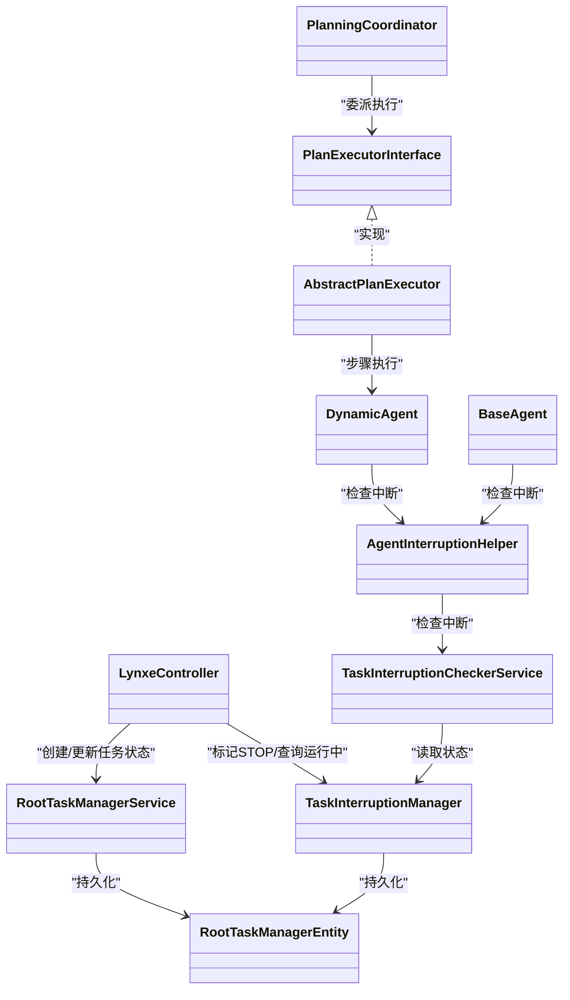

# 任务停止API

<cite>
**本文引用的文件列表**
- [LynxeController.java](file://src/main/java/com/alibaba/cloud/ai/lynxe/runtime/controller/LynxeController.java)
- [TaskInterruptionManager.java](file://src/main/java/com/alibaba/cloud/ai/lynxe/runtime/service/TaskInterruptionManager.java)
- [TaskInterruptionCheckerService.java](file://src/main/java/com/alibaba/cloud/ai/lynxe/runtime/service/TaskInterruptionCheckerService.java)
- [AgentInterruptionHelper.java](file://src/main/java/com/alibaba/cloud/ai/lynxe/runtime/service/AgentInterruptionHelper.java)
- [PlanningCoordinator.java](file://src/main/java/com/alibaba/cloud/ai/lynxe/runtime/service/PlanningCoordinator.java)
- [PlanExecutorInterface.java](file://src/main/java/com/alibaba/cloud/ai/lynxe/runtime/executor/PlanExecutorInterface.java)
- [AbstractPlanExecutor.java](file://src/main/java/com/alibaba/cloud/ai/lynxe/runtime/executor/AbstractPlanExecutor.java)
- [RootTaskManagerEntity.java](file://src/main/java/com/alibaba/cloud/ai/lynxe/runtime/entity/po/RootTaskManagerEntity.java)
- [RootTaskManagerService.java](file://src/main/java/com/alibaba/cloud/ai/lynxe/runtime/service/RootTaskManagerService.java)
- [PlanFinalizer.java](file://src/main/java/com/alibaba/cloud/ai/lynxe/planning/service/PlanFinalizer.java)
- [DynamicAgent.java](file://src/main/java/com/alibaba/cloud/ai/lynxe/agent/DynamicAgent.java)
- [BaseAgent.java](file://src/main/java/com/alibaba/cloud/ai/lynxe/agent/BaseAgent.java)
</cite>

## 目录
1. [简介](#简介)
2. [项目结构与定位](#项目结构与定位)
3. [核心组件](#核心组件)
4. [架构总览](#架构总览)
5. [详细组件分析](#详细组件分析)
6. [依赖关系分析](#依赖关系分析)
7. [性能与一致性](#性能与一致性)
8. [故障排查指南](#故障排查指南)
9. [结论](#结论)
10. [附录：调用示例与重试策略](#附录调用示例与重试策略)

## 简介
本文件围绕 JManus 的“任务停止”API（stopTask）进行系统化技术文档编写，重点解释：
- stopTask 如何通过 HTTP POST 接收任务 ID 并触发中断流程；
- TaskInterruptionManager 如何将中断请求持久化到数据库的“根任务管理表”，并驱动运行中的执行线程感知中断；
- 中断处理的异步特性与最终一致性保障；
- 中断信号在控制器层、规划协调器、执行器之间的传播路径；
- 错误处理场景（不存在的任务、已完成任务等）；
- 提供调用示例与建议的重试策略。

## 项目结构与定位
stopTask 属于运行时执行层的控制接口，位于控制器层，通过服务层协调数据库状态与执行线程，最终由执行器在关键检查点响应中断信号。

图表来源
- [LynxeController.java](file://src/main/java/com/alibaba/cloud/ai/lynxe/runtime/controller/LynxeController.java#L824-L866)
- [RootTaskManagerService.java](file://src/main/java/com/alibaba/cloud/ai/lynxe/runtime/service/RootTaskManagerService.java#L48-L84)
- [TaskInterruptionManager.java](file://src/main/java/com/alibaba/cloud/ai/lynxe/runtime/service/TaskInterruptionManager.java#L49-L120)
- [TaskInterruptionCheckerService.java](file://src/main/java/com/alibaba/cloud/ai/lynxe/runtime/service/TaskInterruptionCheckerService.java#L46-L88)
- [AgentInterruptionHelper.java](file://src/main/java/com/alibaba/cloud/ai/lynxe/runtime/service/AgentInterruptionHelper.java#L44-L64)
- [PlanningCoordinator.java](file://src/main/java/com/alibaba/cloud/ai/lynxe/runtime/service/PlanningCoordinator.java#L76-L179)
- [PlanExecutorInterface.java](file://src/main/java/com/alibaba/cloud/ai/lynxe/runtime/executor/PlanExecutorInterface.java#L26-L36)
- [AbstractPlanExecutor.java](file://src/main/java/com/alibaba/cloud/ai/lynxe/runtime/executor/AbstractPlanExecutor.java#L97-L166)
- [RootTaskManagerEntity.java](file://src/main/java/com/alibaba/cloud/ai/lynxe/runtime/entity/po/RootTaskManagerEntity.java#L36-L110)

章节来源
- [LynxeController.java](file://src/main/java/com/alibaba/cloud/ai/lynxe/runtime/controller/LynxeController.java#L824-L866)
- [RootTaskManagerEntity.java](file://src/main/java/com/alibaba/cloud/ai/lynxe/runtime/entity/po/RootTaskManagerEntity.java#L36-L110)

## 核心组件
- 控制器：LynxeController 提供 /api/executor/stopTask/{planId} 端点，接收任务 ID，校验任务状态，调用服务层标记中断并返回结果。
- 任务状态管理：RootTaskManagerService 负责创建/更新根任务状态；TaskInterruptionManager 负责将 desired_task_state 设为 STOP/CANCEL/PAUSE，并记录结束时间。
- 中断检查：TaskInterruptionCheckerService 周期性读取数据库状态判断是否应中断；AgentInterruptionHelper 在执行关键节点调用检查。
- 执行链路：PlanningCoordinator 创建执行上下文并委派给 PlanExecutorInterface；AbstractPlanExecutor 在步骤执行中检查中断；DynamicAgent/BaseAgent 在思考/执行循环中响应中断异常。

章节来源
- [LynxeController.java](file://src/main/java/com/alibaba/cloud/ai/lynxe/runtime/controller/LynxeController.java#L824-L866)
- [RootTaskManagerService.java](file://src/main/java/com/alibaba/cloud/ai/lynxe/runtime/service/RootTaskManagerService.java#L48-L84)
- [TaskInterruptionManager.java](file://src/main/java/com/alibaba/cloud/ai/lynxe/runtime/service/TaskInterruptionManager.java#L49-L120)
- [TaskInterruptionCheckerService.java](file://src/main/java/com/alibaba/cloud/ai/lynxe/runtime/service/TaskInterruptionCheckerService.java#L46-L88)
- [AgentInterruptionHelper.java](file://src/main/java/com/alibaba/cloud/ai/lynxe/runtime/service/AgentInterruptionHelper.java#L44-L64)
- [PlanningCoordinator.java](file://src/main/java/com/alibaba/cloud/ai/lynxe/runtime/service/PlanningCoordinator.java#L76-L179)
- [PlanExecutorInterface.java](file://src/main/java/com/alibaba/cloud/ai/lynxe/runtime/executor/PlanExecutorInterface.java#L26-L36)
- [AbstractPlanExecutor.java](file://src/main/java/com/alibaba/cloud/ai/lynxe/runtime/executor/AbstractPlanExecutor.java#L97-L166)
- [DynamicAgent.java](file://src/main/java/com/alibaba/cloud/ai/lynxe/agent/DynamicAgent.java#L200-L259)
- [BaseAgent.java](file://src/main/java/com/alibaba/cloud/ai/lynxe/agent/BaseAgent.java#L254-L290)

## 架构总览
stopTask 的调用链路如下：

图表来源
- [LynxeController.java](file://src/main/java/com/alibaba/cloud/ai/lynxe/runtime/controller/LynxeController.java#L824-L866)
- [RootTaskManagerService.java](file://src/main/java/com/alibaba/cloud/ai/lynxe/runtime/service/RootTaskManagerService.java#L151-L171)
- [TaskInterruptionManager.java](file://src/main/java/com/alibaba/cloud/ai/lynxe/runtime/service/TaskInterruptionManager.java#L127-L147)
- [PlanningCoordinator.java](file://src/main/java/com/alibaba/cloud/ai/lynxe/runtime/service/PlanningCoordinator.java#L150-L179)
- [AbstractPlanExecutor.java](file://src/main/java/com/alibaba/cloud/ai/lynxe/runtime/executor/AbstractPlanExecutor.java#L97-L166)
- [DynamicAgent.java](file://src/main/java/com/alibaba/cloud/ai/lynxe/agent/DynamicAgent.java#L200-L259)
- [BaseAgent.java](file://src/main/java/com/alibaba/cloud/ai/lynxe/agent/BaseAgent.java#L254-L290)

## 详细组件分析

### 控制器：stopTask 端点
- 请求方式：POST
- 路径：/api/executor/stopTask/{planId}
- 行为：
  - 校验任务是否存在或是否处于运行中；
  - 调用 TaskInterruptionManager.stopTask 将 desired_task_state 设为 STOP；
  - 若成功，调用 RootTaskManagerService.updateTaskResult 写入“手动停止”的结果摘要；
  - 返回包含 planId、状态、消息与是否已运行等信息的响应。

章节来源
- [LynxeController.java](file://src/main/java/com/alibaba/cloud/ai/lynxe/runtime/controller/LynxeController.java#L824-L866)

### 服务层：任务状态持久化与查询
- RootTaskManagerService
  - createOrUpdateTask：根据 desired_task_state 设置开始/结束时间；
  - updateTaskResult：写入任务结果摘要；
  - taskExists：判断任务是否存在；
  - completeTask：在异步执行完成后统一设置状态与结束时间。
- TaskInterruptionManager
  - stopTask/cancelTask/pauseTask/resumeTask：统一委托 markTaskForInterruption；
  - markTaskForInterruption：更新 desired_task_state、结束时间（STOP/CANCEL/PAUSE），并保存；
  - isTaskRunning/shouldInterruptTask：基于数据库状态判断运行/中断需求；
  - getTaskInterruptionStatus：返回当前 desired_task_state。

章节来源
- [RootTaskManagerService.java](file://src/main/java/com/alibaba/cloud/ai/lynxe/runtime/service/RootTaskManagerService.java#L48-L84)
- [RootTaskManagerService.java](file://src/main/java/com/alibaba/cloud/ai/lynxe/runtime/service/RootTaskManagerService.java#L151-L171)
- [RootTaskManagerService.java](file://src/main/java/com/alibaba/cloud/ai/lynxe/runtime/service/RootTaskManagerService.java#L181-L199)
- [TaskInterruptionManager.java](file://src/main/java/com/alibaba/cloud/ai/lynxe/runtime/service/TaskInterruptionManager.java#L49-L120)
- [TaskInterruptionManager.java](file://src/main/java/com/alibaba/cloud/ai/lynxe/runtime/service/TaskInterruptionManager.java#L127-L147)
- [TaskInterruptionManager.java](file://src/main/java/com/alibaba/cloud/ai/lynxe/runtime/service/TaskInterruptionManager.java#L202-L206)

### 数据模型：根任务管理表
- 关键字段：root_plan_id、desired_task_state、task_result、start_time、end_time、last_updated、created_at、created_by；
- desired_task_state 枚举：START、STOP、PAUSE、RESUME、CANCEL、WAIT；
- 生命周期：创建时默认 WAIT；START 时设置 start_time；STOP/CANCEL/PAUSE 时设置 end_time；RESUME 清空 end_time。

章节来源
- [RootTaskManagerEntity.java](file://src/main/java/com/alibaba/cloud/ai/lynxe/runtime/entity/po/RootTaskManagerEntity.java#L36-L110)
- [RootTaskManagerEntity.java](file://src/main/java/com/alibaba/cloud/ai/lynxe/runtime/entity/po/RootTaskManagerEntity.java#L239-L289)

### 执行链路：从协调器到执行器
- PlanningCoordinator.executeByPlan：构建 ExecutionContext，选择 PlanExecutorFactory 创建执行器，异步执行后交由 PlanFinalizer 处理；
- PlanExecutorInterface.executeAllStepsAsync：抽象执行入口；
- AbstractPlanExecutor.executeStep：记录步骤开始/结束，调用具体 Agent 执行；
- DynamicAgent/BaseAgent：在思考/执行循环中检查中断，若被中断则抛出中断异常，由上层捕获并处理。

章节来源
- [PlanningCoordinator.java](file://src/main/java/com/alibaba/cloud/ai/lynxe/runtime/service/PlanningCoordinator.java#L76-L179)
- [PlanExecutorInterface.java](file://src/main/java/com/alibaba/cloud/ai/lynxe/runtime/executor/PlanExecutorInterface.java#L26-L36)
- [AbstractPlanExecutor.java](file://src/main/java/com/alibaba/cloud/ai/lynxe/runtime/executor/AbstractPlanExecutor.java#L97-L166)
- [DynamicAgent.java](file://src/main/java/com/alibaba/cloud/ai/lynxe/agent/DynamicAgent.java#L200-L259)
- [BaseAgent.java](file://src/main/java/com/alibaba/cloud/ai/lynxe/agent/BaseAgent.java#L254-L290)

### 中断检查与传播
- TaskInterruptionCheckerService：周期性读取 desired_task_state 判断是否应中断；
- AgentInterruptionHelper：在关键节点调用 checkInterruptionAndContinue 或 checkInterruptionAndThrow；
- DynamicAgent：在 think 阶段与重试前检查中断，若中断则抛出中断异常；
- AbstractPlanExecutor：在步骤执行后根据 AgentState 处理中断/失败/完成；
- PlanFinalizer：在中断场景生成中断消息并记录完成。

章节来源
- [TaskInterruptionCheckerService.java](file://src/main/java/com/alibaba/cloud/ai/lynxe/runtime/service/TaskInterruptionCheckerService.java#L46-L88)
- [AgentInterruptionHelper.java](file://src/main/java/com/alibaba/cloud/ai/lynxe/runtime/service/AgentInterruptionHelper.java#L44-L64)
- [DynamicAgent.java](file://src/main/java/com/alibaba/cloud/ai/lynxe/agent/DynamicAgent.java#L200-L259)
- [AbstractPlanExecutor.java](file://src/main/java/com/alibaba/cloud/ai/lynxe/runtime/executor/AbstractPlanExecutor.java#L97-L166)
- [PlanFinalizer.java](file://src/main/java/com/alibaba/cloud/ai/lynxe/planning/service/PlanFinalizer.java#L324-L362)

## 依赖关系分析
- 控制器依赖 RootTaskManagerService 与 TaskInterruptionManager；
- 执行器链路依赖 PlanningCoordinator、PlanExecutorInterface、AbstractPlanExecutor；
- 中断检查链路依赖 TaskInterruptionCheckerService、AgentInterruptionHelper；
- 数据持久化依赖 RootTaskManagerEntity 及其 Repository。

图表来源
- [LynxeController.java](file://src/main/java/com/alibaba/cloud/ai/lynxe/runtime/controller/LynxeController.java#L824-L866)
- [RootTaskManagerService.java](file://src/main/java/com/alibaba/cloud/ai/lynxe/runtime/service/RootTaskManagerService.java#L48-L84)
- [TaskInterruptionManager.java](file://src/main/java/com/alibaba/cloud/ai/lynxe/runtime/service/TaskInterruptionManager.java#L49-L120)
- [TaskInterruptionCheckerService.java](file://src/main/java/com/alibaba/cloud/ai/lynxe/runtime/service/TaskInterruptionCheckerService.java#L46-L88)
- [AgentInterruptionHelper.java](file://src/main/java/com/alibaba/cloud/ai/lynxe/runtime/service/AgentInterruptionHelper.java#L44-L64)
- [PlanningCoordinator.java](file://src/main/java/com/alibaba/cloud/ai/lynxe/runtime/service/PlanningCoordinator.java#L76-L179)
- [PlanExecutorInterface.java](file://src/main/java/com/alibaba/cloud/ai/lynxe/runtime/executor/PlanExecutorInterface.java#L26-L36)
- [AbstractPlanExecutor.java](file://src/main/java/com/alibaba/cloud/ai/lynxe/runtime/executor/AbstractPlanExecutor.java#L97-L166)
- [DynamicAgent.java](file://src/main/java/com/alibaba/cloud/ai/lynxe/agent/DynamicAgent.java#L200-L259)
- [BaseAgent.java](file://src/main/java/com/alibaba/cloud/ai/lynxe/agent/BaseAgent.java#L254-L290)
- [RootTaskManagerEntity.java](file://src/main/java/com/alibaba/cloud/ai/lynxe/runtime/entity/po/RootTaskManagerEntity.java#L36-L110)

## 性能与一致性
- 异步特性：stopTask 仅写入数据库并立即返回，实际中断由执行线程周期性检查触发，避免阻塞请求线程。
- 最终一致性：数据库是权威状态源，desired_task_state 一旦更新，执行线程在下一次检查点生效；若执行线程不可达，可在后续重启或再次检查时生效。
- 幂等性：多次调用 stopTask 对同一任务不会重复写入，因为状态变更由数据库事务保证，且 end_time 仅在首次 STOP/CANCEL/PAUSE 时设置。
- 资源清理：TaskInterruptionManager 提供清理过期已完成任务的能力，避免历史数据膨胀。

章节来源
- [TaskInterruptionManager.java](file://src/main/java/com/alibaba/cloud/ai/lynxe/runtime/service/TaskInterruptionManager.java#L105-L113)
- [TaskInterruptionManager.java](file://src/main/java/com/alibaba/cloud/ai/lynxe/runtime/service/TaskInterruptionManager.java#L214-L229)
- [LynxeController.java](file://src/main/java/com/alibaba/cloud/ai/lynxe/runtime/controller/LynxeController.java#L824-L866)

## 故障排查指南
- 响应 400（无活动任务）
  - 现象：请求后返回“无活动任务”；
  - 可能原因：任务不存在或不在 START/RESUME 状态；
  - 处理建议：确认 planId 是否正确，或先发起执行再停止。
- 响应 500（内部错误）
  - 现象：服务器异常；
  - 可能原因：数据库写入失败、服务异常；
  - 处理建议：查看日志，检查数据库连接与权限。
- 中断未生效
  - 现象：调用 stopTask 后执行仍在继续；
  - 可能原因：执行线程未及时轮询中断检查或处于长阻塞阶段；
  - 处理建议：确保 Agent 在关键节点调用中断检查；必要时增加检查频率或缩短阻塞操作。
- 中断后结果不一致
  - 现象：任务状态与结果摘要不匹配；
  - 可能原因：异步完成回调未及时写入；
  - 处理建议：检查 RootTaskManagerService.completeTask/updateTaskResult 的调用路径与异常分支。

章节来源
- [LynxeController.java](file://src/main/java/com/alibaba/cloud/ai/lynxe/runtime/controller/LynxeController.java#L824-L866)
- [RootTaskManagerService.java](file://src/main/java/com/alibaba/cloud/ai/lynxe/runtime/service/RootTaskManagerService.java#L181-L199)
- [TaskInterruptionCheckerService.java](file://src/main/java/com/alibaba/cloud/ai/lynxe/runtime/service/TaskInterruptionCheckerService.java#L46-L88)
- [DynamicAgent.java](file://src/main/java/com/alibaba/cloud/ai/lynxe/agent/DynamicAgent.java#L200-L259)

## 结论
stopTask 采用“数据库驱动”的中断机制，通过控制器写入 desired_task_state，配合执行线程的周期性检查与关键节点中断抛出，形成异步、最终一致的中断体系。该设计具备良好的扩展性与容错能力，适合分布式/多机部署场景。

## 附录：调用示例与重试策略
- 调用示例
  - 方法：POST
  - URL：/api/executor/stopTask/{planId}
  - 参数：路径参数 planId（根计划 ID）
  - 成功响应字段：status、planId、message、taskMarkedForStop、wasRunning
  - 失败响应字段：error、planId
- 重试策略建议
  - 指数退避：每次重试间隔按 1s、2s、4s、8s… 增长，上限 30s；
  - 最大次数：不超过 5 次；
  - 条件判断：若返回“无活动任务”，不再重试（任务可能已完成或不存在）；
  - 幂等性：重复调用 stopTask 不会改变最终状态，但建议前端去抖。

章节来源
- [LynxeController.java](file://src/main/java/com/alibaba/cloud/ai/lynxe/runtime/controller/LynxeController.java#L824-L866)