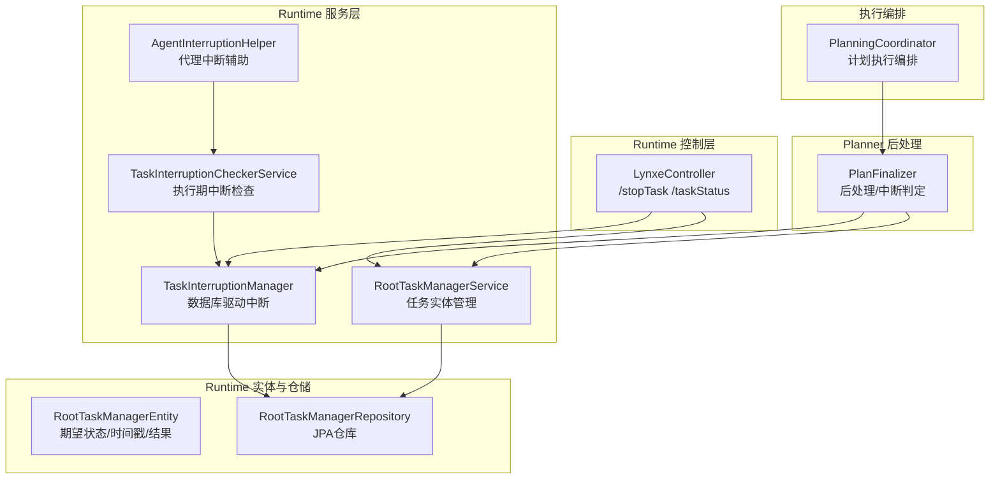
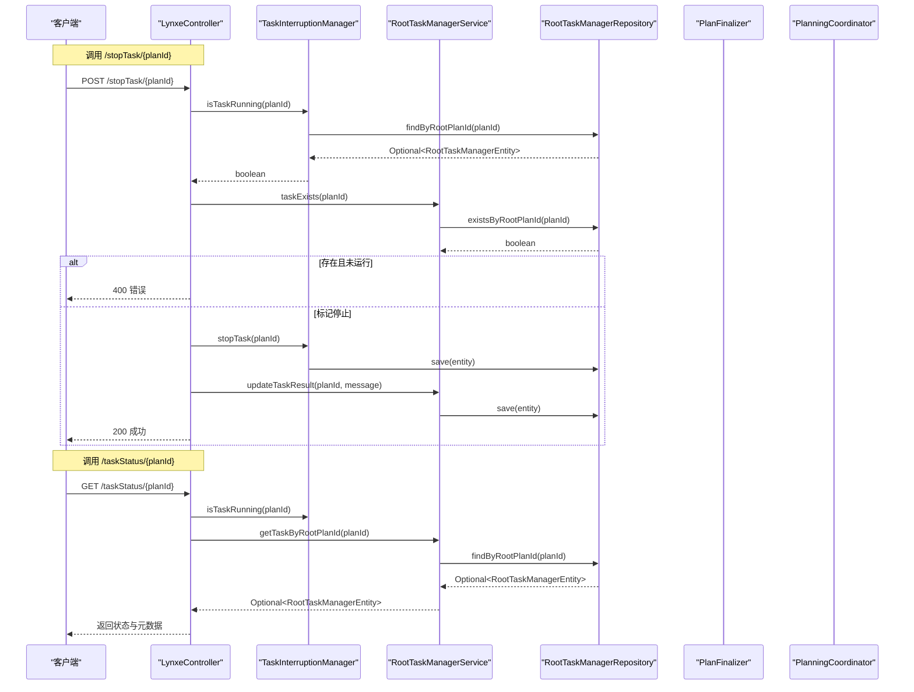
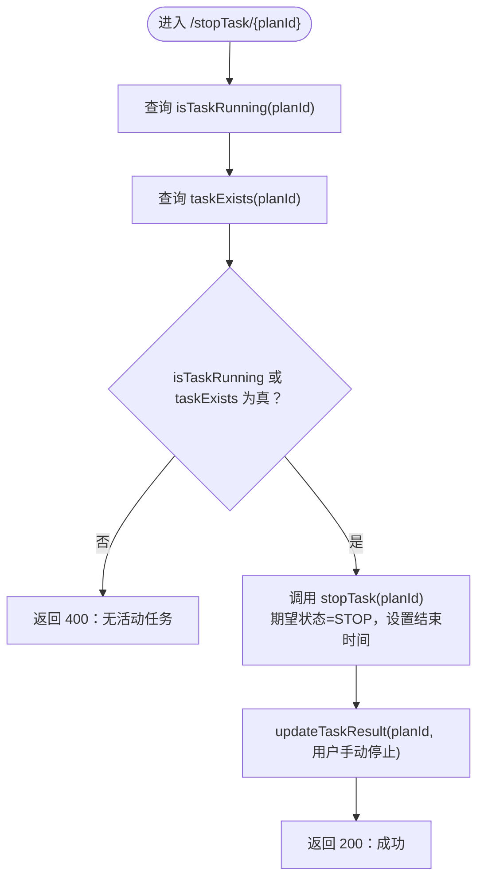
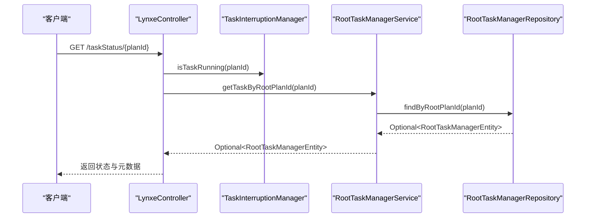
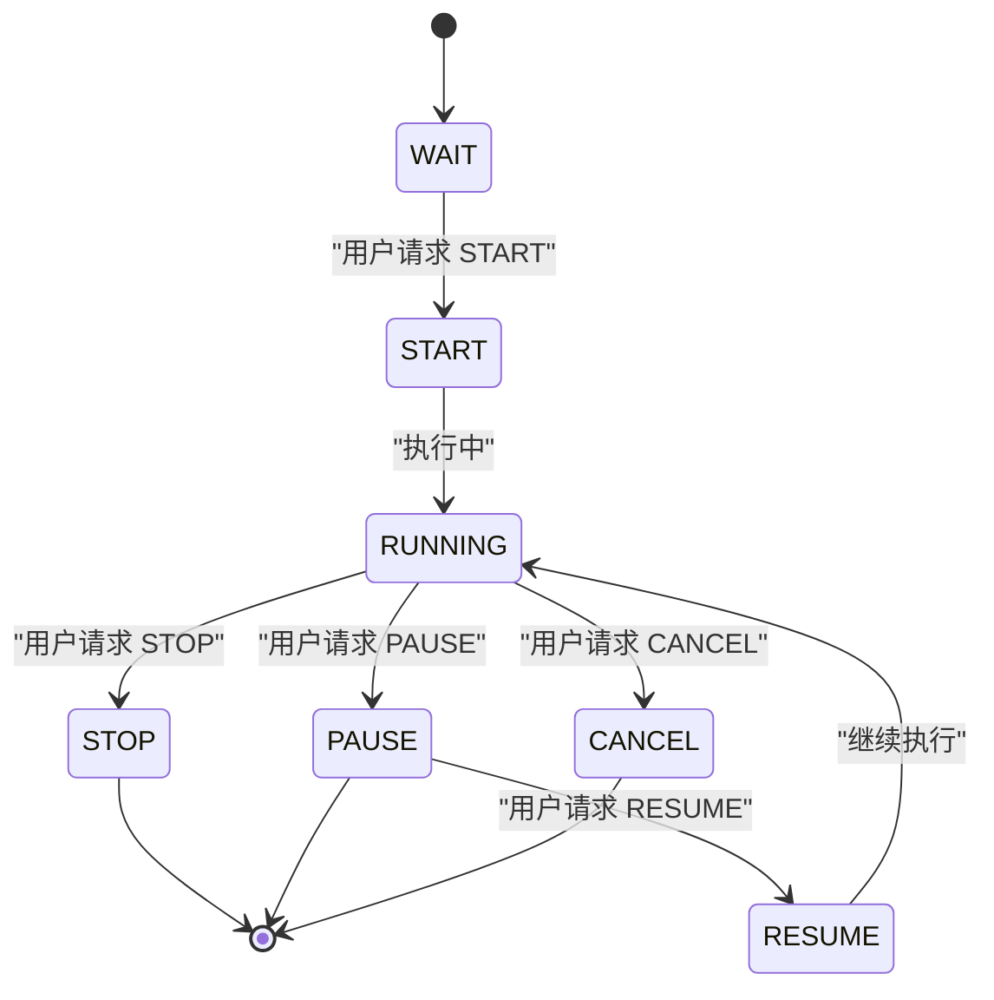
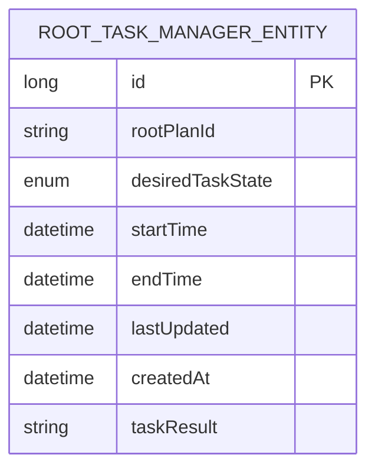
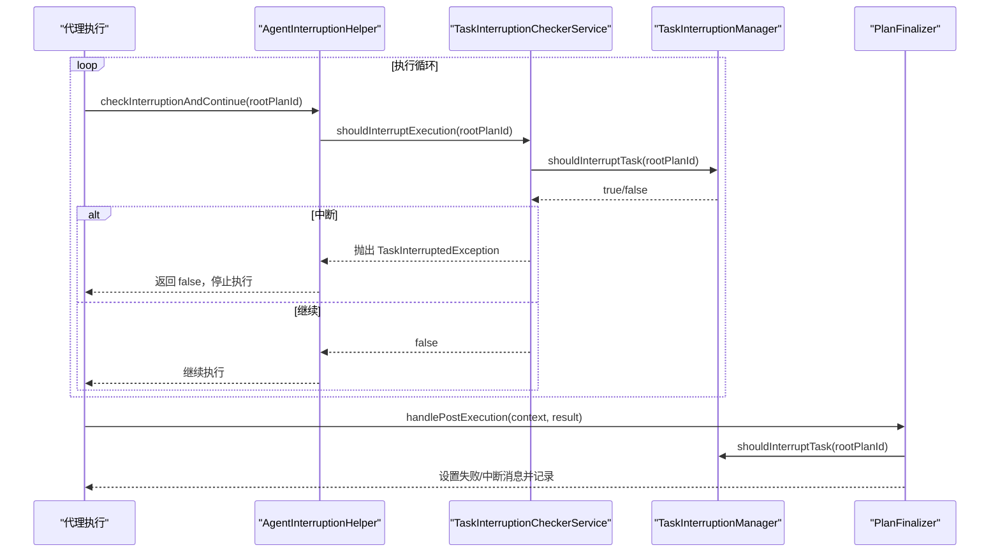
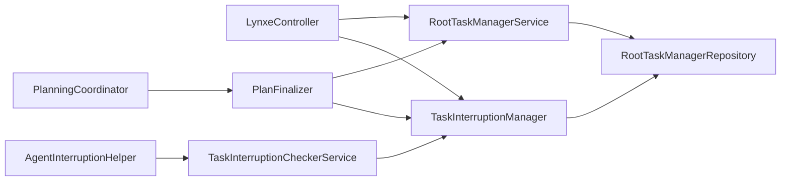

# 任务控制API

<cite>
**本文引用的文件**
- [LynxeController.java](file://src/main/java/com/alibaba/cloud/ai/lynxe/runtime/controller/LynxeController.java)
- [TaskInterruptionManager.java](file://src/main/java/com/alibaba/cloud/ai/lynxe/runtime/service/TaskInterruptionManager.java)
- [RootTaskManagerService.java](file://src/main/java/com/alibaba/cloud/ai/lynxe/runtime/service/RootTaskManagerService.java)
- [RootTaskManagerEntity.java](file://src/main/java/com/alibaba/cloud/ai/lynxe/runtime/entity/po/RootTaskManagerEntity.java)
- [RootTaskManagerRepository.java](file://src/main/java/com/alibaba/cloud/ai/lynxe/runtime/repository/RootTaskManagerRepository.java)
- [TaskInterruptionCheckerService.java](file://src/main/java/com/alibaba/cloud/ai/lynxe/runtime/service/TaskInterruptionCheckerService.java)
- [AgentInterruptionHelper.java](file://src/main/java/com/alibaba/cloud/ai/lynxe/runtime/service/AgentInterruptionHelper.java)
- [PlanFinalizer.java](file://src/main/java/com/alibaba/cloud/ai/lynxe/planning/service/PlanFinalizer.java)
- [PlanningCoordinator.java](file://src/main/java/com/alibaba/cloud/ai/lynxe/runtime/service/PlanningCoordinator.java)
</cite>

## 目录
1. [简介](#简介)
2. [项目结构](#项目结构)
3. [核心组件](#核心组件)
4. [架构总览](#架构总览)
5. [详细组件分析](#详细组件分析)
6. [依赖关系分析](#依赖关系分析)
7. [性能考量](#性能考量)
8. [故障排查指南](#故障排查指南)
9. [结论](#结论)

## 简介
本文件聚焦于JManus任务控制API，围绕两个关键端点：
- 停止任务：/stopTask/{planId}
- 查询任务状态：/taskStatus/{planId}

文档详细说明stopTask如何通过数据库驱动的中断机制（TaskInterruptionManager）标记任务停止状态，并在控制器层更新任务结果信息；说明getTaskStatus如何查询RootTaskManagerEntity实体以返回任务的运行状态、期望状态、开始/结束时间等元数据。同时解释isTaskRunning判断逻辑与desiredTaskState状态机含义，给出任务控制的完整状态转换图，并阐述API如何与PlanningCoordinator协同实现优雅的任务中断。最后提供常见错误场景的处理示例。

## 项目结构
任务控制相关代码主要分布在runtime模块的controller、service与entity层，配合planning模块的PlanFinalizer进行后处理与中断检测。

图表来源
- [LynxeController.java](file://src/main/java/com/alibaba/cloud/ai/lynxe/runtime/controller/LynxeController.java#L828-L904)
- [TaskInterruptionManager.java](file://src/main/java/com/alibaba/cloud/ai/lynxe/runtime/service/TaskInterruptionManager.java#L48-L119)
- [RootTaskManagerService.java](file://src/main/java/com/alibaba/cloud/ai/lynxe/runtime/service/RootTaskManagerService.java#L47-L83)
- [RootTaskManagerEntity.java](file://src/main/java/com/alibaba/cloud/ai/lynxe/runtime/entity/po/RootTaskManagerEntity.java#L100-L189)
- [RootTaskManagerRepository.java](file://src/main/java/com/alibaba/cloud/ai/lynxe/runtime/repository/RootTaskManagerRepository.java#L34-L61)
- [TaskInterruptionCheckerService.java](file://src/main/java/com/alibaba/cloud/ai/lynxe/runtime/service/TaskInterruptionCheckerService.java#L46-L97)
- [AgentInterruptionHelper.java](file://src/main/java/com/alibaba/cloud/ai/lynxe/runtime/service/AgentInterruptionHelper.java#L44-L84)
- [PlanFinalizer.java](file://src/main/java/com/alibaba/cloud/ai/lynxe/planning/service/PlanFinalizer.java#L291-L362)
- [PlanningCoordinator.java](file://src/main/java/com/alibaba/cloud/ai/lynxe/runtime/service/PlanningCoordinator.java#L75-L178)

章节来源
- [LynxeController.java](file://src/main/java/com/alibaba/cloud/ai/lynxe/runtime/controller/LynxeController.java#L828-L904)
- [TaskInterruptionManager.java](file://src/main/java/com/alibaba/cloud/ai/lynxe/runtime/service/TaskInterruptionManager.java#L48-L119)
- [RootTaskManagerService.java](file://src/main/java/com/alibaba/cloud/ai/lynxe/runtime/service/RootTaskManagerService.java#L47-L83)
- [RootTaskManagerEntity.java](file://src/main/java/com/alibaba/cloud/ai/lynxe/runtime/entity/po/RootTaskManagerEntity.java#L100-L189)
- [RootTaskManagerRepository.java](file://src/main/java/com/alibaba/cloud/ai/lynxe/runtime/repository/RootTaskManagerRepository.java#L34-L61)
- [TaskInterruptionCheckerService.java](file://src/main/java/com/alibaba/cloud/ai/lynxe/runtime/service/TaskInterruptionCheckerService.java#L46-L97)
- [AgentInterruptionHelper.java](file://src/main/java/com/alibaba/cloud/ai/lynxe/runtime/service/AgentInterruptionHelper.java#L44-L84)
- [PlanFinalizer.java](file://src/main/java/com/alibaba/cloud/ai/lynxe/planning/service/PlanFinalizer.java#L291-L362)
- [PlanningCoordinator.java](file://src/main/java/com/alibaba/cloud/ai/lynxe/runtime/service/PlanningCoordinator.java#L75-L178)

## 核心组件
- LynxeController：暴露REST端点，负责请求校验、调用服务层并返回响应。
- TaskInterruptionManager：数据库驱动的中断管理器，提供shouldInterruptTask/isTaskRunning/markedForInterruption等能力。
- RootTaskManagerService：任务实体的创建/更新/删除/查询，以及任务结果更新与完成标记。
- RootTaskManagerEntity：任务实体，包含期望状态、开始/结束时间、最后更新时间、任务结果等字段。
- RootTaskManagerRepository：JPA仓库，提供按rootPlanId查询、存在性检查、按期望状态查询等。
- TaskInterruptionCheckerService：执行期中断检查器，周期性检查数据库中断信号并可抛出异常。
- AgentInterruptionHelper：代理层中断辅助，封装中断检查与异常处理。
- PlanFinalizer：计划后处理，负责在执行完成后判定是否被中断并生成相应结果。
- PlanningCoordinator：计划执行编排入口，负责创建执行上下文并调度执行。

章节来源
- [LynxeController.java](file://src/main/java/com/alibaba/cloud/ai/lynxe/runtime/controller/LynxeController.java#L828-L904)
- [TaskInterruptionManager.java](file://src/main/java/com/alibaba/cloud/ai/lynxe/runtime/service/TaskInterruptionManager.java#L48-L119)
- [RootTaskManagerService.java](file://src/main/java/com/alibaba/cloud/ai/lynxe/runtime/service/RootTaskManagerService.java#L47-L83)
- [RootTaskManagerEntity.java](file://src/main/java/com/alibaba/cloud/ai/lynxe/runtime/entity/po/RootTaskManagerEntity.java#L100-L189)
- [RootTaskManagerRepository.java](file://src/main/java/com/alibaba/cloud/ai/lynxe/runtime/repository/RootTaskManagerRepository.java#L34-L61)
- [TaskInterruptionCheckerService.java](file://src/main/java/com/alibaba/cloud/ai/lynxe/runtime/service/TaskInterruptionCheckerService.java#L46-L97)
- [AgentInterruptionHelper.java](file://src/main/java/com/alibaba/cloud/ai/lynxe/runtime/service/AgentInterruptionHelper.java#L44-L84)
- [PlanFinalizer.java](file://src/main/java/com/alibaba/cloud/ai/lynxe/planning/service/PlanFinalizer.java#L291-L362)
- [PlanningCoordinator.java](file://src/main/java/com/alibaba/cloud/ai/lynxe/runtime/service/PlanningCoordinator.java#L75-L178)

## 架构总览
下图展示stopTask与getTaskStatus两个端点的调用链路及与各组件的交互。

图表来源
- [LynxeController.java](file://src/main/java/com/alibaba/cloud/ai/lynxe/runtime/controller/LynxeController.java#L828-L904)
- [TaskInterruptionManager.java](file://src/main/java/com/alibaba/cloud/ai/lynxe/runtime/service/TaskInterruptionManager.java#L48-L119)
- [RootTaskManagerService.java](file://src/main/java/com/alibaba/cloud/ai/lynxe/runtime/service/RootTaskManagerService.java#L90-L93)
- [RootTaskManagerRepository.java](file://src/main/java/com/alibaba/cloud/ai/lynxe/runtime/repository/RootTaskManagerRepository.java#L34-L45)
- [PlanFinalizer.java](file://src/main/java/com/alibaba/cloud/ai/lynxe/planning/service/PlanFinalizer.java#L291-L362)
- [PlanningCoordinator.java](file://src/main/java/com/alibaba/cloud/ai/lynxe/runtime/service/PlanningCoordinator.java#L75-L178)

## 详细组件分析

### stopTask 端点实现机制
- 请求路径：POST /stopTask/{planId}
- 关键流程：
  1) 检查任务是否正在运行（基于数据库期望状态）。
  2) 检查任务是否存在（基于数据库存在性）。
  3) 若两者都为否，返回400错误提示“无活动任务”。
  4) 否则调用TaskInterruptionManager.stopTask，将期望状态置为STOP并设置结束时间。
  5) 在控制器层调用RootTaskManagerService.updateTaskResult写入用户手动停止的结果消息。
  6) 返回成功响应，包含状态、planId、wasRunning、taskMarkedForStop等信息。

图表来源
- [LynxeController.java](file://src/main/java/com/alibaba/cloud/ai/lynxe/runtime/controller/LynxeController.java#L828-L858)
- [TaskInterruptionManager.java](file://src/main/java/com/alibaba/cloud/ai/lynxe/runtime/service/TaskInterruptionManager.java#L126-L128)
- [RootTaskManagerService.java](file://src/main/java/com/alibaba/cloud/ai/lynxe/runtime/service/RootTaskManagerService.java#L156-L170)

章节来源
- [LynxeController.java](file://src/main/java/com/alibaba/cloud/ai/lynxe/runtime/controller/LynxeController.java#L828-L858)
- [TaskInterruptionManager.java](file://src/main/java/com/alibaba/cloud/ai/lynxe/runtime/service/TaskInterruptionManager.java#L126-L128)
- [RootTaskManagerService.java](file://src/main/java/com/alibaba/cloud/ai/lynxe/runtime/service/RootTaskManagerService.java#L156-L170)

### getTaskStatus 端点实现机制
- 请求路径：GET /taskStatus/{planId}
- 关键流程：
  1) 调用TaskInterruptionManager.isTaskRunning获取运行状态。
  2) 通过RootTaskManagerService.getTaskByRootPlanId查询任务实体。
  3) 组装响应：planId、isRunning、exists、desiredState、startTime、endTime、lastUpdated、taskResult。
  4) 若实体不存在，返回不存在标记与空值字段。

图表来源
- [LynxeController.java](file://src/main/java/com/alibaba/cloud/ai/lynxe/runtime/controller/LynxeController.java#L872-L904)
- [TaskInterruptionManager.java](file://src/main/java/com/alibaba/cloud/ai/lynxe/runtime/service/TaskInterruptionManager.java#L73-L88)
- [RootTaskManagerService.java](file://src/main/java/com/alibaba/cloud/ai/lynxe/runtime/service/RootTaskManagerService.java#L90-L93)
- [RootTaskManagerRepository.java](file://src/main/java/com/alibaba/cloud/ai/lynxe/runtime/repository/RootTaskManagerRepository.java#L34-L38)

章节来源
- [LynxeController.java](file://src/main/java/com/alibaba/cloud/ai/lynxe/runtime/controller/LynxeController.java#L872-L904)
- [TaskInterruptionManager.java](file://src/main/java/com/alibaba/cloud/ai/lynxe/runtime/service/TaskInterruptionManager.java#L73-L88)
- [RootTaskManagerService.java](file://src/main/java/com/alibaba/cloud/ai/lynxe/runtime/service/RootTaskManagerService.java#L90-L93)
- [RootTaskManagerRepository.java](file://src/main/java/com/alibaba/cloud/ai/lynxe/runtime/repository/RootTaskManagerRepository.java#L34-L38)

### isTaskRunning 判断逻辑与 desiredTaskState 状态机
- isTaskRunning：当期望状态为START或RESUME时视为运行中。
- desiredTaskState 状态机：
  - START：用户希望启动任务，若首次进入则设置startTime。
  - STOP：用户希望停止任务，设置endTime。
  - PAUSE：用户希望暂停任务。
  - RESUME：用户希望恢复任务，清除endTime。
  - CANCEL：用户希望取消任务，设置endTime。
  - WAIT：等待输入。

图表来源
- [TaskInterruptionManager.java](file://src/main/java/com/alibaba/cloud/ai/lynxe/runtime/service/TaskInterruptionManager.java#L73-L88)
- [RootTaskManagerEntity.java](file://src/main/java/com/alibaba/cloud/ai/lynxe/runtime/entity/po/RootTaskManagerEntity.java#L100-L110)
- [RootTaskManagerEntity.java](file://src/main/java/com/alibaba/cloud/ai/lynxe/runtime/entity/po/RootTaskManagerEntity.java#L240-L289)

章节来源
- [TaskInterruptionManager.java](file://src/main/java/com/alibaba/cloud/ai/lynxe/runtime/service/TaskInterruptionManager.java#L73-L88)
- [RootTaskManagerEntity.java](file://src/main/java/com/alibaba/cloud/ai/lynxe/runtime/entity/po/RootTaskManagerEntity.java#L100-L110)
- [RootTaskManagerEntity.java](file://src/main/java/com/alibaba/cloud/ai/lynxe/runtime/entity/po/RootTaskManagerEntity.java#L240-L289)

### 数据模型与仓储
- RootTaskManagerEntity：包含期望状态、开始/结束时间、最后更新时间、任务结果等字段。
- RootTaskManagerRepository：提供按rootPlanId查询、存在性检查、按期望状态查询等方法。

图表来源
- [RootTaskManagerEntity.java](file://src/main/java/com/alibaba/cloud/ai/lynxe/runtime/entity/po/RootTaskManagerEntity.java#L136-L189)
- [RootTaskManagerRepository.java](file://src/main/java/com/alibaba/cloud/ai/lynxe/runtime/repository/RootTaskManagerRepository.java#L34-L61)

章节来源
- [RootTaskManagerEntity.java](file://src/main/java/com/alibaba/cloud/ai/lynxe/runtime/entity/po/RootTaskManagerEntity.java#L136-L189)
- [RootTaskManagerRepository.java](file://src/main/java/com/alibaba/cloud/ai/lynxe/runtime/repository/RootTaskManagerRepository.java#L34-L61)

### 执行期中断与优雅停机
- TaskInterruptionCheckerService：周期性检查shouldInterruptExecution，若检测到STOP/CANCEL/PAUSE则抛出TaskInterruptedException。
- AgentInterruptionHelper：封装中断检查与异常处理，便于代理在执行循环中使用。
- PlanFinalizer：在执行完成后判定是否被中断，设置失败标志与中断消息，并记录中断结果。

图表来源
- [AgentInterruptionHelper.java](file://src/main/java/com/alibaba/cloud/ai/lynxe/runtime/service/AgentInterruptionHelper.java#L44-L84)
- [TaskInterruptionCheckerService.java](file://src/main/java/com/alibaba/cloud/ai/lynxe/runtime/service/TaskInterruptionCheckerService.java#L46-L97)
- [TaskInterruptionManager.java](file://src/main/java/com/alibaba/cloud/ai/lynxe/runtime/service/TaskInterruptionManager.java#L48-L66)
- [PlanFinalizer.java](file://src/main/java/com/alibaba/cloud/ai/lynxe/planning/service/PlanFinalizer.java#L291-L362)

章节来源
- [AgentInterruptionHelper.java](file://src/main/java/com/alibaba/cloud/ai/lynxe/runtime/service/AgentInterruptionHelper.java#L44-L84)
- [TaskInterruptionCheckerService.java](file://src/main/java/com/alibaba/cloud/ai/lynxe/runtime/service/TaskInterruptionCheckerService.java#L46-L97)
- [TaskInterruptionManager.java](file://src/main/java/com/alibaba/cloud/ai/lynxe/runtime/service/TaskInterruptionManager.java#L48-L66)
- [PlanFinalizer.java](file://src/main/java/com/alibaba/cloud/ai/lynxe/planning/service/PlanFinalizer.java#L291-L362)

### 与PlanningCoordinator的协同
- PlanningCoordinator负责创建执行上下文并调度执行，PlanFinalizer在执行完成后进行后处理与中断判定。
- 当任务被标记为STOP/CANCEL/PAUSE时，执行期中断检查器会检测到并触发异常，最终由PlanFinalizer统一处理中断结果。

章节来源
- [PlanningCoordinator.java](file://src/main/java/com/alibaba/cloud/ai/lynxe/runtime/service/PlanningCoordinator.java#L75-L178)
- [PlanFinalizer.java](file://src/main/java/com/alibaba/cloud/ai/lynxe/planning/service/PlanFinalizer.java#L181-L232)

## 依赖关系分析
- 控制层依赖服务层；服务层依赖实体与仓储；执行期中断检查依赖TaskInterruptionManager；PlanFinalizer依赖TaskInterruptionManager与RootTaskManagerService。
- 低耦合高内聚：控制器仅负责参数校验与响应组装，业务逻辑集中在服务层；执行期中断检查独立于控制器，便于在不同执行环境中复用。

图表来源
- [LynxeController.java](file://src/main/java/com/alibaba/cloud/ai/lynxe/runtime/controller/LynxeController.java#L828-L904)
- [TaskInterruptionManager.java](file://src/main/java/com/alibaba/cloud/ai/lynxe/runtime/service/TaskInterruptionManager.java#L48-L119)
- [RootTaskManagerService.java](file://src/main/java/com/alibaba/cloud/ai/lynxe/runtime/service/RootTaskManagerService.java#L47-L83)
- [RootTaskManagerRepository.java](file://src/main/java/com/alibaba/cloud/ai/lynxe/runtime/repository/RootTaskManagerRepository.java#L34-L61)
- [TaskInterruptionCheckerService.java](file://src/main/java/com/alibaba/cloud/ai/lynxe/runtime/service/TaskInterruptionCheckerService.java#L46-L97)
- [AgentInterruptionHelper.java](file://src/main/java/com/alibaba/cloud/ai/lynxe/runtime/service/AgentInterruptionHelper.java#L44-L84)
- [PlanFinalizer.java](file://src/main/java/com/alibaba/cloud/ai/lynxe/planning/service/PlanFinalizer.java#L291-L362)
- [PlanningCoordinator.java](file://src/main/java/com/alibaba/cloud/ai/lynxe/runtime/service/PlanningCoordinator.java#L75-L178)

## 性能考量
- 数据库访问：stopTask与getTaskStatus均涉及单条记录查询与保存，建议对rootPlanId建立索引以提升查询效率。
- 事务边界：TaskInterruptionManager与RootTaskManagerService均为事务性操作，避免跨事务一致性问题。
- 执行期中断检查：TaskInterruptionCheckerService采用只读事务，减少写锁竞争；建议在代理执行循环中合理设置检查频率，避免频繁数据库访问。

## 故障排查指南
- 尝试停止不存在的任务
  - 现象：返回400错误，提示“无活动任务”。
  - 触发条件：isTaskRunning与taskExists均为false。
  - 处理建议：确认planId正确，或先发起任务再停止。
  
  章节来源
  - [LynxeController.java](file://src/main/java/com/alibaba/cloud/ai/lynxe/runtime/controller/LynxeController.java#L838-L842)

- 已停止的任务再次停止
  - 现象：接口仍返回成功，但任务期望状态已是STOP。
  - 触发条件：数据库中期望状态为STOP，控制器仍会标记一次（幂等）。
  - 处理建议：前端避免重复停止，或在调用前先查询状态。
  
  章节来源
  - [TaskInterruptionManager.java](file://src/main/java/com/alibaba/cloud/ai/lynxe/runtime/service/TaskInterruptionManager.java#L126-L128)
  - [RootTaskManagerService.java](file://src/main/java/com/alibaba/cloud/ai/lynxe/runtime/service/RootTaskManagerService.java#L110-L112)

- 查询任务状态时任务不存在
  - 现象：返回exists=false，其余字段为空。
  - 触发条件：数据库中无对应rootPlanId记录。
  - 处理建议：确认任务是否已创建或清理。
  
  章节来源
  - [LynxeController.java](file://src/main/java/com/alibaba/cloud/ai/lynxe/runtime/controller/LynxeController.java#L893-L900)
  - [RootTaskManagerRepository.java](file://src/main/java/com/alibaba/cloud/ai/lynxe/runtime/repository/RootTaskManagerRepository.java#L34-L38)

- 执行期中断未生效
  - 现象：任务仍在运行。
  - 可能原因：执行循环未调用中断检查，或TaskInterruptionCheckerService不可用。
  - 处理建议：确保代理在关键节点调用AgentInterruptionHelper.checkInterruptionAndContinue。
  
  章节来源
  - [AgentInterruptionHelper.java](file://src/main/java/com/alibaba/cloud/ai/lynxe/runtime/service/AgentInterruptionHelper.java#L44-L84)
  - [TaskInterruptionCheckerService.java](file://src/main/java/com/alibaba/cloud/ai/lynxe/runtime/service/TaskInterruptionCheckerService.java#L46-L97)

- 中断后的结果处理
  - 现象：执行完成后返回中断消息并标记失败。
  - 触发条件：PlanFinalizer检测到数据库中断标记或特定错误消息。
  - 处理建议：根据返回结果进行前端提示与后续处理。
  
  章节来源
  - [PlanFinalizer.java](file://src/main/java/com/alibaba/cloud/ai/lynxe/planning/service/PlanFinalizer.java#L291-L362)

## 结论
JManus的任务控制API通过数据库驱动的状态机实现了可靠的中断与查询能力。stopTask端点以幂等方式将期望状态置为STOP并更新结果，getTaskStatus端点提供完整的任务元数据视图。执行期中断检查与PlanFinalizer共同保证了优雅停机与一致的结果记录。通过合理的前端状态查询与后端中断策略，系统能够在多执行环境（本地/远程代理）中保持一致的任务控制行为。