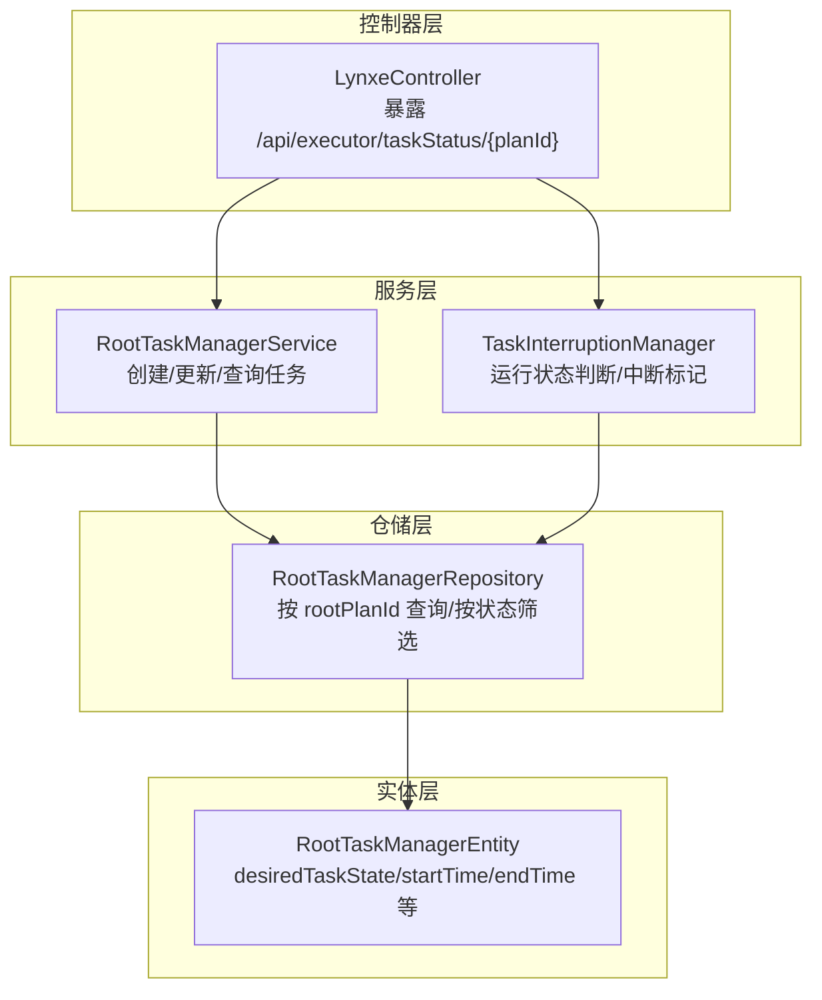
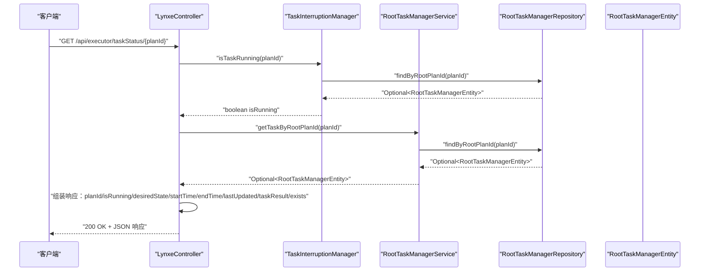
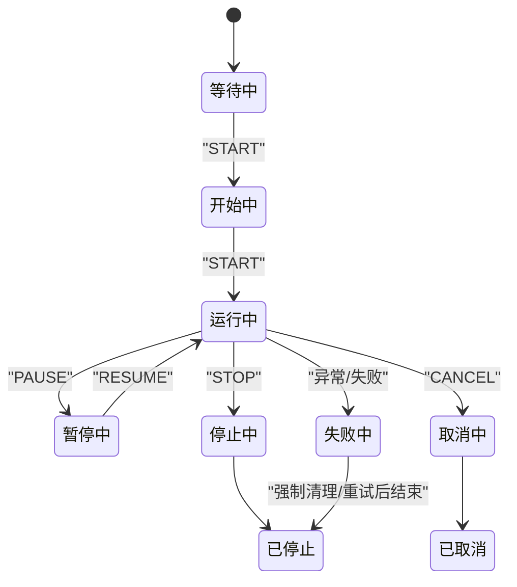
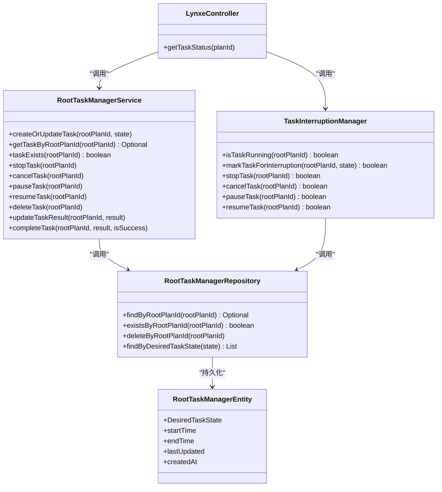

# 任务状态查询API

<cite>
**本文引用的文件**
- [LynxeController.java](file://src/main/java/com/alibaba/cloud/ai/lynxe/runtime/controller/LynxeController.java)
- [RootTaskManagerService.java](file://src/main/java/com/alibaba/cloud/ai/lynxe/runtime/service/RootTaskManagerService.java)
- [TaskInterruptionManager.java](file://src/main/java/com/alibaba/cloud/ai/lynxe/runtime/service/TaskInterruptionManager.java)
- [RootTaskManagerRepository.java](file://src/main/java/com/alibaba/cloud/ai/lynxe/runtime/repository/RootTaskManagerRepository.java)
- [RootTaskManagerEntity.java](file://src/main/java/com/alibaba/cloud/ai/lynxe/runtime/entity/po/RootTaskManagerEntity.java)
</cite>

## 目录
1. [简介](#简介)
2. [项目结构](#项目结构)
3. [核心组件](#核心组件)
4. [架构总览](#架构总览)
5. [详细组件分析](#详细组件分析)
6. [依赖关系分析](#依赖关系分析)
7. [性能考量](#性能考量)
8. [故障排查指南](#故障排查指南)
9. [结论](#结论)

## 简介
本文件围绕 JManus 的任务状态查询 API 进行深入文档化，重点解析 getTaskStatus 端点的实现细节。内容覆盖：
- 如何通过任务 ID 查询 RootTaskManagerEntity 实体，获取任务的当前状态（desiredTaskState）、期望状态、开始时间、结束时间等核心元数据；
- isTaskRunning 方法的判断逻辑，包括对 RUNNING 状态与非终止状态的综合判定；
- desiredTaskState 状态机的含义及其在任务控制中的作用，如 STOP、PAUSE、RESUME 等指令的传递机制；
- 提供状态转换图，涵盖 START、RUNNING、STOPPING、STOPPED、FAILED 等状态；
- 结合实际代码说明如何通过 RootTaskManagerService 进行状态聚合与查询优化。

## 项目结构
与任务状态查询 API 相关的关键模块位于 runtime 子系统中，采用典型的分层架构：控制器层负责暴露 HTTP 接口，服务层负责业务编排与状态聚合，仓储层负责持久化访问，实体层承载状态模型。

图表来源
- [LynxeController.java](file://src/main/java/com/alibaba/cloud/ai/lynxe/runtime/controller/LynxeController.java#L871-L903)
- [RootTaskManagerService.java](file://src/main/java/com/alibaba/cloud/ai/lynxe/runtime/service/RootTaskManagerService.java#L48-L104)
- [TaskInterruptionManager.java](file://src/main/java/com/alibaba/cloud/ai/lynxe/runtime/service/TaskInterruptionManager.java#L74-L89)
- [RootTaskManagerRepository.java](file://src/main/java/com/alibaba/cloud/ai/lynxe/runtime/repository/RootTaskManagerRepository.java#L33-L61)
- [RootTaskManagerEntity.java](file://src/main/java/com/alibaba/cloud/ai/lynxe/runtime/entity/po/RootTaskManagerEntity.java#L40-L110)

章节来源
- [LynxeController.java](file://src/main/java/com/alibaba/cloud/ai/lynxe/runtime/controller/LynxeController.java#L871-L903)
- [RootTaskManagerService.java](file://src/main/java/com/alibaba/cloud/ai/lynxe/runtime/service/RootTaskManagerService.java#L48-L104)
- [TaskInterruptionManager.java](file://src/main/java/com/alibaba/cloud/ai/lynxe/runtime/service/TaskInterruptionManager.java#L74-L89)
- [RootTaskManagerRepository.java](file://src/main/java/com/alibaba/cloud/ai/lynxe/runtime/repository/RootTaskManagerRepository.java#L33-L61)
- [RootTaskManagerEntity.java](file://src/main/java/com/alibaba/cloud/ai/lynxe/runtime/entity/po/RootTaskManagerEntity.java#L40-L110)

## 核心组件
- 控制器端点：LynxeController 暴露 GET /api/executor/taskStatus/{planId}，用于查询指定 planId 的任务状态。
- 服务层：
  - RootTaskManagerService：负责创建/更新任务状态、查询任务、删除任务、设置结果、完成任务等。
  - TaskInterruptionManager：负责运行状态判断（isTaskRunning）、中断标记（STOP/CANCEL/PAUSE）、恢复标记（RESUME）等。
- 仓储层：RootTaskManagerRepository 提供按 rootPlanId 查询、存在性检查、按 desiredTaskState 筛选等能力。
- 实体层：RootTaskManagerEntity 定义 desiredTaskState 枚举及时间戳字段（startTime、endTime、lastUpdated、createdAt）。

章节来源
- [LynxeController.java](file://src/main/java/com/alibaba/cloud/ai/lynxe/runtime/controller/LynxeController.java#L871-L903)
- [RootTaskManagerService.java](file://src/main/java/com/alibaba/cloud/ai/lynxe/runtime/service/RootTaskManagerService.java#L48-L201)
- [TaskInterruptionManager.java](file://src/main/java/com/alibaba/cloud/ai/lynxe/runtime/service/TaskInterruptionManager.java#L49-L231)
- [RootTaskManagerRepository.java](file://src/main/java/com/alibaba/cloud/ai/lynxe/runtime/repository/RootTaskManagerRepository.java#L33-L61)
- [RootTaskManagerEntity.java](file://src/main/java/com/alibaba/cloud/ai/lynxe/runtime/entity/po/RootTaskManagerEntity.java#L40-L110)

## 架构总览
下图展示 getTaskStatus 端点从请求到响应的完整调用链路。

图表来源
- [LynxeController.java](file://src/main/java/com/alibaba/cloud/ai/lynxe/runtime/controller/LynxeController.java#L871-L903)
- [TaskInterruptionManager.java](file://src/main/java/com/alibaba/cloud/ai/lynxe/runtime/service/TaskInterruptionManager.java#L74-L89)
- [RootTaskManagerService.java](file://src/main/java/com/alibaba/cloud/ai/lynxe/runtime/service/RootTaskManagerService.java#L91-L94)
- [RootTaskManagerRepository.java](file://src/main/java/com/alibaba/cloud/ai/lynxe/runtime/repository/RootTaskManagerRepository.java#L33-L39)

## 详细组件分析

### getTaskStatus 端点实现细节
- 路径与方法：GET /api/executor/taskStatus/{planId}
- 输入参数：路径变量 planId（任务根计划 ID）
- 关键处理流程：
  - 调用 TaskInterruptionManager.isTaskRunning(planId) 判断任务是否处于“运行中”状态；
  - 调用 RootTaskManagerService.getTaskByRootPlanId(planId) 获取任务实体；
  - 组装响应对象，包含：
    - planId：任务标识
    - isRunning：布尔值，表示任务是否处于运行中
    - desiredState：期望状态（枚举）
    - startTime/endTime：开始/结束时间
    - lastUpdated：最后更新时间
    - taskResult：任务执行结果
    - exists：任务是否存在
  - 异常时返回 500 并附带错误信息

章节来源
- [LynxeController.java](file://src/main/java/com/alibaba/cloud/ai/lynxe/runtime/controller/LynxeController.java#L871-L903)

### isTaskRunning 方法的判断逻辑
- 判定条件：
  - 若数据库中存在该任务且其 desiredTaskState 为 START 或 RESUME，则认为任务“正在运行”；
  - 若不存在该任务或 desiredTaskState 为其他状态（如 STOP、CANCEL、PAUSE、WAIT），则认为任务“未运行”。
- 该逻辑确保了“运行中”的语义与 desiredTaskState 的设计保持一致，避免误判非终止状态为“运行中”。

章节来源
- [TaskInterruptionManager.java](file://src/main/java/com/alibaba/cloud/ai/lynxe/runtime/service/TaskInterruptionManager.java#L74-L89)

### desiredTaskState 状态机与控制指令
- 状态枚举（DesiredTaskState）：
  - START：用户希望任务开始
  - STOP：用户希望任务停止
  - PAUSE：用户希望任务暂停
  - RESUME：用户希望任务恢复
  - CANCEL：用户希望任务取消
  - WAIT：用户希望任务等待输入
- 状态机与控制指令传递机制：
  - 用户通过调用 RootTaskManagerService.createOrUpdateTask 或 TaskInterruptionManager 的 markTaskForInterruption/stopTask/cancelTask/pauseTask/resumeTask 等方法，将 desiredTaskState 写入数据库；
  - 执行器在轮询或调度过程中读取 desiredTaskState，并据此执行中断、暂停、恢复、停止等动作；
  - 时间戳管理：
    - START：首次进入 START 时设置 startTime；
    - STOP/PAUSE/CANCEL：首次进入这些状态时设置 endTime；
    - RESUME：清除 endTime；
    - 所有状态变更均更新 lastUpdated。

章节来源
- [RootTaskManagerEntity.java](file://src/main/java/com/alibaba/cloud/ai/lynxe/runtime/entity/po/RootTaskManagerEntity.java#L100-L110)
- [RootTaskManagerService.java](file://src/main/java/com/alibaba/cloud/ai/lynxe/runtime/service/RootTaskManagerService.java#L48-L84)
- [TaskInterruptionManager.java](file://src/main/java/com/alibaba/cloud/ai/lynxe/runtime/service/TaskInterruptionManager.java#L97-L120)
- [TaskInterruptionManager.java](file://src/main/java/com/alibaba/cloud/ai/lynxe/runtime/service/TaskInterruptionManager.java#L154-L168)

### 状态转换图（START/RUNNING/STOPPING/STOPPED/FAILED）
以下为基于 desiredTaskState 的状态转换示意，帮助理解任务生命周期与控制指令之间的关系。

说明
- “运行中”状态对应 desiredTaskState 为 START 或 RESUME；
- “停止中/已停止/已取消/失败中”等状态由 STOP、CANCEL、异常等触发；
- 时间戳变化：START 设置 startTime；STOP/PAUSE/CANCEL 设置 endTime；RESUME 清除 endTime。

图表来源
- [RootTaskManagerEntity.java](file://src/main/java/com/alibaba/cloud/ai/lynxe/runtime/entity/po/RootTaskManagerEntity.java#L100-L110)
- [RootTaskManagerService.java](file://src/main/java/com/alibaba/cloud/ai/lynxe/runtime/service/RootTaskManagerService.java#L48-L84)
- [TaskInterruptionManager.java](file://src/main/java/com/alibaba/cloud/ai/lynxe/runtime/service/TaskInterruptionManager.java#L97-L120)
- [TaskInterruptionManager.java](file://src/main/java/com/alibaba/cloud/ai/lynxe/runtime/service/TaskInterruptionManager.java#L154-L168)

### RootTaskManagerService 的状态聚合与查询优化
- 查询优化策略：
  - 使用 findByRootPlanId(planId) 进行单条记录的快速读取，避免全表扫描；
  - 提供 findByDesiredTaskState(START) 以支持批量统计“正在运行的任务数量/列表”，便于前端或监控使用。
- 状态聚合：
  - isTaskRunning 通过 TaskInterruptionManager 的判断逻辑，将 desiredTaskState 与运行态语义对齐；
  - getTaskByRootPlanId 返回 Optional，便于统一处理任务存在与否的情况；
  - completeTask 将任务结果、最终状态与结束时间一并写入，形成完整的生命周期记录。

章节来源
- [RootTaskManagerRepository.java](file://src/main/java/com/alibaba/cloud/ai/lynxe/runtime/repository/RootTaskManagerRepository.java#L33-L61)
- [RootTaskManagerService.java](file://src/main/java/com/alibaba/cloud/ai/lynxe/runtime/service/RootTaskManagerService.java#L91-L104)
- [TaskInterruptionManager.java](file://src/main/java/com/alibaba/cloud/ai/lynxe/runtime/service/TaskInterruptionManager.java#L180-L195)

## 依赖关系分析
- 控制器依赖服务层：
  - LynxeController 在 getTaskStatus 中同时依赖 TaskInterruptionManager（运行态判断）与 RootTaskManagerService（任务查询）。
- 服务层依赖仓储层：
  - RootTaskManagerService 与 TaskInterruptionManager 均依赖 RootTaskManagerRepository 进行持久化操作。
- 实体层提供状态模型：
  - RootTaskManagerEntity 的 desiredTaskState 与时间戳字段为状态机与时间线管理提供基础。

图表来源
- [LynxeController.java](file://src/main/java/com/alibaba/cloud/ai/lynxe/runtime/controller/LynxeController.java#L871-L903)
- [TaskInterruptionManager.java](file://src/main/java/com/alibaba/cloud/ai/lynxe/runtime/service/TaskInterruptionManager.java#L49-L231)
- [RootTaskManagerService.java](file://src/main/java/com/alibaba/cloud/ai/lynxe/runtime/service/RootTaskManagerService.java#L48-L201)
- [RootTaskManagerRepository.java](file://src/main/java/com/alibaba/cloud/ai/lynxe/runtime/repository/RootTaskManagerRepository.java#L33-L61)
- [RootTaskManagerEntity.java](file://src/main/java/com/alibaba/cloud/ai/lynxe/runtime/entity/po/RootTaskManagerEntity.java#L40-L110)

## 性能考量
- 单次查询开销低：getTaskStatus 仅进行两次轻量级数据库查询（一次运行态判断，一次任务详情查询），适合高频调用场景。
- 批量统计：getRunningTaskCount/getRunningTaskIds 通过 findByDesiredTaskState(START) 快速统计运行中任务，避免逐条扫描。
- 时间戳与状态联动：通过在状态切换时自动维护 startTime/endTime/lastUpdated，减少额外计算成本。
- 建议：
  - 对高频查询可考虑缓存最近一次的状态结果（需注意并发一致性）；
  - 对大规模任务场景，建议对 rootPlanId 建立合适的索引以提升查询性能。

## 故障排查指南
- 常见问题与定位思路：
  - 任务不存在：getTaskStatus 返回 exists=false，isRunning=false，desiredState=null，startTime/endTime/lastUpdated/taskResult=null；
  - 运行态误判：确认 desiredTaskState 是否为 START 或 RESUME；若为 WAIT/PAUSE/STOP/CANCEL/RESUME（但未恢复）会被视为未运行；
  - 状态不一致：检查是否正确调用了 RootTaskManagerService.createOrUpdateTask 或 TaskInterruptionManager 的标记方法；
  - 时间戳异常：确认 START/STOP/PAUSE/CANCEL 是否按预期设置了 startTime/endTime。
- 日志与异常：
  - 控制器层捕获异常并返回 500，日志中会记录失败原因；
  - 服务层与管理器层均输出关键操作日志，便于回溯。

章节来源
- [LynxeController.java](file://src/main/java/com/alibaba/cloud/ai/lynxe/runtime/controller/LynxeController.java#L905-L909)
- [RootTaskManagerService.java](file://src/main/java/com/alibaba/cloud/ai/lynxe/runtime/service/RootTaskManagerService.java#L48-L84)
- [TaskInterruptionManager.java](file://src/main/java/com/alibaba/cloud/ai/lynxe/runtime/service/TaskInterruptionManager.java#L97-L120)

## 结论
- getTaskStatus 端点通过 isTaskRunning 与 getTaskByRootPlanId 的组合，提供了简洁而准确的任务状态视图；
- desiredTaskState 状态机清晰地表达了用户期望与执行器行为之间的契约，配合时间戳管理形成完整的生命周期记录；
- RootTaskManagerService 与 TaskInterruptionManager 的职责划分合理，既保证了查询效率，又便于扩展新的控制指令；
- 建议在生产环境中结合索引与缓存策略进一步优化高频查询场景，并完善异常与可观测性告警。