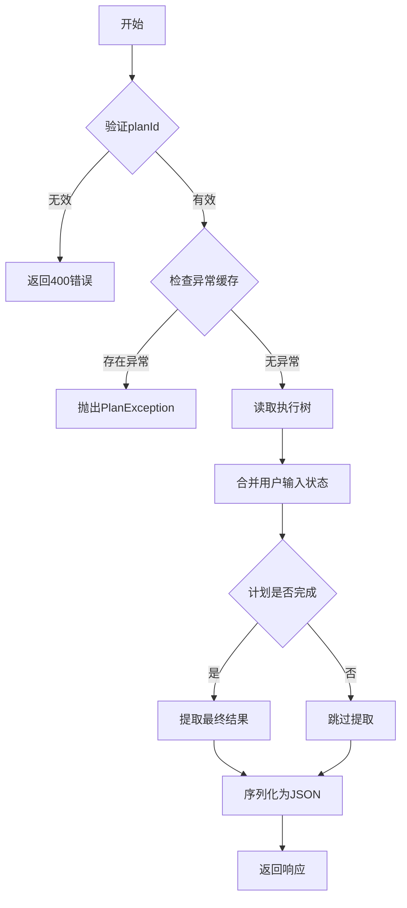
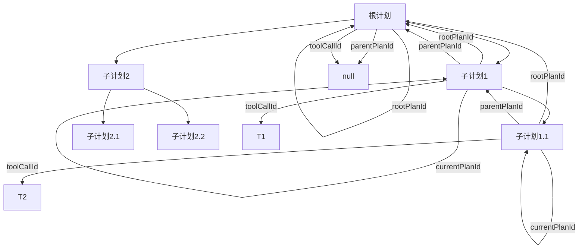
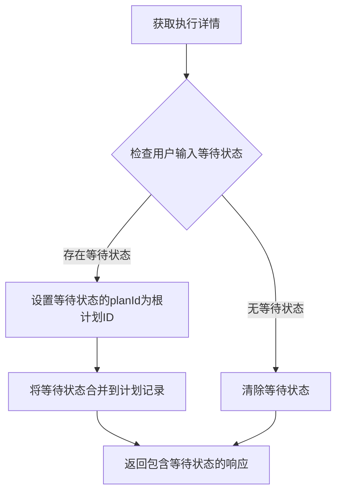
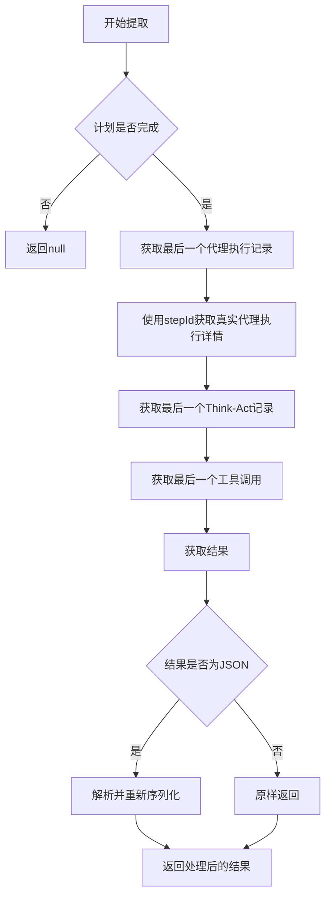
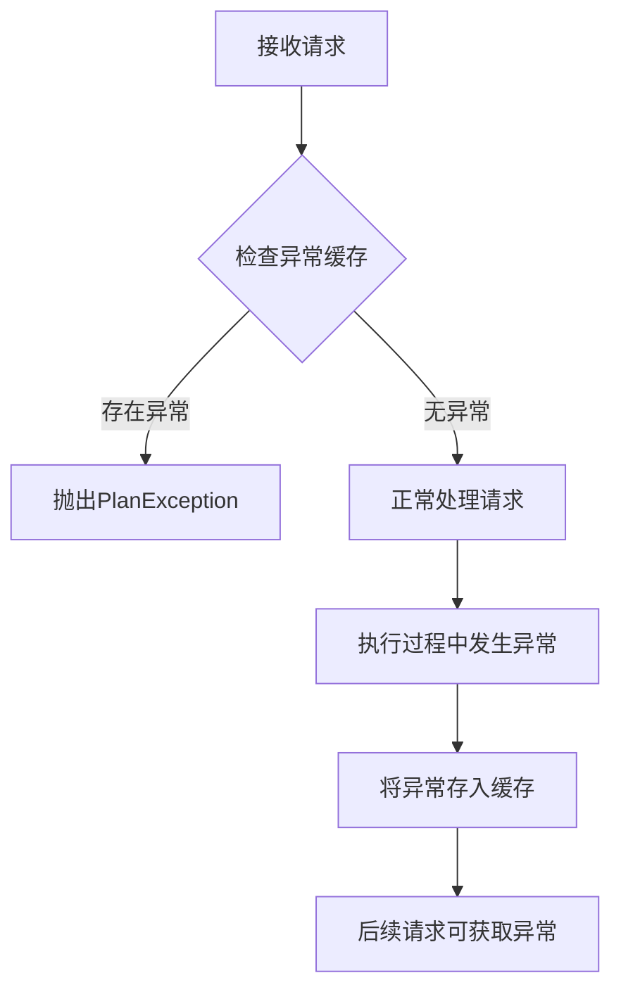

# 执行记录API

<cite>
**本文档引用的文件**   
- [PlanExecutionRecord.java](file://src/main/java/com/alibaba/cloud/ai/lynxe/recorder/entity/vo/PlanExecutionRecord.java)
- [LynxeController.java](file://src/main/java/com/alibaba/cloud/ai/lynxe/runtime/controller/LynxeController.java)
- [PlanHierarchyReaderService.java](file://src/main/java/com/alibaba/cloud/ai/lynxe/recorder/service/PlanHierarchyReaderService.java)
- [NewRepoPlanExecutionRecorder.java](file://src/main/java/com/alibaba/cloud/ai/lynxe/recorder/service/NewRepoPlanExecutionRecorder.java)
- [AgentExecutionRecord.java](file://src/main/java/com/alibaba/cloud/ai/lynxe/recorder/entity/vo/AgentExecutionRecord.java)
- [ThinkActRecord.java](file://src/main/java/com/alibaba/cloud/ai/lynxe/recorder/entity/vo/ThinkActRecord.java)
- [UserInputWaitState.java](file://src/main/java/com/alibaba/cloud/ai/lynxe/runtime/entity/vo/UserInputWaitState.java)
</cite>

## 目录
1. [简介](#简介)
2. [核心数据结构](#核心数据结构)
3. [getExecutionDetails端点实现](#getexecutiondetails端点实现)
4. [PlanExecutionRecord层次关系](#planexecutionrecord层次关系)
5. [用户输入等待状态处理](#用户输入等待状态处理)
6. [最终结果提取机制](#最终结果提取机制)
7. [异常缓存机制](#异常缓存机制)
8. [响应数据示例](#响应数据示例)
9. [removeExecutionDetails端点语义](#removeexecutiondetails端点语义)
10. [总结](#总结)

## 简介
执行记录API是JManus系统的核心接口之一，用于跟踪和记录计划执行的详细过程。该API提供了对执行过程的全面监控能力，包括获取执行详情、处理用户输入等待状态、提取最终结果等功能。本文档将深入分析`getExecutionDetails`端点的实现细节，详细描述`PlanExecutionRecord`数据结构的层次关系，并解释相关机制的实现原理。

**Section sources**
- [LynxeController.java](file://src/main/java/com/alibaba/cloud/ai/lynxe/runtime/controller/LynxeController.java#L378-L459)

## 核心数据结构
执行记录API的核心是`PlanExecutionRecord`数据结构，它记录了计划执行的完整信息。该数据结构包含多个关键字段，构成了执行记录的层次关系。

### PlanExecutionRecord主要字段
`PlanExecutionRecord`类定义了计划执行记录的核心属性，主要包括：

- **currentPlanId**: 当前计划的唯一标识符
- **rootPlanId**: 根计划ID（用于子计划）
- **parentPlanId**: 父计划ID（用于子计划）
- **toolCallId**: 触发此计划的工具调用ID（用于子计划）
- **title**: 计划标题
- **userRequest**: 用户的原始请求
- **startTime**: 执行开始时间
- **endTime**: 执行结束时间
- **completed**: 是否完成
- **summary**: 执行摘要
- **agentExecutionSequence**: 代理执行序列（核心数据）
- **userInputWaitState**: 用户输入等待状态
- **modelName**: 实际调用的模型
- **parentActToolCall**: 触发此子计划的父工具调用信息
- **structureResult**: 结构化结果（提取的最后工具调用结果）

**Section sources**
- [PlanExecutionRecord.java](file://src/main/java/com/alibaba/cloud/ai/lynxe/recorder/entity/vo/PlanExecutionRecord.java#L48-L102)

## getExecutionDetails端点实现
`getExecutionDetails`端点是执行记录API的核心接口，用于获取指定计划ID的完整执行记录和状态。

### 端点基本信息
- **接口文件**: `LynxeController.java`
- **主要入口**: `GET /api/executor/details/{planId}`
- **功能**: 获取指定planId的完整执行记录及状态

### 实现流程
`getExecutionDetails`方法的实现流程如下：

1. 验证planId参数的有效性
2. 从异常缓存中检查是否存在执行异常
3. 调用`PlanHierarchyReaderService.readPlanTreeByRootId`方法读取执行树
4. 合并用户输入等待状态
5. 提取最终工具调用结果
6. 序列化为JSON响应



**Diagram sources **
- [LynxeController.java](file://src/main/java/com/alibaba/cloud/ai/lynxe/runtime/controller/LynxeController.java#L378-L459)

**Section sources**
- [LynxeController.java](file://src/main/java/com/alibaba/cloud/ai/lynxe/runtime/controller/LynxeController.java#L378-L459)

## PlanExecutionRecord层次关系
`PlanExecutionRecord`数据结构通过多个字段建立了清晰的层次关系，支持复杂的计划执行场景。

### 层次关系字段
| 字段名 | 说明 | 使用场景 |
|--------|------|----------|
| currentPlanId | 当前计划的唯一标识符 | 标识当前执行的计划 |
| rootPlanId | 根计划ID（用于子计划） | 在子计划中指向根计划 |
| parentPlanId | 父计划ID（用于子计划） | 在子计划中指向上一级计划 |
| toolCallId | 触发此计划的工具调用ID | 标识触发子计划的工具调用 |

### 层次关系示例


**Diagram sources **
- [PlanExecutionRecord.java](file://src/main/java/com/alibaba/cloud/ai/lynxe/recorder/entity/vo/PlanExecutionRecord.java#L51-L62)

**Section sources**
- [PlanExecutionRecord.java](file://src/main/java/com/alibaba/cloud/ai/lynxe/recorder/entity/vo/PlanExecutionRecord.java#L51-L62)

## 用户输入等待状态处理
API通过`UserInputWaitState`机制处理需要用户输入的场景，确保在需要用户交互时能够正确暂停执行并等待输入。

### 处理流程
1. 检查根计划ID对应的用户输入等待状态
2. 如果存在等待状态，则将其合并到计划记录中
3. 设置等待状态的planId为根计划ID以确保正确提交



**Diagram sources **
- [LynxeController.java](file://src/main/java/com/alibaba/cloud/ai/lynxe/runtime/controller/LynxeController.java#L396-L413)

**Section sources**
- [LynxeController.java](file://src/main/java/com/alibaba/cloud/ai/lynxe/runtime/controller/LynxeController.java#L396-L413)
- [UserInputWaitState.java](file://src/main/java/com/alibaba/cloud/ai/lynxe/runtime/entity/vo/UserInputWaitState.java)

## 最终结果提取机制
`extractLastToolCallResult`方法负责从执行记录中提取最终的工具调用结果，处理JSON字符串的双重转义问题。

### 提取流程
1. 验证计划记录是否存在且已完成
2. 获取代理执行序列中的最后一个代理执行记录
3. 使用stepId获取真实的代理执行详情（包含完整的Think-Act记录）
4. 遍历Think-Act记录链，获取最后一个工具调用的结果
5. 处理JSON字符串的双重转义问题

### JSON双重转义处理
当结果为JSON字符串时，方法会尝试解析并重新序列化，避免双重转义问题：

```java
try {
    // 尝试解析为JSON
    JsonNode jsonNode = objectMapper.readTree(result);
    // 重新序列化，避免双重转义
    return objectMapper.writeValueAsString(jsonNode);
} catch (Exception e) {
    // 如果不是有效JSON，原样返回
    return result;
}
```



**Diagram sources **
- [LynxeController.java](file://src/main/java/com/alibaba/cloud/ai/lynxe/runtime/controller/LynxeController.java#L717-L793)

**Section sources**
- [LynxeController.java](file://src/main/java/com/alibaba/cloud/ai/lynxe/runtime/controller/LynxeController.java#L717-L793)
- [ThinkActRecord.java](file://src/main/java/com/alibaba/cloud/ai/lynxe/recorder/entity/vo/ThinkActRecord.java)
- [AgentExecutionRecord.java](file://src/main/java/com/alibaba/cloud/ai/lynxe/recorder/entity/vo/AgentExecutionRecord.java)

## 异常缓存机制
系统通过`exceptionCache`处理执行异常，确保异常信息能够在后续请求中被正确传递。

### 缓存实现
- 使用Guava Cache实现异常缓存
- 缓存有效期为10分钟
- 异常信息与planId关联存储

### 异常处理流程


**Diagram sources **
- [LynxeController.java](file://src/main/java/com/alibaba/cloud/ai/lynxe/runtime/controller/LynxeController.java#L100-L156)

**Section sources**
- [LynxeController.java](file://src/main/java/com/alibaba/cloud/ai/lynxe/runtime/controller/LynxeController.java#L100-L156)

## 响应数据示例
### 进行中状态响应
```json
{
  "currentPlanId": "plan-123",
  "rootPlanId": "plan-123",
  "title": "数据分析任务",
  "status": "running",
  "completed": false,
  "agentExecutionSequence": [
    {
      "stepId": "step-1",
      "agentName": "DataAnalyzer",
      "status": "RUNNING",
      "result": null
    }
  ],
  "userInputWaitState": null
}
```

### 已完成状态响应
```json
{
  "currentPlanId": "plan-123",
  "rootPlanId": "plan-123",
  "title": "数据分析任务",
  "status": "completed",
  "completed": true,
  "summary": "数据分析完成，生成了详细的报告",
  "agentExecutionSequence": [
    {
      "stepId": "step-1",
      "agentName": "DataAnalyzer",
      "status": "FINISHED",
      "result": "分析结果..."
    }
  ],
  "structureResult": "{\"report\":\"详细分析报告内容\"}",
  "userInputWaitState": null
}
```

**Section sources**
- [PlanExecutionRecord.java](file://src/main/java/com/alibaba/cloud/ai/lynxe/recorder/entity/vo/PlanExecutionRecord.java)
- [LynxeController.java](file://src/main/java/com/alibaba/cloud/ai/lynxe/runtime/controller/LynxeController.java)

## removeExecutionDetails端点语义
`removeExecutionDetails`端点的语义需要特别注意：执行记录实际存储在数据库中，该API仅作存在性检查。

### 端点实现
```java
@DeleteMapping("/details/{planId}")
public ResponseEntity<Map<String, String>> removeExecutionDetails(@PathVariable("planId") String planId) {
    PlanExecutionRecord planRecord = planHierarchyReaderService.readPlanTreeByRootId(planId);
    if (planRecord == null) {
        return ResponseEntity.notFound().build();
    }
    
    // 注意：执行记录已存储在数据库中，不需要删除
    return ResponseEntity.ok(Map.of("message", "执行记录存在（无需删除）", "planId", planId));
}
```

### 实际语义
- 该端点不实际删除数据库中的执行记录
- 主要用于检查执行记录是否存在
- 返回成功响应表示执行记录存在
- 返回404表示执行记录不存在

**Section sources**
- [LynxeController.java](file://src/main/java/com/alibaba/cloud/ai/lynxe/runtime/controller/LynxeController.java#L448-L459)

## 总结
执行记录API是JManus系统的核心组件，提供了完整的计划执行跟踪能力。通过`PlanExecutionRecord`数据结构的层次关系设计，系统能够有效管理复杂的计划执行场景，包括根计划、子计划和嵌套计划。API通过`getExecutionDetails`端点提供详细的执行信息，支持用户输入等待状态处理和最终结果提取。异常缓存机制确保了执行异常的可靠传递，而`removeExecutionDetails`端点的存在性检查语义则明确了执行记录的持久化特性。整体设计体现了高内聚、低耦合的原则，为系统的可维护性和可扩展性奠定了基础。