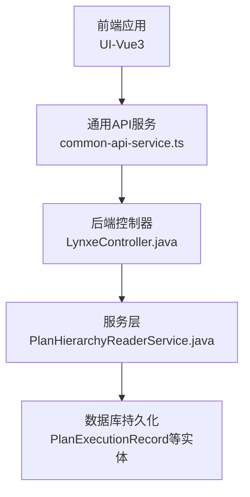
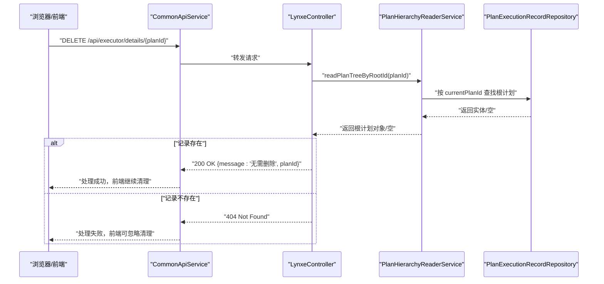
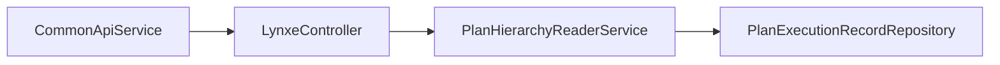

# 执行记录删除

<cite>
**本文引用的文件**
- [LynxeController.java](file://src/main/java/com/alibaba/cloud/ai/lynxe/runtime/controller/LynxeController.java)
- [PlanHierarchyReaderService.java](file://src/main/java/com/alibaba/cloud/ai/lynxe/recorder/service/PlanHierarchyReaderService.java)
- [common-api-service.ts](file://ui-vue3/src/api/common-api-service.ts)
- [usePlanExecution.ts](file://ui-vue3/src/composables/usePlanExecution.ts)
</cite>

## 目录
1. [简介](#简介)
2. [项目结构](#项目结构)
3. [核心组件](#核心组件)
4. [架构总览](#架构总览)
5. [详细组件分析](#详细组件分析)
6. [依赖关系分析](#依赖关系分析)
7. [性能考量](#性能考量)
8. [故障排查指南](#故障排查指南)
9. [结论](#结论)

## 简介
本文件面向前端与集成方，系统化阐述 JManus 中“执行记录删除”API 的真实语义与行为。该API的端点为 DELETE /api/executor/details/{planId}，但其实质并非删除操作，而是一个“存在性检查接口”。其设计目标是为前端提供一种轻量、无副作用的检查方式：若指定 planId 对应的执行记录存在，则返回成功并提示“无需删除”，否则返回 404。该设计避免了对数据库持久化层的写入操作，同时满足前端在任务完成后进行清理前的状态确认需求。

## 项目结构
围绕“执行记录删除”API，涉及后端控制器、服务层与前端调用链路如下：
- 后端控制器：负责接收请求、调用服务层、返回标准HTTP响应。
- 服务层：通过 PlanHierarchyReaderService 查询根计划树，判断记录是否存在。
- 前端：通过通用API服务发起 DELETE 请求，并在任务完成后触发清理流程。

图表来源
- [LynxeController.java](file://src/main/java/com/alibaba/cloud/ai/lynxe/runtime/controller/LynxeController.java#L448-L459)
- [PlanHierarchyReaderService.java](file://src/main/java/com/alibaba/cloud/ai/lynxe/recorder/service/PlanHierarchyReaderService.java#L83-L146)
- [common-api-service.ts](file://ui-vue3/src/api/common-api-service.ts#L56-L71)

章节来源
- [LynxeController.java](file://src/main/java/com/alibaba/cloud/ai/lynxe/runtime/controller/LynxeController.java#L448-L459)
- [PlanHierarchyReaderService.java](file://src/main/java/com/alibaba/cloud/ai/lynxe/recorder/service/PlanHierarchyReaderService.java#L83-L146)
- [common-api-service.ts](file://ui-vue3/src/api/common-api-service.ts#L56-L71)

## 核心组件
- 控制器端点：DELETE /api/executor/details/{planId}
  - 职责：接收 planId，调用服务层进行存在性检查，按结果返回 200 或 404。
- 服务层方法：PlanHierarchyReaderService.readPlanTreeByRootId(rootPlanId)
  - 职责：基于 rootPlanId 查询根计划及其子计划树，返回根计划对象或空值。
- 前端调用：CommonApiService.deleteExecutionDetails(planId)
  - 职责：向后端发送 DELETE 请求；当后端返回 200 时，前端据此执行后续清理逻辑。

章节来源
- [LynxeController.java](file://src/main/java/com/alibaba/cloud/ai/lynxe/runtime/controller/LynxeController.java#L448-L459)
- [PlanHierarchyReaderService.java](file://src/main/java/com/alibaba/cloud/ai/lynxe/recorder/service/PlanHierarchyReaderService.java#L83-L146)
- [common-api-service.ts](file://ui-vue3/src/api/common-api-service.ts#L56-L71)

## 架构总览
下图展示从浏览器到后端控制器、再到服务层与数据库的调用路径，以及前端在任务完成后触发清理的流程。

图表来源
- [LynxeController.java](file://src/main/java/com/alibaba/cloud/ai/lynxe/runtime/controller/LynxeController.java#L448-L459)
- [PlanHierarchyReaderService.java](file://src/main/java/com/alibaba/cloud/ai/lynxe/recorder/service/PlanHierarchyReaderService.java#L83-L146)
- [common-api-service.ts](file://ui-vue3/src/api/common-api-service.ts#L56-L71)

## 详细组件分析

### 控制器端点：DELETE /api/executor/details/{planId}
- 行为说明
  - 接收 planId 参数，调用服务层方法进行存在性检查。
  - 若返回非空（存在），控制器返回 200 OK，并携带提示信息“无需删除”。
  - 若返回空（不存在），控制器返回 404 Not Found。
- 设计意图
  - 将“删除”语义从“业务操作”降级为“存在性检查”，避免对数据库产生不必要的写入。
  - 为前端提供统一的清理入口：无论记录是否仍存在于数据库，前端均可安全地调用该端点以确认状态，再决定是否执行本地清理。

章节来源
- [LynxeController.java](file://src/main/java/com/alibaba/cloud/ai/lynxe/runtime/controller/LynxeController.java#L448-L459)

### 服务层：PlanHierarchyReaderService.readPlanTreeByRootId
- 工作原理
  - 输入 rootPlanId（即 planId）。
  - 先按 currentPlanId 查询根计划；若不存在则直接返回空。
  - 再按 rootPlanId 查询所有相关计划（含根计划自身）。
  - 将实体转换为 VO 并构建层级关系，最终返回根计划对象。
- 返回值语义
  - 非空：表示该 planId 对应的执行记录存在。
  - 空：表示该 planId 对应的执行记录不存在。

章节来源
- [PlanHierarchyReaderService.java](file://src/main/java/com/alibaba/cloud/ai/lynxe/recorder/service/PlanHierarchyReaderService.java#L83-L146)

### 前端调用链：清理流程
- 调用入口
  - CommonApiService.deleteExecutionDetails(planId) 发起 DELETE 请求。
- 清理时机
  - 在任务完成后，前端组合轮询策略获取摘要或结果，达到阈值或超时后，调用该API确认记录状态，随后执行本地清理。
- 错误处理
  - 当后端返回非 2xx 时，前端记录错误并可选择重试或跳过清理。

章节来源
- [common-api-service.ts](file://ui-vue3/src/api/common-api-service.ts#L56-L71)
- [usePlanExecution.ts](file://ui-vue3/src/composables/usePlanExecution.ts#L205-L233)

### 删除API的真正语义与设计动机
- 非删除语义
  - 该API不执行任何数据库删除操作；其返回的“无需删除”正是对这一事实的明确提示。
- 存在性检查
  - 通过 readPlanTreeByRootId 判断记录是否存在，从而为前端提供可靠的清理前置条件。
- 无副作用
  - 不修改数据库，不改变现有执行记录；仅用于状态确认，降低前端清理逻辑的复杂度与风险。

章节来源
- [LynxeController.java](file://src/main/java/com/alibaba/cloud/ai/lynxe/runtime/controller/LynxeController.java#L448-L459)
- [PlanHierarchyReaderService.java](file://src/main/java/com/alibaba/cloud/ai/lynxe/recorder/service/PlanHierarchyReaderService.java#L83-L146)

## 依赖关系分析
- 控制器依赖服务层：LynxeController 通过注入的 PlanHierarchyReaderService 完成存在性检查。
- 服务层依赖仓库层：PlanHierarchyReaderService 使用 PlanExecutionRecordRepository 按 currentPlanId 与 rootPlanId 查询计划树。
- 前端依赖控制器：CommonApiService 以标准REST方式调用后端端点。

图表来源
- [LynxeController.java](file://src/main/java/com/alibaba/cloud/ai/lynxe/runtime/controller/LynxeController.java#L448-L459)
- [PlanHierarchyReaderService.java](file://src/main/java/com/alibaba/cloud/ai/lynxe/recorder/service/PlanHierarchyReaderService.java#L83-L146)
- [common-api-service.ts](file://ui-vue3/src/api/common-api-service.ts#L56-L71)

章节来源
- [LynxeController.java](file://src/main/java/com/alibaba/cloud/ai/lynxe/runtime/controller/LynxeController.java#L448-L459)
- [PlanHierarchyReaderService.java](file://src/main/java/com/alibaba/cloud/ai/lynxe/recorder/service/PlanHierarchyReaderService.java#L83-L146)
- [common-api-service.ts](file://ui-vue3/src/api/common-api-service.ts#L56-L71)

## 性能考量
- 查询成本
  - readPlanTreeByRootId 会先按 currentPlanId 查询根计划，再按 rootPlanId 查询全部相关计划，最后构建层级关系。整体为一次根计划定位 + 一次批量查询 + 构建层级，通常为 O(n) 级别。
- 缓存与并发
  - 控制器未对存在性检查做缓存；若前端频繁调用，建议在前端侧增加短时缓存或去抖策略，减少重复请求。
- 数据库压力
  - 该API不写入数据库，仅读取；对数据库压力较小，适合高频调用。

## 故障排查指南
- 常见问题
  - 404 Not Found：planId 不存在或已过期，需确认 planId 是否正确、是否已完成清理。
  - 200 OK 且 message 提示“无需删除”：表示记录仍存在于数据库，前端可继续执行本地清理。
  - 前端异常：当 DELETE 返回非 2xx 时，前端会抛出错误；可在调用处捕获并记录日志，必要时重试。
- 排查步骤
  - 确认请求URL与参数：DELETE /api/executor/details/{planId}。
  - 检查后端日志：观察控制器与服务层的日志输出，确认是否存在异常或空值路径。
  - 前端日志：查看 CommonApiService 的错误分支与 usePlanExecution 的清理逻辑。

章节来源
- [LynxeController.java](file://src/main/java/com/alibaba/cloud/ai/lynxe/runtime/controller/LynxeController.java#L448-L459)
- [common-api-service.ts](file://ui-vue3/src/api/common-api-service.ts#L56-L71)
- [usePlanExecution.ts](file://ui-vue3/src/composables/usePlanExecution.ts#L205-L233)

## 结论
- DELETE /api/executor/details/{planId} 的真实语义是“存在性检查”，而非删除。
- 该设计避免了对数据库的写入，降低了清理流程的复杂度与风险，同时为前端提供了稳定的前置确认能力。
- 建议前端在任务完成后，先调用该端点确认状态，再执行本地清理；如遇非 2xx 响应，应记录并可选重试。