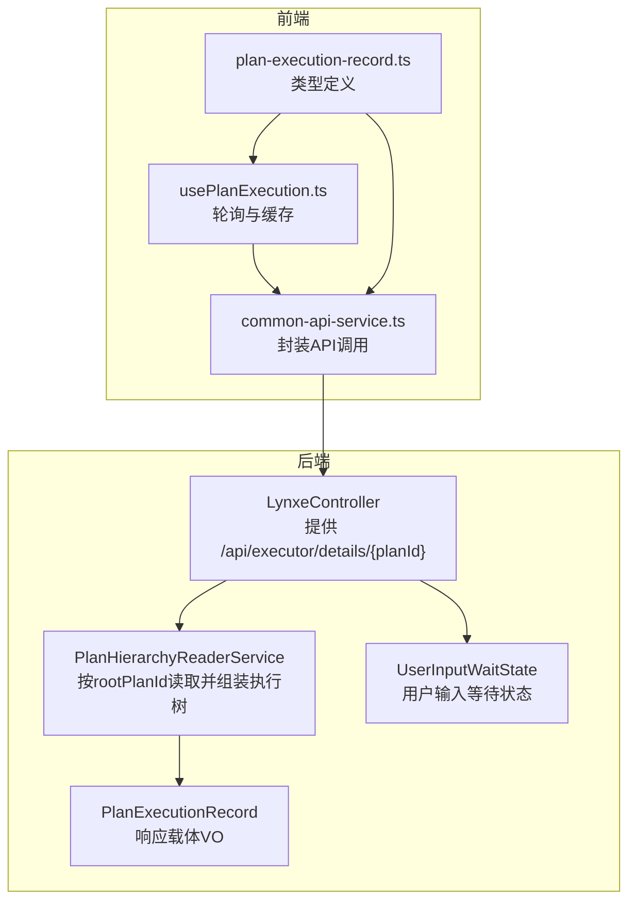
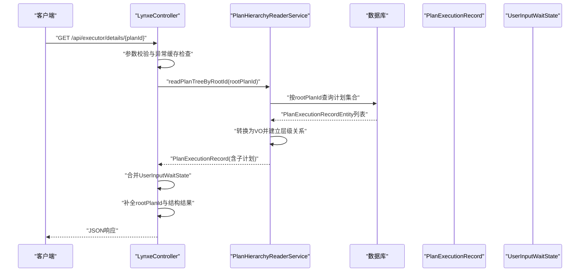
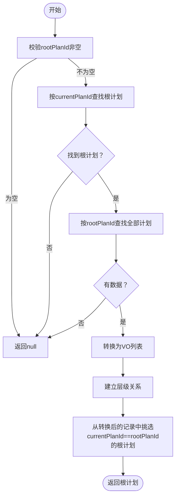
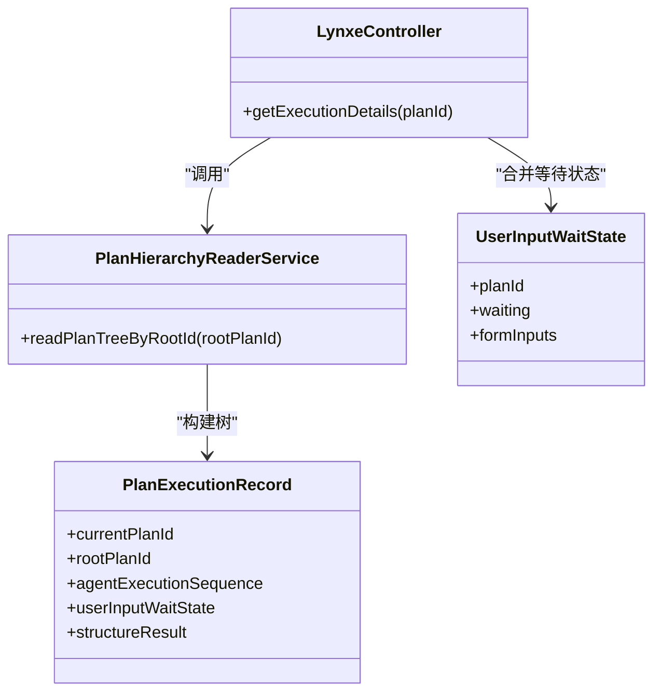

# 执行详情查询

<cite>
**本文引用的文件**
- [LynxeController.java](file://src/main/java/com/alibaba/cloud/ai/lynxe/runtime/controller/LynxeController.java)
- [PlanHierarchyReaderService.java](file://src/main/java/com/alibaba/cloud/ai/lynxe/recorder/service/PlanHierarchyReaderService.java)
- [PlanExecutionRecord.java](file://src/main/java/com/alibaba/cloud/ai/lynxe/recorder/entity/vo/PlanExecutionRecord.java)
- [UserInputWaitState.java](file://src/main/java/com/alibaba/cloud/ai/lynxe/runtime/entity/vo/UserInputWaitState.java)
- [plan-execution-record.ts](file://ui-vue3/src/types/plan-execution-record.ts)
- [usePlanExecution.ts](file://ui-vue3/src/composables/usePlanExecution.ts)
- [common-api-service.ts](file://ui-vue3/src/api/common-api-service.ts)
</cite>

## 目录
1. [简介](#简介)
2. [项目结构](#项目结构)
3. [核心组件](#核心组件)
4. [架构总览](#架构总览)
5. [详细组件分析](#详细组件分析)
6. [依赖分析](#依赖分析)
7. [性能考虑](#性能考虑)
8. [故障排查指南](#故障排查指南)
9. [结论](#结论)
10. [附录](#附录)

## 简介
本文件面向“执行详情查询”API（GET /api/executor/details/{planId}），系统性说明其在JManus中的实现机制与响应结构。重点涵盖：
- API如何通过PlanHierarchyReaderService.readPlanTreeByRootId从数据库读取完整的执行树结构，并构建包含所有子计划的层次化PlanExecutionRecord对象；
- 响应JSON结构中关键字段（如planId、rootPlanId、agentExecutionSequence等）的含义与关系；
- 进行中状态时currentStepIndex如何动态反映当前执行进度；
- 完成后如何通过isCompleted与summary提供最终结果；
- UserInputWaitState如何被合并到响应中以支持用户输入等待场景；
- 提供请求示例与成功响应示例（进行中与已完成两种形态）。

## 项目结构
围绕执行详情查询API的关键模块与职责如下：
- 控制器层：LynxeController提供REST接口，负责接收请求、调用服务、序列化响应；
- 服务层：PlanHierarchyReaderService负责按根计划ID读取并组装完整执行树；
- 领域模型：PlanExecutionRecord为响应载体，承载计划基本信息、步骤索引、代理执行序列、用户输入等待状态等；
- 前端类型：plan-execution-record.ts定义与后端一致的响应结构，便于前端消费；
- 前端轮询：usePlanExecution.ts对执行详情进行轮询与缓存管理，配合UI展示。

图表来源
- [LynxeController.java](file://src/main/java/com/alibaba/cloud/ai/lynxe/runtime/controller/LynxeController.java#L378-L441)
- [PlanHierarchyReaderService.java](file://src/main/java/com/alibaba/cloud/ai/lynxe/recorder/service/PlanHierarchyReaderService.java#L83-L146)
- [PlanExecutionRecord.java](file://src/main/java/com/alibaba/cloud/ai/lynxe/recorder/entity/vo/PlanExecutionRecord.java#L29-L102)
- [UserInputWaitState.java](file://src/main/java/com/alibaba/cloud/ai/lynxe/runtime/entity/vo/UserInputWaitState.java#L22-L84)
- [plan-execution-record.ts](file://ui-vue3/src/types/plan-execution-record.ts#L193-L288)
- [usePlanExecution.ts](file://ui-vue3/src/composables/usePlanExecution.ts#L1-L120)
- [common-api-service.ts](file://ui-vue3/src/api/common-api-service.ts#L1-L71)

章节来源
- [LynxeController.java](file://src/main/java/com/alibaba/cloud/ai/lynxe/runtime/controller/LynxeController.java#L378-L441)
- [PlanHierarchyReaderService.java](file://src/main/java/com/alibaba/cloud/ai/lynxe/recorder/service/PlanHierarchyReaderService.java#L83-L146)
- [PlanExecutionRecord.java](file://src/main/java/com/alibaba/cloud/ai/lynxe/recorder/entity/vo/PlanExecutionRecord.java#L29-L102)
- [UserInputWaitState.java](file://src/main/java/com/alibaba/cloud/ai/lynxe/runtime/entity/vo/UserInputWaitState.java#L22-L84)
- [plan-execution-record.ts](file://ui-vue3/src/types/plan-execution-record.ts#L193-L288)
- [usePlanExecution.ts](file://ui-vue3/src/composables/usePlanExecution.ts#L1-L120)
- [common-api-service.ts](file://ui-vue3/src/api/common-api-service.ts#L1-L71)

## 核心组件
- LynxeController.getExecutionDetails：入口控制器，负责参数校验、调用服务、合并用户输入等待状态、补充rootPlanId、提取最后工具调用结果、序列化返回。
- PlanHierarchyReaderService.readPlanTreeByRootId：按rootPlanId读取根计划与全部子计划，转换为VO并建立层级关系。
- PlanExecutionRecord：响应载体，包含计划基础信息、步骤索引、代理执行序列、用户输入等待状态、模型名称、父工具调用信息等。
- UserInputWaitState：用户输入等待状态，用于表单输入等待场景，包含planId、标题、是否等待、表单描述、表单输入项等。

章节来源
- [LynxeController.java](file://src/main/java/com/alibaba/cloud/ai/lynxe/runtime/controller/LynxeController.java#L378-L441)
- [PlanHierarchyReaderService.java](file://src/main/java/com/alibaba/cloud/ai/lynxe/recorder/service/PlanHierarchyReaderService.java#L83-L146)
- [PlanExecutionRecord.java](file://src/main/java/com/alibaba/cloud/ai/lynxe/recorder/entity/vo/PlanExecutionRecord.java#L29-L102)
- [UserInputWaitState.java](file://src/main/java/com/alibaba/cloud/ai/lynxe/runtime/entity/vo/UserInputWaitState.java#L22-L84)

## 架构总览
下图展示了从客户端发起请求到返回响应的完整流程，以及与服务层、领域模型的关系。

图表来源
- [LynxeController.java](file://src/main/java/com/alibaba/cloud/ai/lynxe/runtime/controller/LynxeController.java#L378-L441)
- [PlanHierarchyReaderService.java](file://src/main/java/com/alibaba/cloud/ai/lynxe/recorder/service/PlanHierarchyReaderService.java#L83-L146)

## 详细组件分析

### API端点：GET /api/executor/details/{planId}
- 请求路径：/api/executor/details/{planId}
- 方法：GET
- 功能：根据planId（通常为rootPlanId）查询执行详情，返回完整的执行树结构与用户输入等待状态。
- 关键处理逻辑：
  - 参数校验与异常缓存检查；
  - 调用PlanHierarchyReaderService.readPlanTreeByRootId读取执行树；
  - 合并UserInputWaitState（若存在且处于等待状态）；
  - 补充rootPlanId（若为空）；
  - 完成后提取最后工具调用结果并写入结构化结果字段；
  - 使用Jackson序列化为JSON字符串返回。

章节来源
- [LynxeController.java](file://src/main/java/com/alibaba/cloud/ai/lynxe/runtime/controller/LynxeController.java#L378-L441)

### PlanHierarchyReaderService.readPlanTreeByRootId
- 输入：rootPlanId
- 输出：以rootPlanId为根的PlanExecutionRecord树
- 处理步骤：
  - 校验rootPlanId非空；
  - 查询根计划（currentPlanId等于rootPlanId）；
  - 查询同一rootPlanId下的所有计划（包含根计划）；
  - 转换为VO并建立层级关系；
  - 返回根计划节点。

图表来源
- [PlanHierarchyReaderService.java](file://src/main/java/com/alibaba/cloud/ai/lynxe/recorder/service/PlanHierarchyReaderService.java#L83-L146)

章节来源
- [PlanHierarchyReaderService.java](file://src/main/java/com/alibaba/cloud/ai/lynxe/recorder/service/PlanHierarchyReaderService.java#L83-L146)

### PlanExecutionRecord：响应数据结构
- 关键字段与含义：
  - currentPlanId：当前计划唯一标识（通常与rootPlanId相同，除非为子计划）；
  - rootPlanId：根计划唯一标识（子计划指向其根计划）；
  - parentPlanId：父计划唯一标识（根计划为空）；
  - toolCallId：触发该子计划的工具调用ID；
  - title：计划标题；
  - userRequest：用户原始请求；
  - startTime/endTime：执行起止时间；
  - currentStepIndex：当前执行步骤索引（进行中时动态更新）；
  - completed：是否完成；
  - summary：执行摘要；
  - agentExecutionSequence：代理执行序列（包含每个代理的执行步骤与子计划）；
  - userInputWaitState：用户输入等待状态（若为空则表示无需等待）；
  - modelName：实际调用的模型名称；
  - parentActToolCall：触发该子计划的父级工具调用信息；
  - structureResult：完成后提取的最后工具调用结果（结构化JSON）。

章节来源
- [PlanExecutionRecord.java](file://src/main/java/com/alibaba/cloud/ai/lynxe/recorder/entity/vo/PlanExecutionRecord.java#L29-L102)
- [PlanExecutionRecord.java](file://src/main/java/com/alibaba/cloud/ai/lynxe/recorder/entity/vo/PlanExecutionRecord.java#L140-L186)

### UserInputWaitState：用户输入等待场景
- 字段：
  - planId：等待输入的计划ID；
  - title：显示给用户的标题；
  - waiting：是否处于等待状态；
  - formDescription：表单描述；
  - formInputs：表单输入项列表（每项包含label、name、value等）。
- 合并规则：
  - 控制器在读取执行树后，按rootPlanId查询等待状态；
  - 若存在且waiting为true，则将waitState.setPlanId(rootPlanId)后合并到PlanExecutionRecord；
  - 若不存在或未等待，则清空等待状态。

章节来源
- [UserInputWaitState.java](file://src/main/java/com/alibaba/cloud/ai/lynxe/runtime/entity/vo/UserInputWaitState.java#L22-L84)
- [LynxeController.java](file://src/main/java/com/alibaba/cloud/ai/lynxe/runtime/controller/LynxeController.java#L396-L414)

### 前端类型与轮询
- 类型定义：plan-execution-record.ts中定义了PlanExecutionRecord、AgentExecutionRecord、ThinkActRecord、ActToolInfo、UserInputWaitState等接口，确保前后端字段一致；
- 轮询策略：usePlanExecution.ts对执行详情进行轮询，支持重试、渐进式间隔、完成后的收尾轮询以获取summary，最终清理缓存并删除后端记录。

章节来源
- [plan-execution-record.ts](file://ui-vue3/src/types/plan-execution-record.ts#L193-L288)
- [usePlanExecution.ts](file://ui-vue3/src/composables/usePlanExecution.ts#L1-L120)
- [usePlanExecution.ts](file://ui-vue3/src/composables/usePlanExecution.ts#L120-L246)
- [common-api-service.ts](file://ui-vue3/src/api/common-api-service.ts#L1-L71)

## 依赖分析
- 控制器依赖服务：LynxeController依赖PlanHierarchyReaderService进行数据读取；
- 服务依赖仓库：PlanHierarchyReaderService依赖多个Repository进行实体查询与转换；
- 响应依赖类型：PlanExecutionRecord作为统一响应载体，承载所有执行细节；
- 前端依赖：前端类型与轮询逻辑依赖后端响应结构保持一致。

图表来源
- [LynxeController.java](file://src/main/java/com/alibaba/cloud/ai/lynxe/runtime/controller/LynxeController.java#L378-L441)
- [PlanHierarchyReaderService.java](file://src/main/java/com/alibaba/cloud/ai/lynxe/recorder/service/PlanHierarchyReaderService.java#L83-L146)
- [PlanExecutionRecord.java](file://src/main/java/com/alibaba/cloud/ai/lynxe/recorder/entity/vo/PlanExecutionRecord.java#L29-L102)
- [UserInputWaitState.java](file://src/main/java/com/alibaba/cloud/ai/lynxe/runtime/entity/vo/UserInputWaitState.java#L22-L84)

章节来源
- [LynxeController.java](file://src/main/java/com/alibaba/cloud/ai/lynxe/runtime/controller/LynxeController.java#L378-L441)
- [PlanHierarchyReaderService.java](file://src/main/java/com/alibaba/cloud/ai/lynxe/recorder/service/PlanHierarchyReaderService.java#L83-L146)
- [PlanExecutionRecord.java](file://src/main/java/com/alibaba/cloud/ai/lynxe/recorder/entity/vo/PlanExecutionRecord.java#L29-L102)
- [UserInputWaitState.java](file://src/main/java/com/alibaba/cloud/ai/lynxe/runtime/entity/vo/UserInputWaitState.java#L22-L84)

## 性能考虑
- 数据库查询：按rootPlanId一次性加载整棵执行树，避免多次往返；
- 序列化开销：使用Jackson直接序列化VO对象，减少中间转换成本；
- 前端轮询：采用渐进式轮询与最大重试次数，降低无效请求；
- 缓存与清理：完成后清理缓存并删除后端记录，避免长期占用资源。

[本节为通用建议，不直接分析具体文件]

## 故障排查指南
- 400错误：planId为空或非法；
- 404错误：未找到执行树；
- 500错误：序列化失败或内部异常；
- 用户输入等待：若userInputWaitState为空，表示当前无等待；若waiting为true，需提交表单数据至对应planId；
- 完成后无summary：前端会继续轮询一段时间以获取结构化结果。

章节来源
- [LynxeController.java](file://src/main/java/com/alibaba/cloud/ai/lynxe/runtime/controller/LynxeController.java#L378-L441)
- [usePlanExecution.ts](file://ui-vue3/src/composables/usePlanExecution.ts#L120-L246)

## 结论
GET /api/executor/details/{planId}通过PlanHierarchyReaderService按rootPlanId读取并组装完整的执行树，结合UserInputWaitState提供用户交互能力，最终以PlanExecutionRecord为载体返回JSON响应。前端通过轮询与缓存策略实现高效、稳定的执行状态展示与收尾清理。

[本节为总结，不直接分析具体文件]

## 附录

### 请求示例
- 方法与路径：GET /api/executor/details/{planId}
- 示例：GET /api/executor/details/rootPlanId-12345

章节来源
- [LynxeController.java](file://src/main/java/com/alibaba/cloud/ai/lynxe/runtime/controller/LynxeController.java#L378-L382)

### 成功响应：进行中状态（简化）
- 字段要点：
  - currentPlanId：当前计划ID；
  - rootPlanId：根计划ID；
  - agentExecutionSequence：代理执行序列；
  - currentStepIndex：当前执行步骤索引；
  - completed：false；
  - userInputWaitState：可选，若为空表示无需等待；
  - 其他：startTime、modelName、parentActToolCall等。

章节来源
- [PlanExecutionRecord.java](file://src/main/java/com/alibaba/cloud/ai/lynxe/recorder/entity/vo/PlanExecutionRecord.java#L29-L102)
- [LynxeController.java](file://src/main/java/com/alibaba/cloud/ai/lynxe/runtime/controller/LynxeController.java#L396-L414)

### 成功响应：已完成状态（简化）
- 字段要点：
  - completed：true；
  - summary：执行摘要；
  - structureResult：完成后提取的最后工具调用结果（结构化JSON）；
  - 其他字段同进行中。

章节来源
- [LynxeController.java](file://src/main/java/com/alibaba/cloud/ai/lynxe/runtime/controller/LynxeController.java#L421-L429)
- [PlanExecutionRecord.java](file://src/main/java/com/alibaba/cloud/ai/lynxe/recorder/entity/vo/PlanExecutionRecord.java#L140-L186)