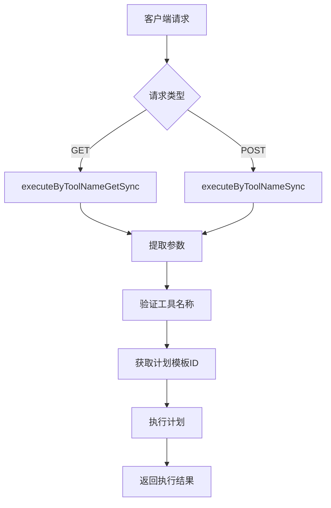
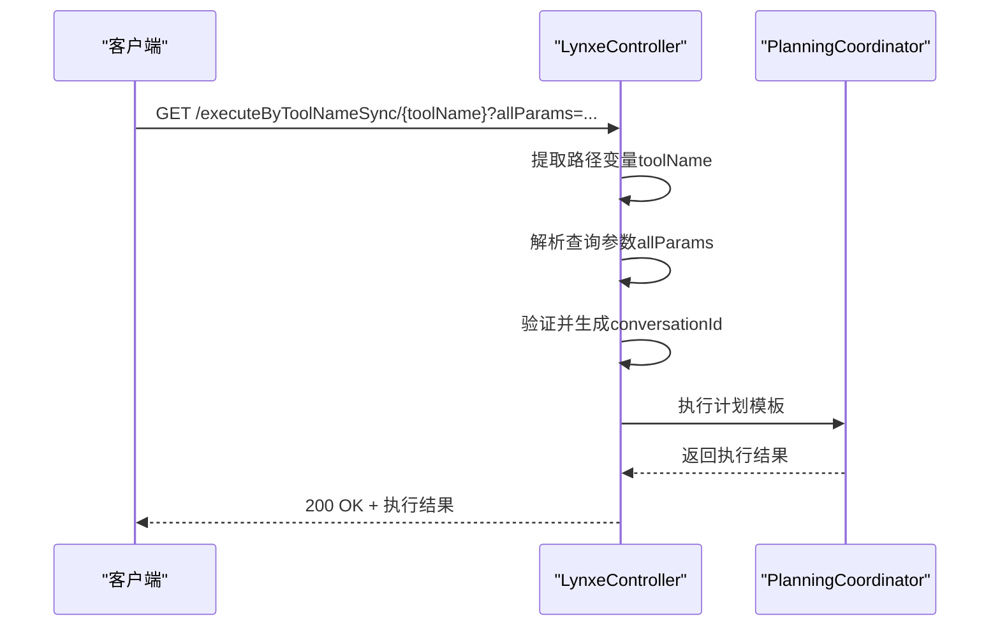
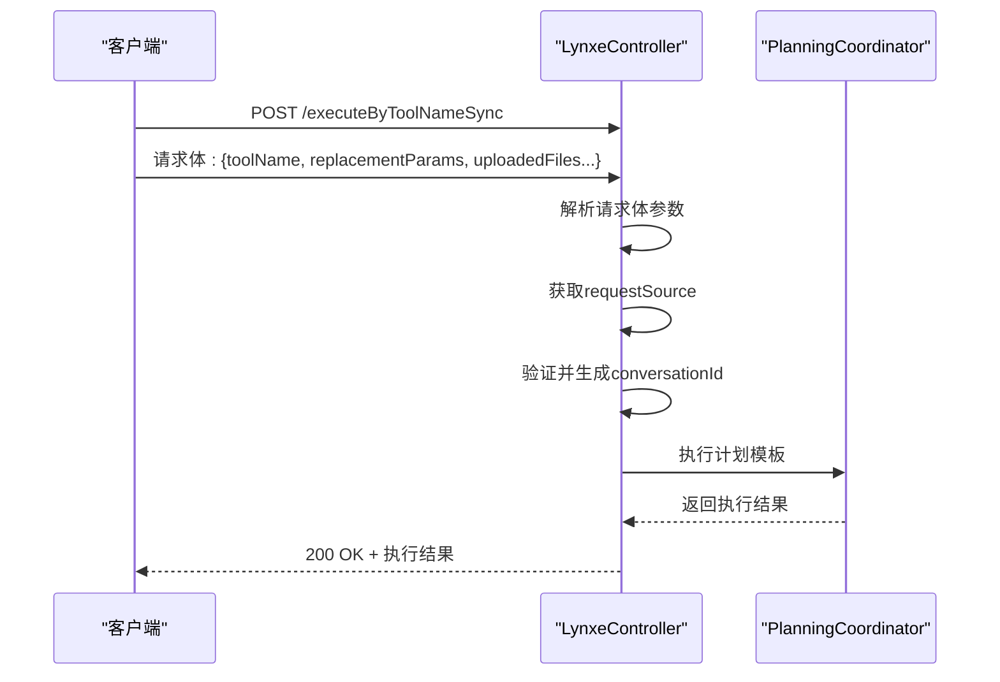
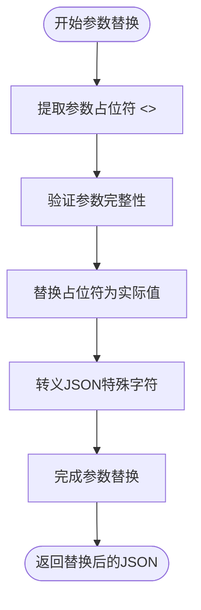
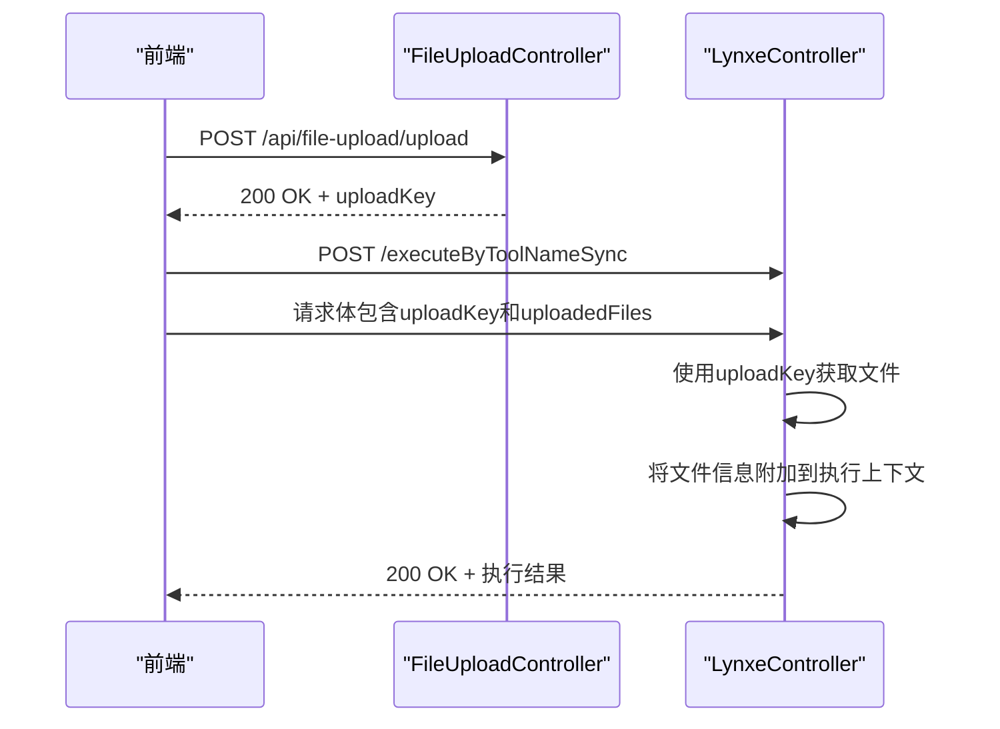
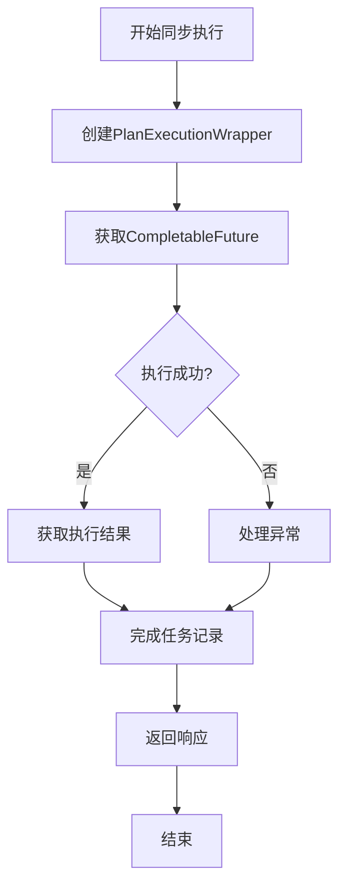
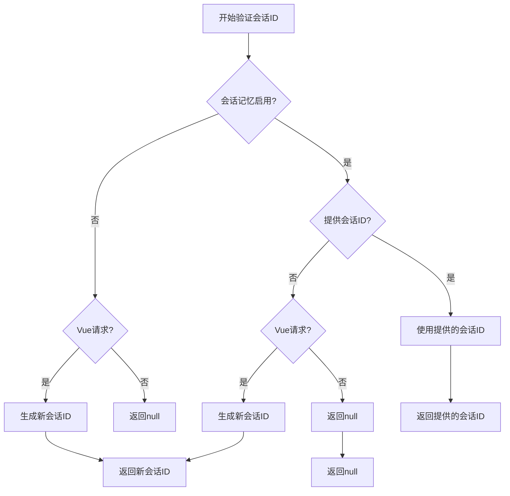
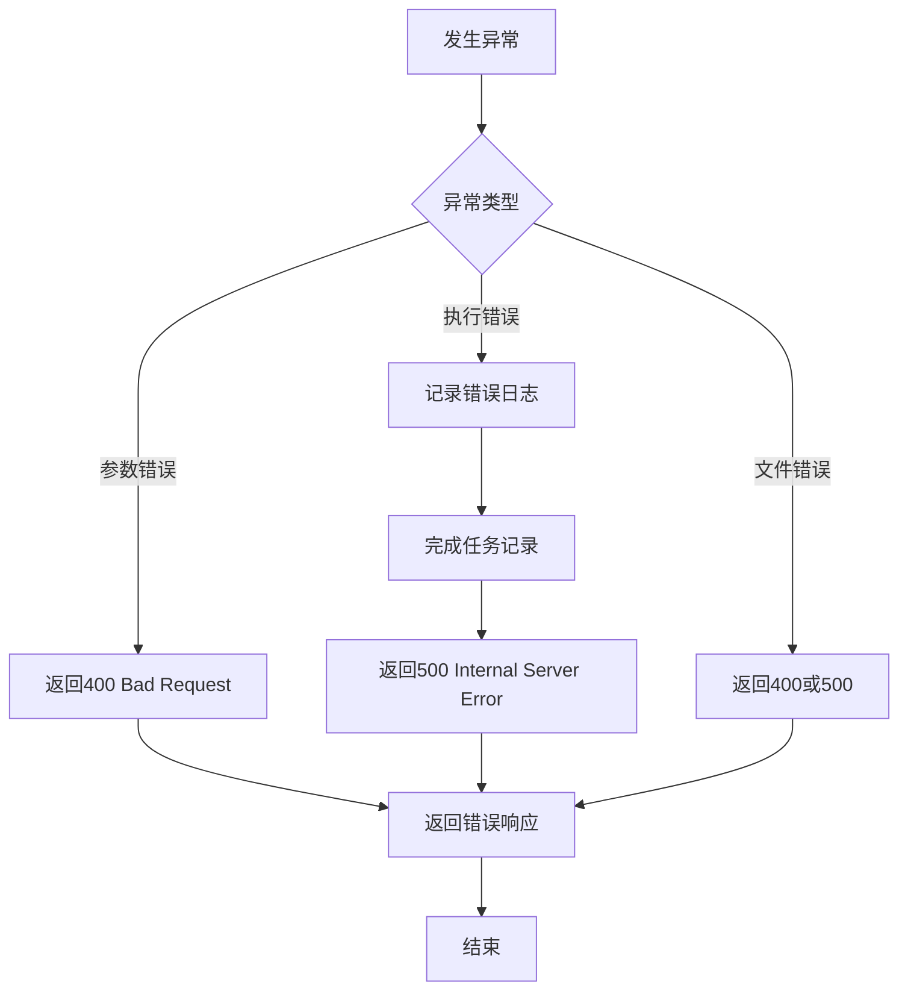

# 同步执行API

<cite>
**本文档引用文件**   
- [LynxeController.java](file://src/main/java/com/alibaba/cloud/ai/lynxe/runtime/controller/LynxeController.java)
- [PlanExecutionWrapper.java](file://src/main/java/com/alibaba/cloud/ai/lynxe/runtime/entity/vo/PlanExecutionWrapper.java)
- [PlanExecutionResult.java](file://src/main/java/com/alibaba/cloud/ai/lynxe/runtime/entity/vo/PlanExecutionResult.java)
- [PlanParameterMappingService.java](file://src/main/java/com/alibaba/cloud/ai/lynxe/planning/service/PlanParameterMappingService.java)
- [FileUploadController.java](file://src/main/java/com/alibaba/cloud/ai/lynxe/runtime/controller/FileUploadController.java)
- [RequestSource.java](file://src/main/java/com/alibaba/cloud/ai/lynxe/runtime/entity/vo/RequestSource.java)
- [MemoryServiceImpl.java](file://src/main/java/com/alibaba/cloud/ai/lynxe/workspace/conversation/service/MemoryServiceImpl.java)
</cite>

## 目录
1. [简介](#简介)
2. [executeByToolNameSync端点](#executebytoolnamesync端点)
3. [GET与POST调用方式](#get与post调用方式)
4. [参数替换功能](#参数替换功能)
5. [文件处理机制](#文件处理机制)
6. [同步执行流程](#同步执行流程)
7. [会话ID管理](#会话id管理)
8. [请求/响应示例](#请求响应示例)
9. [错误处理](#错误处理)

## 简介
JManus同步执行API提供了`executeByToolNameSync`端点，用于同步执行工具计划。该API支持GET和POST两种调用方式，允许通过路径变量、查询参数或请求体传递参数。API实现了参数占位符替换、文件上传处理和会话管理等核心功能，确保执行过程的灵活性和可靠性。

## executeByToolNameSync端点
`executeByToolNameSync`端点是JManus系统中用于同步执行工具计划的核心接口。该端点通过工具名称触发相应的计划模板执行，并立即返回执行结果。系统通过`LynxeController`类中的`executeByToolNameGetSync`和`executeByToolNameSync`方法分别处理GET和POST请求。

该端点的主要功能包括：
- 根据工具名称查找对应的计划模板ID
- 处理参数替换，支持`<<>>`占位符语法
- 管理会话ID的生成与验证
- 协调文件上传和处理
- 阻塞等待执行完成并返回最终结果



**Diagram sources**
- [LynxeController.java](file://src/main/java/com/alibaba/cloud/ai/lynxe/runtime/controller/LynxeController.java#L184-L369)

**Section sources**
- [LynxeController.java](file://src/main/java/com/alibaba/cloud/ai/lynxe/runtime/controller/LynxeController.java#L184-L369)

## GET与POST调用方式
`executeByToolNameSync`端点支持GET和POST两种HTTP方法调用，每种方法都有其特定的参数传递方式和使用场景。

### GET方法
GET方法通过路径变量和查询参数传递参数。工具名称作为路径变量传递，而其他参数通过查询参数传递。这种方式适用于参数较少且不包含敏感信息的场景。



**Diagram sources**
- [LynxeController.java](file://src/main/java/com/alibaba/cloud/ai/lynxe/runtime/controller/LynxeController.java#L184-L213)

### POST方法
POST方法通过请求体传递完整的参数对象。这种方式适用于参数较多或包含复杂数据结构的场景，提供了更好的灵活性和安全性。



**Diagram sources**
- [LynxeController.java](file://src/main/java/com/alibaba/cloud/ai/lynxe/runtime/controller/LynxeController.java#L323-L369)

**Section sources**
- [LynxeController.java](file://src/main/java/com/alibaba/cloud/ai/lynxe/runtime/controller/LynxeController.java#L184-L369)

## 参数替换功能
系统通过`PlanParameterMappingService`类实现了强大的参数替换功能，支持`<<>>`占位符语法。该功能允许在计划模板中定义可变参数，并在执行时动态替换为实际值。

### 占位符替换机制
参数替换功能的核心是`replaceParametersInJson`方法，它使用正则表达式`<<([^>]*)>>`匹配所有占位符，并将其替换为实际参数值。



**Diagram sources**
- [PlanParameterMappingService.java](file://src/main/java/com/alibaba/cloud/ai/lynxe/planning/service/PlanParameterMappingService.java#L189-L246)

### 替换规则
1. **占位符格式**：使用`<<参数名>>`格式，如`<<args1>>`
2. **参数验证**：在替换前验证所有必需参数是否存在
3. **JSON转义**：对替换值进行JSON转义，防止解析错误
4. **错误处理**：如果缺少必需参数，抛出`ParameterValidationException`

```java
// 示例：参数替换实现
String result = planJson;
Matcher matcher = PARAMETER_PATTERN.matcher(planJson);
while (matcher.find()) {
    String placeholder = matcher.group(0);
    String paramName = matcher.group(1);
    Object paramValue = rawParams.get(paramName);
    if (paramValue != null) {
        String escapedValue = escapeJsonString(paramValue.toString());
        result = result.replace(placeholder, escapedValue);
    } else {
        missingParams.add(paramName);
    }
}
```

**Section sources**
- [PlanParameterMappingService.java](file://src/main/java/com/alibaba/cloud/ai/lynxe/planning/service/PlanParameterMappingService.java#L189-L246)

## 文件处理机制
系统提供了完善的文件处理机制，通过`uploadedFiles`和`uploadKey`参数协同工作，支持文件上传和引用。

### 文件上传流程
文件处理涉及前端和后端的协同工作。前端首先通过`/api/file-upload/upload`端点上传文件，获取`uploadKey`，然后在执行请求中使用该`uploadKey`。



**Diagram sources**
- [FileUploadController.java](file://src/main/java/com/alibaba/cloud/ai/lynxe/runtime/controller/FileUploadController.java#L79-L84)
- [LynxeController.java](file://src/main/java/com/alibaba/cloud/ai/lynxe/runtime/controller/LynxeController.java#L637-L652)

### 参数协同
- **uploadedFiles**：包含上传文件的文件名列表
- **uploadKey**：标识文件上传会话的唯一键
- **协同工作**：`uploadKey`用于定位文件存储目录，`uploadedFiles`指定具体使用的文件

```java
// 在executePlanTemplate中处理文件
if (uploadedFiles != null && !uploadedFiles.isEmpty()) {
    for (ExecutionStep step : plan.getAllSteps()) {
        if (step.getStepRequirement() != null) {
            String fileInfo = String.join(", ", uploadedFiles);
            String originalRequirement = step.getStepRequirement();
            step.setStepRequirement(originalRequirement + "\n \n  [Uploaded files: " + fileInfo + "]");
        }
    }
}
```

**Section sources**
- [LynxeController.java](file://src/main/java/com/alibaba/cloud/ai/lynxe/runtime/controller/LynxeController.java#L637-L652)

## 同步执行流程
同步执行流程的核心是`executePlanSync`方法，它阻塞等待`CompletableFuture`完成并返回最终结果。该流程确保客户端能够立即获取执行结果。

### 执行流程图


**Diagram sources**
- [LynxeController.java](file://src/main/java/com/alibaba/cloud/ai/lynxe/runtime/controller/LynxeController.java#L510-L555)

### 阻塞等待机制
`executePlanSync`方法通过调用`CompletableFuture.get()`方法阻塞等待异步执行完成。这种设计模式将异步执行的复杂性封装在后端，为前端提供简单的同步接口。

```java
// executePlanSync方法实现
PlanExecutionResult planExecutionResult = wrapper.getResult().get(); // 阻塞等待

// 执行成功后的处理
rootTaskManagerService.completeTask(wrapper.getRootPlanId(), planExecutionResult.getFinalResult(), true);

// 返回成功响应
Map<String, Object> response = new HashMap<>();
response.put("status", "completed");
response.put("result", planExecutionResult.getFinalResult());
return ResponseEntity.ok(response);
```

**Section sources**
- [LynxeController.java](file://src/main/java/com/alibaba/cloud/ai/lynxe/runtime/controller/LynxeController.java#L510-L555)

## 会话ID管理
会话ID（conversationId）用于管理用户会话状态和记忆。系统的会话ID生成与验证逻辑根据请求来源和配置进行差异化处理。

### 生成逻辑
会话ID的生成遵循以下规则：
1. **Vue请求**：来自Vue侧边栏或对话框的请求会生成新的会话ID
2. **HTTP请求**：普通HTTP请求不生成会话ID
3. **配置控制**：当`enableConversationMemory`禁用时，为Vue请求生成新ID



**Diagram sources**
- [LynxeController.java](file://src/main/java/com/alibaba/cloud/ai/lynxe/runtime/controller/LynxeController.java#L922-L949)

### 验证流程
会话ID的验证流程考虑了多种场景：
- **新会话**：未提供会话ID时，为Vue请求生成新ID
- **现有会话**：使用提供的会话ID继续会话
- **配置覆盖**：当会话记忆禁用时，强制生成新ID

```java
// validateOrGenerateConversationId实现
if (!lynxeProperties.getEnableConversationMemory()) {
    if (requestSource.isVueRequest()) {
        conversationId = memoryService.generateConversationId();
        return conversationId;
    }
    return null;
}

if (!StringUtils.hasText(conversationId)) {
    if (requestSource.isVueRequest()) {
        conversationId = memoryService.generateConversationId();
    }
}
return conversationId;
```

**Section sources**
- [LynxeController.java](file://src/main/java/com/alibaba/cloud/ai/lynxe/runtime/controller/LynxeController.java#L922-L949)

## 请求/响应示例
以下是`executeByToolNameSync`端点的完整请求/响应示例，展示了成功和失败场景。

### GET请求示例
```http
GET /api/executor/executeByToolNameSync/myTool?allParams={"arg1":"value1"}&conversationId=conv_123
```

**成功响应：**
```json
{
  "status": "completed",
  "result": "执行成功的结果",
  "conversationId": "conv_123"
}
```

### POST请求示例
```http
POST /api/executor/executeByToolNameSync
Content-Type: application/json

{
  "toolName": "myTool",
  "replacementParams": {
    "arg1": "value1",
    "arg2": "value2"
  },
  "uploadedFiles": ["file1.txt", "file2.pdf"],
  "uploadKey": "upload_456",
  "conversationId": "conv_123"
}
```

**成功响应：**
```json
{
  "status": "completed",
  "result": "执行成功的结果",
  "conversationId": "conv_123"
}
```

**失败响应：**
```json
{
  "error": "执行失败: 工具名称不能为空",
  "status": "failed"
}
```

**Section sources**
- [LynxeController.java](file://src/main/java/com/alibaba/cloud/ai/lynxe/runtime/controller/LynxeController.java#L534-L554)

## 错误处理
系统实现了全面的错误处理机制，确保在各种异常情况下都能提供有意义的错误信息。

### 错误类型
1. **参数验证错误**：工具名称为空或参数缺失
2. **执行异常**：计划执行过程中发生的错误
3. **文件处理错误**：文件上传或访问失败
4. **会话管理错误**：会话ID相关问题

### 异常处理流程


**Diagram sources**
- [LynxeController.java](file://src/main/java/com/alibaba/cloud/ai/lynxe/runtime/controller/LynxeController.java#L542-L554)

当执行失败时，系统会：
1. 记录详细的错误日志
2. 完成任务记录，标记为失败状态
3. 返回包含错误信息的HTTP 500响应
4. 确保资源正确清理

```java
// 错误处理实现
catch (Exception e) {
    logger.error("Failed to execute plan template synchronously: {}", planTemplateId, e);
    
    // 完成任务记录为失败状态
    if (wrapper != null && wrapper.getRootPlanId() != null) {
        rootTaskManagerService.completeTask(wrapper.getRootPlanId(), "Execution failed: " + e.getMessage(), false);
    }

    Map<String, Object> errorResponse = new HashMap<>();
    errorResponse.put("error", "Execution failed: " + e.getMessage());
    errorResponse.put("status", "failed");
    return ResponseEntity.internalServerError().body(errorResponse);
}
```

**Section sources**
- [LynxeController.java](file://src/main/java/com/alibaba/cloud/ai/lynxe/runtime/controller/LynxeController.java#L542-L554)