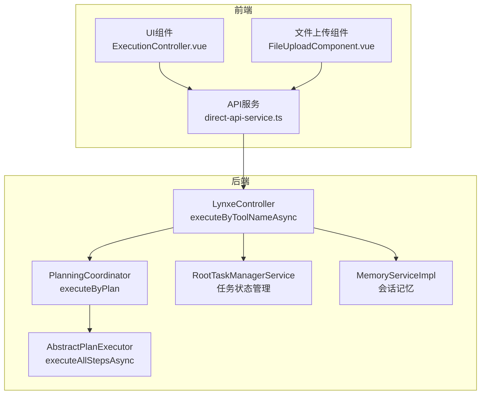
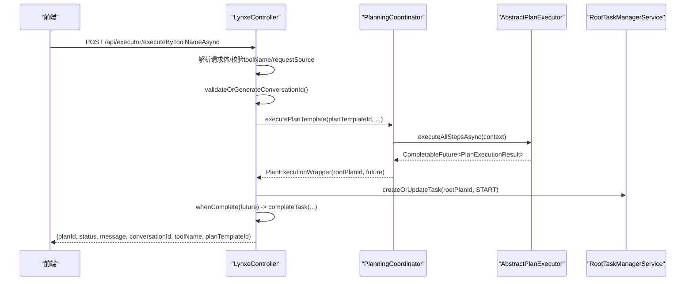
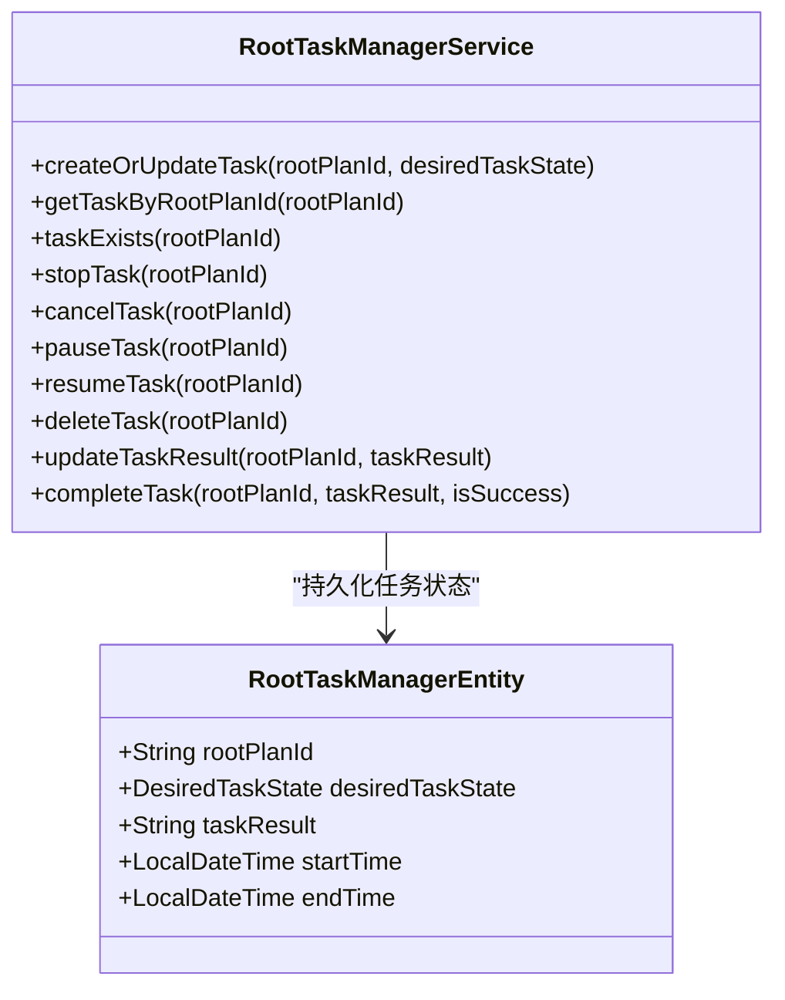
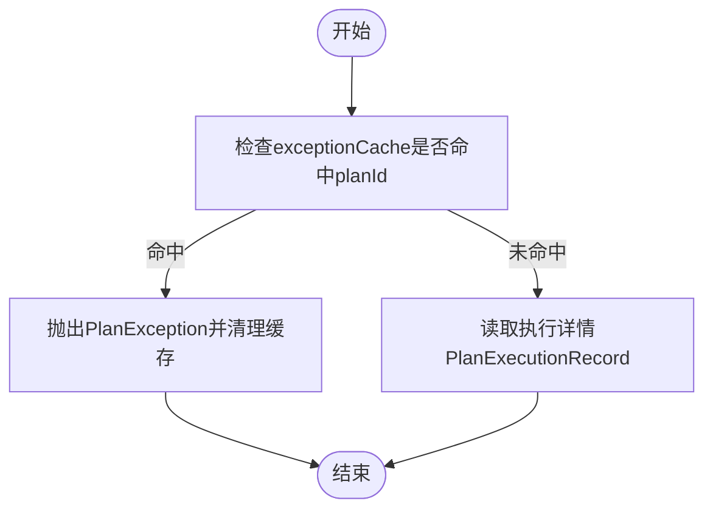
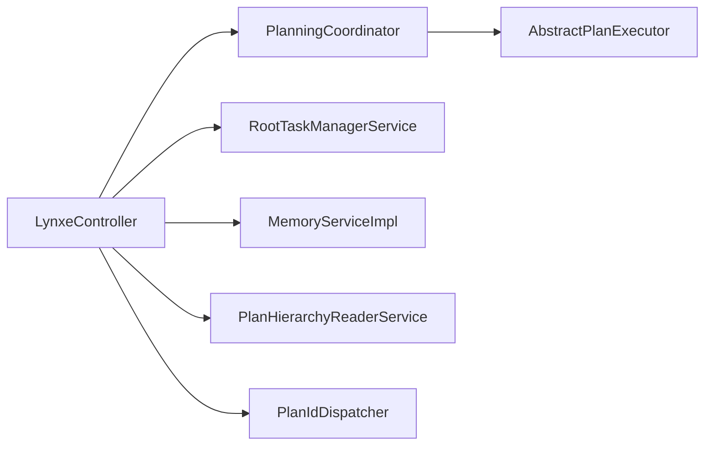

# 异步执行API

<cite>
**本文引用的文件**
- [LynxeController.java](file://src/main/java/com/alibaba/cloud/ai/lynxe/runtime/controller/LynxeController.java)
- [RootTaskManagerService.java](file://src/main/java/com/alibaba/cloud/ai/lynxe/runtime/service/RootTaskManagerService.java)
- [RootTaskManagerEntity.java](file://src/main/java/com/alibaba/cloud/ai/lynxe/runtime/entity/po/RootTaskManagerEntity.java)
- [RootTaskManagerRepository.java](file://src/main/java/com/alibaba/cloud/ai/lynxe/runtime/repository/RootTaskManagerRepository.java)
- [RequestSource.java](file://src/main/java/com/alibaba/cloud/ai/lynxe/runtime/entity/vo/RequestSource.java)
- [PlanExecutionWrapper.java](file://src/main/java/com/alibaba/cloud/ai/lynxe/runtime/entity/vo/PlanExecutionWrapper.java)
- [PlanningCoordinator.java](file://src/main/java/com/alibaba/cloud/ai/lynxe/runtime/service/PlanningCoordinator.java)
- [AbstractPlanExecutor.java](file://src/main/java/com/alibaba/cloud/ai/lynxe/runtime/executor/AbstractPlanExecutor.java)
- [PlanExceptionEvent.java](file://src/main/java/com/alibaba/cloud/ai/lynxe/event/PlanExceptionEvent.java)
- [PlanException.java](file://src/main/java/com/alibaba/cloud/ai/lynxe/exception/PlanException.java)
- [GlobalExceptionHandler.java](file://src/main/java/com/alibaba/cloud/ai/lynxe/exception/handler/GlobalExceptionHandler.java)
- [MemoryServiceImpl.java](file://src/main/java/com/alibaba/cloud/ai/lynxe/workspace/conversation/service/MemoryServiceImpl.java)
- [direct-api-service.ts](file://ui-vue3/src/api/direct-api-service.ts)
- [ExecutionController.vue](file://ui-vue3/src/components/sidebar/ExecutionController.vue)
- [ExecutionController.vue（文件上传）](file://ui-vue3/src/components/file-upload/FileUploadComponent.vue)
- [file-upload-api-service.ts](file://ui-vue3/src/api/file-upload-api-service.ts)
</cite>

## 目录
1. [简介](#简介)
2. [项目结构](#项目结构)
3. [核心组件](#核心组件)
4. [架构总览](#架构总览)
5. [详细组件分析](#详细组件分析)
6. [依赖关系分析](#依赖关系分析)
7. [性能考量](#性能考量)
8. [故障排查指南](#故障排查指南)
9. [结论](#结论)
10. [附录：请求/响应示例](#附录请求响应示例)

## 简介
本文件面向JManus的异步执行API，聚焦executeByToolNameAsync端点的实现细节与使用方式。内容涵盖：
- POST请求的JSON请求体字段说明（toolName、uploadedFiles、replacementParams、uploadKey、conversationId、serviceGroup、requestSource）
- 响应结构字段说明（planId、status、message、conversationId、toolName、planTemplateId）
- CompletableFuture异步执行机制与RootTaskManagerService的任务状态跟踪集成
- 异常处理流程及异常缓存exceptionCache的使用
- requestSource对执行上下文的影响
- 完整的请求/响应示例（成功提交与参数校验失败）

## 项目结构
executeByToolNameAsync位于后端控制器层，通过统一的计划执行入口executePlanTemplate构建执行上下文并交由PlanningCoordinator调度，最终由AbstractPlanExecutor在异步线程池中执行。RootTaskManagerService负责持久化任务状态，前端通过轮询/details/{planId}获取执行详情，并可从exceptionCache中读取异常信息。

图表来源
- [LynxeController.java](file://src/main/java/com/alibaba/cloud/ai/lynxe/runtime/controller/LynxeController.java#L220-L316)
- [PlanningCoordinator.java](file://src/main/java/com/alibaba/cloud/ai/lynxe/runtime/service/PlanningCoordinator.java#L145-L181)
- [AbstractPlanExecutor.java](file://src/main/java/com/alibaba/cloud/ai/lynxe/runtime/executor/AbstractPlanExecutor.java#L213-L396)
- [RootTaskManagerService.java](file://src/main/java/com/alibaba/cloud/ai/lynxe/runtime/service/RootTaskManagerService.java#L48-L201)
- [MemoryServiceImpl.java](file://src/main/java/com/alibaba/cloud/ai/lynxe/workspace/conversation/service/MemoryServiceImpl.java#L151-L204)

章节来源
- [LynxeController.java](file://src/main/java/com/alibaba/cloud/ai/lynxe/runtime/controller/LynxeController.java#L220-L316)
- [RootTaskManagerService.java](file://src/main/java/com/alibaba/cloud/ai/lynxe/runtime/service/RootTaskManagerService.java#L48-L201)

## 核心组件
- LynxeController.executeByToolNameAsync：接收POST请求，解析请求体，校验参数，生成或验证conversationId，调用executePlanTemplate，启动异步执行并将结果写入RootTaskManagerService，返回planId与初始状态。
- PlanningCoordinator.executeByPlan：根据PlanInterface构建执行上下文，选择合适的执行器，返回CompletableFuture。
- AbstractPlanExecutor.executeAllStepsAsync：基于计划深度选择执行池，异步执行各步骤，捕获异常并封装为PlanExecutionResult。
- RootTaskManagerService：以数据库驱动的任务状态管理，支持START/STOP/PAUSE/CANCEL/RESUME等状态转换与结果更新。
- RequestSource：枚举请求来源（HTTP_REQUEST/VUE_SIDEBAR/VUE_DIALOG），用于控制conversationId生成策略与上下文行为。
- PlanExecutionWrapper：封装CompletableFuture与rootPlanId，便于上层统一处理。
- MemoryServiceImpl：生成唯一conversationId并维护会话记忆。

章节来源
- [LynxeController.java](file://src/main/java/com/alibaba/cloud/ai/lynxe/runtime/controller/LynxeController.java#L220-L316)
- [PlanningCoordinator.java](file://src/main/java/com/alibaba/cloud/ai/lynxe/runtime/service/PlanningCoordinator.java#L145-L181)
- [AbstractPlanExecutor.java](file://src/main/java/com/alibaba/cloud/ai/lynxe/runtime/executor/AbstractPlanExecutor.java#L213-L396)
- [RootTaskManagerService.java](file://src/main/java/com/alibaba/cloud/ai/lynxe/runtime/service/RootTaskManagerService.java#L48-L201)
- [RequestSource.java](file://src/main/java/com/alibaba/cloud/ai/lynxe/runtime/entity/vo/RequestSource.java#L1-L65)
- [PlanExecutionWrapper.java](file://src/main/java/com/alibaba/cloud/ai/lynxe/runtime/entity/vo/PlanExecutionWrapper.java#L24-L43)
- [MemoryServiceImpl.java](file://src/main/java/com/alibaba/cloud/ai/lynxe/workspace/conversation/service/MemoryServiceImpl.java#L151-L204)

## 架构总览
下图展示executeByToolNameAsync端到端调用链路与关键对象交互。

图表来源
- [LynxeController.java](file://src/main/java/com/alibaba/cloud/ai/lynxe/runtime/controller/LynxeController.java#L220-L316)
- [PlanningCoordinator.java](file://src/main/java/com/alibaba/cloud/ai/lynxe/runtime/service/PlanningCoordinator.java#L145-L181)
- [AbstractPlanExecutor.java](file://src/main/java/com/alibaba/cloud/ai/lynxe/runtime/executor/AbstractPlanExecutor.java#L213-L396)
- [RootTaskManagerService.java](file://src/main/java/com/alibaba/cloud/ai/lynxe/runtime/service/RootTaskManagerService.java#L48-L201)

## 详细组件分析

### executeByToolNameAsync端点实现
- 请求路径与方法：POST /api/executor/executeByToolNameAsync
- 请求体字段
  - toolName：必填，工具名称，用于定位计划模板ID
  - serviceGroup：可选，服务组标识，用于区分同名工具
  - replacementParams：可选，键值对参数，用于<<>>占位符替换
  - uploadedFiles：可选，字符串数组，表示已上传文件名列表
  - uploadKey：可选，上传会话标识，用于关联文件存储目录
  - conversationId：可选，会话ID；若为空且为VUE_*请求，将自动生成
  - requestSource：可选，请求来源枚举（HTTP_REQUEST/VUE_SIDEBAR/VUE_DIALOG），默认HTTP_REQUEST
- 响应字段
  - planId：根计划ID，用于后续查询执行详情
  - status：当前状态（如processing）
  - message：简要说明（如“Task submitted, processing”）
  - conversationId：实际使用的会话ID（可能为空）
  - toolName：工具名称
  - planTemplateId：计划模板ID
- 执行流程要点
  - 校验toolName非空
  - 解析requestSource，默认HTTP_REQUEST
  - 获取planTemplateId（通过工具名与serviceGroup）
  - validateOrGenerateConversationId：根据enableConversationMemory与requestSource决定是否生成或复用conversationId
  - 调用executePlanTemplate：生成rootPlanId，替换参数，附加上传文件信息，保存会话记忆，交由PlanningCoordinator执行
  - 创建或更新RootTaskManagerEntity为START状态
  - 使用whenComplete监听future完成事件，成功/失败分别completeTask并设置结束时间与结果
  - 返回包含planId/status/message等字段的响应

章节来源
- [LynxeController.java](file://src/main/java/com/alibaba/cloud/ai/lynxe/runtime/controller/LynxeController.java#L220-L316)
- [LynxeController.java](file://src/main/java/com/alibaba/cloud/ai/lynxe/runtime/controller/LynxeController.java#L558-L682)
- [LynxeController.java](file://src/main/java/com/alibaba/cloud/ai/lynxe/runtime/controller/LynxeController.java#L912-L967)

### CompletableFuture异步执行与RootTaskManagerService集成
- PlanningCoordinator.executeByPlan返回CompletableFuture<PlanExecutionResult>，并在完成后进行后处理
- LynxeController在收到PlanExecutionWrapper后：
  - createOrUpdateTask(rootPlanId, START) 记录任务开始
  - whenComplete(future)回调中：
    - 失败：completeTask(rootPlanId, “Execution failed: ...”, false)
    - 成功：completeTask(rootPlanId, finalResult, true)
- RootTaskManagerService提供：
  - createOrUpdateTask：创建或更新DesiredTaskState（START/STOP/PAUSE/CANCEL/RESUME）
  - getTaskByRootPlanId：按根计划ID查询任务
  - taskExists：判断任务是否存在
  - stopTask/cancelTask/pauseTask/resumeTask/deleteTask/updateTaskResult/completeTask：任务生命周期管理

图表来源
- [RootTaskManagerService.java](file://src/main/java/com/alibaba/cloud/ai/lynxe/runtime/service/RootTaskManagerService.java#L48-L201)
- [RootTaskManagerEntity.java](file://src/main/java/com/alibaba/cloud/ai/lynxe/runtime/entity/po/RootTaskManagerEntity.java#L100-L340)

章节来源
- [PlanningCoordinator.java](file://src/main/java/com/alibaba/cloud/ai/lynxe/runtime/service/PlanningCoordinator.java#L145-L181)
- [LynxeController.java](file://src/main/java/com/alibaba/cloud/ai/lynxe/runtime/controller/LynxeController.java#L273-L316)
- [RootTaskManagerService.java](file://src/main/java/com/alibaba/cloud/ai/lynxe/runtime/service/RootTaskManagerService.java#L48-L201)

### 异常处理与exceptionCache
- 控制器内部维护一个基于Guava Cache的exceptionCache，键为planId，值为Throwable，超时时间为10分钟
- 在details接口中，若exceptionCache命中，则抛出PlanException并清理缓存
- 全局异常处理器GlobalExceptionHandler对PlanException进行统一处理
- 执行过程中，异常会被记录到RootTaskManagerService的taskResult中（whenComplete回调）

图表来源
- [LynxeController.java](file://src/main/java/com/alibaba/cloud/ai/lynxe/runtime/controller/LynxeController.java#L378-L441)
- [PlanExceptionEvent.java](file://src/main/java/com/alibaba/cloud/ai/lynxe/event/PlanExceptionEvent.java#L1-L49)
- [PlanException.java](file://src/main/java/com/alibaba/cloud/ai/lynxe/exception/PlanException.java#L1-L45)
- [GlobalExceptionHandler.java](file://src/main/java/com/alibaba/cloud/ai/lynxe/exception/handler/GlobalExceptionHandler.java#L35-L68)

章节来源
- [LynxeController.java](file://src/main/java/com/alibaba/cloud/ai/lynxe/runtime/controller/LynxeController.java#L378-L441)
- [GlobalExceptionHandler.java](file://src/main/java/com/alibaba/cloud/ai/lynxe/exception/handler/GlobalExceptionHandler.java#L35-L68)

### requestSource对执行上下文的影响
- 枚举RequestSource：HTTP_REQUEST/VUE_SIDEBAR/VUE_DIALOG
- validateOrGenerateConversationId策略：
  - 当启用会话记忆且请求来源为VUE_*时，生成新的conversationId
  - 当禁用会话记忆且请求来源为VUE_*时，强制生成新的conversationId
  - 对于HTTP_REQUEST与内部调用，不生成conversationId（返回null）
- PlanningCoordinator在上下文中设置useConversation、parentPlanId、toolcallId、uploadKey等

章节来源
- [RequestSource.java](file://src/main/java/com/alibaba/cloud/ai/lynxe/runtime/entity/vo/RequestSource.java#L1-L65)
- [LynxeController.java](file://src/main/java/com/alibaba/cloud/ai/lynxe/runtime/controller/LynxeController.java#L912-L967)
- [PlanningCoordinator.java](file://src/main/java/com/alibaba/cloud/ai/lynxe/runtime/service/PlanningCoordinator.java#L108-L143)

### 文件上传与uploadedFiles/ uploadKey
- 前端通过FileUploadComponent.vue与file-upload-api-service.ts管理上传会话与文件列表
- 上传完成后，前端将uploadKey与uploadedFiles一并传给executeByToolNameAsync
- 后端在executePlanTemplate中将uploadedFiles附加到每个步骤的stepRequirement中，作为执行上下文的一部分

章节来源
- [ExecutionController.vue（文件上传）](file://ui-vue3/src/components/file-upload/FileUploadComponent.vue#L55-L102)
- [file-upload-api-service.ts](file://ui-vue3/src/api/file-upload-api-service.ts#L1-L150)
- [LynxeController.java](file://src/main/java/com/alibaba/cloud/ai/lynxe/runtime/controller/LynxeController.java#L633-L652)

## 依赖关系分析
- 控制器依赖：PlanningCoordinator、PlanTemplateService、PlanIdDispatcher、UserInputService、MemoryService、PlanHierarchyReaderService、RootTaskManagerService、TaskInterruptionManager
- 执行器依赖：PlanExecutorFactory、PlanFinalizer、LlmService、工具函数（如参数替换、文件附加）
- 数据访问：RootTaskManagerRepository、PlanExecutionRecorder、PlanHierarchyReaderService

图表来源
- [LynxeController.java](file://src/main/java/com/alibaba/cloud/ai/lynxe/runtime/controller/LynxeController.java#L1-L120)
- [PlanningCoordinator.java](file://src/main/java/com/alibaba/cloud/ai/lynxe/runtime/service/PlanningCoordinator.java#L145-L181)
- [AbstractPlanExecutor.java](file://src/main/java/com/alibaba/cloud/ai/lynxe/runtime/executor/AbstractPlanExecutor.java#L213-L396)
- [RootTaskManagerService.java](file://src/main/java/com/alibaba/cloud/ai/lynxe/runtime/service/RootTaskManagerService.java#L48-L201)

章节来源
- [LynxeController.java](file://src/main/java/com/alibaba/cloud/ai/lynxe/runtime/controller/LynxeController.java#L1-L120)

## 性能考量
- 异步执行：通过CompletableFuture与线程池并行执行步骤，避免阻塞请求线程
- 任务状态持久化：RootTaskManagerService以数据库驱动的状态机，减少内存压力
- 会话记忆：仅在启用时生成与使用conversationId，避免不必要的IO
- 参数替换与文件附加：在执行前完成，降低运行期开销

## 故障排查指南
- 参数校验失败
  - toolName为空：返回400与错误信息
  - 工具不存在或无关联计划模板：返回400与错误信息
- 执行启动失败
  - 返回500与错误信息，同时RootTaskManagerService记录失败状态
- 异常缓存
  - details接口命中exceptionCache会抛出PlanException并清理缓存
- 前端轮询
  - 使用planId轮询/details/{planId}获取执行详情，注意重试与超时处理

章节来源
- [LynxeController.java](file://src/main/java/com/alibaba/cloud/ai/lynxe/runtime/controller/LynxeController.java#L220-L316)
- [LynxeController.java](file://src/main/java/com/alibaba/cloud/ai/lynxe/runtime/controller/LynxeController.java#L378-L441)
- [GlobalExceptionHandler.java](file://src/main/java/com/alibaba/cloud/ai/lynxe/exception/handler/GlobalExceptionHandler.java#L35-L68)

## 结论
executeByToolNameAsync通过统一的计划执行入口与异步CompletableFuture机制，实现了高并发、可观测的任务执行能力。配合RootTaskManagerService的任务状态管理与exceptionCache异常缓存，能够稳定支撑前端异步提交与状态查询。requestSource与conversationId策略确保了不同来源请求的一致性与可追溯性。

## 附录：请求/响应示例

### 请求体字段说明
- toolName：必填，工具名称
- serviceGroup：可选，服务组
- replacementParams：可选，参数映射
- uploadedFiles：可选，文件名数组
- uploadKey：可选，上传会话标识
- conversationId：可选，会话ID（VUE_*请求可自动生成）
- requestSource：可选，请求来源枚举

章节来源
- [LynxeController.java](file://src/main/java/com/alibaba/cloud/ai/lynxe/runtime/controller/LynxeController.java#L220-L316)

### 成功提交任务（异步）
- 请求
  - 方法：POST
  - 路径：/api/executor/executeByToolNameAsync
  - Content-Type：application/json
  - 示例请求体（字段示意）：
    - toolName
    - serviceGroup
    - replacementParams
    - uploadedFiles
    - uploadKey
    - conversationId
    - requestSource
- 响应
  - 状态码：200
  - 字段：
    - planId：根计划ID
    - status：processing
    - message：任务已提交，正在处理
    - conversationId：实际使用的会话ID
    - toolName：工具名称
    - planTemplateId：计划模板ID

章节来源
- [LynxeController.java](file://src/main/java/com/alibaba/cloud/ai/lynxe/runtime/controller/LynxeController.java#L273-L316)
- [ExecutionController.vue](file://ui-vue3/src/components/sidebar/ExecutionController.vue#L316-L339)
- [direct-api-service.ts](file://ui-vue3/src/api/direct-api-service.ts#L256-L292)

### 参数校验失败
- 请求
  - toolName为空或无效
- 响应
  - 状态码：400
  - 字段：
    - error：错误信息（如“Tool name cannot be empty”）

章节来源
- [LynxeController.java](file://src/main/java/com/alibaba/cloud/ai/lynxe/runtime/controller/LynxeController.java#L220-L242)

### 异常缓存与异常读取
- 读取执行详情时，若exceptionCache命中对应planId：
  - 抛出PlanException并清理缓存
  - 前端需捕获异常并提示用户重新发起任务

章节来源
- [LynxeController.java](file://src/main/java/com/alibaba/cloud/ai/lynxe/runtime/controller/LynxeController.java#L378-L441)
- [PlanExceptionEvent.java](file://src/main/java/com/alibaba/cloud/ai/lynxe/event/PlanExceptionEvent.java#L1-L49)
- [PlanException.java](file://src/main/java/com/alibaba/cloud/ai/lynxe/exception/PlanException.java#L1-L45)
- [GlobalExceptionHandler.java](file://src/main/java/com/alibaba/cloud/ai/lynxe/exception/handler/GlobalExceptionHandler.java#L35-L68)