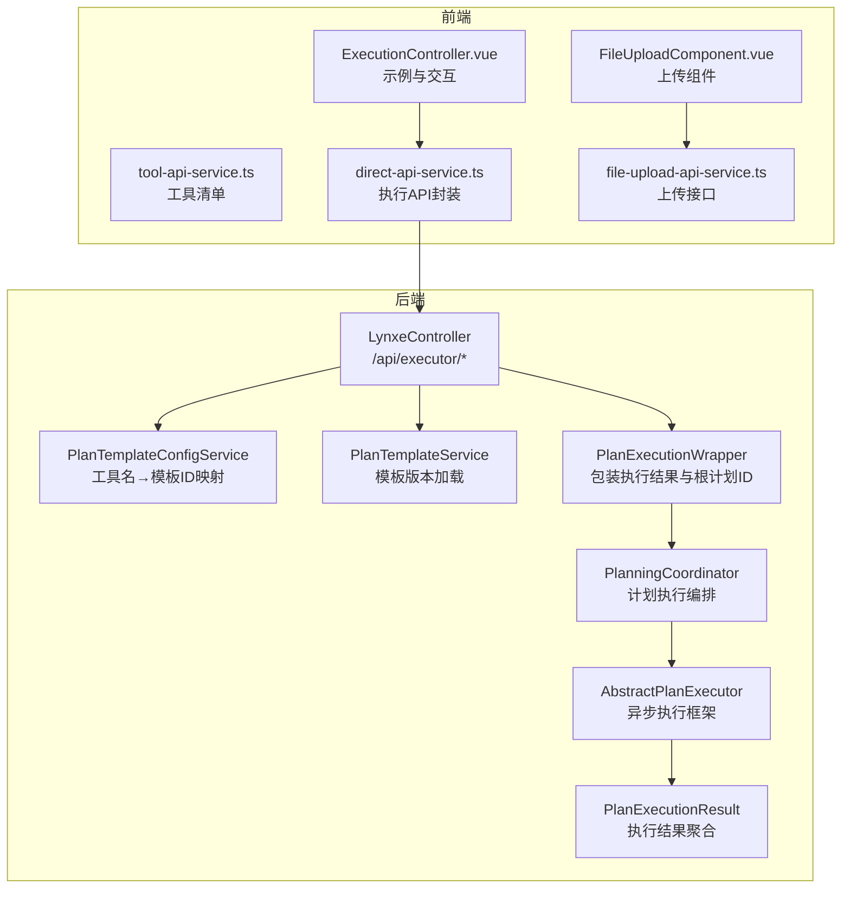
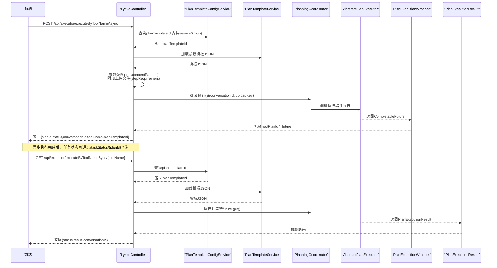
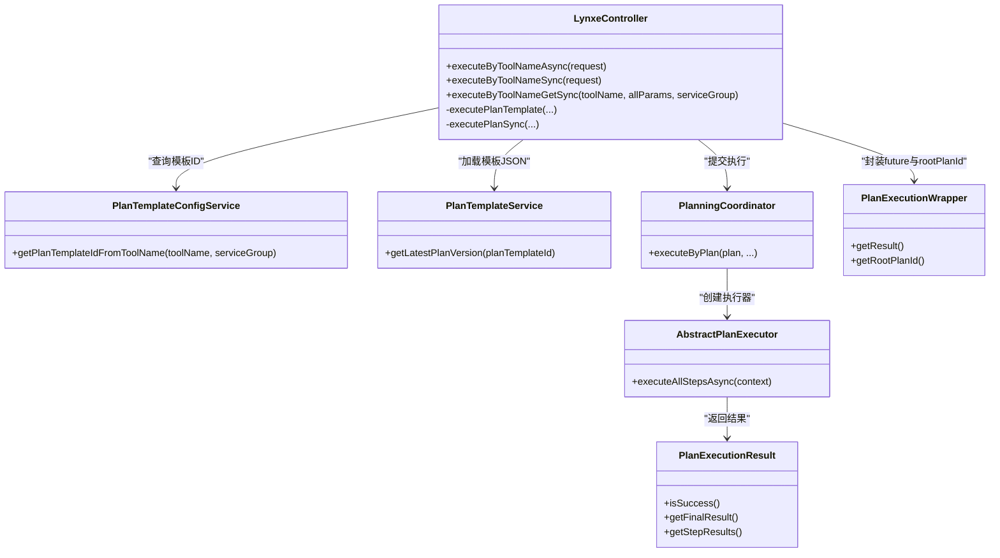

# 核心执行API

<cite>
**本文引用的文件列表**
- [LynxeController.java](file://src/main/java/com/alibaba/cloud/ai/lynxe/runtime/controller/LynxeController.java)
- [PlanTemplateConfigService.java](file://src/main/java/com/alibaba/cloud/ai/lynxe/planning/service/PlanTemplateConfigService.java)
- [PlanTemplateService.java](file://src/main/java/com/alibaba/cloud/ai/lynxe/planning/service/PlanTemplateService.java)
- [PlanningCoordinator.java](file://src/main/java/com/alibaba/cloud/ai/lynxe/runtime/service/PlanningCoordinator.java)
- [AbstractPlanExecutor.java](file://src/main/java/com/alibaba/cloud/ai/lynxe/runtime/executor/AbstractPlanExecutor.java)
- [PlanExecutionWrapper.java](file://src/main/java/com/alibaba/cloud/ai/lynxe/runtime/entity/vo/PlanExecutionWrapper.java)
- [PlanExecutionResult.java](file://src/main/java/com/alibaba/cloud/ai/lynxe/runtime/entity/vo/PlanExecutionResult.java)
- [PlanInterface.java](file://src/main/java/com/alibaba/cloud/ai/lynxe/runtime/entity/vo/PlanInterface.java)
- [RequestSource.java](file://src/main/java/com/alibaba/cloud/ai/lynxe/runtime/entity/vo/RequestSource.java)
- [GlobalExceptionHandler.java](file://src/main/java/com/alibaba/cloud/ai/lynxe/exception/handler/GlobalExceptionHandler.java)
- [PlanException.java](file://src/main/java/com/alibaba/cloud/ai/lynxe/exception/PlanException.java)
- [tool-api-service.ts](file://ui-vue3/src/api/tool-api-service.ts)
- [direct-api-service.ts](file://ui-vue3/src/api/direct-api-service.ts)
- [ExecutionController.vue](file://ui-vue3/src/components/sidebar/ExecutionController.vue)
- [file-upload-api-service.ts](file://ui-vue3/src/api/file-upload-api-service.ts)
- [FileUploadComponent.vue](file://ui-vue3/src/components/file-upload/FileUploadComponent.vue)
</cite>

## 目录
1. [简介](#简介)
2. [项目结构与入口](#项目结构与入口)
3. [核心组件](#核心组件)
4. [架构总览](#架构总览)
5. [详细组件分析](#详细组件分析)
6. [依赖关系分析](#依赖关系分析)
7. [性能与并发特性](#性能与并发特性)
8. [故障排查指南](#故障排查指南)
9. [结论](#结论)
10. [附录：请求/响应示例](#附录请求响应示例)

## 简介
本文件聚焦于JManus核心执行API，系统性说明以下端点：
- 异步执行：POST /api/executor/executeByToolNameAsync
- 同步执行：GET /api/executor/executeByToolNameSync/{toolName} 与 POST /api/executor/executeByToolNameSync

内容涵盖：
- 响应结构（异步返回planId、status、conversationId等）
- 同步执行直接返回最终结果的模式
- 请求参数toolName到planTemplateId的映射机制
- serviceGroup参数的作用与多组同名工具的区分
- 高级参数uploadedFiles、replacementParams、uploadKey的用法
- 完整请求/响应示例与常见错误场景
- 线程安全与CompletableFuture模式
- PlanExecutionWrapper封装执行上下文的设计

## 项目结构与入口
后端控制器位于运行时模块，负责接收执行请求并委派给规划协调器与执行器；前端通过UI侧服务封装调用。

图表来源
- [LynxeController.java](file://src/main/java/com/alibaba/cloud/ai/lynxe/runtime/controller/LynxeController.java#L180-L369)
- [PlanTemplateConfigService.java](file://src/main/java/com/alibaba/cloud/ai/lynxe/planning/service/PlanTemplateConfigService.java#L709-L720)
- [PlanTemplateService.java](file://src/main/java/com/alibaba/cloud/ai/lynxe/planning/service/PlanTemplateService.java#L150-L160)
- [PlanningCoordinator.java](file://src/main/java/com/alibaba/cloud/ai/lynxe/runtime/service/PlanningCoordinator.java#L145-L181)
- [AbstractPlanExecutor.java](file://src/main/java/com/alibaba/cloud/ai/lynxe/runtime/executor/AbstractPlanExecutor.java#L213-L396)
- [PlanExecutionWrapper.java](file://src/main/java/com/alibaba/cloud/ai/lynxe/runtime/entity/vo/PlanExecutionWrapper.java#L24-L43)
- [PlanExecutionResult.java](file://src/main/java/com/alibaba/cloud/ai/lynxe/runtime/entity/vo/PlanExecutionResult.java#L1-L72)
- [tool-api-service.ts](file://ui-vue3/src/api/tool-api-service.ts#L1-L52)
- [direct-api-service.ts](file://ui-vue3/src/api/direct-api-service.ts#L256-L292)
- [ExecutionController.vue](file://ui-vue3/src/components/sidebar/ExecutionController.vue#L316-L339)
- [file-upload-api-service.ts](file://ui-vue3/src/api/file-upload-api-service.ts#L1-L197)
- [FileUploadComponent.vue](file://ui-vue3/src/components/file-upload/FileUploadComponent.vue#L152-L184)

章节来源
- [LynxeController.java](file://src/main/java/com/alibaba/cloud/ai/lynxe/runtime/controller/LynxeController.java#L180-L369)

## 核心组件
- LynxeController：对外暴露执行端点，解析请求、校验参数、生成conversationId、调用执行流程并返回结果或任务ID。
- PlanTemplateConfigService：根据toolName与可选serviceGroup查询对应planTemplateId。
- PlanTemplateService：加载最新版本的计划模板JSON。
- PlanningCoordinator：将PlanInterface交由具体执行器执行，返回CompletableFuture。
- AbstractPlanExecutor：基于计划深度选择执行池，统一异步执行与结果聚合。
- PlanExecutionWrapper：封装CompletableFuture与根计划ID，便于外部管理任务生命周期。
- PlanExecutionResult：聚合每一步执行结果与最终结果。
- RequestSource：标识请求来源（HTTP_REQUEST/VUE_SIDEBAR/VUE_DIALOG），影响conversationId策略与内存行为。
- GlobalExceptionHandler：全局异常处理，统一返回错误信息。

章节来源
- [LynxeController.java](file://src/main/java/com/alibaba/cloud/ai/lynxe/runtime/controller/LynxeController.java#L510-L556)
- [PlanTemplateConfigService.java](file://src/main/java/com/alibaba/cloud/ai/lynxe/planning/service/PlanTemplateConfigService.java#L709-L720)
- [PlanTemplateService.java](file://src/main/java/com/alibaba/cloud/ai/lynxe/planning/service/PlanTemplateService.java#L150-L160)
- [PlanningCoordinator.java](file://src/main/java/com/alibaba/cloud/ai/lynxe/runtime/service/PlanningCoordinator.java#L145-L181)
- [AbstractPlanExecutor.java](file://src/main/java/com/alibaba/cloud/ai/lynxe/runtime/executor/AbstractPlanExecutor.java#L213-L396)
- [PlanExecutionWrapper.java](file://src/main/java/com/alibaba/cloud/ai/lynxe/runtime/entity/vo/PlanExecutionWrapper.java#L24-L43)
- [PlanExecutionResult.java](file://src/main/java/com/alibaba/cloud/ai/lynxe/runtime/entity/vo/PlanExecutionResult.java#L1-L72)
- [RequestSource.java](file://src/main/java/com/alibaba/cloud/ai/lynxe/runtime/entity/vo/RequestSource.java#L1-L65)
- [GlobalExceptionHandler.java](file://src/main/java/com/alibaba/cloud/ai/lynxe/exception/handler/GlobalExceptionHandler.java#L35-L68)

## 架构总览
下图展示从请求到执行完成的关键交互路径，包括异步提交与同步阻塞两种模式。

图表来源
- [LynxeController.java](file://src/main/java/com/alibaba/cloud/ai/lynxe/runtime/controller/LynxeController.java#L215-L369)
- [PlanTemplateConfigService.java](file://src/main/java/com/alibaba/cloud/ai/lynxe/planning/service/PlanTemplateConfigService.java#L709-L720)
- [PlanTemplateService.java](file://src/main/java/com/alibaba/cloud/ai/lynxe/planning/service/PlanTemplateService.java#L150-L160)
- [PlanningCoordinator.java](file://src/main/java/com/alibaba/cloud/ai/lynxe/runtime/service/PlanningCoordinator.java#L145-L181)
- [AbstractPlanExecutor.java](file://src/main/java/com/alibaba/cloud/ai/lynxe/runtime/executor/AbstractPlanExecutor.java#L213-L396)
- [PlanExecutionWrapper.java](file://src/main/java/com/alibaba/cloud/ai/lynxe/runtime/entity/vo/PlanExecutionWrapper.java#L24-L43)
- [PlanExecutionResult.java](file://src/main/java/com/alibaba/cloud/ai/lynxe/runtime/entity/vo/PlanExecutionResult.java#L1-L72)

## 详细组件分析

### 端点：executeByToolNameAsync（异步）
- 路径：POST /api/executor/executeByToolNameAsync
- 请求体字段
  - toolName：必填，字符串，用于映射到planTemplateId
  - serviceGroup：可选，字符串，用于在同名工具中进行区分
  - replacementParams：可选，对象，用于对模板中的占位符进行参数替换
  - uploadedFiles：可选，字符串数组，文件名列表，会附加到每个步骤的stepRequirement中
  - uploadKey：可选，字符串，用于关联上传文件目录
  - conversationId：可选，字符串，若为空且来自Vue请求则自动生成
  - requestSource：可选，枚举字符串，决定conversationId策略与内存行为
- 响应字段
  - planId：根计划ID，用于后续查询任务状态与结果
  - status：初始为“processing”
  - message：提示信息
  - conversationId：实际使用的对话ID
  - toolName：传入的工具名
  - planTemplateId：映射得到的模板ID
- 执行流程要点
  - 通过PlanTemplateConfigService按toolName/serviceGroup查找planTemplateId
  - 加载模板JSON并应用replacementParams参数替换
  - 若存在uploadedFiles，则将文件信息附加到各步骤的stepRequirement
  - 通过PlanningCoordinator提交执行，返回PlanExecutionWrapper
  - 异步执行完成后，RootTaskManager记录任务完成状态

章节来源
- [LynxeController.java](file://src/main/java/com/alibaba/cloud/ai/lynxe/runtime/controller/LynxeController.java#L220-L316)
- [PlanTemplateConfigService.java](file://src/main/java/com/alibaba/cloud/ai/lynxe/planning/service/PlanTemplateConfigService.java#L709-L720)
- [PlanTemplateService.java](file://src/main/java/com/alibaba/cloud/ai/lynxe/planning/service/PlanTemplateService.java#L150-L160)
- [PlanningCoordinator.java](file://src/main/java/com/alibaba/cloud/ai/lynxe/runtime/service/PlanningCoordinator.java#L145-L181)
- [PlanExecutionWrapper.java](file://src/main/java/com/alibaba/cloud/ai/lynxe/runtime/entity/vo/PlanExecutionWrapper.java#L24-L43)

### 端点：executeByToolNameSync（同步）
- 路径
  - GET /api/executor/executeByToolNameSync/{toolName}
  - POST /api/executor/executeByToolNameSync
- 请求体字段
  - toolName：必填
  - serviceGroup：可选
  - replacementParams：可选
  - uploadedFiles：可选
  - uploadKey：可选
  - conversationId：可选
  - requestSource：可选
- 响应字段
  - status：固定为“completed”
  - result：最终执行结果（字符串或结构化数据）
  - conversationId：实际使用的对话ID
- 执行流程要点
  - 与异步相同，但直接阻塞等待future.get()，并将最终结果作为响应返回

章节来源
- [LynxeController.java](file://src/main/java/com/alibaba/cloud/ai/lynxe/runtime/controller/LynxeController.java#L184-L213)
- [LynxeController.java](file://src/main/java/com/alibaba/cloud/ai/lynxe/runtime/controller/LynxeController.java#L323-L369)
- [PlanTemplateConfigService.java](file://src/main/java/com/alibaba/cloud/ai/lynxe/planning/service/PlanTemplateConfigService.java#L709-L720)
- [PlanTemplateService.java](file://src/main/java/com/alibaba/cloud/ai/lynxe/planning/service/PlanTemplateService.java#L150-L160)
- [PlanningCoordinator.java](file://src/main/java/com/alibaba/cloud/ai/lynxe/runtime/service/PlanningCoordinator.java#L145-L181)
- [PlanExecutionResult.java](file://src/main/java/com/alibaba/cloud/ai/lynxe/runtime/entity/vo/PlanExecutionResult.java#L1-L72)

### 参数映射与serviceGroup
- toolName → planTemplateId
  - 优先使用serviceGroup+toolName精确匹配；若未提供serviceGroup，则仅按toolName匹配
  - 仅当工具启用HTTP服务或对话内服务时才允许通过此API执行
- serviceGroup作用
  - 当同一工具存在多个实例（不同serviceGroup）时，避免名称冲突，确保正确路由到目标模板

章节来源
- [PlanTemplateConfigService.java](file://src/main/java/com/alibaba/cloud/ai/lynxe/planning/service/PlanTemplateConfigService.java#L709-L720)
- [LynxeController.java](file://src/main/java/com/alibaba/cloud/ai/lynxe/runtime/controller/LynxeController.java#L800-L805)

### 高级参数使用
- uploadedFiles
  - 类型：字符串数组
  - 行为：若提供，将文件名拼接并附加到每个步骤的stepRequirement中，便于工具读取
- replacementParams
  - 类型：对象
  - 行为：在执行前对模板JSON中的占位符进行替换，支持动态参数注入
- uploadKey
  - 类型：字符串
  - 行为：与文件上传服务配合，用于关联上传目录，便于后续查询/删除操作

章节来源
- [LynxeController.java](file://src/main/java/com/alibaba/cloud/ai/lynxe/runtime/controller/LynxeController.java#L560-L682)
- [file-upload-api-service.ts](file://ui-vue3/src/api/file-upload-api-service.ts#L1-L197)
- [FileUploadComponent.vue](file://ui-vue3/src/components/file-upload/FileUploadComponent.vue#L152-L184)

### conversationId与RequestSource
- conversationId
  - 若未提供且来自VUE_SIDEBAR/VUE_DIALOG，将自动生成并用于对话记忆
  - 对HTTP_REQUEST与内部调用不强制生成
- RequestSource
  - 影响conversationId生成策略与内存行为
  - 支持HTTP_REQUEST、VUE_SIDEBAR、VUE_DIALOG三种来源

章节来源
- [LynxeController.java](file://src/main/java/com/alibaba/cloud/ai/lynxe/runtime/controller/LynxeController.java#L912-L950)
- [RequestSource.java](file://src/main/java/com/alibaba/cloud/ai/lynxe/runtime/entity/vo/RequestSource.java#L1-L65)

### 线程安全与CompletableFuture模式
- 异步执行
  - 通过PlanExecutionWrapper持有CompletableFuture与rootPlanId
  - PlanningCoordinator创建执行器并返回future，控制器在whenComplete回调中更新任务状态
  - AbstractPlanExecutor基于计划深度选择执行池，统一异常捕获与清理
- 同步执行
  - 控制器在executePlanSync中阻塞等待future.get()，并在完成后更新任务状态
- 线程安全
  - 使用缓存与任务状态表管理异常与中断，避免竞态条件
  - RootTaskManagerService负责数据库驱动的任务生命周期管理

章节来源
- [PlanExecutionWrapper.java](file://src/main/java/com/alibaba/cloud/ai/lynxe/runtime/entity/vo/PlanExecutionWrapper.java#L24-L43)
- [PlanningCoordinator.java](file://src/main/java/com/alibaba/cloud/ai/lynxe/runtime/service/PlanningCoordinator.java#L145-L181)
- [AbstractPlanExecutor.java](file://src/main/java/com/alibaba/cloud/ai/lynxe/runtime/executor/AbstractPlanExecutor.java#L213-L396)
- [LynxeController.java](file://src/main/java/com/alibaba/cloud/ai/lynxe/runtime/controller/LynxeController.java#L510-L556)

### PlanExecutionWrapper封装执行上下文
- 结构
  - result：CompletableFuture<PlanExecutionResult>
  - rootPlanId：根计划ID，用于任务状态跟踪与清理
- 作用
  - 将执行结果与根计划ID绑定，便于外部统一管理任务生命周期
  - 在异步提交后立即返回，后续通过任务状态接口查询进度

章节来源
- [PlanExecutionWrapper.java](file://src/main/java/com/alibaba/cloud/ai/lynxe/runtime/entity/vo/PlanExecutionWrapper.java#L24-L43)
- [LynxeController.java](file://src/main/java/com/alibaba/cloud/ai/lynxe/runtime/controller/LynxeController.java#L560-L682)

## 依赖关系分析
- 控制器依赖
  - PlanTemplateConfigService：工具名→模板ID映射
  - PlanTemplateService：模板JSON加载
  - PlanningCoordinator：执行编排
  - RootTaskManagerService：任务状态持久化
  - MemoryService：对话记忆
  - IPlanParameterMappingService：参数替换
- 执行链路
  - LynxeController → PlanTemplateConfigService/PlanTemplateService → PlanningCoordinator → AbstractPlanExecutor → PlanExecutionResult

图表来源
- [LynxeController.java](file://src/main/java/com/alibaba/cloud/ai/lynxe/runtime/controller/LynxeController.java#L510-L682)
- [PlanTemplateConfigService.java](file://src/main/java/com/alibaba/cloud/ai/lynxe/planning/service/PlanTemplateConfigService.java#L709-L720)
- [PlanTemplateService.java](file://src/main/java/com/alibaba/cloud/ai/lynxe/planning/service/PlanTemplateService.java#L150-L160)
- [PlanningCoordinator.java](file://src/main/java/com/alibaba/cloud/ai/lynxe/runtime/service/PlanningCoordinator.java#L145-L181)
- [AbstractPlanExecutor.java](file://src/main/java/com/alibaba/cloud/ai/lynxe/runtime/executor/AbstractPlanExecutor.java#L213-L396)
- [PlanExecutionWrapper.java](file://src/main/java/com/alibaba/cloud/ai/lynxe/runtime/entity/vo/PlanExecutionWrapper.java#L24-L43)
- [PlanExecutionResult.java](file://src/main/java/com/alibaba/cloud/ai/lynxe/runtime/entity/vo/PlanExecutionResult.java#L1-L72)

## 性能与并发特性
- 异步执行
  - 使用CompletableFuture与执行池，避免阻塞主线程
  - 通过whenComplete回调更新任务状态，降低轮询压力
- 执行池
  - 基于计划深度选择执行池，提升吞吐与稳定性
- 参数替换
  - 在模板加载后一次性替换，减少重复计算
- 文件处理
  - uploadedFiles仅附加到stepRequirement，不改变执行流，避免额外IO开销

章节来源
- [AbstractPlanExecutor.java](file://src/main/java/com/alibaba/cloud/ai/lynxe/runtime/executor/AbstractPlanExecutor.java#L213-L396)
- [LynxeController.java](file://src/main/java/com/alibaba/cloud/ai/lynxe/runtime/controller/LynxeController.java#L560-L682)

## 故障排查指南
- 工具未找到
  - 现象：返回400，包含“Tool not found with name: …”或“Tool name cannot be empty”
  - 排查：确认toolName是否正确，serviceGroup是否与工具注册一致
- 参数验证失败
  - 现象：返回400，包含“error”字段
  - 排查：检查replacementParams格式、uploadedFiles与uploadKey是否匹配
- 执行失败
  - 现象：异步返回后，通过/taskStatus/{planId}查看isRunning=false，taskResult包含错误信息
  - 排查：查看异常缓存与日志，定位具体步骤与错误原因
- 全局异常
  - 现象：返回500，包含“error”字段
  - 排查：检查全局异常处理器与服务端日志

章节来源
- [LynxeController.java](file://src/main/java/com/alibaba/cloud/ai/lynxe/runtime/controller/LynxeController.java#L220-L316)
- [GlobalExceptionHandler.java](file://src/main/java/com/alibaba/cloud/ai/lynxe/exception/handler/GlobalExceptionHandler.java#L35-L68)
- [PlanException.java](file://src/main/java/com/alibaba/cloud/ai/lynxe/exception/PlanException.java#L1-L46)

## 结论
JManus核心执行API以LynxeController为中心，结合PlanTemplateConfigService与PlanTemplateService实现工具名到模板ID的稳定映射；通过PlanningCoordinator与AbstractPlanExecutor提供统一的异步执行框架；PlanExecutionWrapper与RootTaskManagerService保障任务状态的可靠追踪。异步模式适合长耗时任务，同步模式适合快速反馈场景。uploadedFiles、replacementParams、uploadKey等高级参数增强了执行灵活性与可扩展性。

## 附录：请求/响应示例

### 异步执行（POST /api/executor/executeByToolNameAsync）
- 请求体
  - toolName: 字符串
  - serviceGroup: 字符串（可选）
  - replacementParams: 对象（可选）
  - uploadedFiles: 字符串数组（可选）
  - uploadKey: 字符串（可选）
  - conversationId: 字符串（可选）
  - requestSource: 枚举字符串（可选）
- 成功响应
  - planId: 字符串
  - status: "processing"
  - message: 字符串
  - conversationId: 字符串
  - toolName: 字符串
  - planTemplateId: 字符串
- 错误响应
  - error: 字符串
  - toolName: 字符串
  - planTemplateId: 字符串

章节来源
- [LynxeController.java](file://src/main/java/com/alibaba/cloud/ai/lynxe/runtime/controller/LynxeController.java#L220-L316)
- [ExecutionController.vue](file://ui-vue3/src/components/sidebar/ExecutionController.vue#L316-L339)
- [direct-api-service.ts](file://ui-vue3/src/api/direct-api-service.ts#L256-L292)

### 同步执行（GET/POST /api/executor/executeByToolNameSync*）
- 请求体
  - toolName: 字符串
  - serviceGroup: 字符串（可选）
  - replacementParams: 对象（可选）
  - uploadedFiles: 字符串数组（可选）
  - uploadKey: 字符串（可选）
  - conversationId: 字符串（可选）
  - requestSource: 枚举字符串（可选）
- 成功响应
  - status: "completed"
  - result: 字符串或结构化数据
  - conversationId: 字符串
- 错误响应
  - error: 字符串
  - status: "failed"

章节来源
- [LynxeController.java](file://src/main/java/com/alibaba/cloud/ai/lynxe/runtime/controller/LynxeController.java#L184-L213)
- [LynxeController.java](file://src/main/java/com/alibaba/cloud/ai/lynxe/runtime/controller/LynxeController.java#L323-L369)

### 上传文件与uploadKey
- 上传文件
  - 使用文件上传API获取uploadKey与文件列表
- 在执行请求中携带uploadKey
  - 用于关联上传目录，便于后续查询/删除

章节来源
- [file-upload-api-service.ts](file://ui-vue3/src/api/file-upload-api-service.ts#L1-L197)
- [FileUploadComponent.vue](file://ui-vue3/src/components/file-upload/FileUploadComponent.vue#L152-L184)
- [LynxeController.java](file://src/main/java/com/alibaba/cloud/ai/lynxe/runtime/controller/LynxeController.java#L560-L682)