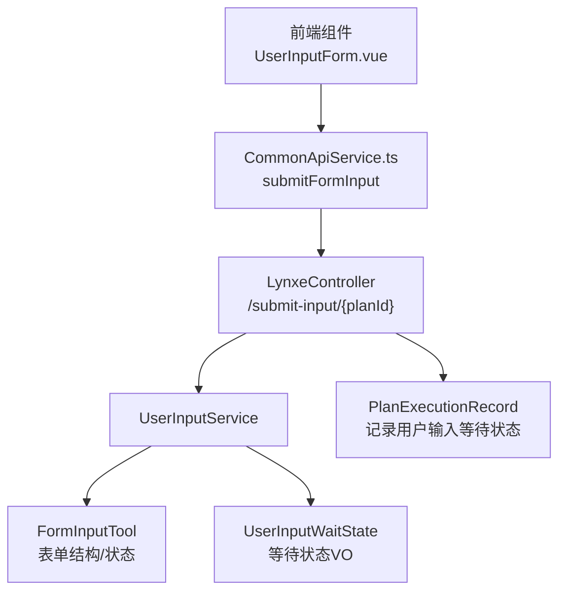
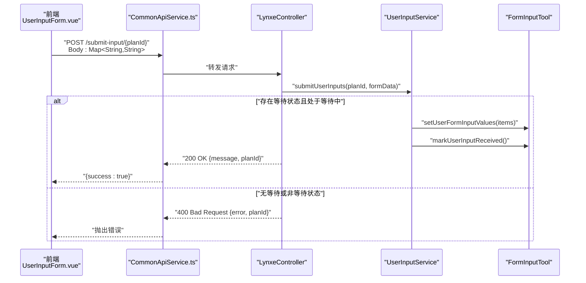
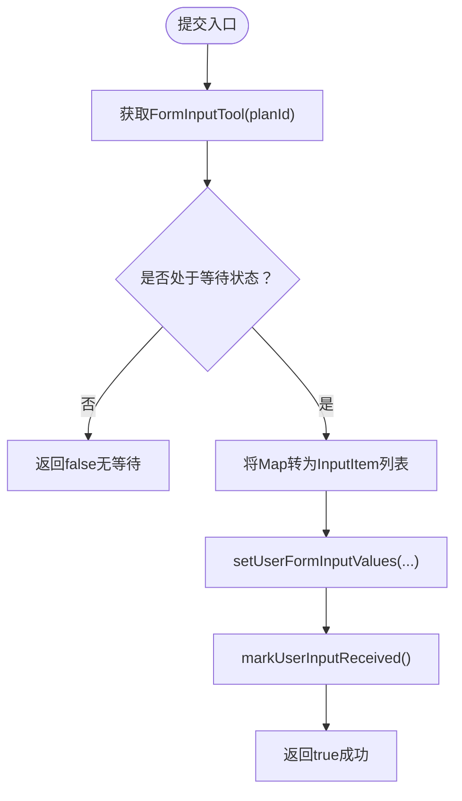
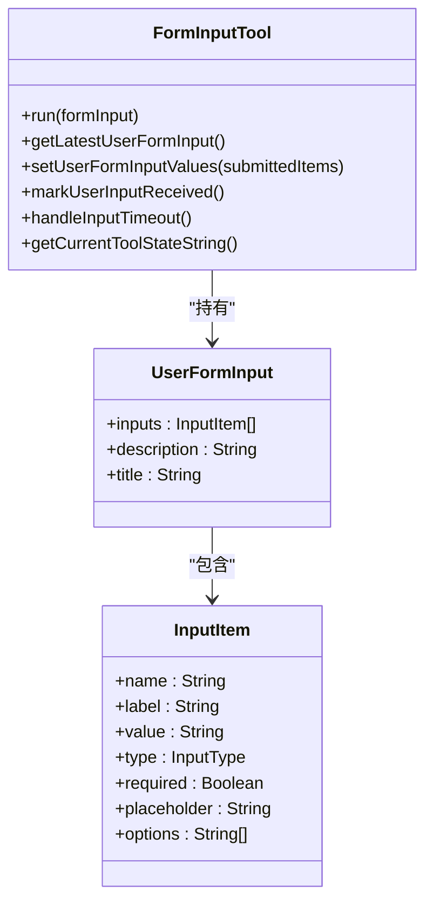
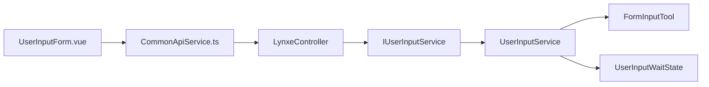

# 用户输入API

<cite>
**本文引用的文件列表**
- [LynxeController.java](file://src/main/java/com/alibaba/cloud/ai/lynxe/runtime/controller/LynxeController.java)
- [UserInputService.java](file://src/main/java/com/alibaba/cloud/ai/lynxe/runtime/service/UserInputService.java)
- [IUserInputService.java](file://src/main/java/com/alibaba/cloud/ai/lynxe/runtime/service/IUserInputService.java)
- [FormInputTool.java](file://src/main/java/com/alibaba/cloud/ai/lynxe/tool/FormInputTool.java)
- [UserInputWaitState.java](file://src/main/java/com/alibaba/cloud/ai/lynxe/runtime/entity/vo/UserInputWaitState.java)
- [PlanExecutionRecord.java](file://src/main/java/com/alibaba/cloud/ai/lynxe/recorder/entity/vo/PlanExecutionRecord.java)
- [ExecutionContext.java](file://src/main/java/com/alibaba/cloud/ai/lynxe/runtime/entity/vo/ExecutionContext.java)
- [UserInputForm.vue](file://ui-vue3/src/components/chat/UserInputForm.vue)
- [common-api-service.ts](file://ui-vue3/src/api/common-api-service.ts)
</cite>

## 目录
1. [简介](#简介)
2. [项目结构](#项目结构)
3. [核心组件](#核心组件)
4. [架构总览](#架构总览)
5. [详细组件分析](#详细组件分析)
6. [依赖关系分析](#依赖关系分析)
7. [性能考量](#性能考量)
8. [故障排查指南](#故障排查指南)
9. [结论](#结论)
10. [附录](#附录)

## 简介
本文件面向JManus的“用户输入API”，聚焦于submitUserInput端点的实现细节与交互流程，涵盖：
- 表单输入数据（Map<String, String>）的提交与处理
- UserInputService对用户输入等待状态的管理
- 输入参数合法性校验与错误处理
- planId与rootPlanId在用户输入上下文中的关联关系
- 前端组件（表单输入对话框）与后端的集成方式
- 多步骤计划中的表单填写流程示例

## 项目结构
用户输入API涉及后端控制器、服务层、工具类与前端组件的协同：
- 后端：控制器负责接收请求、调用服务层；服务层管理FormInputTool与等待状态；工具类封装表单结构与状态机
- 前端：表单组件收集用户输入并通过API提交到后端

图表来源
- [LynxeController.java](file://src/main/java/com/alibaba/cloud/ai/lynxe/runtime/controller/LynxeController.java#L467-L498)
- [UserInputService.java](file://src/main/java/com/alibaba/cloud/ai/lynxe/runtime/service/UserInputService.java#L1-L246)
- [FormInputTool.java](file://src/main/java/com/alibaba/cloud/ai/lynxe/tool/FormInputTool.java#L1-L581)
- [UserInputWaitState.java](file://src/main/java/com/alibaba/cloud/ai/lynxe/runtime/entity/vo/UserInputWaitState.java#L1-L84)
- [PlanExecutionRecord.java](file://src/main/java/com/alibaba/cloud/ai/lynxe/recorder/entity/vo/PlanExecutionRecord.java#L74-L123)
- [UserInputForm.vue](file://ui-vue3/src/components/chat/UserInputForm.vue#L27-L183)
- [common-api-service.ts](file://ui-vue3/src/api/common-api-service.ts#L73-L97)

章节来源
- [LynxeController.java](file://src/main/java/com/alibaba/cloud/ai/lynxe/runtime/controller/LynxeController.java#L467-L498)
- [UserInputService.java](file://src/main/java/com/alibaba/cloud/ai/lynxe/runtime/service/UserInputService.java#L1-L246)
- [FormInputTool.java](file://src/main/java/com/alibaba/cloud/ai/lynxe/tool/FormInputTool.java#L1-L581)
- [UserInputWaitState.java](file://src/main/java/com/alibaba/cloud/ai/lynxe/runtime/entity/vo/UserInputWaitState.java#L1-L84)
- [PlanExecutionRecord.java](file://src/main/java/com/alibaba/cloud/ai/lynxe/recorder/entity/vo/PlanExecutionRecord.java#L74-L123)
- [UserInputForm.vue](file://ui-vue3/src/components/chat/UserInputForm.vue#L27-L183)
- [common-api-service.ts](file://ui-vue3/src/api/common-api-service.ts#L73-L97)

## 核心组件
- 控制器端点：接收前端提交的表单数据，转发至服务层，并返回标准化响应
- 服务层：维护FormInputTool与等待状态，负责将用户输入写入表单并标记为已接收
- 工具类：定义表单结构、输入项类型、当前状态机与序列化/反序列化逻辑
- 前端组件：渲染表单、收集输入、调用API提交

章节来源
- [LynxeController.java](file://src/main/java/com/alibaba/cloud/ai/lynxe/runtime/controller/LynxeController.java#L467-L498)
- [UserInputService.java](file://src/main/java/com/alibaba/cloud/ai/lynxe/runtime/service/UserInputService.java#L1-L246)
- [FormInputTool.java](file://src/main/java/com/alibaba/cloud/ai/lynxe/tool/FormInputTool.java#L1-L581)
- [UserInputForm.vue](file://ui-vue3/src/components/chat/UserInputForm.vue#L27-L183)

## 架构总览
下图展示从前端到后端的关键交互路径与状态流转。

图表来源
- [LynxeController.java](file://src/main/java/com/alibaba/cloud/ai/lynxe/runtime/controller/LynxeController.java#L467-L498)
- [UserInputService.java](file://src/main/java/com/alibaba/cloud/ai/lynxe/runtime/service/UserInputService.java#L217-L243)
- [FormInputTool.java](file://src/main/java/com/alibaba/cloud/ai/lynxe/tool/FormInputTool.java#L412-L441)
- [UserInputForm.vue](file://ui-vue3/src/components/chat/UserInputForm.vue#L268-L303)
- [common-api-service.ts](file://ui-vue3/src/api/common-api-service.ts#L73-L97)

## 详细组件分析

### submitUserInput端点
- 路径与方法：POST /submit-input/{planId}
- 请求体：Map<String, String>（键为表单项标签，值为用户输入）
- 成功响应：200 OK，包含消息与planId
- 失败响应：
  - 400 Bad Request：当目标planId没有处于等待用户输入状态时
  - 400 Bad Request：当服务层抛出非法参数异常（例如未找到对应FormInputTool）
  - 500 Internal Server Error：其他未预期异常

章节来源
- [LynxeController.java](file://src/main/java/com/alibaba/cloud/ai/lynxe/runtime/controller/LynxeController.java#L467-L498)
- [common-api-service.ts](file://ui-vue3/src/api/common-api-service.ts#L73-L97)

### UserInputService：用户输入等待状态管理
- 存储与并发控制
  - 使用ConcurrentHashMap按rootPlanId存储FormInputTool
  - 使用ReentrantLock实现每rootPlanId的独占存储，避免多个子计划同时占用同一等待槽位
  - 提供自旋锁等待机制，等待已有表单完成后再进入
- 等待状态构建
  - 将FormInputTool中的最新表单结构转换为UserInputWaitState，包含标题、描述、输入项列表等
- 提交处理
  - 将Map<String, String>映射为InputItem列表，更新FormInputTool的输入值
  - 标记输入已接收，结束等待状态

图表来源
- [UserInputService.java](file://src/main/java/com/alibaba/cloud/ai/lynxe/runtime/service/UserInputService.java#L217-L243)
- [FormInputTool.java](file://src/main/java/com/alibaba/cloud/ai/lynxe/tool/FormInputTool.java#L412-L441)

章节来源
- [UserInputService.java](file://src/main/java/com/alibaba/cloud/ai/lynxe/runtime/service/UserInputService.java#L1-L246)
- [IUserInputService.java](file://src/main/java/com/alibaba/cloud/ai/lynxe/runtime/service/IUserInputService.java#L1-L77)

### FormInputTool：表单结构与状态机
- 表单结构
  - 支持多种输入类型（文本、数字、邮箱、密码、多行文本、选择、复选、单选）
  - 每个InputItem包含name、label、type、required、placeholder、options等字段
  - 支持从LLM生成的JSON字符串或数组形式的inputs解析
- 状态机
  - AWAITING_USER_INPUT：等待用户输入
  - INPUT_RECEIVED：已收到用户输入
  - INPUT_TIMEOUT：超时未收到输入
- 关键行为
  - run(UserFormInput)：保存最新表单定义并切换到等待状态
  - setUserFormInputValues：根据提交的键值对更新表单项值
  - markUserInputReceived：标记输入已接收
  - handleInputTimeout：超时处理并清空表单定义

图表来源
- [FormInputTool.java](file://src/main/java/com/alibaba/cloud/ai/lynxe/tool/FormInputTool.java#L1-L581)

章节来源
- [FormInputTool.java](file://src/main/java/com/alibaba/cloud/ai/lynxe/tool/FormInputTool.java#L1-L581)

### planId与rootPlanId的关系
- planId：当前执行计划的唯一标识
- rootPlanId：根计划的唯一标识，用于跨子计划共享等待状态
- 在控制器中，若当前planId对应的记录未设置rootPlanId，则回退使用currentPlanId作为rootPlanId
- 前端提交时应使用正确的planId（通常为rootPlanId），以确保服务层能正确匹配FormInputTool

章节来源
- [LynxeController.java](file://src/main/java/com/alibaba/cloud/ai/lynxe/runtime/controller/LynxeController.java#L392-L419)
- [PlanExecutionRecord.java](file://src/main/java/com/alibaba/cloud/ai/lynxe/recorder/entity/vo/PlanExecutionRecord.java#L212-L286)
- [ExecutionContext.java](file://src/main/java/com/alibaba/cloud/ai/lynxe/runtime/entity/vo/ExecutionContext.java#L87-L157)

### 前端集成：表单输入对话框
- 渲染规则
  - 若存在formInputs，按InputItem定义渲染对应类型的输入控件
  - 支持文本、数字、邮箱、密码、多行文本、选择、复选、单选
  - 处理复选框数组合并为逗号分隔字符串
- 提交流程
  - 组装Map<String, String>，键为label，值为用户输入
  - 调用CommonApiService.submitFormInput(planId, formData)
  - 成功后触发事件通知上层组件

章节来源
- [UserInputForm.vue](file://ui-vue3/src/components/chat/UserInputForm.vue#L27-L183)
- [UserInputForm.vue](file://ui-vue3/src/components/chat/UserInputForm.vue#L268-L303)
- [common-api-service.ts](file://ui-vue3/src/api/common-api-service.ts#L73-L97)

### 错误处理机制
- 不存在等待状态
  - 控制器返回400 Bad Request，提示“当前没有计划在等待用户输入”
- 非法参数
  - 当FormInputTool不存在或状态不为等待时，服务层抛出IllegalArgumentException，控制器捕获并返回400
- 系统异常
  - 其他未预期异常返回500 Internal Server Error

章节来源
- [LynxeController.java](file://src/main/java/com/alibaba/cloud/ai/lynxe/runtime/controller/LynxeController.java#L467-L498)
- [UserInputService.java](file://src/main/java/com/alibaba/cloud/ai/lynxe/runtime/service/UserInputService.java#L217-L243)

### 典型使用场景示例
- 多步骤计划中的表单填写
  - 步骤1：LLM通过FormInputTool定义表单结构并进入等待状态
  - 步骤2：前端渲染UserInputForm.vue，用户填写并提交
  - 步骤3：控制器接收请求，服务层更新表单值并标记已接收
  - 步骤4：执行器继续后续步骤，直至完成

章节来源
- [FormInputTool.java](file://src/main/java/com/alibaba/cloud/ai/lynxe/tool/FormInputTool.java#L375-L400)
- [UserInputService.java](file://src/main/java/com/alibaba/cloud/ai/lynxe/runtime/service/UserInputService.java#L217-L243)
- [LynxeController.java](file://src/main/java/com/alibaba/cloud/ai/lynxe/runtime/controller/LynxeController.java#L467-L498)

## 依赖关系分析
- 控制器依赖服务层接口IUserInputService，具体实现为UserInputService
- 服务层依赖FormInputTool与UserInputWaitState
- 前端通过CommonApiService调用控制器端点

图表来源
- [LynxeController.java](file://src/main/java/com/alibaba/cloud/ai/lynxe/runtime/controller/LynxeController.java#L467-L498)
- [IUserInputService.java](file://src/main/java/com/alibaba/cloud/ai/lynxe/runtime/service/IUserInputService.java#L1-L77)
- [UserInputService.java](file://src/main/java/com/alibaba/cloud/ai/lynxe/runtime/service/UserInputService.java#L1-L246)
- [FormInputTool.java](file://src/main/java/com/alibaba/cloud/ai/lynxe/tool/FormInputTool.java#L1-L581)
- [UserInputWaitState.java](file://src/main/java/com/alibaba/cloud/ai/lynxe/runtime/entity/vo/UserInputWaitState.java#L1-L84)
- [UserInputForm.vue](file://ui-vue3/src/components/chat/UserInputForm.vue#L27-L183)
- [common-api-service.ts](file://ui-vue3/src/api/common-api-service.ts#L73-L97)

章节来源
- [IUserInputService.java](file://src/main/java/com/alibaba/cloud/ai/lynxe/runtime/service/IUserInputService.java#L1-L77)
- [UserInputService.java](file://src/main/java/com/alibaba/cloud/ai/lynxe/runtime/service/UserInputService.java#L1-L246)
- [FormInputTool.java](file://src/main/java/com/alibaba/cloud/ai/lynxe/tool/FormInputTool.java#L1-L581)
- [UserInputWaitState.java](file://src/main/java/com/alibaba/cloud/ai/lynxe/runtime/entity/vo/UserInputWaitState.java#L1-L84)
- [UserInputForm.vue](file://ui-vue3/src/components/chat/UserInputForm.vue#L27-L183)
- [common-api-service.ts](file://ui-vue3/src/api/common-api-service.ts#L73-L97)

## 性能考量
- 并发与锁竞争
  - 每rootPlanId独占存储，避免多子计划并发抢占同一等待槽位
  - 自旋等待时间上限为5分钟，防止长时间阻塞
- 序列化开销
  - FormInputTool在运行时会序列化表单结构，建议保持表单简洁以降低序列化成本
- 前端渲染
  - 表单初始化采用防抖策略，减少频繁重渲染

章节来源
- [UserInputService.java](file://src/main/java/com/alibaba/cloud/ai/lynxe/runtime/service/UserInputService.java#L52-L129)
- [FormInputTool.java](file://src/main/java/com/alibaba/cloud/ai/lynxe/tool/FormInputTool.java#L375-L400)
- [UserInputForm.vue](file://ui-vue3/src/components/chat/UserInputForm.vue#L244-L265)

## 故障排查指南
- 提交后无响应或立即失败
  - 检查控制器日志：确认是否返回400（无等待）或500（系统异常）
  - 确认前端提交的planId是否为rootPlanId
- 表单未显示或为空
  - 检查控制器是否正确设置waitState的planId为rootPlanId
  - 确认服务层getWaitState返回的UserInputWaitState是否包含formInputs
- 参数不合法
  - 服务层可能抛出IllegalArgumentException，需检查传入的Map键是否与表单label一致

章节来源
- [LynxeController.java](file://src/main/java/com/alibaba/cloud/ai/lynxe/runtime/controller/LynxeController.java#L392-L419)
- [UserInputService.java](file://src/main/java/com/alibaba/cloud/ai/lynxe/runtime/service/UserInputService.java#L203-L215)
- [LynxeController.java](file://src/main/java/com/alibaba/cloud/ai/lynxe/runtime/controller/LynxeController.java#L467-L498)

## 结论
submitUserInput端点通过清晰的前后端分工与严格的状态管理，实现了多步骤计划中的交互式表单输入。UserInputService以rootPlanId为中心协调等待状态，FormInputTool提供稳定的表单结构与状态机，前端组件负责直观的用户交互。错误处理覆盖了不存在等待状态、非法参数与系统异常三类关键场景，保障了用户体验与系统稳定性。

## 附录
- API定义（语义化）
  - 方法：POST
  - 路径：/submit-input/{planId}
  - 请求体：Map<String, String>（键为表单项label，值为用户输入）
  - 成功响应：200 OK，包含message与planId
  - 失败响应：400 Bad Request或500 Internal Server Error，包含错误信息与planId

章节来源
- [LynxeController.java](file://src/main/java/com/alibaba/cloud/ai/lynxe/runtime/controller/LynxeController.java#L467-L498)
- [common-api-service.ts](file://ui-vue3/src/api/common-api-service.ts#L73-L97)