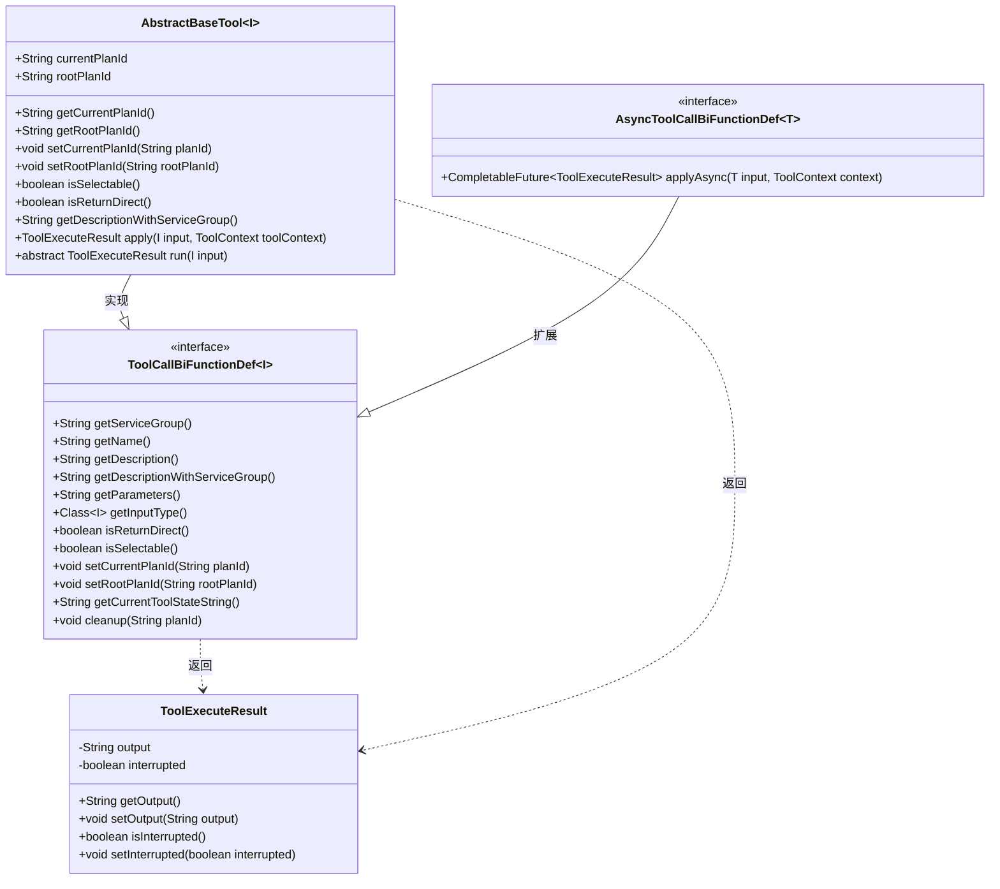
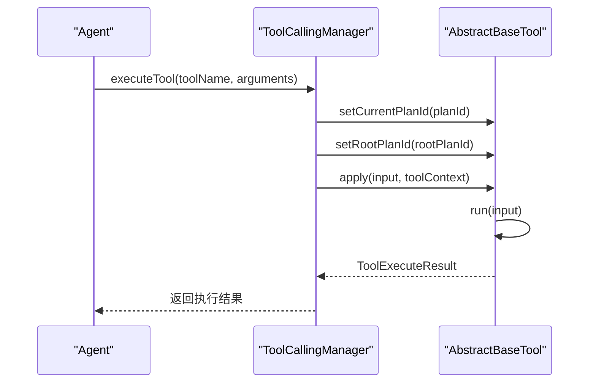
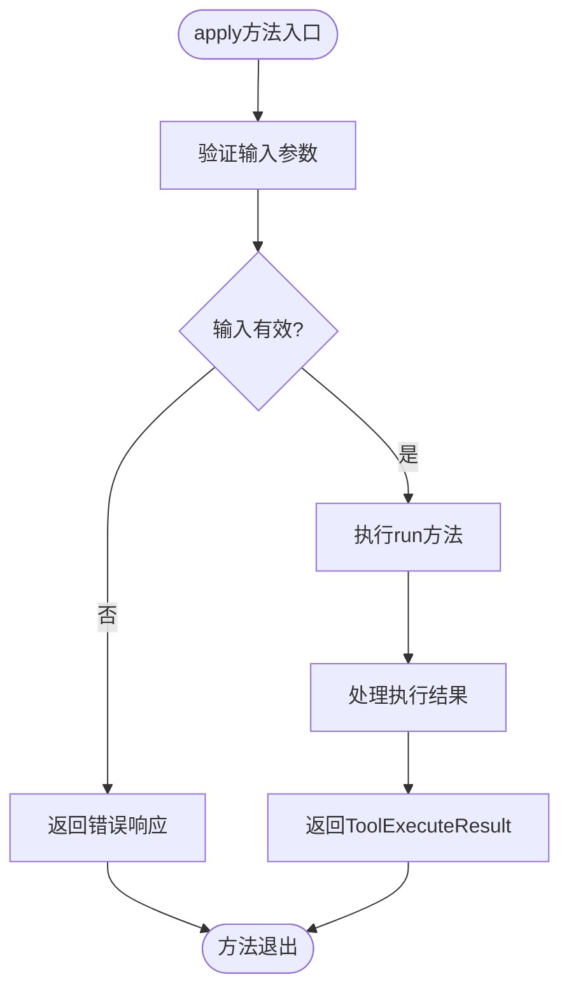

# 工具基类设计

<cite>
**本文档引用的文件**  
- [AbstractBaseTool.java](file://src/main/java/com/alibaba/cloud/ai/lynxe/tool/AbstractBaseTool.java)
- [ToolCallBiFunctionDef.java](file://src/main/java/com/alibaba/cloud/ai/lynxe/tool/ToolCallBiFunctionDef.java)
- [AsyncToolCallBiFunctionDef.java](file://src/main/java/com/alibaba/cloud/ai/lynxe/tool/AsyncToolCallBiFunctionDef.java)
- [ToolExecuteResult.java](file://src/main/java/com/alibaba/cloud/ai/lynxe/tool/code/ToolExecuteResult.java)
- [DebugTool.java](file://src/main/java/com/alibaba/cloud/ai/lynxe/tool/DebugTool.java)
- [BrowserUseTool.java](file://src/main/java/com/alibaba/cloud/ai/lynxe/tool/browser/BrowserUseTool.java)
- [DatabaseReadTool.java](file://src/main/java/com/alibaba/cloud/ai/lynxe/tool/database/DatabaseReadTool.java)
</cite>

## 目录
1. [引言](#引言)
2. [核心组件分析](#核心组件分析)
3. [继承体系与接口设计](#继承体系与接口设计)
4. [执行上下文管理](#执行上下文管理)
5. [模板方法模式实现](#模板方法模式实现)
6. [服务组信息附加机制](#服务组信息附加机制)
7. [新工具类派生模板](#新工具类派生模板)
8. [泛型约束最佳实践](#泛型约束最佳实践)

## 引言
本文档深入解析`AbstractBaseTool`作为所有工具扩展的抽象基类的设计原理。该基类为系统中的各类工具提供了统一的执行框架和公共功能，通过继承`ToolCallBiFunctionDef`接口实现了标准化的工具定义方法。文档将详细阐述其核心设计要素，包括执行上下文管理、模板方法模式、服务组信息附加机制等关键特性，并提供从该基类派生新工具的标准代码模板和泛型约束最佳实践。

## 核心组件分析

`AbstractBaseTool`是所有具体工具实现的抽象基类，为工具提供了统一的执行框架和公共功能。它通过泛型参数`<I>`定义工具输入类型，实现了`ToolCallBiFunctionDef<I>`接口，从而确保了所有工具都遵循统一的定义规范。

该基类的核心职责包括：
- 管理工具执行上下文（currentPlanId和rootPlanId）
- 提供模板方法模式的执行委托机制
- 实现服务组信息自动附加功能
- 定义必须由子类实现的抽象方法

**Section sources**
- [AbstractBaseTool.java](file://src/main/java/com/alibaba/cloud/ai/lynxe/tool/AbstractBaseTool.java#L28-L111)

## 继承体系与接口设计

`AbstractBaseTool`继承了`ToolCallBiFunctionDef`接口，该接口定义了工具的基本行为规范。`ToolCallBiFunctionDef`扩展了Java的`BiFunction`接口，要求实现`apply(I input, ToolContext toolContext)`方法，从而支持函数式编程模式。

`ToolCallBiFunctionDef`接口定义了工具的核心方法：
- `getServiceGroup()`：获取工具组名称
- `getName()`：获取工具名称
- `getDescription()`：获取工具描述
- `getParameters()`：获取参数定义schema
- `getInputType()`：获取输入参数类型
- `isSelectable()`：判断工具是否可选择

此外，系统还提供了`AsyncToolCallBiFunctionDef`接口，支持异步执行模式，允许工具返回`CompletableFuture`以提高资源利用率，防止在嵌套并行执行场景中出现线程池耗尽问题。



**Diagram sources**
- [AbstractBaseTool.java](file://src/main/java/com/alibaba/cloud/ai/lynxe/tool/AbstractBaseTool.java#L28-L111)
- [ToolCallBiFunctionDef.java](file://src/main/java/com/alibaba/cloud/ai/lynxe/tool/ToolCallBiFunctionDef.java#L29-L104)
- [AsyncToolCallBiFunctionDef.java](file://src/main/java/com/alibaba/cloud/ai/lynxe/tool/AsyncToolCallBiFunctionDef.java#L32-L57)
- [ToolExecuteResult.java](file://src/main/java/com/alibaba/cloud/ai/lynxe/tool/code/ToolExecuteResult.java#L18-L59)

**Section sources**
- [AbstractBaseTool.java](file://src/main/java/com/alibaba/cloud/ai/lynxe/tool/AbstractBaseTool.java#L28-L111)
- [ToolCallBiFunctionDef.java](file://src/main/java/com/alibaba/cloud/ai/lynxe/tool/ToolCallBiFunctionDef.java#L29-L104)
- [AsyncToolCallBiFunctionDef.java](file://src/main/java/com/alibaba/cloud/ai/lynxe/tool/AsyncToolCallBiFunctionDef.java#L32-L57)

## 执行上下文管理

`AbstractBaseTool`通过`currentPlanId`和`rootPlanId`两个字段管理工具执行上下文。`currentPlanId`表示当前计划的ID，用于标识当前正在执行的计划实例；`rootPlanId`表示整个执行计划的全局父级ID，用于追踪执行链路的根源。

这两个字段通过`setCurrentPlanId()`和`setRootPlanId()`方法进行设置，子类可以通过`getCurrentPlanId()`和`getRootPlanId()`方法获取当前的上下文信息。这种设计使得工具能够感知其在执行计划中的位置，从而实现基于上下文的决策和资源管理。

例如，在`BrowserUseTool`中，`currentPlanId`被用于获取与特定计划关联的浏览器驱动实例；在`DatabaseReadTool`中，`rootPlanId`被用于生成与执行计划关联的文件路径，确保不同计划之间的资源隔离。



**Diagram sources**
- [AbstractBaseTool.java](file://src/main/java/com/alibaba/cloud/ai/lynxe/tool/AbstractBaseTool.java#L33-L38)
- [ToolCallBiFunctionDef.java](file://src/main/java/com/alibaba/cloud/ai/lynxe/tool/ToolCallBiFunctionDef.java#L84-L90)
- [BrowserUseTool.java](file://src/main/java/com/alibaba/cloud/ai/lynxe/tool/browser/BrowserUseTool.java#L81-L85)
- [DatabaseReadTool.java](file://src/main/java/com/alibaba/cloud/ai/lynxe/tool/database/DatabaseReadTool.java#L110-L111)

**Section sources**
- [AbstractBaseTool.java](file://src/main/java/com/alibaba/cloud/ai/lynxe/tool/AbstractBaseTool.java#L33-L75)
- [BrowserUseTool.java](file://src/main/java/com/alibaba/cloud/ai/lynxe/tool/browser/BrowserUseTool.java#L81-L85)
- [DatabaseReadTool.java](file://src/main/java/com/alibaba/cloud/ai/lynxe/tool/database/DatabaseReadTool.java#L110-L111)

## 模板方法模式实现

`AbstractBaseTool`采用了模板方法设计模式，通过`apply()`方法将执行委托给`run()`方法。`apply()`方法提供了默认实现，直接调用`run()`方法并返回结果，子类可以重写此方法以添加额外的处理逻辑。

这种设计模式的优势在于：
1. 提供了统一的执行入口，确保所有工具都遵循相同的调用流程
2. 允许子类专注于实现具体的业务逻辑（在`run()`方法中）
3. 支持在基类中添加通用的前置或后置处理逻辑
4. 保持了代码的可扩展性和可维护性

例如，在`DebugTool`中，`run()`方法实现了具体的调试逻辑，而`apply()`方法则保持默认行为，直接委托执行。这种分离使得代码结构更加清晰，职责更加明确。



**Diagram sources**
- [AbstractBaseTool.java](file://src/main/java/com/alibaba/cloud/ai/lynxe/tool/AbstractBaseTool.java#L81-L84)
- [DebugTool.java](file://src/main/java/com/alibaba/cloud/ai/lynxe/tool/DebugTool.java#L43-L63)

**Section sources**
- [AbstractBaseTool.java](file://src/main/java/com/alibaba/cloud/ai/lynxe/tool/AbstractBaseTool.java#L81-L84)
- [DebugTool.java](file://src/main/java/com/alibaba/cloud/ai/lynxe/tool/DebugTool.java#L43-L63)

## 服务组信息附加机制

`getDescriptionWithServiceGroup()`方法实现了服务组信息自动附加的业务逻辑。该方法首先获取工具的基本描述，然后检查是否存在服务组信息，如果存在则将其附加到描述末尾。

具体实现逻辑如下：
1. 调用`getDescription()`获取工具的基本描述
2. 调用`getServiceGroup()`获取服务组名称
3. 检查服务组是否为非空字符串
4. 如果服务组存在，则将服务组信息附加到描述末尾
5. 返回最终的描述信息

这种设计使得工具描述能够动态包含其所属的服务组信息，提高了描述的完整性和可读性。例如，一个数据库工具的描述可能从"执行数据库读取操作"变为"执行数据库读取操作. Service group: database-service-group"。

**Section sources**
- [AbstractBaseTool.java](file://src/main/java/com/alibaba/cloud/ai/lynxe/tool/AbstractBaseTool.java#L101-L108)
- [ToolCallBiFunctionDef.java](file://src/main/java/com/alibaba/cloud/ai/lynxe/tool/ToolCallBiFunctionDef.java#L54-L55)

## 新工具类派生模板

从`AbstractBaseTool`派生新工具类的标准代码模板如下：

```java
public class MyCustomTool extends AbstractBaseTool<MyCustomInput> {
    
    private static final Logger log = LoggerFactory.getLogger(MyCustomTool.class);
    
    private final String name = "my-custom-tool";
    
    private final ToolI18nService toolI18nService;
    
    public MyCustomTool(ToolI18nService toolI18nService) {
        this.toolI18nService = toolI18nService;
    }
    
    @Override
    public ToolExecuteResult run(MyCustomInput input) {
        // 实现具体的工具逻辑
        log.info("MyCustomTool执行，输入: {}", input);
        // 处理输入并生成结果
        String result = "处理结果";
        return new ToolExecuteResult(result);
    }
    
    @Override
    public String getName() {
        return name;
    }
    
    @Override
    public String getDescription() {
        return toolI18nService.getDescription("my-custom-tool");
    }
    
    @Override
    public String getParameters() {
        return toolI18nService.getParameters("my-custom-tool");
    }
    
    @Override
    public Class<MyCustomInput> getInputType() {
        return MyCustomInput.class;
    }
    
    @Override
    public String getServiceGroup() {
        return "custom-service-group";
    }
    
    @Override
    public boolean isSelectable() {
        return true;
    }
    
    @Override
    public void cleanup(String planId) {
        // 清理与指定planId相关的资源
        log.info("清理MyCustomTool资源，planId: {}", planId);
    }
}
```

**Section sources**
- [AbstractBaseTool.java](file://src/main/java/com/alibaba/cloud/ai/lynxe/tool/AbstractBaseTool.java#L28-L111)
- [DebugTool.java](file://src/main/java/com/alibaba/cloud/ai/lynxe/tool/DebugTool.java#L30-L118)
- [BrowserUseTool.java](file://src/main/java/com/alibaba/cloud/ai/lynxe/tool/browser/BrowserUseTool.java#L52-L652)

## 泛型约束最佳实践

在使用`AbstractBaseTool`的泛型参数`I`时，应遵循以下最佳实践：

1. **使用具体的数据传输对象（DTO）**：建议为每个工具创建专用的输入类，而不是使用通用的`Map<String, Object>`。这提高了类型安全性和代码可读性。

2. **保持输入类的不可变性**：输入类应设计为不可变对象，通过构造函数或Builder模式初始化，避免在执行过程中被修改。

3. **提供合理的默认值**：对于可选参数，应在输入类中提供合理的默认值，减少调用方的配置负担。

4. **使用JSR-303验证注解**：在输入类的字段上使用`@NotNull`、`@Size`等验证注解，确保输入数据的有效性。

5. **避免过度复杂的嵌套结构**：输入类的结构应尽量扁平化，避免过深的嵌套层次，以提高可维护性和调试便利性。

6. **考虑序列化需求**：由于输入对象可能需要在网络间传输或持久化，应确保其可序列化，并考虑使用JSON兼容的数据类型。

这些最佳实践确保了工具输入的类型安全、可维护性和可扩展性，同时与系统的国际化、参数验证等机制良好集成。

**Section sources**
- [AbstractBaseTool.java](file://src/main/java/com/alibaba/cloud/ai/lynxe/tool/AbstractBaseTool.java#L26-L27)
- [DebugTool.java](file://src/main/java/com/alibaba/cloud/ai/lynxe/tool/DebugTool.java#L30-L31)
- [BrowserUseTool.java](file://src/main/java/com/alibaba/cloud/ai/lynxe/tool/browser/BrowserUseTool.java#L52-L53)
- [DatabaseReadTool.java](file://src/main/java/com/alibaba/cloud/ai/lynxe/tool/database/DatabaseReadTool.java#L35-L36)