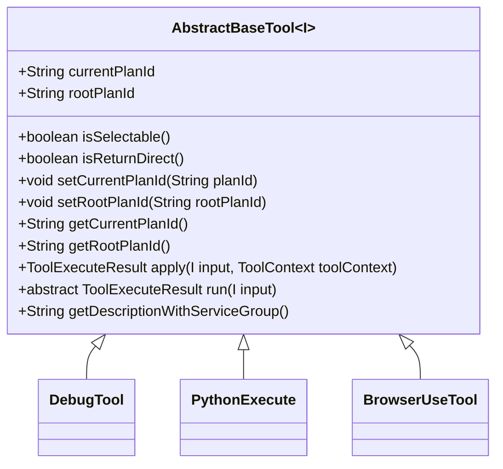
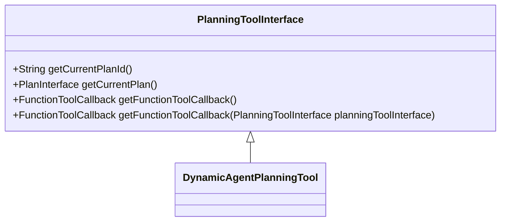
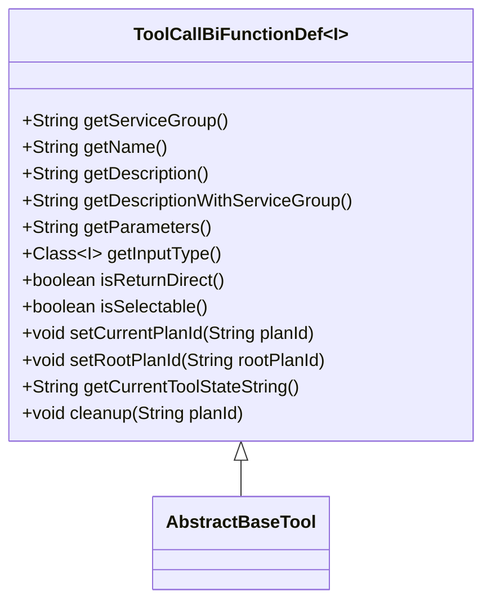
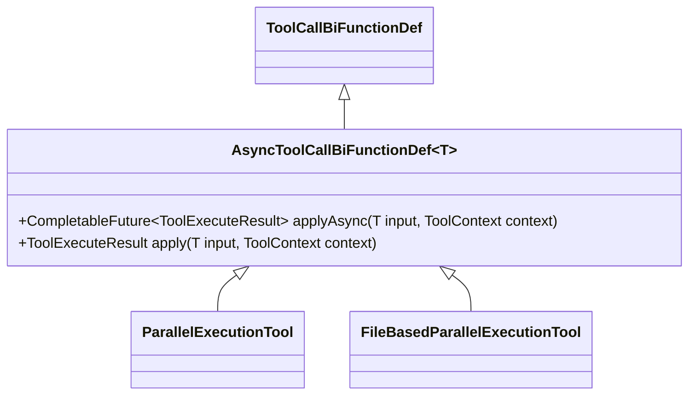
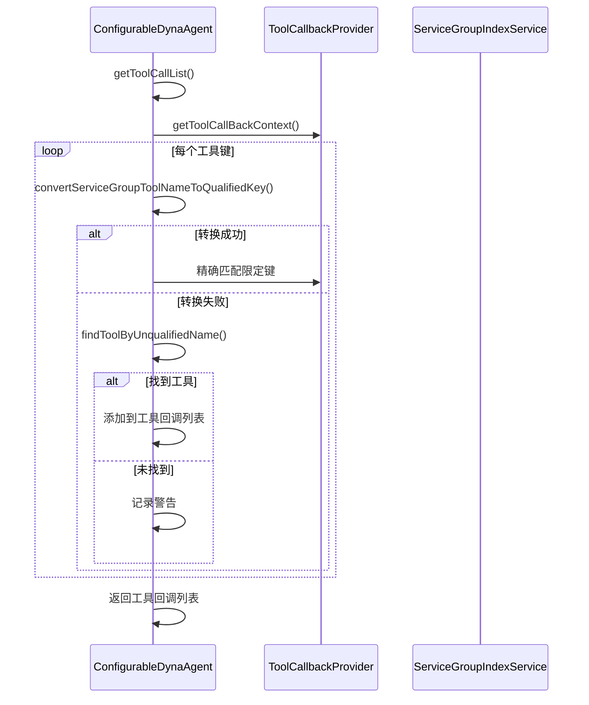
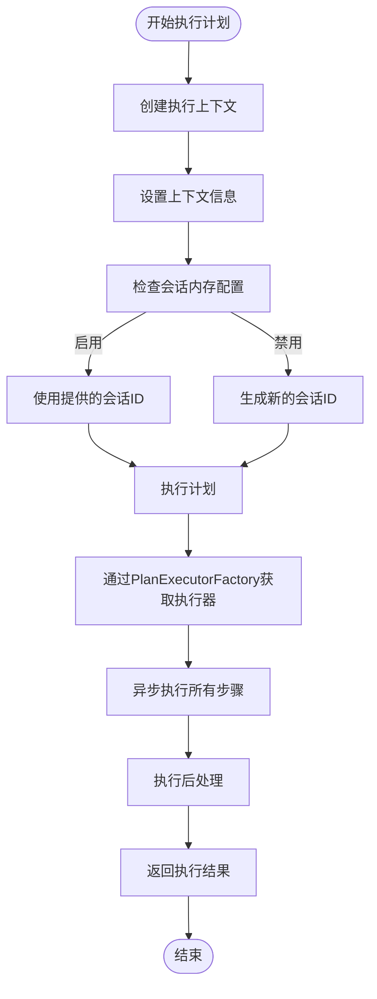
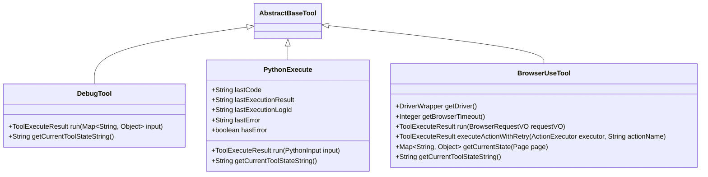

# 工具扩展框架

<cite>
**本文档引用的文件**   
- [AbstractBaseTool.java](file://src/main/java/com/alibaba/cloud/ai/lynxe/tool/AbstractBaseTool.java)
- [PlanningToolInterface.java](file://src/main/java/com/alibaba/cloud/ai/lynxe/tool/PlanningToolInterface.java)
- [ToolCallBiFunctionDef.java](file://src/main/java/com/alibaba/cloud/ai/lynxe/tool/ToolCallBiFunctionDef.java)
- [AsyncToolCallBiFunctionDef.java](file://src/main/java/com/alibaba/cloud/ai/lynxe/tool/AsyncToolCallBiFunctionDef.java)
- [ConfigurableDynaAgent.java](file://src/main/java/com/alibaba/cloud/ai/lynxe/agent/ConfigurableDynaAgent.java)
- [PlanningCoordinator.java](file://src/main/java/com/alibaba/cloud/ai/lynxe/runtime/service/PlanningCoordinator.java)
- [TerminableTool.java](file://src/main/java/com/alibaba/cloud/ai/lynxe/tool/TerminableTool.java)
- [TerminateTool.java](file://src/main/java/com/alibaba/cloud/ai/lynxe/tool/TerminateTool.java)
- [DebugTool.java](file://src/main/java/com/alibaba/cloud/ai/lynxe/tool/DebugTool.java)
- [PythonExecute.java](file://src/main/java/com/alibaba/cloud/ai/lynxe/tool/code/PythonExecute.java)
- [BrowserUseTool.java](file://src/main/java/com/alibaba/cloud/ai/lynxe/tool/browser/BrowserUseTool.java)
- [DynamicAgent.java](file://src/main/java/com/alibaba/cloud/ai/lynxe/agent/DynamicAgent.java)
</cite>

## 目录
1. [引言](#引言)
2. [核心基类设计](#核心基类设计)
3. [工具调用契约](#工具调用契约)
4. [工具注册与发现机制](#工具注册与发现机制)
5. [工具集配置与协调](#工具集配置与协调)
6. [自定义工具开发指南](#自定义工具开发指南)
7. [完整工具开发示例](#完整工具开发示例)
8. [总结](#总结)

## 引言

工具扩展框架是本系统的核心扩展机制，它提供了一套完整的工具开发、注册、发现和执行体系。该框架允许开发者通过继承基类、实现接口的方式创建自定义工具，并通过配置机制将这些工具集成到智能代理系统中。框架设计遵循开闭原则，支持动态加载和热插拔，使得系统功能可以灵活扩展而无需修改核心代码。

本框架的核心组件包括抽象基类`AbstractBaseTool`、工具调用契约`PlanningToolInterface`、函数式接口`ToolCallBiFunctionDef`以及`AsyncToolCallBiFunctionDef`。这些组件共同构成了工具扩展的基础。同时，`ConfigurableDynaAgent`类提供了工具集的动态配置能力，而`PlanningCoordinator`则负责协调工具的调用过程。

**本节来源**
- [AbstractBaseTool.java](file://src/main/java/com/alibaba/cloud/ai/lynxe/tool/AbstractBaseTool.java#L1-L112)
- [PlanningToolInterface.java](file://src/main/java/com/alibaba/cloud/ai/lynxe/tool/PlanningToolInterface.java#L1-L54)

## 核心基类设计

### AbstractBaseTool 抽象基类

`AbstractBaseTool`是所有工具实现的基类，它为具体工具提供了通用的功能和上下文管理。该类是一个泛型抽象类，接受一个类型参数`I`表示工具的输入类型。

该基类定义了两个关键的上下文ID字段：
- `currentPlanId`：当前计划ID，用于标识工具执行的上下文
- `rootPlanId`：根计划ID，作为整个执行计划的全局父级

基类实现了`ToolCallBiFunctionDef`接口，提供了默认的方法实现，包括`isReturnDirect()`返回`false`，以及`apply()`方法默认委托给`run()`方法执行。这种设计模式使得子类只需关注核心业务逻辑的实现，而无需处理底层的调用细节。

`AbstractBaseTool`还定义了一个抽象方法`isSelectable()`，要求所有子类必须实现此方法来决定工具是否可在前端UI中选择。此外，基类提供了`getDescriptionWithServiceGroup()`方法的默认实现，该方法会在工具描述后附加服务组信息，便于在多服务环境中区分工具。



**图源**
- [AbstractBaseTool.java](file://src/main/java/com/alibaba/cloud/ai/lynxe/tool/AbstractBaseTool.java#L1-L112)

**本节来源**
- [AbstractBaseTool.java](file://src/main/java/com/alibaba/cloud/ai/lynxe/tool/AbstractBaseTool.java#L1-L112)

## 工具调用契约

### PlanningToolInterface 接口

`PlanningToolInterface`定义了规划工具的通用行为契约，是所有规划工具必须遵循的接口规范。该接口提供了三个核心方法：

- `getCurrentPlanId()`：获取当前计划ID，如果不存在则返回null
- `getCurrentPlan()`：获取当前执行计划，如果不存在则返回null
- `getFunctionToolCallback()`：获取用于LLM集成的函数工具回调实例

该接口还提供了一个重载版本的`getFunctionToolCallback()`方法，允许传入特定的规划工具实例来获取对应的回调。这种设计使得工具可以灵活地与不同的LLM模型进行集成，支持复杂的调用场景。



**图源**
- [PlanningToolInterface.java](file://src/main/java/com/alibaba/cloud/ai/lynxe/tool/PlanningToolInterface.java#L1-L54)

### ToolCallBiFunctionDef 函数式接口

`ToolCallBiFunctionDef`是工具定义的核心函数式接口，它扩展了Java的`BiFunction`接口，定义了工具的统一调用方法。该接口采用泛型设计，接受输入类型`I`作为类型参数。

接口定义了工具的基本属性和行为：
- `getServiceGroup()`：获取工具组名称
- `getName()`：获取工具名称
- `getDescription()`：获取工具功能描述
- `getParameters()`：获取工具参数定义的JSON Schema
- `getInputType()`：获取工具接受的输入参数类型
- `isReturnDirect()`：判断工具是否直接返回结果
- `isSelectable()`：判断工具是否可选择
- `setCurrentPlanId()`和`setRootPlanId()`：设置关联的计划ID
- `getCurrentToolStateString()`：获取工具当前状态字符串
- `cleanup()`：清理指定计划ID的相关资源

该接口的设计遵循了函数式编程的原则，使得工具可以作为一等公民在系统中传递和组合。



**图源**
- [ToolCallBiFunctionDef.java](file://src/main/java/com/alibaba/cloud/ai/lynxe/tool/ToolCallBiFunctionDef.java#L1-L105)

### AsyncToolCallBiFunctionDef 异步接口

`AsyncToolCallBiFunctionDef`是`ToolCallBiFunctionDef`的异步版本，支持非阻塞执行。该接口允许工具返回`CompletableFuture`，从而提高资源利用率，防止在嵌套并行执行场景中出现线程池耗尽的问题。

接口定义了`applyAsync()`方法，该方法返回一个`CompletableFuture`，允许工具在不阻塞调用线程的情况下执行。同时，接口提供了`apply()`方法的默认实现，通过`join()`方法包装异步调用，保持与现有代码的向后兼容性。



**图源**
- [AsyncToolCallBiFunctionDef.java](file://src/main/java/com/alibaba/cloud/ai/lynxe/tool/AsyncToolCallBiFunctionDef.java#L1-L58)

**本节来源**
- [PlanningToolInterface.java](file://src/main/java/com/alibaba/cloud/ai/lynxe/tool/PlanningToolInterface.java#L1-L54)
- [ToolCallBiFunctionDef.java](file://src/main/java/com/alibaba/cloud/ai/lynxe/tool/ToolCallBiFunctionDef.java#L1-L105)
- [AsyncToolCallBiFunctionDef.java](file://src/main/java/com/alibaba/cloud/ai/lynxe/tool/AsyncToolCallBiFunctionDef.java#L1-L58)

## 工具注册与发现机制

### 工具注册流程

工具的注册与发现机制是通过`ToolCallbackProvider`组件实现的。系统启动时，会扫描所有实现了`ToolCallBiFunctionDef`接口的工具类，并将它们注册到`toolCallBackContext`映射中。每个工具通过其唯一标识符（通常是`serviceName.toolName`格式）进行注册。

`ServiceGroupIndexService`在工具注册过程中扮演重要角色，它负责将服务组名称转换为索引，从而生成工具的限定键（qualified key），格式为`toolName*index*`。这种设计解决了多实例环境下工具名称冲突的问题。

### 工具发现机制

工具发现机制在`ConfigurableDynaAgent`的`getToolCallList()`方法中实现。该方法首先检查配置的可用工具键列表，如果为空则返回所有可用工具。对于每个工具键，系统会尝试通过`convertServiceGroupToolNameToQualifiedKey()`方法将其转换为限定键格式。

系统提供了多层查找机制：
1. 首先尝试精确匹配（支持新的限定键）
2. 如果失败，则通过`findToolByUnqualifiedName()`进行向后兼容查找
3. 最后通过`findToolByServiceGroupAndName()`使用服务组索引服务进行查找

这种分层查找策略确保了系统的向后兼容性，同时支持新的工具命名规范。



**图源**
- [ConfigurableDynaAgent.java](file://src/main/java/com/alibaba/cloud/ai/lynxe/agent/ConfigurableDynaAgent.java#L97-L198)
- [ParallelExecutionService.java](file://src/main/java/com/alibaba/cloud/ai/lynxe/tool/mapreduce/ParallelExecutionService.java#L71-L87)

**本节来源**
- [ConfigurableDynaAgent.java](file://src/main/java/com/alibaba/cloud/ai/lynxe/agent/ConfigurableDynaAgent.java#L97-L341)
- [ParallelExecutionService.java](file://src/main/java/com/alibaba/cloud/ai/lynxe/tool/mapreduce/ParallelExecutionService.java#L71-L87)

## 工具集配置与协调

### ConfigurableDynaAgent 配置代理

`ConfigurableDynaAgent`是`DynamicAgent`的扩展，允许在运行时动态传递工具列表。该代理通过构造函数接收工具键列表`availableToolKeys`，并根据这些键配置可用的工具集。

当`availableToolKeys`为空时，代理会自动添加所有可用工具。代理还确保`TerminateTool`始终包含在工具列表中，这是系统正常终止执行所必需的。这种设计模式实现了工具集的灵活配置，支持不同场景下的工具组合。

代理通过`serviceGroupIndexService`进行工具键的转换和查找，确保了工具引用的准确性和一致性。同时，代理提供了向后兼容性支持，能够处理旧版本的工具命名格式。

### PlanningCoordinator 规划协调器

`PlanningCoordinator`是工具调用过程的核心协调组件，负责执行计划的调度和管理。该组件通过`PlanExecutorFactory`动态选择适当的执行器来处理不同类型的计划。

协调器的`executeByPlan()`方法是执行计划的关键入口，它接收计划接口、根计划ID、父计划ID、当前计划ID等参数，并返回一个`CompletableFuture`，支持异步非阻塞执行。

执行流程包括：
1. 创建执行上下文`ExecutionContext`
2. 设置计划深度、会话ID等上下文信息
3. 通过`PlanExecutorFactory`创建执行器
4. 异步执行所有步骤
5. 执行后处理，通过`PlanFinalizer`处理执行结果

协调器还处理会话内存的管理，根据配置决定是否为Vue请求生成新的会话ID，确保了会话状态的一致性。



**图源**
- [ConfigurableDynaAgent.java](file://src/main/java/com/alibaba/cloud/ai/lynxe/agent/ConfigurableDynaAgent.java#L51-L341)
- [PlanningCoordinator.java](file://src/main/java/com/alibaba/cloud/ai/lynxe/runtime/service/PlanningCoordinator.java#L76-L178)

**本节来源**
- [ConfigurableDynaAgent.java](file://src/main/java/com/alibaba/cloud/ai/lynxe/agent/ConfigurableDynaAgent.java#L51-L341)
- [PlanningCoordinator.java](file://src/main/java/com/alibaba/cloud/ai/lynxe/runtime/service/PlanningCoordinator.java#L76-L178)

## 自定义工具开发指南

### 开发步骤

创建自定义工具需要遵循以下步骤：

1. **继承基类**：创建新类继承`AbstractBaseTool`，并指定输入类型
2. **实现必要方法**：重写`run()`方法实现核心业务逻辑
3. **提供元数据**：实现`getName()`、`getDescription()`、`getParameters()`等方法
4. **处理上下文**：正确管理`currentPlanId`和`rootPlanId`
5. **资源清理**：在`cleanup()`方法中释放相关资源

### 注解配置

工具可以通过注解进行配置，系统会自动扫描带有特定注解的类并注册为工具。配置注解包括：
- `@DynamicAgentDefinition`：用于定义动态代理的配置
- 工具特定的配置注解，用于定义工具的元数据

### 参数定义

工具的参数通过JSON Schema定义，通常在`getParameters()`方法中返回。Schema定义了参数的类型、属性、是否必需等信息。例如，Python执行工具的参数定义如下：

```json
{
    "type": "object",
    "properties": {
        "code": {
            "type": "string",
            "description": "要执行的Python代码"
        }
    },
    "required": ["code"]
}
```

### 结果返回

工具执行结果通过`ToolExecuteResult`类返回，该类封装了执行输出。工具可以通过`isReturnDirect()`方法指定是否直接返回结果，这对于需要立即响应的工具（如调试工具）很有用。

### 特殊工具类型

系统支持两种特殊工具类型：
- `TerminableTool`：可终止的工具，实现`canTerminate()`方法
- `AsyncToolCallBiFunctionDef`：异步工具，支持非阻塞执行

**本节来源**
- [AbstractBaseTool.java](file://src/main/java/com/alibaba/cloud/ai/lynxe/tool/AbstractBaseTool.java#L1-L112)
- [ToolCallBiFunctionDef.java](file://src/main/java/com/alibaba/cloud/ai/lynxe/tool/ToolCallBiFunctionDef.java#L1-L105)
- [TerminableTool.java](file://src/main/java/com/alibaba/cloud/ai/lynxe/tool/TerminableTool.java#L1-L31)

## 完整工具开发示例

### DebugTool 示例分析

`DebugTool`是一个简单的调试工具，它允许LLM输出消息并直接返回。该工具继承`AbstractBaseTool`，输入类型为`Map<String, Object>`。

核心实现：
- `run()`方法提取输入中的"message"字段并返回
- `getName()`返回常量"name"
- `getDescription()`和`getParameters()`通过`ToolI18nService`获取国际化内容
- `isReturnDirect()`返回`true`，表示直接返回结果
- `getCurrentToolStateString()`返回工具的当前状态信息

### PythonExecute 示例分析

`PythonExecute`工具允许执行Python代码。该工具展示了复杂工具的实现模式：

- 定义内部类`PythonInput`作为输入参数
- `run()`方法处理代码执行和结果捕获
- 使用`CodeUtils.executeCode()`执行代码
- 捕获执行结果和错误信息
- 维护执行状态（最后执行的代码、结果、错误等）

该工具还实现了`getCurrentToolStateString()`方法，返回详细的执行状态，包括运行环境、最近执行的代码、执行状态等。

### BrowserUseTool 示例分析

`BrowserUseTool`是一个复杂的浏览器操作工具，它封装了Playwright浏览器自动化功能。该工具的特点包括：

- 支持多种浏览器操作（导航、点击、输入文本等）
- 使用策略模式，每种操作由独立的Action类实现
- 提供重试机制，增强操作的可靠性
- 智能内容处理，对长文本进行摘要
- 完整的错误处理和超时管理

工具通过`run()`方法根据请求中的`action`参数分发到相应的操作执行器，体现了开闭原则的设计思想。



**图源**
- [DebugTool.java](file://src/main/java/com/alibaba/cloud/ai/lynxe/tool/DebugTool.java#L1-L119)
- [PythonExecute.java](file://src/main/java/com/alibaba/cloud/ai/lynxe/tool/code/PythonExecute.java#L1-L246)
- [BrowserUseTool.java](file://src/main/java/com/alibaba/cloud/ai/lynxe/tool/browser/BrowserUseTool.java#L1-L653)

**本节来源**
- [DebugTool.java](file://src/main/java/com/alibaba/cloud/ai/lynxe/tool/DebugTool.java#L1-L119)
- [PythonExecute.java](file://src/main/java/com/alibaba/cloud/ai/lynxe/tool/code/PythonExecute.java#L1-L246)
- [BrowserUseTool.java](file://src/main/java/com/alibaba/cloud/ai/lynxe/tool/browser/BrowserUseTool.java#L1-L653)

## 总结

工具扩展框架提供了一套完整、灵活且可扩展的工具开发和集成机制。通过`AbstractBaseTool`基类和`ToolCallBiFunctionDef`接口，框架为工具开发提供了统一的规范和便利的基础功能。`PlanningToolInterface`定义了工具与LLM集成的契约，确保了工具调用的一致性。

工具注册与发现机制通过`ServiceGroupIndexService`和多层查找策略，解决了多实例环境下的工具管理问题。`ConfigurableDynaAgent`和`PlanningCoordinator`组件实现了工具集的动态配置和执行协调，支持复杂的执行场景。

框架的设计充分考虑了向后兼容性和扩展性，支持同步和异步工具，以及特殊类型的工具如可终止工具。通过提供的示例工具，开发者可以快速理解框架的使用模式，并创建满足特定需求的自定义工具。

该框架不仅支持当前的功能需求，还为未来的扩展预留了空间，是系统智能化能力的核心支撑。

**本节来源**
- [AbstractBaseTool.java](file://src/main/java/com/alibaba/cloud/ai/lynxe/tool/AbstractBaseTool.java#L1-L112)
- [PlanningToolInterface.java](file://src/main/java/com/alibaba/cloud/ai/lynxe/tool/PlanningToolInterface.java#L1-L54)
- [ToolCallBiFunctionDef.java](file://src/main/java/com/alibaba/cloud/ai/lynxe/tool/ToolCallBiFunctionDef.java#L1-L105)
- [ConfigurableDynaAgent.java](file://src/main/java/com/alibaba/cloud/ai/lynxe/agent/ConfigurableDynaAgent.java#L51-L341)
- [PlanningCoordinator.java](file://src/main/java/com/alibaba/cloud/ai/lynxe/runtime/service/PlanningCoordinator.java#L76-L178)