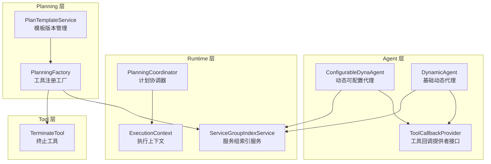
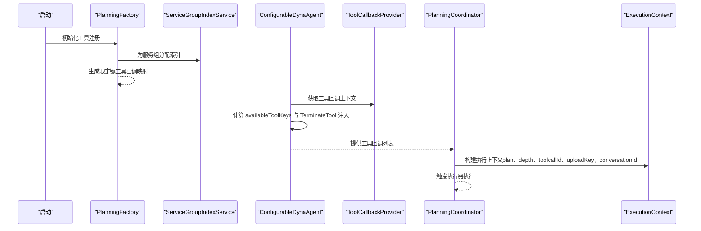
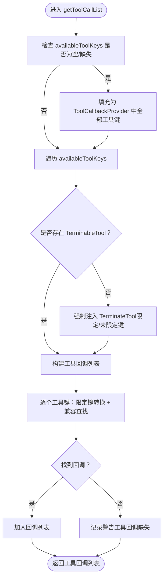
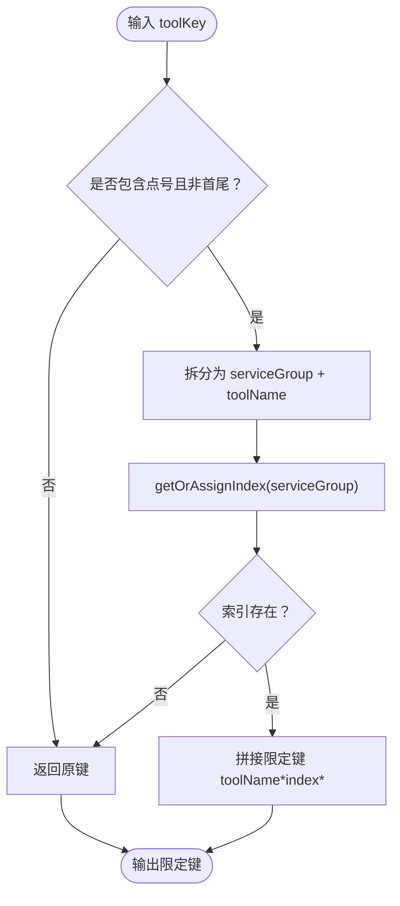
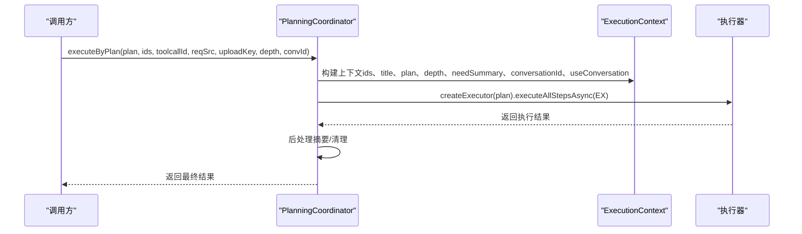
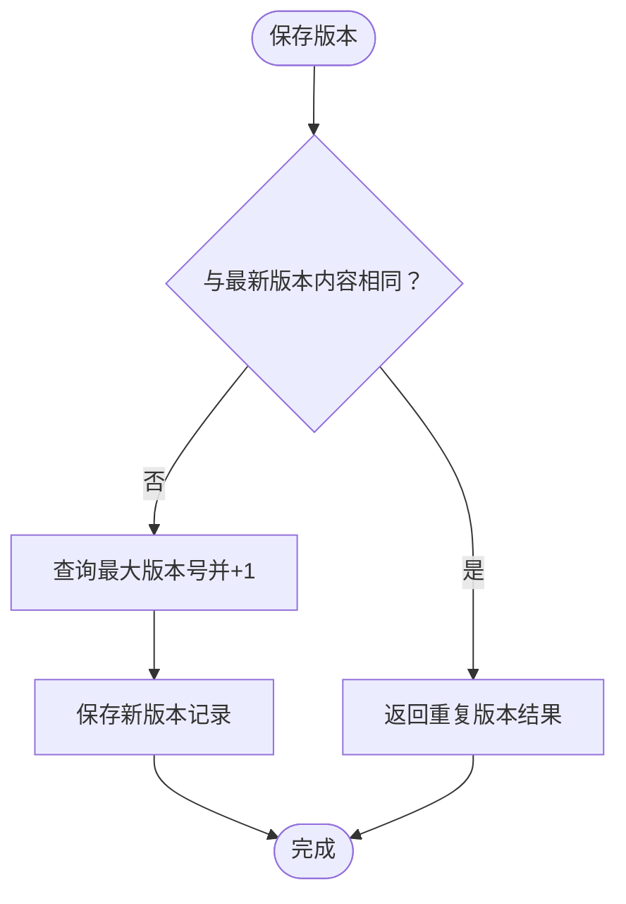
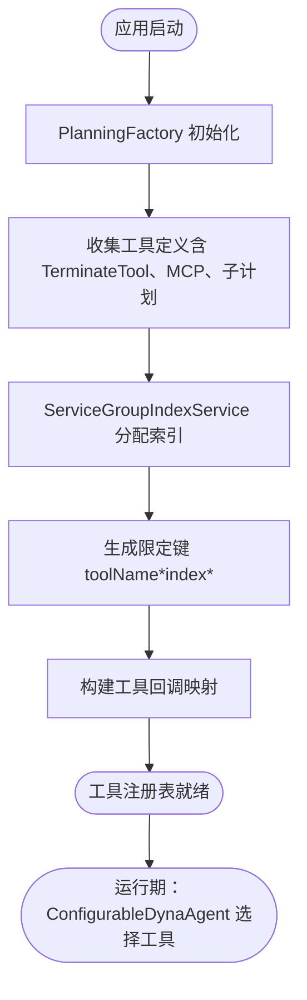
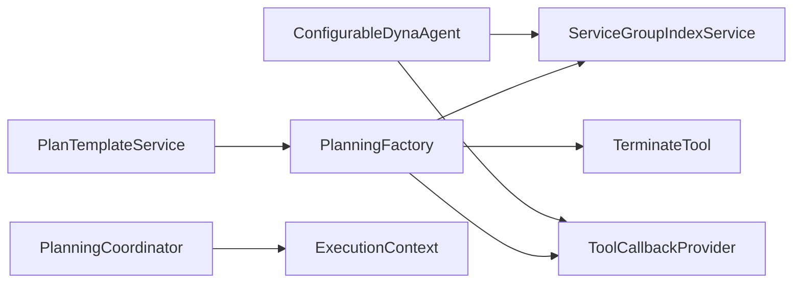
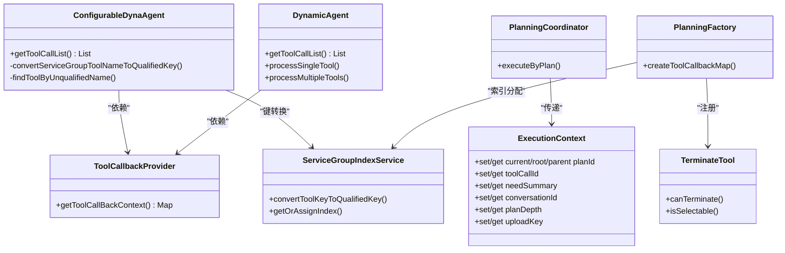

# 工具注册与发现

<cite>
**本文引用的文件列表**
- [ConfigurableDynaAgent.java](file://src/main/java/com/alibaba/cloud/ai/lynxe/agent/ConfigurableDynaAgent.java)
- [DynamicAgent.java](file://src/main/java/com/alibaba/cloud/ai/lynxe/agent/DynamicAgent.java)
- [ServiceGroupIndexService.java](file://src/main/java/com/alibaba/cloud/ai/lynxe/runtime/service/ServiceGroupIndexService.java)
- [PlanningCoordinator.java](file://src/main/java/com/alibaba/cloud/ai/lynxe/runtime/service/PlanningCoordinator.java)
- [PlanTemplateService.java](file://src/main/java/com/alibaba/cloud/ai/lynxe/planning/service/PlanTemplateService.java)
- [PlanningFactory.java](file://src/main/java/com/alibaba/cloud/ai/lynxe/planning/PlanningFactory.java)
- [TerminateTool.java](file://src/main/java/com/alibaba/cloud/ai/lynxe/tool/TerminateTool.java)
- [ToolCallbackProvider.java](file://src/main/java/com/alibaba/cloud/ai/lynxe/agent/ToolCallbackProvider.java)
- [ExecutionContext.java](file://src/main/java/com/alibaba/cloud/ai/lynxe/runtime/entity/vo/ExecutionContext.java)
</cite>

## 目录
1. [引言](#引言)
2. [项目结构](#项目结构)
3. [核心组件](#核心组件)
4. [架构总览](#架构总览)
5. [详细组件分析](#详细组件分析)
6. [依赖关系分析](#依赖关系分析)
7. [性能考量](#性能考量)
8. [故障排查指南](#故障排查指南)
9. [结论](#结论)
10. [附录](#附录)

## 引言
本文件聚焦于“工具注册与发现”机制，围绕以下目标展开：
- 深入解析 ConfigurableDynaAgent 中 getToolCallList() 的工具选择逻辑，包括 availableToolKeys 的配置优先级与 TerminateTool 的强制注入机制。
- 说明 ServiceGroupIndexService 在 convertServiceGroupToolNameToQualifiedKey() 方法中实现的工具键转换规则。
- 阐述 PlanningCoordinator 如何通过 ExecutionContext 传递工具执行上下文。
- 解释 PlanTemplateService 在版本管理中对工具配置的持久化处理。
- 提供工具注册表的初始化流程图与工具发现的时序图，展示从系统启动到工具可用的完整生命周期。

## 项目结构
本项目采用分层与功能域结合的组织方式：
- agent：智能体与工具回调提供者接口
- runtime：运行时服务（计划协调、上下文、索引等）
- planning：规划工厂与模板服务
- tool：各类具体工具实现
- mcp：外部工具桥接（MCP）能力

图表来源
- [ConfigurableDynaAgent.java](file://src/main/java/com/alibaba/cloud/ai/lynxe/agent/ConfigurableDynaAgent.java#L91-L199)
- [DynamicAgent.java](file://src/main/java/com/alibaba/cloud/ai/lynxe/agent/DynamicAgent.java#L1394-L1410)
- [PlanningCoordinator.java](file://src/main/java/com/alibaba/cloud/ai/lynxe/runtime/service/PlanningCoordinator.java#L60-L179)
- [ServiceGroupIndexService.java](file://src/main/java/com/alibaba/cloud/ai/lynxe/runtime/service/ServiceGroupIndexService.java#L97-L130)
- [PlanningFactory.java](file://src/main/java/com/alibaba/cloud/ai/lynxe/planning/PlanningFactory.java#L300-L374)
- [PlanTemplateService.java](file://src/main/java/com/alibaba/cloud/ai/lynxe/planning/service/PlanTemplateService.java#L90-L110)
- [TerminateTool.java](file://src/main/java/com/alibaba/cloud/ai/lynxe/tool/TerminateTool.java#L385-L455)
- [ToolCallbackProvider.java](file://src/main/java/com/alibaba/cloud/ai/lynxe/agent/ToolCallbackProvider.java#L22-L26)

章节来源
- [ConfigurableDynaAgent.java](file://src/main/java/com/alibaba/cloud/ai/lynxe/agent/ConfigurableDynaAgent.java#L91-L199)
- [PlanningCoordinator.java](file://src/main/java/com/alibaba/cloud/ai/lynxe/runtime/service/PlanningCoordinator.java#L60-L179)

## 核心组件
- ConfigurableDynaAgent：在 DynamicAgent 基础上扩展，支持按需传入工具集合，并在工具选择阶段进行“可用工具集”的补全与 TerminateTool 的强制注入。
- ServiceGroupIndexService：为服务组分配稳定索引，负责将前端格式（serviceGroup.toolName）转换为后端执行格式（toolName*index*）。
- PlanningCoordinator：负责创建 ExecutionContext 并驱动执行器执行计划步骤，贯穿工具执行上下文。
- PlanningFactory：统一注册工具，生成带“限定键”的工具回调映射，确保 LLM 调用与后端执行一致。
- PlanTemplateService：对计划模板的工具配置进行版本化持久化，避免重复保存相同内容。
- TerminateTool：实现 TerminableTool 接口，作为“可终止”的兜底工具，保障执行闭环。

章节来源
- [ConfigurableDynaAgent.java](file://src/main/java/com/alibaba/cloud/ai/lynxe/agent/ConfigurableDynaAgent.java#L91-L199)
- [ServiceGroupIndexService.java](file://src/main/java/com/alibaba/cloud/ai/lynxe/runtime/service/ServiceGroupIndexService.java#L97-L130)
- [PlanningCoordinator.java](file://src/main/java/com/alibaba/cloud/ai/lynxe/runtime/service/PlanningCoordinator.java#L60-L179)
- [PlanningFactory.java](file://src/main/java/com/alibaba/cloud/ai/lynxe/planning/PlanningFactory.java#L300-L374)
- [PlanTemplateService.java](file://src/main/java/com/alibaba/cloud/ai/lynxe/planning/service/PlanTemplateService.java#L90-L110)
- [TerminateTool.java](file://src/main/java/com/alibaba/cloud/ai/lynxe/tool/TerminateTool.java#L385-L455)

## 架构总览
工具注册与发现的关键路径：
- 启动期：PlanningFactory 统一收集工具定义，生成带限定键的工具回调映射；同时注册子计划工具与 MCP 工具。
- 运行期：ConfigurableDynaAgent 基于 availableToolKeys 与 ToolCallbackProvider 的工具映射构建工具回调列表；若未显式包含可终止工具，则强制注入 TerminateTool。
- 执行期：PlanningCoordinator 创建 ExecutionContext，携带 plan、深度、工具调用 ID、上传键、会话 ID 等上下文信息，驱动执行器执行。

图表来源
- [PlanningFactory.java](file://src/main/java/com/alibaba/cloud/ai/lynxe/planning/PlanningFactory.java#L300-L374)
- [ServiceGroupIndexService.java](file://src/main/java/com/alibaba/cloud/ai/lynxe/runtime/service/ServiceGroupIndexService.java#L97-L130)
- [ConfigurableDynaAgent.java](file://src/main/java/com/alibaba/cloud/ai/lynxe/agent/ConfigurableDynaAgent.java#L91-L199)
- [PlanningCoordinator.java](file://src/main/java/com/alibaba/cloud/ai/lynxe/runtime/service/PlanningCoordinator.java#L60-L179)

## 详细组件分析

### ConfigurableDynaAgent：工具选择与 TerminateTool 注入
- availableToolKeys 的配置优先级
  - 若传入为空或 null，则自动填充为 ToolCallbackProvider 中所有可用工具键，实现“默认全量”策略。
  - 若传入非空，则仅使用显式指定的工具键。
- 可终止工具检测与强制注入
  - 遍历 availableToolKeys，尝试以限定键或原始键匹配工具实例，若发现任意 TerminableTool 则保留。
  - 若未发现任何可终止工具，则强制注入 TerminateTool（优先使用限定键，否则回退到未限定键），确保执行闭环。
- 键转换与兼容性查找
  - 对 serviceGroup.toolName 形式的键，委托 ServiceGroupIndexService 转换为 toolName*index* 格式。
  - 若转换失败或无需转换，回退到原始键。
  - 支持“未限定名”回退查找，先精确匹配，再按“toolName[index]”前缀匹配，最后通过服务组与名称组合构造限定键进行匹配。

图表来源
- [ConfigurableDynaAgent.java](file://src/main/java/com/alibaba/cloud/ai/lynxe/agent/ConfigurableDynaAgent.java#L91-L199)
- [ConfigurableDynaAgent.java](file://src/main/java/com/alibaba/cloud/ai/lynxe/agent/ConfigurableDynaAgent.java#L201-L340)
- [TerminateTool.java](file://src/main/java/com/alibaba/cloud/ai/lynxe/tool/TerminateTool.java#L385-L455)

章节来源
- [ConfigurableDynaAgent.java](file://src/main/java/com/alibaba/cloud/ai/lynxe/agent/ConfigurableDynaAgent.java#L91-L199)
- [ConfigurableDynaAgent.java](file://src/main/java/com/alibaba/cloud/ai/lynxe/agent/ConfigurableDynaAgent.java#L201-L340)
- [TerminateTool.java](file://src/main/java/com/alibaba/cloud/ai/lynxe/tool/TerminateTool.java#L385-L455)

### ServiceGroupIndexService：工具键转换规则
- 输入格式
  - 前端输入：serviceGroup.toolName（点号分隔）
  - 后端执行：toolName*index*（星号包裹索引）
- 转换逻辑
  - 使用字符串最后一个点号位置拆分服务组与工具名。
  - 通过 getOrAssignIndex 为服务组分配唯一索引（首次出现时自增分配）。
  - 生成限定键 toolName*index*；若无需转换（如已为限定键或输入非法），直接返回原键。
- 缓存与线程安全
  - 使用并发哈希表缓存服务组到索引的映射，原子计数器保证索引唯一性。

图表来源
- [ServiceGroupIndexService.java](file://src/main/java/com/alibaba/cloud/ai/lynxe/runtime/service/ServiceGroupIndexService.java#L97-L130)

章节来源
- [ServiceGroupIndexService.java](file://src/main/java/com/alibaba/cloud/ai/lynxe/runtime/service/ServiceGroupIndexService.java#L97-L130)

### PlanningCoordinator：ExecutionContext 传递工具执行上下文
- 上下文字段
  - 当前/根/父计划 ID、标题、计划对象、执行深度、是否需要摘要、成功标记、是否使用会话、会话 ID、工具调用 ID、上传键。
- 生命周期
  - 根据请求来源与会话配置决定是否生成会话 ID，并设置 useConversation 标记。
  - 将工具调用 ID、上传键、计划深度等写入上下文，随后交由执行器异步执行。
  - 执行完成后进行后处理（如摘要生成）。

图表来源
- [PlanningCoordinator.java](file://src/main/java/com/alibaba/cloud/ai/lynxe/runtime/service/PlanningCoordinator.java#L60-L179)
- [ExecutionContext.java](file://src/main/java/com/alibaba/cloud/ai/lynxe/runtime/entity/vo/ExecutionContext.java#L34-L251)

章节来源
- [PlanningCoordinator.java](file://src/main/java/com/alibaba/cloud/ai/lynxe/runtime/service/PlanningCoordinator.java#L60-L179)
- [ExecutionContext.java](file://src/main/java/com/alibaba/cloud/ai/lynxe/runtime/entity/vo/ExecutionContext.java#L34-L251)

### PlanTemplateService：工具配置的版本持久化
- 版本保存策略
  - 若新提交的内容与最新版本完全一致（语义等价比较），则不创建新版本并返回“重复版本”结果。
  - 否则计算最大版本号并递增，保存新版本记录。
- 查询接口
  - 获取全部版本 JSON、指定版本 JSON、最新版本 JSON、判断内容是否与最新版本相同。
- JSON 比较
  - 优先使用结构化解析比较；若解析失败则回退到字符串比较。

图表来源
- [PlanTemplateService.java](file://src/main/java/com/alibaba/cloud/ai/lynxe/planning/service/PlanTemplateService.java#L90-L110)
- [PlanTemplateService.java](file://src/main/java/com/alibaba/cloud/ai/lynxe/planning/service/PlanTemplateService.java#L127-L160)
- [PlanTemplateService.java](file://src/main/java/com/alibaba/cloud/ai/lynxe/planning/service/PlanTemplateService.java#L162-L204)

章节来源
- [PlanTemplateService.java](file://src/main/java/com/alibaba/cloud/ai/lynxe/planning/service/PlanTemplateService.java#L90-L110)
- [PlanTemplateService.java](file://src/main/java/com/alibaba/cloud/ai/lynxe/planning/service/PlanTemplateService.java#L127-L160)
- [PlanTemplateService.java](file://src/main/java/com/alibaba/cloud/ai/lynxe/planning/service/PlanTemplateService.java#L162-L204)

### 工具注册表初始化流程（启动到可用）
- PlanningFactory 统一注册工具
  - 生成 TerminateTool 实例并加入工具定义列表。
  - 从 MCP 服务收集异步工具回调，包装为工具定义。
  - 遍历工具定义，依据服务组索引生成限定键（toolName*index*），构建 FunctionToolCallback 并放入工具回调映射。
  - 注册子计划工具与 MCP 工具。
- ConfigurableDynaAgent 在运行期基于 ToolCallbackProvider 的映射构建工具回调列表，完成工具发现与选择。

图表来源
- [PlanningFactory.java](file://src/main/java/com/alibaba/cloud/ai/lynxe/planning/PlanningFactory.java#L300-L374)
- [ServiceGroupIndexService.java](file://src/main/java/com/alibaba/cloud/ai/lynxe/runtime/service/ServiceGroupIndexService.java#L97-L130)
- [ConfigurableDynaAgent.java](file://src/main/java/com/alibaba/cloud/ai/lynxe/agent/ConfigurableDynaAgent.java#L91-L199)

章节来源
- [PlanningFactory.java](file://src/main/java/com/alibaba/cloud/ai/lynxe/planning/PlanningFactory.java#L300-L374)
- [ServiceGroupIndexService.java](file://src/main/java/com/alibaba/cloud/ai/lynxe/runtime/service/ServiceGroupIndexService.java#L97-L130)
- [ConfigurableDynaAgent.java](file://src/main/java/com/alibaba/cloud/ai/lynxe/agent/ConfigurableDynaAgent.java#L91-L199)

## 依赖关系分析
- ConfigurableDynaAgent 依赖 ToolCallbackProvider 提供工具回调映射，依赖 ServiceGroupIndexService 完成键转换与兼容查找。
- PlanningFactory 依赖 ServiceGroupIndexService 生成限定键，依赖 TerminateTool 与 MCP 工具定义构建工具回调映射。
- PlanningCoordinator 依赖 ExecutionContext 传递执行上下文，依赖执行器完成步骤执行。
- PlanTemplateService 依赖版本仓库进行工具配置的版本化持久化。

图表来源
- [ConfigurableDynaAgent.java](file://src/main/java/com/alibaba/cloud/ai/lynxe/agent/ConfigurableDynaAgent.java#L91-L199)
- [PlanningFactory.java](file://src/main/java/com/alibaba/cloud/ai/lynxe/planning/PlanningFactory.java#L300-L374)
- [PlanningCoordinator.java](file://src/main/java/com/alibaba/cloud/ai/lynxe/runtime/service/PlanningCoordinator.java#L60-L179)
- [PlanTemplateService.java](file://src/main/java/com/alibaba/cloud/ai/lynxe/planning/service/PlanTemplateService.java#L90-L110)

章节来源
- [ConfigurableDynaAgent.java](file://src/main/java/com/alibaba/cloud/ai/lynxe/agent/ConfigurableDynaAgent.java#L91-L199)
- [PlanningFactory.java](file://src/main/java/com/alibaba/cloud/ai/lynxe/planning/PlanningFactory.java#L300-L374)
- [PlanningCoordinator.java](file://src/main/java/com/alibaba/cloud/ai/lynxe/runtime/service/PlanningCoordinator.java#L60-L179)
- [PlanTemplateService.java](file://src/main/java/com/alibaba/cloud/ai/lynxe/planning/service/PlanTemplateService.java#L90-L110)

## 性能考量
- 键转换与查找
  - 限定键转换与兼容查找均通过一次映射查找与有限次回退匹配完成，时间复杂度近似 O(1)~O(n)（n 为工具数量），在工具规模合理时开销可控。
- 索引分配
  - 服务组索引分配使用原子计数器与并发映射，保证高并发下的唯一性与一致性。
- 版本保存
  - 内容等价性比较优先结构化解析，避免不必要的字符串比较；重复版本直接短路返回，减少存储压力。

## 故障排查指南
- 工具回调缺失
  - 现象：日志提示“工具回调缺失”。
  - 排查：确认工具键是否为限定键或未限定键之一；检查服务组与工具名是否正确；确认 PlanningFactory 是否成功注册。
- 未注入 TerminateTool
  - 现象：执行无法终止。
  - 排查：确认 availableToolKeys 是否包含可终止工具；若为空或未包含，系统会强制注入 TerminateTool。
- 会话 ID 与摘要
  - 现象：摘要生成不符合预期。
  - 排查：确认请求来源与会话配置；检查 ExecutionContext 的 needSummary 与 conversationId 设置逻辑。

章节来源
- [ConfigurableDynaAgent.java](file://src/main/java/com/alibaba/cloud/ai/lynxe/agent/ConfigurableDynaAgent.java#L91-L199)
- [PlanningCoordinator.java](file://src/main/java/com/alibaba/cloud/ai/lynxe/runtime/service/PlanningCoordinator.java#L60-L179)

## 结论
本机制通过“启动期统一注册 + 运行期按需选择 + 强制终止兜底”的设计，实现了工具注册与发现的稳定性与可扩展性：
- 启动期：PlanningFactory 以限定键统一管理工具回调映射，确保 LLM 与后端一致。
- 运行期：ConfigurableDynaAgent 以 availableToolKeys 为优先，自动补全并强制注入 TerminateTool，保障执行闭环。
- 执行期：PlanningCoordinator 通过 ExecutionContext 传递关键上下文，驱动执行器完成步骤。
- 版本管理：PlanTemplateService 对工具配置进行版本化持久化，避免冗余保存。

## 附录
- 关键类关系概览

图表来源
- [ToolCallbackProvider.java](file://src/main/java/com/alibaba/cloud/ai/lynxe/agent/ToolCallbackProvider.java#L22-L26)
- [ConfigurableDynaAgent.java](file://src/main/java/com/alibaba/cloud/ai/lynxe/agent/ConfigurableDynaAgent.java#L91-L199)
- [DynamicAgent.java](file://src/main/java/com/alibaba/cloud/ai/lynxe/agent/DynamicAgent.java#L1394-L1410)
- [ServiceGroupIndexService.java](file://src/main/java/com/alibaba/cloud/ai/lynxe/runtime/service/ServiceGroupIndexService.java#L97-L130)
- [PlanningCoordinator.java](file://src/main/java/com/alibaba/cloud/ai/lynxe/runtime/service/PlanningCoordinator.java#L60-L179)
- [ExecutionContext.java](file://src/main/java/com/alibaba/cloud/ai/lynxe/runtime/entity/vo/ExecutionContext.java#L34-L251)
- [PlanningFactory.java](file://src/main/java/com/alibaba/cloud/ai/lynxe/planning/PlanningFactory.java#L300-L374)
- [TerminateTool.java](file://src/main/java/com/alibaba/cloud/ai/lynxe/tool/TerminateTool.java#L385-L455)