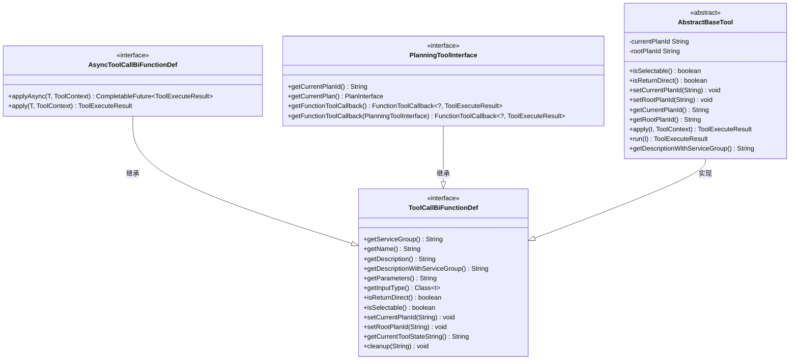
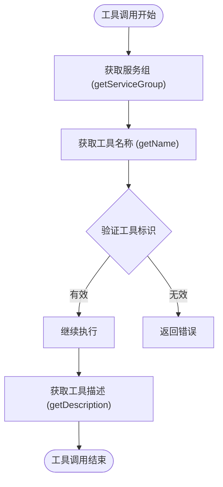
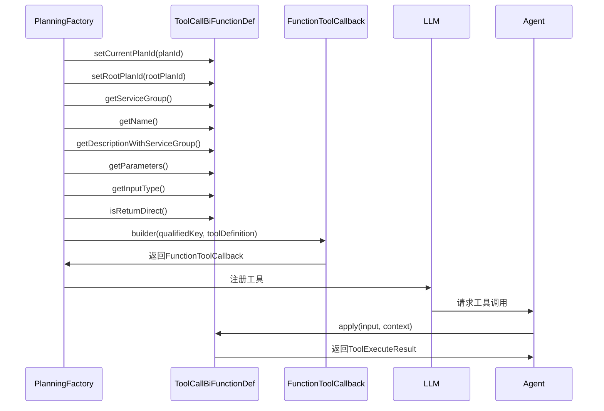

# 工具调用契约

<cite>
**本文档引用的文件**  
- [ToolCallBiFunctionDef.java](file://src/main/java/com/alibaba/cloud/ai/lynxe/tool/ToolCallBiFunctionDef.java)
- [AsyncToolCallBiFunctionDef.java](file://src/main/java/com/alibaba/cloud/ai/lynxe/tool/AsyncToolCallBiFunctionDef.java)
- [PlanningToolInterface.java](file://src/main/java/com/alibaba/cloud/ai/lynxe/tool/PlanningToolInterface.java)
- [AbstractBaseTool.java](file://src/main/java/com/alibaba/cloud/ai/lynxe/tool/AbstractBaseTool.java)
- [ToolExecuteResult.java](file://src/main/java/com/alibaba/cloud/ai/lynxe/tool/code/ToolExecuteResult.java)
- [PlanningFactory.java](file://src/main/java/com/alibaba/cloud/ai/lynxe/planning/PlanningFactory.java)
</cite>

## 目录
1. [引言](#引言)
2. [核心契约接口](#核心契约接口)
3. [元数据方法规范](#元数据方法规范)
4. [参数定义与验证](#参数定义与验证)
5. [执行控制与上下文传递](#执行控制与上下文传递)
6. [规划集成接口](#规划集成接口)
7. [异步执行支持](#异步执行支持)
8. [实现基类分析](#实现基类分析)
9. [工具注册与调用流程](#工具注册与调用流程)
10. [返回结果结构](#返回结果结构)

## 引言
本文档详细解析了JManus系统中工具调用的标准化契约，重点阐述了`ToolCallBiFunctionDef`接口定义的工具契约规范。该契约为系统中的所有工具提供了统一的定义方法，确保了工具与AI代理之间的标准化交互。文档将深入分析接口的各个组成部分，包括元数据方法、参数定义、执行控制以及与规划系统的深度集成机制。

## 核心契约接口
`ToolCallBiFunctionDef`接口是所有工具定义的核心契约，它继承自Java的`BiFunction`接口，定义了工具的基本行为和元数据。该接口通过泛型<I>指定工具的输入类型，并统一返回`ToolExecuteResult`对象作为执行结果。

**图示来源**
- [ToolCallBiFunctionDef.java](file://src/main/java/com/alibaba/cloud/ai/lynxe/tool/ToolCallBiFunctionDef.java)
- [AsyncToolCallBiFunctionDef.java](file://src/main/java/com/alibaba/cloud/ai/lynxe/tool/AsyncToolCallBiFunctionDef.java)
- [PlanningToolInterface.java](file://src/main/java/com/alibaba/cloud/ai/lynxe/tool/PlanningToolInterface.java)
- [AbstractBaseTool.java](file://src/main/java/com/alibaba/cloud/ai/lynxe/tool/AbstractBaseTool.java)

## 元数据方法规范
`ToolCallBiFunctionDef`接口定义了一系列元数据方法，用于描述工具的基本信息和功能特性。

### 服务组与名称
`getServiceGroup()`和`getName()`方法共同构成了工具的唯一标识。服务组用于对功能相关的工具进行分组管理，而名称则是工具在系统中的唯一标识符。

**图示来源**
- [ToolCallBiFunctionDef.java](file://src/main/java/com/alibaba/cloud/ai/lynxe/tool/ToolCallBiFunctionDef.java#L35-L41)

### 功能描述
`getDescription()`方法提供了工具的功能描述，用于向AI代理和用户说明工具的用途。`getDescriptionWithServiceGroup()`方法则在基础描述后附加服务组信息，提供更完整的上下文。

**本节来源**
- [ToolCallBiFunctionDef.java](file://src/main/java/com/alibaba/cloud/ai/lynxe/tool/ToolCallBiFunctionDef.java#L47-L54)

## 参数定义与验证
工具的参数定义通过`getParameters()`方法返回JSON Schema格式的参数定义，确保了输入参数的结构化和可验证性。

### JSON Schema格式要求
`getParameters()`方法返回的JSON Schema必须遵循特定的格式规范，包括参数名称、类型、是否必需等信息。这种标准化的参数定义使得AI代理能够准确理解工具的输入需求。

### 输入验证机制
系统利用JSON Schema对输入参数进行自动验证，确保传入工具的数据符合预期格式。这不仅提高了系统的健壮性，还减少了因参数错误导致的执行失败。

**本节来源**
- [ToolCallBiFunctionDef.java](file://src/main/java/com/alibaba/cloud/ai/lynxe/tool/ToolCallBiFunctionDef.java#L60-L66)

## 执行控制与上下文传递
工具执行过程中的控制和上下文管理是确保复杂任务正确执行的关键。

### 直接返回控制
`isReturnDirect()`方法决定了工具执行结果是否直接返回给调用者。当设置为`true`时，工具结果将立即返回，不经过额外的处理；当设置为`false`时，结果可能需要进一步的处理或组合。

### 执行上下文传递
`setCurrentPlanId()`和`setRootPlanId()`方法用于在工具执行过程中传递执行上下文。当前计划ID标识了当前正在执行的具体任务，而根计划ID则标识了整个执行计划的顶层任务，这对于追踪和管理复杂的嵌套执行流程至关重要。

**本节来源**
- [ToolCallBiFunctionDef.java](file://src/main/java/com/alibaba/cloud/ai/lynxe/tool/ToolCallBiFunctionDef.java#L72-L90)

## 规划集成接口
`PlanningToolInterface`接口定义了工具与AI代理规划系统的深度集成能力。

### 当前计划获取
`getCurrentPlan()`方法允许工具访问当前的执行计划，使其能够根据整体规划调整自身行为。这对于需要了解上下文环境的智能工具尤为重要。

### 函数工具回调
`getFunctionToolCallback()`方法提供了与LLM集成的回调机制，使得工具能够参与AI代理的决策过程。通过这个回调，工具可以接收来自AI代理的调用请求，并返回执行结果。

**本节来源**
- [PlanningToolInterface.java](file://src/main/java/com/alibaba/cloud/ai/lynxe/tool/PlanningToolInterface.java#L32-L51)

## 异步执行支持
`AsyncToolCallBiFunctionDef`接口扩展了基础工具契约，支持非阻塞的异步执行。

### 异步执行方法
`applyAsync()`方法返回一个`CompletableFuture<ToolExecuteResult>`，允许工具在后台线程中执行，避免阻塞主线程。这对于执行时间较长的操作（如网络请求、文件处理等）尤为重要。

### 同步兼容性
接口提供了`apply()`方法的默认实现，通过`join()`方法将异步结果转换为同步返回，确保了与现有同步代码的兼容性。

**本节来源**
- [AsyncToolCallBiFunctionDef.java](file://src/main/java/com/alibaba/cloud/ai/lynxe/tool/AsyncToolCallBiFunctionDef.java#L41-L54)

## 实现基类分析
`AbstractBaseTool`类为所有工具实现提供了基础功能和默认行为。

### 基础功能实现
该基类实现了`currentPlanId`和`rootPlanId`的存储，以及`setCurrentPlanId()`和`setRootPlanId()`方法的具体实现，简化了子类的开发。

### 默认行为
基类提供了`isReturnDirect()`的默认实现（返回`false`）和`getDescriptionWithServiceGroup()`的默认实现，确保了工具行为的一致性。

**本节来源**
- [AbstractBaseTool.java](file://src/main/java/com/alibaba/cloud/ai/lynxe/tool/AbstractBaseTool.java#L33-L111)

## 工具注册与调用流程
工具的注册和调用流程涉及多个组件的协同工作。

**图示来源**
- [PlanningFactory.java](file://src/main/java/com/alibaba/cloud/ai/lynxe/planning/PlanningFactory.java#L318-L348)

## 返回结果结构
工具执行结果通过`ToolExecuteResult`类进行封装，确保了结果的一致性和可处理性。

### 结构组成
`ToolExecuteResult`包含两个主要字段：`output`（执行输出内容）和`interrupted`（是否被中断）。这种简单的结构设计使得结果处理更加高效。

### 使用示例
工具在执行完成后创建`ToolExecuteResult`实例，将执行结果封装其中，并返回给调用者。AI代理根据返回结果决定后续的执行流程。

**本节来源**
- [ToolExecuteResult.java](file://src/main/java/com/alibaba/cloud/ai/lynxe/tool/code/ToolExecuteResult.java#L18-L59)