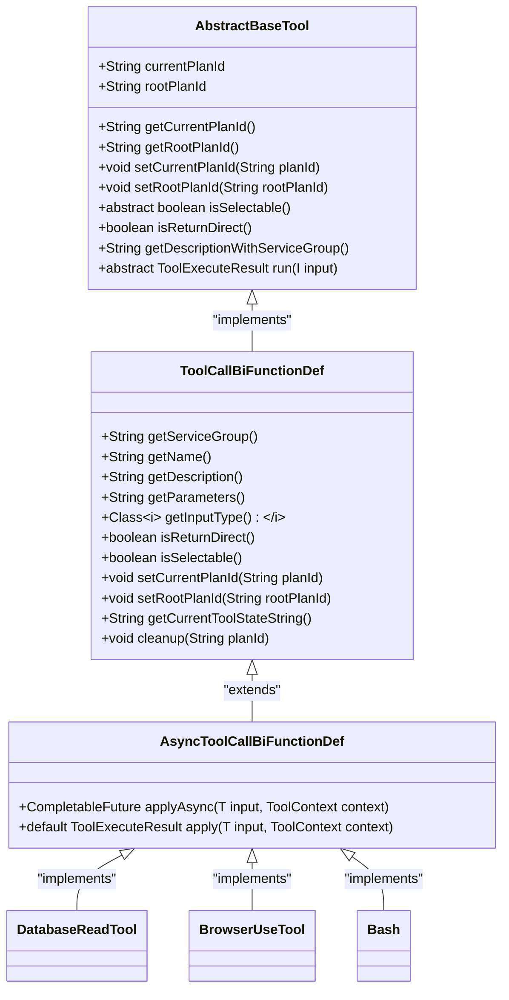
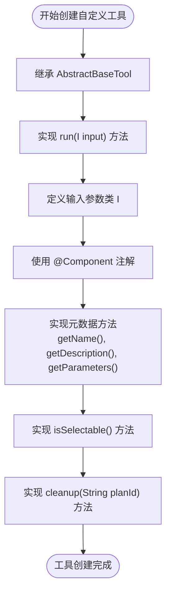
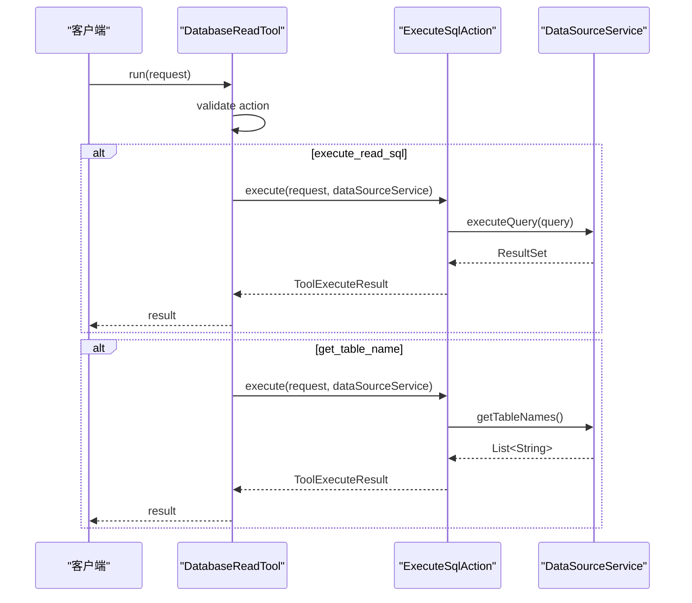
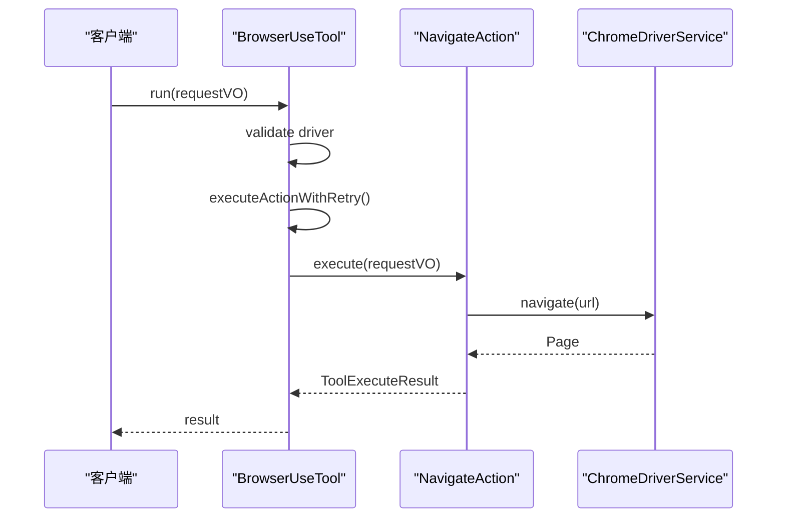
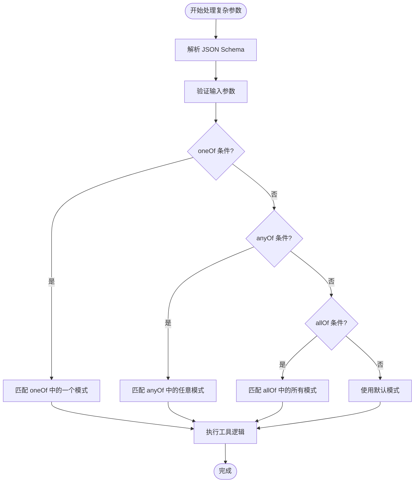

# 自定义工具开发指南

<cite>
**本文档中引用的文件**
- [AbstractBaseTool.java](file://src/main/java/com/alibaba/cloud/ai/lynxe/tool/AbstractBaseTool.java)
- [ToolCallBiFunctionDef.java](file://src/main/java/com/alibaba/cloud/ai/lynxe/tool/ToolCallBiFunctionDef.java)
- [AsyncToolCallBiFunctionDef.java](file://src/main/java/com/alibaba/cloud/ai/lynxe/tool/AsyncToolCallBiFunctionDef.java)
- [DatabaseReadTool.java](file://src/main/java/com/alibaba/cloud/ai/lynxe/tool/database/DatabaseReadTool.java)
- [BrowserUseTool.java](file://src/main/java/com/alibaba/cloud/ai/lynxe/tool/browser/BrowserUseTool.java)
- [Bash.java](file://src/main/java/com/alibaba/cloud/ai/lynxe/tool/bash/Bash.java)
- [ToolI18nService.java](file://src/main/java/com/alibaba/cloud/ai/lynxe/tool/i18n/ToolI18nService.java)
- [database-read-tool-zh.yml](file://src/main/resources/i18n/tools/database-read-tool-zh.yml)
- [browser-use-tool-zh.yml](file://src/main/resources/i18n/tools/browser-use-tool-zh.yml)
- [application.yml](file://src/main/resources/application.yml)
- [ToolController.java](file://src/main/java/com/alibaba/cloud/ai/lynxe/tool/controller/ToolController.java)
</cite>

## 目录
1. [引言](#引言)
2. [核心架构与基础类](#核心架构与基础类)
3. [创建自定义工具的步骤](#创建自定义工具的步骤)
4. [数据库工具开发示例](#数据库工具开发示例)
5. [浏览器自动化工具开发示例](#浏览器自动化工具开发示例)
6. [异步执行与复杂参数处理](#异步执行与复杂参数处理)
7. [多语言支持实现](#多语言支持实现)
8. [UI可见性控制](#ui可见性控制)
9. [常见错误排查](#常见错误排查)
10. [最佳实践总结](#最佳实践总结)

## 引言
本文档旨在为开发者提供一个从零开始创建自定义工具的完整指南。通过深入分析代码库中的核心组件和现有工具实现，我们将详细介绍如何继承`AbstractBaseTool`类、实现`run()`方法、定义输入参数类，并通过`@Service`注解将工具注册为Spring Bean。文档还将阐述如何配置工具的名称、描述和参数，以及如何使用i18n资源文件实现多语言支持。通过数据库工具和浏览器自动化工具的完整开发示例，我们将展示复杂参数处理和异步执行的最佳实践。最后，文档将提供一个常见错误排查清单，帮助开发者解决参数验证失败、执行超时等问题。

## 核心架构与基础类
在本系统中，所有自定义工具都基于一个统一的架构模式。核心是`AbstractBaseTool`抽象类，它实现了`ToolCallBiFunctionDef`接口，为所有工具提供了共同的功能和契约。



**图示来源**
- [AbstractBaseTool.java](file://src/main/java/com/alibaba/cloud/ai/lynxe/tool/AbstractBaseTool.java#L28-L111)
- [ToolCallBiFunctionDef.java](file://src/main/java/com/alibaba/cloud/ai/lynxe/tool/ToolCallBiFunctionDef.java#L29-L104)
- [AsyncToolCallBiFunctionDef.java](file://src/main/java/com/alibaba/cloud/ai/lynxe/tool/AsyncToolCallBiFunctionDef.java#L32-L57)

**本节来源**
- [AbstractBaseTool.java](file://src/main/java/com/alibaba/cloud/ai/lynxe/tool/AbstractBaseTool.java)
- [ToolCallBiFunctionDef.java](file://src/main/java/com/alibaba/cloud/ai/lynxe/tool/ToolCallBiFunctionDef.java)
- [AsyncToolCallBiFunctionDef.java](file://src/main/java/com/alibaba/cloud/ai/lynxe/tool/AsyncToolCallBiFunctionDef.java)

## 创建自定义工具的步骤
创建一个自定义工具需要遵循一系列明确的步骤。首先，您需要创建一个新的Java类，该类继承自`AbstractBaseTool`并指定其输入参数类型。然后，您必须实现`run()`方法来定义工具的具体执行逻辑。

### 继承AbstractBaseTool
所有自定义工具都应继承`AbstractBaseTool`类。这个基类提供了工具执行上下文（如`currentPlanId`和`rootPlanId`）以及一些默认实现。通过继承，您可以专注于业务逻辑的实现，而不必担心底层的基础设施。

### 实现run()方法
`run()`方法是工具的核心，它定义了工具的具体行为。此方法接收一个输入参数对象，并返回一个`ToolExecuteResult`对象，该对象包含了执行结果。在实现`run()`方法时，您应该包含适当的错误处理和日志记录。

### 定义输入参数类
每个工具都需要一个专门的输入参数类来定义其期望的输入。这个类通常包含一组字段，每个字段对应一个参数。例如，`DatabaseRequest`类定义了数据库操作所需的参数，如`action`、`query`和`datasourceName`。

### 通过@Service注解注册为Spring Bean
为了使工具能够被系统发现和使用，必须使用`@Component`注解将其注册为Spring Bean。这使得Spring容器能够管理该工具的生命周期，并在需要时将其注入到其他组件中。

### 配置工具的name、description和parameters
工具的`name`、`description`和`parameters`是其元数据的重要组成部分。`name`是工具的唯一标识符，`description`提供了工具功能的简要说明，而`parameters`则定义了工具接受的参数结构。这些信息通常通过i18n资源文件进行配置，以支持多语言。



**本节来源**
- [AbstractBaseTool.java](file://src/main/java/com/alibaba/cloud/ai/lynxe/tool/AbstractBaseTool.java)
- [ToolCallBiFunctionDef.java](file://src/main/java/com/alibaba/cloud/ai/lynxe/tool/ToolCallBiFunctionDef.java)

## 数据库工具开发示例
`DatabaseReadTool`是一个典型的数据库工具示例，它展示了如何实现一个支持多种数据库操作的工具。该工具允许执行SELECT查询、获取表名以及将查询结果保存到JSON文件。

### 工具元数据配置
`DatabaseReadTool`通过`ToolI18nService`从i18n资源文件中加载其描述和参数定义。这使得工具的元数据可以轻松地进行多语言支持。

```java
@Override
public String getDescription() {
    return toolI18nService.getDescription("database-read-tool");
}

@Override
public String getParameters() {
    return toolI18nService.getParameters("database-read-tool");
}
```

### 复杂参数处理
该工具支持三种不同的操作：`execute_read_sql`、`get_table_name`和`execute_read_sql_to_json_file`。每种操作都有其特定的参数要求。例如，`execute_read_sql_to_json_file`操作需要`query`和`fileName`参数。

```yaml
# database-read-tool-zh.yml
parameters: |
  {
    "type": "object",
    "oneOf": [
      {
        "type": "object",
        "properties": {
          "action": { "type": "string", "const": "execute_read_sql" },
          "query": { "type": "string", "description": "要执行的 SELECT 查询语句（只读）" },
          "datasourceName": { "type": "string", "description": "数据源名称，可选" }
        },
        "required": ["action", "query"],
        "additionalProperties": false
      },
      ...
    ]
  }
```

### 执行逻辑
`run()`方法根据`action`参数的值来决定执行哪种操作。它使用策略模式，通过不同的`Action`类来处理每种操作。例如，`ExecuteSqlAction`负责执行SQL查询，而`GetTableNameAction`负责根据表注释查找表名。



**图示来源**
- [DatabaseReadTool.java](file://src/main/java/com/alibaba/cloud/ai/lynxe/tool/database/DatabaseReadTool.java#L87-L119)
- [database-read-tool-zh.yml](file://src/main/resources/i18n/tools/database-read-tool-zh.yml)

**本节来源**
- [DatabaseReadTool.java](file://src/main/java/com/alibaba/cloud/ai/lynxe/tool/database/DatabaseReadTool.java)
- [database-read-tool-zh.yml](file://src/main/resources/i18n/tools/database-read-tool-zh.yml)

## 浏览器自动化工具开发示例
`BrowserUseTool`是一个功能强大的浏览器自动化工具，它允许与Web浏览器进行交互，执行导航、元素点击、文本输入等操作。

### 工具元数据配置
与数据库工具类似，`BrowserUseTool`也使用`ToolI18nService`来加载其描述和参数定义。

```java
@Override
public String getDescription() {
    return toolI18nService.getDescription("browser-use-tool");
}

@Override
public String getParameters() {
    return toolI18nService.getParameters("browser-use-tool");
}
```

### 复杂参数处理
该工具支持多种操作，如`navigate`、`click`、`input_text`等。每种操作都有其特定的参数。例如，`click`操作需要`index`参数来指定要点击的元素。

```yaml
# browser-use-tool-zh.yml
parameters: |
  {
    "type": "object",
    "oneOf": [
      {
        "type": "object",
        "properties": {
          "action": { "type": "string", "const": "navigate" },
          "url": { "type": "string", "description": "要导航到的 URL" }
        },
        "required": ["action", "url"],
        "additionalProperties": false
      },
      {
        "type": "object",
        "properties": {
          "action": { "type": "string", "const": "click" },
          "index": { "type": "integer", "description": "要点击的元素索引" }
        },
        "required": ["action", "index"],
        "additionalProperties": false
      },
      ...
    ]
  }
```

### 执行逻辑
`run()`方法根据`action`参数的值来决定执行哪种操作。它使用`executeActionWithRetry`方法来执行操作，并在发生超时或Playwright异常时进行重试。



**图示来源**
- [BrowserUseTool.java](file://src/main/java/com/alibaba/cloud/ai/lynxe/tool/browser/BrowserUseTool.java#L124-L250)
- [browser-use-tool-zh.yml](file://src/main/resources/i18n/tools/browser-use-tool-zh.yml)

**本节来源**
- [BrowserUseTool.java](file://src/main/java/com/alibaba/cloud/ai/lynxe/tool/browser/BrowserUseTool.java)
- [browser-use-tool-zh.yml](file://src/main/resources/i18n/tools/browser-use-tool-zh.yml)

## 异步执行与复杂参数处理
对于需要长时间运行或可能阻塞的工具，系统提供了`AsyncToolCallBiFunctionDef`接口来支持异步执行。这可以防止线程池耗尽，并提高系统的整体性能。

### 异步执行
`AsyncToolCallBiFunctionDef`接口扩展了`ToolCallBiFunctionDef`，并添加了一个`applyAsync`方法，该方法返回一个`CompletableFuture<ToolExecuteResult>`。这允许工具在不阻塞调用线程的情况下执行。

```java
public interface AsyncToolCallBiFunctionDef<T> extends ToolCallBiFunctionDef<T> {
    CompletableFuture<ToolExecuteResult> applyAsync(T input, ToolContext context);
    
    @Override
    default ToolExecuteResult apply(T input, ToolContext context) {
        return applyAsync(input, context).join();
    }
}
```

### 复杂参数处理
工具的参数定义使用JSON Schema来描述。这允许定义复杂的参数结构，包括`oneOf`、`anyOf`和`allOf`等关键字。例如，`DatabaseReadTool`的参数定义使用`oneOf`来指定三种不同的操作模式。



**本节来源**
- [AsyncToolCallBiFunctionDef.java](file://src/main/java/com/alibaba/cloud/ai/lynxe/tool/AsyncToolCallBiFunctionDef.java)
- [database-read-tool-zh.yml](file://src/main/resources/i18n/tools/database-read-tool-zh.yml)
- [browser-use-tool-zh.yml](file://src/main/resources/i18n/tools/browser-use-tool-zh.yml)

## 多语言支持实现
系统通过i18n资源文件实现了多语言支持。每个工具都有一个对应的YAML文件，其中包含了该工具的描述和参数定义。

### i18n资源文件
i18n资源文件位于`src/main/resources/i18n/tools/`目录下。每个文件的命名遵循`{tool-name}-{language}.yml`的模式。例如，`database-read-tool-zh.yml`包含了数据库读取工具的中文描述和参数定义。

```yaml
# database-read-tool-zh.yml
description: |
  读取和查询数据库信息，执行 SELECT 查询，并查找表名。
  在需要以下操作时使用此工具：
  - 'execute_read_sql': 执行 SELECT 查询（仅只读操作）
  - 'get_table_name': 根据表注释查找表名
  - 'execute_read_sql_to_json_file': 执行 SELECT 查询并将结果保存到 JSON 文件

  重要提示：查询 NULL 值时，请显式使用 NULL 关键字（例如，WHERE email IS NULL）。
```

### ToolI18nService
`ToolI18nService`类负责加载和管理i18n资源文件。它提供了`getDescription`和`getParameters`方法，用于从资源文件中获取工具的描述和参数定义。

```java
@Service
public class ToolI18nService {
    public String getDescription(String toolName) {
        // 从资源文件中加载描述
    }
    
    public String getParameters(String toolName) {
        // 从资源文件中加载参数定义
    }
}
```

**本节来源**
- [ToolI18nService.java](file://src/main/java/com/alibaba/cloud/ai/lynxe/tool/i18n/ToolI18nService.java)
- [database-read-tool-zh.yml](file://src/main/resources/i18n/tools/database-read-tool-zh.yml)
- [browser-use-tool-zh.yml](file://src/main/resources/i18n/tools/browser-use-tool-zh.yml)

## UI可见性控制
工具的UI可见性由`isSelectable()`方法控制。如果该方法返回`true`，则该工具将在前端UI中可见并可被选择；如果返回`false`，则该工具将不可见。

### isSelectable()方法
`isSelectable()`方法是一个抽象方法，必须在每个工具类中实现。它通常基于工具的配置或状态来决定是否应该在UI中显示。

```java
@Override
public boolean isSelectable() {
    return true;
}
```

### 工具注册与发现
`ToolController`负责向前端提供可用工具的列表。它通过`PlanningFactory`获取所有工具的`ToolCallBackContext`，然后将这些工具转换为前端可用的格式。

```java
@GetMapping
public ResponseEntity<List<Tool>> getAvailableTools() {
    Map<String, ToolCallBackContext> toolCallbackContext = planningFactory.toolCallbackMap(uuid, uuid, expectedReturnInfo);
    
    List<Tool> tools = toolCallbackContext.entrySet().stream().map(entry -> {
        Tool tool = new Tool();
        ToolCallBiFunctionDef<?> functionInstance = entry.getValue().getFunctionInstance();
        tool.setSelectable(functionInstance.isSelectable());
        return tool;
    }).collect(Collectors.toList());
    
    return ResponseEntity.ok(tools);
}
```

**本节来源**
- [AbstractBaseTool.java](file://src/main/java/com/alibaba/cloud/ai/lynxe/tool/AbstractBaseTool.java#L44-L44)
- [ToolController.java](file://src/main/java/com/alibaba/cloud/ai/lynxe/tool/controller/ToolController.java#L58-L93)

## 常见错误排查
在开发和使用自定义工具时，可能会遇到一些常见问题。以下是一些常见错误及其解决方案。

### 参数验证失败
**问题**：工具执行时报告参数验证失败。
**解决方案**：检查工具的`parameters`定义，确保输入参数符合JSON Schema的要求。使用`oneOf`、`required`等关键字来明确指定参数的约束。

### 执行超时
**问题**：工具执行超时。
**解决方案**：检查工具的执行逻辑，确保没有无限循环或长时间阻塞的操作。对于可能耗时的操作，考虑使用异步执行。

### 资源清理失败
**问题**：工具执行后，相关资源未被正确清理。
**解决方案**：确保在`cleanup(String planId)`方法中正确释放所有资源。例如，`BrowserUseTool`在`cleanup`方法中关闭了浏览器驱动。

### 多语言支持问题
**问题**：工具的描述或参数定义未正确显示为所需语言。
**解决方案**：检查i18n资源文件的命名和位置，确保文件名与工具名匹配，并且位于正确的目录下。

**本节来源**
- [DatabaseReadTool.java](file://src/main/java/com/alibaba/cloud/ai/lynxe/tool/database/DatabaseReadTool.java)
- [BrowserUseTool.java](file://src/main/java/com/alibaba/cloud/ai/lynxe/tool/browser/BrowserUseTool.java)
- [application.yml](file://src/main/resources/application.yml)

## 最佳实践总结
1. **继承`AbstractBaseTool`**：始终从`AbstractBaseTool`继承，以利用其提供的公共功能。
2. **实现`run()`方法**：在`run()`方法中实现核心业务逻辑，并包含适当的错误处理。
3. **使用`@Component`注解**：使用`@Component`注解将工具注册为Spring Bean。
4. **配置元数据**：通过`getDescription()`和`getParameters()`方法配置工具的描述和参数。
5. **实现`isSelectable()`**：根据需要实现`isSelectable()`方法，以控制工具在UI中的可见性。
6. **实现`cleanup()`**：在`cleanup()`方法中释放所有资源，防止资源泄漏。
7. **使用i18n**：通过i18n资源文件实现多语言支持。
8. **考虑异步执行**：对于可能阻塞的操作，考虑实现`AsyncToolCallBiFunctionDef`接口。

**本节来源**
- [AbstractBaseTool.java](file://src/main/java/com/alibaba/cloud/ai/lynxe/tool/AbstractBaseTool.java)
- [ToolCallBiFunctionDef.java](file://src/main/java/com/alibaba/cloud/ai/lynxe/tool/ToolCallBiFunctionDef.java)
- [AsyncToolCallBiFunctionDef.java](file://src/main/java/com/alibaba/cloud/ai/lynxe/tool/AsyncToolCallBiFunctionDef.java)