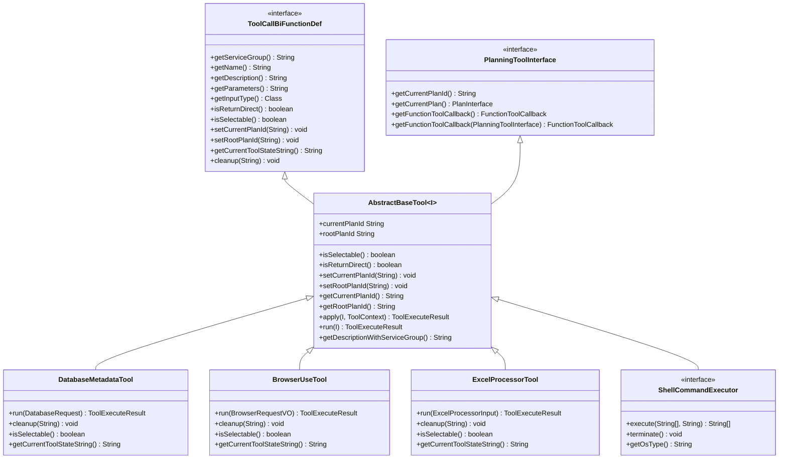
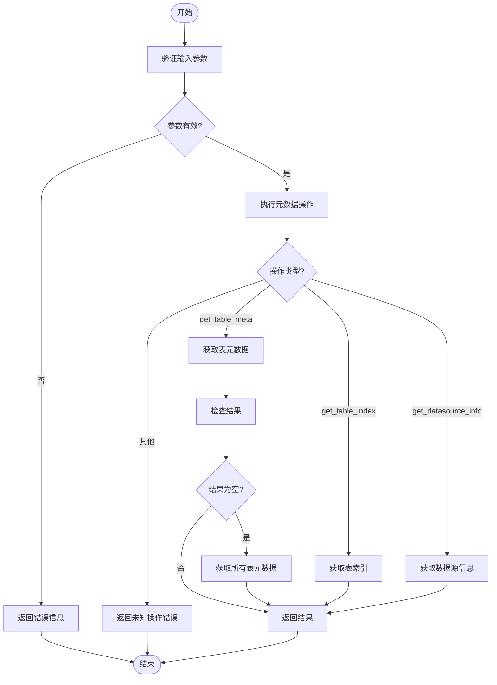
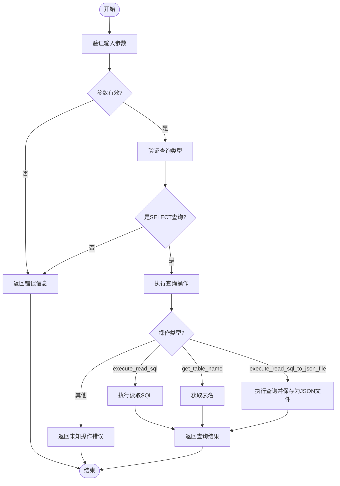
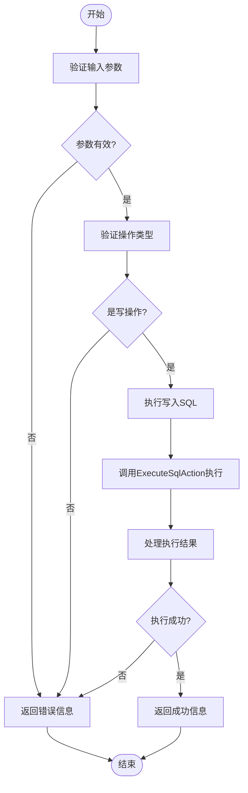
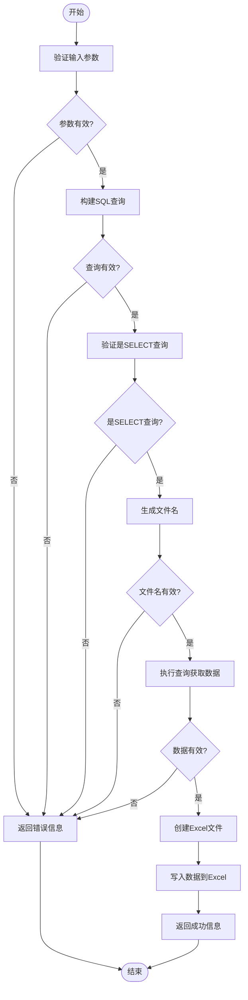
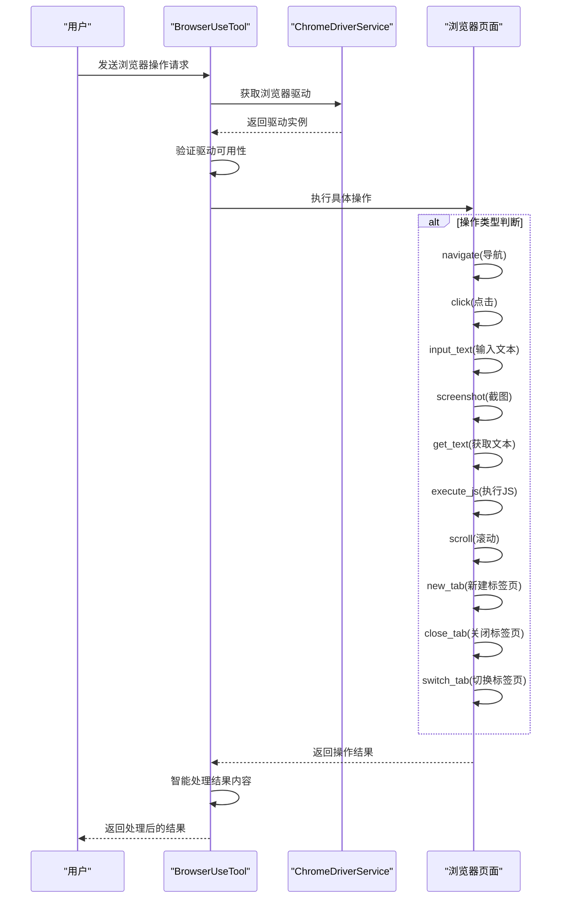
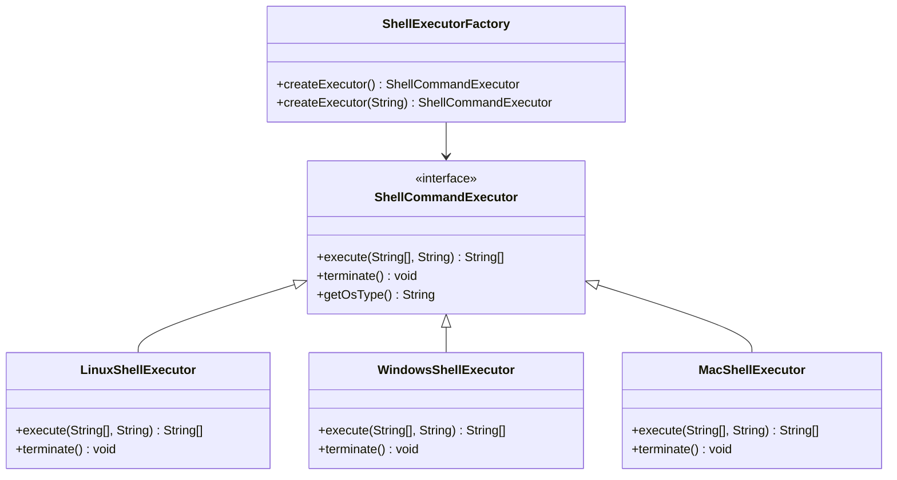
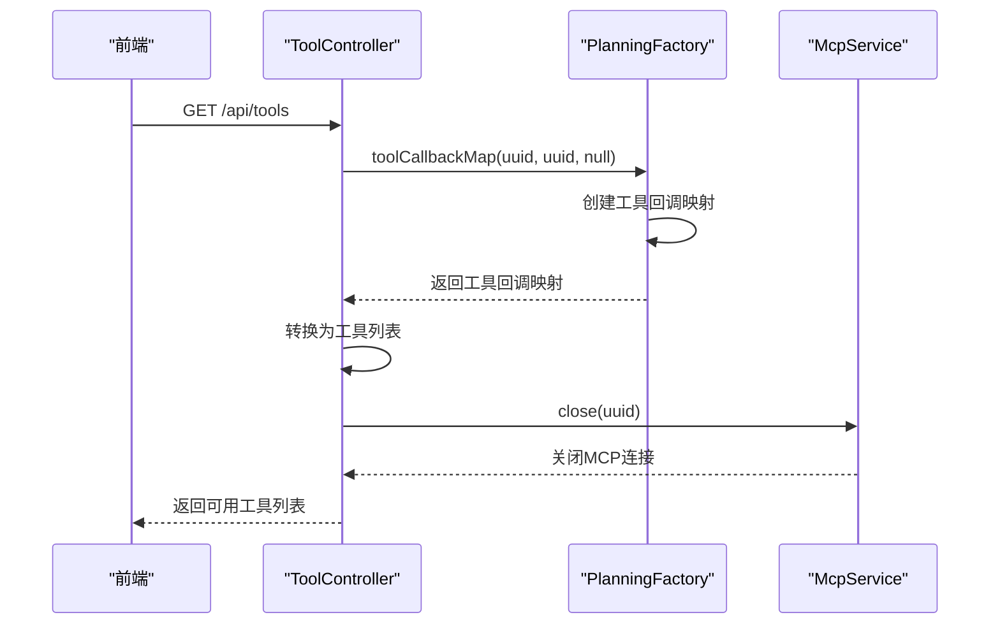
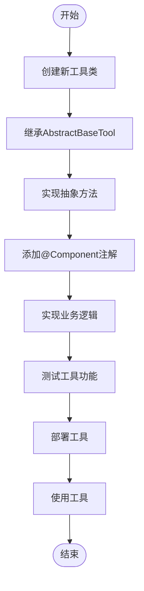

# 工具模块

<cite>
**本文档引用的文件**   
- [AbstractBaseTool.java](file://src/main/java/com/alibaba/cloud/ai/lynxe/tool/AbstractBaseTool.java)
- [ToolCallBiFunctionDef.java](file://src/main/java/com/alibaba/cloud/ai/lynxe/tool/ToolCallBiFunctionDef.java)
- [PlanningToolInterface.java](file://src/main/java/com/alibaba/cloud/ai/lynxe/tool/PlanningToolInterface.java)
- [DatabaseMetadataTool.java](file://src/main/java/com/alibaba/cloud/ai/lynxe/tool/database/DatabaseMetadataTool.java)
- [DatabaseReadTool.java](file://src/main/java/com/alibaba/cloud/ai/lynxe/tool/database/DatabaseReadTool.java)
- [DatabaseWriteTool.java](file://src/main/java/com/alibaba/cloud/ai/lynxe/tool/database/DatabaseWriteTool.java)
- [DatabaseTableToExcelTool.java](file://src/main/java/com/alibaba/cloud/ai/lynxe/tool/database/DatabaseTableToExcelTool.java)
- [BrowserUseTool.java](file://src/main/java/com/alibaba/cloud/ai/lynxe/tool/browser/BrowserUseTool.java)
- [ExcelProcessingService.java](file://src/main/java/com/alibaba/cloud/ai/lynxe/tool/excelProcessor/ExcelProcessingService.java)
- [ShellCommandExecutor.java](file://src/main/java/com/alibaba/cloud/ai/lynxe/tool/bash/ShellCommandExecutor.java)
- [ToolController.java](file://src/main/java/com/alibaba/cloud/ai/lynxe/tool/controller/ToolController.java)
</cite>

## 目录
1. [系统架构概述](#系统架构概述)
2. [工具继承体系](#工具继承体系)
3. [数据库工具](#数据库工具)
4. [浏览器自动化工具](#浏览器自动化工具)
5. [文件处理工具](#文件处理工具)
6. [脚本执行工具](#脚本执行工具)
7. [工具注册与调用机制](#工具注册与调用机制)
8. [工具扩展开发指南](#工具扩展开发指南)
9. [权限管理与安全机制](#权限管理与安全机制)
10. [使用示例与最佳实践](#使用示例与最佳实践)

## 系统架构概述

工具模块是JManus系统的核心功能组件，提供了一套完整的工具生态系统，支持数据库操作、浏览器自动化、文件处理和脚本执行等多种功能。系统采用分层架构设计，通过统一的接口规范和继承体系，实现了工具的可扩展性和可维护性。

工具模块的主要架构特点包括：
- 基于`AbstractBaseTool`的继承体系，确保所有工具具有一致的接口和行为
- 通过`ToolCallBiFunctionDef`接口定义工具的标准行为和属性
- 使用`PlanningToolInterface`提供与规划系统的集成能力
- 支持工具的动态注册、发现和调用
- 实现了完善的权限管理和安全沙箱机制

**Section sources**
- [AbstractBaseTool.java](file://src/main/java/com/alibaba/cloud/ai/lynxe/tool/AbstractBaseTool.java)
- [ToolCallBiFunctionDef.java](file://src/main/java/com/alibaba/cloud/ai/lynxe/tool/ToolCallBiFunctionDef.java)
- [PlanningToolInterface.java](file://src/main/java/com/alibaba/cloud/ai/lynxe/tool/PlanningToolInterface.java)

## 工具继承体系

工具模块的核心是基于`AbstractBaseTool`的继承体系，所有具体工具实现都继承自这个抽象基类。这种设计模式确保了工具的一致性和可扩展性。



**Diagram sources**
- [AbstractBaseTool.java](file://src/main/java/com/alibaba/cloud/ai/lynxe/tool/AbstractBaseTool.java)
- [ToolCallBiFunctionDef.java](file://src/main/java/com/alibaba/cloud/ai/lynxe/tool/ToolCallBiFunctionDef.java)
- [PlanningToolInterface.java](file://src/main/java/com/alibaba/cloud/ai/lynxe/tool/PlanningToolInterface.java)

**Section sources**
- [AbstractBaseTool.java](file://src/main/java/com/alibaba/cloud/ai/lynxe/tool/AbstractBaseTool.java)
- [ToolCallBiFunctionDef.java](file://src/main/java/com/alibaba/cloud/ai/lynxe/tool/ToolCallBiFunctionDef.java)
- [PlanningToolInterface.java](file://src/main/java/com/alibaba/cloud/ai/lynxe/tool/PlanningToolInterface.java)

## 数据库工具

数据库工具提供了完整的数据库操作能力，包括元数据查询、数据读取、数据写入和数据导出等功能。这些工具通过统一的接口和安全机制，确保数据库操作的安全性和可靠性。

### DatabaseMetadataTool

`DatabaseMetadataTool`用于查询数据库的元数据信息，支持获取表结构、索引信息和数据源配置等。



**Diagram sources**
- [DatabaseMetadataTool.java](file://src/main/java/com/alibaba/cloud/ai/lynxe/tool/database/DatabaseMetadataTool.java)

### DatabaseReadTool

`DatabaseReadTool`用于执行数据库读取操作，支持执行SELECT查询和获取表名列表。



**Diagram sources**
- [DatabaseReadTool.java](file://src/main/java/com/alibaba/cloud/ai/lynxe/tool/database/DatabaseReadTool.java)

### DatabaseWriteTool

`DatabaseWriteTool`用于执行数据库写入操作，支持执行INSERT、UPDATE、DELETE等写操作。



**Diagram sources**
- [DatabaseWriteTool.java](file://src/main/java/com/alibaba/cloud/ai/lynxe/tool/database/DatabaseWriteTool.java)

### DatabaseTableToExcelTool

`DatabaseTableToExcelTool`用于将数据库表数据导出到Excel文件，支持通过表名或自定义SQL查询导出数据。



**Diagram sources**
- [DatabaseTableToExcelTool.java](file://src/main/java/com/alibaba/cloud/ai/lynxe/tool/database/DatabaseTableToExcelTool.java)

**Section sources**
- [DatabaseMetadataTool.java](file://src/main/java/com/alibaba/cloud/ai/lynxe/tool/database/DatabaseMetadataTool.java)
- [DatabaseReadTool.java](file://src/main/java/com/alibaba/cloud/ai/lynxe/tool/database/DatabaseReadTool.java)
- [DatabaseWriteTool.java](file://src/main/java/com/alibaba/cloud/ai/lynxe/tool/database/DatabaseWriteTool.java)
- [DatabaseTableToExcelTool.java](file://src/main/java/com/alibaba/cloud/ai/lynxe/tool/database/DatabaseTableToExcelTool.java)

## 浏览器自动化工具

`BrowserUseTool`提供了完整的浏览器自动化能力，支持页面导航、元素交互、内容提取和截图等功能。



**Diagram sources**
- [BrowserUseTool.java](file://src/main/java/com/alibaba/cloud/ai/lynxe/tool/browser/BrowserUseTool.java)

**Section sources**
- [BrowserUseTool.java](file://src/main/java/com/alibaba/cloud/ai/lynxe/tool/browser/BrowserUseTool.java)

## 文件处理工具

文件处理工具提供了强大的Excel文件处理能力，通过`ExcelProcessingService`和`ExcelProcessorTool`实现。

### ExcelProcessingService

`ExcelProcessingService`是Excel处理的核心服务，提供了创建、读取、写入和转换Excel文件的功能。


**Diagram sources**
- [ExcelProcessingService.java](file://src/main/java/com/alibaba/cloud/ai/lynxe/tool/excelProcessor/ExcelProcessingService.java)

**Section sources**
- [ExcelProcessingService.java](file://src/main/java/com/alibaba/cloud/ai/lynxe/tool/excelProcessor/ExcelProcessingService.java)

## 脚本执行工具

脚本执行工具提供了跨平台的命令行执行能力，支持Windows、Linux和Mac系统。

### ShellCommandExecutor

`ShellCommandExecutor`是脚本执行的核心接口，通过工厂模式创建不同操作系统的执行器实例。



**Diagram sources**
- [ShellCommandExecutor.java](file://src/main/java/com/alibaba/cloud/ai/lynxe/tool/bash/ShellCommandExecutor.java)

**Section sources**
- [ShellCommandExecutor.java](file://src/main/java/com/alibaba/cloud/ai/lynxe/tool/bash/ShellCommandExecutor.java)

## 工具注册与调用机制

工具模块通过`ToolController`和`PlanningFactory`实现工具的注册、发现和调用。



**Diagram sources**
- [ToolController.java](file://src/main/java/com/alibaba/cloud/ai/lynxe/tool/controller/ToolController.java)

**Section sources**
- [ToolController.java](file://src/main/java/com/alibaba/cloud/ai/lynxe/tool/controller/ToolController.java)

## 工具扩展开发指南

要创建自定义工具，需要遵循以下步骤：

1. 创建新的工具类，继承`AbstractBaseTool`
2. 实现必要的抽象方法
3. 添加`@Component`注解以便Spring自动扫描
4. 实现具体的业务逻辑



**Section sources**
- [AbstractBaseTool.java](file://src/main/java/com/alibaba/cloud/ai/lynxe/tool/AbstractBaseTool.java)

## 权限管理与安全机制

工具模块实现了完善的权限管理和安全机制，确保系统的安全运行。

### 权限管理

- `isSelectable()`方法控制工具是否可在前端UI中选择
- 工具分组(serviceGroup)用于权限控制
- 计划ID(planId)用于跟踪工具执行上下文

### 安全沙箱机制

- 资源清理机制：通过`cleanup(String planId)`方法清理相关资源
- 执行限制：设置操作超时时间
- 错误处理：统一的异常处理机制
- 输入验证：对所有输入参数进行验证

**Section sources**
- [AbstractBaseTool.java](file://src/main/java/com/alibaba/cloud/ai/lynxe/tool/AbstractBaseTool.java)
- [ToolCallBiFunctionDef.java](file://src/main/java/com/alibaba/cloud/ai/lynxe/tool/ToolCallBiFunctionDef.java)

## 使用示例与最佳实践

### 数据库工具使用示例

```json
{
  "tool": "database_metadata_use",
  "action": "get_table_meta",
  "text": "user"
}
```

### 浏览器自动化工具使用示例

```json
{
  "tool": "browser_use",
  "action": "navigate",
  "url": "https://www.example.com"
}
```

### 文件处理工具使用示例

```json
{
  "tool": "excel_processor",
  "action": "create_excel",
  "file_path": "data.xlsx",
  "worksheets": {
    "Sheet1": ["Name", "Age", "City"]
  }
}
```

### 脚本执行工具使用示例

```json
{
  "tool": "bash",
  "commands": ["ls -la", "pwd"],
  "working_dir": "/home/user"
}
```

**Section sources**
- [DatabaseMetadataTool.java](file://src/main/java/com/alibaba/cloud/ai/lynxe/tool/database/DatabaseMetadataTool.java)
- [BrowserUseTool.java](file://src/main/java/com/alibaba/cloud/ai/lynxe/tool/browser/BrowserUseTool.java)
- [ExcelProcessingService.java](file://src/main/java/com/alibaba/cloud/ai/lynxe/tool/excelProcessor/ExcelProcessingService.java)
- [ShellCommandExecutor.java](file://src/main/java/com/alibaba/cloud/ai/lynxe/tool/bash/ShellCommandExecutor.java)