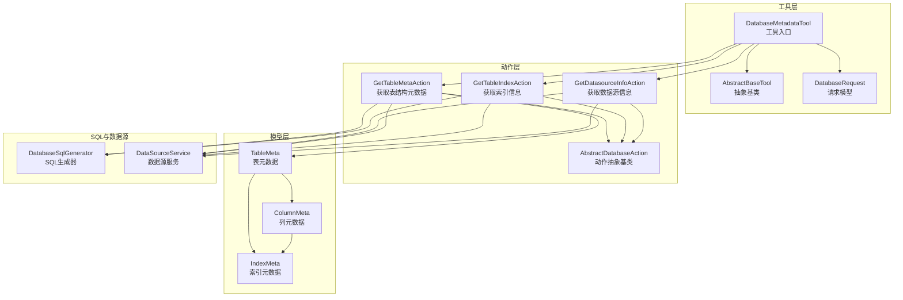
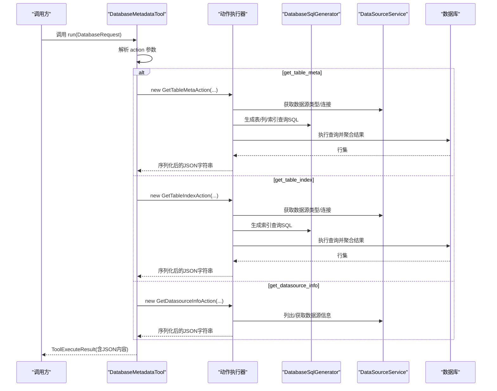
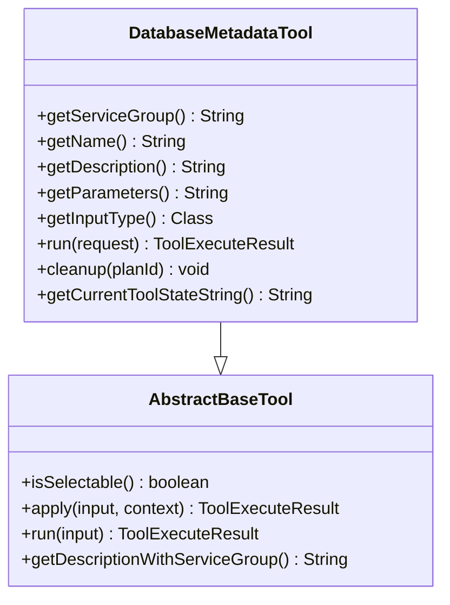
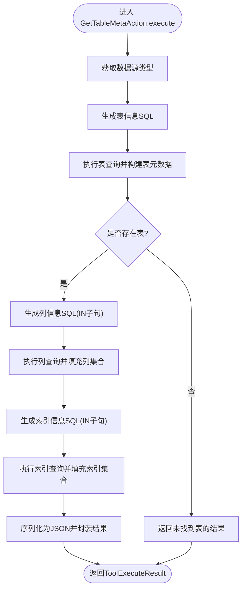
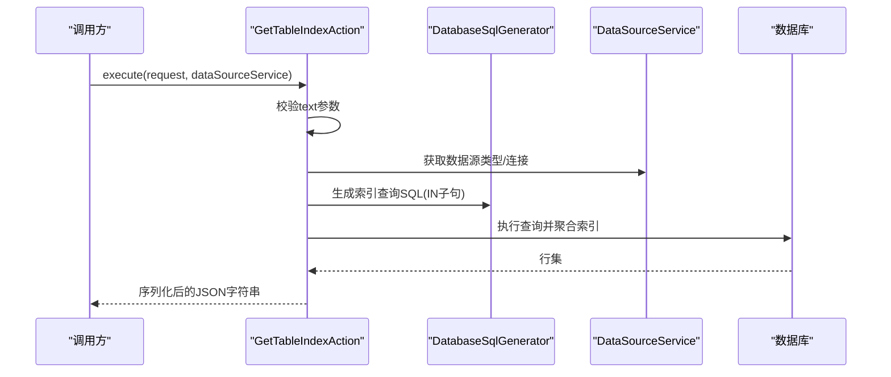
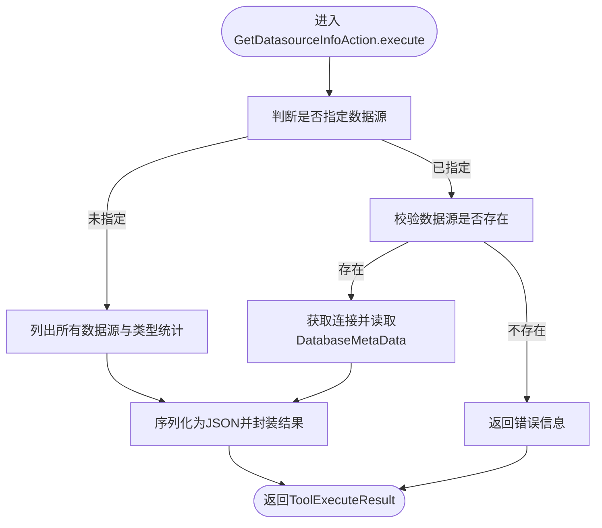
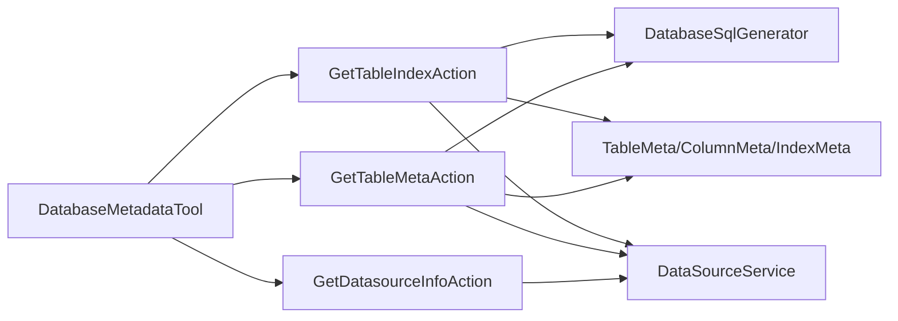

# 元数据管理工具

<cite>
**本文引用的文件列表**
- [DatabaseMetadataTool.java](file://src/main/java/com/alibaba/cloud/ai/lynxe/tool/database/DatabaseMetadataTool.java)
- [AbstractBaseTool.java](file://src/main/java/com/alibaba/cloud/ai/lynxe/tool/AbstractBaseTool.java)
- [DatabaseRequest.java](file://src/main/java/com/alibaba/cloud/ai/lynxe/tool/database/DatabaseRequest.java)
- [GetTableMetaAction.java](file://src/main/java/com/alibaba/cloud/ai/lynxe/tool/database/action/GetTableMetaAction.java)
- [GetTableIndexAction.java](file://src/main/java/com/alibaba/cloud/ai/lynxe/tool/database/action/GetTableIndexAction.java)
- [GetDatasourceInfoAction.java](file://src/main/java/com/alibaba/cloud/ai/lynxe/tool/database/action/GetDatasourceInfoAction.java)
- [AbstractDatabaseAction.java](file://src/main/java/com/alibaba/cloud/ai/lynxe/tool/database/action/AbstractDatabaseAction.java)
- [DatabaseSqlGenerator.java](file://src/main/java/com/alibaba/cloud/ai/lynxe/tool/database/sql/DatabaseSqlGenerator.java)
- [DataSourceService.java](file://src/main/java/com/alibaba/cloud/ai/lynxe/tool/database/DataSourceService.java)
- [TableMeta.java](file://src/main/java/com/alibaba/cloud/ai/lynxe/tool/database/meta/TableMeta.java)
- [ColumnMeta.java](file://src/main/java/com/alibaba/cloud/ai/lynxe/tool/database/meta/ColumnMeta.java)
- [IndexMeta.java](file://src/main/java/com/alibaba/cloud/ai/lynxe/tool/database/meta/IndexMeta.java)
- [database-metadata-tool-zh.yml](file://src/main/resources/i18n/tools/database-metadata-tool-zh.yml)
- [database-metadata-tool-en.yml](file://src/main/resources/i18n/tools/database-metadata-tool-en.yml)
</cite>

## 目录
1. [简介](#简介)
2. [项目结构](#项目结构)
3. [核心组件](#核心组件)
4. [架构总览](#架构总览)
5. [详细组件分析](#详细组件分析)
6. [依赖关系分析](#依赖关系分析)
7. [性能考量](#性能考量)
8. [故障排查指南](#故障排查指南)
9. [结论](#结论)
10. [附录](#附录)

## 简介
本文件面向数据库元数据管理工具“DatabaseMetadataTool”的设计与实现进行系统化说明。该工具继承自通用抽象基类，围绕三类核心能力展开：获取表结构元数据（get_table_meta）、获取索引信息（get_table_index）以及获取数据源信息（get_datasource_info）。文档将从架构、数据流、处理逻辑、安全与性能等方面进行深入解析，并提供可直接定位到源码位置的路径指引，帮助读者快速理解与扩展该工具。

## 项目结构
DatabaseMetadataTool 所在模块位于后端 Java 工程的工具层，主要由以下层次构成：
- 工具入口与抽象基类：定义工具的统一接口、生命周期与执行上下文
- 请求模型：封装动作类型、文本过滤、数据源选择等参数
- 动作实现：针对不同动作的具体执行器，负责 SQL 生成、查询与结果序列化
- 数据模型：表、列、索引的元数据对象
- SQL 生成器：按数据库类型生成兼容的元数据查询 SQL
- 数据源服务：多数据源注册、连接获取与类型识别

图表来源
- [DatabaseMetadataTool.java](file://src/main/java/com/alibaba/cloud/ai/lynxe/tool/database/DatabaseMetadataTool.java#L1-L188)
- [AbstractBaseTool.java](file://src/main/java/com/alibaba/cloud/ai/lynxe/tool/AbstractBaseTool.java#L1-L112)
- [DatabaseRequest.java](file://src/main/java/com/alibaba/cloud/ai/lynxe/tool/database/DatabaseRequest.java#L1-L202)
- [GetTableMetaAction.java](file://src/main/java/com/alibaba/cloud/ai/lynxe/tool/database/action/GetTableMetaAction.java#L1-L220)
- [GetTableIndexAction.java](file://src/main/java/com/alibaba/cloud/ai/lynxe/tool/database/action/GetTableIndexAction.java#L1-L114)
- [GetDatasourceInfoAction.java](file://src/main/java/com/alibaba/cloud/ai/lynxe/tool/database/action/GetDatasourceInfoAction.java#L1-L103)
- [AbstractDatabaseAction.java](file://src/main/java/com/alibaba/cloud/ai/lynxe/tool/database/action/AbstractDatabaseAction.java#L1-L34)
- [DatabaseSqlGenerator.java](file://src/main/java/com/alibaba/cloud/ai/lynxe/tool/database/sql/DatabaseSqlGenerator.java#L1-L257)
- [DataSourceService.java](file://src/main/java/com/alibaba/cloud/ai/lynxe/tool/database/DataSourceService.java#L1-L215)
- [TableMeta.java](file://src/main/java/com/alibaba/cloud/ai/lynxe/tool/database/meta/TableMeta.java#L1-L64)
- [ColumnMeta.java](file://src/main/java/com/alibaba/cloud/ai/lynxe/tool/database/meta/ColumnMeta.java#L1-L94)
- [IndexMeta.java](file://src/main/java/com/alibaba/cloud/ai/lynxe/tool/database/meta/IndexMeta.java#L1-L54)

章节来源
- [DatabaseMetadataTool.java](file://src/main/java/com/alibaba/cloud/ai/lynxe/tool/database/DatabaseMetadataTool.java#L1-L188)
- [AbstractBaseTool.java](file://src/main/java/com/alibaba/cloud/ai/lynxe/tool/AbstractBaseTool.java#L1-L112)
- [DatabaseRequest.java](file://src/main/java/com/alibaba/cloud/ai/lynxe/tool/database/DatabaseRequest.java#L1-L202)

## 核心组件
- DatabaseMetadataTool：工具入口，负责根据请求的动作分发到具体动作执行器；提供工具描述、参数说明、当前状态输出与清理资源的能力。
- AbstractBaseTool：工具抽象基类，提供计划 ID 上下文、是否可被前端选择、返回方式、描述拼接等通用能力。
- DatabaseRequest：工具输入参数模型，支持多种动作类型与参数组合，如动作类型、文本过滤、数据源名称、参数绑定、文件名等。
- 动作实现：
  - GetTableMetaAction：一次性获取表、列、索引的完整元数据，支持模糊匹配表注释，按数据库类型生成 SQL 并序列化为 JSON 返回。
  - GetTableIndexAction：基于逗号分隔的表名列表，批量查询索引信息，合并为统一结果集。
  - GetDatasourceInfoAction：列出可用数据源或获取指定数据源的 JDBC 元数据信息。
- 数据模型：TableMeta、ColumnMeta、IndexMeta，用于承载结构化元数据。
- DatabaseSqlGenerator：按数据库类型生成适配的元数据查询 SQL，覆盖 MySQL/MariaDB、PostgreSQL、Oracle、SQL Server、H2。
- DataSourceService：多数据源注册、连接获取、类型映射与可用性检测。

章节来源
- [DatabaseMetadataTool.java](file://src/main/java/com/alibaba/cloud/ai/lynxe/tool/database/DatabaseMetadataTool.java#L1-L188)
- [AbstractBaseTool.java](file://src/main/java/com/alibaba/cloud/ai/lynxe/tool/AbstractBaseTool.java#L1-L112)
- [DatabaseRequest.java](file://src/main/java/com/alibaba/cloud/ai/lynxe/tool/database/DatabaseRequest.java#L1-L202)
- [GetTableMetaAction.java](file://src/main/java/com/alibaba/cloud/ai/lynxe/tool/database/action/GetTableMetaAction.java#L1-L220)
- [GetTableIndexAction.java](file://src/main/java/com/alibaba/cloud/ai/lynxe/tool/database/action/GetTableIndexAction.java#L1-L114)
- [GetDatasourceInfoAction.java](file://src/main/java/com/alibaba/cloud/ai/lynxe/tool/database/action/GetDatasourceInfoAction.java#L1-L103)
- [DatabaseSqlGenerator.java](file://src/main/java/com/alibaba/cloud/ai/lynxe/tool/database/sql/DatabaseSqlGenerator.java#L1-L257)
- [DataSourceService.java](file://src/main/java/com/alibaba/cloud/ai/lynxe/tool/database/DataSourceService.java#L1-L215)
- [TableMeta.java](file://src/main/java/com/alibaba/cloud/ai/lynxe/tool/database/meta/TableMeta.java#L1-L64)
- [ColumnMeta.java](file://src/main/java/com/alibaba/cloud/ai/lynxe/tool/database/meta/ColumnMeta.java#L1-L94)
- [IndexMeta.java](file://src/main/java/com/alibaba/cloud/ai/lynxe/tool/database/meta/IndexMeta.java#L1-L54)

## 架构总览
DatabaseMetadataTool 采用“工具入口 + 动作分发 + SQL 生成 + 结果序列化”的分层架构。工具入口负责参数校验与动作路由，动作实现负责数据库访问与结果组装，SQL 生成器屏蔽数据库差异，数据源服务提供连接与类型识别。

图表来源
- [DatabaseMetadataTool.java](file://src/main/java/com/alibaba/cloud/ai/lynxe/tool/database/DatabaseMetadataTool.java#L82-L117)
- [GetTableMetaAction.java](file://src/main/java/com/alibaba/cloud/ai/lynxe/tool/database/action/GetTableMetaAction.java#L52-L217)
- [GetTableIndexAction.java](file://src/main/java/com/alibaba/cloud/ai/lynxe/tool/database/action/GetTableIndexAction.java#L42-L111)
- [GetDatasourceInfoAction.java](file://src/main/java/com/alibaba/cloud/ai/lynxe/tool/database/action/GetDatasourceInfoAction.java#L42-L100)
- [DatabaseSqlGenerator.java](file://src/main/java/com/alibaba/cloud/ai/lynxe/tool/database/sql/DatabaseSqlGenerator.java#L33-L94)
- [DataSourceService.java](file://src/main/java/com/alibaba/cloud/ai/lynxe/tool/database/DataSourceService.java#L72-L115)

## 详细组件分析

### 组件一：DatabaseMetadataTool（工具入口）
- 继承关系：实现抽象基类，提供服务组、名称、描述、参数、输入类型、执行与清理等能力。
- 动作分发：根据请求中的 action 字段路由到对应动作执行器；对 get_table_meta 提供二次兜底查询（当首次模糊查询无结果时，自动切换为全量查询）。
- 状态输出：提供当前工具状态字符串，包含已配置数据源、默认类型、连接测试等信息。
- 清理资源：预留清理钩子，便于在计划结束时释放资源。

图表来源
- [AbstractBaseTool.java](file://src/main/java/com/alibaba/cloud/ai/lynxe/tool/AbstractBaseTool.java#L1-L112)
- [DatabaseMetadataTool.java](file://src/main/java/com/alibaba/cloud/ai/lynxe/tool/database/DatabaseMetadataTool.java#L33-L187)

章节来源
- [DatabaseMetadataTool.java](file://src/main/java/com/alibaba/cloud/ai/lynxe/tool/database/DatabaseMetadataTool.java#L33-L187)
- [AbstractBaseTool.java](file://src/main/java/com/alibaba/cloud/ai/lynxe/tool/AbstractBaseTool.java#L1-L112)

### 组件二：GetTableMetaAction（获取表结构元数据）
- 输入参数：支持 text 模糊匹配表注释；支持 datasourceName 指定数据源。
- 处理流程：
  1) 依据数据源类型生成表信息查询 SQL，执行查询并构建表元数据集合；
  2) 依据表名集合生成列信息查询 SQL，执行查询并填充每张表的列集合；
  3) 依据表名集合生成索引信息查询 SQL，执行查询并填充每张表的索引集合，同时建立列与索引的双向关联；
  4) 将结果序列化为 JSON 并封装为 ToolExecuteResult 返回。
- 容错与兼容：对不同数据库的表注释字段进行兼容处理；对列长度等字段做空值保护；异常捕获并返回友好错误信息。

图表来源
- [GetTableMetaAction.java](file://src/main/java/com/alibaba/cloud/ai/lynxe/tool/database/action/GetTableMetaAction.java#L52-L217)
- [DatabaseSqlGenerator.java](file://src/main/java/com/alibaba/cloud/ai/lynxe/tool/database/sql/DatabaseSqlGenerator.java#L33-L94)
- [DataSourceService.java](file://src/main/java/com/alibaba/cloud/ai/lynxe/tool/database/DataSourceService.java#L72-L115)
- [TableMeta.java](file://src/main/java/com/alibaba/cloud/ai/lynxe/tool/database/meta/TableMeta.java#L1-L64)
- [ColumnMeta.java](file://src/main/java/com/alibaba/cloud/ai/lynxe/tool/database/meta/ColumnMeta.java#L1-L94)
- [IndexMeta.java](file://src/main/java/com/alibaba/cloud/ai/lynxe/tool/database/meta/IndexMeta.java#L1-L54)

章节来源
- [GetTableMetaAction.java](file://src/main/java/com/alibaba/cloud/ai/lynxe/tool/database/action/GetTableMetaAction.java#L52-L217)
- [DatabaseSqlGenerator.java](file://src/main/java/com/alibaba/cloud/ai/lynxe/tool/database/sql/DatabaseSqlGenerator.java#L33-L94)
- [TableMeta.java](file://src/main/java/com/alibaba/cloud/ai/lynxe/tool/database/meta/TableMeta.java#L1-L64)
- [ColumnMeta.java](file://src/main/java/com/alibaba/cloud/ai/lynxe/tool/database/meta/ColumnMeta.java#L1-L94)
- [IndexMeta.java](file://src/main/java/com/alibaba/cloud/ai/lynxe/tool/database/meta/IndexMeta.java#L1-L54)

### 组件三：GetTableIndexAction（获取索引信息）
- 输入参数：必须提供 text（逗号分隔的表名），支持 datasourceName 指定数据源。
- 处理流程：
  1) 依据数据源类型生成索引查询 SQL；
  2) 使用 IN 子句批量查询多个表的索引；
  3) 将结果按表名与索引名聚合，最终输出统一的索引列表。
- 异常处理：缺失参数或执行异常时返回错误信息。

图表来源
- [GetTableIndexAction.java](file://src/main/java/com/alibaba/cloud/ai/lynxe/tool/database/action/GetTableIndexAction.java#L42-L111)
- [DatabaseSqlGenerator.java](file://src/main/java/com/alibaba/cloud/ai/lynxe/tool/database/sql/DatabaseSqlGenerator.java#L77-L94)
- [DataSourceService.java](file://src/main/java/com/alibaba/cloud/ai/lynxe/tool/database/DataSourceService.java#L72-L115)

章节来源
- [GetTableIndexAction.java](file://src/main/java/com/alibaba/cloud/ai/lynxe/tool/database/action/GetTableIndexAction.java#L42-L111)
- [DatabaseSqlGenerator.java](file://src/main/java/com/alibaba/cloud/ai/lynxe/tool/database/sql/DatabaseSqlGenerator.java#L77-L94)

### 组件四：GetDatasourceInfoAction（获取数据源信息）
- 输入参数：可选 datasourceName；为空则列出所有可用数据源及其类型统计。
- 处理流程：
  1) 若未指定数据源：返回可用数据源列表、类型映射与总数；
  2) 若指定数据源：校验存在性并获取连接，读取 JDBC DatabaseMetaData，封装为结构化信息。
- 异常处理：数据源不存在或连接失败时返回错误信息。

图表来源
- [GetDatasourceInfoAction.java](file://src/main/java/com/alibaba/cloud/ai/lynxe/tool/database/action/GetDatasourceInfoAction.java#L42-L100)
- [DataSourceService.java](file://src/main/java/com/alibaba/cloud/ai/lynxe/tool/database/DataSourceService.java#L117-L180)

章节来源
- [GetDatasourceInfoAction.java](file://src/main/java/com/alibaba/cloud/ai/lynxe/tool/database/action/GetDatasourceInfoAction.java#L42-L100)
- [DataSourceService.java](file://src/main/java/com/alibaba/cloud/ai/lynxe/tool/database/DataSourceService.java#L117-L180)

### 组件五：DatabaseSqlGenerator（SQL生成器）
- 能力：按数据库类型生成表、列、索引信息查询 SQL，覆盖 MySQL/MariaDB、PostgreSQL、Oracle、SQL Server、H2。
- 设计要点：对不同数据库的元数据视图/系统表差异进行适配；对模糊匹配、IN 子句占位符进行统一处理；默认回退到 MySQL SQL。

章节来源
- [DatabaseSqlGenerator.java](file://src/main/java/com/alibaba/cloud/ai/lynxe/tool/database/sql/DatabaseSqlGenerator.java#L33-L256)

### 组件六：DataSourceService（数据源服务）
- 能力：多数据源注册、连接获取、类型映射、可用性检测、连接测试。
- 设计要点：内部使用并发安全的映射存储；默认连接策略为取第一个可用数据源；提供测试连接能力。

章节来源
- [DataSourceService.java](file://src/main/java/com/alibaba/cloud/ai/lynxe/tool/database/DataSourceService.java#L36-L214)

### 组件七：数据模型（TableMeta/ColumnMeta/IndexMeta）
- TableMeta：包含表名、表注释、列集合、索引集合。
- ColumnMeta：包含列名、列类型、列长度、默认值、是否非空、引用索引集合。
- IndexMeta：包含索引名、引用列名列表、索引类型。

章节来源
- [TableMeta.java](file://src/main/java/com/alibaba/cloud/ai/lynxe/tool/database/meta/TableMeta.java#L1-L64)
- [ColumnMeta.java](file://src/main/java/com/alibaba/cloud/ai/lynxe/tool/database/meta/ColumnMeta.java#L1-L94)
- [IndexMeta.java](file://src/main/java/com/alibaba/cloud/ai/lynxe/tool/database/meta/IndexMeta.java#L1-L54)

## 依赖关系分析
- 工具入口依赖动作实现与数据源服务；动作实现依赖 SQL 生成器与数据源服务；数据模型作为结果载体被序列化返回。
- 数据库类型识别通过数据源服务提供；SQL 生成器根据类型生成差异化 SQL。
- 工具描述与参数由国际化资源文件提供，确保多语言支持。

图表来源
- [DatabaseMetadataTool.java](file://src/main/java/com/alibaba/cloud/ai/lynxe/tool/database/DatabaseMetadataTool.java#L82-L117)
- [GetTableMetaAction.java](file://src/main/java/com/alibaba/cloud/ai/lynxe/tool/database/action/GetTableMetaAction.java#L52-L217)
- [GetTableIndexAction.java](file://src/main/java/com/alibaba/cloud/ai/lynxe/tool/database/action/GetTableIndexAction.java#L42-L111)
- [GetDatasourceInfoAction.java](file://src/main/java/com/alibaba/cloud/ai/lynxe/tool/database/action/GetDatasourceInfoAction.java#L42-L100)
- [DatabaseSqlGenerator.java](file://src/main/java/com/alibaba/cloud/ai/lynxe/tool/database/sql/DatabaseSqlGenerator.java#L33-L94)
- [DataSourceService.java](file://src/main/java/com/alibaba/cloud/ai/lynxe/tool/database/DataSourceService.java#L72-L115)
- [TableMeta.java](file://src/main/java/com/alibaba/cloud/ai/lynxe/tool/database/meta/TableMeta.java#L1-L64)
- [ColumnMeta.java](file://src/main/java/com/alibaba/cloud/ai/lynxe/tool/database/meta/ColumnMeta.java#L1-L94)
- [IndexMeta.java](file://src/main/java/com/alibaba/cloud/ai/lynxe/tool/database/meta/IndexMeta.java#L1-L54)

章节来源
- [DatabaseMetadataTool.java](file://src/main/java/com/alibaba/cloud/ai/lynxe/tool/database/DatabaseMetadataTool.java#L82-L117)
- [DatabaseSqlGenerator.java](file://src/main/java/com/alibaba/cloud/ai/lynxe/tool/database/sql/DatabaseSqlGenerator.java#L33-L94)
- [DataSourceService.java](file://src/main/java/com/alibaba/cloud/ai/lynxe/tool/database/DataSourceService.java#L72-L115)

## 性能考量
- 元数据缓存策略
  - 表/列/索引信息在一次执行周期内可缓存于内存中，避免重复查询相同表的列与索引信息。
  - 对于频繁查询的场景，可在动作实现层引入轻量级缓存（例如基于表名与数据源类型的键值缓存），并在工具状态输出中体现缓存命中情况。
- 批量查询最佳实践
  - 列与索引查询已通过 IN 子句批量执行，减少网络往返；建议限制单次查询的表数量上限，防止 IN 列表过长导致 SQL 超限。
  - 对 get_table_meta 的模糊查询，若命中率低，可考虑先执行全量查询再在客户端侧过滤，减少多次往返。
- 连接与资源管理
  - 使用 try-with-resources 确保 PreparedStatement 与 ResultSet 及时关闭；在高并发场景下建议结合连接池（当前实现为 DriverManagerDataSource，适合演示环境，生产建议替换为连接池实现）。
- 序列化开销
  - JSON 序列化发生在动作层，建议对大结果集进行分页或分批返回，或在上层进行流式处理以降低内存峰值。

[本节为通用性能建议，不直接分析具体文件]

## 故障排查指南
- 常见问题与定位
  - 数据源不可用：检查数据源是否已注册、类型映射是否正确、连接参数是否有效；可通过工具状态输出查看连接状态。
  - SQL 执行异常：确认数据库类型识别是否正确、IN 子句是否过长、模糊匹配参数是否为空；查看动作实现中的日志输出。
  - 结果序列化失败：检查对象模型字段是否完整、JSON 序列化库版本是否兼容。
- 日志与错误信息
  - 动作实现与工具入口均记录详细错误日志，包含数据源名称、错误原因等；返回的 ToolExecuteResult 中包含人类可读的错误提示。
- 快速验证步骤
  - 使用 get_datasource_info 获取可用数据源列表与类型映射；
  - 使用 get_table_meta 的全量查询验证表结构读取；
  - 使用 get_table_index 验证索引读取；
  - 检查工具状态输出中的连接状态与默认类型。

章节来源
- [GetTableMetaAction.java](file://src/main/java/com/alibaba/cloud/ai/lynxe/tool/database/action/GetTableMetaAction.java#L98-L108)
- [GetTableIndexAction.java](file://src/main/java/com/alibaba/cloud/ai/lynxe/tool/database/action/GetTableIndexAction.java#L47-L51)
- [GetDatasourceInfoAction.java](file://src/main/java/com/alibaba/cloud/ai/lynxe/tool/database/action/GetDatasourceInfoAction.java#L60-L65)
- [DatabaseMetadataTool.java](file://src/main/java/com/alibaba/cloud/ai/lynxe/tool/database/DatabaseMetadataTool.java#L131-L180)

## 结论
DatabaseMetadataTool 通过清晰的分层设计与数据库类型适配，提供了稳定可靠的数据库元数据查询能力。其动作实现遵循“SQL 生成 + 批量查询 + 结果序列化”的模式，具备良好的扩展性与可维护性。建议在生产环境中结合连接池、缓存与分页策略进一步提升性能与稳定性。

[本节为总结性内容，不直接分析具体文件]

## 附录

### 使用示例（自然语言到代码路径）
- 通过自然语言查询表结构
  - 描述：用户希望获取某数据库中包含特定关键词的表的结构、字段与索引。
  - 实现路径：调用工具入口，设置 action 为 get_table_meta，text 为关键词，可选 datasourceName 指定数据源；工具会先尝试模糊匹配，若无结果则自动执行全量查询。
  - 关键代码路径：
    - [DatabaseMetadataTool.run](file://src/main/java/com/alibaba/cloud/ai/lynxe/tool/database/DatabaseMetadataTool.java#L82-L117)
    - [GetTableMetaAction.execute](file://src/main/java/com/alibaba/cloud/ai/lynxe/tool/database/action/GetTableMetaAction.java#L52-L217)
    - [DatabaseSqlGenerator.generateTableInfoSql/generateColumnInfoSql/generateIndexInfoSql](file://src/main/java/com/alibaba/cloud/ai/lynxe/tool/database/sql/DatabaseSqlGenerator.java#L33-L94)
- 分析数据库索引
  - 描述：用户希望获取一组表的索引信息，以便评估索引覆盖与冗余。
  - 实现路径：设置 action 为 get_table_index，text 为逗号分隔的表名列表，可选 datasourceName；工具将批量查询并合并索引结果。
  - 关键代码路径：
    - [GetTableIndexAction.execute](file://src/main/java/com/alibaba/cloud/ai/lynxe/tool/database/action/GetTableIndexAction.java#L42-L111)
    - [DatabaseSqlGenerator.generateIndexInfoSql](file://src/main/java/com/alibaba/cloud/ai/lynxe/tool/database/sql/DatabaseSqlGenerator.java#L77-L94)
- 检查数据源状态
  - 描述：用户希望确认当前可用的数据源、默认类型与连接状态。
  - 实现路径：设置 action 为 get_datasource_info，可选 datasourceName；若为空则列出所有数据源，否则获取指定数据源的 JDBC 元数据。
  - 关键代码路径：
    - [GetDatasourceInfoAction.execute](file://src/main/java/com/alibaba/cloud/ai/lynxe/tool/database/action/GetDatasourceInfoAction.java#L42-L100)
    - [DataSourceService.getAllDatasourceInfo/getDataSourceType/getConnection](file://src/main/java/com/alibaba/cloud/ai/lynxe/tool/database/DataSourceService.java#L184-L115)

### 参数与国际化
- 工具描述与参数由国际化资源文件提供，支持中文与英文两种语言，明确各动作的用途与必填参数。
- 关键资源路径：
  - [database-metadata-tool-zh.yml](file://src/main/resources/i18n/tools/database-metadata-tool-zh.yml#L1-L44)
  - [database-metadata-tool-en.yml](file://src/main/resources/i18n/tools/database-metadata-tool-en.yml#L1-L44)

章节来源
- [database-metadata-tool-zh.yml](file://src/main/resources/i18n/tools/database-metadata-tool-zh.yml#L1-L44)
- [database-metadata-tool-en.yml](file://src/main/resources/i18n/tools/database-metadata-tool-en.yml#L1-L44)

### 安全机制
- SQL 注入防护
  - 采用预编译语句（PreparedStatement）与占位符绑定参数，避免字符串拼接引发注入风险；IN 子句通过动态占位符生成，参数个数受控。
  - 模糊匹配参数通过占位符传入，避免直接拼接通配符。
- 权限控制
  - 工具本身不内置鉴权逻辑，建议在调用链路（如控制器或适配层）增加鉴权与授权校验；数据源连接参数应来自受控配置中心，避免泄露。
- 错误隔离
  - 动作实现与工具入口均捕获异常并返回结构化错误信息，避免敏感堆栈泄露给调用方。

章节来源
- [GetTableMetaAction.java](file://src/main/java/com/alibaba/cloud/ai/lynxe/tool/database/action/GetTableMetaAction.java#L66-L72)
- [GetTableIndexAction.java](file://src/main/java/com/alibaba/cloud/ai/lynxe/tool/database/action/GetTableIndexAction.java#L66-L71)
- [GetDatasourceInfoAction.java](file://src/main/java/com/alibaba/cloud/ai/lynxe/tool/database/action/GetDatasourceInfoAction.java#L67-L87)