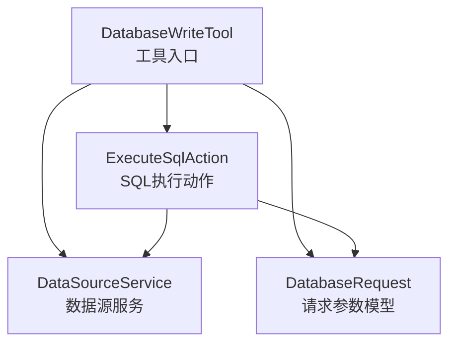
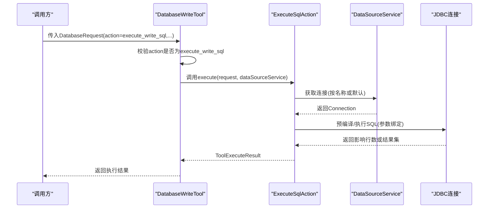
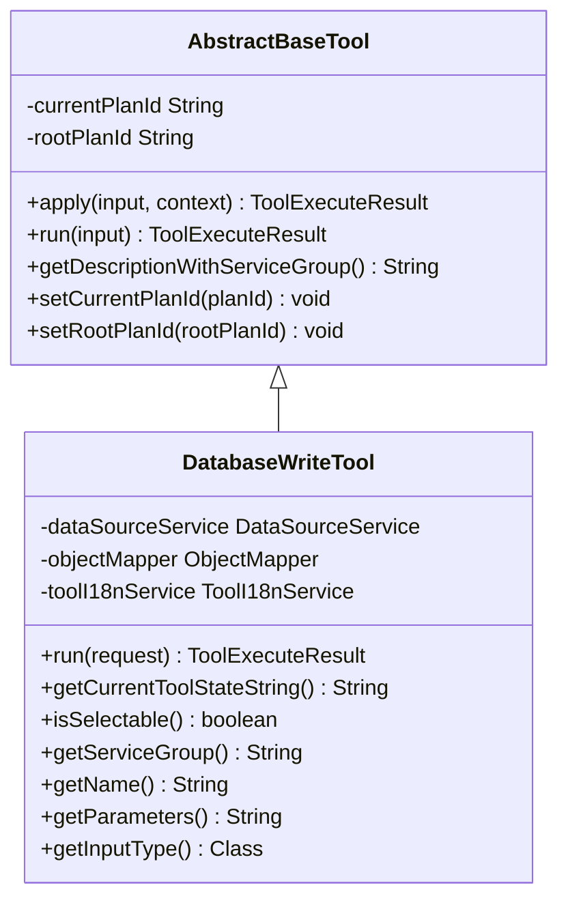
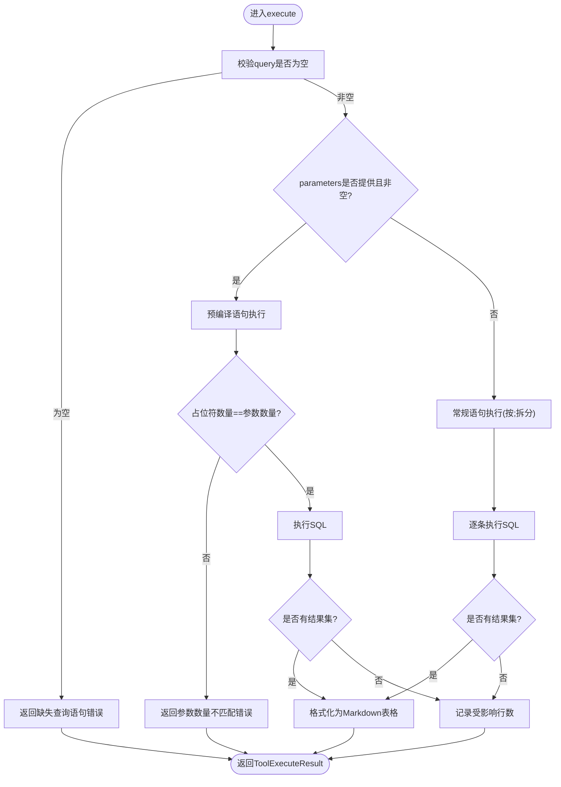
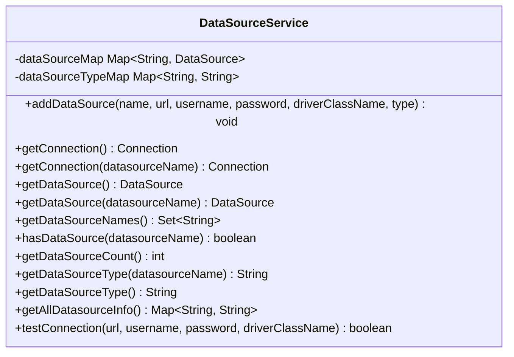
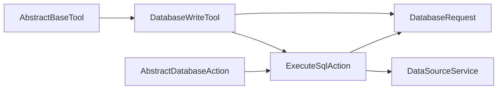

# 数据写入工具

<cite>
**本文引用的文件列表**
- [DatabaseWriteTool.java](file://src/main/java/com/alibaba/cloud/ai/lynxe/tool/database/DatabaseWriteTool.java)
- [AbstractBaseTool.java](file://src/main/java/com/alibaba/cloud/ai/lynxe/tool/AbstractBaseTool.java)
- [ExecuteSqlAction.java](file://src/main/java/com/alibaba/cloud/ai/lynxe/tool/database/action/ExecuteSqlAction.java)
- [AbstractDatabaseAction.java](file://src/main/java/com/alibaba/cloud/ai/lynxe/tool/database/action/AbstractDatabaseAction.java)
- [DataSourceService.java](file://src/main/java/com/alibaba/cloud/ai/lynxe/tool/database/DataSourceService.java)
- [DatabaseRequest.java](file://src/main/java/com/alibaba/cloud/ai/lynxe/tool/database/DatabaseRequest.java)
- [database-write-tool-zh.yml](file://src/main/resources/i18n/tools/database-write-tool-zh.yml)
- [application.yml](file://src/main/resources/application.yml)
</cite>

## 目录
1. [简介](#简介)
2. [项目结构](#项目结构)
3. [核心组件](#核心组件)
4. [架构总览](#架构总览)
5. [详细组件分析](#详细组件分析)
6. [依赖关系分析](#依赖关系分析)
7. [性能考虑](#性能考虑)
8. [故障排查指南](#故障排查指南)
9. [结论](#结论)
10. [附录](#附录)

## 简介
本文件面向数据库写入工具DatabaseWriteTool的使用者与维护者，系统性阐述其设计与实现要点，重点覆盖以下方面：
- 继承自AbstractBaseTool的结构特点与职责边界
- 执行写操作SQL（execute_write_sql）的核心实现机制
- 安全控制机制：仅允许execute_write_sql操作的校验与SQL执行前的严格检查
- ExecuteSqlAction操作类的工作原理及与数据源配置管理的协作流程
- 实际使用场景：如何安全地执行INSERT、UPDATE、DELETE等写操作
- 事务处理与错误回滚策略说明
- 性能优化建议：批量写入最佳实践与连接池配置优化

## 项目结构
DatabaseWriteTool位于工具模块的数据库子包下，围绕“工具-动作-数据源”的分层组织：
- 工具层：DatabaseWriteTool负责输入校验、动作路由与结果封装
- 动作层：ExecuteSqlAction封装SQL执行细节（预编译与常规语句两种路径）
- 数据源层：DataSourceService统一管理多数据源连接与类型信息

图表来源
- [DatabaseWriteTool.java](file://src/main/java/com/alibaba/cloud/ai/lynxe/tool/database/DatabaseWriteTool.java#L80-L100)
- [ExecuteSqlAction.java](file://src/main/java/com/alibaba/cloud/ai/lynxe/tool/database/action/ExecuteSqlAction.java#L38-L57)
- [DataSourceService.java](file://src/main/java/com/alibaba/cloud/ai/lynxe/tool/database/DataSourceService.java#L82-L115)
- [DatabaseRequest.java](file://src/main/java/com/alibaba/cloud/ai/lynxe/tool/database/DatabaseRequest.java#L48-L101)

章节来源
- [DatabaseWriteTool.java](file://src/main/java/com/alibaba/cloud/ai/lynxe/tool/database/DatabaseWriteTool.java#L31-L112)
- [ExecuteSqlAction.java](file://src/main/java/com/alibaba/cloud/ai/lynxe/tool/database/action/ExecuteSqlAction.java#L34-L154)
- [DataSourceService.java](file://src/main/java/com/alibaba/cloud/ai/lynxe/tool/database/DataSourceService.java#L31-L188)
- [DatabaseRequest.java](file://src/main/java/com/alibaba/cloud/ai/lynxe/tool/database/DatabaseRequest.java#L32-L201)

## 核心组件
- DatabaseWriteTool：继承AbstractBaseTool，作为数据库写入工具的唯一入口。它对请求进行动作校验，限定仅支持execute_write_sql；随后委派给ExecuteSqlAction完成SQL执行，并通过ToolExecuteResult返回结果。
- ExecuteSqlAction：继承AbstractDatabaseAction，实现具体SQL执行逻辑。根据是否存在参数选择预编译语句或常规语句路径；对占位符数量与参数数量进行严格匹配校验；格式化结果集输出。
- DataSourceService：提供多数据源注册、按名称获取连接、类型查询与连接测试能力；默认使用DriverManagerDataSource，便于在无外部连接池时快速运行。
- DatabaseRequest：封装工具调用所需的参数，包括action、query、datasourceName、parameters等字段。

章节来源
- [DatabaseWriteTool.java](file://src/main/java/com/alibaba/cloud/ai/lynxe/tool/database/DatabaseWriteTool.java#L80-L100)
- [ExecuteSqlAction.java](file://src/main/java/com/alibaba/cloud/ai/lynxe/tool/database/action/ExecuteSqlAction.java#L38-L154)
- [DataSourceService.java](file://src/main/java/com/alibaba/cloud/ai/lynxe/tool/database/DataSourceService.java#L31-L188)
- [DatabaseRequest.java](file://src/main/java/com/alibaba/cloud/ai/lynxe/tool/database/DatabaseRequest.java#L32-L201)

## 架构总览
DatabaseWriteTool通过抽象基类提供统一的生命周期与上下文管理，写入流程严格限制为execute_write_sql，确保只执行写操作。SQL执行由ExecuteSqlAction完成，数据源由DataSourceService集中管理。

图表来源
- [DatabaseWriteTool.java](file://src/main/java/com/alibaba/cloud/ai/lynxe/tool/database/DatabaseWriteTool.java#L80-L100)
- [ExecuteSqlAction.java](file://src/main/java/com/alibaba/cloud/ai/lynxe/tool/database/action/ExecuteSqlAction.java#L38-L154)
- [DataSourceService.java](file://src/main/java/com/alibaba/cloud/ai/lynxe/tool/database/DataSourceService.java#L82-L115)

## 详细组件分析

### DatabaseWriteTool 设计与实现
- 继承关系：DatabaseWriteTool继承AbstractBaseTool，复用其计划ID、根计划ID、描述与服务组拼接等通用能力。
- 输入类型：getInputType返回DatabaseRequest.class，确保工具框架按该模型解析调用参数。
- 动作路由：run方法中对action进行严格校验，仅接受execute_write_sql；其他动作直接返回错误提示。
- 结果封装：异常捕获后统一包装为ToolExecuteResult，便于上层处理。
- 状态查询：getCurrentToolStateString聚合当前可用数据源信息，便于运维与调试。

图表来源
- [AbstractBaseTool.java](file://src/main/java/com/alibaba/cloud/ai/lynxe/tool/AbstractBaseTool.java#L22-L111)
- [DatabaseWriteTool.java](file://src/main/java/com/alibaba/cloud/ai/lynxe/tool/database/DatabaseWriteTool.java#L31-L112)

章节来源
- [AbstractBaseTool.java](file://src/main/java/com/alibaba/cloud/ai/lynxe/tool/AbstractBaseTool.java#L22-L111)
- [DatabaseWriteTool.java](file://src/main/java/com/alibaba/cloud/ai/lynxe/tool/database/DatabaseWriteTool.java#L31-L144)

### ExecuteSqlAction 执行机制
- 参数化执行路径：当request.parameters非空且不为空时，采用预编译语句。先统计SQL中“?”占位符数量并与参数个数严格匹配，不一致则立即返回错误。
- 常规执行路径：当无参数时，按分号拆分多条SQL逐条执行，兼容历史用法。
- 结果格式化：若返回结果集，转换为Markdown表格；若无数据，输出列名与“未找到行”提示；若为更新语句，返回受影响行数。
- 错误处理：捕获SQLException并返回标准化错误消息，包含数据源名称与错误详情。

图表来源
- [ExecuteSqlAction.java](file://src/main/java/com/alibaba/cloud/ai/lynxe/tool/database/action/ExecuteSqlAction.java#L38-L154)
- [ExecuteSqlAction.java](file://src/main/java/com/alibaba/cloud/ai/lynxe/tool/database/action/ExecuteSqlAction.java#L156-L216)

章节来源
- [ExecuteSqlAction.java](file://src/main/java/com/alibaba/cloud/ai/lynxe/tool/database/action/ExecuteSqlAction.java#L38-L245)

### 数据源配置管理协作
- 多数据源注册：addDataSource支持按名称注册数据源，并可附加类型信息；内部使用ConcurrentHashMap维护映射。
- 连接获取：支持按名称获取连接；若未指定名称，则取第一个可用数据源作为默认连接。
- 类型查询：提供按名称或默认的数据源类型查询接口，便于工具侧识别数据库类型。
- 连接测试：testConnection用于验证URL、用户名、密码与驱动类是否有效。

图表来源
- [DataSourceService.java](file://src/main/java/com/alibaba/cloud/ai/lynxe/tool/database/DataSourceService.java#L31-L214)

章节来源
- [DataSourceService.java](file://src/main/java/com/alibaba/cloud/ai/lynxe/tool/database/DataSourceService.java#L31-L214)

### 安全控制机制
- 仅支持execute_write_sql：DatabaseWriteTool在run中对action进行严格校验，拒绝除execute_write_sql之外的所有写操作动作，从入口层面杜绝误用。
- SQL执行前严格检查：
  - 必填项校验：query不能为空，否则直接返回错误。
  - 参数匹配校验：当提供parameters时，统计SQL中“?”的数量并与参数个数对比，不一致即报错，避免参数绑定错误。
- 防注入与参数绑定：采用预编译语句绑定参数，避免字符串拼接导致的SQL注入风险；支持null值绑定。
- 结果输出安全：格式化结果集时对特殊字符进行转义，防止破坏Markdown表格结构。

章节来源
- [DatabaseWriteTool.java](file://src/main/java/com/alibaba/cloud/ai/lynxe/tool/database/DatabaseWriteTool.java#L80-L100)
- [ExecuteSqlAction.java](file://src/main/java/com/alibaba/cloud/ai/lynxe/tool/database/action/ExecuteSqlAction.java#L44-L74)
- [ExecuteSqlAction.java](file://src/main/java/com/alibaba/cloud/ai/lynxe/tool/database/action/ExecuteSqlAction.java#L156-L216)

### 实际使用示例与最佳实践
- INSERT/UPDATE/DELETE写操作示例（参考国际化参数定义）：
  - INSERT：query使用“INSERT INTO … VALUES (?, ?)”占位符，parameters提供对应值数组。
  - UPDATE：query使用“UPDATE … SET … = ? WHERE … = ?”，parameters提供新值与条件值。
  - DELETE：query使用“DELETE FROM … WHERE … = ?”，parameters提供删除条件值。
- 使用建议：
  - 始终使用“?”占位符与parameters数组进行参数绑定，避免手拼SQL。
  - 对于批量写入，优先使用预编译语句的批量参数绑定方式（在调用端构造批量参数），减少SQL解析与编译开销。
  - 若需跨表事务一致性，建议在应用层使用JDBC事务控制（例如手动开启事务、提交/回滚），并在工具层保持单条SQL原子性。

章节来源
- [database-write-tool-zh.yml](file://src/main/resources/i18n/tools/database-write-tool-zh.yml#L1-L37)
- [DatabaseRequest.java](file://src/main/java/com/alibaba/cloud/ai/lynxe/tool/database/DatabaseRequest.java#L82-L101)

### 事务处理与错误回滚策略
- 当前实现：ExecuteSqlAction在单条SQL执行范围内使用try-with-resources管理连接与语句，SQL执行失败会捕获SQLException并返回错误信息。对于多条SQL（常规路径），逐条执行，任一失败不会自动回滚之前已成功的语句。
- 建议策略：
  - 在调用方（业务层）开启JDBC事务，将多条写操作包裹在同一个事务中，失败时统一回滚。
  - 对于DDL（如ALTER/DROP/CREATE）与数据变更混合场景，建议拆分为独立事务，确保幂等与可恢复性。
  - 对关键写操作增加重试与幂等键约束，避免重复执行造成副作用。

章节来源
- [ExecuteSqlAction.java](file://src/main/java/com/alibaba/cloud/ai/lynxe/tool/database/action/ExecuteSqlAction.java#L117-L154)

## 依赖关系分析
- DatabaseWriteTool依赖DataSourceService与国际化服务，负责动作校验与结果封装。
- ExecuteSqlAction依赖DatabaseRequest与DataSourceService，负责SQL执行与结果格式化。
- AbstractDatabaseAction为动作层抽象基类，约束execute签名。
- DatabaseRequest为参数载体，承载action、query、parameters、datasourceName等字段。

图表来源
- [AbstractBaseTool.java](file://src/main/java/com/alibaba/cloud/ai/lynxe/tool/AbstractBaseTool.java#L22-L111)
- [DatabaseWriteTool.java](file://src/main/java/com/alibaba/cloud/ai/lynxe/tool/database/DatabaseWriteTool.java#L31-L112)
- [AbstractDatabaseAction.java](file://src/main/java/com/alibaba/cloud/ai/lynxe/tool/database/action/AbstractDatabaseAction.java#L19-L33)
- [ExecuteSqlAction.java](file://src/main/java/com/alibaba/cloud/ai/lynxe/tool/database/action/ExecuteSqlAction.java#L34-L57)
- [DataSourceService.java](file://src/main/java/com/alibaba/cloud/ai/lynxe/tool/database/DataSourceService.java#L82-L115)
- [DatabaseRequest.java](file://src/main/java/com/alibaba/cloud/ai/lynxe/tool/database/DatabaseRequest.java#L48-L101)

章节来源
- [DatabaseWriteTool.java](file://src/main/java/com/alibaba/cloud/ai/lynxe/tool/database/DatabaseWriteTool.java#L31-L112)
- [ExecuteSqlAction.java](file://src/main/java/com/alibaba/cloud/ai/lynxe/tool/database/action/ExecuteSqlAction.java#L34-L154)
- [DataSourceService.java](file://src/main/java/com/alibaba/cloud/ai/lynxe/tool/database/DataSourceService.java#L31-L188)
- [DatabaseRequest.java](file://src/main/java/com/alibaba/cloud/ai/lynxe/tool/database/DatabaseRequest.java#L32-L201)

## 性能考虑
- 连接池配置优化：
  - application.yml中已内置HikariCP配置项，建议结合实际并发与数据库负载调整最大池大小、空闲连接数、连接超时与最大生命周期等参数，以降低连接建立与销毁开销。
  - 合理设置validation-timeout与connection-test-query，确保连接健康检查及时但不过度消耗资源。
- 批量写入最佳实践：
  - 使用预编译语句的批量参数绑定，减少SQL解析次数。
  - 控制批次大小，避免单批次过大导致内存压力与锁竞争。
  - 在应用层使用JDBC事务合并多次写入，减少网络往返与日志刷写。
- 结果集格式化：
  - ExecuteSqlAction对结果集进行Markdown表格格式化，注意大数据量时的序列化成本，必要时在调用端限制返回行数或改用文件导出。

章节来源
- [application.yml](file://src/main/resources/application.yml#L21-L31)
- [ExecuteSqlAction.java](file://src/main/java/com/alibaba/cloud/ai/lynxe/tool/database/action/ExecuteSqlAction.java#L156-L216)

## 故障排查指南
- 常见错误与定位：
  - 缺少action或action非execute_write_sql：检查调用参数，确保action为execute_write_sql。
  - 缺失query：确认SQL语句已正确传入。
  - 参数数量不匹配：核对SQL中“?”与parameters长度是否一致。
  - 数据源不存在：确认datasourceName是否正确，或使用默认数据源。
  - 连接失败：使用DataSourceService.testConnection验证URL、用户名、密码与驱动类。
- 日志与状态：
  - DatabaseWriteTool在执行前后记录日志，可通过日志定位问题。
  - 使用getCurrentToolStateString查看当前可用数据源列表，辅助诊断。

章节来源
- [DatabaseWriteTool.java](file://src/main/java/com/alibaba/cloud/ai/lynxe/tool/database/DatabaseWriteTool.java#L80-L100)
- [ExecuteSqlAction.java](file://src/main/java/com/alibaba/cloud/ai/lynxe/tool/database/action/ExecuteSqlAction.java#L44-L74)
- [DataSourceService.java](file://src/main/java/com/alibaba/cloud/ai/lynxe/tool/database/DataSourceService.java#L192-L212)

## 结论
DatabaseWriteTool通过严格的入口校验与清晰的动作分层，确保了数据库写入的安全性与可控性。ExecuteSqlAction在参数化执行、占位符匹配与结果格式化方面提供了稳健的实现。配合DataSourceService的多数据源管理与application.yml中的连接池配置，可在保证安全的前提下获得良好的性能表现。建议在业务层引入JDBC事务与幂等控制，进一步提升写入操作的可靠性与可恢复性。

## 附录
- 国际化参数与示例参考：database-write-tool-zh.yml
- 请求参数模型字段说明：DatabaseRequest

章节来源
- [database-write-tool-zh.yml](file://src/main/resources/i18n/tools/database-write-tool-zh.yml#L1-L37)
- [DatabaseRequest.java](file://src/main/java/com/alibaba/cloud/ai/lynxe/tool/database/DatabaseRequest.java#L32-L201)