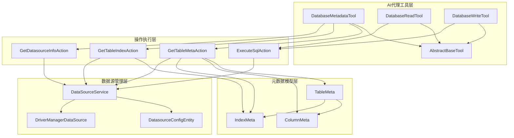
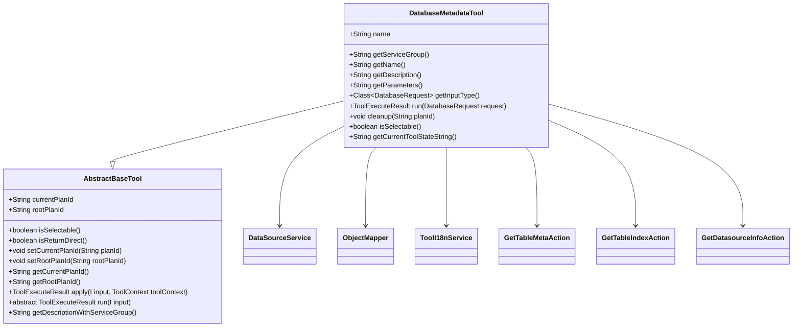
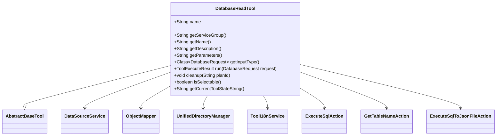
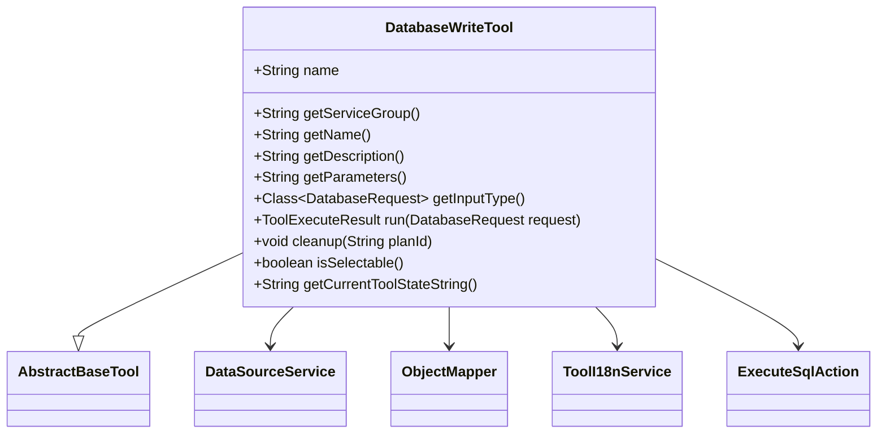
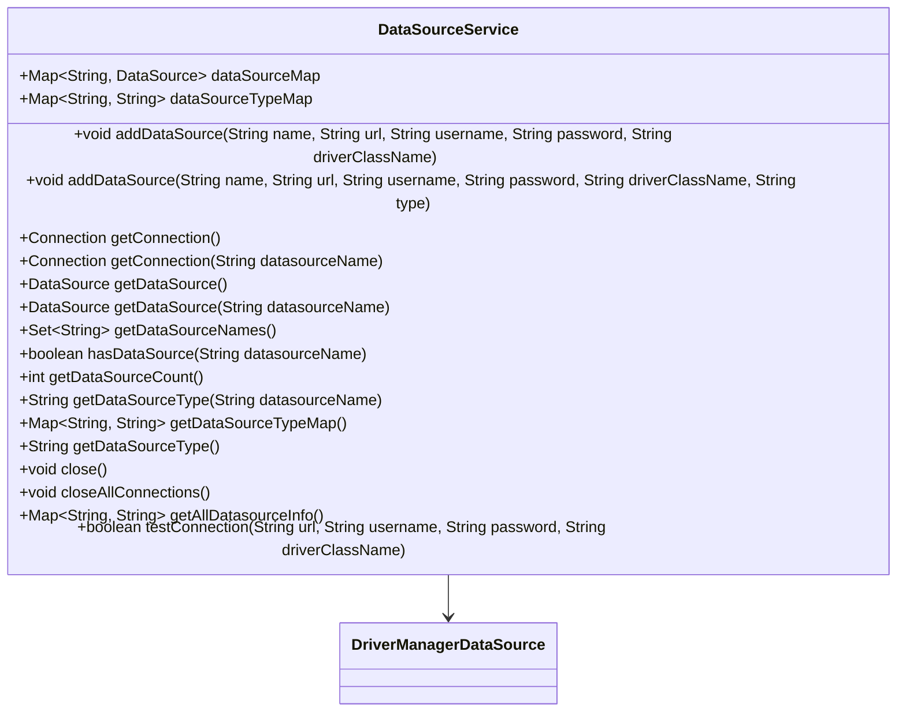
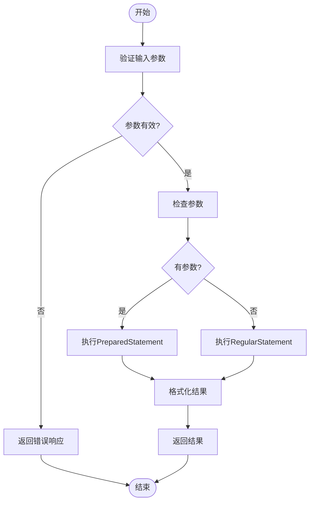
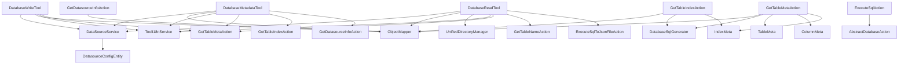

# 数据库工具

<cite>
**本文档引用的文件**   
- [DatabaseMetadataTool.java](file://src\main\java\com\alibaba\cloud\ai\lynxe\tool\database\DatabaseMetadataTool.java)
- [DatabaseReadTool.java](file://src\main\java\com\alibaba\cloud\ai\lynxe\tool\database\DatabaseReadTool.java)
- [DatabaseWriteTool.java](file://src\main\java\com\alibaba\cloud\ai\lynxe\tool\database\DatabaseWriteTool.java)
- [DataSourceService.java](file://src\main\java\com\alibaba\cloud\ai\lynxe\tool\database\DataSourceService.java)
- [AbstractBaseTool.java](file://src\main\java\com\alibaba\cloud\ai\lynxe\tool\AbstractBaseTool.java)
- [DatabaseRequest.java](file://src\main\java\com\alibaba\cloud\ai\lynxe\tool\database\DatabaseRequest.java)
- [ExecuteSqlAction.java](file://src\main\java\com\alibaba\cloud\ai\lynxe\tool\database\action\ExecuteSqlAction.java)
- [GetTableMetaAction.java](file://src\main\java\com\alibaba\cloud\ai\lynxe\tool\database\action\GetTableMetaAction.java)
- [GetTableIndexAction.java](file://src\main\java\com\alibaba\cloud\ai\lynxe\tool\database\action\GetTableIndexAction.java)
- [GetDatasourceInfoAction.java](file://src\main\java\com\alibaba\cloud\ai\lynxe\tool\database\action\GetDatasourceInfoAction.java)
- [DatasourceConfigEntity.java](file://src\main\java\com\alibaba\cloud\ai\lynxe\tool\database\model\po\DatasourceConfigEntity.java)
- [DatabaseSqlGenerator.java](file://src\main\java\com\alibaba\cloud\ai\lynxe\tool\database\sql\DatabaseSqlGenerator.java)
- [TableMeta.java](file://src\main\java\com\alibaba\cloud\ai\lynxe\tool\database\meta\TableMeta.java)
- [ColumnMeta.java](file://src\main\java\com\alibaba\cloud\ai\lynxe\tool\database\meta\ColumnMeta.java)
- [IndexMeta.java](file://src\main\java\com\alibaba\cloud\ai\lynxe\tool\database\meta\IndexMeta.java)
</cite>

## 目录
1. [简介](#简介)
2. [核心组件](#核心组件)
3. [架构概述](#架构概述)
4. [详细组件分析](#详细组件分析)
5. [依赖分析](#依赖分析)
6. [性能考虑](#性能考虑)
7. [故障排除指南](#故障排除指南)
8. [结论](#结论)

## 简介
本文档深入介绍了JManus项目中的数据库工具系统，重点分析了DatabaseMetadataTool、DatabaseReadTool和DatabaseWriteTool的设计与实现。这些工具为AI代理提供了强大的数据库交互能力，支持元数据查询、数据读取和写入操作。文档详细说明了这些工具继承自AbstractBaseTool的结构特点，以及数据源配置管理机制，包括DatasourceConfigEntity实体和DataSourceService服务的协作流程。同时，文档还解释了SQL执行、元数据查询、表结构提取等核心功能的实现细节，涵盖了ExecuteSqlAction等具体操作类的工作原理，并提供了数据库连接池配置、多租户数据源支持、SQL注入防护等安全机制的说明。

## 核心组件

本文档的核心组件包括DatabaseMetadataTool、DatabaseReadTool、DatabaseWriteTool、DataSourceService和AbstractBaseTool。这些组件共同构成了一个完整的数据库操作框架，为AI代理提供了安全、高效的数据库访问能力。DatabaseMetadataTool负责数据库元数据的查询，如表结构、索引信息等；DatabaseReadTool处理数据读取操作，支持SELECT查询；DatabaseWriteTool则专门用于数据写入操作，如INSERT、UPDATE、DELETE等。这些工具都继承自AbstractBaseTool，遵循统一的接口规范。DataSourceService作为数据源管理的核心服务，负责数据源的配置、连接和管理。

**本节来源**
- [DatabaseMetadataTool.java](file://src\main\java\com\alibaba\cloud\ai\lynxe\tool\database\DatabaseMetadataTool.java)
- [DatabaseReadTool.java](file://src\main\java\com\alibaba\cloud\ai\lynxe\tool\database\DatabaseReadTool.java)
- [DatabaseWriteTool.java](file://src\main\java\com\alibaba\cloud\ai\lynxe\tool\database\DatabaseWriteTool.java)
- [DataSourceService.java](file://src\main\java\com\alibaba\cloud\ai\lynxe\tool\database\DataSourceService.java)
- [AbstractBaseTool.java](file://src\main\java\com\alibaba\cloud\ai\lynxe\tool\AbstractBaseTool.java)

## 架构概述

**图表来源**
- [DatabaseMetadataTool.java](file://src\main\java\com\alibaba\cloud\ai\lynxe\tool\database\DatabaseMetadataTool.java)
- [DatabaseReadTool.java](file://src\main\java\com\alibaba\cloud\ai\lynxe\tool\database\DatabaseReadTool.java)
- [DatabaseWriteTool.java](file://src\main\java\com\alibaba\cloud\ai\lynxe\tool\database\DatabaseWriteTool.java)
- [DataSourceService.java](file://src\main\java\com\alibaba\cloud\ai\lynxe\tool\database\DataSourceService.java)
- [TableMeta.java](file://src\main\java\com\alibaba\cloud\ai\lynxe\tool\database\meta\TableMeta.java)

## 详细组件分析

### DatabaseMetadataTool分析
DatabaseMetadataTool是数据库元数据查询工具，继承自AbstractBaseTool，实现了对数据库表结构、索引和数据源信息的查询功能。该工具通过不同的action参数来区分不同的操作类型，包括"get_table_meta"（获取表元数据）、"get_table_index"（获取表索引）和"get_datasource_info"（获取数据源信息）。工具内部通过依赖注入获取DataSourceService、ObjectMapper和ToolI18nService等服务，确保了功能的完整性和可扩展性。

**图表来源**
- [DatabaseMetadataTool.java](file://src\main\java\com\alibaba\cloud\ai\lynxe\tool\database\DatabaseMetadataTool.java)
- [AbstractBaseTool.java](file://src\main\java\com\alibaba\cloud\ai\lynxe\tool\AbstractBaseTool.java)
- [DataSourceService.java](file://src\main\java\com\alibaba\cloud\ai\lynxe\tool\database\DataSourceService.java)

**本节来源**
- [DatabaseMetadataTool.java](file://src\main\java\com\alibaba\cloud\ai\lynxe\tool\database\DatabaseMetadataTool.java)

### DatabaseReadTool分析
DatabaseReadTool是数据库读取工具，专门用于执行SELECT查询操作。该工具继承自AbstractBaseTool，通过execute_read_sql和execute_read_sql_to_json_file等action来区分不同的读取操作。为了确保数据安全，工具在执行查询前会验证SQL语句是否以SELECT开头，防止意外的写操作。工具还支持将查询结果保存为JSON文件，便于后续处理和分析。

**图表来源**
- [DatabaseReadTool.java](file://src\main\java\com\alibaba\cloud\ai\lynxe\tool\database\DatabaseReadTool.java)
- [AbstractBaseTool.java](file://src\main\java\com\alibaba\cloud\ai\lynxe\tool\AbstractBaseTool.java)
- [DataSourceService.java](file://src\main\java\com\alibaba\cloud\ai\lynxe\tool\database\DataSourceService.java)

**本节来源**
- [DatabaseReadTool.java](file://src\main\java\com\alibaba\cloud\ai\lynxe\tool\database\DatabaseReadTool.java)

### DatabaseWriteTool分析
DatabaseWriteTool是数据库写入工具，专门用于执行数据修改操作。该工具继承自AbstractBaseTool，目前仅支持execute_write_sql操作，确保了写操作的专一性和安全性。与读取工具不同，写入工具对SQL语句的类型没有限制，可以执行INSERT、UPDATE、DELETE等操作，为AI代理提供了完整的数据操作能力。

**图表来源**
- [DatabaseWriteTool.java](file://src\main\java\com\alibaba\cloud\ai\lynxe\tool\database\DatabaseWriteTool.java)
- [AbstractBaseTool.java](file://src\main\java\com\alibaba\cloud\ai\lynxe\tool\AbstractBaseTool.java)
- [DataSourceService.java](file://src\main\java\com\alibaba\cloud\ai\lynxe\tool\database\DataSourceService.java)

**本节来源**
- [DatabaseWriteTool.java](file://src\main\java\com\alibaba\cloud\ai\lynxe\tool\database\DatabaseWriteTool.java)

### DataSourceService分析
DataSourceService是数据源管理服务，负责管理所有数据源的配置和连接。该服务使用ConcurrentHashMap存储数据源映射，确保了线程安全。服务提供了添加数据源、获取连接、测试连接等核心功能，为上层工具提供了稳定的数据源访问接口。通过DriverManagerDataSource实现，服务能够支持多种数据库类型。

**图表来源**
- [DataSourceService.java](file://src\main\java\com\alibaba\cloud\ai\lynxe\tool\database\DataSourceService.java)
- [DriverManagerDataSource](file://org.springframework.jdbc.datasource.DriverManagerDataSource)

**本节来源**
- [DataSourceService.java](file://src\main\java\com\alibaba\cloud\ai\lynxe\tool\database\DataSourceService.java)

### SQL执行流程分析
SQL执行是数据库工具的核心功能，由ExecuteSqlAction类实现。该类根据请求中的参数情况，选择使用PreparedStatement或Statement来执行SQL。对于包含参数的查询，使用PreparedStatement可以有效防止SQL注入攻击；对于简单的查询，则使用Statement以提高性能。

**图表来源**
- [ExecuteSqlAction.java](file://src\main\java\com\alibaba\cloud\ai\lynxe\tool\database\action\ExecuteSqlAction.java)

**本节来源**
- [ExecuteSqlAction.java](file://src\main\java\com\alibaba\cloud\ai\lynxe\tool\database\action\ExecuteSqlAction.java)

## 依赖分析

**图表来源**
- [DatabaseMetadataTool.java](file://src\main\java\com\alibaba\cloud\ai\lynxe\tool\database\DatabaseMetadataTool.java)
- [DatabaseReadTool.java](file://src\main\java\com\alibaba\cloud\ai\lynxe\tool\database\DatabaseReadTool.java)
- [DatabaseWriteTool.java](file://src\main\java\com\alibaba\cloud\ai\lynxe\tool\database\DatabaseWriteTool.java)
- [DataSourceService.java](file://src\main\java\com\alibaba\cloud\ai\lynxe\tool\database\DataSourceService.java)
- [ExecuteSqlAction.java](file://src\main\java\com\alibaba\cloud\ai\lynxe\tool\database\action\ExecuteSqlAction.java)
- [GetTableMetaAction.java](file://src\main\java\com\alibaba\cloud\ai\lynxe\tool\database\action\GetTableMetaAction.java)
- [GetTableIndexAction.java](file://src\main\java\com\alibaba\cloud\ai\lynxe\tool\database\action\GetTableIndexAction.java)
- [GetDatasourceInfoAction.java](file://src\main\java\com\alibaba\cloud\ai\lynxe\tool\database\action\GetDatasourceInfoAction.java)
- [DatasourceConfigEntity.java](file://src\main\java\com\alibaba\cloud\ai\lynxe\tool\database\model\po\DatasourceConfigEntity.java)

**本节来源**
- [DatabaseMetadataTool.java](file://src\main\java\com\alibaba\cloud\ai\lynxe\tool\database\DatabaseMetadataTool.java)
- [DatabaseReadTool.java](file://src\main\java\com\alibaba\cloud\ai\lynxe\tool\database\DatabaseReadTool.java)
- [DatabaseWriteTool.java](file://src\main\java\com\alibaba\cloud\ai\lynxe\tool\database\DatabaseWriteTool.java)
- [DataSourceService.java](file://src\main\java\com\alibaba\cloud\ai\lynxe\tool\database\DataSourceService.java)

## 性能考虑
数据库工具在设计时充分考虑了性能因素。首先，通过使用连接池（DriverManagerDataSource）来复用数据库连接，减少了频繁创建和销毁连接的开销。其次，对于包含参数的查询，优先使用PreparedStatement，不仅可以防止SQL注入，还能利用数据库的预编译机制提高执行效率。此外，工具还支持将查询结果保存为JSON文件，避免了在内存中处理大量数据，提高了系统的整体性能。

## 故障排除指南
在使用数据库工具时，可能会遇到各种问题。常见的问题包括数据源连接失败、SQL语法错误、权限不足等。对于数据源连接失败，应首先检查数据源配置是否正确，包括URL、用户名、密码等。对于SQL语法错误，应仔细检查SQL语句的格式和语法。对于权限不足的问题，应确保数据库用户具有执行相应操作的权限。此外，工具提供了详细的日志记录功能，可以通过查看日志来定位和解决问题。

**本节来源**
- [DatabaseMetadataTool.java](file://src\main\java\com\alibaba\cloud\ai\lynxe\tool\database\DatabaseMetadataTool.java)
- [DatabaseReadTool.java](file://src\main\java\com\alibaba\cloud\ai\lynxe\tool\database\DatabaseReadTool.java)
- [DatabaseWriteTool.java](file://src\main\java\com\alibaba\cloud\ai\lynxe\tool\database\DatabaseWriteTool.java)
- [DataSourceService.java](file://src\main\java\com\alibaba\cloud\ai\lynxe\tool\database\DataSourceService.java)

## 结论
本文档详细介绍了JManus项目中的数据库工具系统，包括DatabaseMetadataTool、DatabaseReadTool和DatabaseWriteTool的设计与实现。这些工具通过继承AbstractBaseTool，实现了统一的接口规范，为AI代理提供了强大的数据库交互能力。DataSourceService作为数据源管理的核心服务，确保了数据源配置的安全性和可靠性。通过合理的架构设计和性能优化，这些工具能够高效、安全地处理各种数据库操作，为AI代理的决策提供了坚实的数据支持。