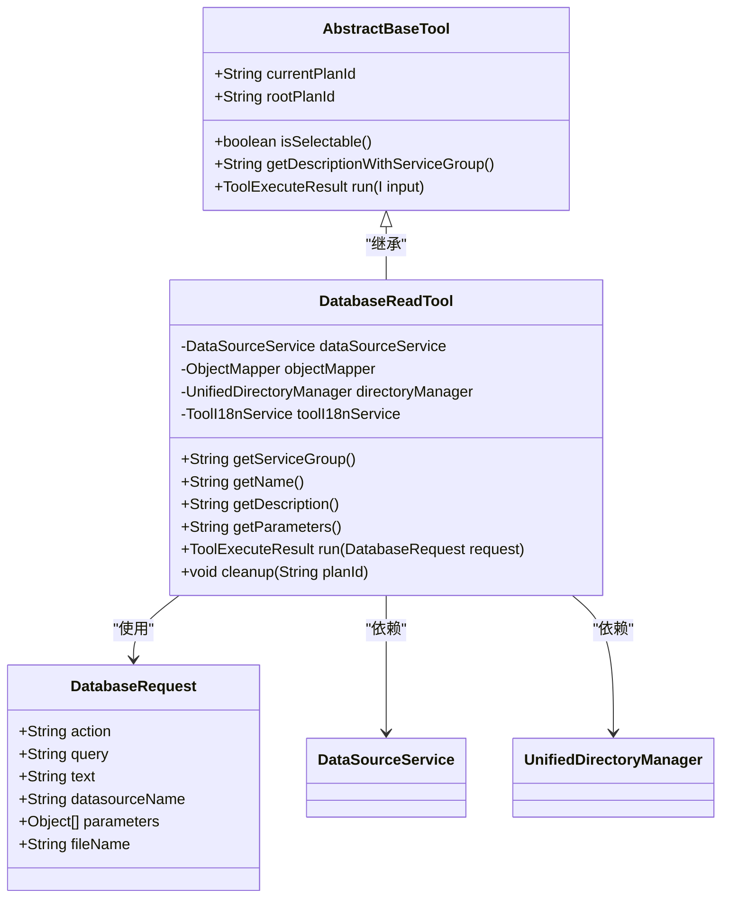
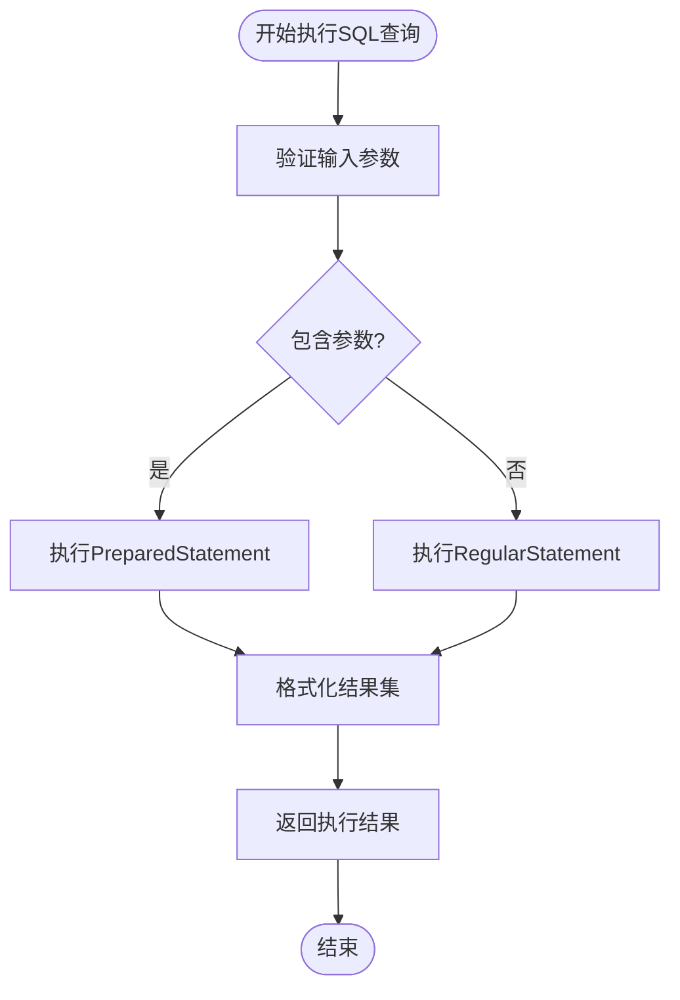
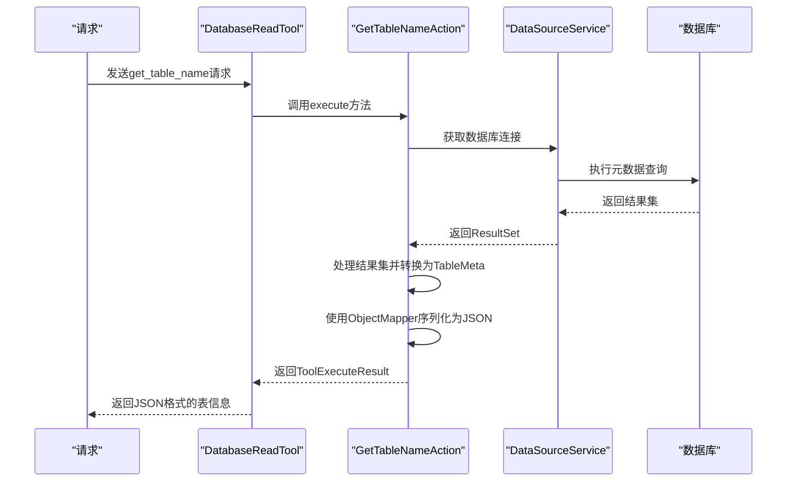
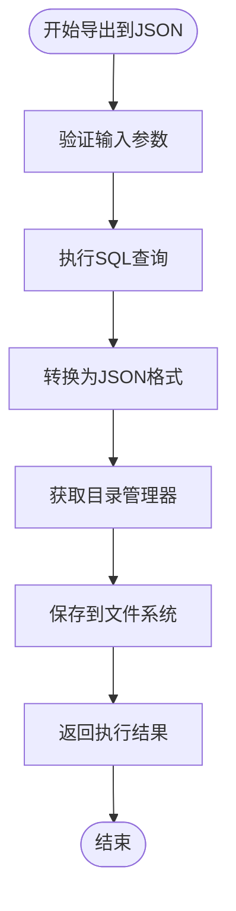
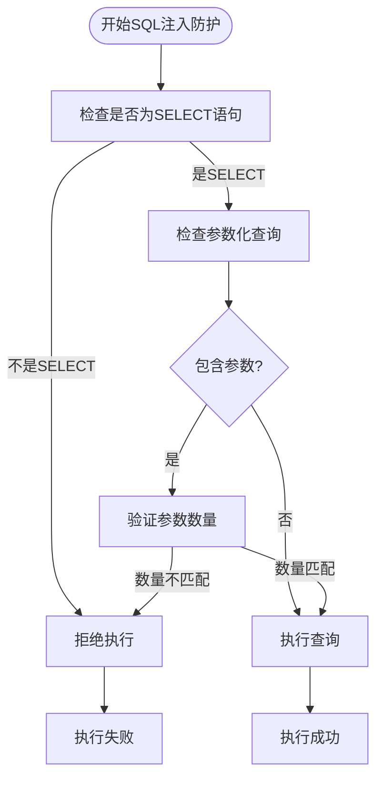
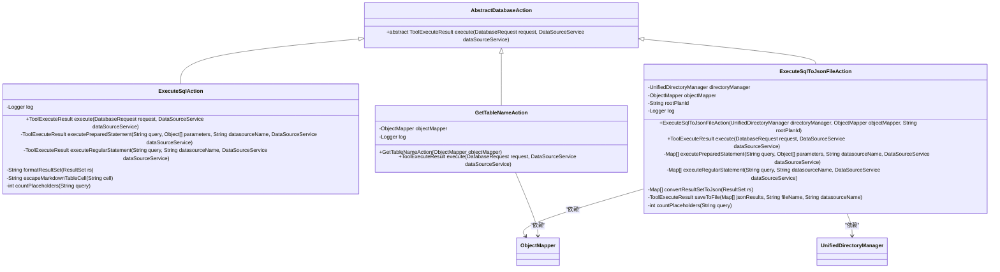
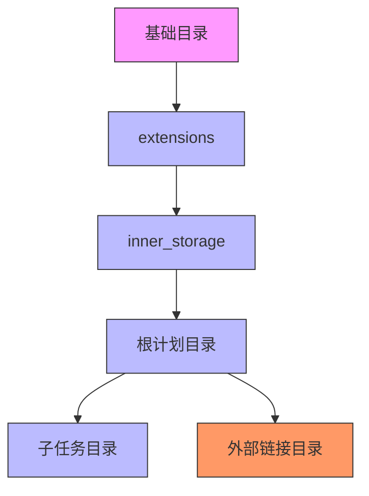
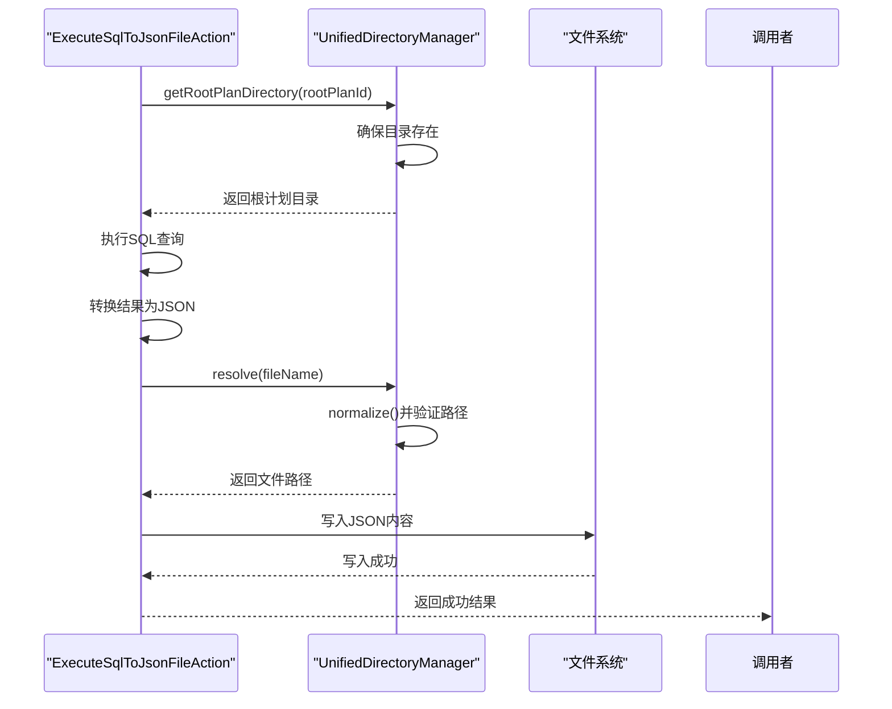
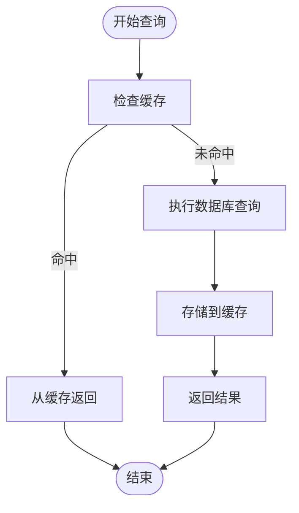

# 数据读取工具

<cite>
**本文档引用的文件**   
- [DatabaseReadTool.java](file://src/main/java/com/alibaba/cloud/ai/lynxe/tool/database/DatabaseReadTool.java)
- [AbstractBaseTool.java](file://src/main/java/com/alibaba/cloud/ai/lynxe/tool/AbstractBaseTool.java)
- [DatabaseRequest.java](file://src/main/java/com/alibaba/cloud/ai/lynxe/tool/database/DatabaseRequest.java)
- [ExecuteSqlAction.java](file://src/main/java/com/alibaba/cloud/ai/lynxe/tool/database/action/ExecuteSqlAction.java)
- [GetTableNameAction.java](file://src/main/java/com/alibaba/cloud/ai/lynxe/tool/database/action/GetTableNameAction.java)
- [ExecuteSqlToJsonFileAction.java](file://src/main/java/com/alibaba/cloud/ai/lynxe/tool/database/action/ExecuteSqlToJsonFileAction.java)
- [UnifiedDirectoryManager.java](file://src/main/java/com/alibaba/cloud/ai/lynxe/tool/filesystem/UnifiedDirectoryManager.java)
- [DataSourceService.java](file://src/main/java/com/alibaba/cloud/ai/lynxe/tool/database/DataSourceService.java)
- [DatabaseSqlGenerator.java](file://src/main/java/com/alibaba/cloud/ai/lynxe/tool/database/sql/DatabaseSqlGenerator.java)
- [database-read-tool-zh.yml](file://src/main/resources/i18n/tools/database-read-tool-zh.yml)
</cite>

## 目录
1. [简介](#简介)
2. [核心组件分析](#核心组件分析)
3. [架构与继承结构](#架构与继承结构)
4. [核心功能实现机制](#核心功能实现机制)
5. [SQL注入防护机制](#sql注入防护机制)
6. [操作类工作原理](#操作类工作原理)
7. [与UnifiedDirectoryManager协作流程](#与unifieddirectorymanager协作流程)
8. [实际代码示例](#实际代码示例)
9. [性能优化建议](#性能优化建议)
10. [结论](#结论)

## 简介
数据读取工具（DatabaseReadTool）是系统中用于安全执行数据库查询的核心组件。该工具专为只读操作设计，支持执行SELECT查询、获取表名和将查询结果导出到JSON文件三大核心功能。工具通过严格的SQL注入防护机制确保安全性，仅允许SELECT语句执行，并通过与UnifiedDirectoryManager的协作实现安全的文件系统操作。本工具继承自AbstractBaseTool，遵循统一的工具接口规范，支持多数据源环境下的灵活查询。

## 核心组件分析

**Section sources**
- [DatabaseReadTool.java](file://src/main/java/com/alibaba/cloud/ai/lynxe/tool/database/DatabaseReadTool.java#L35-L165)
- [DatabaseRequest.java](file://src/main/java/com/alibaba/cloud/ai/lynxe/tool/database/DatabaseRequest.java#L32-L202)
- [AbstractBaseTool.java](file://src/main/java/com/alibaba/cloud/ai/lynxe/tool/AbstractBaseTool.java#L28-L112)

## 架构与继承结构
数据读取工具采用分层架构设计，其核心继承自AbstractBaseTool基类，实现了统一的工具接口规范。这种设计模式确保了工具的一致性和可扩展性。



**Diagram sources **
- [DatabaseReadTool.java](file://src/main/java/com/alibaba/cloud/ai/lynxe/tool/database/DatabaseReadTool.java#L35-L165)
- [AbstractBaseTool.java](file://src/main/java/com/alibaba/cloud/ai/lynxe/tool/AbstractBaseTool.java#L28-L112)
- [DatabaseRequest.java](file://src/main/java/com/alibaba/cloud/ai/lynxe/tool/database/DatabaseRequest.java#L32-L202)

**Section sources**
- [DatabaseReadTool.java](file://src/main/java/com/alibaba/cloud/ai/lynxe/tool/database/DatabaseReadTool.java#L35-L165)
- [AbstractBaseTool.java](file://src/main/java/com/alibaba/cloud/ai/lynxe/tool/AbstractBaseTool.java#L28-L112)

## 核心功能实现机制
数据读取工具提供了三个核心功能：执行SQL查询、获取表名和导出查询结果到JSON文件。这些功能通过不同的操作类实现，确保了代码的模块化和可维护性。

### 执行SQL查询 (execute_read_sql)
该功能通过ExecuteSqlAction类实现，支持参数化查询和普通查询两种模式。当请求包含参数时，使用PreparedStatement执行查询；否则使用Statement执行。查询结果以Markdown表格格式返回，便于前端展示。



**Diagram sources **
- [ExecuteSqlAction.java](file://src/main/java/com/alibaba/cloud/ai/lynxe/tool/database/action/ExecuteSqlAction.java#L34-L246)

### 获取表名 (get_table_name)
该功能通过GetTableNameAction类实现，根据提供的文本搜索条件查找匹配的表名。工具首先根据数据库类型生成相应的元数据查询SQL，然后执行查询获取表信息，最后将结果序列化为JSON格式返回。



**Diagram sources **
- [GetTableNameAction.java](file://src/main/java/com/alibaba/cloud/ai/lynxe/tool/database/action/GetTableNameAction.java#L34-L115)
- [DatabaseSqlGenerator.java](file://src/main/java/com/alibaba/cloud/ai/lynxe/tool/database/sql/DatabaseSqlGenerator.java#L26-L257)

### 导出查询结果到JSON文件 (execute_read_sql_to_json_file)
该功能通过ExecuteSqlToJsonFileAction类实现，将SQL查询结果保存到指定的JSON文件中。工具首先执行查询获取数据，然后将结果转换为JSON格式，最后使用UnifiedDirectoryManager将文件保存到指定位置。



**Diagram sources **
- [ExecuteSqlToJsonFileAction.java](file://src/main/java/com/alibaba/cloud/ai/lynxe/tool/database/action/ExecuteSqlToJsonFileAction.java#L46-L291)

**Section sources**
- [ExecuteSqlAction.java](file://src/main/java/com/alibaba/cloud/ai/lynxe/tool/database/action/ExecuteSqlAction.java#L34-L246)
- [GetTableNameAction.java](file://src/main/java/com/alibaba/cloud/ai/lynxe/tool/database/action/GetTableNameAction.java#L34-L115)
- [ExecuteSqlToJsonFileAction.java](file://src/main/java/com/alibaba/cloud/ai/lynxe/tool/database/action/ExecuteSqlToJsonFileAction.java#L46-L291)

## SQL注入防护机制
数据读取工具实施了严格的SQL注入防护机制，确保只允许安全的SELECT查询操作。防护机制主要通过以下方式实现：

### SELECT语句验证
在执行任何查询之前，工具会验证SQL语句是否以"SELECT"开头。这是防止恶意写操作（如INSERT、UPDATE、DELETE）的第一道防线。

```java
// 在DatabaseReadTool中验证SELECT语句
if (query != null && !query.trim().toUpperCase().startsWith("SELECT")) {
    return new ToolExecuteResult("Only SELECT queries are allowed in read-only mode");
}
```

### 参数化查询支持
工具支持参数化查询，通过PreparedStatement防止SQL注入。参数值通过setObject方法安全地绑定到查询中，避免了字符串拼接带来的风险。

```java
// 在ExecuteSqlAction中设置参数
for (int i = 0; i < parameters.size(); i++) {
    Object param = parameters.get(i);
    if (param == null) {
        pstmt.setNull(i + 1, java.sql.Types.NULL);
    } else {
        pstmt.setObject(i + 1, param);
    }
}
```

### 参数数量验证
工具验证SQL查询中的占位符数量与提供的参数数量是否匹配，防止参数不匹配导致的异常或潜在安全问题。

```java
// 验证参数数量
int placeholderCount = countPlaceholders(query);
if (placeholderCount != parameters.size()) {
    String errorMsg = String.format("Parameter count mismatch: SQL query has %d placeholder(s) (?), but %d parameter(s) provided.", 
                                   placeholderCount, parameters.size());
    return new ToolExecuteResult("Datasource: " + (datasourceName != null ? datasourceName : "default") + "\nError: " + errorMsg);
}
```



**Diagram sources **
- [DatabaseReadTool.java](file://src/main/java/com/alibaba/cloud/ai/lynxe/tool/database/DatabaseReadTool.java#L97-L109)
- [ExecuteSqlAction.java](file://src/main/java/com/alibaba/cloud/ai/lynxe/tool/database/action/ExecuteSqlAction.java#L62-L115)
- [ExecuteSqlToJsonFileAction.java](file://src/main/java/com/alibaba/cloud/ai/lynxe/tool/database/action/ExecuteSqlToJsonFileAction.java#L81-L84)

**Section sources**
- [DatabaseReadTool.java](file://src/main/java/com/alibaba/cloud/ai/lynxe/tool/database/DatabaseReadTool.java#L97-L109)
- [ExecuteSqlAction.java](file://src/main/java/com/alibaba/cloud/ai/lynxe/tool/database/action/ExecuteSqlAction.java#L62-L115)

## 操作类工作原理
数据读取工具的操作类采用策略模式设计，每个操作类负责特定的功能实现。所有操作类都继承自AbstractDatabaseAction抽象类，实现了统一的execute接口。

### ExecuteSqlAction
该类负责执行SQL查询操作，支持参数化查询和普通查询两种模式。对于参数化查询，使用PreparedStatement提高性能和安全性；对于普通查询，支持分号分隔的多条SQL语句执行。



**Diagram sources **
- [AbstractDatabaseAction.java](file://src/main/java/com/alibaba/cloud/ai/lynxe/tool/database/action/AbstractDatabaseAction.java#L23-L34)
- [ExecuteSqlAction.java](file://src/main/java/com/alibaba/cloud/ai/lynxe/tool/database/action/ExecuteSqlAction.java#L34-L246)
- [GetTableNameAction.java](file://src/main/java/com/alibaba/cloud/ai/lynxe/tool/database/action/GetTableNameAction.java#L34-L115)
- [ExecuteSqlToJsonFileAction.java](file://src/main/java/com/alibaba/cloud/ai/lynxe/tool/database/action/ExecuteSqlToJsonFileAction.java#L46-L291)

### GetTableNameAction
该类负责根据文本搜索条件获取表名。它利用DatabaseSqlGenerator根据数据库类型生成相应的元数据查询SQL，然后执行查询获取表信息，并将结果序列化为JSON格式。

### ExecuteSqlToJsonFileAction
该类负责将SQL查询结果导出到JSON文件。它不仅执行查询，还将结果转换为JSON格式，并使用UnifiedDirectoryManager将文件保存到指定位置。该类特别处理了文件路径的安全性验证，确保文件只能保存在允许的目录范围内。

**Section sources**
- [AbstractDatabaseAction.java](file://src/main/java/com/alibaba/cloud/ai/lynxe/tool/database/action/AbstractDatabaseAction.java#L23-L34)
- [ExecuteSqlAction.java](file://src/main/java/com/alibaba/cloud/ai/lynxe/tool/database/action/ExecuteSqlAction.java#L34-L246)
- [GetTableNameAction.java](file://src/main/java/com/alibaba/cloud/ai/lynxe/tool/database/action/GetTableNameAction.java#L34-L115)
- [ExecuteSqlToJsonFileAction.java](file://src/main/java/com/alibaba/cloud/ai/lynxe/tool/database/action/ExecuteSqlToJsonFileAction.java#L46-L291)

## 与UnifiedDirectoryManager协作流程
数据读取工具与UnifiedDirectoryManager紧密协作，确保文件操作的安全性和一致性。UnifiedDirectoryManager提供了一个统一的文件系统管理接口，控制所有工具的文件访问权限。

### 目录结构管理
UnifiedDirectoryManager管理着系统的目录结构，包括工作目录、根计划目录和子任务目录。所有文件操作都必须通过该管理器进行，确保操作在安全范围内。



### 安全性验证
UnifiedDirectoryManager实施严格的安全性验证，确保所有文件操作都在允许的范围内。它通过isPathAllowed方法验证路径是否在工作目录内，防止路径遍历攻击。

```java
// 在UnifiedDirectoryManager中验证路径安全性
public boolean isPathAllowed(Path targetPath) {
    try {
        Path workingDir = getWorkingDirectory().toAbsolutePath().normalize();
        Path normalizedTarget = targetPath.toAbsolutePath().normalize();
        
        // 检查目标路径是否在工作目录内
        boolean isWithinWorkingDir = normalizedTarget.startsWith(workingDir);
        
        log.debug("路径验证 - 工作目录: {}, 目标: {}, 是否在内: {}, 是否允许: {}", 
                  workingDir, normalizedTarget, isWithinWorkingDir, isWithinWorkingDir);
        
        return isWithinWorkingDir;
    } catch (Exception e) {
        log.error("验证路径时出错: {}", targetPath, e);
        return false;
    }
}
```

### 文件保存流程
当ExecuteSqlToJsonFileAction需要保存文件时，它通过UnifiedDirectoryManager获取根计划目录，并在该目录下创建文件。整个流程确保了文件保存的安全性和一致性。



**Diagram sources **
- [UnifiedDirectoryManager.java](file://src/main/java/com/alibaba/cloud/ai/lynxe/tool/filesystem/UnifiedDirectoryManager.java#L35-L439)
- [ExecuteSqlToJsonFileAction.java](file://src/main/java/com/alibaba/cloud/ai/lynxe/tool/database/action/ExecuteSqlToJsonFileAction.java#L221-L261)

**Section sources**
- [UnifiedDirectoryManager.java](file://src/main/java/com/alibaba/cloud/ai/lynxe/tool/filesystem/UnifiedDirectoryManager.java#L35-L439)
- [ExecuteSqlToJsonFileAction.java](file://src/main/java/com/alibaba/cloud/ai/lynxe/tool/database/action/ExecuteSqlToJsonFileAction.java#L221-L261)

## 实际代码示例
以下示例展示了如何使用数据读取工具执行各种操作。

### 安全执行查询
```json
{
  "action": "execute_read_sql",
  "query": "SELECT * FROM users WHERE status = ?",
  "parameters": ["active"],
  "datasourceName": "primary_db"
}
```

### 通过自然语言获取表名
```json
{
  "action": "get_table_name",
  "text": "用户",
  "datasourceName": "primary_db"
}
```

### 将结果导出到文件系统
```json
{
  "action": "execute_read_sql_to_json_file",
  "query": "SELECT id, name, email FROM users WHERE created_date > ?",
  "parameters": ["2023-01-01"],
  "fileName": "user_data.json",
  "datasourceName": "primary_db"
}
```

**Section sources**
- [database-read-tool-zh.yml](file://src/main/resources/i18n/tools/database-read-tool-zh.yml#L1-L48)

## 性能优化建议
为了确保数据读取工具的高效运行，建议采用以下性能优化策略：

### 查询缓存策略
对于频繁执行的相同查询，建议实现查询结果缓存。可以使用内存缓存（如Redis）存储查询结果，设置合理的过期时间。



### 大数据集分页处理
对于可能返回大量数据的查询，建议使用分页处理。通过LIMIT和OFFSET子句或游标分页，避免一次性加载过多数据。

```sql
-- 使用LIMIT和OFFSET分页
SELECT * FROM large_table ORDER BY id LIMIT 100 OFFSET 0;

-- 使用游标分页（推荐）
SELECT * FROM large_table WHERE id > last_id ORDER BY id LIMIT 100;
```

### 连接池优化
确保DataSourceService配置了适当的连接池参数，如最大连接数、最小空闲连接数和连接超时时间，以提高数据库连接的复用率和性能。

### 索引优化
建议在经常查询的列上创建适当的索引，特别是WHERE子句、JOIN条件和ORDER BY子句中使用的列。

**Section sources**
- [ExecuteSqlAction.java](file://src/main/java/com/alibaba/cloud/ai/lynxe/tool/database/action/ExecuteSqlAction.java#L156-L216)
- [DataSourceService.java](file://src/main/java/com/alibaba/cloud/ai/lynxe/tool/database/DataSourceService.java#L32-L215)

## 结论
数据读取工具是一个功能强大且安全的数据库查询组件，通过继承AbstractBaseTool实现了统一的工具接口规范。工具的三大核心功能——执行SQL查询、获取表名和导出查询结果到JSON文件——都通过专门的操作类实现，确保了代码的模块化和可维护性。严格的SQL注入防护机制和与UnifiedDirectoryManager的协作确保了操作的安全性。通过采用查询缓存和分页处理等性能优化策略，可以进一步提升工具的效率和响应速度。