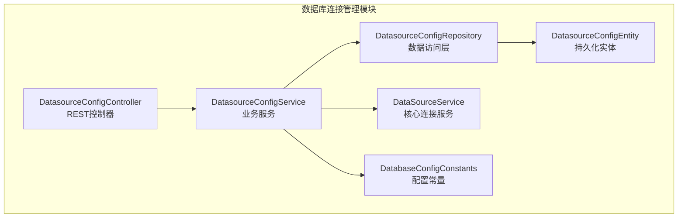
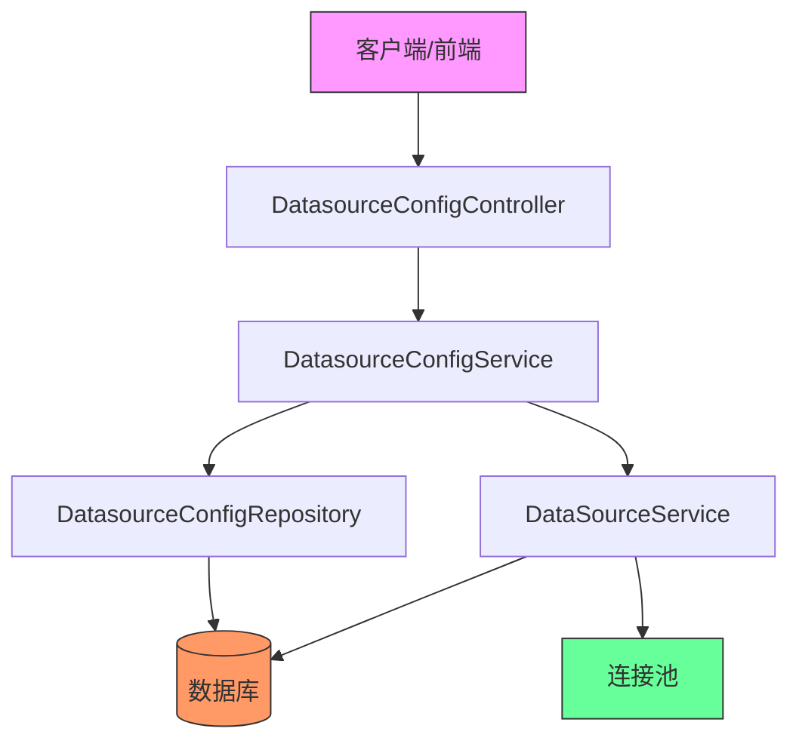
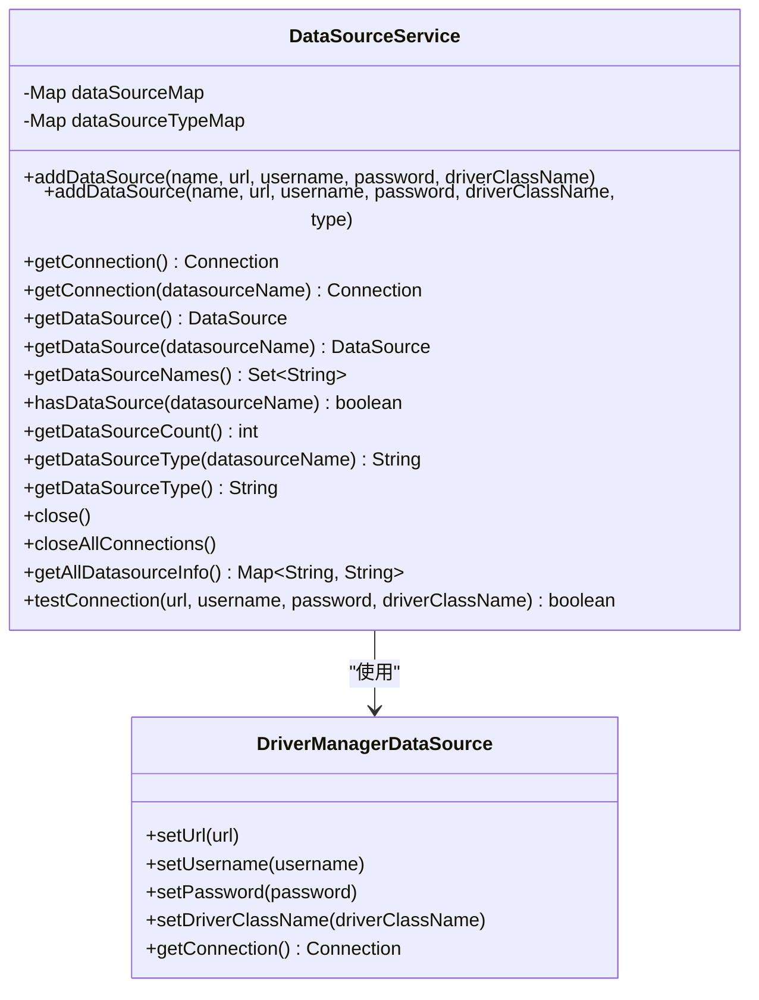
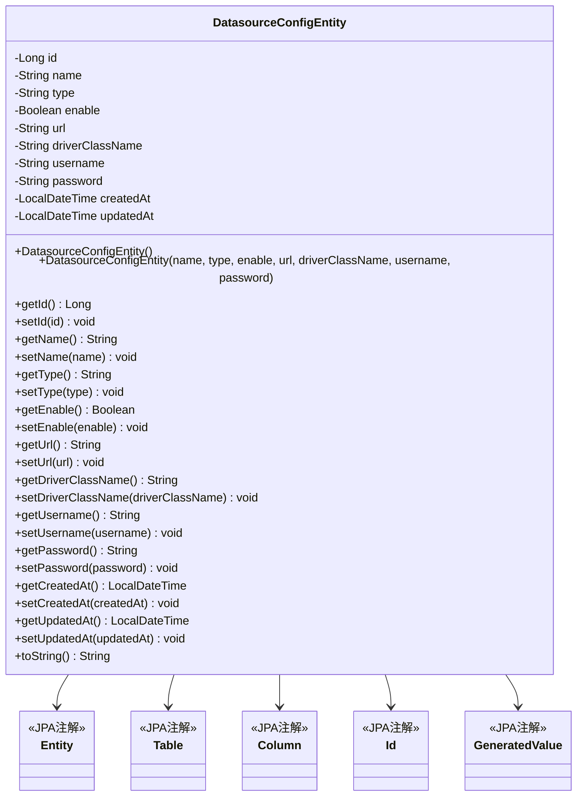
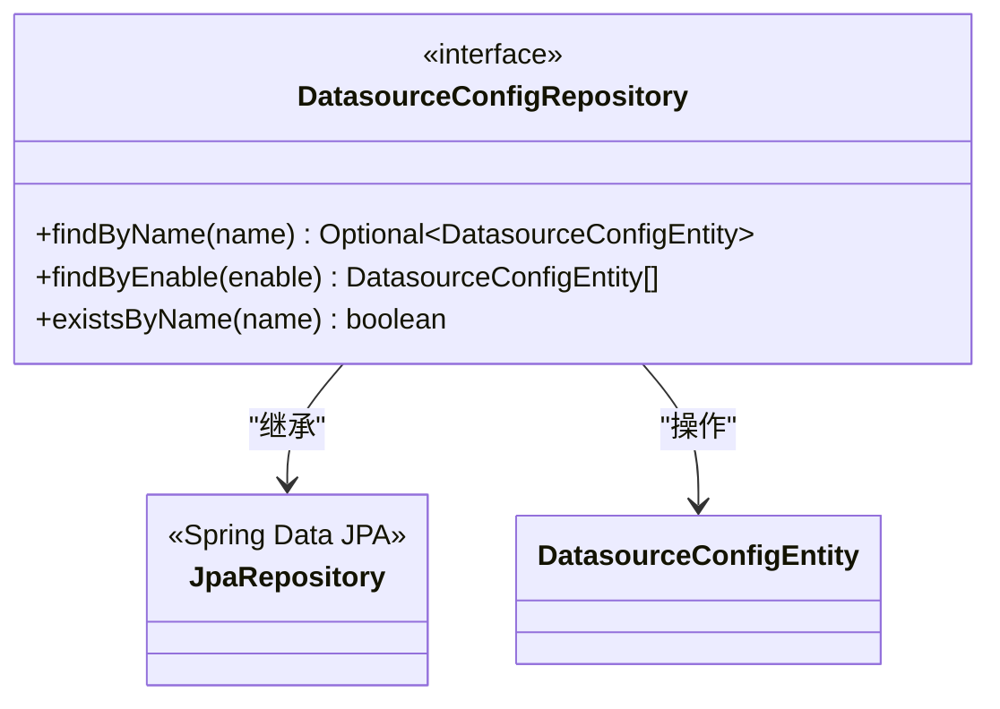
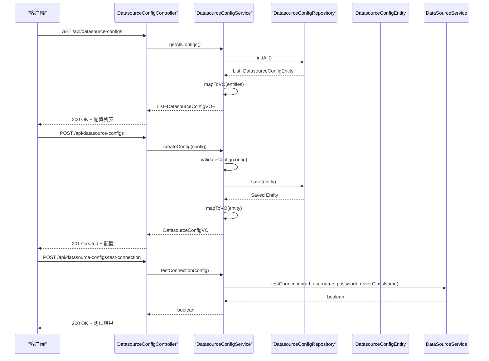
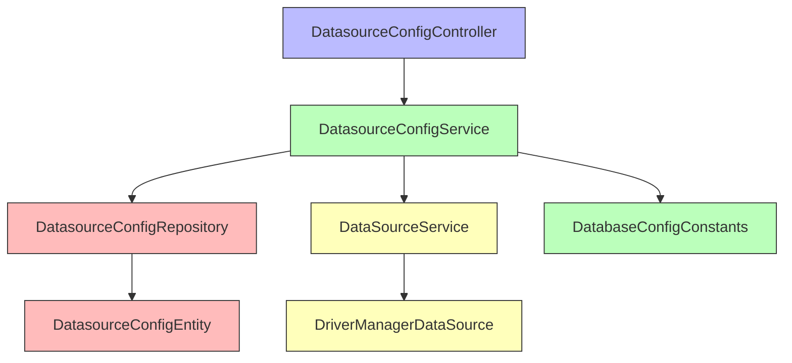

# 连接管理与配置

<cite>
**本文档引用的文件**  
- [DataSourceService.java](file://src/main/java/com/alibaba/cloud/ai/lynxe/tool/database/DataSourceService.java)
- [DatasourceConfigEntity.java](file://src/main/java/com/alibaba/cloud/ai/lynxe/tool/database/model/po/DatasourceConfigEntity.java)
- [DatasourceConfigRepository.java](file://src/main/java/com/alibaba/cloud/ai/lynxe/tool/database/repository/DatasourceConfigRepository.java)
- [DatasourceConfigController.java](file://src/main/java/com/alibaba/cloud/ai/lynxe/tool/database/controller/DatasourceConfigController.java)
- [DatabaseConfigConstants.java](file://src/main/java/com/alibaba/cloud/ai/lynxe/tool/database/DatabaseConfigConstants.java)
- [DatasourceConfigService.java](file://src/main/java/com/alibaba/cloud/ai/lynxe/tool/database/service/DatasourceConfigService.java)
- [application.yml](file://src/main/resources/application.yml)
- [application-mysql.yml](file://src/main/resources/application-mysql.yml)
- [application-postgres.yml](file://src/main/resources/application-postgres.yml)
</cite>

## 目录
1. [简介](#简介)
2. [项目结构](#项目结构)
3. [核心组件](#核心组件)
4. [架构概述](#架构概述)
5. [详细组件分析](#详细组件分析)
6. [依赖分析](#依赖分析)
7. [性能考虑](#性能考虑)
8. [故障排除指南](#故障排除指南)
9. [结论](#结论)

## 简介
本文档详细介绍了JManus项目中数据库连接管理与配置的核心机制。重点分析了DataSourceService作为数据库连接核心服务的设计与实现，深入探讨了DatasourceConfigEntity实体类的结构和字段含义，以及与ConfigRepository的持久化机制。文档还解释了多数据源支持的实现原理，包括默认数据源和命名数据源的管理策略。通过实际代码示例展示了如何通过DatasourceConfigController配置数据源、测试连接状态和管理连接池。同时，文档包含了安全最佳实践，如敏感信息加密存储和连接超时配置，并说明了高可用性设计，包括连接重试机制和故障转移策略。

## 项目结构
JManus项目的数据库连接管理相关代码主要位于`src/main/java/com/alibaba/cloud/ai/lynxe/tool/database`目录下，形成了一个完整的数据源管理模块。该模块采用典型的分层架构，包含控制器、服务、实体、仓库和核心服务组件。

**图示来源**  
- [DatasourceConfigController.java](file://src/main/java/com/alibaba/cloud/ai/lynxe/tool/database/controller/DatasourceConfigController.java)
- [DatasourceConfigService.java](file://src/main/java/com/alibaba/cloud/ai/lynxe/tool/database/service/DatasourceConfigService.java)
- [DatasourceConfigRepository.java](file://src/main/java/com/alibaba/cloud/ai/lynxe/tool/database/repository/DatasourceConfigRepository.java)
- [DatasourceConfigEntity.java](file://src/main/java/com/alibaba/cloud/ai/lynxe/tool/database/model/po/DatasourceConfigEntity.java)
- [DataSourceService.java](file://src/main/java/com/alibaba/cloud/ai/lynxe/tool/database/DataSourceService.java)
- [DatabaseConfigConstants.java](file://src/main/java/com/alibaba/cloud/ai/lynxe/tool/database/DatabaseConfigConstants.java)

## 核心组件

本文档的核心组件包括DataSourceService、DatasourceConfigEntity、DatasourceConfigRepository和DatasourceConfigController。DataSourceService是数据库连接的核心服务，负责管理所有数据源的连接和生命周期。DatasourceConfigEntity是数据源配置的持久化实体，定义了数据源的所有配置属性。DatasourceConfigRepository是数据访问层，提供了对数据源配置的CRUD操作。DatasourceConfigController是REST控制器，暴露了管理数据源配置的API接口。

**本节来源**  
- [DataSourceService.java](file://src/main/java/com/alibaba/cloud/ai/lynxe/tool/database/DataSourceService.java)
- [DatasourceConfigEntity.java](file://src/main/java/com/alibaba/cloud/ai/lynxe/tool/database/model/po/DatasourceConfigEntity.java)
- [DatasourceConfigRepository.java](file://src/main/java/com/alibaba/cloud/ai/lynxe/tool/database/repository/DatasourceConfigRepository.java)
- [DatasourceConfigController.java](file://src/main/java/com/alibaba/cloud/ai/lynxe/tool/database/controller/DatasourceConfigController.java)

## 架构概述
JManus项目的数据库连接管理采用分层架构设计，从上到下分为控制器层、服务层、数据访问层和核心服务层。这种设计实现了关注点分离，提高了代码的可维护性和可测试性。

**图示来源**  
- [DatasourceConfigController.java](file://src/main/java/com/alibaba/cloud/ai/lynxe/tool/database/controller/DatasourceConfigController.java)
- [DatasourceConfigService.java](file://src/main/java/com/alibaba/cloud/ai/lynxe/tool/database/service/DatasourceConfigService.java)
- [DatasourceConfigRepository.java](file://src/main/java/com/alibaba/cloud/ai/lynxe/tool/database/repository/DatasourceConfigRepository.java)
- [DataSourceService.java](file://src/main/java/com/alibaba/cloud/ai/lynxe/tool/database/DataSourceService.java)

## 详细组件分析

### DataSourceService分析
DataSourceService是数据库连接管理的核心服务类，负责管理所有数据源的连接和生命周期。它使用ConcurrentHashMap来存储数据源，确保线程安全。服务提供了添加数据源、获取连接、测试连接等关键功能。

**图示来源**  
- [DataSourceService.java](file://src/main/java/com/alibaba/cloud/ai/lynxe/tool/database/DataSourceService.java)

**本节来源**  
- [DataSourceService.java](file://src/main/java/com/alibaba/cloud/ai/lynxe/tool/database/DataSourceService.java)

### DatasourceConfigEntity分析
DatasourceConfigEntity是数据源配置的持久化实体类，使用JPA注解映射到数据库表。它定义了数据源的所有配置属性，包括名称、类型、启用状态、URL、驱动类名、用户名、密码以及创建和更新时间戳。

**图示来源**  
- [DatasourceConfigEntity.java](file://src/main/java/com/alibaba/cloud/ai/lynxe/tool/database/model/po/DatasourceConfigEntity.java)

**本节来源**  
- [DatasourceConfigEntity.java](file://src/main/java/com/alibaba/cloud/ai/lynxe/tool/database/model/po/DatasourceConfigEntity.java)

### DatasourceConfigRepository分析
DatasourceConfigRepository是数据访问层接口，继承自JpaRepository，提供了对数据源配置的基本CRUD操作。它还定义了几个自定义查询方法，用于根据名称查找数据源、查找启用的数据源以及检查名称是否存在。

**图示来源**  
- [DatasourceConfigRepository.java](file://src/main/java/com/alibaba/cloud/ai/lynxe/tool/database/repository/DatasourceConfigRepository.java)

**本节来源**  
- [DatasourceConfigRepository.java](file://src/main/java/com/alibaba/cloud/ai/lynxe/tool/database/repository/DatasourceConfigRepository.java)

### DatasourceConfigController分析
DatasourceConfigController是REST控制器，暴露了管理数据源配置的API接口。它使用Spring MVC注解定义了HTTP端点，处理来自客户端的请求，并调用服务层进行业务逻辑处理。

**图示来源**  
- [DatasourceConfigController.java](file://src/main/java/com/alibaba/cloud/ai/lynxe/tool/database/controller/DatasourceConfigController.java)
- [DatasourceConfigService.java](file://src/main/java/com/alibaba/cloud/ai/lynxe/tool/database/service/DatasourceConfigService.java)
- [DataSourceService.java](file://src/main/java/com/alibaba/cloud/ai/lynxe/tool/database/DataSourceService.java)

**本节来源**  
- [DatasourceConfigController.java](file://src/main/java/com/alibaba/cloud/ai/lynxe/tool/database/controller/DatasourceConfigController.java)

## 依赖分析
数据库连接管理模块的依赖关系清晰，遵循了依赖倒置原则。高层模块依赖于抽象，而不是具体实现。这种设计使得系统更加灵活和可扩展。

**图示来源**  
- [DatasourceConfigController.java](file://src/main/java/com/alibaba/cloud/ai/lynxe/tool/database/controller/DatasourceConfigController.java)
- [DatasourceConfigService.java](file://src/main/java/com/alibaba/cloud/ai/lynxe/tool/database/service/DatasourceConfigService.java)
- [DatasourceConfigRepository.java](file://src/main/java/com/alibaba/cloud/ai/lynxe/tool/database/repository/DatasourceConfigRepository.java)
- [DataSourceService.java](file://src/main/java/com/alibaba/cloud/ai/lynxe/tool/database/DataSourceService.java)
- [DatabaseConfigConstants.java](file://src/main/java/com/alibaba/cloud/ai/lynxe/tool/database/DatabaseConfigConstants.java)
- [DatasourceConfigEntity.java](file://src/main/java/com/alibaba/cloud/ai/lynxe/tool/database/model/po/DatasourceConfigEntity.java)

**本节来源**  
- [DatasourceConfigController.java](file://src/main/java/com/alibaba/cloud/ai/lynxe/tool/database/controller/DatasourceConfigController.java)
- [DatasourceConfigService.java](file://src/main/java/com/alibaba/cloud/ai/lynxe/tool/database/service/DatasourceConfigService.java)
- [DatasourceConfigRepository.java](file://src/main/java/com/alibaba/cloud/ai/lynxe/tool/database/repository/DatasourceConfigRepository.java)
- [DataSourceService.java](file://src/main/java/com/alibaba/cloud/ai/lynxe/tool/database/DataSourceService.java)
- [DatabaseConfigConstants.java](file://src/main/java/com/alibaba/cloud/ai/lynxe/tool/database/DatabaseConfigConstants.java)

## 性能考虑
在数据库连接管理方面，性能考虑主要集中在连接池配置、连接测试和资源管理上。通过合理的配置，可以确保系统在高并发场景下的稳定性和响应速度。

| 配置项 | 推荐值 | 说明 |
|--------|--------|------|
| maximum-pool-size | 20 | 最大连接池大小，根据应用负载调整 |
| minimum-idle | 5 | 最小空闲连接数，避免频繁创建连接 |
| connection-timeout | 30000ms | 连接超时时间，避免长时间等待 |
| idle-timeout | 600000ms | 空闲连接超时时间，及时释放资源 |
| max-lifetime | 1800000ms | 连接最大生命周期，防止连接老化 |
| leak-detection-threshold | 60000ms | 连接泄漏检测阈值，及时发现资源泄漏 |

**本节来源**  
- [application.yml](file://src/main/resources/application.yml)

## 故障排除指南
在配置和使用数据库连接时，可能会遇到各种问题。以下是一些常见问题及其解决方案：

1. **连接测试失败**：检查URL、用户名、密码和驱动类名是否正确，确保数据库服务正在运行。
2. **连接池耗尽**：增加maximum-pool-size的值，或优化应用程序的连接使用。
3. **连接泄漏**：确保所有数据库操作后都正确关闭连接，使用try-with-resources语句。
4. **配置不生效**：检查配置文件的激活profile是否正确，确保配置项的路径和名称正确。
5. **性能问题**：监控连接池的使用情况，调整连接池参数，优化SQL查询。

**本节来源**  
- [DataSourceService.java](file://src/main/java/com/alibaba/cloud/ai/lynxe/tool/database/DataSourceService.java)
- [DatasourceConfigController.java](file://src/main/java/com/alibaba/cloud/ai/lynxe/tool/database/controller/DatasourceConfigController.java)
- [application.yml](file://src/main/resources/application.yml)

## 结论
JManus项目的数据库连接管理与配置机制设计合理，实现了数据源的动态管理和高可用性。通过DataSourceService核心服务、DatasourceConfigEntity持久化实体、DatasourceConfigRepository数据访问层和DatasourceConfigController REST控制器的协同工作，提供了一套完整的数据源管理解决方案。系统支持多数据源配置，具备连接测试、连接池管理、故障转移等高级功能，同时遵循了安全最佳实践。通过合理的配置和监控，可以确保系统在各种负载下的稳定运行。