# 文件处理工具

<cite>
**本文档引用的文件**   
- [MarkdownConverterTool.java](file://src/main/java/com/alibaba/cloud/ai/lynxe/tool/convertToMarkdown/MarkdownConverterTool.java)
- [ExcelToMarkdownProcessor.java](file://src/main/java/com/alibaba/cloud/ai/lynxe/tool/convertToMarkdown/ExcelToMarkdownProcessor.java)
- [PdfToMarkdownProcessor.java](file://src/main/java/com/alibaba/cloud/ai/lynxe/tool/convertToMarkdown/PdfToMarkdownProcessor.java)
- [WordToMarkdownProcessor.java](file://src/main/java/com/alibaba/cloud/ai/lynxe/tool/convertToMarkdown/WordToMarkdownProcessor.java)
- [TextToMarkdownProcessor.java](file://src/main/java/com/alibaba/cloud/ai/lynxe/tool/convertToMarkdown/TextToMarkdownProcessor.java)
- [ImageOcrProcessor.java](file://src/main/java/com/alibaba/cloud/ai/lynxe/tool/convertToMarkdown/ImageOcrProcessor.java)
- [PdfOcrProcessor.java](file://src/main/java/com/alibaba/cloud/ai/lynxe/tool/convertToMarkdown/PdfOcrProcessor.java)
- [ExcelProcessingService.java](file://src/main/java/com/alibaba/cloud/ai/lynxe/tool/excelProcessor/ExcelProcessingService.java)
- [TableProcessingService.java](file://src/main/java/com/alibaba/cloud/ai/lynxe/tool/tableProcessor/TableProcessingService.java)
- [TextFileService.java](file://src/main/java/com/alibaba/cloud/ai/lynxe/tool/textOperator/TextFileService.java)
- [UnifiedDirectoryManager.java](file://src/main/java/com/alibaba/cloud/ai/lynxe/tool/filesystem/UnifiedDirectoryManager.java)
</cite>

## 目录
1. [简介](#简介)
2. [核心组件](#核心组件)
3. [文档转换能力](#文档转换能力)
4. [Excel数据处理](#excel数据处理)
5. [表格数据操作](#表格数据操作)
6. [文本文件处理](#文本文件处理)
7. [统一文件系统访问](#统一文件系统访问)
8. [关键技术实现](#关键技术实现)
9. [错误处理与性能优化](#错误处理与性能优化)
10. [使用示例](#使用示例)

## 简介
文件处理工具是一套完整的文件转换和处理系统，旨在将各种格式的文件转换为AI可处理的Markdown内容。该系统通过`MarkdownConverterTool`作为核心入口，支持多种文件格式的转换，包括Word文档、Excel文件、PDF文件、图像文件和各种文本文件。系统集成了`ExcelProcessingService`用于Excel文件的数据提取与处理，`TableProcessingService`用于表格数据的操作支持，以及`TextFileService`提供的文本文件读写功能。`UnifiedDirectoryManager`提供了统一的文件系统访问接口，确保文件操作的安全性和一致性。系统还实现了文件格式识别、编码处理和大文件流式处理等关键技术，通过具体的错误处理机制和性能优化策略，确保了文件处理的高效性和可靠性。

## 核心组件

文件处理工具的核心组件包括`MarkdownConverterTool`、`ExcelProcessingService`、`TableProcessingService`、`TextFileService`和`UnifiedDirectoryManager`。`MarkdownConverterTool`是文件转换的入口，负责调度各种处理器将不同格式的文件转换为Markdown。`ExcelProcessingService`提供了对Excel文件的全面支持，包括创建、读取、写入和验证数据。`TableProcessingService`专注于表格数据的操作，支持创建表、读取结构、写入数据和搜索行。`TextFileService`提供了文本文件的读写功能，支持多种文本格式。`UnifiedDirectoryManager`作为统一的文件系统访问接口，管理着工作目录、计划目录和任务目录，确保所有文件操作都在安全的范围内进行。

**Section sources**
- [MarkdownConverterTool.java](file://src/main/java/com/alibaba/cloud/ai/lynxe/tool/convertToMarkdown/MarkdownConverterTool.java#L1-L385)
- [ExcelProcessingService.java](file://src/main/java/com/alibaba/cloud/ai/lynxe/tool/excelProcessor/ExcelProcessingService.java#L1-L1722)
- [TableProcessingService.java](file://src/main/java/com/alibaba/cloud/ai/lynxe/tool/tableProcessor/TableProcessingService.java#L1-L800)
- [TextFileService.java](file://src/main/java/com/alibaba/cloud/ai/lynxe/tool/textOperator/TextFileService.java#L1-L355)
- [UnifiedDirectoryManager.java](file://src/main/java/com/alibaba/cloud/ai/lynxe/tool/filesystem/UnifiedDirectoryManager.java#L1-L439)

## 文档转换能力

### MarkdownConverterTool
`MarkdownConverterTool`是文件处理工具的核心，负责将各种格式的文件转换为Markdown格式。它支持Word文档（.doc, .docx）、Excel文件（.xlsx, .xls）、PDF文件（.pdf）、图像文件（.jpg, .jpeg, .png, .gif）以及多种文本文件（.txt, .md, .json, .xml, .yaml, .yml, .log, .java, .py, .js, .html, .css）。工具通过`run`方法接收输入参数，包括文件名、附加要求和是否强制使用LLM进行PDF转换。它首先验证输入，然后根据文件扩展名调度相应的处理器进行转换。

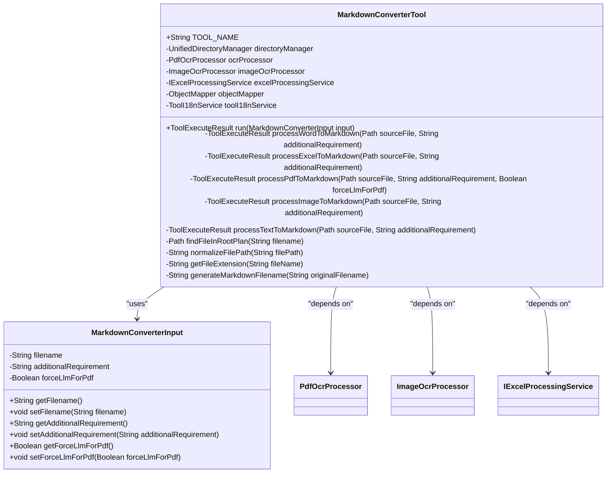
```mermaid
classDiagram
class MarkdownConverterTool {
+String TOOL_NAME
-UnifiedDirectoryManager directoryManager
-PdfOcrProcessor ocrProcessor
-ImageOcrProcessor imageOcrProcessor
-IExcelProcessingService excelProcessingService
-ObjectMapper objectMapper
-ToolI18nService toolI18nService
+ToolExecuteResult run(MarkdownConverterInput input)
-ToolExecuteResult processWordToMarkdown(Path sourceFile, String additionalRequirement)
-ToolExecuteResult processExcelToMarkdown(Path sourceFile, String additionalRequirement)
-ToolExecuteResult processPdfToMarkdown(Path sourceFile, String additionalRequirement, Boolean forceLlmForPdf)
-ToolExecuteResult processImageToMarkdown(Path sourceFile, String additionalRequirement)
-ToolExecuteResult processTextToMarkdown(Path sourceFile, String additionalRequirement)
-Path findFileInRootPlan(String filename)
-String normalizeFilePath(String filePath)
-String getFileExtension(String fileName)
-String generateMarkdownFilename(String originalFilename)
}
class MarkdownConverterInput {
-String filename
-String additionalRequirement
-Boolean forceLlmForPdf
+String getFilename()
+void setFilename(String filename)
+String getAdditionalRequirement()
+void setAdditionalRequirement(String additionalRequirement)
+Boolean getForceLlmForPdf()
+void setForceLlmForPdf(Boolean forceLlmForPdf)
}
MarkdownConverterTool --> MarkdownConverterInput : "uses"
MarkdownConverterTool --> PdfOcrProcessor : "depends on"
MarkdownConverterTool --> ImageOcrProcessor : "depends on"
MarkdownConverterTool --> IExcelProcessingService : "depends on"
```

**Diagram sources **
- [MarkdownConverterTool.java](file://src/main/java/com/alibaba/cloud/ai/lynxe/tool/convertToMarkdown/MarkdownConverterTool.java#L39-L384)

**Section sources**
- [MarkdownConverterTool.java](file://src/main/java/com/alibaba/cloud/ai/lynxe/tool/convertToMarkdown/MarkdownConverterTool.java#L39-L384)

### ExcelToMarkdownProcessor
`ExcelToMarkdownProcessor`负责将Excel文件转换为Markdown格式。它使用`ExcelProcessingService`提取Excel文件的结构和数据，然后将这些数据格式化为Markdown表格。处理器首先检查目标Markdown文件是否已存在，如果不存在，则提取Excel文件的结构信息和数据内容，然后将这些内容转换为Markdown格式并保存到文件中。

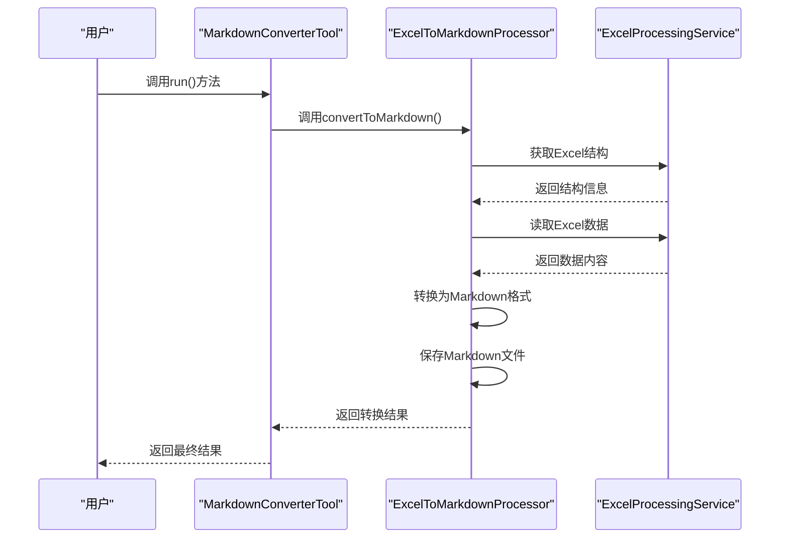
```mermaid
sequenceDiagram
participant User as "用户"
participant Converter as "MarkdownConverterTool"
participant ExcelProcessor as "ExcelToMarkdownProcessor"
participant ExcelService as "ExcelProcessingService"
User->>Converter : 调用run()方法
Converter->>ExcelProcessor : 调用convertToMarkdown()
ExcelProcessor->>ExcelService : 获取Excel结构
ExcelService-->>ExcelProcessor : 返回结构信息
ExcelProcessor->>ExcelService : 读取Excel数据
ExcelService-->>ExcelProcessor : 返回数据内容
ExcelProcessor->>ExcelProcessor : 转换为Markdown格式
ExcelProcessor->>ExcelProcessor : 保存Markdown文件
ExcelProcessor-->>Converter : 返回转换结果
Converter-->>User : 返回最终结果
```

**Diagram sources **
- [ExcelToMarkdownProcessor.java](file://src/main/java/com/alibaba/cloud/ai/lynxe/tool/convertToMarkdown/ExcelToMarkdownProcessor.java#L44-L597)

**Section sources**
- [ExcelToMarkdownProcessor.java](file://src/main/java/com/alibaba/cloud/ai/lynxe/tool/convertToMarkdown/ExcelToMarkdownProcessor.java#L44-L597)

### PdfToMarkdownProcessor
`PdfToMarkdownProcessor`负责将PDF文件转换为Markdown格式。它提供了两种转换方式：传统的文本提取和OCR处理。对于可编辑的PDF文件，它使用`PDFTextStripper`提取文本内容；对于扫描的PDF文件或图像，它使用`PdfOcrProcessor`进行OCR处理。处理器会根据文件内容的可读性自动选择合适的转换方式，或者根据用户的要求强制使用OCR处理。

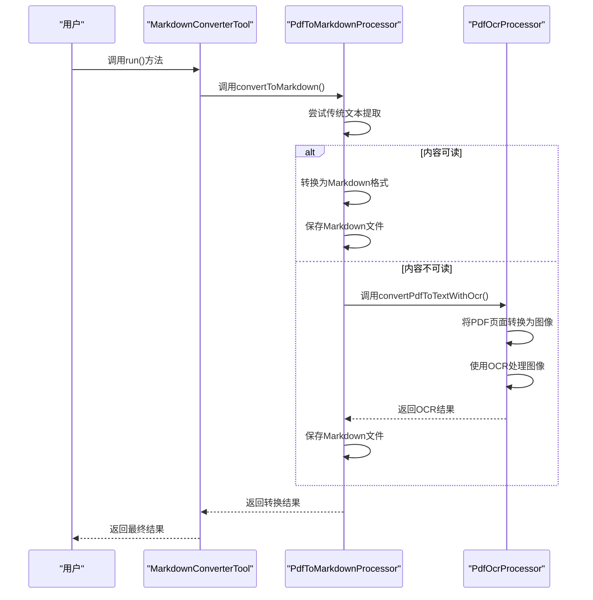
```mermaid
sequenceDiagram
participant User as "用户"
participant Converter as "MarkdownConverterTool"
participant PdfProcessor as "PdfToMarkdownProcessor"
participant PdfOcr as "PdfOcrProcessor"
User->>Converter : 调用run()方法
Converter->>PdfProcessor : 调用convertToMarkdown()
PdfProcessor->>PdfProcessor : 尝试传统文本提取
alt 内容可读
PdfProcessor->>PdfProcessor : 转换为Markdown格式
PdfProcessor->>PdfProcessor : 保存Markdown文件
else 内容不可读
PdfProcessor->>PdfOcr : 调用convertPdfToTextWithOcr()
PdfOcr->>PdfOcr : 将PDF页面转换为图像
PdfOcr->>PdfOcr : 使用OCR处理图像
PdfOcr-->>PdfProcessor : 返回OCR结果
PdfProcessor->>PdfProcessor : 保存Markdown文件
end
PdfProcessor-->>Converter : 返回转换结果
Converter-->>User : 返回最终结果
```

**Diagram sources **
- [PdfToMarkdownProcessor.java](file://src/main/java/com/alibaba/cloud/ai/lynxe/tool/convertToMarkdown/PdfToMarkdownProcessor.java#L40-L395)

**Section sources**
- [PdfToMarkdownProcessor.java](file://src/main/java/com/alibaba/cloud/ai/lynxe/tool/convertToMarkdown/PdfToMarkdownProcessor.java#L40-L395)

### WordToMarkdownProcessor
`WordToMarkdownProcessor`负责将Word文档转换为Markdown格式。它使用Apache POI库读取Word文档的内容，包括文本和图像。处理器会将文档中的每个段落和图像转换为Markdown格式，图像会被保存到一个与文档同名的子文件夹中，并在Markdown文件中使用相对路径引用。

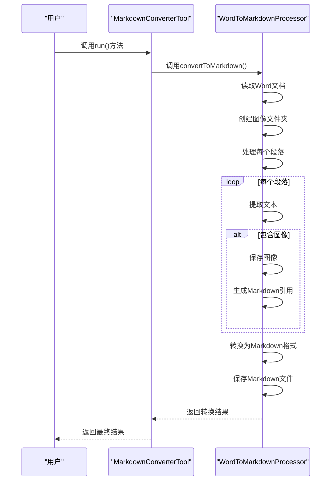
```mermaid
sequenceDiagram
participant User as "用户"
participant Converter as "MarkdownConverterTool"
participant WordProcessor as "WordToMarkdownProcessor"
User->>Converter : 调用run()方法
Converter->>WordProcessor : 调用convertToMarkdown()
WordProcessor->>WordProcessor : 读取Word文档
WordProcessor->>WordProcessor : 创建图像文件夹
WordProcessor->>WordProcessor : 处理每个段落
loop 每个段落
WordProcessor->>WordProcessor : 提取文本
alt 包含图像
WordProcessor->>WordProcessor : 保存图像
WordProcessor->>WordProcessor : 生成Markdown引用
end
end
WordProcessor->>WordProcessor : 转换为Markdown格式
WordProcessor->>WordProcessor : 保存Markdown文件
WordProcessor-->>Converter : 返回转换结果
Converter-->>User : 返回最终结果
```

**Diagram sources **
- [WordToMarkdownProcessor.java](file://src/main/java/com/alibaba/cloud/ai/lynxe/tool/convertToMarkdown/WordToMarkdownProcessor.java#L43-L389)

**Section sources**
- [WordToMarkdownProcessor.java](file://src/main/java/com/alibaba/cloud/ai/lynxe/tool/convertToMarkdown/WordToMarkdownProcessor.java#L43-L389)

### TextToMarkdownProcessor
`TextToMarkdownProcessor`负责将各种文本文件转换为Markdown格式。它支持多种文本格式，包括JSON、XML、YAML、代码文件和日志文件。处理器会根据文件的扩展名选择合适的处理方式，例如将JSON内容包裹在代码块中，将日志文件中的错误和警告信息用特殊符号标记。

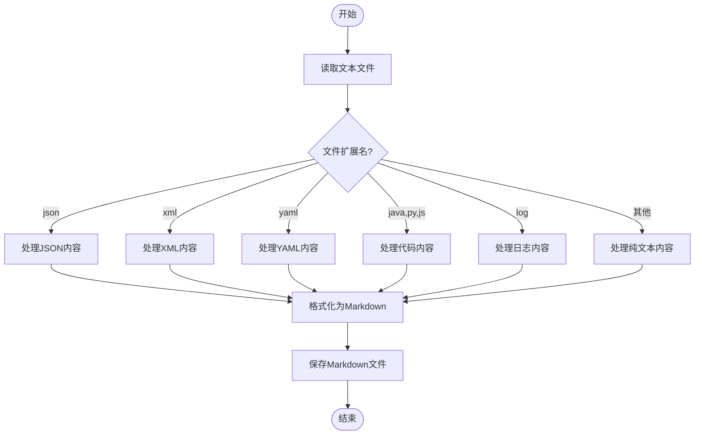
```mermaid
flowchart TD
Start([开始]) --> ReadFile["读取文本文件"]
ReadFile --> FileExtension{"文件扩展名?"}
FileExtension --> |json| ProcessJson["处理JSON内容"]
FileExtension --> |xml| ProcessXml["处理XML内容"]
FileExtension --> |yaml| ProcessYaml["处理YAML内容"]
FileExtension --> |java,py,js| ProcessCode["处理代码内容"]
FileExtension --> |log| ProcessLog["处理日志内容"]
FileExtension --> |其他| ProcessPlainText["处理纯文本内容"]
ProcessJson --> FormatMarkdown["格式化为Markdown"]
ProcessXml --> FormatMarkdown
ProcessYaml --> FormatMarkdown
ProcessCode --> FormatMarkdown
ProcessLog --> FormatMarkdown
ProcessPlainText --> FormatMarkdown
FormatMarkdown --> SaveFile["保存Markdown文件"]
SaveFile --> End([结束])
```

**Diagram sources **
- [TextToMarkdownProcessor.java](file://src/main/java/com/alibaba/cloud/ai/lynxe/tool/convertToMarkdown/TextToMarkdownProcessor.java#L36-L400)

**Section sources**
- [TextToMarkdownProcessor.java](file://src/main/java/com/alibaba/cloud/ai/lynxe/tool/convertToMarkdown/TextToMarkdownProcessor.java#L36-L400)

## Excel数据处理

### ExcelProcessingService
`ExcelProcessingService`是Excel文件处理的核心服务，提供了创建、读取、写入和验证Excel数据的完整功能。服务支持大文件的流式处理，使用`EasyExcel`库进行高效的数据读写。它还提供了并行批处理、数据转换和聚合、流式处理以及数据验证和清洗等功能。

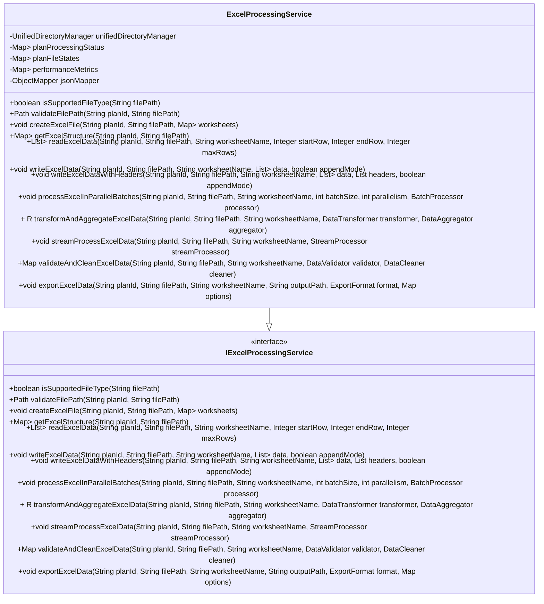
```mermaid
classDiagram
class ExcelProcessingService {
-UnifiedDirectoryManager unifiedDirectoryManager
-Map<String, Map<String, Object>> planProcessingStatus
-Map<String, Map<String, Object>> planFileStates
-Map<String, Map<String, Object>> performanceMetrics
-ObjectMapper jsonMapper
+boolean isSupportedFileType(String filePath)
+Path validateFilePath(String planId, String filePath)
+void createExcelFile(String planId, String filePath, Map<String, List<String>> worksheets)
+Map<String, List<String>> getExcelStructure(String planId, String filePath)
+List<List<String>> readExcelData(String planId, String filePath, String worksheetName, Integer startRow, Integer endRow, Integer maxRows)
+void writeExcelData(String planId, String filePath, String worksheetName, List<List<String>> data, boolean appendMode)
+void writeExcelDataWithHeaders(String planId, String filePath, String worksheetName, List<List<String>> data, List<String> headers, boolean appendMode)
+void processExcelInParallelBatches(String planId, String filePath, String worksheetName, int batchSize, int parallelism, BatchProcessor processor)
+<T, R> R transformAndAggregateExcelData(String planId, String filePath, String worksheetName, DataTransformer<T> transformer, DataAggregator<T, R> aggregator)
+void streamProcessExcelData(String planId, String filePath, String worksheetName, StreamProcessor streamProcessor)
+Map<String, Object> validateAndCleanExcelData(String planId, String filePath, String worksheetName, DataValidator validator, DataCleaner cleaner)
+void exportExcelData(String planId, String filePath, String worksheetName, String outputPath, ExportFormat format, Map<String, Object> options)
}
class IExcelProcessingService {
<<interface>>
+boolean isSupportedFileType(String filePath)
+Path validateFilePath(String planId, String filePath)
+void createExcelFile(String planId, String filePath, Map<String, List<String>> worksheets)
+Map<String, List<String>> getExcelStructure(String planId, String filePath)
+List<List<String>> readExcelData(String planId, String filePath, String worksheetName, Integer startRow, Integer endRow, Integer maxRows)
+void writeExcelData(String planId, String filePath, String worksheetName, List<List<String>> data, boolean appendMode)
+void writeExcelDataWithHeaders(String planId, String filePath, String worksheetName, List<List<String>> data, List<String> headers, boolean appendMode)
+void processExcelInParallelBatches(String planId, String filePath, String worksheetName, int batchSize, int parallelism, BatchProcessor processor)
+<T, R> R transformAndAggregateExcelData(String planId, String filePath, String worksheetName, DataTransformer<T> transformer, DataAggregator<T, R> aggregator)
+void streamProcessExcelData(String planId, String filePath, String worksheetName, StreamProcessor streamProcessor)
+Map<String, Object> validateAndCleanExcelData(String planId, String filePath, String worksheetName, DataValidator validator, DataCleaner cleaner)
+void exportExcelData(String planId, String filePath, String worksheetName, String outputPath, ExportFormat format, Map<String, Object> options)
}
ExcelProcessingService --|> IExcelProcessingService
```

**Diagram sources **
- [ExcelProcessingService.java](file://src/main/java/com/alibaba/cloud/ai/lynxe/tool/excelProcessor/ExcelProcessingService.java#L71-L1722)

**Section sources**
- [ExcelProcessingService.java](file://src/main/java/com/alibaba/cloud/ai/lynxe/tool/excelProcessor/ExcelProcessingService.java#L71-L1722)

### 大文件流式处理
`ExcelProcessingService`通过`EasyExcel`库实现了大文件的流式处理。当文件大小超过10MB时，服务会自动切换到流式读取模式，避免内存溢出。流式处理通过`ReadListener`接口实现，可以逐行处理数据，非常适合处理大型Excel文件。

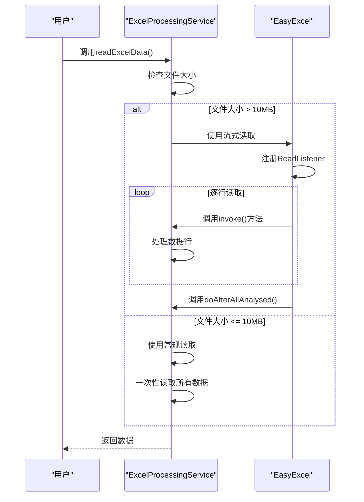
```mermaid
sequenceDiagram
participant User as "用户"
participant Service as "ExcelProcessingService"
participant EasyExcel as "EasyExcel"
User->>Service : 调用readExcelData()
Service->>Service : 检查文件大小
alt 文件大小 > 10MB
Service->>EasyExcel : 使用流式读取
EasyExcel->>EasyExcel : 注册ReadListener
loop 逐行读取
EasyExcel->>Service : 调用invoke()方法
Service->>Service : 处理数据行
end
EasyExcel->>Service : 调用doAfterAllAnalysed()
else 文件大小 <= 10MB
Service->>Service : 使用常规读取
Service->>Service : 一次性读取所有数据
end
Service-->>User : 返回数据
```

**Diagram sources **
- [ExcelProcessingService.java](file://src/main/java/com/alibaba/cloud/ai/lynxe/tool/excelProcessor/ExcelProcessingService.java#L242-L321)

**Section sources**
- [ExcelProcessingService.java](file://src/main/java/com/alibaba/cloud/ai/lynxe/tool/excelProcessor/ExcelProcessingService.java#L242-L321)

### 并行批处理
`ExcelProcessingService`提供了`processExcelInParallelBatches`方法，支持对Excel数据进行并行批处理。该方法使用生产者-消费者模式，一个线程负责读取数据并创建批次，多个线程并行处理这些批次，从而显著提高处理速度。

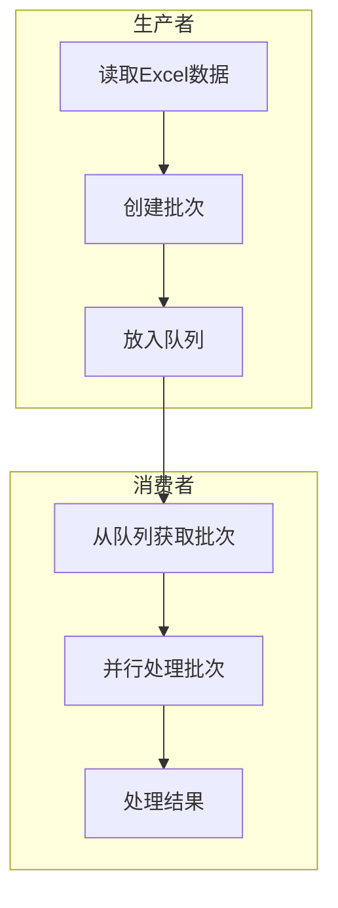
```mermaid
graph TD
subgraph "生产者"
A[读取Excel数据] --> B[创建批次]
B --> C[放入队列]
end
subgraph "消费者"
D[从队列获取批次] --> E[并行处理批次]
E --> F[处理结果]
end
C --> D
```

**Diagram sources **
- [ExcelProcessingService.java](file://src/main/java/com/alibaba/cloud/ai/lynxe/tool/excelProcessor/ExcelProcessingService.java#L510-L633)

**Section sources**
- [ExcelProcessingService.java](file://src/main/java/com/alibaba/cloud/ai/lynxe/tool/excelProcessor/ExcelProcessingService.java#L510-L633)

## 表格数据操作

### TableProcessingService
`TableProcessingService`提供了对表格数据的高级操作支持。它支持创建表、读取表结构、写入数据、搜索行和删除行等操作。服务使用`EasyExcel`库进行数据读写，并提供了流式处理和批量处理功能。

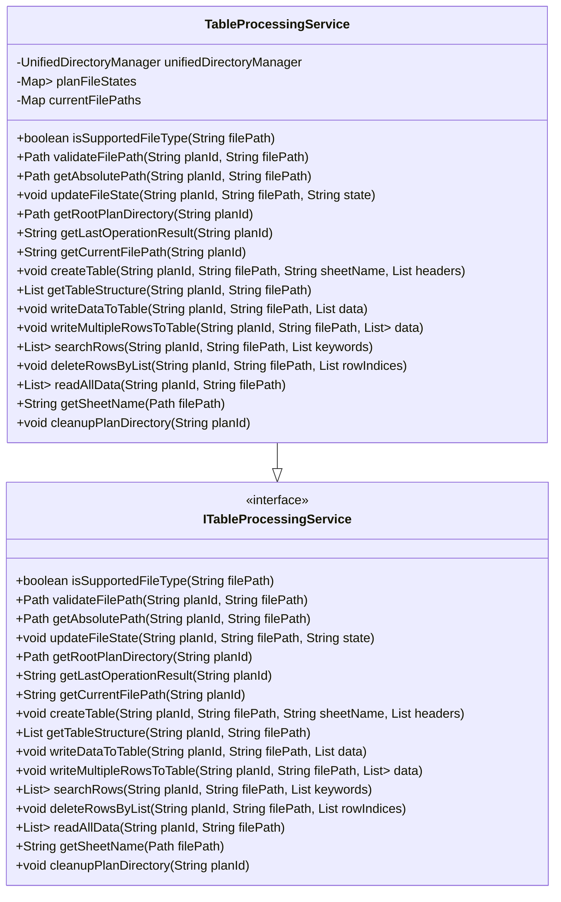
```mermaid
classDiagram
class TableProcessingService {
-UnifiedDirectoryManager unifiedDirectoryManager
-Map<String, Map<String, String>> planFileStates
-Map<String, String> currentFilePaths
+boolean isSupportedFileType(String filePath)
+Path validateFilePath(String planId, String filePath)
+Path getAbsolutePath(String planId, String filePath)
+void updateFileState(String planId, String filePath, String state)
+Path getRootPlanDirectory(String planId)
+String getLastOperationResult(String planId)
+String getCurrentFilePath(String planId)
+void createTable(String planId, String filePath, String sheetName, List<String> headers)
+List<String> getTableStructure(String planId, String filePath)
+void writeDataToTable(String planId, String filePath, List<String> data)
+void writeMultipleRowsToTable(String planId, String filePath, List<List<String>> data)
+List<List<String>> searchRows(String planId, String filePath, List<String> keywords)
+void deleteRowsByList(String planId, String filePath, List<Integer> rowIndices)
+List<List<String>> readAllData(String planId, String filePath)
+String getSheetName(Path filePath)
+void cleanupPlanDirectory(String planId)
}
class ITableProcessingService {
<<interface>>
+boolean isSupportedFileType(String filePath)
+Path validateFilePath(String planId, String filePath)
+Path getAbsolutePath(String planId, String filePath)
+void updateFileState(String planId, String filePath, String state)
+Path getRootPlanDirectory(String planId)
+String getLastOperationResult(String planId)
+String getCurrentFilePath(String planId)
+void createTable(String planId, String filePath, String sheetName, List<String> headers)
+List<String> getTableStructure(String planId, String filePath)
+void writeDataToTable(String planId, String filePath, List<String> data)
+void writeMultipleRowsToTable(String planId, String filePath, List<List<String>> data)
+List<List<String>> searchRows(String planId, String filePath, List<String> keywords)
+void deleteRowsByList(String planId, String filePath, List<Integer> rowIndices)
+List<List<String>> readAllData(String planId, String filePath)
+String getSheetName(Path filePath)
+void cleanupPlanDirectory(String planId)
}
TableProcessingService --|> ITableProcessingService
```

**Diagram sources **
- [TableProcessingService.java](file://src/main/java/com/alibaba/cloud/ai/lynxe/tool/tableProcessor/TableProcessingService.java#L43-L800)

**Section sources**
- [TableProcessingService.java](file://src/main/java/com/alibaba/cloud/ai/lynxe/tool/tableProcessor/TableProcessingService.java#L43-L800)

### 数据验证与清洗
`TableProcessingService`提供了数据验证和清洗功能。`validateAndCleanExcelData`方法可以验证数据的有效性，并对无效数据进行清洗。服务会生成详细的验证报告，包括总行数、有效行数、无效行数和验证率等信息。


```mermaid
flowchart TD
Start([开始]) --> ReadData["读取所有数据"]
ReadData --> ValidateData["验证每行数据"]
ValidateData --> CleanData["清洗有效数据"]
CleanData --> GenerateReport["生成验证报告"]
GenerateReport --> End([结束])
```

**Diagram sources **
- [ExcelProcessingService.java](file://src/main/java/com/alibaba/cloud/ai/lynxe/tool/excelProcessor/ExcelProcessingService.java#L709-L765)

**Section sources**
- [ExcelProcessingService.java](file://src/main/java/com/alibaba/cloud/ai/lynxe/tool/excelProcessor/ExcelProcessingService.java#L709-L765)

## 文本文件处理

### TextFileService
`TextFileService`提供了文本文件的读写功能。它支持多种文本格式，包括纯文本、Markdown、JSON、XML、YAML、代码文件和日志文件。服务使用`UnifiedDirectoryManager`进行路径验证和管理，确保文件操作的安全性。

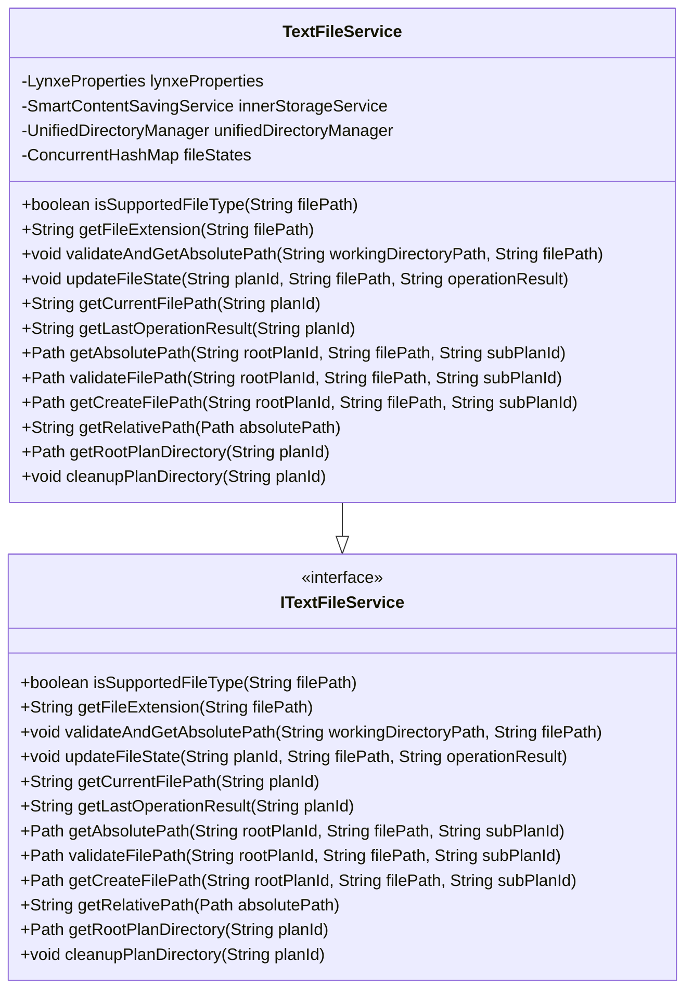
```mermaid
classDiagram
class TextFileService {
-LynxeProperties lynxeProperties
-SmartContentSavingService innerStorageService
-UnifiedDirectoryManager unifiedDirectoryManager
-ConcurrentHashMap<String, FileState> fileStates
+boolean isSupportedFileType(String filePath)
+String getFileExtension(String filePath)
+void validateAndGetAbsolutePath(String workingDirectoryPath, String filePath)
+void updateFileState(String planId, String filePath, String operationResult)
+String getCurrentFilePath(String planId)
+String getLastOperationResult(String planId)
+Path getAbsolutePath(String rootPlanId, String filePath, String subPlanId)
+Path validateFilePath(String rootPlanId, String filePath, String subPlanId)
+Path getCreateFilePath(String rootPlanId, String filePath, String subPlanId)
+String getRelativePath(Path absolutePath)
+Path getRootPlanDirectory(String planId)
+void cleanupPlanDirectory(String planId)
}
class ITextFileService {
<<interface>>
+boolean isSupportedFileType(String filePath)
+String getFileExtension(String filePath)
+void validateAndGetAbsolutePath(String workingDirectoryPath, String filePath)
+void updateFileState(String planId, String filePath, String operationResult)
+String getCurrentFilePath(String planId)
+String getLastOperationResult(String planId)
+Path getAbsolutePath(String rootPlanId, String filePath, String subPlanId)
+Path validateFilePath(String rootPlanId, String filePath, String subPlanId)
+Path getCreateFilePath(String rootPlanId, String filePath, String subPlanId)
+String getRelativePath(Path absolutePath)
+Path getRootPlanDirectory(String planId)
+void cleanupPlanDirectory(String planId)
}
TextFileService --|> ITextFileService
```

**Diagram sources **
- [TextFileService.java](file://src/main/java/com/alibaba/cloud/ai/lynxe/tool/textOperator/TextFileService.java#L41-L355)

**Section sources**
- [TextFileService.java](file://src/main/java/com/alibaba/cloud/ai/lynxe/tool/textOperator/TextFileService.java#L41-L355)

### 文件格式识别
`TextFileService`通过`SUPPORTED_EXTENSIONS`集合支持多种文本文件格式。服务会根据文件扩展名判断文件类型，并提供相应的处理方式。例如，JSON文件会被包裹在代码块中，日志文件中的错误和警告信息会被特殊标记。

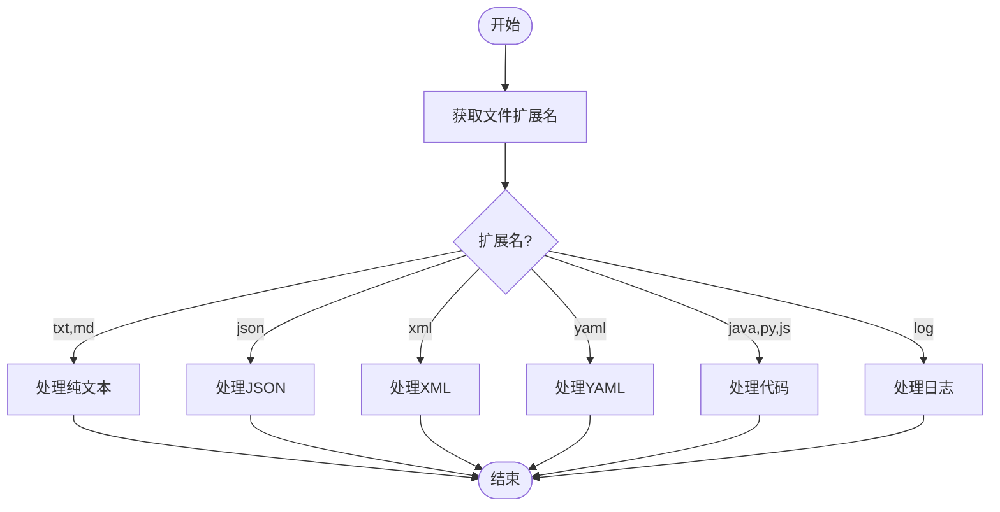
```mermaid
flowchart TD
Start([开始]) --> GetExtension["获取文件扩展名"]
GetExtension --> CheckExtension{"扩展名?"}
CheckExtension --> |txt,md| ProcessPlainText["处理纯文本"]
CheckExtension --> |json| ProcessJson["处理JSON"]
CheckExtension --> |xml| ProcessXml["处理XML"]
CheckExtension --> |yaml| ProcessYaml["处理YAML"]
CheckExtension --> |java,py,js| ProcessCode["处理代码"]
CheckExtension --> |log| ProcessLog["处理日志"]
ProcessPlainText --> End([结束])
ProcessJson --> End
ProcessXml --> End
ProcessYaml --> End
ProcessCode --> End
ProcessLog --> End
```

**Diagram sources **
- [TextFileService.java](file://src/main/java/com/alibaba/cloud/ai/lynxe/tool/textOperator/TextFileService.java#L60-L70)

**Section sources**
- [TextFileService.java](file://src/main/java/com/alibaba/cloud/ai/lynxe/tool/textOperator/TextFileService.java#L60-L70)

## 统一文件系统访问

### UnifiedDirectoryManager
`UnifiedDirectoryManager`提供了统一的文件系统访问接口。它管理着工作目录、计划目录和任务目录，确保所有文件操作都在安全的范围内进行。服务提供了创建目录、验证路径、获取相对路径和清理目录等功能。

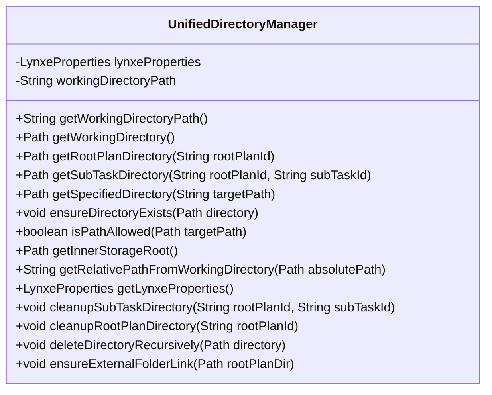
```mermaid
classDiagram
class UnifiedDirectoryManager {
-LynxeProperties lynxeProperties
-String workingDirectoryPath
+String getWorkingDirectoryPath()
+Path getWorkingDirectory()
+Path getRootPlanDirectory(String rootPlanId)
+Path getSubTaskDirectory(String rootPlanId, String subTaskId)
+Path getSpecifiedDirectory(String targetPath)
+void ensureDirectoryExists(Path directory)
+boolean isPathAllowed(Path targetPath)
+Path getInnerStorageRoot()
+String getRelativePathFromWorkingDirectory(Path absolutePath)
+LynxeProperties getLynxeProperties()
+void cleanupSubTaskDirectory(String rootPlanId, String subTaskId)
+void cleanupRootPlanDirectory(String rootPlanId)
+void deleteDirectoryRecursively(Path directory)
+void ensureExternalFolderLink(Path rootPlanDir)
}
```

**Diagram sources **
- [UnifiedDirectoryManager.java](file://src/main/java/com/alibaba/cloud/ai/lynxe/tool/filesystem/UnifiedDirectoryManager.java#L35-L439)

**Section sources**
- [UnifiedDirectoryManager.java](file://src/main/java/com/alibaba/cloud/ai/lynxe/tool/filesystem/UnifiedDirectoryManager.java#L35-L439)

### 安全路径验证
`UnifiedDirectoryManager`通过`isPathAllowed`方法确保所有文件操作都在允许的范围内。该方法会检查目标路径是否在工作目录内，防止路径遍历攻击。

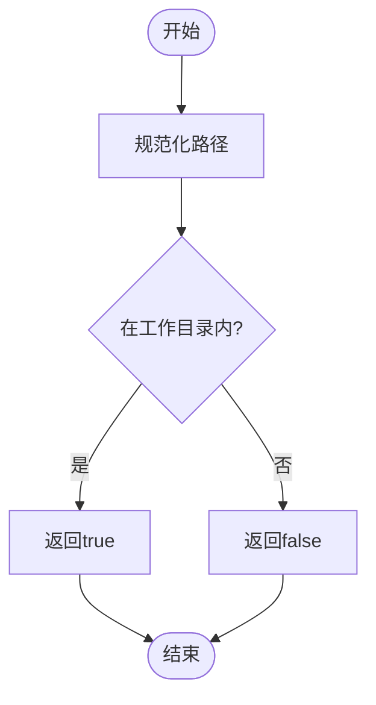
```mermaid
flowchart TD
Start([开始]) --> NormalizePath["规范化路径"]
NormalizePath --> CheckWithinWorkingDir{"在工作目录内?"}
CheckWithinWorkingDir --> |是| ReturnTrue["返回true"]
CheckWithinWorkingDir --> |否| ReturnFalse["返回false"]
ReturnTrue --> End([结束])
ReturnFalse --> End
```

**Diagram sources **
- [UnifiedDirectoryManager.java](file://src/main/java/com/alibaba/cloud/ai/lynxe/tool/filesystem/UnifiedDirectoryManager.java#L194-L214)

**Section sources**
- [UnifiedDirectoryManager.java](file://src/main/java/com/alibaba/cloud/ai/lynxe/tool/filesystem/UnifiedDirectoryManager.java#L194-L214)

## 关键技术实现

### 文件格式识别
系统通过文件扩展名识别文件格式。`MarkdownConverterTool`使用`getFileExtension`方法获取文件扩展名，并根据扩展名调度相应的处理器。`ExcelProcessingService`和`TextFileService`也使用类似的方法判断文件类型。

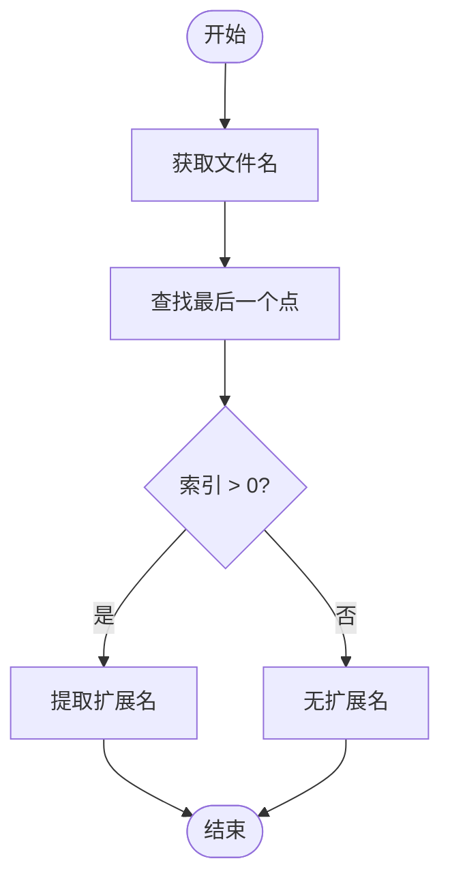
```mermaid
flowchart TD
Start([开始]) --> GetFileName["获取文件名"]
GetFileName --> FindLastDot["查找最后一个点"]
FindLastDot --> CheckIndex{"索引 > 0?"}
CheckIndex --> |是| ExtractExtension["提取扩展名"]
CheckIndex --> |否| NoExtension["无扩展名"]
ExtractExtension --> End([结束])
NoExtension --> End
```

**Diagram sources **
- [MarkdownConverterTool.java](file://src/main/java/com/alibaba/cloud/ai/lynxe/tool/convertToMarkdown/MarkdownConverterTool.java#L326-L329)

**Section sources**
- [MarkdownConverterTool.java](file://src/main/java/com/alibaba/cloud/ai/lynxe/tool/convertToMarkdown/MarkdownConverterTool.java#L326-L329)

### 编码处理
系统在读写文件时使用UTF-8编码，确保支持各种字符集。`TextFileService`在读取文本文件时使用`Files.readString`方法，该方法默认使用UTF-8编码。在保存Markdown文件时，系统也明确指定使用UTF-8编码。

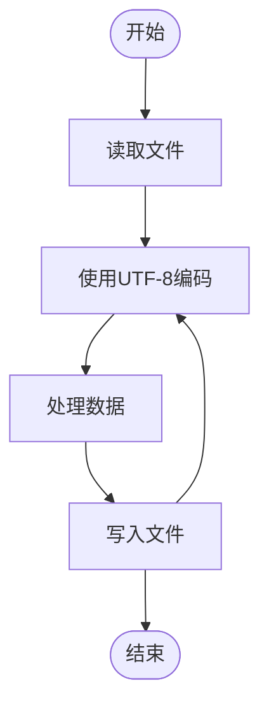
```mermaid
flowchart TD
Start([开始]) --> ReadFile["读取文件"]
ReadFile --> UseUTF8["使用UTF-8编码"]
UseUTF8 --> ProcessData["处理数据"]
ProcessData --> WriteFile["写入文件"]
WriteFile --> UseUTF8
WriteFile --> End([结束])
```

**Diagram sources **
- [TextFileService.java](file://src/main/java/com/alibaba/cloud/ai/lynxe/tool/textOperator/TextFileService.java#L124-L129)
- [ExcelToMarkdownProcessor.java](file://src/main/java/com/alibaba/cloud/ai/lynxe/tool/convertToMarkdown/ExcelToMarkdownProcessor.java#L584-L585)

**Section sources**
- [TextFileService.java](file://src/main/java/com/alibaba/cloud/ai/lynxe/tool/textOperator/TextFileService.java#L124-L129)
- [ExcelToMarkdownProcessor.java](file://src/main/java/com/alibaba/cloud/ai/lynxe/tool/convertToMarkdown/ExcelToMarkdownProcessor.java#L584-L585)

### 大文件流式处理
系统通过`EasyExcel`库实现了大文件的流式处理。`ExcelProcessingService`在读取大文件时使用`ReadListener`接口，可以逐行处理数据，避免内存溢出。对于写入大文件，服务使用`SXSSFWorkbook`进行流式写入。

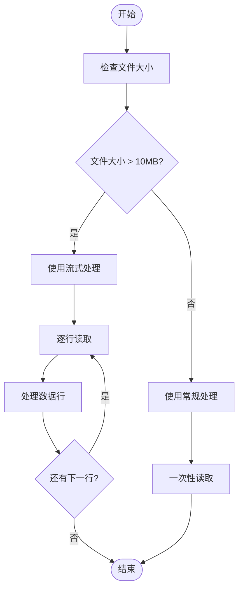
```mermaid
flowchart TD
Start([开始]) --> CheckFileSize["检查文件大小"]
CheckFileSize --> IsLarge{"文件大小 > 10MB?"}
IsLarge --> |是| UseStreaming["使用流式处理"]
IsLarge --> |否| UseRegular["使用常规处理"]
UseStreaming --> ReadLine["逐行读取"]
ReadLine --> ProcessLine["处理数据行"]
ProcessLine --> NextLine{"还有下一行?"}
NextLine --> |是| ReadLine
NextLine --> |否| End([结束])
UseRegular --> ReadAll["一次性读取"]
ReadAll --> End
```

**Diagram sources **
- [ExcelProcessingService.java](file://src/main/java/com/alibaba/cloud/ai/lynxe/tool/excelProcessor/ExcelProcessingService.java#L242-L321)

**Section sources**
- [ExcelProcessingService.java](file://src/main/java/com/alibaba/cloud/ai/lynxe/tool/excelProcessor/ExcelProcessingService.java#L242-L321)

## 错误处理与性能优化

### 错误处理机制
系统实现了全面的错误处理机制。每个处理器都使用try-catch块捕获异常，并返回包含错误信息的`ToolExecuteResult`。`MarkdownConverterTool`在转换过程中会记录详细的日志信息，便于调试和问题排查。


```mermaid
flowchart TD
Start([开始]) --> TryBlock["try块"]
TryBlock --> ExecuteOperation["执行操作"]
ExecuteOperation --> CatchBlock["catch块"]
CatchBlock --> LogError["记录错误日志"]
LogError --> ReturnError["返回错误结果"]
ReturnError --> End([结束])
```

**Diagram sources **
- [MarkdownConverterTool.java](file://src/main/java/com/alibaba/cloud/ai/lynxe/tool/convertToMarkdown/MarkdownConverterTool.java#L118-L154)

**Section sources**
- [MarkdownConverterTool.java](file://src/main/java/com/alibaba/cloud/ai/lynxe/tool/convertToMarkdown/MarkdownConverterTool.java#L118-L154)

### 性能优化策略
系统通过多种方式优化性能。`ExcelProcessingService`使用`ConcurrentHashMap`存储计划处理状态，提高并发性能。对于大文件处理，服务使用流式读写和并行批处理，显著提高处理速度。`PdfOcrProcessor`使用`ImageRecognitionExecutorPool`进行并行OCR处理，充分利用多核CPU。

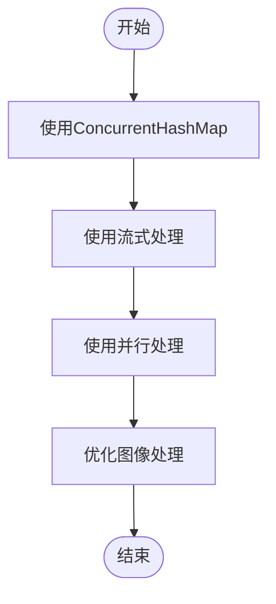
```mermaid
flowchart TD
Start([开始]) --> UseConcurrentMap["使用ConcurrentHashMap"]
UseConcurrentMap --> StreamProcessing["使用流式处理"]
StreamProcessing --> ParallelProcessing["使用并行处理"]
ParallelProcessing --> OptimizeImage["优化图像处理"]
OptimizeImage --> End([结束])
```

**Diagram sources **
- [ExcelProcessingService.java](file://src/main/java/com/alibaba/cloud/ai/lynxe/tool/excelProcessor/ExcelProcessingService.java#L89-L95)
- [ExcelProcessingService.java](file://src/main/java/com/alibaba/cloud/ai/lynxe/tool/excelProcessor/ExcelProcessingService.java#L242-L321)
- [ExcelProcessingService.java](file://src/main/java/com/alibaba/cloud/ai/lynxe/tool/excelProcessor/ExcelProcessingService.java#L510-L633)
- [PdfOcrProcessor.java](file://src/main/java/com/alibaba/cloud/ai/lynxe/tool/convertToMarkdown/PdfOcrProcessor.java#L117-L135)

**Section sources**
- [ExcelProcessingService.java](file://src/main/java/com/alibaba/cloud/ai/lynxe/tool/excelProcessor/ExcelProcessingService.java#L89-L95)
- [ExcelProcessingService.java](file://src/main/java/com/alibaba/cloud/ai/lynxe/tool/excelProcessor/ExcelProcessingService.java#L242-L321)
- [ExcelProcessingService.java](file://src/main/java/com/alibaba/cloud/ai/lynxe/tool/excelProcessor/ExcelProcessingService.java#L510-L633)
- [PdfOcrProcessor.java](file://src/main/java/com/alibaba/cloud/ai/lynxe/tool/convertToMarkdown/PdfOcrProcessor.java#L117-L135)

## 使用示例

### 将Excel文件转换为Markdown
```java
// 创建MarkdownConverterTool实例
MarkdownConverterTool converter = new MarkdownConverterTool(
    directoryManager, ocrProcessor, imageOcrProcessor, 
    excelProcessingService, objectMapper, toolI18nService);

// 创建输入参数
MarkdownConverterInput input = new MarkdownConverterInput();
input.setFilename("data.xlsx");
input.setAdditionalRequirement("请提取所有工作表的数据");
input.setForceLlmForPdf(false);

// 执行转换
ToolExecuteResult result = converter.run(input);
```

### 读取和写入Excel数据
```java
// 读取Excel数据
List<List<String>> data = excelProcessingService.readExcelData(
    "plan-123", "data.xlsx", "Sheet1", null, null, null);

// 写入Excel数据
List<List<String>> newData = Arrays.asList(
    Arrays.asList("Name", "Age", "City"),
    Arrays.asList("Alice", "25", "Beijing"),
    Arrays.asList("Bob", "30", "Shanghai")
);
excelProcessingService.writeExcelData(
    "plan-123", "data.xlsx", "Sheet1", newData, true);
```

### 创建和操作表格
```java
// 创建表
List<String> headers = Arrays.asList("Name", "Age", "City");
tableProcessingService.createTable(
    "plan-123", "table.xlsx", "People", headers);

// 写入数据
List<String> row = Arrays.asList("Alice", "25", "Beijing");
tableProcessingService.writeDataToTable("plan-123", "table.xlsx", row);

// 搜索行
List<String> keywords = Arrays.asList("Alice");
List<List<String>> results = tableProcessingService.searchRows(
    "plan-123", "table.xlsx", keywords);
```

### 处理文本文件
```java
// 读取文本文件
String content = Files.readString(Paths.get("data.txt"));

// 写入Markdown文件
Files.write(Paths.get("output.md"), content.getBytes("UTF-8"),
    StandardOpenOption.CREATE, StandardOpenOption.TRUNCATE_EXISTING);
```

**Section sources**
- [MarkdownConverterTool.java](file://src/main/java/com/alibaba/cloud/ai/lynxe/tool/convertToMarkdown/MarkdownConverterTool.java#L110-L154)
- [ExcelProcessingService.java](file://src/main/java/com/alibaba/cloud/ai/lynxe/tool/excelProcessor/ExcelProcessingService.java#L231-L273)
- [TableProcessingService.java](file://src/main/java/com/alibaba/cloud/ai/lynxe/tool/tableProcessor/TableProcessingService.java#L259-L302)
- [TextFileService.java](file://src/main/java/com/alibaba/cloud/ai/lynxe/tool/textOperator/TextFileService.java#L122-L129)