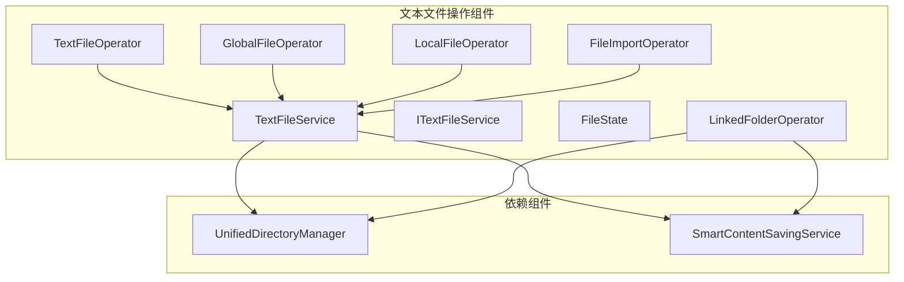
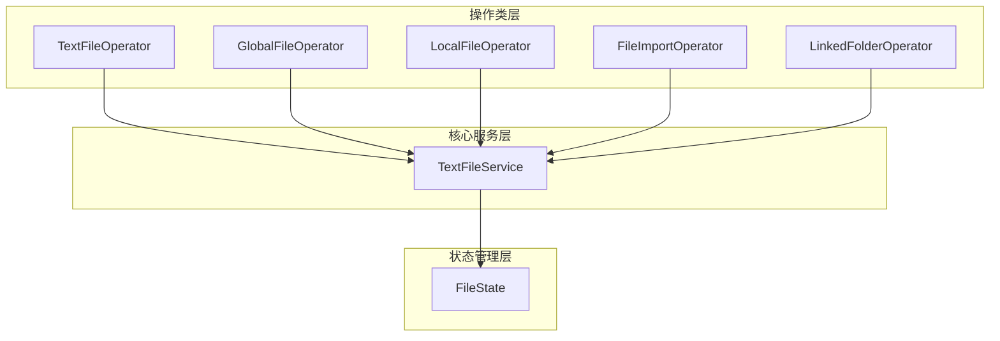
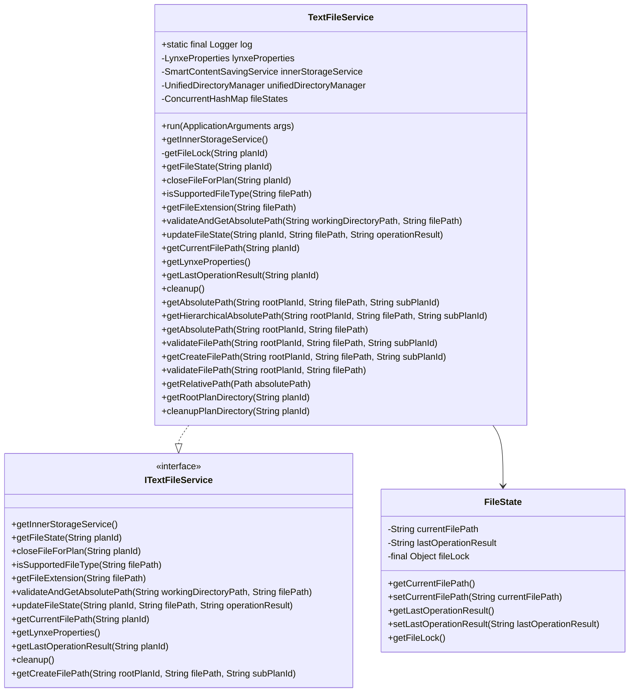
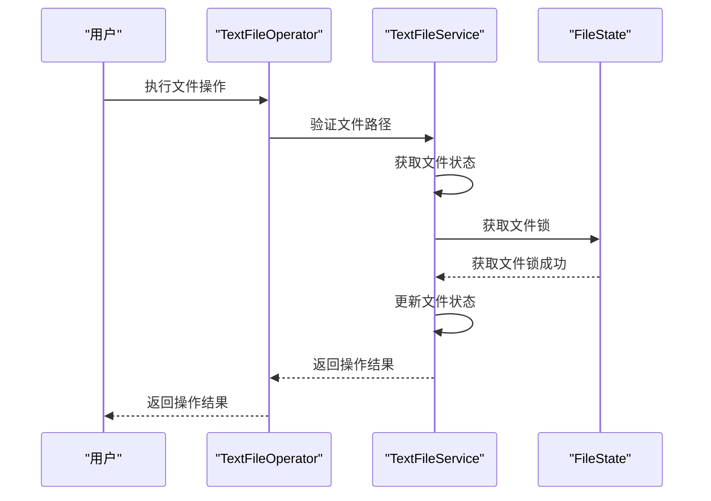
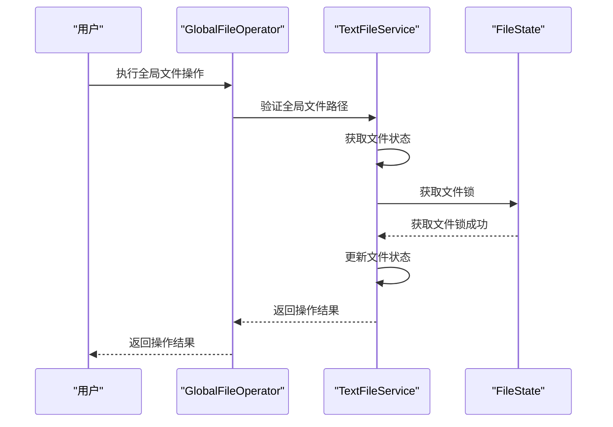
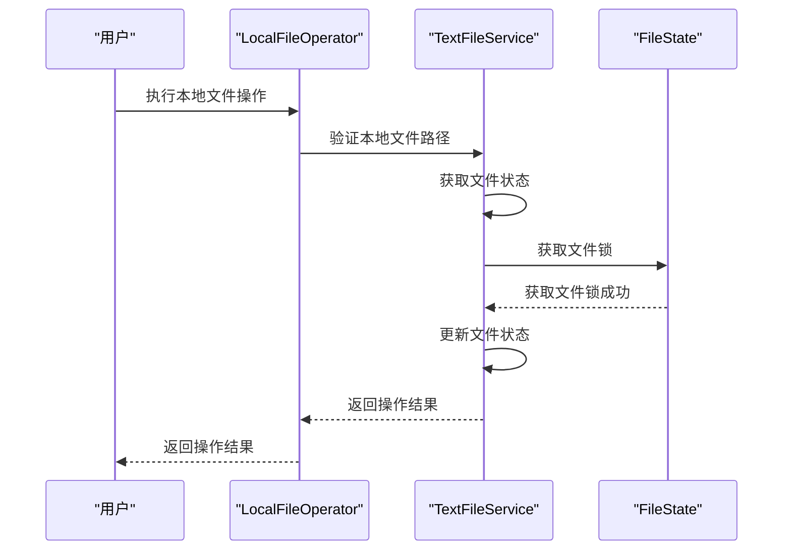
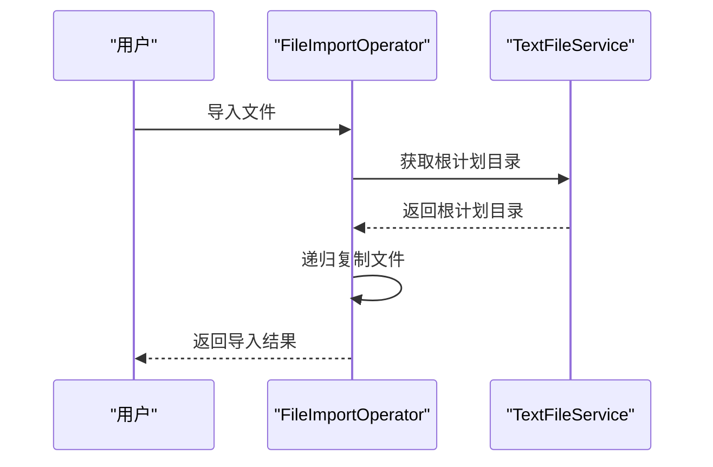
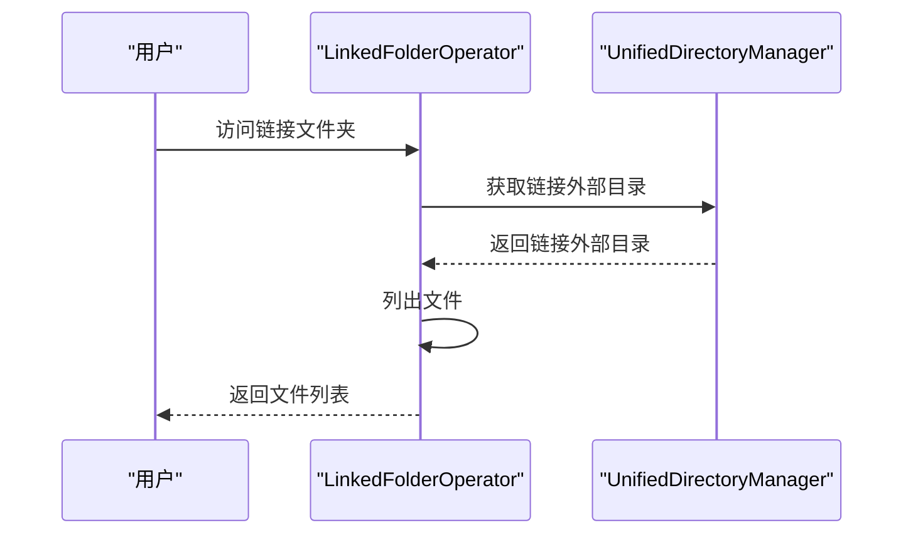
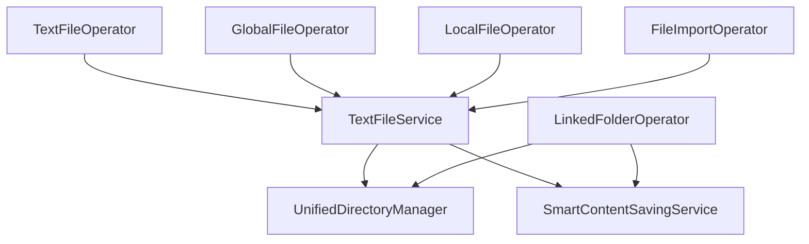

# 文本文件操作

<cite>
**本文档引用的文件**   
- [TextFileService.java](file://src/main/java/com/alibaba/cloud/ai/lynxe/tool/textOperator/TextFileService.java)
- [ITextFileService.java](file://src/main/java/com/alibaba/cloud/ai/lynxe/tool/textOperator/ITextFileService.java)
- [TextFileOperator.java](file://src/main/java/com/alibaba/cloud/ai/lynxe/tool/textOperator/TextFileOperator.java)
- [GlobalFileOperator.java](file://src/main/java/com/alibaba/cloud/ai/lynxe/tool/textOperator/GlobalFileOperator.java)
- [LocalFileOperator.java](file://src/main/java/com/alibaba/cloud/ai/lynxe/tool/textOperator/LocalFileOperator.java)
- [FileImportOperator.java](file://src/main/java/com/alibaba/cloud/ai/lynxe/tool/textOperator/FileImportOperator.java)
- [FileState.java](file://src/main/java/com/alibaba/cloud/ai/lynxe/tool/textOperator/FileState.java)
- [LinkedFolderOperator.java](file://src/main/java/com/alibaba/cloud/ai/lynxe/tool/textOperator/LinkedFolderOperator.java)
- [UnifiedDirectoryManager.java](file://src/main/java/com/alibaba/cloud/ai/lynxe/tool/filesystem/UnifiedDirectoryManager.java)
- [SmartContentSavingService.java](file://src/main/java/com/alibaba/cloud/ai/lynxe/tool/innerStorage/SmartContentSavingService.java)
- [SimpleHierarchicalFileAccessTest.java](file://src/test/java/com/alibaba/cloud/ai/lynxe/tool/textOperator/SimpleHierarchicalFileAccessTest.java)
</cite>

## 目录
1. [引言](#引言)
2. [项目结构](#项目结构)
3. [核心组件](#核心组件)
4. [架构概述](#架构概述)
5. [详细组件分析](#详细组件分析)
6. [依赖分析](#依赖分析)
7. [性能考虑](#性能考虑)
8. [故障排除指南](#故障排除指南)
9. [结论](#结论)

## 引言
本文档旨在全面解析文本文件操作组件的设计与实现，重点介绍以TextFileService为核心的服务架构及其接口定义。文档详细描述了TextFileOperator、GlobalFileOperator等实现类对本地和远程文本文件的读取、写入、追加和状态管理功能。同时，说明了文件导入流程（FileImportOperator）和文件状态跟踪机制（FileState）的实现原理。通过实际场景示例展示如何处理不同编码（UTF-8、GBK）、行分隔符兼容性问题，以及大文本文件的增量处理策略。涵盖多线程访问控制、文件锁机制、路径解析安全等关键细节，并提供与AI代理协同工作的集成模式（如动态加载提示词文件、保存中间结果）。

## 项目结构
文本文件操作组件位于`src/main/java/com/alibaba/cloud/ai/lynxe/tool/textOperator`目录下，主要包含核心服务、操作类和状态管理类。该组件依赖于`UnifiedDirectoryManager`进行统一的目录管理，并通过`SmartContentSavingService`处理大文件内容的智能存储。组件设计遵循分层架构，核心服务层（TextFileService）提供基础文件操作功能，操作类层（如TextFileOperator、GlobalFileOperator）实现具体的文件操作逻辑，状态管理层（FileState）负责跟踪文件操作状态。

**Diagram sources**
- [TextFileService.java](file://src/main/java/com/alibaba/cloud/ai/lynxe/tool/textOperator/TextFileService.java)
- [ITextFileService.java](file://src/main/java/com/alibaba/cloud/ai/lynxe/tool/textOperator/ITextFileService.java)
- [TextFileOperator.java](file://src/main/java/com/alibaba/cloud/ai/lynxe/tool/textOperator/TextFileOperator.java)
- [GlobalFileOperator.java](file://src/main/java/com/alibaba/cloud/ai/lynxe/tool/textOperator/GlobalFileOperator.java)
- [LocalFileOperator.java](file://src/main/java/com/alibaba/cloud/ai/lynxe/tool/textOperator/LocalFileOperator.java)
- [FileImportOperator.java](file://src/main/java/com/alibaba/cloud/ai/lynxe/tool/textOperator/FileImportOperator.java)
- [FileState.java](file://src/main/java/com/alibaba/cloud/ai/lynxe/tool/textOperator/FileState.java)
- [LinkedFolderOperator.java](file://src/main/java/com/alibaba/cloud/ai/lynxe/tool/textOperator/LinkedFolderOperator.java)
- [UnifiedDirectoryManager.java](file://src/main/java/com/alibaba/cloud/ai/lynxe/tool/filesystem/UnifiedDirectoryManager.java)
- [SmartContentSavingService.java](file://src/main/java/com/alibaba/cloud/ai/lynxe/tool/innerStorage/SmartContentSavingService.java)

**Section sources**
- [TextFileService.java](file://src/main/java/com/alibaba/cloud/ai/lynxe/tool/textOperator/TextFileService.java)
- [ITextFileService.java](file://src/main/java/com/alibaba/cloud/ai/lynxe/tool/textOperator/ITextFileService.java)
- [TextFileOperator.java](file://src/main/java/com/alibaba/cloud/ai/lynxe/tool/textOperator/TextFileOperator.java)
- [GlobalFileOperator.java](file://src/main/java/com/alibaba/cloud/ai/lynxe/tool/textOperator/GlobalFileOperator.java)
- [LocalFileOperator.java](file://src/main/java/com/alibaba/cloud/ai/lynxe/tool/textOperator/LocalFileOperator.java)
- [FileImportOperator.java](file://src/main/java/com/alibaba/cloud/ai/lynxe/tool/textOperator/FileImportOperator.java)
- [FileState.java](file://src/main/java/com/alibaba/cloud/ai/lynxe/tool/textOperator/FileState.java)
- [LinkedFolderOperator.java](file://src/main/java/com/alibaba/cloud/ai/lynxe/tool/textOperator/LinkedFolderOperator.java)
- [UnifiedDirectoryManager.java](file://src/main/java/com/alibaba/cloud/ai/lynxe/tool/filesystem/UnifiedDirectoryManager.java)
- [SmartContentSavingService.java](file://src/main/java/com/alibaba/cloud/ai/lynxe/tool/innerStorage/SmartContentSavingService.java)

## 核心组件
文本文件操作组件的核心是TextFileService，它提供了文件操作的基础服务，包括路径验证、文件状态管理、文件锁机制等。TextFileService通过ITextFileService接口定义了文件操作的契约，确保了组件的可扩展性和可测试性。FileState类用于跟踪每个计划（plan）的文件操作状态，包括当前文件路径和最后操作结果，通过文件锁机制保证了多线程环境下的线程安全。

**Section sources**
- [TextFileService.java](file://src/main/java/com/alibaba/cloud/ai/lynxe/tool/textOperator/TextFileService.java)
- [ITextFileService.java](file://src/main/java/com/alibaba/cloud/ai/lynxe/tool/textOperator/ITextFileService.java)
- [FileState.java](file://src/main/java/com/alibaba/cloud/ai/lynxe/tool/textOperator/FileState.java)

## 架构概述
文本文件操作组件采用分层架构设计，分为核心服务层、操作类层和状态管理层。核心服务层由TextFileService实现，提供基础的文件操作功能，如路径验证、文件状态管理、文件锁机制等。操作类层包括TextFileOperator、GlobalFileOperator、LocalFileOperator等，它们通过依赖注入的方式使用TextFileService提供的服务，实现具体的文件操作逻辑。状态管理层由FileState类实现，负责跟踪每个计划的文件操作状态，确保多线程环境下的线程安全。

**Diagram sources**
- [TextFileService.java](file://src/main/java/com/alibaba/cloud/ai/lynxe/tool/textOperator/TextFileService.java)
- [TextFileOperator.java](file://src/main/java/com/alibaba/cloud/ai/lynxe/tool/textOperator/TextFileOperator.java)
- [GlobalFileOperator.java](file://src/main/java/com/alibaba/cloud/ai/lynxe/tool/textOperator/GlobalFileOperator.java)
- [LocalFileOperator.java](file://src/main/java/com/alibaba/cloud/ai/lynxe/tool/textOperator/LocalFileOperator.java)
- [FileImportOperator.java](file://src/main/java/com/alibaba/cloud/ai/lynxe/tool/textOperator/FileImportOperator.java)
- [FileState.java](file://src/main/java/com/alibaba/cloud/ai/lynxe/tool/textOperator/FileState.java)

## 详细组件分析
### TextFileService分析
TextFileService是文本文件操作组件的核心服务，负责提供基础的文件操作功能。它通过ITextFileService接口定义了文件操作的契约，包括文件状态管理、路径验证、文件锁机制等。TextFileService使用ConcurrentHashMap来存储每个计划的文件状态，确保了多线程环境下的线程安全。通过getFileLock方法获取文件锁，保证了文件状态更新的原子性。

#### 类图

**Diagram sources**
- [TextFileService.java](file://src/main/java/com/alibaba/cloud/ai/lynxe/tool/textOperator/TextFileService.java)
- [ITextFileService.java](file://src/main/java/com/alibaba/cloud/ai/lynxe/tool/textOperator/ITextFileService.java)
- [FileState.java](file://src/main/java/com/alibaba/cloud/ai/lynxe/tool/textOperator/FileState.java)

**Section sources**
- [TextFileService.java](file://src/main/java/com/alibaba/cloud/ai/lynxe/tool/textOperator/TextFileService.java)
- [ITextFileService.java](file://src/main/java/com/alibaba/cloud/ai/lynxe/tool/textOperator/ITextFileService.java)
- [FileState.java](file://src/main/java/com/alibaba/cloud/ai/lynxe/tool/textOperator/FileState.java)

### 操作类分析
#### TextFileOperator分析
TextFileOperator是文本文件操作的主要实现类，支持对文本文件的读取、写入、追加等操作。它通过依赖注入的方式使用TextFileService提供的服务，实现了对文件的增删改查功能。TextFileOperator支持多种文件类型，包括文本文件、Markdown文件、编程语言文件等。

##### 序列图

**Diagram sources**
- [TextFileOperator.java](file://src/main/java/com/alibaba/cloud/ai/lynxe/tool/textOperator/TextFileOperator.java)
- [TextFileService.java](file://src/main/java/com/alibaba/cloud/ai/lynxe/tool/textOperator/TextFileService.java)
- [FileState.java](file://src/main/java/com/alibaba/cloud/ai/lynxe/tool/textOperator/FileState.java)

#### GlobalFileOperator分析
GlobalFileOperator提供对全局文件的操作，允许在不同的计划之间共享文件。它通过validateGlobalPath方法验证文件路径，确保文件操作的安全性。GlobalFileOperator支持对文件的读取、写入、删除等操作，适用于需要跨计划共享文件的场景。

##### 序列图

**Diagram sources**
- [GlobalFileOperator.java](file://src/main/java/com/alibaba/cloud/ai/lynxe/tool/textOperator/GlobalFileOperator.java)
- [TextFileService.java](file://src/main/java/com/alibaba/cloud/ai/lynxe/tool/textOperator/TextFileService.java)
- [FileState.java](file://src/main/java/com/alibaba/cloud/ai/lynxe/tool/textOperator/FileState.java)

#### LocalFileOperator分析
LocalFileOperator提供对本地文件的操作，限制在当前计划的目录内。它通过validateLocalPath方法验证文件路径，确保文件操作的安全性。LocalFileOperator适用于需要隔离文件操作的场景，防止不同计划之间的文件冲突。

##### 序列图

**Diagram sources**
- [LocalFileOperator.java](file://src/main/java/com/alibaba/cloud/ai/lynxe/tool/textOperator/LocalFileOperator.java)
- [TextFileService.java](file://src/main/java/com/alibaba/cloud/ai/lynxe/tool/textOperator/TextFileService.java)
- [FileState.java](file://src/main/java/com/alibaba/cloud/ai/lynxe/tool/textOperator/FileState.java)

#### FileImportOperator分析
FileImportOperator提供文件导入功能，允许将外部文件导入到当前计划的目录中。它通过importFiles方法实现文件导入逻辑，支持递归导入文件和子目录。FileImportOperator适用于需要从外部系统导入文件的场景。

##### 序列图

**Diagram sources**
- [FileImportOperator.java](file://src/main/java/com/alibaba/cloud/ai/lynxe/tool/textOperator/FileImportOperator.java)
- [TextFileService.java](file://src/main/java/com/alibaba/cloud/ai/lynxe/tool/textOperator/TextFileService.java)

#### LinkedFolderOperator分析
LinkedFolderOperator提供对链接文件夹的只读访问，允许访问外部文件夹中的文件。它通过getExternalLinkedFolder方法获取外部链接文件夹的路径，确保文件访问的安全性。LinkedFolderOperator适用于需要访问外部文件但不允许修改的场景。

##### 序列图

**Diagram sources**
- [LinkedFolderOperator.java](file://src/main/java/com/alibaba/cloud/ai/lynxe/tool/textOperator/LinkedFolderOperator.java)
- [UnifiedDirectoryManager.java](file://src/main/java/com/alibaba/cloud/ai/lynxe/tool/filesystem/UnifiedDirectoryManager.java)

**Section sources**
- [TextFileOperator.java](file://src/main/java/com/alibaba/cloud/ai/lynxe/tool/textOperator/TextFileOperator.java)
- [GlobalFileOperator.java](file://src/main/java/com/alibaba/cloud/ai/lynxe/tool/textOperator/GlobalFileOperator.java)
- [LocalFileOperator.java](file://src/main/java/com/alibaba/cloud/ai/lynxe/tool/textOperator/LocalFileOperator.java)
- [FileImportOperator.java](file://src/main/java/com/alibaba/cloud/ai/lynxe/tool/textOperator/FileImportOperator.java)
- [LinkedFolderOperator.java](file://src/main/java/com/alibaba/cloud/ai/lynxe/tool/textOperator/LinkedFolderOperator.java)

## 依赖分析
文本文件操作组件依赖于多个外部组件，包括UnifiedDirectoryManager、SmartContentSavingService等。UnifiedDirectoryManager提供统一的目录管理功能，确保文件操作的安全性。SmartContentSavingService处理大文件内容的智能存储，避免内存溢出。通过依赖注入的方式，这些组件被注入到TextFileService中，由TextFileService提供给各个操作类使用。

**Diagram sources**
- [TextFileService.java](file://src/main/java/com/alibaba/cloud/ai/lynxe/tool/textOperator/TextFileService.java)
- [UnifiedDirectoryManager.java](file://src/main/java/com/alibaba/cloud/ai/lynxe/tool/filesystem/UnifiedDirectoryManager.java)
- [SmartContentSavingService.java](file://src/main/java/com/alibaba/cloud/ai/lynxe/tool/innerStorage/SmartContentSavingService.java)

**Section sources**
- [TextFileService.java](file://src/main/java/com/alibaba/cloud/ai/lynxe/tool/textOperator/TextFileService.java)
- [UnifiedDirectoryManager.java](file://src/main/java/com/alibaba/cloud/ai/lynxe/tool/filesystem/UnifiedDirectoryManager.java)
- [SmartContentSavingService.java](file://src/main/java/com/alibaba/cloud/ai/lynxe/tool/innerStorage/SmartContentSavingService.java)

## 性能考虑
文本文件操作组件在设计时充分考虑了性能问题。通过使用ConcurrentHashMap存储文件状态，确保了多线程环境下的高效访问。对于大文件操作，组件通过SmartContentSavingService进行智能处理，避免一次性加载大文件到内存中。此外，组件实现了文件锁机制，防止多线程并发访问导致的数据不一致问题。

## 故障排除指南
### 文件操作失败
当文件操作失败时，首先检查文件路径是否正确，确保文件路径在允许的范围内。其次，检查文件权限，确保程序有读写文件的权限。最后，检查文件大小，确保文件大小不超过10MB的限制。

### 文件锁问题
当出现文件锁问题时，检查是否有其他线程正在访问同一文件。确保在文件操作完成后释放文件锁。如果问题持续存在，可以尝试重启应用程序以释放所有文件锁。

### 路径解析错误
当出现路径解析错误时，检查路径是否包含非法字符，确保路径格式正确。对于相对路径，确保路径相对于工作目录是正确的。

**Section sources**
- [TextFileService.java](file://src/main/java/com/alibaba/cloud/ai/lynxe/tool/textOperator/TextFileService.java)
- [FileState.java](file://src/main/java/com/alibaba/cloud/ai/lynxe/tool/textOperator/FileState.java)

## 结论
文本文件操作组件通过分层架构设计，实现了对文本文件的高效、安全操作。核心服务层（TextFileService）提供基础的文件操作功能，操作类层（如TextFileOperator、GlobalFileOperator）实现具体的文件操作逻辑，状态管理层（FileState）负责跟踪文件操作状态。组件依赖于UnifiedDirectoryManager和SmartContentSavingService等外部组件，确保了文件操作的安全性和性能。通过合理的架构设计和依赖管理，文本文件操作组件能够满足各种复杂的文件操作需求。