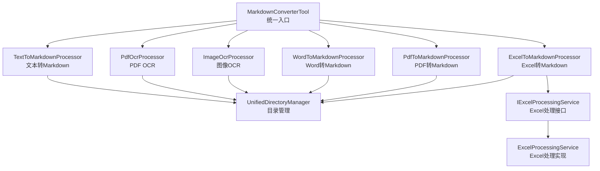
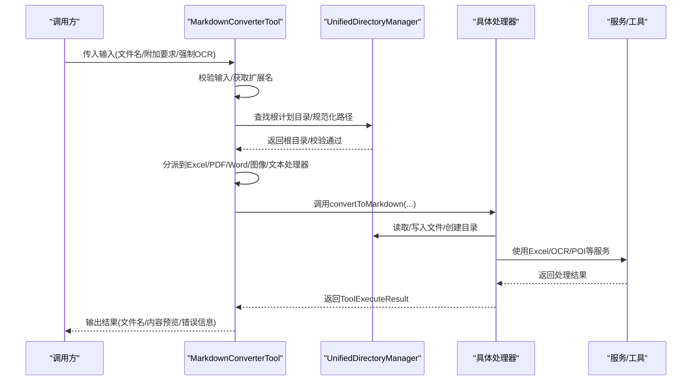
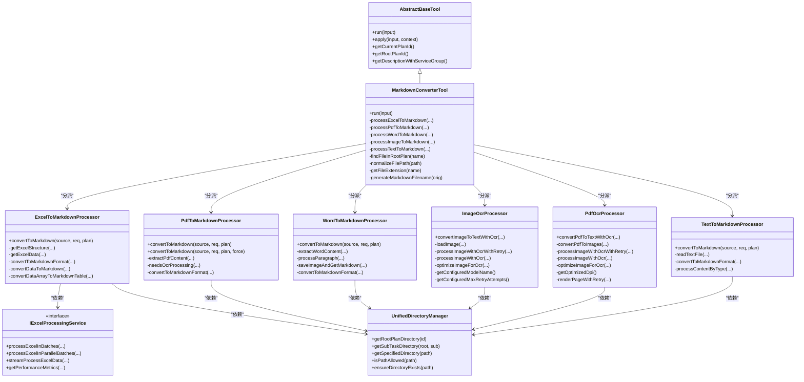
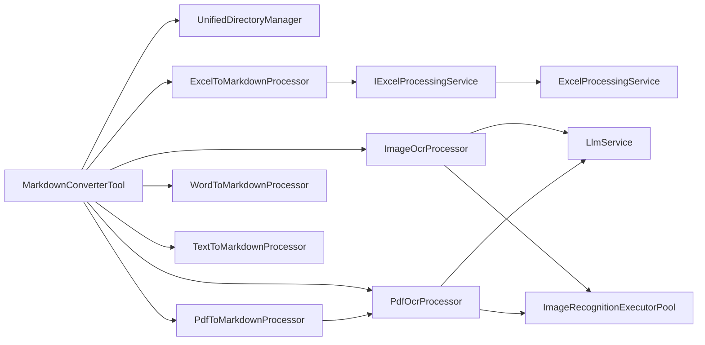

# 文档转换工具

<cite>
**本文引用的文件列表**
- [MarkdownConverterTool.java](file://src/main/java/com/alibaba/cloud/ai/lynxe/tool/convertToMarkdown/MarkdownConverterTool.java)
- [ExcelToMarkdownProcessor.java](file://src/main/java/com/alibaba/cloud/ai/lynxe/tool/convertToMarkdown/ExcelToMarkdownProcessor.java)
- [PdfToMarkdownProcessor.java](file://src/main/java/com/alibaba/cloud/ai/lynxe/tool/convertToMarkdown/PdfToMarkdownProcessor.java)
- [WordToMarkdownProcessor.java](file://src/main/java/com/alibaba/cloud/ai/lynxe/tool/convertToMarkdown/WordToMarkdownProcessor.java)
- [ImageOcrProcessor.java](file://src/main/java/com/alibaba/cloud/ai/lynxe/tool/convertToMarkdown/ImageOcrProcessor.java)
- [PdfOcrProcessor.java](file://src/main/java/com/alibaba/cloud/ai/lynxe/tool/convertToMarkdown/PdfOcrProcessor.java)
- [TextToMarkdownProcessor.java](file://src/main/java/com/alibaba/cloud/ai/lynxe/tool/convertToMarkdown/TextToMarkdownProcessor.java)
- [IExcelProcessingService.java](file://src/main/java/com/alibaba/cloud/ai/lynxe/tool/excelProcessor/IExcelProcessingService.java)
- [ExcelProcessingService.java](file://src/main/java/com/alibaba/cloud/ai/lynxe/tool/excelProcessor/ExcelProcessingService.java)
- [UnifiedDirectoryManager.java](file://src/main/java/com/alibaba/cloud/ai/lynxe/tool/filesystem/UnifiedDirectoryManager.java)
- [AbstractBaseTool.java](file://src/main/java/com/alibaba/cloud/ai/lynxe/tool/AbstractBaseTool.java)
- [application.yml](file://src/main/resources/application.yml)
</cite>

## 目录
1. [简介](#简介)
2. [项目结构](#项目结构)
3. [核心组件](#核心组件)
4. [架构总览](#架构总览)
5. [详细组件分析](#详细组件分析)
6. [依赖关系分析](#依赖关系分析)
7. [性能与优化](#性能与优化)
8. [故障排查指南](#故障排查指南)
9. [结论](#结论)
10. [附录](#附录)

## 简介
本技术文档围绕“文档转换工具”展开，重点阐述 MarkdownConverterTool 作为统一入口的设计与实现机制，并深入解析各处理器（ExcelToMarkdownProcessor、PdfToMarkdownProcessor、WordToMarkdownProcessor、ImageOcrProcessor、PdfOcrProcessor、TextToMarkdownProcessor）对不同文件格式的解析与转换逻辑。文档还覆盖 OCR 技术在图像与 PDF 内容提取中的应用、文本编码自动识别与处理策略、复杂格式文档（如含表格的 Excel、带公式的 Excel、含图片的 Word、含表格的 PDF）的结构化 Markdown 转换实践、错误处理流程（密码保护、损坏文件）、大文件流式处理优化、性能监控指标以及扩展自定义处理器的方法。

## 项目结构
- 工具层位于 convertToMarkdown 包中，提供统一入口与多种格式处理器：
  - MarkdownConverterTool：统一调度器，按文件类型分发到具体处理器
  - ExcelToMarkdownProcessor：Excel 结构与数据抽取并转 Markdown 表格
  - PdfToMarkdownProcessor：PDF 文本提取或 OCR 提取
  - WordToMarkdownProcessor：Word 文本与图片抽取并转 Markdown
  - ImageOcrProcessor：图像 OCR 提取文本
  - PdfOcrProcessor：PDF 分页渲染为图像后 OCR 提取文本
  - TextToMarkdownProcessor：通用文本格式转 Markdown
- 文件系统与路径管理由 UnifiedDirectoryManager 统一提供
- Excel 处理能力由 IExcelProcessingService 接口与 ExcelProcessingService 实现提供
- 基类 AbstractBaseTool 提供计划上下文与工具接口规范
- 应用配置 application.yml 提供运行期参数与日志级别

图表来源
- [MarkdownConverterTool.java](file://src/main/java/com/alibaba/cloud/ai/lynxe/tool/convertToMarkdown/MarkdownConverterTool.java#L1-L385)
- [ExcelToMarkdownProcessor.java](file://src/main/java/com/alibaba/cloud/ai/lynxe/tool/convertToMarkdown/ExcelToMarkdownProcessor.java#L1-L597)
- [PdfToMarkdownProcessor.java](file://src/main/java/com/alibaba/cloud/ai/lynxe/tool/convertToMarkdown/PdfToMarkdownProcessor.java#L1-L395)
- [WordToMarkdownProcessor.java](file://src/main/java/com/alibaba/cloud/ai/lynxe/tool/convertToMarkdown/WordToMarkdownProcessor.java#L1-L389)
- [ImageOcrProcessor.java](file://src/main/java/com/alibaba/cloud/ai/lynxe/tool/convertToMarkdown/ImageOcrProcessor.java#L1-L489)
- [PdfOcrProcessor.java](file://src/main/java/com/alibaba/cloud/ai/lynxe/tool/convertToMarkdown/PdfOcrProcessor.java#L1-L867)
- [TextToMarkdownProcessor.java](file://src/main/java/com/alibaba/cloud/ai/lynxe/tool/convertToMarkdown/TextToMarkdownProcessor.java#L1-L400)
- [IExcelProcessingService.java](file://src/main/java/com/alibaba/cloud/ai/lynxe/tool/excelProcessor/IExcelProcessingService.java#L1-L398)
- [ExcelProcessingService.java](file://src/main/java/com/alibaba/cloud/ai/lynxe/tool/excelProcessor/ExcelProcessingService.java#L818-L871)
- [UnifiedDirectoryManager.java](file://src/main/java/com/alibaba/cloud/ai/lynxe/tool/filesystem/UnifiedDirectoryManager.java#L1-L439)

章节来源
- [MarkdownConverterTool.java](file://src/main/java/com/alibaba/cloud/ai/lynxe/tool/convertToMarkdown/MarkdownConverterTool.java#L1-L385)
- [UnifiedDirectoryManager.java](file://src/main/java/com/alibaba/cloud/ai/lynxe/tool/filesystem/UnifiedDirectoryManager.java#L1-L439)

## 核心组件
- MarkdownConverterTool：统一入口，负责输入校验、文件定位、类型分发与结果汇总；支持强制使用 LLM/OCR 的 PDF 转换开关。
- ExcelToMarkdownProcessor：基于 IExcelProcessingService 抽取 Excel 结构与数据，合并多工作表，生成 Markdown 表格。
- PdfToMarkdownProcessor：优先尝试传统文本提取，必要时触发 OCR；支持强制 OCR 模式。
- WordToMarkdownProcessor：使用 Apache POI 读取段落与图片，输出 Markdown 文本与图片引用。
- ImageOcrProcessor：图像加载与优化，调用 LlmService 的 ChatClient 执行 OCR，支持重试与并发执行池。
- PdfOcrProcessor：PDF 渲染为图像，批量 OCR，支持 DPI 与图像类型优化、临时图像保存控制。
- TextToMarkdownProcessor：根据扩展名选择合适的 Markdown 包装与高亮方式，支持日志、JSON、XML、YAML、代码等格式。
- IExcelProcessingService/ExcelProcessingService：提供 Excel 大文件批处理、并行批处理、流式处理、性能指标等能力。
- UnifiedDirectoryManager：统一根目录与子任务目录管理，确保安全路径访问与外部链接目录维护。
- AbstractBaseTool：工具基类，提供计划上下文注入与描述信息拼接。

章节来源
- [MarkdownConverterTool.java](file://src/main/java/com/alibaba/cloud/ai/lynxe/tool/convertToMarkdown/MarkdownConverterTool.java#L1-L385)
- [ExcelToMarkdownProcessor.java](file://src/main/java/com/alibaba/cloud/ai/lynxe/tool/convertToMarkdown/ExcelToMarkdownProcessor.java#L1-L597)
- [PdfToMarkdownProcessor.java](file://src/main/java/com/alibaba/cloud/ai/lynxe/tool/convertToMarkdown/PdfToMarkdownProcessor.java#L1-L395)
- [WordToMarkdownProcessor.java](file://src/main/java/com/alibaba/cloud/ai/lynxe/tool/convertToMarkdown/WordToMarkdownProcessor.java#L1-L389)
- [ImageOcrProcessor.java](file://src/main/java/com/alibaba/cloud/ai/lynxe/tool/convertToMarkdown/ImageOcrProcessor.java#L1-L489)
- [PdfOcrProcessor.java](file://src/main/java/com/alibaba/cloud/ai/lynxe/tool/convertToMarkdown/PdfOcrProcessor.java#L1-L867)
- [TextToMarkdownProcessor.java](file://src/main/java/com/alibaba/cloud/ai/lynxe/tool/convertToMarkdown/TextToMarkdownProcessor.java#L1-L400)
- [IExcelProcessingService.java](file://src/main/java/com/alibaba/cloud/ai/lynxe/tool/excelProcessor/IExcelProcessingService.java#L1-L398)
- [ExcelProcessingService.java](file://src/main/java/com/alibaba/cloud/ai/lynxe/tool/excelProcessor/ExcelProcessingService.java#L818-L871)
- [UnifiedDirectoryManager.java](file://src/main/java/com/alibaba/cloud/ai/lynxe/tool/filesystem/UnifiedDirectoryManager.java#L1-L439)
- [AbstractBaseTool.java](file://src/main/java/com/alibaba/cloud/ai/lynxe/tool/AbstractBaseTool.java#L1-L112)

## 架构总览
MarkdownConverterTool 作为统一入口，接收用户输入（文件名、附加要求、PDF 强制 OCR 标记），在根计划目录中定位文件，依据扩展名分派到对应处理器。处理器内部通过 UnifiedDirectoryManager 获取工作目录，进行文件读写与资源管理；Excel 处理依赖 IExcelProcessingService；OCR 处理依赖 LlmService 与 ImageRecognitionExecutorPool。整体流程强调安全性（路径校验与限制）、健壮性（异常捕获与重试）、可观测性（日志与性能指标）。

图表来源
- [MarkdownConverterTool.java](file://src/main/java/com/alibaba/cloud/ai/lynxe/tool/convertToMarkdown/MarkdownConverterTool.java#L110-L234)
- [ExcelToMarkdownProcessor.java](file://src/main/java/com/alibaba/cloud/ai/lynxe/tool/convertToMarkdown/ExcelToMarkdownProcessor.java#L68-L118)
- [PdfToMarkdownProcessor.java](file://src/main/java/com/alibaba/cloud/ai/lynxe/tool/convertToMarkdown/PdfToMarkdownProcessor.java#L96-L165)
- [WordToMarkdownProcessor.java](file://src/main/java/com/alibaba/cloud/ai/lynxe/tool/convertToMarkdown/WordToMarkdownProcessor.java#L60-L109)
- [ImageOcrProcessor.java](file://src/main/java/com/alibaba/cloud/ai/lynxe/tool/convertToMarkdown/ImageOcrProcessor.java#L82-L179)
- [TextToMarkdownProcessor.java](file://src/main/java/com/alibaba/cloud/ai/lynxe/tool/convertToMarkdown/TextToMarkdownProcessor.java#L53-L101)
- [UnifiedDirectoryManager.java](file://src/main/java/com/alibaba/cloud/ai/lynxe/tool/filesystem/UnifiedDirectoryManager.java#L107-L141)

## 详细组件分析

### MarkdownConverterTool（统一入口）
- 输入模型包含：文件名、附加要求、PDF 强制 OCR 标记
- 关键流程：
  - 输入校验与扩展名解析
  - 在根计划目录中查找文件并规范化路径（防止越权访问）
  - 按扩展名分派到对应处理器
  - 对于图像与 PDF，支持强制 OCR 模式
  - 统一返回 ToolExecuteResult，包含输出文件名、内容预览与错误信息
- 安全与路径：
  - 使用 UnifiedDirectoryManager 获取根计划目录
  - 规范化路径去除相对路径与前缀，确保只在允许范围内访问
- 可扩展点：
  - 支持新增文件类型分支
  - 可注入更多处理器与服务

章节来源
- [MarkdownConverterTool.java](file://src/main/java/com/alibaba/cloud/ai/lynxe/tool/convertToMarkdown/MarkdownConverterTool.java#L71-L234)
- [MarkdownConverterTool.java](file://src/main/java/com/alibaba/cloud/ai/lynxe/tool/convertToMarkdown/MarkdownConverterTool.java#L236-L384)
- [UnifiedDirectoryManager.java](file://src/main/java/com/alibaba/cloud/ai/lynxe/tool/filesystem/UnifiedDirectoryManager.java#L107-L141)

### ExcelToMarkdownProcessor（Excel 转 Markdown）
- 功能要点：
  - 先获取 Excel 结构（工作表名、行列信息）
  - 逐表读取数据，支持多工作表合并
  - 将数据数组转换为 Markdown 表格，保留表头与数据行
  - 生成 content.md 并返回结果
- 数据结构与复杂度：
  - 多工作表数据以 JSON 结构聚合，便于后续解析
  - 表格转换为 O(R*C) 复杂度（R 行数，C 列数）
- 错误处理：
  - 结构/数据读取失败时返回错误信息
  - 文件已存在则跳过转换
- 性能优化：
  - 依赖 IExcelProcessingService 的批处理与并行批处理接口，适合大文件

章节来源
- [ExcelToMarkdownProcessor.java](file://src/main/java/com/alibaba/cloud/ai/lynxe/tool/convertToMarkdown/ExcelToMarkdownProcessor.java#L68-L118)
- [ExcelToMarkdownProcessor.java](file://src/main/java/com/alibaba/cloud/ai/lynxe/tool/convertToMarkdown/ExcelToMarkdownProcessor.java#L136-L222)
- [ExcelToMarkdownProcessor.java](file://src/main/java/com/alibaba/cloud/ai/lynxe/tool/convertToMarkdown/ExcelToMarkdownProcessor.java#L224-L327)
- [ExcelToMarkdownProcessor.java](file://src/main/java/com/alibaba/cloud/ai/lynxe/tool/convertToMarkdown/ExcelToMarkdownProcessor.java#L329-L492)
- [ExcelToMarkdownProcessor.java](file://src/main/java/com/alibaba/cloud/ai/lynxe/tool/convertToMarkdown/ExcelToMarkdownProcessor.java#L494-L597)
- [IExcelProcessingService.java](file://src/main/java/com/alibaba/cloud/ai/lynxe/tool/excelProcessor/IExcelProcessingService.java#L173-L234)
- [ExcelProcessingService.java](file://src/main/java/com/alibaba/cloud/ai/lynxe/tool/excelProcessor/ExcelProcessingService.java#L818-L871)

### PdfToMarkdownProcessor（PDF 转 Markdown）
- 功能要点：
  - 优先使用 PDFBox 提取文本
  - 自动判断是否需要 OCR（内容为空、内容过短、空白过多）
  - 传统提取失败时调用 PdfOcrProcessor
  - 将提取内容格式化为 Markdown（标题、列表、代码块识别）
- OCR 触发策略：
  - 无内容或内容极短或空白占比过高时建议/强制 OCR
- 输出：
  - 生成 content.md，包含处理方法说明与内容预览

章节来源
- [PdfToMarkdownProcessor.java](file://src/main/java/com/alibaba/cloud/ai/lynxe/tool/convertToMarkdown/PdfToMarkdownProcessor.java#L96-L165)
- [PdfToMarkdownProcessor.java](file://src/main/java/com/alibaba/cloud/ai/lynxe/tool/convertToMarkdown/PdfToMarkdownProcessor.java#L167-L242)
- [PdfToMarkdownProcessor.java](file://src/main/java/com/alibaba/cloud/ai/lynxe/tool/convertToMarkdown/PdfToMarkdownProcessor.java#L244-L394)
- [PdfOcrProcessor.java](file://src/main/java/com/alibaba/cloud/ai/lynxe/tool/convertToMarkdown/PdfOcrProcessor.java#L82-L215)

### WordToMarkdownProcessor（Word 转 Markdown）
- 功能要点：
  - 使用 Apache POI 读取段落与嵌入图片
  - 图片保存到同名子目录，并在 Markdown 中以相对路径引用
  - 将文本内容格式化为 Markdown（标题、列表、代码块识别）
- 输出：
  - 生成 content.md，包含图片引用与内容预览

章节来源
- [WordToMarkdownProcessor.java](file://src/main/java/com/alibaba/cloud/ai/lynxe/tool/convertToMarkdown/WordToMarkdownProcessor.java#L60-L109)
- [WordToMarkdownProcessor.java](file://src/main/java/com/alibaba/cloud/ai/lynxe/tool/convertToMarkdown/WordToMarkdownProcessor.java#L111-L181)
- [WordToMarkdownProcessor.java](file://src/main/java/com/alibaba/cloud/ai/lynxe/tool/convertToMarkdown/WordToMarkdownProcessor.java#L182-L235)
- [WordToMarkdownProcessor.java](file://src/main/java/com/alibaba/cloud/ai/lynxe/tool/convertToMarkdown/WordToMarkdownProcessor.java#L236-L389)

### ImageOcrProcessor（图像 OCR）
- 功能要点：
  - 加载图像并优化尺寸（最长边不超过阈值）
  - 通过 LlmService 的 ChatClient 调用 OCR 模型
  - 支持重试与并发执行池（ImageRecognitionExecutorPool）
  - 保存 OCR 结果为文本或 Markdown（取决于目标文件名）
- 配置与状态：
  - 从 LynxeProperties 获取模型名称、重试次数、DPI 等
  - 提供当前配置状态查询

章节来源
- [ImageOcrProcessor.java](file://src/main/java/com/alibaba/cloud/ai/lynxe/tool/convertToMarkdown/ImageOcrProcessor.java#L82-L179)
- [ImageOcrProcessor.java](file://src/main/java/com/alibaba/cloud/ai/lynxe/tool/convertToMarkdown/ImageOcrProcessor.java#L181-L256)
- [ImageOcrProcessor.java](file://src/main/java/com/alibaba/cloud/ai/lynxe/tool/convertToMarkdown/ImageOcrProcessor.java#L258-L322)
- [ImageOcrProcessor.java](file://src/main/java/com/alibaba/cloud/ai/lynxe/tool/convertToMarkdown/ImageOcrProcessor.java#L324-L399)
- [ImageOcrProcessor.java](file://src/main/java/com/alibaba/cloud/ai/lynxe/tool/convertToMarkdown/ImageOcrProcessor.java#L400-L489)

### PdfOcrProcessor（PDF OCR）
- 功能要点：
  - 使用 PDFBox 将每一页渲染为图像
  - 并行提交 OCR 任务，逐页提取文本并组织为 Markdown
  - 支持 DPI 与图像类型优化、临时图像保存控制
- 错误处理：
  - 单页渲染失败不影响整体流程，继续下一页
  - 无页成功提取则返回错误

章节来源
- [PdfOcrProcessor.java](file://src/main/java/com/alibaba/cloud/ai/lynxe/tool/convertToMarkdown/PdfOcrProcessor.java#L82-L215)
- [PdfOcrProcessor.java](file://src/main/java/com/alibaba/cloud/ai/lynxe/tool/convertToMarkdown/PdfOcrProcessor.java#L230-L350)
- [PdfOcrProcessor.java](file://src/main/java/com/alibaba/cloud/ai/lynxe/tool/convertToMarkdown/PdfOcrProcessor.java#L352-L507)
- [PdfOcrProcessor.java](file://src/main/java/com/alibaba/cloud/ai/lynxe/tool/convertToMarkdown/PdfOcrProcessor.java#L509-L800)

### TextToMarkdownProcessor（文本转 Markdown）
- 功能要点：
  - 根据扩展名选择包装方式（JSON/XML/YAML/代码/日志/Markdown/纯文本）
  - 对日志进行错误/警告/INFO 标注
  - 对代码内容添加语法高亮标记
- 输出：
  - 生成 content.md，包含源文件信息与内容预览

章节来源
- [TextToMarkdownProcessor.java](file://src/main/java/com/alibaba/cloud/ai/lynxe/tool/convertToMarkdown/TextToMarkdownProcessor.java#L53-L101)
- [TextToMarkdownProcessor.java](file://src/main/java/com/alibaba/cloud/ai/lynxe/tool/convertToMarkdown/TextToMarkdownProcessor.java#L103-L178)
- [TextToMarkdownProcessor.java](file://src/main/java/com/alibaba/cloud/ai/lynxe/tool/convertToMarkdown/TextToMarkdownProcessor.java#L179-L261)
- [TextToMarkdownProcessor.java](file://src/main/java/com/alibaba/cloud/ai/lynxe/tool/convertToMarkdown/TextToMarkdownProcessor.java#L262-L400)

### 类关系图（代码级）

图表来源
- [AbstractBaseTool.java](file://src/main/java/com/alibaba/cloud/ai/lynxe/tool/AbstractBaseTool.java#L1-L112)
- [MarkdownConverterTool.java](file://src/main/java/com/alibaba/cloud/ai/lynxe/tool/convertToMarkdown/MarkdownConverterTool.java#L1-L385)
- [ExcelToMarkdownProcessor.java](file://src/main/java/com/alibaba/cloud/ai/lynxe/tool/convertToMarkdown/ExcelToMarkdownProcessor.java#L1-L597)
- [PdfToMarkdownProcessor.java](file://src/main/java/com/alibaba/cloud/ai/lynxe/tool/convertToMarkdown/PdfToMarkdownProcessor.java#L1-L395)
- [WordToMarkdownProcessor.java](file://src/main/java/com/alibaba/cloud/ai/lynxe/tool/convertToMarkdown/WordToMarkdownProcessor.java#L1-L389)
- [ImageOcrProcessor.java](file://src/main/java/com/alibaba/cloud/ai/lynxe/tool/convertToMarkdown/ImageOcrProcessor.java#L1-L489)
- [PdfOcrProcessor.java](file://src/main/java/com/alibaba/cloud/ai/lynxe/tool/convertToMarkdown/PdfOcrProcessor.java#L1-L867)
- [TextToMarkdownProcessor.java](file://src/main/java/com/alibaba/cloud/ai/lynxe/tool/convertToMarkdown/TextToMarkdownProcessor.java#L1-L400)
- [IExcelProcessingService.java](file://src/main/java/com/alibaba/cloud/ai/lynxe/tool/excelProcessor/IExcelProcessingService.java#L1-L398)
- [UnifiedDirectoryManager.java](file://src/main/java/com/alibaba/cloud/ai/lynxe/tool/filesystem/UnifiedDirectoryManager.java#L1-L439)

## 依赖关系分析
- 组件耦合：
  - MarkdownConverterTool 与各处理器之间为松耦合的分派关系
  - 处理器均依赖 UnifiedDirectoryManager 进行目录与路径管理
  - Excel 处理器依赖 IExcelProcessingService，便于替换实现与扩展
  - OCR 处理器依赖 LlmService 与 ImageRecognitionExecutorPool，具备并发与重试能力
- 外部依赖：
  - PDFBox 用于 PDF 文本提取与图像渲染
  - Apache POI 用于 Word 文档解析
  - Spring AI ChatClient 用于 OCR 能力调用
- 潜在循环依赖：
  - 当前结构未见循环依赖；若新增自定义处理器，请保持单向依赖链

图表来源
- [MarkdownConverterTool.java](file://src/main/java/com/alibaba/cloud/ai/lynxe/tool/convertToMarkdown/MarkdownConverterTool.java#L1-L385)
- [ExcelToMarkdownProcessor.java](file://src/main/java/com/alibaba/cloud/ai/lynxe/tool/convertToMarkdown/ExcelToMarkdownProcessor.java#L1-L597)
- [PdfToMarkdownProcessor.java](file://src/main/java/com/alibaba/cloud/ai/lynxe/tool/convertToMarkdown/PdfToMarkdownProcessor.java#L1-L395)
- [WordToMarkdownProcessor.java](file://src/main/java/com/alibaba/cloud/ai/lynxe/tool/convertToMarkdown/WordToMarkdownProcessor.java#L1-L389)
- [ImageOcrProcessor.java](file://src/main/java/com/alibaba/cloud/ai/lynxe/tool/convertToMarkdown/ImageOcrProcessor.java#L1-L489)
- [PdfOcrProcessor.java](file://src/main/java/com/alibaba/cloud/ai/lynxe/tool/convertToMarkdown/PdfOcrProcessor.java#L1-L867)
- [TextToMarkdownProcessor.java](file://src/main/java/com/alibaba/cloud/ai/lynxe/tool/convertToMarkdown/TextToMarkdownProcessor.java#L1-L400)
- [IExcelProcessingService.java](file://src/main/java/com/alibaba/cloud/ai/lynxe/tool/excelProcessor/IExcelProcessingService.java#L1-L398)
- [ExcelProcessingService.java](file://src/main/java/com/alibaba/cloud/ai/lynxe/tool/excelProcessor/ExcelProcessingService.java#L818-L871)
- [UnifiedDirectoryManager.java](file://src/main/java/com/alibaba/cloud/ai/lynxe/tool/filesystem/UnifiedDirectoryManager.java#L1-L439)

## 性能与优化
- 大文件处理：
  - Excel：IExcelProcessingService 提供批处理、并行批处理与流式处理接口，适合大文件内存优化与进度跟踪
  - PDF：PdfOcrProcessor 支持并行 OCR 与 DPI 优化，降低渲染成本
  - 图像：ImageOcrProcessor 对图像进行尺寸优化，减少 OCR 成本
- 性能监控：
  - ExcelProcessingService 提供 getPerformanceMetrics，记录操作耗时、行数、并行度、内存占用等
- 流式与并发：
  - 使用 ImageRecognitionExecutorPool 并发执行 OCR 任务
  - PDF 渲染与 OCR 采用 CompletableFuture 并行化
- 编码与路径：
  - 统一 UTF-8 写出，路径规范化与安全检查，避免越权与路径穿越

章节来源
- [IExcelProcessingService.java](file://src/main/java/com/alibaba/cloud/ai/lynxe/tool/excelProcessor/IExcelProcessingService.java#L173-L234)
- [ExcelProcessingService.java](file://src/main/java/com/alibaba/cloud/ai/lynxe/tool/excelProcessor/ExcelProcessingService.java#L818-L871)
- [PdfOcrProcessor.java](file://src/main/java/com/alibaba/cloud/ai/lynxe/tool/convertToMarkdown/PdfOcrProcessor.java#L110-L175)
- [ImageOcrProcessor.java](file://src/main/java/com/alibaba/cloud/ai/lynxe/tool/convertToMarkdown/ImageOcrProcessor.java#L101-L179)
- [UnifiedDirectoryManager.java](file://src/main/java/com/alibaba/cloud/ai/lynxe/tool/filesystem/UnifiedDirectoryManager.java#L194-L214)

## 故障排查指南
- 常见错误与处理：
  - 文件不存在/路径不合法：MarkdownConverterTool 在 findFileInRootPlan 中进行路径规范化与越权检查，返回明确错误
  - 不支持的文件类型：MarkdownConverterTool 返回“不支持类型”错误
  - PDF 无法提取文本：PdfToMarkdownProcessor 自动触发 OCR；也可通过 forceLlmForPdf 强制 OCR
  - 图像 OCR 失败：ImageOcrProcessor 支持重试与并发池；检查 LlmService 初始化与模型配置
  - Excel 读取失败：ExcelToMarkdownProcessor 捕获异常并返回错误；确认文件未被占用且格式正确
  - 文件过大：TextFileService 等工具对大文件有大小限制，建议拆分或使用流式处理
- 日志与诊断：
  - 各处理器均使用 SLF4J 记录关键步骤与错误
  - ImageOcrProcessor/PdfOcrProcessor 提供配置状态查询方法，便于快速核对模型与重试设置
- 配置参考：
  - application.yml 中包含日志级别与上传限制等运行期参数

章节来源
- [MarkdownConverterTool.java](file://src/main/java/com/alibaba/cloud/ai/lynxe/tool/convertToMarkdown/MarkdownConverterTool.java#L118-L155)
- [PdfToMarkdownProcessor.java](file://src/main/java/com/alibaba/cloud/ai/lynxe/tool/convertToMarkdown/PdfToMarkdownProcessor.java#L122-L165)
- [ImageOcrProcessor.java](file://src/main/java/com/alibaba/cloud/ai/lynxe/tool/convertToMarkdown/ImageOcrProcessor.java#L101-L179)
- [ExcelToMarkdownProcessor.java](file://src/main/java/com/alibaba/cloud/ai/lynxe/tool/convertToMarkdown/ExcelToMarkdownProcessor.java#L114-L118)
- [application.yml](file://src/main/resources/application.yml#L48-L98)

## 结论
MarkdownConverterTool 通过清晰的统一入口与严格的路径安全控制，将多种文档格式转换为结构化的 Markdown，满足 AI 代理的理解与处理需求。各处理器针对特定格式实现了稳健的数据抽取与格式化逻辑，并结合 OCR 技术覆盖了图像与 PDF 的复杂场景。配合 IExcelProcessingService 的大文件处理能力与性能监控接口，系统在可靠性、可扩展性与可观测性方面表现良好。建议在生产环境中结合配置参数与日志策略，持续优化 OCR 与 Excel 处理的性能与稳定性。

## 附录
- 扩展自定义处理器的方法：
  - 新建处理器类，实现 convertToMarkdown(Path, String, String) 方法
  - 在 MarkdownConverterTool 的分派逻辑中增加新的扩展名分支
  - 注入必要的服务（如 UnifiedDirectoryManager、LlmService、Excel 处理接口等）
  - 在测试中验证路径安全、错误处理与输出格式
- 复杂格式示例：
  - 含表格的 Excel：使用 ExcelToMarkdownProcessor 的多工作表合并与表格转换
  - 带公式的 Excel：通过 IExcelProcessingService 的公式接口读取计算结果后再转 Markdown
  - 含图片的 Word：使用 WordToMarkdownProcessor 的图片抽取与 Markdown 引用
  - 含表格的 PDF：优先传统提取，失败时使用 PdfOcrProcessor 的分页 OCR

章节来源
- [MarkdownConverterTool.java](file://src/main/java/com/alibaba/cloud/ai/lynxe/tool/convertToMarkdown/MarkdownConverterTool.java#L138-L234)
- [ExcelToMarkdownProcessor.java](file://src/main/java/com/alibaba/cloud/ai/lynxe/tool/convertToMarkdown/ExcelToMarkdownProcessor.java#L136-L222)
- [WordToMarkdownProcessor.java](file://src/main/java/com/alibaba/cloud/ai/lynxe/tool/convertToMarkdown/WordToMarkdownProcessor.java#L111-L181)
- [PdfOcrProcessor.java](file://src/main/java/com/alibaba/cloud/ai/lynxe/tool/convertToMarkdown/PdfOcrProcessor.java#L82-L215)