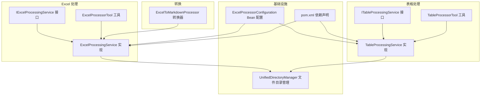
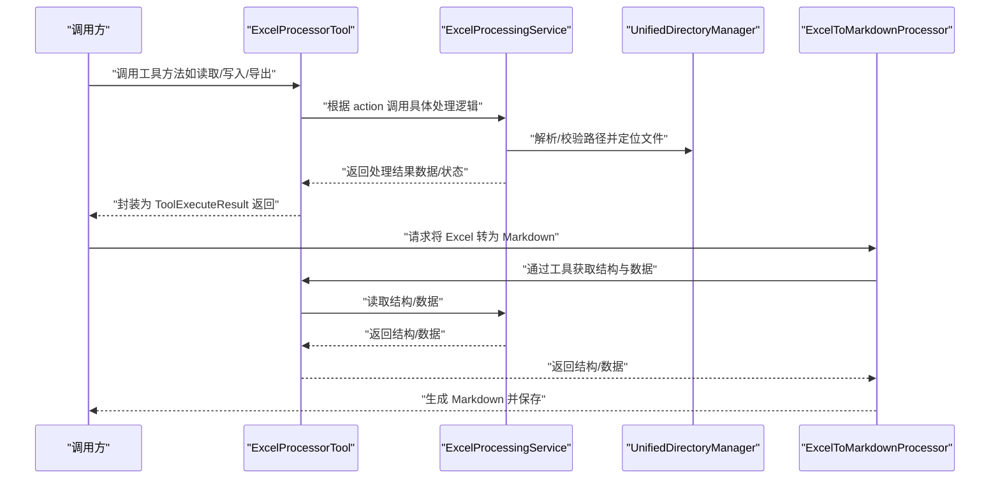
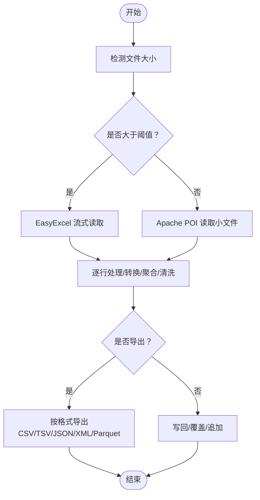
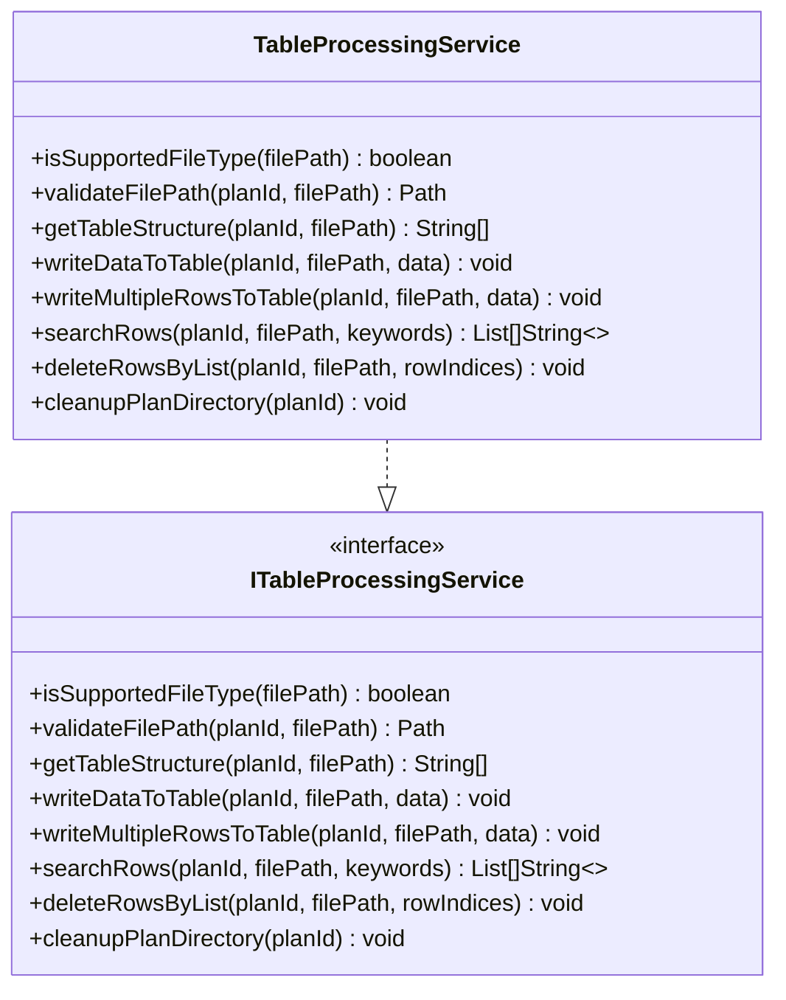
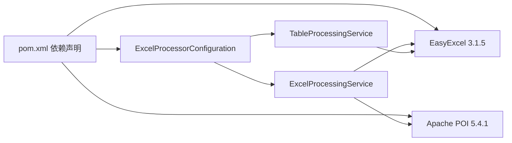

# 电子表格处理

<cite>
**本文引用的文件**
- [ExcelProcessingService.java](file://src/main/java/com/alibaba/cloud/ai/lynxe/tool/excelProcessor/ExcelProcessingService.java)
- [IExcelProcessingService.java](file://src/main/java/com/alibaba/cloud/ai/lynxe/tool/excelProcessor/IExcelProcessingService.java)
- [ExcelProcessorTool.java](file://src/main/java/com/alibaba/cloud/ai/lynxe/tool/excelProcessor/ExcelProcessorTool.java)
- [TableProcessingService.java](file://src/main/java/com/alibaba/cloud/ai/lynxe/tool/tableProcessor/TableProcessingService.java)
- [ITableProcessingService.java](file://src/main/java/com/alibaba/cloud/ai/lynxe/tool/tableProcessor/ITableProcessingService.java)
- [TableProcessorTool.java](file://src/main/java/com/alibaba/cloud/ai/lynxe/tool/tableProcessor/TableProcessorTool.java)
- [ExcelToMarkdownProcessor.java](file://src/main/java/com/alibaba/cloud/ai/lynxe/tool/convertToMarkdown/ExcelToMarkdownProcessor.java)
- [ExcelProcessorConfiguration.java](file://src/main/java/com/alibaba/cloud/ai/lynxe/config/ExcelProcessorConfiguration.java)
- [pom.xml](file://pom.xml)
- [ExcelProcessingServiceTest.java](file://src/test/java/com/alibaba/cloud/ai/lynxe/tool/excelProcessor/ExcelProcessingServiceTest.java)
</cite>

## 目录
1. [简介](#简介)
2. [项目结构](#项目结构)
3. [核心组件](#核心组件)
4. [架构总览](#架构总览)
5. [详细组件分析](#详细组件分析)
6. [依赖分析](#依赖分析)
7. [性能考虑](#性能考虑)
8. [故障排查指南](#故障排查指南)
9. [结论](#结论)
10. [附录](#附录)

## 简介
本文件系统性阐述电子表格处理能力，重点围绕以下目标：
- 基于 EasyExcel 的流式读写能力与内存优化机制
- 表格数据提取、清洗、转换与分析（含合并单元格、公式计算结果、数据验证规则）
- 将 Excel 结构化数据转换为 AI 可操作的 JSON 或 Markdown 格式
- 服务间协作关系（ExcelProcessingService 与 TableProcessingService 的调用链）
- 批量处理、并发执行、异常恢复等高级用法
- 性能调优建议（分页大小、对象复用）与常见问题解决方案（日期格式解析、大数据量 OOM）

## 项目结构
电子表格处理相关模块位于工具层，采用“接口 + 实现 + 工具封装”的分层设计：
- 接口层：定义统一能力契约（读写、搜索、格式化、导出、批处理、流式处理、校验清洗等）
- 实现层：基于 EasyExcel 和 Apache POI 的高性能实现
- 工具层：面向外部调用的函数式工具，封装参数校验与调用链
- 转换层：将 Excel 数据转换为 Markdown 文档，便于下游 AI 使用

图表来源
- [ExcelProcessingService.java](file://src/main/java/com/alibaba/cloud/ai/lynxe/tool/excelProcessor/ExcelProcessingService.java#L1-L120)
- [IExcelProcessingService.java](file://src/main/java/com/alibaba/cloud/ai/lynxe/tool/excelProcessor/IExcelProcessingService.java#L1-L120)
- [ExcelProcessorTool.java](file://src/main/java/com/alibaba/cloud/ai/lynxe/tool/excelProcessor/ExcelProcessorTool.java#L1-L120)
- [TableProcessingService.java](file://src/main/java/com/alibaba/cloud/ai/lynxe/tool/tableProcessor/TableProcessingService.java#L1-L120)
- [ITableProcessingService.java](file://src/main/java/com/alibaba/cloud/ai/lynxe/tool/tableProcessor/ITableProcessingService.java#L1-L120)
- [TableProcessorTool.java](file://src/main/java/com/alibaba/cloud/ai/lynxe/tool/tableProcessor/TableProcessorTool.java#L1-L120)
- [ExcelToMarkdownProcessor.java](file://src/main/java/com/alibaba/cloud/ai/lynxe/tool/convertToMarkdown/ExcelToMarkdownProcessor.java#L1-L120)
- [ExcelProcessorConfiguration.java](file://src/main/java/com/alibaba/cloud/ai/lynxe/config/ExcelProcessorConfiguration.java#L1-L46)
- [pom.xml](file://pom.xml#L274-L373)

章节来源
- [ExcelProcessingService.java](file://src/main/java/com/alibaba/cloud/ai/lynxe/tool/excelProcessor/ExcelProcessingService.java#L1-L120)
- [TableProcessingService.java](file://src/main/java/com/alibaba/cloud/ai/lynxe/tool/tableProcessor/TableProcessingService.java#L1-L120)
- [ExcelProcessorConfiguration.java](file://src/main/java/com/alibaba/cloud/ai/lynxe/config/ExcelProcessorConfiguration.java#L1-L46)
- [pom.xml](file://pom.xml#L274-L373)

## 核心组件
- ExcelProcessingService：基于 EasyExcel 的流式读写、大文件分页、并发批处理、流式处理、数据清洗与校验、导出多种格式（CSV/TSV/JSON/XML/Parquet）、性能指标记录
- TableProcessingService：基于 EasyExcel 的表结构读取、行写入（含 ID 列自动管理）、多行写入、搜索、删除、清理计划资源
- ExcelProcessorTool：对外暴露的函数式工具，封装 Excel 操作入口
- TableProcessorTool：对外暴露的函数式工具，封装表格操作入口
- ExcelToMarkdownProcessor：将 Excel 结构与数据转换为 Markdown 文档，便于 AI 使用

章节来源
- [IExcelProcessingService.java](file://src/main/java/com/alibaba/cloud/ai/lynxe/tool/excelProcessor/IExcelProcessingService.java#L1-L266)
- [ExcelProcessingService.java](file://src/main/java/com/alibaba/cloud/ai/lynxe/tool/excelProcessor/ExcelProcessingService.java#L1-L200)
- [ITableProcessingService.java](file://src/main/java/com/alibaba/cloud/ai/lynxe/tool/tableProcessor/ITableProcessingService.java#L1-L211)
- [TableProcessingService.java](file://src/main/java/com/alibaba/cloud/ai/lynxe/tool/tableProcessor/TableProcessingService.java#L1-L120)
- [ExcelProcessorTool.java](file://src/main/java/com/alibaba/cloud/ai/lynxe/tool/excelProcessor/ExcelProcessorTool.java#L1-L120)
- [TableProcessorTool.java](file://src/main/java/com/alibaba/cloud/ai/lynxe/tool/tableProcessor/TableProcessorTool.java#L1-L120)
- [ExcelToMarkdownProcessor.java](file://src/main/java/com/alibaba/cloud/ai/lynxe/tool/convertToMarkdown/ExcelToMarkdownProcessor.java#L1-L120)

## 架构总览
ExcelProcessingService 与 TableProcessingService 分别负责“Excel 文件级”和“表格数据级”的能力；ExcelProcessorTool 与 TableProcessorTool 提供统一的外部调用入口；ExcelToMarkdownProcessor 作为转换器，将 Excel 数据以 Markdown 形式输出，便于 AI 消费。

图表来源
- [ExcelProcessorTool.java](file://src/main/java/com/alibaba/cloud/ai/lynxe/tool/excelProcessor/ExcelProcessorTool.java#L430-L506)
- [ExcelProcessingService.java](file://src/main/java/com/alibaba/cloud/ai/lynxe/tool/excelProcessor/ExcelProcessingService.java#L230-L274)
- [ExcelToMarkdownProcessor.java](file://src/main/java/com/alibaba/cloud/ai/lynxe/tool/convertToMarkdown/ExcelToMarkdownProcessor.java#L139-L222)

## 详细组件分析

### ExcelProcessingService 组件分析
- 流式读写与内存优化
  - 大文件阈值判断与 EasyExcel 流式读取：当文件大小超过阈值时，使用 EasyExcel 的 PageReadListener 或 ReadListener 进行流式读取，避免一次性加载到内存
  - 写入优化：默认批量阈值触发 SXSSFWorkbook 写入，减少内存占用；保留其他工作表内容，避免覆盖
- 并发批处理
  - 生产者-消费者模型：单线程读取器 + 固定线程池消费者，阻塞队列承载批次，支持进度统计与异常中断
- 数据清洗与校验
  - 提供 DataValidator/DataCleaner 接口，逐行校验并清洗，输出验证报告
- 导出能力
  - 支持 CSV/TSV/JSON/XML/Parquet 多种导出格式，按需选择
- 性能度量
  - 计划维度的状态跟踪、性能指标记录，便于监控与优化

图表来源
- [ExcelProcessingService.java](file://src/main/java/com/alibaba/cloud/ai/lynxe/tool/excelProcessor/ExcelProcessingService.java#L276-L321)
- [ExcelProcessingService.java](file://src/main/java/com/alibaba/cloud/ai/lynxe/tool/excelProcessor/ExcelProcessingService.java#L418-L488)
- [ExcelProcessingService.java](file://src/main/java/com/alibaba/cloud/ai/lynxe/tool/excelProcessor/ExcelProcessingService.java#L510-L633)
- [ExcelProcessingService.java](file://src/main/java/com/alibaba/cloud/ai/lynxe/tool/excelProcessor/ExcelProcessingService.java#L635-L765)
- [ExcelProcessingService.java](file://src/main/java/com/alibaba/cloud/ai/lynxe/tool/excelProcessor/ExcelProcessingService.java#L766-L800)

章节来源
- [ExcelProcessingService.java](file://src/main/java/com/alibaba/cloud/ai/lynxe/tool/excelProcessor/ExcelProcessingService.java#L1-L200)
- [ExcelProcessingService.java](file://src/main/java/com/alibaba/cloud/ai/lynxe/tool/excelProcessor/ExcelProcessingService.java#L230-L321)
- [ExcelProcessingService.java](file://src/main/java/com/alibaba/cloud/ai/lynxe/tool/excelProcessor/ExcelProcessingService.java#L418-L488)
- [ExcelProcessingService.java](file://src/main/java/com/alibaba/cloud/ai/lynxe/tool/excelProcessor/ExcelProcessingService.java#L510-L765)
- [ExcelProcessingService.java](file://src/main/java/com/alibaba/cloud/ai/lynxe/tool/excelProcessor/ExcelProcessingService.java#L766-L800)

### TableProcessingService 组件分析
- 表结构读取
  - 使用 EasyExcel 官方推荐的 HeaderDataListener 读取首行作为表头，并在失败时回退到同步读取
- 写入与 ID 列管理
  - 自动添加 ID 列（作为第一列），支持按 ID 更新或新增行；多行写入时逐行校验列数
- 搜索与删除
  - 搜索关键词匹配任意单元格；删除行索引按降序排序，避免索引偏移
- 清理与状态
  - 记录每个计划的文件状态与当前文件路径，支持清理计划资源

图表来源
- [TableProcessingService.java](file://src/main/java/com/alibaba/cloud/ai/lynxe/tool/tableProcessor/TableProcessingService.java#L1-L120)
- [ITableProcessingService.java](file://src/main/java/com/alibaba/cloud/ai/lynxe/tool/tableProcessor/ITableProcessingService.java#L1-L211)

章节来源
- [TableProcessingService.java](file://src/main/java/com/alibaba/cloud/ai/lynxe/tool/tableProcessor/TableProcessingService.java#L1-L120)
- [TableProcessingService.java](file://src/main/java/com/alibaba/cloud/ai/lynxe/tool/tableProcessor/TableProcessingService.java#L304-L365)
- [TableProcessingService.java](file://src/main/java/com/alibaba/cloud/ai/lynxe/tool/tableProcessor/TableProcessingService.java#L401-L596)
- [TableProcessingService.java](file://src/main/java/com/alibaba/cloud/ai/lynxe/tool/tableProcessor/TableProcessingService.java#L598-L752)
- [ITableProcessingService.java](file://src/main/java/com/alibaba/cloud/ai/lynxe/tool/tableProcessor/ITableProcessingService.java#L1-L211)

### ExcelProcessorTool 与 TableProcessorTool
- ExcelProcessorTool
  - 动作集合：创建文件/表格、获取结构、读取/写入、更新单元格、搜索、删除行、格式化、添加公式、批量处理、智能导入、CSV 读取、并行批处理、转换聚合、流式处理、校验清洗、导出数据、性能指标
  - 参数校验与错误处理，统一返回 ToolExecuteResult
- TableProcessorTool
  - 动作集合：创建表格、获取结构、写入多行、搜索行、删除行
  - 参数校验与错误处理，统一返回 ToolExecuteResult

章节来源
- [ExcelProcessorTool.java](file://src/main/java/com/alibaba/cloud/ai/lynxe/tool/excelProcessor/ExcelProcessorTool.java#L1-L120)
- [ExcelProcessorTool.java](file://src/main/java/com/alibaba/cloud/ai/lynxe/tool/excelProcessor/ExcelProcessorTool.java#L430-L506)
- [TableProcessorTool.java](file://src/main/java/com/alibaba/cloud/ai/lynxe/tool/tableProcessor/TableProcessorTool.java#L1-L120)
- [TableProcessorTool.java](file://src/main/java/com/alibaba/cloud/ai/lynxe/tool/tableProcessor/TableProcessorTool.java#L266-L413)

### ExcelToMarkdownProcessor 转换器
- 从 Excel 中抽取结构与数据，转换为 Markdown 表格
- 支持多工作表合并输出，自动跳过已存在的目标 Markdown 文件
- 输出文件名由原文件扩展名替换为 .md

章节来源
- [ExcelToMarkdownProcessor.java](file://src/main/java/com/alibaba/cloud/ai/lynxe/tool/convertToMarkdown/ExcelToMarkdownProcessor.java#L1-L120)
- [ExcelToMarkdownProcessor.java](file://src/main/java/com/alibaba/cloud/ai/lynxe/tool/convertToMarkdown/ExcelToMarkdownProcessor.java#L139-L222)
- [ExcelToMarkdownProcessor.java](file://src/main/java/com/alibaba/cloud/ai/lynxe/tool/convertToMarkdown/ExcelToMarkdownProcessor.java#L329-L492)

## 依赖分析
- EasyExcel 3.1.5：用于 Excel 的流式读写、头部读取监听器、同步读取回退
- Apache POI 5.4.1 + poi-ooxml：用于传统 .xls/.xlsx 读写、SXSSFWorkbook 写入优化、公式评估
- Spring Bean 配置：ExcelProcessorConfiguration 注入 UnifiedDirectoryManager，注册 IExcelProcessingService 实现

图表来源
- [pom.xml](file://pom.xml#L274-L373)
- [ExcelProcessorConfiguration.java](file://src/main/java/com/alibaba/cloud/ai/lynxe/config/ExcelProcessorConfiguration.java#L1-L46)

章节来源
- [pom.xml](file://pom.xml#L274-L373)
- [ExcelProcessorConfiguration.java](file://src/main/java/com/alibaba/cloud/ai/lynxe/config/ExcelProcessorConfiguration.java#L1-L46)

## 性能考虑
- 分页与批量
  - 大文件阈值与默认批量大小：结合 DEFAULT_BATCH_SIZE 与 LARGE_FILE_THRESHOLD，合理设置批量大小以平衡吞吐与内存占用
- 对象复用
  - 使用 ReadListener/PageReadListener 与 SXSSFWorkbook，避免重复创建大量对象
- 并发策略
  - 并行批处理中，生产者-消费者队列容量建议为 parallelism 的倍数，避免阻塞与丢弃
- 内存优化
  - 写入大文件时优先使用 SXSSFWorkbook，控制窗口大小（SXSSF_WINDOW_SIZE）
- I/O 与路径
  - 使用 UnifiedDirectoryManager 统一路径解析，减少磁盘 IO 开销

章节来源
- [ExcelProcessingService.java](file://src/main/java/com/alibaba/cloud/ai/lynxe/tool/excelProcessor/ExcelProcessingService.java#L80-L86)
- [ExcelProcessingService.java](file://src/main/java/com/alibaba/cloud/ai/lynxe/tool/excelProcessor/ExcelProcessingService.java#L418-L488)
- [ExcelProcessingService.java](file://src/main/java/com/alibaba/cloud/ai/lynxe/tool/excelProcessor/ExcelProcessingService.java#L510-L633)

## 故障排查指南
- 日期格式解析错误
  - 现象：日期显示为序列号或格式不正确
  - 处理：使用 Apache POI 的 DateUtil 进行日期判定与转换；在转换为字符串前进行日期格式化
- 大数据量 OOM
  - 现象：读取/写入超大文件导致内存溢出
  - 处理：启用流式读取与 SXSSFWorkbook 写入；合理设置批量大小与队列容量；避免一次性加载到内存
- 合并单元格与公式
  - 现象：合并单元格读取为空或公式未计算
  - 处理：EasyExcel 读取时仅读取原始值；如需公式计算结果，可在写入前使用 FormulaEvaluator 计算或将结果写回为文本
- 路径与权限
  - 现象：文件不存在或无权限
  - 处理：使用 validateFilePath 获取绝对路径并确保目录存在；检查 UnifiedDirectoryManager 的根目录权限
- 并发中断与异常
  - 现象：并行批处理过程中断或异常
  - 处理：捕获中断信号并优雅关闭线程池；记录异常并返回错误信息；必要时重试或回滚

章节来源
- [ExcelProcessingService.java](file://src/main/java/com/alibaba/cloud/ai/lynxe/tool/excelProcessor/ExcelProcessingService.java#L276-L321)
- [ExcelProcessingService.java](file://src/main/java/com/alibaba/cloud/ai/lynxe/tool/excelProcessor/ExcelProcessingService.java#L510-L633)
- [TableProcessingService.java](file://src/main/java/com/alibaba/cloud/ai/lynxe/tool/tableProcessor/TableProcessingService.java#L626-L677)

## 结论
该电子表格处理体系以 EasyExcel 为核心，结合 Apache POI 实现了高性能、低内存占用的 Excel 处理能力；通过工具层封装统一入口，配合转换器输出 Markdown，满足 AI 场景的数据消费需求。同时提供了并发批处理、流式处理、数据清洗与校验、导出等多种高级能力，具备良好的扩展性与稳定性。

## 附录

### 典型用例与最佳实践
- 将 Excel 转换为 JSON/Mardown
  - 步骤：使用 ExcelProcessorTool 获取结构与数据，再交由 ExcelToMarkdownProcessor 转换并保存
  - 参考路径：[ExcelToMarkdownProcessor.java](file://src/main/java/com/alibaba/cloud/ai/lynxe/tool/convertToMarkdown/ExcelToMarkdownProcessor.java#L139-L222)
- 大文件分页读取与写入
  - 步骤：检测文件大小，超过阈值则使用 EasyExcel 流式读取；写入时根据数据量选择 SXSSFWorkbook
  - 参考路径：[ExcelProcessingService.java](file://src/main/java/com/alibaba/cloud/ai/lynxe/tool/excelProcessor/ExcelProcessingService.java#L276-L321), [ExcelProcessingService.java](file://src/main/java/com/alibaba/cloud/ai/lynxe/tool/excelProcessor/ExcelProcessingService.java#L418-L488)
- 并行批处理
  - 步骤：设置并行度与批量大小，构建生产者-消费者队列，逐批处理并记录进度
  - 参考路径：[ExcelProcessingService.java](file://src/main/java/com/alibaba/cloud/ai/lynxe/tool/excelProcessor/ExcelProcessingService.java#L510-L633)
- 表格数据清洗与校验
  - 步骤：实现 DataValidator/DataCleaner 接口，逐行校验并清洗，输出报告
  - 参考路径：[IExcelProcessingService.java](file://src/main/java/com/alibaba/cloud/ai/lynxe/tool/excelProcessor/IExcelProcessingService.java#L235-L267), [ExcelProcessingService.java](file://src/main/java/com/alibaba/cloud/ai/lynxe/tool/excelProcessor/ExcelProcessingService.java#L708-L765)
- 导出多种格式
  - 步骤：根据 ExportFormat 选择导出类型，按需传递选项
  - 参考路径：[ExcelProcessingService.java](file://src/main/java/com/alibaba/cloud/ai/lynxe/tool/excelProcessor/ExcelProcessingService.java#L766-L800)

### 单元测试参考
- ExcelProcessingServiceTest：覆盖文件类型判断、路径校验、创建/读取/写入、搜索、批处理、状态与清理、内存优化等场景
- 参考路径：[ExcelProcessingServiceTest.java](file://src/test/java/com/alibaba/cloud/ai/lynxe/tool/excelProcessor/ExcelProcessingServiceTest.java#L1-L303)