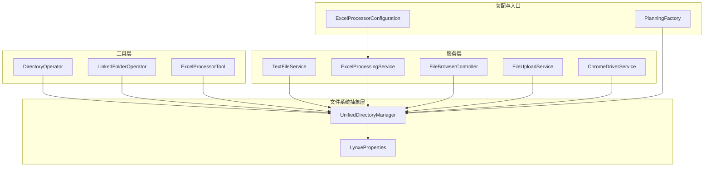
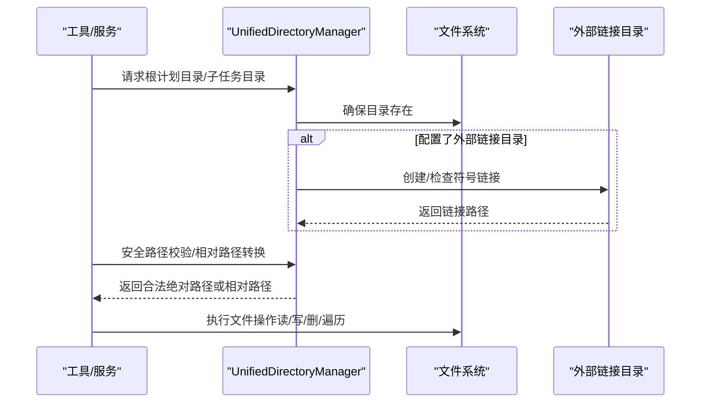
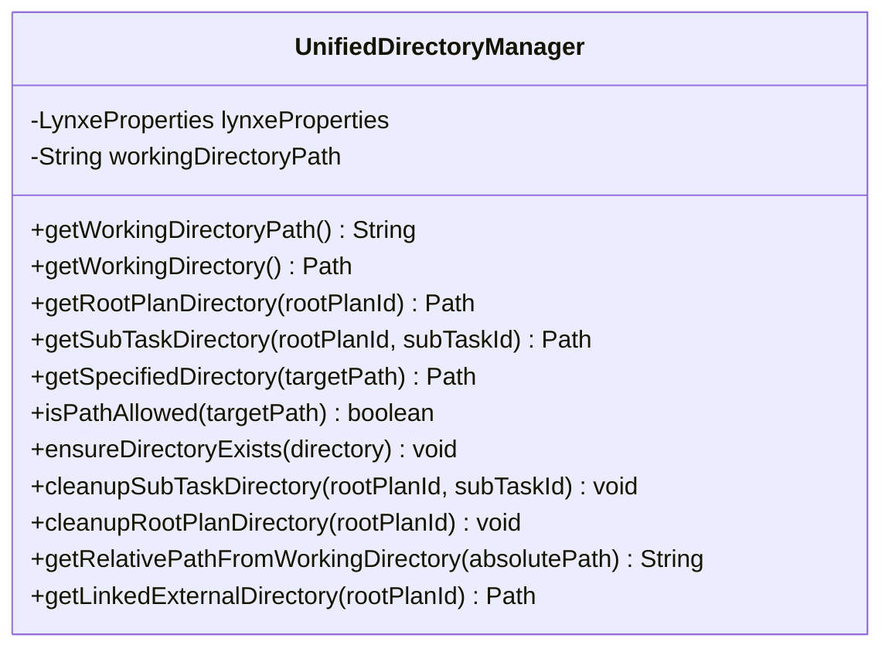
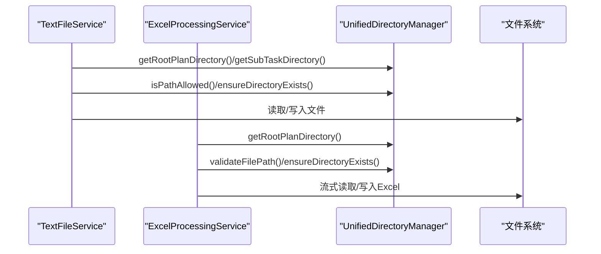
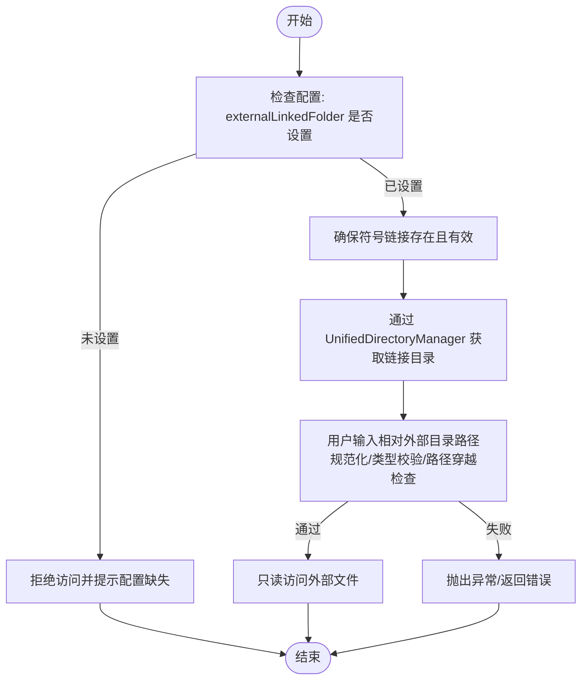
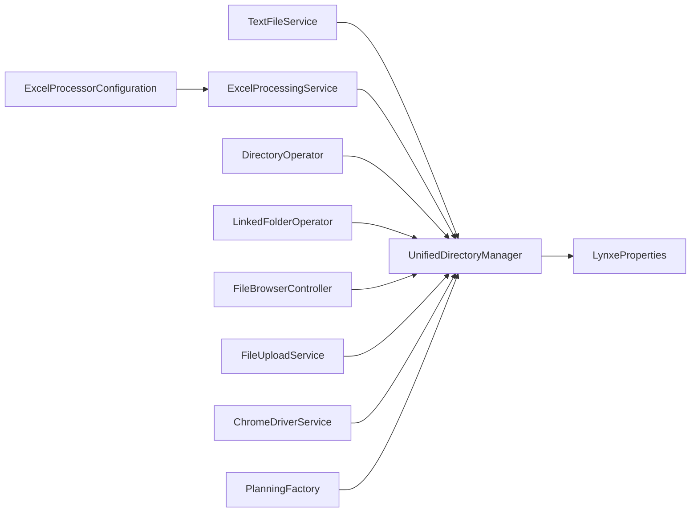

# 统一文件系统访问

<cite>
**本文引用的文件列表**
- [UnifiedDirectoryManager.java](file://src/main/java/com/alibaba/cloud/ai/lynxe/tool/filesystem/UnifiedDirectoryManager.java)
- [LynxeProperties.java](file://src/main/java/com/alibaba/cloud/ai/lynxe/config/LynxeProperties.java)
- [TextFileService.java](file://src/main/java/com/alibaba/cloud/ai/lynxe/tool/textOperator/TextFileService.java)
- [DirectoryOperator.java](file://src/main/java/com/alibaba/cloud/ai/lynxe/tool/dirOperator/DirectoryOperator.java)
- [LinkedFolderOperator.java](file://src/main/java/com/alibaba/cloud/ai/lynxe/tool/textOperator/LinkedFolderOperator.java)
- [ExcelProcessingService.java](file://src/main/java/com/alibaba/cloud/ai/lynxe/tool/excelProcessor/ExcelProcessingService.java)
- [ExcelProcessorTool.java](file://src/main/java/com/alibaba/cloud/ai/lynxe/tool/excelProcessor/ExcelProcessorTool.java)
- [FileBrowserController.java](file://src/main/java/com/alibaba/cloud/ai/lynxe/runtime/controller/FileBrowserController.java)
- [FileUploadService.java](file://src/main/java/com/alibaba/cloud/ai/lynxe/runtime/service/FileUploadService.java)
- [ChromeDriverService.java](file://src/main/java/com/alibaba/cloud/ai/lynxe/tool/browser/ChromeDriverService.java)
- [PlanningFactory.java](file://src/main/java/com/alibaba/cloud/ai/lynxe/planning/PlanningFactory.java)
- [ExcelProcessorConfiguration.java](file://src/main/java/com/alibaba/cloud/ai/lynxe/config/ExcelProcessorConfiguration.java)
</cite>

## 目录
1. [引言](#引言)
2. [项目结构](#项目结构)
3. [核心组件](#核心组件)
4. [架构总览](#架构总览)
5. [详细组件分析](#详细组件分析)
6. [依赖关系分析](#依赖关系分析)
7. [性能考量](#性能考量)
8. [故障排查指南](#故障排查指南)
9. [结论](#结论)
10. [附录：扩展与最佳实践](#附录扩展与最佳实践)

## 引言
本技术文档围绕“统一文件系统访问接口”展开，重点阐述 UnifiedDirectoryManager 的设计目标与实现机制，说明其如何抽象本地文件系统与外部链接目录，为 AI 代理执行过程提供一致的目录浏览、文件创建、删除与权限控制能力。同时，文档解释与具体文件操作服务（如 TextFileService、ExcelProcessingService）的集成模式，并给出跨存储介质的文件迁移、目录遍历与空间统计的使用路径与注意事项，最后提供扩展自定义文件系统实现与安全访问控制的最佳实践。

## 项目结构
UnifiedDirectoryManager 位于工具层的 filesystem 包中，是文件系统访问的中枢，被多个工具与服务依赖：
- 工具类：DirectoryOperator、LinkedFolderOperator、ExcelProcessorTool 等
- 服务类：TextFileService、ExcelProcessingService、FileUploadService、FileBrowserController 等
- 配置：LynxeProperties 提供外部链接目录配置项
- 启动装配：ExcelProcessorConfiguration 将 ExcelProcessingService 注入 UnifiedDirectoryManager

图表来源
- [UnifiedDirectoryManager.java](file://src/main/java/com/alibaba/cloud/ai/lynxe/tool/filesystem/UnifiedDirectoryManager.java#L33-L438)
- [LynxeProperties.java](file://src/main/java/com/alibaba/cloud/ai/lynxe/config/LynxeProperties.java#L340-L358)
- [DirectoryOperator.java](file://src/main/java/com/alibaba/cloud/ai/lynxe/tool/dirOperator/DirectoryOperator.java#L380-L428)
- [LinkedFolderOperator.java](file://src/main/java/com/alibaba/cloud/ai/lynxe/tool/textOperator/LinkedFolderOperator.java#L280-L334)
- [ExcelProcessorTool.java](file://src/main/java/com/alibaba/cloud/ai/lynxe/tool/excelProcessor/ExcelProcessorTool.java#L50-L1023)
- [TextFileService.java](file://src/main/java/com/alibaba/cloud/ai/lynxe/tool/textOperator/TextFileService.java#L200-L355)
- [ExcelProcessingService.java](file://src/main/java/com/alibaba/cloud/ai/lynxe/tool/excelProcessor/ExcelProcessingService.java#L80-L136)
- [FileBrowserController.java](file://src/main/java/com/alibaba/cloud/ai/lynxe/runtime/controller/FileBrowserController.java#L49-L50)
- [FileUploadService.java](file://src/main/java/com/alibaba/cloud/ai/lynxe/runtime/service/FileUploadService.java#L44-L45)
- [ChromeDriverService.java](file://src/main/java/com/alibaba/cloud/ai/lynxe/tool/browser/ChromeDriverService.java#L83-L102)
- [PlanningFactory.java](file://src/main/java/com/alibaba/cloud/ai/lynxe/planning/PlanningFactory.java#L192-L207)
- [ExcelProcessorConfiguration.java](file://src/main/java/com/alibaba/cloud/ai/lynxe/config/ExcelProcessorConfiguration.java#L38-L42)

章节来源
- [UnifiedDirectoryManager.java](file://src/main/java/com/alibaba/cloud/ai/lynxe/tool/filesystem/UnifiedDirectoryManager.java#L33-L438)
- [LynxeProperties.java](file://src/main/java/com/alibaba/cloud/ai/lynxe/config/LynxeProperties.java#L340-L358)

## 核心组件
- UnifiedDirectoryManager：集中式工作目录与计划目录管理，提供安全路径校验、符号链接外部目录、目录清理等能力。
- LynxeProperties：提供 externalLinkedFolder 配置项，用于启用外部只读访问。
- TextFileService：基于 UnifiedDirectoryManager 实现文件路径验证、创建路径解析、相对路径转换与清理。
- ExcelProcessingService：基于 UnifiedDirectoryManager 实现 Excel 文件路径校验、结构读取、数据读写与大文件流式处理。
- DirectoryOperator/LinkedFolderOperator：目录浏览与外部只读访问工具，前者面向计划内目录，后者通过符号链接访问外部目录。
- FileBrowserController/FileUploadService：运行时文件浏览与上传服务，依赖 UnifiedDirectoryManager 进行路径校验与目录准备。
- ChromeDriverService：使用 UnifiedDirectoryManager 获取共享目录，确保 Playwright/浏览器资源隔离。
- PlanningFactory/ExcelProcessorConfiguration：装配入口，将 UnifiedDirectoryManager 注入各服务与工具。

章节来源
- [UnifiedDirectoryManager.java](file://src/main/java/com/alibaba/cloud/ai/lynxe/tool/filesystem/UnifiedDirectoryManager.java#L94-L171)
- [TextFileService.java](file://src/main/java/com/alibaba/cloud/ai/lynxe/tool/textOperator/TextFileService.java#L200-L355)
- [ExcelProcessingService.java](file://src/main/java/com/alibaba/cloud/ai/lynxe/tool/excelProcessor/ExcelProcessingService.java#L115-L136)
- [DirectoryOperator.java](file://src/main/java/com/alibaba/cloud/ai/lynxe/tool/dirOperator/DirectoryOperator.java#L380-L428)
- [LinkedFolderOperator.java](file://src/main/java/com/alibaba/cloud/ai/lynxe/tool/textOperator/LinkedFolderOperator.java#L280-L334)
- [FileBrowserController.java](file://src/main/java/com/alibaba/cloud/ai/lynxe/runtime/controller/FileBrowserController.java#L49-L50)
- [FileUploadService.java](file://src/main/java/com/alibaba/cloud/ai/lynxe/runtime/service/FileUploadService.java#L44-L45)
- [ChromeDriverService.java](file://src/main/java/com/alibaba/cloud/ai/lynxe/tool/browser/ChromeDriverService.java#L83-L102)
- [PlanningFactory.java](file://src/main/java/com/alibaba/cloud/ai/lynxe/planning/PlanningFactory.java#L192-L207)
- [ExcelProcessorConfiguration.java](file://src/main/java/com/alibaba/cloud/ai/lynxe/config/ExcelProcessorConfiguration.java#L38-L42)

## 架构总览
UnifiedDirectoryManager 以“工作目录 + 计划目录 + 子任务目录”的层次化结构为核心，结合安全路径校验与可选的外部链接目录，形成统一的文件系统访问边界。所有工具与服务通过依赖注入获得该管理器，从而保证：
- 路径规范化与安全校验
- 外部访问通过符号链接受控开放
- 目录生命周期管理（创建、清理）
- 与运行时组件（上传、浏览、浏览器）协同

图表来源
- [UnifiedDirectoryManager.java](file://src/main/java/com/alibaba/cloud/ai/lynxe/tool/filesystem/UnifiedDirectoryManager.java#L112-L171)
- [UnifiedDirectoryManager.java](file://src/main/java/com/alibaba/cloud/ai/lynxe/tool/filesystem/UnifiedDirectoryManager.java#L319-L435)
- [TextFileService.java](file://src/main/java/com/alibaba/cloud/ai/lynxe/tool/textOperator/TextFileService.java#L200-L355)
- [ExcelProcessingService.java](file://src/main/java/com/alibaba/cloud/ai/lynxe/tool/excelProcessor/ExcelProcessingService.java#L115-L136)

## 详细组件分析

### UnifiedDirectoryManager 设计与实现
- 设计目标
  - 抽象本地文件系统访问，屏蔽平台差异
  - 提供统一的工作目录、计划目录与子任务目录结构
  - 通过安全校验限制外部访问，保障沙箱边界
  - 支持可选的外部链接目录（符号链接），仅限只读访问
  - 提供目录清理与相对路径转换能力
- 关键能力
  - 工作目录与根计划目录：以 extensions 为基，内部使用 inner_storage 作为计划根
  - 子任务目录：按 planId 与 subTaskId 层级组织
  - 安全校验：路径规范化 + 前缀匹配，拒绝越权访问
  - 外部链接：在根计划目录下创建 linked_external 符号链接，指向 LynxeProperties 配置的外部目录
  - 目录清理：递归删除指定目录，支持子任务与根计划级别
  - 相对路径：从工作目录出发计算相对路径，便于日志与 UI 显示
- 错误处理
  - 参数校验（空值、空字符串）
  - IO 异常捕获与日志记录
  - 平台不支持符号链接时的降级提示

图表来源
- [UnifiedDirectoryManager.java](file://src/main/java/com/alibaba/cloud/ai/lynxe/tool/filesystem/UnifiedDirectoryManager.java#L94-L171)
- [UnifiedDirectoryManager.java](file://src/main/java/com/alibaba/cloud/ai/lynxe/tool/filesystem/UnifiedDirectoryManager.java#L178-L214)
- [UnifiedDirectoryManager.java](file://src/main/java/com/alibaba/cloud/ai/lynxe/tool/filesystem/UnifiedDirectoryManager.java#L273-L311)
- [UnifiedDirectoryManager.java](file://src/main/java/com/alibaba/cloud/ai/lynxe/tool/filesystem/UnifiedDirectoryManager.java#L319-L435)

章节来源
- [UnifiedDirectoryManager.java](file://src/main/java/com/alibaba/cloud/ai/lynxe/tool/filesystem/UnifiedDirectoryManager.java#L94-L171)
- [UnifiedDirectoryManager.java](file://src/main/java/com/alibaba/cloud/ai/lynxe/tool/filesystem/UnifiedDirectoryManager.java#L178-L214)
- [UnifiedDirectoryManager.java](file://src/main/java/com/alibaba/cloud/ai/lynxe/tool/filesystem/UnifiedDirectoryManager.java#L273-L311)
- [UnifiedDirectoryManager.java](file://src/main/java/com/alibaba/cloud/ai/lynxe/tool/filesystem/UnifiedDirectoryManager.java#L319-L435)

### 与具体文件操作服务的集成模式
- TextFileService
  - 使用 UnifiedDirectoryManager 解析根目录与子任务目录，进行路径合法性校验
  - 支持新文件创建路径解析（子计划优先）
  - 提供相对路径转换与清理方法
- ExcelProcessingService
  - 通过 UnifiedDirectoryManager 获取计划根目录，进行文件路径校验与父目录创建
  - 针对大文件采用流式读取策略
- FileBrowserController/FileUploadService
  - 依赖 UnifiedDirectoryManager 进行路径校验与工作目录准备
- ChromeDriverService
  - 使用 UnifiedDirectoryManager 获取共享目录（如 playwright），确保资源隔离

图表来源
- [TextFileService.java](file://src/main/java/com/alibaba/cloud/ai/lynxe/tool/textOperator/TextFileService.java#L200-L355)
- [ExcelProcessingService.java](file://src/main/java/com/alibaba/cloud/ai/lynxe/tool/excelProcessor/ExcelProcessingService.java#L115-L136)
- [UnifiedDirectoryManager.java](file://src/main/java/com/alibaba/cloud/ai/lynxe/tool/filesystem/UnifiedDirectoryManager.java#L112-L171)

章节来源
- [TextFileService.java](file://src/main/java/com/alibaba/cloud/ai/lynxe/tool/textOperator/TextFileService.java#L200-L355)
- [ExcelProcessingService.java](file://src/main/java/com/alibaba/cloud/ai/lynxe/tool/excelProcessor/ExcelProcessingService.java#L115-L136)
- [FileBrowserController.java](file://src/main/java/com/alibaba/cloud/ai/lynxe/runtime/controller/FileBrowserController.java#L49-L50)
- [FileUploadService.java](file://src/main/java/com/alibaba/cloud/ai/lynxe/runtime/service/FileUploadService.java#L44-L45)
- [ChromeDriverService.java](file://src/main/java/com/alibaba/cloud/ai/lynxe/tool/browser/ChromeDriverService.java#L83-L102)

### 外部链接目录与只读访问
- 配置项：lynxe.general.externalLinkedFolder
- 行为：在根计划目录下创建 linked_external 符号链接，指向配置的外部目录；仅允许只读访问
- 工具：LinkedFolderOperator 通过 UnifiedDirectoryManager 的 getLinkedExternalDirectory 获取链接目录，进行路径规范化与类型校验，防止路径穿越

图表来源
- [LynxeProperties.java](file://src/main/java/com/alibaba/cloud/ai/lynxe/config/LynxeProperties.java#L340-L358)
- [UnifiedDirectoryManager.java](file://src/main/java/com/alibaba/cloud/ai/lynxe/tool/filesystem/UnifiedDirectoryManager.java#L59-L83)
- [LinkedFolderOperator.java](file://src/main/java/com/alibaba/cloud/ai/lynxe/tool/textOperator/LinkedFolderOperator.java#L280-L334)

章节来源
- [LynxeProperties.java](file://src/main/java/com/alibaba/cloud/ai/lynxe/config/LynxeProperties.java#L340-L358)
- [LinkedFolderOperator.java](file://src/main/java/com/alibaba/cloud/ai/lynxe/tool/textOperator/LinkedFolderOperator.java#L280-L334)

### 目录遍历与空间统计
- 目录遍历：DirectoryOperator 通过 UnifiedDirectoryManager 获取根计划目录，进行相对路径解析与文件信息收集
- 空间统计：可基于 Java NIO 遍历目录树，累加文件大小与数量；建议在工具层封装统计方法，避免直接暴露底层细节

章节来源
- [DirectoryOperator.java](file://src/main/java/com/alibaba/cloud/ai/lynxe/tool/dirOperator/DirectoryOperator.java#L380-L428)

### 跨存储介质的文件迁移
- 迁移策略：通过 UnifiedDirectoryManager 在同一计划目录内进行路径解析与合法性校验，再由具体服务（如 ExcelProcessingService）执行读写
- 注意事项：跨介质迁移需考虑文件类型、大小限制与流式处理策略；建议在工具层封装迁移流程，统一调用路径校验与状态更新

章节来源
- [TextFileService.java](file://src/main/java/com/alibaba/cloud/ai/lynxe/tool/textOperator/TextFileService.java#L200-L355)
- [ExcelProcessingService.java](file://src/main/java/com/alibaba/cloud/ai/lynxe/tool/excelProcessor/ExcelProcessingService.java#L115-L136)

## 依赖关系分析
- 组件耦合
  - UnifiedDirectoryManager 与 LynxeProperties 松耦合（通过配置项读取）
  - 工具与服务均依赖 UnifiedDirectoryManager，形成清晰的单向依赖
- 可能的循环依赖
  - 无直接循环依赖迹象；装配入口（PlanningFactory、ExcelProcessorConfiguration）负责注入
- 外部依赖
  - Java NIO 文件系统 API
  - Spring 组件注解（@Service、@Autowired）

图表来源
- [UnifiedDirectoryManager.java](file://src/main/java/com/alibaba/cloud/ai/lynxe/tool/filesystem/UnifiedDirectoryManager.java#L33-L438)
- [LynxeProperties.java](file://src/main/java/com/alibaba/cloud/ai/lynxe/config/LynxeProperties.java#L340-L358)
- [TextFileService.java](file://src/main/java/com/alibaba/cloud/ai/lynxe/tool/textOperator/TextFileService.java#L200-L355)
- [ExcelProcessingService.java](file://src/main/java/com/alibaba/cloud/ai/lynxe/tool/excelProcessor/ExcelProcessingService.java#L80-L136)
- [DirectoryOperator.java](file://src/main/java/com/alibaba/cloud/ai/lynxe/tool/dirOperator/DirectoryOperator.java#L380-L428)
- [LinkedFolderOperator.java](file://src/main/java/com/alibaba/cloud/ai/lynxe/tool/textOperator/LinkedFolderOperator.java#L280-L334)
- [FileBrowserController.java](file://src/main/java/com/alibaba/cloud/ai/lynxe/runtime/controller/FileBrowserController.java#L49-L50)
- [FileUploadService.java](file://src/main/java/com/alibaba/cloud/ai/lynxe/runtime/service/FileUploadService.java#L44-L45)
- [ChromeDriverService.java](file://src/main/java/com/alibaba/cloud/ai/lynxe/tool/browser/ChromeDriverService.java#L83-L102)
- [PlanningFactory.java](file://src/main/java/com/alibaba/cloud/ai/lynxe/planning/PlanningFactory.java#L192-L207)
- [ExcelProcessorConfiguration.java](file://src/main/java/com/alibaba/cloud/ai/lynxe/config/ExcelProcessorConfiguration.java#L38-L42)

## 性能考量
- 大文件处理：ExcelProcessingService 对大于阈值的文件采用流式读取，降低内存占用
- 目录遍历：建议分页/分批处理，避免一次性加载大量文件元数据
- 清理策略：定期清理临时目录，避免磁盘膨胀
- 日志与监控：统一记录路径校验与清理结果，便于问题定位

章节来源
- [ExcelProcessingService.java](file://src/main/java/com/alibaba/cloud/ai/lynxe/tool/excelProcessor/ExcelProcessingService.java#L276-L302)

## 故障排查指南
- 路径越权访问
  - 现象：抛出安全异常或被拒绝
  - 排查：确认传入路径是否相对工作目录，是否经过 isPathAllowed 校验
- 外部链接目录不可用
  - 现象：无法获取链接目录或链接不存在
  - 排查：检查 LynxeProperties 配置项 externalLinkedFolder 是否正确；确认符号链接创建条件与平台支持情况
- 目录清理失败
  - 现象：删除失败或残留文件
  - 排查：查看日志输出，确认是否存在非符号链接冲突；必要时手动清理
- 文件过大
  - 现象：写入/读取超时或内存不足
  - 排查：采用流式处理或分批读取；调整阈值与批处理参数

章节来源
- [UnifiedDirectoryManager.java](file://src/main/java/com/alibaba/cloud/ai/lynxe/tool/filesystem/UnifiedDirectoryManager.java#L142-L171)
- [UnifiedDirectoryManager.java](file://src/main/java/com/alibaba/cloud/ai/lynxe/tool/filesystem/UnifiedDirectoryManager.java#L319-L435)
- [TextFileService.java](file://src/main/java/com/alibaba/cloud/ai/lynxe/tool/textOperator/TextFileService.java#L247-L301)
- [ExcelProcessingService.java](file://src/main/java/com/alibaba/cloud/ai/lynxe/tool/excelProcessor/ExcelProcessingService.java#L243-L274)

## 结论
UnifiedDirectoryManager 通过统一的工作目录、计划目录与安全校验，为 AI 代理执行过程提供了稳定、可控的文件系统访问边界。配合外部链接目录与工具层的目录浏览、文本与表格处理能力，实现了跨存储介质的一致性与安全性。建议在实际部署中：
- 明确外部链接目录用途与访问范围
- 严格遵循路径校验与清理流程
- 对大文件采用流式处理策略
- 在工具层封装常用操作（迁移、遍历、统计），提升可维护性

## 附录：扩展与最佳实践
- 扩展自定义文件系统实现
  - 通过实现统一接口（如 IExcelProcessingService）并注入 UnifiedDirectoryManager，即可复用路径校验与目录管理能力
  - 新增工具时，优先使用 UnifiedDirectoryManager 的 getRootPlanDirectory/getSubTaskDirectory 等方法，确保路径安全
- 安全访问控制策略
  - 默认禁止越权访问，外部访问必须通过符号链接受控开放
  - 对外部目录进行类型白名单与路径穿越检查
  - 限制文件大小与操作频率，防止滥用
- 最佳实践
  - 在工具初始化阶段完成目录准备与链接检查
  - 对关键操作记录日志与状态，便于审计与回溯
  - 对大文件与批量操作提供进度反馈与中断机制

章节来源
- [IExcelProcessingService.java](file://src/main/java/com/alibaba/cloud/ai/lynxe/tool/excelProcessor/IExcelProcessingService.java#L18-L47)
- [PlanningFactory.java](file://src/main/java/com/alibaba/cloud/ai/lynxe/planning/PlanningFactory.java#L192-L207)
- [ExcelProcessorConfiguration.java](file://src/main/java/com/alibaba/cloud/ai/lynxe/config/ExcelProcessorConfiguration.java#L38-L42)