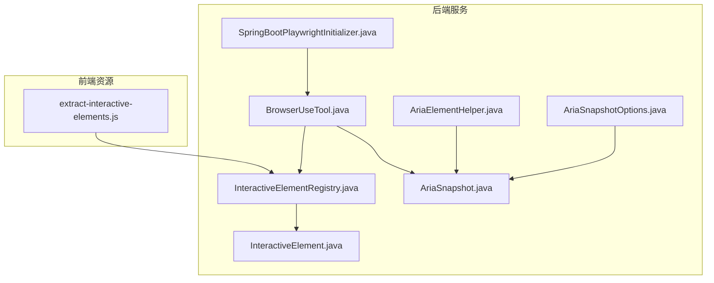
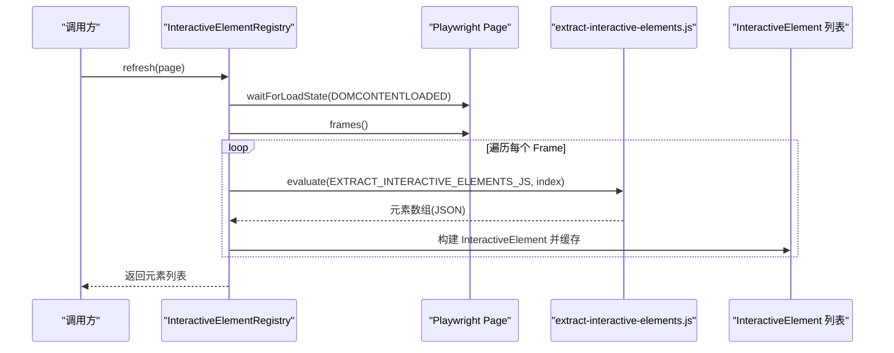
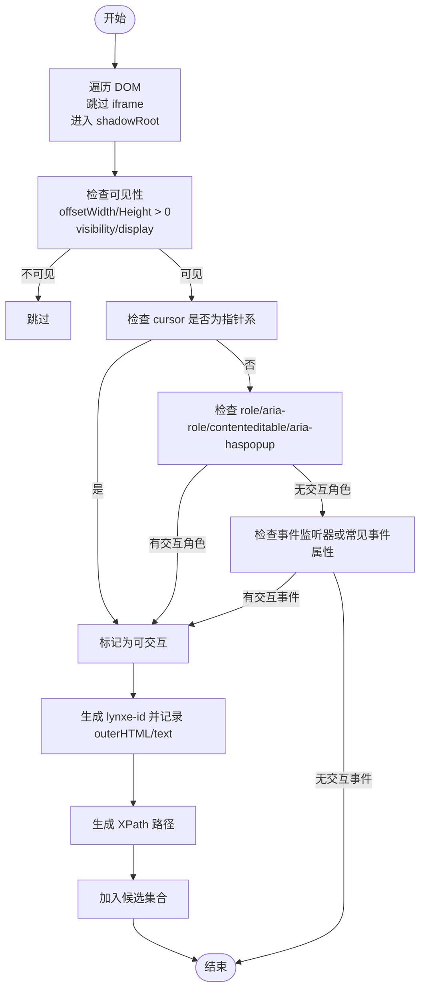
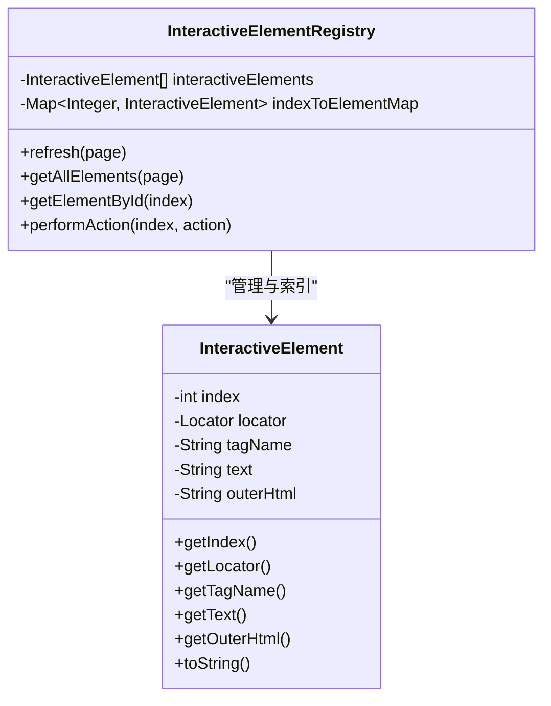
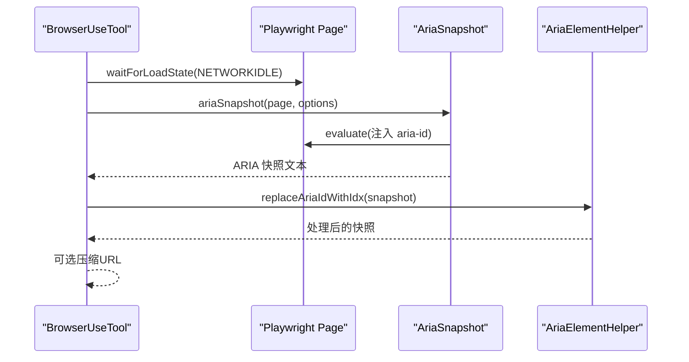
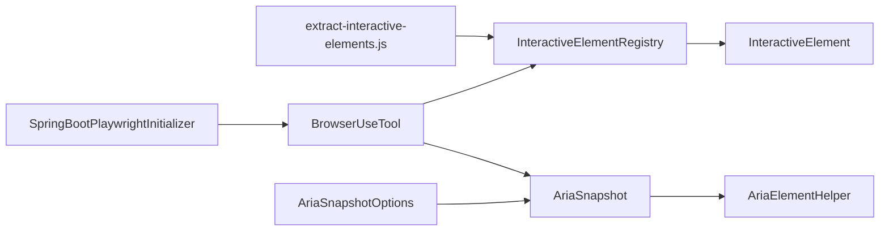

# 交互式元素发现

<cite>
**本文引用的文件**
- [extract-interactive-elements.js](file://src/main/resources/tool/extract-interactive-elements.js)
- [InteractiveElementRegistry.java](file://src/main/java/com/alibaba/cloud/ai/lynxe/tool/browser/InteractiveElementRegistry.java)
- [InteractiveElement.java](file://src/main/java/com/alibaba/cloud/ai/lynxe/tool/browser/InteractiveElement.java)
- [BrowserUseTool.java](file://src/main/java/com/alibaba/cloud/ai/lynxe/tool/browser/BrowserUseTool.java)
- [AriaSnapshot.java](file://src/main/java/com/alibaba/cloud/ai/lynxe/tool/browser/AriaSnapshot.java)
- [AriaElementHelper.java](file://src/main/java/com/alibaba/cloud/ai/lynxe/tool/browser/AriaElementHelper.java)
- [AriaSnapshotOptions.java](file://src/main/java/com/alibaba/cloud/ai/lynxe/tool/browser/AriaSnapshotOptions.java)
- [SpringBootPlaywrightInitializer.java](file://src/main/java/com/alibaba/cloud/ai/lynxe/tool/browser/SpringBootPlaywrightInitializer.java)
</cite>

## 目录
1. [简介](#简介)
2. [项目结构](#项目结构)
3. [核心组件](#核心组件)
4. [架构总览](#架构总览)
5. [详细组件分析](#详细组件分析)
6. [依赖关系分析](#依赖关系分析)
7. [性能考量](#性能考量)
8. [故障排查指南](#故障排查指南)
9. [结论](#结论)

## 简介
本文件深入解析交互式元素发现机制的实现原理，重点围绕 extract-interactive-elements.js 脚本在浏览器环境中的执行流程，说明其如何通过 DOM 遍历识别 a、button、input、select、textarea 等表单元素，检测具有 onclick、onmousedown 等事件监听器的元素，以及识别 CSS 中 cursor:pointer 样式的可点击区域；同时阐述脚本如何利用 aria-* 属性（如 aria-label、aria-role）增强元素语义化识别能力；解释元素唯一标识生成策略（XPath、CSS 选择器的备选方案）；最后提供在 Playwright 环境中注入与执行该脚本以获取元素列表的方法与调试建议。

## 项目结构
与交互式元素发现直接相关的文件主要分布在以下位置：
- 前端资源脚本：src/main/resources/tool/extract-interactive-elements.js
- 后端集成与执行：src/main/java/com/alibaba/cloud/ai/lynxe/tool/browser/InteractiveElementRegistry.java、InteractiveElement.java、BrowserUseTool.java
- ARIA 快照与辅助处理：AriaSnapshot.java、AriaElementHelper.java、AriaSnapshotOptions.java
- Playwright 初始化：SpringBootPlaywrightInitializer.java

图表来源
- [extract-interactive-elements.js](file://src/main/resources/tool/extract-interactive-elements.js#L1-L386)
- [InteractiveElementRegistry.java](file://src/main/java/com/alibaba/cloud/ai/lynxe/tool/browser/InteractiveElementRegistry.java#L42-L408)
- [InteractiveElement.java](file://src/main/java/com/alibaba/cloud/ai/lynxe/tool/browser/InteractiveElement.java#L24-L124)
- [BrowserUseTool.java](file://src/main/java/com/alibaba/cloud/ai/lynxe/tool/browser/BrowserUseTool.java#L401-L537)
- [AriaSnapshot.java](file://src/main/java/com/alibaba/cloud/ai/lynxe/tool/browser/AriaSnapshot.java#L46-L116)
- [AriaElementHelper.java](file://src/main/java/com/alibaba/cloud/ai/lynxe/tool/browser/AriaElementHelper.java#L28-L118)
- [AriaSnapshotOptions.java](file://src/main/java/com/alibaba/cloud/ai/lynxe/tool/browser/AriaSnapshotOptions.java#L18-L74)
- [SpringBootPlaywrightInitializer.java](file://src/main/java/com/alibaba/cloud/ai/lynxe/tool/browser/SpringBootPlaywrightInitializer.java#L37-L198)

章节来源
- [extract-interactive-elements.js](file://src/main/resources/tool/extract-interactive-elements.js#L1-L386)
- [InteractiveElementRegistry.java](file://src/main/java/com/alibaba/cloud/ai/lynxe/tool/browser/InteractiveElementRegistry.java#L42-L408)
- [InteractiveElement.java](file://src/main/java/com/alibaba/cloud/ai/lynxe/tool/browser/InteractiveElement.java#L24-L124)
- [BrowserUseTool.java](file://src/main/java/com/alibaba/cloud/ai/lynxe/tool/browser/BrowserUseTool.java#L401-L537)
- [AriaSnapshot.java](file://src/main/java/com/alibaba/cloud/ai/lynxe/tool/browser/AriaSnapshot.java#L46-L116)
- [AriaElementHelper.java](file://src/main/java/com/alibaba/cloud/ai/lynxe/tool/browser/AriaElementHelper.java#L28-L118)
- [AriaSnapshotOptions.java](file://src/main/java/com/alibaba/cloud/ai/lynxe/tool/browser/AriaSnapshotOptions.java#L18-L74)
- [SpringBootPlaywrightInitializer.java](file://src/main/java/com/alibaba/cloud/ai/lynxe/tool/browser/SpringBootPlaywrightInitializer.java#L37-L198)

## 核心组件
- extract-interactive-elements.js：在浏览器页面上下文中运行，负责遍历 DOM、识别可见且可交互的元素，并生成包含标签名、文本、外层 HTML、全局索引、XPath 的结果列表。脚本还支持基于事件监听器、光标样式、ARIA 角色与属性的增强识别。
- InteractiveElementRegistry：在后端使用 Playwright 注入并执行上述脚本，收集元素并缓存为可操作对象；提供按全局索引查询、批量获取、动作执行等能力。
- InteractiveElement：封装单个交互元素，提供 Playwright 定位器（优先使用 lynxe-id，否则回退到 XPath），以及元素信息的字符串表示。
- BrowserUseTool：对外暴露浏览器工具能力，其中包含生成 ARIA 快照的逻辑，用于展示页面可交互元素的语义化描述。
- AriaSnapshot/AriaElementHelper/AriaSnapshotOptions：提供 ARIA 快照生成、aria-id 替换与 URL 压缩等辅助功能，便于在自然语言中引用元素。
- SpringBootPlaywrightInitializer：确保在 Spring Boot 环境下正确初始化 Playwright，避免类加载与浏览器下载路径问题。

章节来源
- [extract-interactive-elements.js](file://src/main/resources/tool/extract-interactive-elements.js#L1-L386)
- [InteractiveElementRegistry.java](file://src/main/java/com/alibaba/cloud/ai/lynxe/tool/browser/InteractiveElementRegistry.java#L42-L408)
- [InteractiveElement.java](file://src/main/java/com/alibaba/cloud/ai/lynxe/tool/browser/InteractiveElement.java#L24-L124)
- [BrowserUseTool.java](file://src/main/java/com/alibaba/cloud/ai/lynxe/tool/browser/BrowserUseTool.java#L401-L537)
- [AriaSnapshot.java](file://src/main/java/com/alibaba/cloud/ai/lynxe/tool/browser/AriaSnapshot.java#L46-L116)
- [AriaElementHelper.java](file://src/main/java/com/alibaba/cloud/ai/lynxe/tool/browser/AriaElementHelper.java#L28-L118)
- [AriaSnapshotOptions.java](file://src/main/java/com/alibaba/cloud/ai/lynxe/tool/browser/AriaSnapshotOptions.java#L18-L74)
- [SpringBootPlaywrightInitializer.java](file://src/main/java/com/alibaba/cloud/ai/lynxe/tool/browser/SpringBootPlaywrightInitializer.java#L37-L198)

## 架构总览
交互式元素发现的整体流程如下：
- 在 Playwright 页面中，后端通过注入脚本执行 extract-interactive-elements.js，完成 DOM 遍历与元素筛选；
- 将结果映射为 InteractiveElement 列表，建立全局索引与定位器；
- 提供统一的动作接口，按索引执行点击、输入等操作；
- 同时提供 ARIA 快照能力，用于以自然语言描述页面可交互元素。

图表来源
- [InteractiveElementRegistry.java](file://src/main/java/com/alibaba/cloud/ai/lynxe/tool/browser/InteractiveElementRegistry.java#L424-L477)
- [extract-interactive-elements.js](file://src/main/resources/tool/extract-interactive-elements.js#L42-L106)

## 详细组件分析

### extract-interactive-elements.js 执行机制与算法
- DOM 遍历与子元素过滤
  - 递归遍历节点树，跳过 iframe；若遇到 shadowRoot，则递归进入 shadow DOM 子树。
  - 对每个节点调用 isInteractiveElement 判定是否可交互；仅当元素可见且可交互时才纳入候选集合。
  - 在 parseElement 阶段，对子元素可交互的父元素进行“跳过”处理，避免重复输出。
- 可交互判定规则
  - 可见性：基于 getComputedStyle 检查宽高与 display/visibility。
  - 光标样式：若 cursor 属于“指针系”（如 pointer、grab、zoom-in 等），则视为可交互。
  - 表单元素：对 a/button/input/select/textarea 等标签，结合禁用状态（disabled、readonly、inert）与非交互光标（如 not-allowed）综合判断。
  - ARIA 角色与属性：检查 role、aria-role，以及 contenteditable、aria-haspopup 等增强属性。
  - 事件监听器：优先使用 window.getEventListeners 或 getEventListenersForNode 获取监听器；在 page.evaluate 上下文不可用时，回退检查常见事件属性（如 onclick、onmousedown 等）。
- 唯一标识与 XPath 生成
  - 为每个可交互元素设置 lynxe-id（时间戳+自增索引），并记录 outerHTML 与 text。
  - 使用 getXPathTree 生成从根到当前元素的 XPath 路径，缓存计算结果；在遇到 shadowRoot 或 iframe 边界时停止。
- 结果输出
  - 返回包含 tagName、text、outerHtml、index、xpath、lynxe-id 的对象数组，供后端构建定位器。

图表来源
- [extract-interactive-elements.js](file://src/main/resources/tool/extract-interactive-elements.js#L76-L106)
- [extract-interactive-elements.js](file://src/main/resources/tool/extract-interactive-elements.js#L171-L202)
- [extract-interactive-elements.js](file://src/main/resources/tool/extract-interactive-elements.js#L213-L244)
- [extract-interactive-elements.js](file://src/main/resources/tool/extract-interactive-elements.js#L275-L321)
- [extract-interactive-elements.js](file://src/main/resources/tool/extract-interactive-elements.js#L331-L360)
- [extract-interactive-elements.js](file://src/main/resources/tool/extract-interactive-elements.js#L370-L407)

章节来源
- [extract-interactive-elements.js](file://src/main/resources/tool/extract-interactive-elements.js#L76-L106)
- [extract-interactive-elements.js](file://src/main/resources/tool/extract-interactive-elements.js#L171-L202)
- [extract-interactive-elements.js](file://src/main/resources/tool/extract-interactive-elements.js#L213-L244)
- [extract-interactive-elements.js](file://src/main/resources/tool/extract-interactive-elements.js#L275-L321)
- [extract-interactive-elements.js](file://src/main/resources/tool/extract-interactive-elements.js#L331-L360)
- [extract-interactive-elements.js](file://src/main/resources/tool/extract-interactive-elements.js#L370-L407)

### 后端注入与执行：InteractiveElementRegistry
- 注入与执行
  - 将脚本作为内联函数注入到每个 Frame，传入全局索引，返回元素数组。
  - 对每个元素创建 InteractiveElement 实例，优先使用 lynxe-id 构造定位器，否则回退到 XPath。
- 缓存与查询
  - 维护线程安全的元素列表与索引映射，支持按索引快速查找与批量获取。
- 动作执行
  - 提供 ElementAction 接口，允许按索引执行点击、输入等动作，内部捕获异常并返回结果。

图表来源
- [InteractiveElementRegistry.java](file://src/main/java/com/alibaba/cloud/ai/lynxe/tool/browser/InteractiveElementRegistry.java#L410-L555)
- [InteractiveElement.java](file://src/main/java/com/alibaba/cloud/ai/lynxe/tool/browser/InteractiveElement.java#L24-L124)

章节来源
- [InteractiveElementRegistry.java](file://src/main/java/com/alibaba/cloud/ai/lynxe/tool/browser/InteractiveElementRegistry.java#L424-L477)
- [InteractiveElementRegistry.java](file://src/main/java/com/alibaba/cloud/ai/lynxe/tool/browser/InteractiveElementRegistry.java#L483-L555)
- [InteractiveElement.java](file://src/main/java/com/alibaba/cloud/ai/lynxe/tool/browser/InteractiveElement.java#L24-L124)

### ARIA 快照与语义化增强
- AriaSnapshot
  - 在生成快照前，向所有元素注入 aria-label='aria-id-N'，以便后续通过 idx 引用元素。
  - 使用 Playwright 的 locator.ariaSnapshot() 生成可读的 ARIA 结构文本。
- AriaElementHelper
  - 将快照中的 aria-id-N 替换为 [idx=N]，便于人类阅读与引用。
  - 可选地压缩快照中的 URL，提升可读性。
- BrowserUseTool
  - 在获取浏览器状态时，先等待页面稳定，再生成 ARIA 快照并放入状态返回。

图表来源
- [BrowserUseTool.java](file://src/main/java/com/alibaba/cloud/ai/lynxe/tool/browser/BrowserUseTool.java#L489-L537)
- [AriaSnapshot.java](file://src/main/java/com/alibaba/cloud/ai/lynxe/tool/browser/AriaSnapshot.java#L76-L108)
- [AriaElementHelper.java](file://src/main/java/com/alibaba/cloud/ai/lynxe/tool/browser/AriaElementHelper.java#L28-L118)

章节来源
- [AriaSnapshot.java](file://src/main/java/com/alibaba/cloud/ai/lynxe/tool/browser/AriaSnapshot.java#L46-L116)
- [AriaElementHelper.java](file://src/main/java/com/alibaba/cloud/ai/lynxe/tool/browser/AriaElementHelper.java#L28-L118)
- [BrowserUseTool.java](file://src/main/java/com/alibaba/cloud/ai/lynxe/tool/browser/BrowserUseTool.java#L489-L537)

### Playwright 环境初始化与调试
- SpringBootPlaywrightInitializer
  - 设置 playwright.browsers.path 与 playwright.driver.tmpdir，确保浏览器二进制与驱动位于可读目录。
  - 在 Spring Boot 环境中切换上下文类加载器，避免加载失败。
- 调试建议
  - 在本地开发时，确认浏览器缓存目录存在并可读；必要时设置 PLAYWRIGHT_SKIP_BROWSER_DOWNLOAD 以避免重复下载。
  - 在 BrowserUseTool 中增加日志级别，观察页面加载状态与快照生成过程。

章节来源
- [SpringBootPlaywrightInitializer.java](file://src/main/java/com/alibaba/cloud/ai/lynxe/tool/browser/SpringBootPlaywrightInitializer.java#L84-L198)
- [BrowserUseTool.java](file://src/main/java/com/alibaba/cloud/ai/lynxe/tool/browser/BrowserUseTool.java#L401-L537)

## 依赖关系分析
- 脚本与后端
  - extract-interactive-elements.js 由 InteractiveElementRegistry 注入并执行，结果被映射为 InteractiveElement。
- 后端与 Playwright
  - InteractiveElementRegistry 依赖 Playwright 的 Page/Frame/evaluate 能力执行脚本。
  - BrowserUseTool 依赖 Playwright 的 ARIA 快照与定位器能力。
- ARIA 快照链路
  - AriaSnapshot 注入 aria-id，AriaElementHelper 替换为 [idx=N]，BrowserUseTool 收集并返回。

图表来源
- [extract-interactive-elements.js](file://src/main/resources/tool/extract-interactive-elements.js#L42-L106)
- [InteractiveElementRegistry.java](file://src/main/java/com/alibaba/cloud/ai/lynxe/tool/browser/InteractiveElementRegistry.java#L424-L477)
- [InteractiveElement.java](file://src/main/java/com/alibaba/cloud/ai/lynxe/tool/browser/InteractiveElement.java#L24-L124)
- [BrowserUseTool.java](file://src/main/java/com/alibaba/cloud/ai/lynxe/tool/browser/BrowserUseTool.java#L401-L537)
- [AriaSnapshot.java](file://src/main/java/com/alibaba/cloud/ai/lynxe/tool/browser/AriaSnapshot.java#L76-L108)
- [AriaElementHelper.java](file://src/main/java/com/alibaba/cloud/ai/lynxe/tool/browser/AriaElementHelper.java#L28-L118)
- [AriaSnapshotOptions.java](file://src/main/java/com/alibaba/cloud/ai/lynxe/tool/browser/AriaSnapshotOptions.java#L18-L74)
- [SpringBootPlaywrightInitializer.java](file://src/main/java/com/alibaba/cloud/ai/lynxe/tool/browser/SpringBootPlaywrightInitializer.java#L84-L198)

## 性能考量
- 计算样式缓存：脚本使用 WeakMap 缓存 getComputedStyle 结果，减少重复计算。
- XPath 缓存：对 getXPathTree 的结果进行缓存，避免重复生成路径。
- 可见性检查：先做可见性判断，再进行昂贵的事件监听器检查，降低不必要的开销。
- DOM 遍历优化：跳过 iframe，进入 shadowRoot 时仅遍历子节点，避免重复扫描。
- 后端并发：InteractiveElementRegistry 使用 CopyOnWriteArrayList 与 ConcurrentHashMap，保证多线程场景下的读写安全与低锁竞争。

章节来源
- [extract-interactive-elements.js](file://src/main/resources/tool/extract-interactive-elements.js#L158-L179)
- [extract-interactive-elements.js](file://src/main/resources/tool/extract-interactive-elements.js#L131-L161)
- [InteractiveElementRegistry.java](file://src/main/java/com/alibaba/cloud/ai/lynxe/tool/browser/InteractiveElementRegistry.java#L410-L419)

## 故障排查指南
- 页面未加载完成导致元素缺失
  - 现象：元素数量明显偏少或为空。
  - 处理：在调用 refresh 前等待 DOMCONTENTLOADED；在 BrowserUseTool 中等待 NETWORKIDLE。
- 事件监听器不可用
  - 现象：page.evaluate 上下文无法访问 window.getEventListeners。
  - 处理：脚本已回退到检查常见事件属性（如 onclick、onmousedown）。可在调试时手动验证元素上是否存在这些属性。
- ARIA 快照为空
  - 现象：快照为空或报错。
  - 处理：检查 selector 是否正确；确认注入 aria-id 成功；查看日志中快照生成错误信息。
- Playwright 初始化失败
  - 现象：启动时报找不到 Playwright 类或浏览器二进制。
  - 处理：确认类路径包含 Playwright；设置 playwright.browsers.path 与 playwright.driver.tmpdir；必要时设置 PLAYWRIGHT_SKIP_BROWSER_DOWNLOAD。

章节来源
- [InteractiveElementRegistry.java](file://src/main/java/com/alibaba/cloud/ai/lynxe/tool/browser/InteractiveElementRegistry.java#L443-L451)
- [BrowserUseTool.java](file://src/main/java/com/alibaba/cloud/ai/lynxe/tool/browser/BrowserUseTool.java#L418-L448)
- [AriaSnapshot.java](file://src/main/java/com/alibaba/cloud/ai/lynxe/tool/browser/AriaSnapshot.java#L76-L108)
- [SpringBootPlaywrightInitializer.java](file://src/main/java/com/alibaba/cloud/ai/lynxe/tool/browser/SpringBootPlaywrightInitializer.java#L104-L154)

## 结论
本机制通过浏览器端脚本与后端 Playwright 协同，实现了对页面可交互元素的高效识别与定位。脚本采用多维度判定（可见性、光标样式、ARIA 角色、事件监听器）确保覆盖面广；后端提供稳定的注入与缓存策略，支持按索引快速定位与执行动作；同时结合 ARIA 快照与 idx 替换，使交互元素在自然语言层面也具备良好可读性与可引用性。在 Playwright 环境中，配合 Spring Boot 初始化与日志调试，能够稳定地完成元素发现与后续自动化操作。