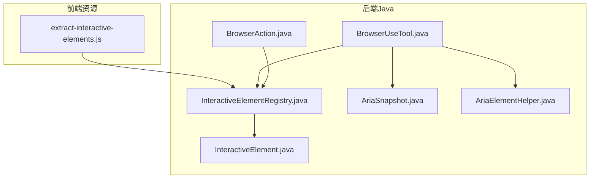
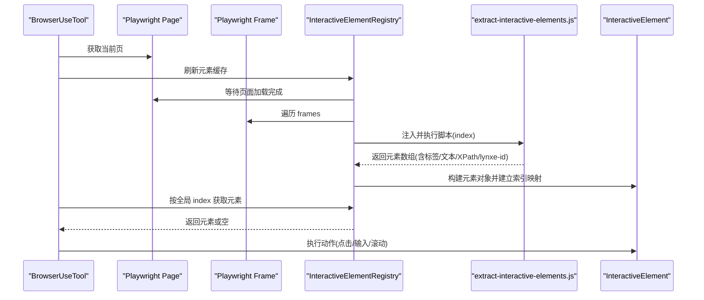
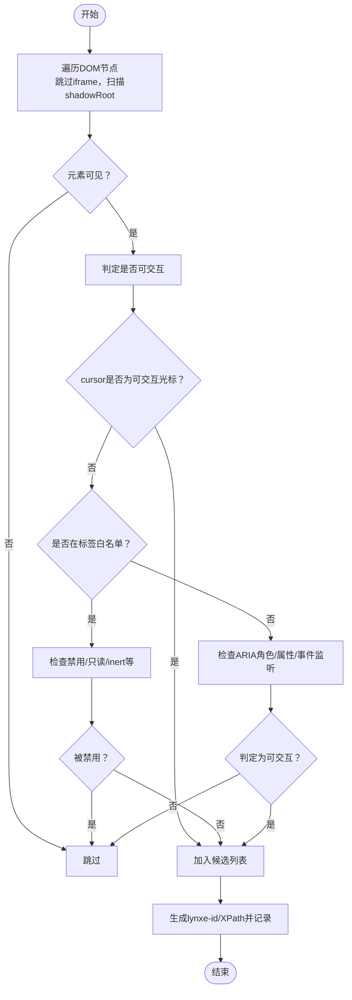
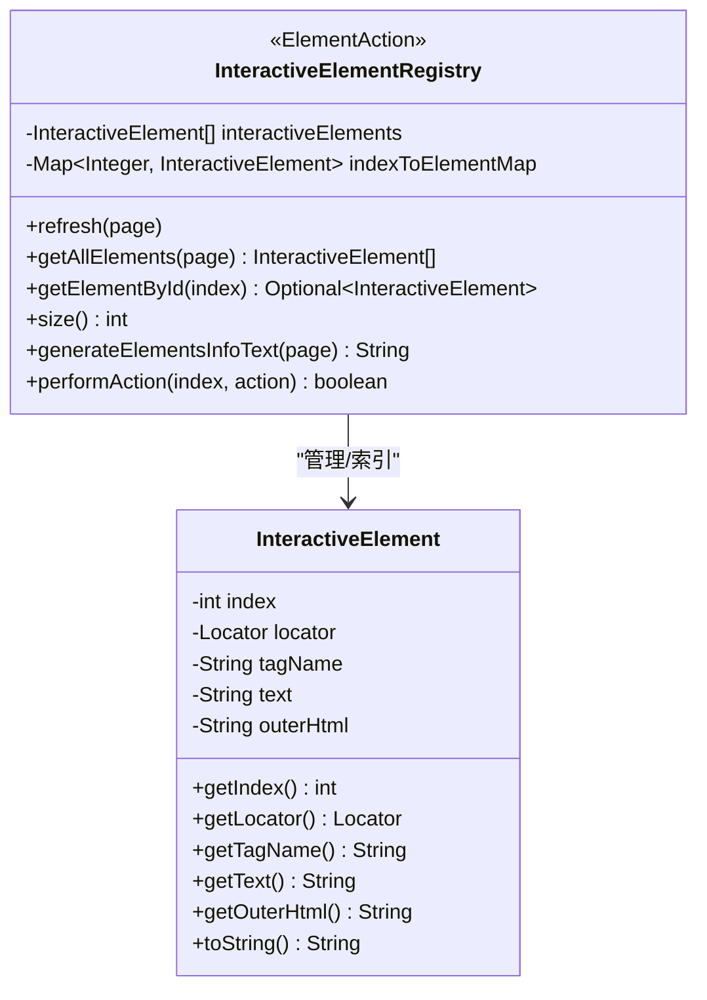
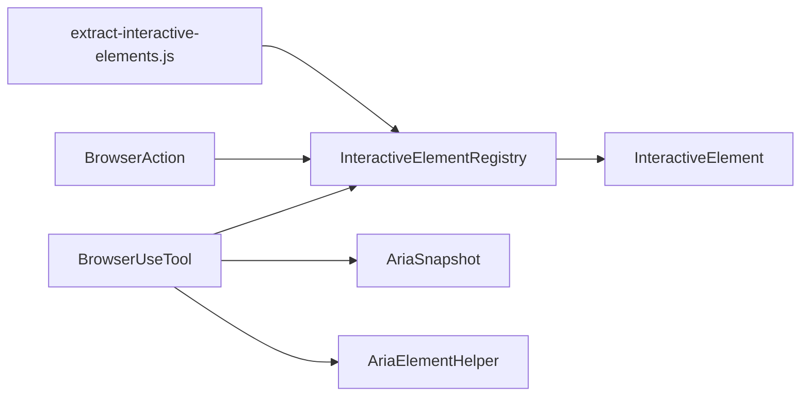

# 交互式元素识别

<cite>
**本文引用的文件列表**
- [extract-interactive-elements.js](file://src/main/resources/tool/extract-interactive-elements.js)
- [InteractiveElementRegistry.java](file://src/main/java/com/alibaba/cloud/ai/lynxe/tool/browser/InteractiveElementRegistry.java)
- [InteractiveElement.java](file://src/main/java/com/alibaba/cloud/ai/lynxe/tool/browser/InteractiveElement.java)
- [BrowserUseTool.java](file://src/main/java/com/alibaba/cloud/ai/lynxe/tool/browser/BrowserUseTool.java)
- [BrowserAction.java](file://src/main/java/com/alibaba/cloud/ai/lynxe/tool/browser/actions/BrowserAction.java)
- [AriaSnapshot.java](file://src/main/java/com/alibaba/cloud/ai/lynxe/tool/browser/AriaSnapshot.java)
- [AriaElementHelper.java](file://src/main/java/com/alibaba/cloud/ai/lynxe/tool/browser/AriaElementHelper.java)
</cite>

## 目录
1. [简介](#简介)
2. [项目结构](#项目结构)
3. [核心组件](#核心组件)
4. [架构总览](#架构总览)
5. [组件详解](#组件详解)
6. [依赖关系分析](#依赖关系分析)
7. [性能与可靠性](#性能与可靠性)
8. [调试与排障指南](#调试与排障指南)
9. [结论](#结论)

## 简介
本文件面向“交互式元素识别”机制，系统性阐述以下内容：
- JavaScript 脚本如何在页面中发现可交互元素（含 a、button、input 等标签识别、pointer 光标检测、aria-role 支持）。
- Java 侧 Registry 如何执行该脚本并维护元素索引映射，支持通过全局 index 快速定位元素。
- BrowserAction 基类如何利用 Registry 进行元素操作（点击、输入、滚动等）。
- 调试方法与常见问题（如动态内容加载导致的元素缺失）的解决方案。

## 项目结构
与交互式元素识别直接相关的文件分布如下：
- 资源脚本：src/main/resources/tool/extract-interactive-elements.js
- Java 注册表与元素模型：InteractiveElementRegistry.java、InteractiveElement.java
- 浏览器工具入口与动作基类：BrowserUseTool.java、BrowserAction.java
- ARIA 快照与辅助处理：AriaSnapshot.java、AriaElementHelper.java

图表来源
- [extract-interactive-elements.js](file://src/main/resources/tool/extract-interactive-elements.js#L1-L386)
- [InteractiveElementRegistry.java](file://src/main/java/com/alibaba/cloud/ai/lynxe/tool/browser/InteractiveElementRegistry.java#L1-L555)
- [InteractiveElement.java](file://src/main/java/com/alibaba/cloud/ai/lynxe/tool/browser/InteractiveElement.java#L1-L126)
- [BrowserUseTool.java](file://src/main/java/com/alibaba/cloud/ai/lynxe/tool/browser/BrowserUseTool.java#L1-L653)
- [BrowserAction.java](file://src/main/java/com/alibaba/cloud/ai/lynxe/tool/browser/actions/BrowserAction.java#L1-L260)
- [AriaSnapshot.java](file://src/main/java/com/alibaba/cloud/ai/lynxe/tool/browser/AriaSnapshot.java#L1-L117)
- [AriaElementHelper.java](file://src/main/java/com/alibaba/cloud/ai/lynxe/tool/browser/AriaElementHelper.java#L1-L207)

章节来源
- [extract-interactive-elements.js](file://src/main/resources/tool/extract-interactive-elements.js#L1-L386)
- [InteractiveElementRegistry.java](file://src/main/java/com/alibaba/cloud/ai/lynxe/tool/browser/InteractiveElementRegistry.java#L1-L555)
- [InteractiveElement.java](file://src/main/java/com/alibaba/cloud/ai/lynxe/tool/browser/InteractiveElement.java#L1-L126)
- [BrowserUseTool.java](file://src/main/java/com/alibaba/cloud/ai/lynxe/tool/browser/BrowserUseTool.java#L1-L653)
- [BrowserAction.java](file://src/main/java/com/alibaba/cloud/ai/lynxe/tool/browser/actions/BrowserAction.java#L1-L260)
- [AriaSnapshot.java](file://src/main/java/com/alibaba/cloud/ai/lynxe/tool/browser/AriaSnapshot.java#L1-L117)
- [AriaElementHelper.java](file://src/main/java/com/alibaba/cloud/ai/lynxe/tool/browser/AriaElementHelper.java#L1-L207)

## 核心组件
- JavaScript 识别脚本：负责遍历 DOM、过滤可见且可交互的元素，生成包含标签名、文本、外层 HTML、XPath、唯一标识等信息的数组，并为每个元素设置临时标识以便后续定位。
- Java 注册表（InteractiveElementRegistry）：在 Playwright 的 Page/Frame 上注入并执行上述脚本，解析结果，构建元素对象列表与索引映射；提供按全局 index 获取元素、批量刷新、执行动作等能力。
- 元素模型（InteractiveElement）：封装单个元素的全局 index、Playwright Locator、标签名、文本、HTML 结构等元数据。
- 浏览器工具入口（BrowserUseTool）：统一调度浏览器动作，提供状态快照（含 ARIA 交互元素），并在需要时触发元素识别刷新。
- 动作基类（BrowserAction）：提供超时控制、弹窗检测、人类行为模拟等通用能力，具体动作（如点击、输入）基于注册表提供的元素定位执行。
- ARIA 快照与辅助（AriaSnapshot、AriaElementHelper）：用于生成页面 ARIA 快照并替换内部标识，便于与交互式元素识别体系协同。

章节来源
- [InteractiveElementRegistry.java](file://src/main/java/com/alibaba/cloud/ai/lynxe/tool/browser/InteractiveElementRegistry.java#L408-L555)
- [InteractiveElement.java](file://src/main/java/com/alibaba/cloud/ai/lynxe/tool/browser/InteractiveElement.java#L1-L126)
- [BrowserUseTool.java](file://src/main/java/com/alibaba/cloud/ai/lynxe/tool/browser/BrowserUseTool.java#L401-L633)
- [BrowserAction.java](file://src/main/java/com/alibaba/cloud/ai/lynxe/tool/browser/actions/BrowserAction.java#L1-L260)
- [AriaSnapshot.java](file://src/main/java/com/alibaba/cloud/ai/lynxe/tool/browser/AriaSnapshot.java#L1-L117)
- [AriaElementHelper.java](file://src/main/java/com/alibaba/cloud/ai/lynxe/tool/browser/AriaElementHelper.java#L1-L207)

## 架构总览
下图展示从页面到元素识别再到动作执行的整体流程。

图表来源
- [BrowserUseTool.java](file://src/main/java/com/alibaba/cloud/ai/lynxe/tool/browser/BrowserUseTool.java#L401-L633)
- [InteractiveElementRegistry.java](file://src/main/java/com/alibaba/cloud/ai/lynxe/tool/browser/InteractiveElementRegistry.java#L424-L508)
- [extract-interactive-elements.js](file://src/main/resources/tool/extract-interactive-elements.js#L1-L386)
- [InteractiveElement.java](file://src/main/java/com/alibaba/cloud/ai/lynxe/tool/browser/InteractiveElement.java#L1-L126)

## 组件详解

### JavaScript 识别脚本：extract-interactive-elements.js
- 作用域与入口
  - 以自执行函数形式注入，接收一个起始 index 参数，用于生成全局索引。
- DOM 遍历与过滤
  - 递归遍历节点树，跳过 iframe；对存在 shadowRoot 的元素优先扫描其子树。
  - 使用可见性判断（offsetWidth/Height、visibility/display）过滤隐藏元素。
- 可交互判定策略
  - 标签白名单：a、button、input、select、textarea、details、summary、label、option/optgroup、fieldset/legend 等。
  - 光标指针检测：当元素 computedStyle.cursor 属于一组“可交互”光标集合时，直接判定为可交互。
  - 表单禁用状态：检查 disabled、readonly、inert 等属性；若光标为“非交互”则排除。
  - ARIA 角色与属性：支持 role/aria-role，以及 contenteditable、data-* 等增强属性。
  - 事件监听探测：尝试使用 window.getEventListeners 或回退到常见事件属性（如 onclick）进行判定。
- 输出结构
  - 对每个可交互元素输出：tagName、textContent（去空白）、outerHTML、全局 index、XPath、lynxe-id。
  - 为元素设置 lynxe-id 属性，便于后续通过选择器快速定位。
- XPath 生成
  - 递归向上构建 XPath 路径，遇到 ShadowRoot 或 iframe 边界停止，避免跨边界路径。

图表来源
- [extract-interactive-elements.js](file://src/main/resources/tool/extract-interactive-elements.js#L1-L386)

章节来源
- [extract-interactive-elements.js](file://src/main/resources/tool/extract-interactive-elements.js#L1-L386)

### Java 注册表：InteractiveElementRegistry
- 责任边界
  - 在 Playwright Page 上执行 JavaScript 脚本，收集可交互元素，维护全局索引与元素映射。
- 关键流程
  - 清理缓存、等待页面加载、遍历 frames、注入并执行脚本、解析返回结果、构建元素对象与索引映射。
  - 提供按全局 index 查询元素、获取全部元素列表、统计数量、生成元素信息文本、执行 ElementAction 等接口。
- 数据结构
  - 线程安全列表：保存元素顺序
  - 并发映射：index -> 元素，支持 O(1) 快速查找
- 定位策略
  - 优先使用 lynxe-id 属性定位；若不存在，则使用 XPath 构造定位器。

图表来源
- [InteractiveElementRegistry.java](file://src/main/java/com/alibaba/cloud/ai/lynxe/tool/browser/InteractiveElementRegistry.java#L408-L555)
- [InteractiveElement.java](file://src/main/java/com/alibaba/cloud/ai/lynxe/tool/browser/InteractiveElement.java#L1-L126)

章节来源
- [InteractiveElementRegistry.java](file://src/main/java/com/alibaba/cloud/ai/lynxe/tool/browser/InteractiveElementRegistry.java#L408-L555)
- [InteractiveElement.java](file://src/main/java/com/alibaba/cloud/ai/lynxe/tool/browser/InteractiveElement.java#L1-L126)

### 元素模型：InteractiveElement
- 字段含义
  - index：全局索引
  - locator：Playwright Locator（优先使用 lynxe-id，否则使用 XPath）
  - tagName/text/outerHtml：元素元信息
- 定位优先级
  - 若脚本返回了 lynxe-id，则使用属性选择器定位
  - 否则使用 XPath 定位
- 文本截断与清洗
  - toString 中对长文本进行截断，并移除 lynxe-id/style 等无关属性，便于日志与展示

章节来源
- [InteractiveElement.java](file://src/main/java/com/alibaba/cloud/ai/lynxe/tool/browser/InteractiveElement.java#L1-L126)

### 浏览器工具入口：BrowserUseTool
- 统一入口
  - 解析请求动作，校验驱动与页面有效性，分派到具体动作实现。
- 状态快照
  - 在获取当前状态时，先等待页面加载与网络空闲，再生成 ARIA 快照（通过 AriaSnapshot/AriaElementHelper），并将内部 aria-id 替换为 [idx=...]，便于与交互式元素识别体系衔接。
- 与注册表协作
  - 动作执行前通常会调用注册表刷新缓存，确保元素索引与页面一致。

章节来源
- [BrowserUseTool.java](file://src/main/java/com/alibaba/cloud/ai/lynxe/tool/browser/BrowserUseTool.java#L124-L291)
- [BrowserUseTool.java](file://src/main/java/com/alibaba/cloud/ai/lynxe/tool/browser/BrowserUseTool.java#L401-L633)
- [AriaSnapshot.java](file://src/main/java/com/alibaba/cloud/ai/lynxe/tool/browser/AriaSnapshot.java#L1-L117)
- [AriaElementHelper.java](file://src/main/java/com/alibaba/cloud/ai/lynxe/tool/browser/AriaElementHelper.java#L1-L207)

### 动作基类：BrowserAction
- 能力
  - 统一超时配置（浏览器与元素操作）、人类行为模拟、弹窗检测（新标签页/导航）、上下文切换等。
- 与注册表协作
  - 通过 BrowserUseTool 获取 DriverWrapper 与 Page，结合注册表提供的元素定位器执行具体动作。

章节来源
- [BrowserAction.java](file://src/main/java/com/alibaba/cloud/ai/lynxe/tool/browser/actions/BrowserAction.java#L1-L260)

### ARIA 快照与辅助：AriaSnapshot、AriaElementHelper
- AriaSnapshot
  - 在注入唯一 aria-label 标识后，使用 Playwright 的 ariaSnapshot 方法生成可交互元素的 YAML 快照。
- AriaElementHelper
  - 将快照中的 aria-id-N 替换为 [idx=N]，并可选压缩 URL，便于与交互式元素识别体系统一索引。

章节来源
- [AriaSnapshot.java](file://src/main/java/com/alibaba/cloud/ai/lynxe/tool/browser/AriaSnapshot.java#L1-L117)
- [AriaElementHelper.java](file://src/main/java/com/alibaba/cloud/ai/lynxe/tool/browser/AriaElementHelper.java#L1-L207)

## 依赖关系分析
- 脚本与注册表
  - 注册表在每个 Frame 上注入并执行脚本，解析返回的元素数组，构建元素对象并建立索引映射。
- 注册表与元素模型
  - 注册表持有元素列表与索引映射，元素模型封装定位器与元信息。
- 工具入口与动作
  - 工具入口根据动作类型委派到具体动作实现，动作实现依赖注册表提供的元素定位器。
- ARIA 快照与识别
  - 工具入口在状态快照中使用 ARIA 快照，配合 AriaElementHelper 将内部标识替换为 [idx=...]，与全局 index 体系保持一致。

图表来源
- [extract-interactive-elements.js](file://src/main/resources/tool/extract-interactive-elements.js#L1-L386)
- [InteractiveElementRegistry.java](file://src/main/java/com/alibaba/cloud/ai/lynxe/tool/browser/InteractiveElementRegistry.java#L408-L555)
- [InteractiveElement.java](file://src/main/java/com/alibaba/cloud/ai/lynxe/tool/browser/InteractiveElement.java#L1-L126)
- [BrowserUseTool.java](file://src/main/java/com/alibaba/cloud/ai/lynxe/tool/browser/BrowserUseTool.java#L401-L633)
- [AriaSnapshot.java](file://src/main/java/com/alibaba/cloud/ai/lynxe/tool/browser/AriaSnapshot.java#L1-L117)
- [AriaElementHelper.java](file://src/main/java/com/alibaba/cloud/ai/lynxe/tool/browser/AriaElementHelper.java#L1-L207)

## 性能与可靠性
- 页面加载等待
  - 注册表在刷新前等待 DOMContentLoaded，工具入口在生成快照前等待 NETWORKIDLE，减少因异步渲染导致的元素缺失。
- 缓存与并发
  - 注册表使用线程安全列表与并发映射，保证多线程场景下的稳定性。
- 超时与重试
  - 动作基类提供统一超时配置与有限重试策略，避免长时间阻塞。
- 定位健壮性
  - 优先使用 lynxe-id 定位，其次使用 XPath，兼顾跨框架与 Shadow DOM 场景。

章节来源
- [InteractiveElementRegistry.java](file://src/main/java/com/alibaba/cloud/ai/lynxe/tool/browser/InteractiveElementRegistry.java#L443-L477)
- [BrowserUseTool.java](file://src/main/java/com/alibaba/cloud/ai/lynxe/tool/browser/BrowserUseTool.java#L418-L441)
- [BrowserAction.java](file://src/main/java/com/alibaba/cloud/ai/lynxe/tool/browser/actions/BrowserAction.java#L56-L78)

## 调试与排障指南

### 常见问题与解决
- 动态内容加载导致元素缺失
  - 现象：元素在动作执行时找不到。
  - 原因：页面仍在异步加载或渲染中。
  - 解决：
    - 在动作前显式刷新注册表（注册表会等待 DOMContentLoaded）。
    - 工具入口在状态快照前等待 NETWORKIDLE，确保动态内容稳定后再生成快照。
    - 对关键操作（如搜索）后增加短暂等待，确保结果渲染完成。
- 元素被隐藏或不可见
  - 现象：元素未被识别。
  - 原因：display/visibility 为 none/hidden，或尺寸为 0。
  - 解决：确认元素可见性，必要时等待其变为可见后再识别。
- 光标非交互导致误判
  - 现象：某些按钮被判定为不可交互。
  - 原因：cursor 为 not-allowed/wait 等。
  - 解决：检查禁用/只读/inert 等属性，或通过事件监听探测替代判定。
- ARIA 快照与识别不一致
  - 现象：idx 与实际元素不匹配。
  - 原因：快照与识别脚本注入时机不同。
  - 解决：使用工具入口的状态快照流程，确保 aria-id 注入与替换步骤完整执行。

### 调试建议
- 启用日志
  - 关注注册表刷新、元素数量、动作执行日志。
- 手动验证
  - 在浏览器开发者工具中运行脚本，查看返回的元素数组与 lynxe-id/XPath 是否符合预期。
- 分帧排查
  - 确认 iframe/Shadow DOM 场景下是否正确遍历并识别。
- 状态快照核对
  - 使用工具入口的 getCurrentState，对比 ARIA 快照与交互式元素列表，核对 idx 映射。

章节来源
- [InteractiveElementRegistry.java](file://src/main/java/com/alibaba/cloud/ai/lynxe/tool/browser/InteractiveElementRegistry.java#L424-L477)
- [BrowserUseTool.java](file://src/main/java/com/alibaba/cloud/ai/lynxe/tool/browser/BrowserUseTool.java#L401-L537)
- [AriaElementHelper.java](file://src/main/java/com/alibaba/cloud/ai/lynxe/tool/browser/AriaElementHelper.java#L1-L207)

## 结论
交互式元素识别机制通过“JavaScript 脚本 + Java 注册表”的组合，实现了对页面可交互元素的稳定发现与索引管理。脚本采用多策略判定（标签白名单、光标、ARIA、事件监听、可见性）提升准确性；注册表在 Playwright 环境中注入执行，构建全局 index 与定位器映射；工具入口与动作基类在此基础上提供统一的动作编排与健壮性保障。配合 ARIA 快照与标识替换，形成从“页面 -> 识别 -> 快照 -> 索引”的闭环，满足复杂动态页面的交互需求。