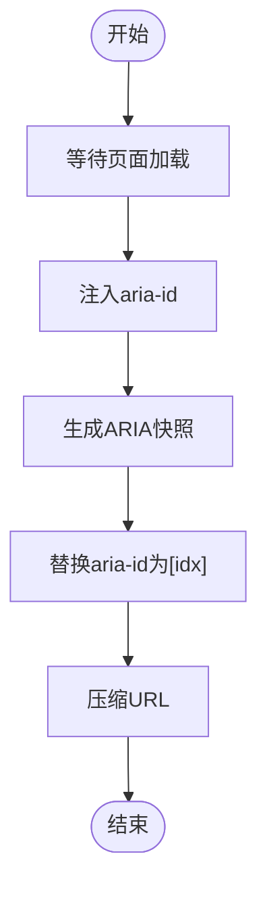
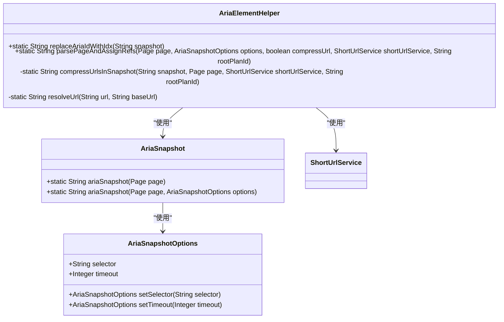
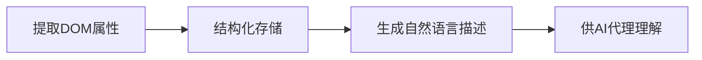
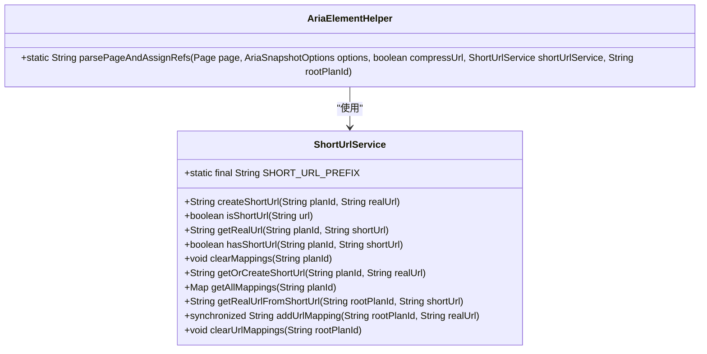

# 元素状态生成

<cite>
**本文档引用的文件**  
- [InteractiveElement.java](file://src/main/java/com/alibaba/cloud/ai/lynxe/tool/browser/InteractiveElement.java)
- [InteractiveElementRegistry.java](file://src/main/java/com/alibaba/cloud/ai/lynxe/tool/browser/InteractiveElementRegistry.java)
- [AriaElementHelper.java](file://src/main/java/com/alibaba/cloud/ai/lynxe/tool/browser/AriaElementHelper.java)
- [AriaSnapshot.java](file://src/main/java/com/alibaba/cloud/ai/lynxe/tool/browser/AriaSnapshot.java)
- [AriaSnapshotOptions.java](file://src/main/java/com/alibaba/cloud/ai/lynxe/tool/browser/AriaSnapshotOptions.java)
- [ShortUrlService.java](file://src/main/java/com/alibaba/cloud/ai/lynxe/tool/shortUrl/ShortUrlService.java)
- [extract-interactive-elements.js](file://src/main/resources/tool/extract-interactive-elements.js)
</cite>

## 目录
1. [引言](#引言)
2. [核心组件分析](#核心组件分析)
3. [元素状态生成流程](#元素状态生成流程)
4. [ARIA辅助解析机制](#aria辅助解析机制)
5. [语义化描述生成](#语义化描述生成)
6. [序列化与数据完整性](#序列化与数据完整性)
7. [结论](#结论)

## 引言
本文档全面解析InteractiveElement对象的状态生成过程，详细说明从DOM元素提取的各类属性如何被结构化存储，包括基础属性、可访问性属性、表单状态以及视觉状态。同时阐述AriaElementHelper如何辅助解析复杂的ARIA角色和状态，解释元素语义化描述的生成逻辑，以及元素状态的序列化机制及其在跨网络传输时的数据完整性保障。

## 核心组件分析

**Section sources**
- [InteractiveElement.java](file://src/main/java/com/alibaba/cloud/ai/lynxe/tool/browser/InteractiveElement.java#L1-L126)
- [InteractiveElementRegistry.java](file://src/main/java/com/alibaba/cloud/ai/lynxe/tool/browser/InteractiveElementRegistry.java#L1-L555)

### InteractiveElement类
InteractiveElement类表示单个交互式元素，持有元素的定位器（Locator）。该类存储了元素的全局索引、定位器、标签名、文本信息和HTML结构信息。通过构造函数接收索引、框架和元素映射，初始化这些属性。

### InteractiveElementRegistry类
InteractiveElementRegistry类管理页面上交互式元素的集合，提供全局索引访问。该类包含一个JavaScript代码片段，用于选择交互式元素，并通过refresh方法刷新指定页面上的所有交互式元素。processPageElements方法处理单个iframe中的交互式元素。

## 元素状态生成流程

**Diagram sources**
- [AriaSnapshot.java](file://src/main/java/com/alibaba/cloud/ai/lynxe/tool/browser/AriaSnapshot.java#L76-L87)
- [AriaElementHelper.java](file://src/main/java/com/alibaba/cloud/ai/lynxe/tool/browser/AriaElementHelper.java#L95-L96)

**Section sources**
- [AriaSnapshot.java](file://src/main/java/com/alibaba/cloud/ai/lynxe/tool/browser/AriaSnapshot.java#L63-L108)
- [InteractiveElementRegistry.java](file://src/main/java/com/alibaba/cloud/ai/lynxe/tool/browser/InteractiveElementRegistry.java#L424-L477)

### 基础属性提取
InteractiveElement类从DOM元素提取基础属性，包括标签名、ID、类名等。这些属性在构造函数中通过elementMap参数获取并存储。

### 可访问性属性解析
通过AriaSnapshot类生成ARIA快照，提取元素的可访问性属性。ariaSnapshot方法注入唯一的aria-id到所有元素，然后使用Playwright的原生ariaSnapshot方法生成快照。

### 表单状态提取
InteractiveElementRegistry类中的JavaScript代码检查表单元素的状态，如disabled、readonly、checked等。通过检查元素的属性和属性值来确定这些状态。

### 视觉状态检测
JavaScript代码中的isElementVisible函数检测元素的视觉状态，包括可见性、位置坐标等。通过检查元素的offsetWidth、offsetHeight、visibility和display属性来确定元素是否可见。

## ARIA辅助解析机制

**Diagram sources**
- [AriaElementHelper.java](file://src/main/java/com/alibaba/cloud/ai/lynxe/tool/browser/AriaElementHelper.java#L39-L64)
- [AriaSnapshot.java](file://src/main/java/com/alibaba/cloud/ai/lynxe/tool/browser/AriaSnapshot.java#L51-L63)
- [AriaSnapshotOptions.java](file://src/main/java/com/alibaba/cloud/ai/lynxe/tool/browser/AriaSnapshotOptions.java#L21-L74)

**Section sources**
- [AriaElementHelper.java](file://src/main/java/com/alibaba/cloud/ai/lynxe/tool/browser/AriaElementHelper.java#L79-L110)
- [AriaSnapshot.java](file://src/main/java/com/alibaba/cloud/ai/lynxe/tool/browser/AriaSnapshot.java#L76-L87)

### AriaElementHelper功能
AriaElementHelper类提供静态方法来处理ARIA快照。replaceAriaIdWithIdx方法将aria-id-num模式替换为[idx=num]，parsePageAndAssignRefs方法解析页面并生成处理后的快照。

### AriaSnapshotOptions配置
AriaSnapshotOptions类定义生成ARIA快照的选项，包括CSS选择器和超时时间。默认选择器为"body"，默认超时时间为30秒。

## 语义化描述生成

**Diagram sources**
- [InteractiveElement.java](file://src/main/java/com/alibaba/cloud/ai/lynxe/tool/browser/InteractiveElement.java#L109-L123)
- [InteractiveElementRegistry.java](file://src/main/java/com/alibaba/cloud/ai/lynxe/tool/browser/InteractiveElementRegistry.java#L509-L514)

**Section sources**
- [InteractiveElement.java](file://src/main/java/com/alibaba/cloud/ai/lynxe/tool/browser/InteractiveElement.java#L109-L123)
- [InteractiveElementRegistry.java](file://src/main/java/com/alibaba/cloud/ai/lynxe/tool/browser/InteractiveElementRegistry.java#L509-L514)

### toString方法
InteractiveElement类的toString方法创建元素信息的字符串表示。如果文本为空，则使用outerHtml，但会移除lynxe-id和style属性。内容超过500字符时进行截断。

### generateElementsInfoText方法
InteractiveElementRegistry类的generateElementsInfoText方法生成所有元素的详细信息文本。遍历所有元素，调用其toString方法并拼接结果。

## 序列化与数据完整性

**Diagram sources**
- [ShortUrlService.java](file://src/main/java/com/alibaba/cloud/ai/lynxe/tool/shortUrl/ShortUrlService.java#L31-L282)
- [AriaElementHelper.java](file://src/main/java/com/alibaba/cloud/ai/lynxe/tool/browser/AriaElementHelper.java#L79-L107)

**Section sources**
- [ShortUrlService.java](file://src/main/java/com/alibaba/cloud/ai/lynxe/tool/shortUrl/ShortUrlService.java#L95-L123)
- [AriaElementHelper.java](file://src/main/java/com/alibaba/cloud/ai/lynxe/tool/browser/AriaElementHelper.java#L128-L170)

### ShortUrlService功能
ShortUrlService类实现短URL服务，管理URL映射。提供planId级别的隔离，使用内存存储。createShortUrl方法创建短URL，getRealUrl方法获取真实URL，clearMappings方法清除映射。

### URL压缩机制
AriaElementHelper的compressUrlsInSnapshot方法压缩快照中的URL。使用ShortUrlService将真实URL映射到短URL（如http://s@Url.a/1），并在快照中替换。

## 结论
本文档详细解析了InteractiveElement对象的状态生成过程，从DOM元素提取各类属性并结构化存储，通过AriaElementHelper辅助解析复杂的ARIA角色和状态，生成语义化描述供AI代理理解，并通过ShortUrlService保障数据完整性。整个流程确保了元素状态的准确性和可访问性。