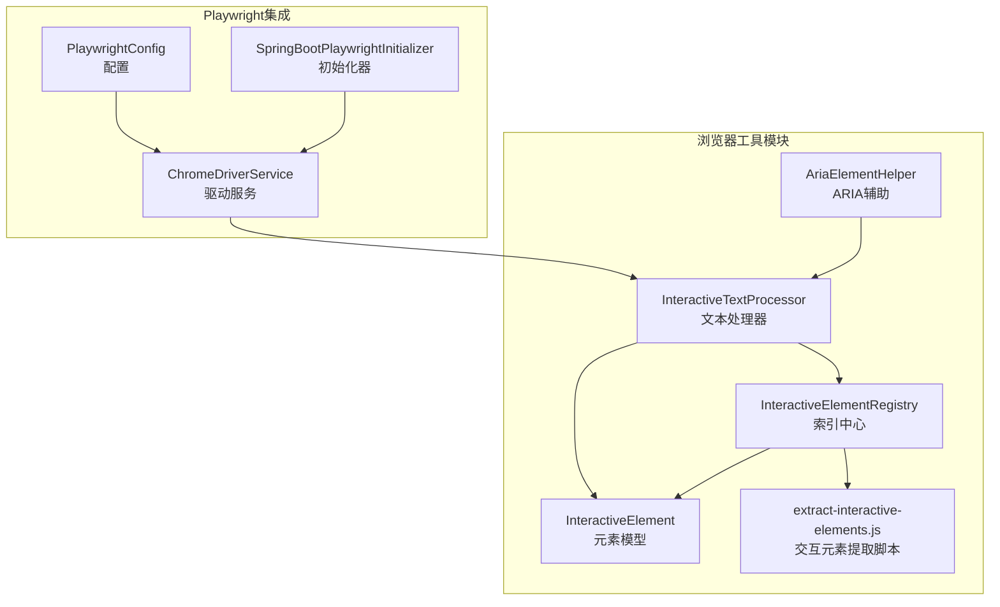
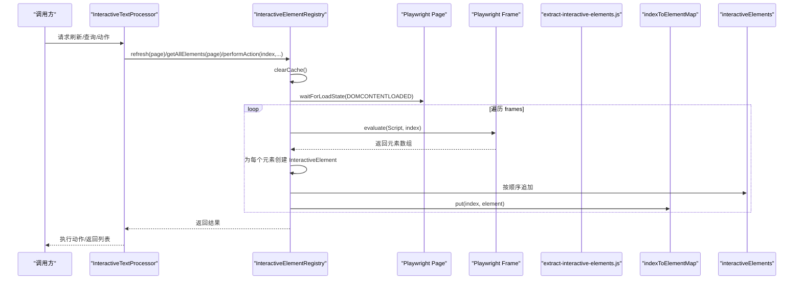
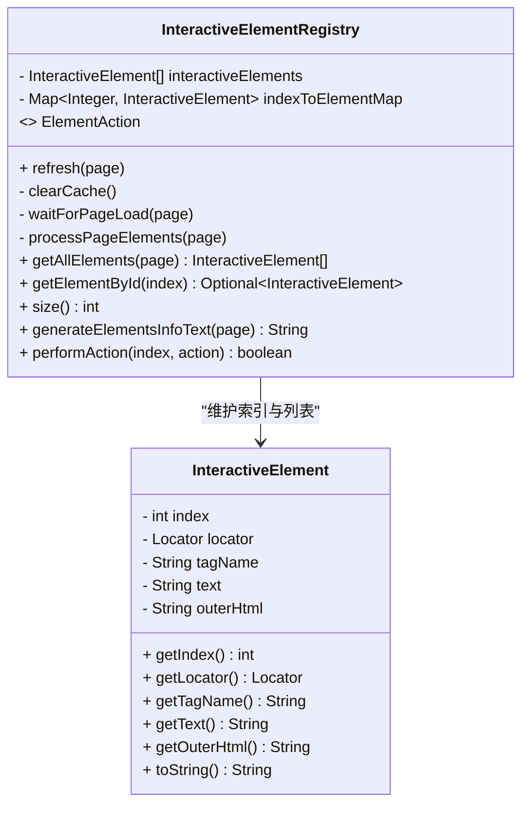
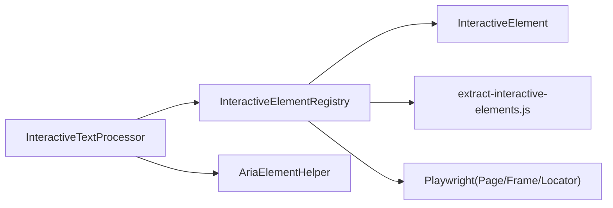

# 元素索引管理

<cite>
**本文引用的文件**
- [InteractiveElementRegistry.java](file://src/main/java/com/alibaba/cloud/ai/lynxe/tool/browser/InteractiveElementRegistry.java)
- [InteractiveElement.java](file://src/main/java/com/alibaba/cloud/ai/lynxe/tool/browser/InteractiveElement.java)
- [InteractiveTextProcessor.java](file://src/main/java/com/alibaba/cloud/ai/lynxe/tool/browser/InteractiveTextProcessor.java)
- [AriaElementHelper.java](file://src/main/java/com/alibaba/cloud/ai/lynxe/tool/browser/AriaElementHelper.java)
- [SpringBootPlaywrightInitializer.java](file://src/main/java/com/alibaba/cloud/ai/lynxe/tool/browser/SpringBootPlaywrightInitializer.java)
- [PlaywrightConfig.java](file://src/main/java/com/alibaba/cloud/ai/lynxe/config/PlaywrightConfig.java)
- [ChromeDriverService.java](file://src/main/java/com/alibaba/cloud/ai/lynxe/tool/browser/ChromeDriverService.java)
- [extract-interactive-elements.js](file://src/main/resources/tool/extract-interactive-elements.js)
</cite>

## 目录
1. [简介](#简介)
2. [项目结构](#项目结构)
3. [核心组件](#核心组件)
4. [架构总览](#架构总览)
5. [详细组件分析](#详细组件分析)
6. [依赖关系分析](#依赖关系分析)
7. [性能考量](#性能考量)
8. [故障排查指南](#故障排查指南)
9. [结论](#结论)
10. [附录](#附录)

## 简介
本文件围绕 InteractiveElementRegistry 类进行系统化文档化，重点阐述其作为“页面元素索引中心”的角色定位、从全局唯一 index 到 InteractiveElement 对象的映射关系、线程安全设计（读写锁思想与并发容器选择）、元素注册/查询/清除的生命周期管理（含页面导航/刷新后的状态重置）、index 分配策略（自增 ID 及跨会话稳定性保障）、以及 Registry 的性能监控与内存泄漏防范最佳实践。文档同时结合浏览器自动化框架 Playwright 的集成方式，给出可操作的调用流程与可视化图示，帮助读者快速理解并正确使用该组件。

## 项目结构
本主题涉及的核心代码位于浏览器工具模块中，主要包含：
- 元素索引中心：InteractiveElementRegistry
- 元素模型：InteractiveElement
- 文本处理适配器：InteractiveTextProcessor
- ARIA 辅助工具：AriaElementHelper
- 浏览器初始化与配置：SpringBootPlaywrightInitializer、PlaywrightConfig、ChromeDriverService
- 前端脚本资源：extract-interactive-elements.js

图表来源
- [InteractiveElementRegistry.java](file://src/main/java/com/alibaba/cloud/ai/lynxe/tool/browser/InteractiveElementRegistry.java#L410-L554)
- [InteractiveElement.java](file://src/main/java/com/alibaba/cloud/ai/lynxe/tool/browser/InteractiveElement.java#L1-L126)
- [InteractiveTextProcessor.java](file://src/main/java/com/alibaba/cloud/ai/lynxe/tool/browser/InteractiveTextProcessor.java#L1-L127)
- [AriaElementHelper.java](file://src/main/java/com/alibaba/cloud/ai/lynxe/tool/browser/AriaElementHelper.java#L1-L207)
- [SpringBootPlaywrightInitializer.java](file://src/main/java/com/alibaba/cloud/ai/lynxe/tool/browser/SpringBootPlaywrightInitializer.java#L45-L110)
- [PlaywrightConfig.java](file://src/main/java/com/alibaba/cloud/ai/lynxe/config/PlaywrightConfig.java#L32-L68)
- [ChromeDriverService.java](file://src/main/java/com/alibaba/cloud/ai/lynxe/tool/browser/ChromeDriverService.java#L371-L401)
- [extract-interactive-elements.js](file://src/main/resources/tool/extract-interactive-elements.js#L1-L386)

章节来源
- [InteractiveElementRegistry.java](file://src/main/java/com/alibaba/cloud/ai/lynxe/tool/browser/InteractiveElementRegistry.java#L410-L554)
- [InteractiveElement.java](file://src/main/java/com/alibaba/cloud/ai/lynxe/tool/browser/InteractiveElement.java#L1-L126)
- [InteractiveTextProcessor.java](file://src/main/java/com/alibaba/cloud/ai/lynxe/tool/browser/InteractiveTextProcessor.java#L1-L127)
- [AriaElementHelper.java](file://src/main/java/com/alibaba/cloud/ai/lynxe/tool/browser/AriaElementHelper.java#L1-L207)
- [SpringBootPlaywrightInitializer.java](file://src/main/java/com/alibaba/cloud/ai/lynxe/tool/browser/SpringBootPlaywrightInitializer.java#L45-L110)
- [PlaywrightConfig.java](file://src/main/java/com/alibaba/cloud/ai/lynxe/config/PlaywrightConfig.java#L32-L68)
- [ChromeDriverService.java](file://src/main/java/com/alibaba/cloud/ai/lynxe/tool/browser/ChromeDriverService.java#L371-L401)
- [extract-interactive-elements.js](file://src/main/resources/tool/extract-interactive-elements.js#L1-L386)

## 核心组件
- InteractiveElementRegistry：维护全局唯一 index 到 InteractiveElement 的映射，负责页面元素的采集、缓存、查询与动作执行；内部采用并发安全的数据结构以支持多线程访问。
- InteractiveElement：封装单个可交互元素的元数据与定位器（Locator），用于后续动作执行。
- InteractiveTextProcessor：面向文本处理的适配层，通过 Registry 提供全局索引能力，简化上层调用。
- AriaElementHelper：对 ARIA 快照进行解析与索引替换，便于与 Registry 的索引体系协同。
- Playwright 集成：通过 SpringBootPlaywrightInitializer、PlaywrightConfig、ChromeDriverService 完成浏览器环境初始化与驱动加载，为 Registry 的页面元素提取提供运行时基础。

章节来源
- [InteractiveElementRegistry.java](file://src/main/java/com/alibaba/cloud/ai/lynxe/tool/browser/InteractiveElementRegistry.java#L410-L554)
- [InteractiveElement.java](file://src/main/java/com/alibaba/cloud/ai/lynxe/tool/browser/InteractiveElement.java#L1-L126)
- [InteractiveTextProcessor.java](file://src/main/java/com/alibaba/cloud/ai/lynxe/tool/browser/InteractiveTextProcessor.java#L1-L127)
- [AriaElementHelper.java](file://src/main/java/com/alibaba/cloud/ai/lynxe/tool/browser/AriaElementHelper.java#L1-L207)
- [SpringBootPlaywrightInitializer.java](file://src/main/java/com/alibaba/cloud/ai/lynxe/tool/browser/SpringBootPlaywrightInitializer.java#L45-L110)
- [PlaywrightConfig.java](file://src/main/java/com/alibaba/cloud/ai/lynxe/config/PlaywrightConfig.java#L32-L68)
- [ChromeDriverService.java](file://src/main/java/com/alibaba/cloud/ai/lynxe/tool/browser/ChromeDriverService.java#L371-L401)

## 架构总览
下图展示从页面到索引中心再到元素动作的整体调用链路，体现 Registry 的“索引中心”职责与线程安全设计。

图表来源
- [InteractiveElementRegistry.java](file://src/main/java/com/alibaba/cloud/ai/lynxe/tool/browser/InteractiveElementRegistry.java#L424-L477)
- [InteractiveTextProcessor.java](file://src/main/java/com/alibaba/cloud/ai/lynxe/tool/browser/InteractiveTextProcessor.java#L52-L86)
- [extract-interactive-elements.js](file://src/main/resources/tool/extract-interactive-elements.js#L1-L386)

章节来源
- [InteractiveElementRegistry.java](file://src/main/java/com/alibaba/cloud/ai/lynxe/tool/browser/InteractiveElementRegistry.java#L424-L477)
- [InteractiveTextProcessor.java](file://src/main/java/com/alibaba/cloud/ai/lynxe/tool/browser/InteractiveTextProcessor.java#L52-L86)

## 详细组件分析

### InteractiveElementRegistry 设计与实现
- 角色定位
  - 作为“页面元素索引中心”，提供全局唯一 index 到 InteractiveElement 的 O(1) 查询能力，并维护按全局顺序排列的元素列表，便于 UI 展示与交互。
- 数据结构
  - 有序列表：CopyOnWriteArrayList，保证遍历过程的线程安全与无锁读取。
  - 映射表：ConcurrentHashMap，提供高并发下的读写性能与原子性。
- 生命周期管理
  - refresh：清空缓存、等待页面加载、逐帧提取元素并重建索引。
  - clearCache：清空列表与映射，确保页面导航/刷新后状态重置。
  - getAllElements：触发 refresh 并返回快照列表，避免外部重复刷新。
  - getElementById：基于 indexToElementMap 进行快速查询。
  - size/generateElementsInfoText：统计数量与生成元素信息文本。
  - performAction：根据 index 获取元素并执行自定义 ElementAction，异常捕获与日志记录。
- 线程安全设计
  - 读路径：getById 使用 ConcurrentHashMap 的 get，读操作无锁；遍历列表使用 CopyOnWriteArrayList，遍历时不会阻塞写入。
  - 写路径：refresh 中 clearCache 后重建索引，整体写入过程在方法内完成，避免跨方法的并发竞争；列表与映射的更新是原子性的。
  - 注意：当前未使用显式读写锁，而是通过并发容器与方法级原子性实现线程安全，兼顾易用性与性能。
- index 分配策略
  - 自增 ID：JavaScript 脚本内部维护一个计数器，从传入的起始 index 开始递增，确保全局唯一性。
  - 跨帧一致性：每帧 evaluate 时传入当前累积的 index，保证不同 frame 的元素索引连续且不冲突。
  - 跨会话稳定性：index 仅在当前页面生命周期内有效，刷新/导航后会重新生成；若需跨会话稳定标识，建议结合元素的属性（如 lynxe-id 或 XPath）进行持久化映射。
- 页面导航/刷新后的状态重置
  - refresh 会先 clearCache，再重新扫描页面，确保旧索引被清理，新索引被建立。
  - 页面加载等待：waitForLoadState 确保 DOMContentLoaded 后再提取元素，降低不稳定因素。
- 动作接口
  - ElementAction 接口允许上层注入任意动作（如点击、填充等），Registry 仅负责索引与执行调度，解耦业务动作。

图表来源
- [InteractiveElementRegistry.java](file://src/main/java/com/alibaba/cloud/ai/lynxe/tool/browser/InteractiveElementRegistry.java#L410-L554)
- [InteractiveElement.java](file://src/main/java/com/alibaba/cloud/ai/lynxe/tool/browser/InteractiveElement.java#L1-L126)

章节来源
- [InteractiveElementRegistry.java](file://src/main/java/com/alibaba/cloud/ai/lynxe/tool/browser/InteractiveElementRegistry.java#L410-L554)
- [InteractiveElement.java](file://src/main/java/com/alibaba/cloud/ai/lynxe/tool/browser/InteractiveElement.java#L1-L126)

### 交互元素提取脚本（extract-interactive-elements.js）
- 作用：在页面上下文中扫描可交互元素，计算 XPath，生成包含全局 index 的元素清单。
- 关键点：
  - 递归遍历 DOM（含 Shadow DOM），跳过 iframe。
  - 可见性判断：基于 computedStyle 与尺寸/显示属性。
  - 交互判定：综合光标样式、标签集合、role/aria-role、事件监听器等多种启发式规则。
  - 全局 index：由脚本内部计数器维护，与 Java 侧传入的起始值衔接。
  - 属性注入：优先使用 lynxe-id，否则回退到 XPath 定位。

章节来源
- [extract-interactive-elements.js](file://src/main/resources/tool/extract-interactive-elements.js#L1-L386)

### 与 Playwright 的集成
- 初始化与配置
  - SpringBootPlaywrightInitializer：在 Spring Boot 环境中切换 ClassLoader 并创建 Playwright 实例，设置浏览器与临时目录。
  - PlaywrightConfig：从环境变量读取浏览器路径与下载开关，适配 Docker 等部署场景。
  - ChromeDriverService：统一创建 Playwright 实例与浏览器类型，处理异常并记录日志。
- 页面操作
  - Registry 在 Page/Frame 上执行 evaluate，将脚本结果转换为元素对象并建立索引。

章节来源
- [SpringBootPlaywrightInitializer.java](file://src/main/java/com/alibaba/cloud/ai/lynxe/tool/browser/SpringBootPlaywrightInitializer.java#L45-L110)
- [PlaywrightConfig.java](file://src/main/java/com/alibaba/cloud/ai/lynxe/config/PlaywrightConfig.java#L32-L68)
- [ChromeDriverService.java](file://src/main/java/com/alibaba/cloud/ai/lynxe/tool/browser/ChromeDriverService.java#L371-L401)
- [InteractiveElementRegistry.java](file://src/main/java/com/alibaba/cloud/ai/lynxe/tool/browser/InteractiveElementRegistry.java#L458-L471)

### 与文本处理适配器的协作
- InteractiveTextProcessor 将 Registry 的能力封装为更易用的 API：
  - refreshCache：刷新页面元素缓存。
  - getElementByIndex/getAllElements：查询与列举元素。
  - clickElement/fillText/performAction：封装常见动作，内部委托 Registry 的 performAction 与 ElementAction。

章节来源
- [InteractiveTextProcessor.java](file://src/main/java/com/alibaba/cloud/ai/lynxe/tool/browser/InteractiveTextProcessor.java#L1-L127)
- [InteractiveElementRegistry.java](file://src/main/java/com/alibaba/cloud/ai/lynxe/tool/browser/InteractiveElementRegistry.java#L517-L554)

### ARIA 快照与索引替换
- AriaElementHelper 提供将 ARIA 快照中的 aria-id-数字 替换为 [idx=数字] 的能力，便于与 Registry 的索引体系对齐，提升可读性与一致性。

章节来源
- [AriaElementHelper.java](file://src/main/java/com/alibaba/cloud/ai/lynxe/tool/browser/AriaElementHelper.java#L1-L207)

## 依赖关系分析
- 组件耦合
  - Registry 与 InteractiveElement 强耦合：Registry 维护元素对象，元素持有 Locator，动作执行依赖元素定位器。
  - Registry 与 Playwright：通过 Page/Frame 的 evaluate 与 Locator 定位元素，依赖 Playwright 的浏览器驱动。
  - Processor 与 Registry：Processor 作为门面，将复杂流程封装为简单 API。
  - AriaElementHelper 与 Processor：在文本处理场景中配合使用，提升可读性。
- 外部依赖
  - Playwright：浏览器自动化核心。
  - 日志：SLF4J，用于错误与警告输出。

图表来源
- [InteractiveTextProcessor.java](file://src/main/java/com/alibaba/cloud/ai/lynxe/tool/browser/InteractiveTextProcessor.java#L1-L127)
- [InteractiveElementRegistry.java](file://src/main/java/com/alibaba/cloud/ai/lynxe/tool/browser/InteractiveElementRegistry.java#L410-L554)
- [InteractiveElement.java](file://src/main/java/com/alibaba/cloud/ai/lynxe/tool/browser/InteractiveElement.java#L1-L126)
- [AriaElementHelper.java](file://src/main/java/com/alibaba/cloud/ai/lynxe/tool/browser/AriaElementHelper.java#L1-L207)

章节来源
- [InteractiveTextProcessor.java](file://src/main/java/com/alibaba/cloud/ai/lynxe/tool/browser/InteractiveTextProcessor.java#L1-L127)
- [InteractiveElementRegistry.java](file://src/main/java/com/alibaba/cloud/ai/lynxe/tool/browser/InteractiveElementRegistry.java#L410-L554)
- [InteractiveElement.java](file://src/main/java/com/alibaba/cloud/ai/lynxe/tool/browser/InteractiveElement.java#L1-L126)
- [AriaElementHelper.java](file://src/main/java/com/alibaba/cloud/ai/lynxe/tool/browser/AriaElementHelper.java#L1-L207)

## 性能考量
- 并发容器选择
  - CopyOnWriteArrayList：适合读多写少的场景，遍历无锁，但写入会复制数组，频繁刷新会影响性能。建议在高频刷新场景下评估批量刷新策略。
  - ConcurrentHashMap：读操作无锁，写入原子，适合高并发查询。
- 线程安全与性能权衡
  - 当前实现通过方法级原子性与并发容器实现线程安全，避免了显式读写锁的复杂度，适合大多数业务场景。
  - 若存在大量并发写入与查询，可考虑分段锁或读写分离策略（需评估收益与复杂度）。
- 页面加载与提取
  - waitForLoadState 确保 DOM 稳定后再提取，减少不稳定元素导致的误判。
  - 脚本侧可见性与交互性判断减少无效元素，提高索引质量。
- 内存与 GC
  - 每次 refresh 会清空并重建索引，避免长期积累；元素对象包含 Locator，注意及时释放 Page/Frame 生命周期。
  - 大页面元素过多时，建议分页刷新或按需刷新，避免一次性构建过大的索引。

[本节为通用性能讨论，无需列出具体文件来源]

## 故障排查指南
- 页面加载失败
  - 现象：等待页面加载时报错或超时。
  - 排查：检查网络与浏览器驱动状态，确认 Playwright 初始化成功。
  - 参考
    - [SpringBootPlaywrightInitializer.java](file://src/main/java/com/alibaba/cloud/ai/lynxe/tool/browser/SpringBootPlaywrightInitializer.java#L45-L110)
    - [PlaywrightConfig.java](file://src/main/java/com/alibaba/cloud/ai/lynxe/config/PlaywrightConfig.java#L32-L68)
- 元素提取为空
  - 现象：getAllElements 返回空列表。
  - 排查：确认页面已完全加载；检查脚本是否被拦截；验证可见性与交互性判断逻辑是否过于严格。
  - 参考
    - [InteractiveElementRegistry.java](file://src/main/java/com/alibaba/cloud/ai/lynxe/tool/browser/InteractiveElementRegistry.java#L443-L477)
    - [extract-interactive-elements.js](file://src/main/resources/tool/extract-interactive-elements.js#L1-L386)
- 索引不存在
  - 现象：performAction 返回失败或警告。
  - 排查：确认 index 是否正确；页面是否已刷新；是否存在动态内容导致索引失效。
  - 参考
    - [InteractiveElementRegistry.java](file://src/main/java/com/alibaba/cloud/ai/lynxe/tool/browser/InteractiveElementRegistry.java#L517-L554)
- 动作执行异常
  - 现象：执行动作抛出异常。
  - 排查：检查元素定位器是否有效；确认元素仍处于可见状态；查看日志中的错误信息。
  - 参考
    - [InteractiveElementRegistry.java](file://src/main/java/com/alibaba/cloud/ai/lynxe/tool/browser/InteractiveElementRegistry.java#L517-L554)
    - [InteractiveElement.java](file://src/main/java/com/alibaba/cloud/ai/lynxe/tool/browser/InteractiveElement.java#L1-L126)

章节来源
- [SpringBootPlaywrightInitializer.java](file://src/main/java/com/alibaba/cloud/ai/lynxe/tool/browser/SpringBootPlaywrightInitializer.java#L45-L110)
- [PlaywrightConfig.java](file://src/main/java/com/alibaba/cloud/ai/lynxe/config/PlaywrightConfig.java#L32-L68)
- [InteractiveElementRegistry.java](file://src/main/java/com/alibaba/cloud/ai/lynxe/tool/browser/InteractiveElementRegistry.java#L443-L554)
- [InteractiveElement.java](file://src/main/java/com/alibaba/cloud/ai/lynxe/tool/browser/InteractiveElement.java#L1-L126)
- [extract-interactive-elements.js](file://src/main/resources/tool/extract-interactive-elements.js#L1-L386)

## 结论
InteractiveElementRegistry 通过并发容器与方法级原子性实现了高效的索引中心能力，结合 Playwright 的页面提取与定位，为上层提供了稳定的元素索引与动作执行能力。其自增 index 分配策略保证了全局唯一性，而 clearCache 与 refresh 机制确保了页面导航/刷新后的状态重置。在实际使用中，建议遵循“按需刷新、分批处理、及时释放资源”的原则，以获得更好的性能与稳定性。

[本节为总结性内容，无需列出具体文件来源]

## 附录

### index 分配策略与跨会话稳定性
- 分配策略
  - 自增 ID：脚本内部计数器从传入起始值递增，确保全局唯一。
  - 跨帧连续：每帧 evaluate 时传入累计 index，避免不同 frame 的索引冲突。
- 跨会话稳定性
  - index 仅在当前页面生命周期内有效；刷新/导航后会重新生成。
  - 如需跨会话稳定标识，建议结合元素属性（如 lynxe-id 或 XPath）建立持久化映射，而非依赖 index。

章节来源
- [InteractiveElementRegistry.java](file://src/main/java/com/alibaba/cloud/ai/lynxe/tool/browser/InteractiveElementRegistry.java#L458-L471)
- [extract-interactive-elements.js](file://src/main/resources/tool/extract-interactive-elements.js#L1-L386)

### 性能监控与内存泄漏防范最佳实践
- 性能监控
  - 记录 refresh 耗时与元素数量，识别页面规模变化对性能的影响。
  - 监控 performAction 成功率与异常类型，定位定位器失效或元素不可见问题。
- 内存泄漏防范
  - 及时释放 Page/Frame 生命周期，避免长时间持有大页面对象。
  - 控制刷新频率，避免在高频交互场景下反复重建索引。
  - 对于长生命周期应用，定期清理不再使用的索引与元素对象。

[本节为通用指导，无需列出具体文件来源]