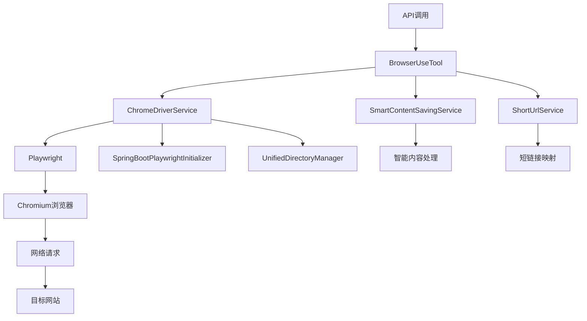

# 核心功能与架构

<cite>
**本文档引用的文件**  
- [BrowserUseTool.java](file://src/main/java/com/alibaba/cloud/ai/lynxe/tool/browser/BrowserUseTool.java)
- [ChromeDriverService.java](file://src/main/java/com/alibaba/cloud/ai/lynxe/tool/browser/ChromeDriverService.java)
- [SpringBootPlaywrightInitializer.java](file://src/main/java/com/alibaba/cloud/ai/lynxe/tool/browser/SpringBootPlaywrightInitializer.java)
- [DriverWrapper.java](file://src/main/java/com/alibaba/cloud/ai/lynxe/tool/browser/DriverWrapper.java)
- [AriaElementHelper.java](file://src/main/java/com/alibaba/cloud/ai/lynxe/tool/browser/AriaElementHelper.java)
- [ChromeHistoryCleaner.java](file://src/main/java/com/alibaba/cloud/ai/lynxe/tool/browser/ChromeHistoryCleaner.java)
- [BrowserRequestVO.java](file://src/main/java/com/alibaba/cloud/ai/lynxe/tool/browser/actions/BrowserRequestVO.java)
- [IChromeDriverService.java](file://src/main/java/com/alibaba/cloud/ai/lynxe/tool/browser/IChromeDriverService.java)
</cite>

## 目录
1. [系统概述](#系统概述)
2. [核心组件设计](#核心组件设计)
3. [浏览器驱动管理](#浏览器驱动管理)
4. [Playwright环境初始化](#playwright环境初始化)
5. [执行上下文隔离](#执行上下文隔离)
6. [系统上下文图](#系统上下文图)
7. [组件交互序列图](#组件交互序列图)

## 系统概述
本系统是一个基于Playwright的浏览器自动化工具，核心功能是通过API调用实现对浏览器的自动化操作。系统采用Spring Boot框架构建，通过BrowserUseTool作为主工具类，封装了丰富的浏览器操作能力，包括页面导航、元素点击、文本输入、截图等。系统设计注重稳定性、可靠性和并发性能，通过Plan ID实现了多任务执行上下文的完全隔离，确保在高并发场景下的稳定运行。

系统架构采用分层设计，上层为工具接口层，中层为服务管理层，底层为Playwright驱动层。BrowserUseTool作为核心工具类，依赖ChromeDriverService进行浏览器实例的生命周期管理，同时集成SmartContentSavingService实现智能内容处理。整个系统通过SpringBootPlaywrightInitializer确保在Spring Boot环境中Playwright的正确初始化，解决了在Spring Boot fat jar中运行Playwright的特殊问题。

**系统上下文图**展示了从API调用到浏览器操作的完整数据流，体现了系统各组件之间的协作关系。**组件交互序列图**详细描述了浏览器操作请求的处理流程，从API入口到最终的Playwright操作执行，涵盖了错误处理、重试机制和资源清理等关键环节。

## 核心组件设计

BrowserUseTool是浏览器自动化工具的核心主工具类，负责封装所有浏览器操作功能。该类通过依赖注入的方式获取ChromeDriverService、SmartContentSavingService等核心服务，实现了高内聚低耦合的设计原则。BrowserUseTool继承自AbstractBaseTool，实现了PlanningToolInterface接口，使其能够无缝集成到系统的工具调用框架中。

BrowserUseTool的核心设计采用了命令模式，通过run方法接收BrowserRequestVO请求对象，根据action字段的值分发到不同的操作处理器。系统支持多种浏览器操作，包括navigate（导航）、click（点击）、input_text（文本输入）、screenshot（截图）、get_text（获取文本）、execute_js（执行JavaScript）、scroll（滚动）等。每种操作都封装在独立的Action类中，如NavigateAction、ClickByElementAction、InputTextAction等，遵循单一职责原则。

BrowserUseTool的一个重要特性是智能内容处理能力。在执行get_text和execute_js等可能产生大量输出的操作时，系统会自动调用SmartContentSavingService.processContent方法对结果进行智能处理，提取关键信息并生成摘要，避免输出过长影响用户体验。对于其他操作，系统也会尝试进行智能处理，但设置了较高的阈值，通常不会触发。

为了提高操作的可靠性，BrowserUseTool实现了重试机制。executeActionWithRetry方法为所有浏览器操作提供了最多2次的重试机会，针对不同类型的异常采取不同的处理策略。对于TimeoutError和部分PlaywrightException会进行重试，而对于运行时异常则不会重试，直接抛出错误。重试之间有1秒的延迟，并采用指数退避策略，第二次重试延迟2秒。

**Section sources**
- [BrowserUseTool.java](file://src/main/java/com/alibaba/cloud/ai/lynxe/tool/browser/BrowserUseTool.java#L52-L652)

## 浏览器驱动管理

ChromeDriverService是浏览器驱动管理的核心服务，负责Playwright浏览器实例的生命周期管理，包括驱动创建、健康检查和资源清理等关键机制。该服务通过ConcurrentHashMap<String, DriverWrapper> drivers集合管理不同Plan ID对应的浏览器驱动实例，实现了多任务的并发执行和上下文隔离。

驱动创建过程采用了双重检查锁机制，确保在高并发场景下的线程安全。getDriver方法首先检查是否存在已有的驱动实例，如果存在则进行健康检查，只有在驱动健康的情况下才返回现有实例。如果驱动不健康或不存在，则通过driverLock获取锁后创建新的驱动实例。这种设计避免了不必要的浏览器实例创建，提高了资源利用率。

驱动健康检查是ChromeDriverService的重要功能，通过isDriverHealthy方法实现。该方法对浏览器实例进行全面检查，包括：浏览器连接状态、浏览器上下文有效性、当前页面可用性以及基本操作的响应性。检查过程通过page.evaluate("() => document.readyState")执行一个简单的JavaScript操作，验证浏览器是否能够正常响应。如果任何一项检查失败，系统会认为驱动不健康，需要重新创建。

资源清理机制通过closeDriverForPlan方法实现，遵循Playwright的最佳实践顺序：先保存存储状态，再关闭浏览器上下文，然后清理浏览历史，最后关闭浏览器和Playwright实例。DriverWrapper的close方法严格按照此顺序执行，确保资源的正确释放和状态的持久化。特别地，系统在关闭浏览器上下文后，会调用ChromeHistoryCleaner.cleanHistory方法清理浏览历史，但保留cookies等重要数据，实现了隐私保护和状态保持的平衡。

**Section sources**
- [ChromeDriverService.java](file://src/main/java/com/alibaba/cloud/ai/lynxe/tool/browser/ChromeDriverService.java#L50-L800)
- [DriverWrapper.java](file://src/main/java/com/alibaba/cloud/ai/lynxe/tool/browser/DriverWrapper.java#L37-L286)
- [ChromeHistoryCleaner.java](file://src/main/java/com/alibaba/cloud/ai/lynxe/tool/browser/ChromeHistoryCleaner.java#L42-L237)

## Playwright环境初始化

SpringBootPlaywrightInitializer负责在Spring Boot环境中初始化Playwright运行环境，解决了在Spring Boot fat jar中运行Playwright的特殊问题。该组件通过canInitialize方法检查Playwright类是否在类路径中，确保Playwright依赖已正确引入。

createPlaywright方法是初始化的核心，它通过切换当前线程的上下文类加载器来解决类加载问题。在Spring Boot环境中，应用通常使用LaunchedClassLoader加载，而Playwright需要特定的类加载器环境才能正确初始化。该方法首先保存原始的上下文类加载器，然后切换到当前类的类加载器（即LaunchedClassLoader），再调用Playwright.create()创建实例，最后恢复原始的上下文类加载器。

setupSpringBootEnvironment方法配置了Playwright运行所需的关键系统属性。它设置了playwright.browsers.path指向用户主目录下的缓存目录，避免在容器环境中权限问题。同时设置playwright.driver.tmpdir使用系统的临时目录。该方法还检查浏览器二进制文件是否存在，如果存在则设置PLAYWRIGHT_SKIP_BROWSER_DOWNLOAD=1，避免重复下载浏览器。

SpringBootPlaywrightInitializer的另一个重要功能是日志记录和调试信息输出。它详细记录了类加载器信息、类路径、环境变量等关键信息，便于在出现问题时进行诊断。在DEBUG级别下，还会输出详细的目录结构信息，帮助开发人员理解Playwright的运行环境。

**Section sources**
- [SpringBootPlaywrightInitializer.java](file://src/main/java/com/alibaba/cloud/ai/lynxe/tool/browser/SpringBootPlaywrightInitializer.java#L32-L198)

## 执行上下文隔离

系统通过Plan ID实现了不同执行上下文的完全隔离，确保多任务并发执行时的稳定性。每个Plan ID对应一个独立的浏览器驱动实例，由ChromeDriverService的drivers映射表管理。当BrowserUseTool需要执行浏览器操作时，会通过currentPlanId获取对应的驱动实例，从而确保操作在正确的上下文中执行。

隔离机制的关键在于userDataDir的隔离。createDriverInstance方法为每个Plan ID创建独立的userDataDir，路径为sharedDir/planId-{planId}。这种设计使得每个Plan ID都有独立的浏览器用户数据目录，避免了Chromium对目录的锁定问题，允许多个浏览器实例同时运行。同时，这种隔离也确保了不同任务之间的浏览数据（如cookies、localStorage等）完全独立，防止数据污染。

上下文清理机制与隔离机制紧密配合。cleanup方法在任务结束时被调用，通过Plan ID定位并关闭对应的浏览器驱动。closeDriverForPlan方法不仅关闭浏览器实例，还会清理planId-specific的userDataDir，防止临时目录的积累。这种按Plan ID进行资源分配和回收的机制，实现了资源的精细化管理，避免了内存泄漏和磁盘空间耗尽的问题。

Plan ID的传递贯穿整个调用链。从API入口开始，Plan ID通过请求参数传递，在BrowserUseTool中作为实例变量currentPlanId保存，并在调用ChromeDriverService.getDriver时作为参数传递。这种设计确保了在整个操作过程中，系统始终知道当前操作属于哪个执行上下文，实现了端到端的上下文隔离。

**Section sources**
- [BrowserUseTool.java](file://src/main/java/com/alibaba/cloud/ai/lynxe/tool/browser/BrowserUseTool.java#L79-L91)
- [ChromeDriverService.java](file://src/main/java/com/alibaba/cloud/ai/lynxe/tool/browser/ChromeDriverService.java#L105-L157)
- [ChromeDriverService.java](file://src/main/java/com/alibaba/cloud/ai/lynxe/tool/browser/ChromeDriverService.java#L189-L232)

## 系统上下文图



**Diagram sources**
- [BrowserUseTool.java](file://src/main/java/com/alibaba/cloud/ai/lynxe/tool/browser/BrowserUseTool.java#L52-L652)
- [ChromeDriverService.java](file://src/main/java/com/alibaba/cloud/ai/lynxe/tool/browser/ChromeDriverService.java#L50-L800)

## 组件交互序列图

```mermaid
sequenceDiagram
participant API as API客户端
participant BrowserTool as BrowserUseTool
participant ChromeService as ChromeDriverService
participant Playwright as Playwright
participant Browser as Chromium浏览器
API->>BrowserTool : 调用run方法
BrowserTool->>ChromeService : getDriver(planId)
ChromeService->>ChromeService : 检查现有驱动健康状态
alt 驱动不存在或不健康
ChromeService->>ChromeService : 获取driverLock
ChromeService->>ChromeService : createNewDriverWithRetry
ChromeService->>SpringBootInitializer : createPlaywright()
SpringBootInitializer->>Playwright : 创建Playwright实例
Playwright-->>SpringBootInitializer : Playwright实例
SpringBootInitializer-->>ChromeService : Playwright实例
ChromeService->>Playwright : launchPersistentContext
Playwright-->>ChromeService : BrowserContext
ChromeService->>Playwright : newPage
Playwright-->>ChromeService : Page
ChromeService->>ChromeService : 创建DriverWrapper
ChromeService->>ChromeService : 释放driverLock
end
ChromeService-->>BrowserTool : DriverWrapper
BrowserTool->>BrowserTool : 执行具体操作
alt 操作需要重试
loop 最多2次重试
BrowserTool->>Playwright : 执行操作
alt 操作成功
break
end
end
end
alt 操作成功
BrowserTool->>SmartContentService : processContent
SmartContentService-->>BrowserTool : 处理结果
BrowserTool-->>API : 返回结果
else 操作失败
BrowserTool-->>API : 返回错误信息
end
```

**Diagram sources**
- [BrowserUseTool.java](file://src/main/java/com/alibaba/cloud/ai/lynxe/tool/browser/BrowserUseTool.java#L124-L290)
- [ChromeDriverService.java](file://src/main/java/com/alibaba/cloud/ai/lynxe/tool/browser/ChromeDriverService.java#L105-L157)