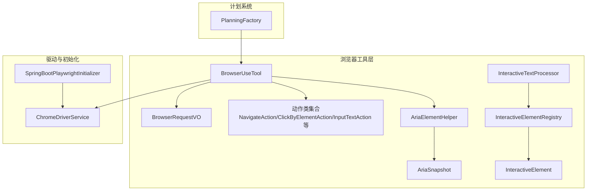
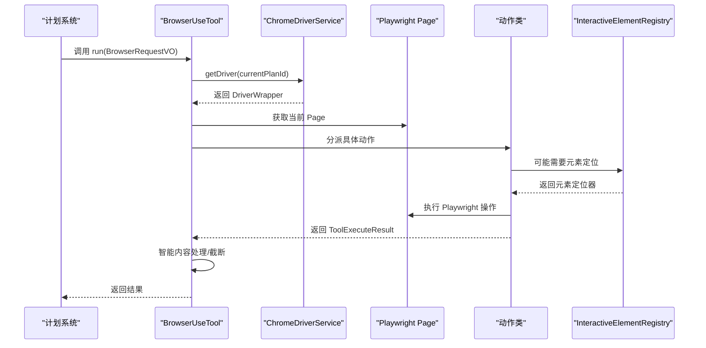
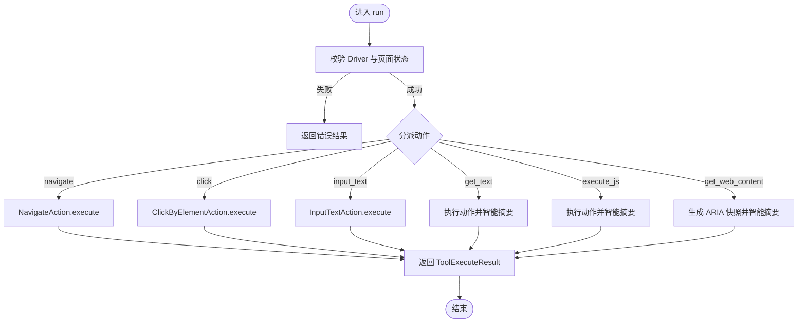
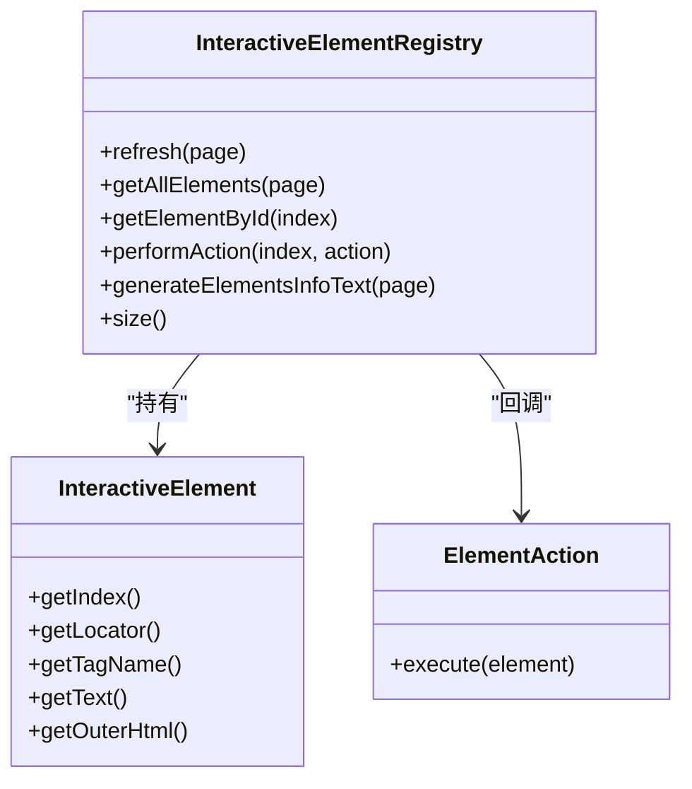
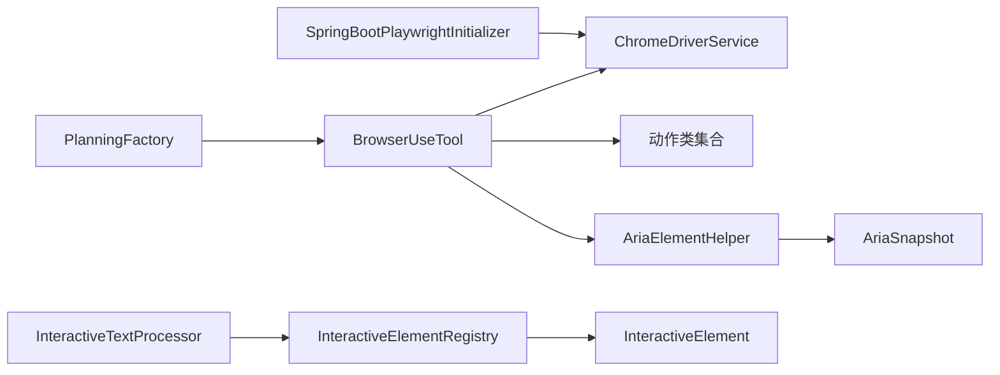

# 核心服务实现

<cite>
**本文引用的文件列表**
- [BrowserUseTool.java](file://src/main/java/com/alibaba/cloud/ai/lynxe/tool/browser/BrowserUseTool.java)
- [InteractiveElementRegistry.java](file://src/main/java/com/alibaba/cloud/ai/lynxe/tool/browser/InteractiveElementRegistry.java)
- [InteractiveTextProcessor.java](file://src/main/java/com/alibaba/cloud/ai/lynxe/tool/browser/InteractiveTextProcessor.java)
- [InteractiveElement.java](file://src/main/java/com/alibaba/cloud/ai/lynxe/tool/browser/InteractiveElement.java)
- [BrowserRequestVO.java](file://src/main/java/com/alibaba/cloud/ai/lynxe/tool/browser/actions/BrowserRequestVO.java)
- [NavigateAction.java](file://src/main/java/com/alibaba/cloud/ai/lynxe/tool/browser/actions/NavigateAction.java)
- [ClickByElementAction.java](file://src/main/java/com/alibaba/cloud/ai/lynxe/tool/browser/actions/ClickByElementAction.java)
- [InputTextAction.java](file://src/main/java/com/alibaba/cloud/ai/lynxe/tool/browser/actions/InputTextAction.java)
- [ChromeDriverService.java](file://src/main/java/com/alibaba/cloud/ai/lynxe/tool/browser/ChromeDriverService.java)
- [SpringBootPlaywrightInitializer.java](file://src/main/java/com/alibaba/cloud/ai/lynxe/tool/browser/SpringBootPlaywrightInitializer.java)
- [AriaElementHelper.java](file://src/main/java/com/alibaba/cloud/ai/lynxe/tool/browser/AriaElementHelper.java)
- [AriaSnapshot.java](file://src/main/java/com/alibaba/cloud/ai/lynxe/tool/browser/AriaSnapshot.java)
- [PlanningFactory.java](file://src/main/java/com/alibaba/cloud/ai/lynxe/planning/PlanningFactory.java)
- [browser-use-tool-zh.yml](file://src/main/resources/i18n/tools/browser-use-tool-zh.yml)
</cite>

## 目录
1. [简介](#简介)
2. [项目结构](#项目结构)
3. [核心组件](#核心组件)
4. [架构总览](#架构总览)
5. [关键组件深度解析](#关键组件深度解析)
6. [依赖关系分析](#依赖关系分析)
7. [性能与可靠性特性](#性能与可靠性特性)
8. [故障排查指南](#故障排查指南)
9. [结论](#结论)
10. [附录](#附录)

## 简介
本文件围绕 BrowserUseTool 的核心服务实现进行系统化解析，重点阐述其作为 AI 代理与浏览器交互的桥梁作用。文档覆盖以下主题：
- 通过 InteractiveElementRegistry 对页面交互元素进行注册与定位
- 通过 InteractiveTextProcessor 处理动态内容提取与智能摘要
- 工具方法的参数设计、执行流程与异常处理机制（含超时控制、网络错误恢复、页面加载等待策略）
- 典型使用场景（网页内容提取、表单填写、动态交互）
- 与计划执行系统的集成方式（Plan ID 上下文隔离与执行记录追踪）

## 项目结构
BrowserUseTool 所属模块位于工具层的 browser 子包，围绕 Playwright 提供浏览器自动化能力，并通过一系列动作类封装具体操作；同时配合 ChromeDriverService 实现多 Plan ID 隔离的浏览器生命周期管理。

图表来源
- [BrowserUseTool.java](file://src/main/java/com/alibaba/cloud/ai/lynxe/tool/browser/BrowserUseTool.java#L1-L120)
- [ChromeDriverService.java](file://src/main/java/com/alibaba/cloud/ai/lynxe/tool/browser/ChromeDriverService.java#L1-L120)
- [InteractiveElementRegistry.java](file://src/main/java/com/alibaba/cloud/ai/lynxe/tool/browser/InteractiveElementRegistry.java#L1-L120)
- [InteractiveTextProcessor.java](file://src/main/java/com/alibaba/cloud/ai/lynxe/tool/browser/InteractiveTextProcessor.java#L1-L60)
- [AriaElementHelper.java](file://src/main/java/com/alibaba/cloud/ai/lynxe/tool/browser/AriaElementHelper.java#L1-L80)
- [AriaSnapshot.java](file://src/main/java/com/alibaba/cloud/ai/lynxe/tool/browser/AriaSnapshot.java#L1-L60)
- [PlanningFactory.java](file://src/main/java/com/alibaba/cloud/ai/lynxe/planning/PlanningFactory.java#L243-L268)

章节来源
- [BrowserUseTool.java](file://src/main/java/com/alibaba/cloud/ai/lynxe/tool/browser/BrowserUseTool.java#L1-L120)
- [ChromeDriverService.java](file://src/main/java/com/alibaba/cloud/ai/lynxe/tool/browser/ChromeDriverService.java#L1-L120)
- [InteractiveElementRegistry.java](file://src/main/java/com/alibaba/cloud/ai/lynxe/tool/browser/InteractiveElementRegistry.java#L1-L120)
- [InteractiveTextProcessor.java](file://src/main/java/com/alibaba/cloud/ai/lynxe/tool/browser/InteractiveTextProcessor.java#L1-L60)
- [AriaElementHelper.java](file://src/main/java/com/alibaba/cloud/ai/lynxe/tool/browser/AriaElementHelper.java#L1-L80)
- [AriaSnapshot.java](file://src/main/java/com/alibaba/cloud/ai/lynxe/tool/browser/AriaSnapshot.java#L1-L60)
- [PlanningFactory.java](file://src/main/java/com/alibaba/cloud/ai/lynxe/planning/PlanningFactory.java#L243-L268)

## 核心组件
- BrowserUseTool：对外暴露统一的 run 接口，根据请求动作分派到具体动作类，负责超时控制、重试、智能内容处理与状态输出。
- InteractiveElementRegistry：扫描页面并构建交互元素索引，提供全局索引访问与动作执行。
- InteractiveTextProcessor：面向交互元素的高层封装，提供点击、填入、元素信息查询等便捷方法。
- 动作类（NavigateAction/ClickByElementAction/InputTextAction 等）：封装具体 Playwright 操作，包含参数校验、等待策略与错误处理。
- ChromeDriverService：按 Plan ID 隔离创建与复用浏览器实例，负责启动、健康检查、资源清理与持久化。
- AriaElementHelper/AriaSnapshot：生成页面 ARIA 快照，支持短链压缩与索引替换，便于代理理解页面结构。
- PlanningFactory：将 BrowserUseTool 注册为可用工具，参与计划执行。

章节来源
- [BrowserUseTool.java](file://src/main/java/com/alibaba/cloud/ai/lynxe/tool/browser/BrowserUseTool.java#L120-L220)
- [InteractiveElementRegistry.java](file://src/main/java/com/alibaba/cloud/ai/lynxe/tool/browser/InteractiveElementRegistry.java#L420-L555)
- [InteractiveTextProcessor.java](file://src/main/java/com/alibaba/cloud/ai/lynxe/tool/browser/InteractiveTextProcessor.java#L60-L128)
- [ChromeDriverService.java](file://src/main/java/com/alibaba/cloud/ai/lynxe/tool/browser/ChromeDriverService.java#L105-L200)
- [AriaElementHelper.java](file://src/main/java/com/alibaba/cloud/ai/lynxe/tool/browser/AriaElementHelper.java#L79-L118)
- [AriaSnapshot.java](file://src/main/java/com/alibaba/cloud/ai/lynxe/tool/browser/AriaSnapshot.java#L51-L117)
- [PlanningFactory.java](file://src/main/java/com/alibaba/cloud/ai/lynxe/planning/PlanningFactory.java#L243-L268)

## 架构总览
BrowserUseTool 作为统一入口，协调 ChromeDriverService 获取 Page，再由动作类完成具体操作；同时通过 Aria 快照与元素注册表实现“结构化理解 + 精确定位”的交互模式。

图表来源
- [BrowserUseTool.java](file://src/main/java/com/alibaba/cloud/ai/lynxe/tool/browser/BrowserUseTool.java#L120-L220)
- [ChromeDriverService.java](file://src/main/java/com/alibaba/cloud/ai/lynxe/tool/browser/ChromeDriverService.java#L105-L160)
- [ClickByElementAction.java](file://src/main/java/com/alibaba/cloud/ai/lynxe/tool/browser/actions/ClickByElementAction.java#L31-L87)
- [InteractiveElementRegistry.java](file://src/main/java/com/alibaba/cloud/ai/lynxe/tool/browser/InteractiveElementRegistry.java#L458-L500)

## 关键组件深度解析

### BrowserUseTool：统一入口与执行编排
- 参数与输入类型：通过 BrowserRequestVO 统一封装动作、URL、索引、文本、滚动参数、坐标等，确保调用端与内部实现解耦。
- 执行流程：
  - 驱动校验：获取 DriverWrapper 并验证浏览器连接与当前页面有效性。
  - 动作分发：根据 action 字段选择对应动作类执行。
  - 结果处理：对长文本（如 get_text、execute_js、get_web_content）进行智能摘要；对其他动作也尝试智能处理。
  - 异常处理：捕获超时与 Playwright 错误，返回可读错误信息；对非重试性异常直接抛出。
- 超时与等待：
  - 通过 LynxeProperties 获取浏览器请求超时（默认 30 秒），用于导航、元素等待、快照生成等。
  - 页面加载等待采用 DOMContentLoaded 与 NETWORKIDLE 两阶段策略，必要时额外等待以保证动态内容渲染完成。
- 重试机制：对超时与部分 Playwright 异常进行最多两次重试，带 1 秒延迟；对已关闭浏览器/上下文的异常不重试。
- 状态输出：getCurrentToolStateString 输出当前 URL、标题、标签页、交互元素、滚动信息与最近一次动作结果或错误，便于调试与可视化。

图表来源
- [BrowserUseTool.java](file://src/main/java/com/alibaba/cloud/ai/lynxe/tool/browser/BrowserUseTool.java#L120-L220)
- [NavigateAction.java](file://src/main/java/com/alibaba/cloud/ai/lynxe/tool/browser/actions/NavigateAction.java#L31-L78)
- [ClickByElementAction.java](file://src/main/java/com/alibaba/cloud/ai/lynxe/tool/browser/actions/ClickByElementAction.java#L31-L87)
- [InputTextAction.java](file://src/main/java/com/alibaba/cloud/ai/lynxe/tool/browser/actions/InputTextAction.java#L28-L88)

章节来源
- [BrowserUseTool.java](file://src/main/java/com/alibaba/cloud/ai/lynxe/tool/browser/BrowserUseTool.java#L120-L220)
- [BrowserUseTool.java](file://src/main/java/com/alibaba/cloud/ai/lynxe/tool/browser/BrowserUseTool.java#L293-L350)
- [BrowserUseTool.java](file://src/main/java/com/alibaba/cloud/ai/lynxe/tool/browser/BrowserUseTool.java#L401-L537)
- [BrowserUseTool.java](file://src/main/java/com/alibaba/cloud/ai/lynxe/tool/browser/BrowserUseTool.java#L566-L652)

### InteractiveElementRegistry：交互元素注册与定位
- 元素扫描：在页面 frames 中执行 JavaScript，识别可见且可交互的元素，生成全局索引与 XPath，缓存至内存列表与映射表。
- 定位策略：优先使用 lynxe-id 属性定位，否则回退到 XPath；支持 Shadow DOM 与 iframe 内容的遍历。
- 动作执行：提供 performAction(index, ElementAction)，对指定索引元素执行点击、填充等操作。
- 查询接口：getAllElements、getElementById、generateElementsInfoText、size 等，便于调试与展示。

图表来源
- [InteractiveElementRegistry.java](file://src/main/java/com/alibaba/cloud/ai/lynxe/tool/browser/InteractiveElementRegistry.java#L420-L555)
- [InteractiveElement.java](file://src/main/java/com/alibaba/cloud/ai/lynxe/tool/browser/InteractiveElement.java#L1-L126)

章节来源
- [InteractiveElementRegistry.java](file://src/main/java/com/alibaba/cloud/ai/lynxe/tool/browser/InteractiveElementRegistry.java#L420-L555)
- [InteractiveElement.java](file://src/main/java/com/alibaba/cloud/ai/lynxe/tool/browser/InteractiveElement.java#L1-L126)

### InteractiveTextProcessor：动态内容提取与交互
- 缓存刷新：refreshCache(page) 调用 Registry.refresh，确保元素列表与索引最新。
- 交互能力：clickElement(index)、fillText(index, text)、getElementByIndex(index)、getAllElements(page)、getElementCount()、performAction(index, action)。
- 适配策略：通过 Registry 的 ElementAction 回调，屏蔽 Playwright Locator 的差异，提供更简洁的 API。

章节来源
- [InteractiveTextProcessor.java](file://src/main/java/com/alibaba/cloud/ai/lynxe/tool/browser/InteractiveTextProcessor.java#L52-L128)

### 动作类：参数设计与执行细节
- NavigateAction：校验 URL（支持短链解析）、自动补全协议、设置超时、等待 DOMContentLoaded、保存存储状态。
- ClickByElementAction：基于索引定位元素，等待可见与启用、点击并处理新开标签页切换。
- InputTextAction：清空后逐字符输入，失败时回退到直接 fill 或 JS 赋值并触发 input 事件，最后等待页面更新。

章节来源
- [NavigateAction.java](file://src/main/java/com/alibaba/cloud/ai/lynxe/tool/browser/actions/NavigateAction.java#L31-L78)
- [ClickByElementAction.java](file://src/main/java/com/alibaba/cloud/ai/lynxe/tool/browser/actions/ClickByElementAction.java#L31-L87)
- [InputTextAction.java](file://src/main/java/com/alibaba/cloud/ai/lynxe/tool/browser/actions/InputTextAction.java#L28-L88)

### ChromeDriverService：Plan ID 隔离与生命周期管理
- 驱动获取：按 planId 从并发映射中获取或创建 DriverWrapper，带锁与健康检查。
- 创建策略：优先使用 launchPersistentContext + userDataDir 隔离用户数据，支持共享 cookies 加载；失败则回退到常规 launch/newContext。
- 超时配置：根据 LynxeProperties 设置页面与上下文默认超时。
- 清理策略：关闭驱动、删除 planId 特定 userDataDir、JVM 关闭钩子清理所有进程。
- 初始化器：SpringBootPlaywrightInitializer 在 Spring Boot 环境中正确设置类加载器与浏览器路径。

章节来源
- [ChromeDriverService.java](file://src/main/java/com/alibaba/cloud/ai/lynxe/tool/browser/ChromeDriverService.java#L105-L200)
- [ChromeDriverService.java](file://src/main/java/com/alibaba/cloud/ai/lynxe/tool/browser/ChromeDriverService.java#L234-L351)
- [ChromeDriverService.java](file://src/main/java/com/alibaba/cloud/ai/lynxe/tool/browser/ChromeDriverService.java#L353-L800)
- [SpringBootPlaywrightInitializer.java](file://src/main/java/com/alibaba/cloud/ai/lynxe/tool/browser/SpringBootPlaywrightInitializer.java#L1-L120)

### ARIA 快照与短链压缩：结构化理解与内容瘦身
- AriaSnapshot：注入 aria-label 标识，等待选择器，调用 Playwright 的 ariaSnapshot 方法生成 YAML。
- AriaElementHelper：将 aria-id-N 替换为 [idx=N]，并在开启压缩时将 URL 替换为短链，支持相对 URL 解析与根 Plan ID 生命周期管理。

章节来源
- [AriaSnapshot.java](file://src/main/java/com/alibaba/cloud/ai/lynxe/tool/browser/AriaSnapshot.java#L51-L117)
- [AriaElementHelper.java](file://src/main/java/com/alibaba/cloud/ai/lynxe/tool/browser/AriaElementHelper.java#L79-L118)
- [AriaElementHelper.java](file://src/main/java/com/alibaba/cloud/ai/lynxe/tool/browser/AriaElementHelper.java#L120-L206)

### 与计划执行系统的集成
- PlanningFactory 将 BrowserUseTool 注册为可用工具定义之一，使计划模板可调用该工具。
- BrowserUseTool 通过 currentPlanId 与 rootPlanId 传递 Plan ID 上下文，确保 ChromeDriverService 的隔离与短链映射的生命周期管理。

章节来源
- [PlanningFactory.java](file://src/main/java/com/alibaba/cloud/ai/lynxe/planning/PlanningFactory.java#L243-L268)
- [BrowserUseTool.java](file://src/main/java/com/alibaba/cloud/ai/lynxe/tool/browser/BrowserUseTool.java#L566-L652)
- [AriaElementHelper.java](file://src/main/java/com/alibaba/cloud/ai/lynxe/tool/browser/AriaElementHelper.java#L79-L118)

## 依赖关系分析
- BrowserUseTool 依赖 ChromeDriverService 获取 Page，依赖动作类完成具体操作，依赖 AriaElementHelper/AriaSnapshot 生成结构化页面视图。
- InteractiveTextProcessor 依赖 InteractiveElementRegistry，间接依赖 Playwright 的 Locator。
- ChromeDriverService 依赖 SpringBootPlaywrightInitializer 进行环境初始化，依赖 LynxeProperties 与目录管理服务。

图表来源
- [BrowserUseTool.java](file://src/main/java/com/alibaba/cloud/ai/lynxe/tool/browser/BrowserUseTool.java#L120-L220)
- [ChromeDriverService.java](file://src/main/java/com/alibaba/cloud/ai/lynxe/tool/browser/ChromeDriverService.java#L105-L160)
- [InteractiveTextProcessor.java](file://src/main/java/com/alibaba/cloud/ai/lynxe/tool/browser/InteractiveTextProcessor.java#L60-L128)
- [InteractiveElementRegistry.java](file://src/main/java/com/alibaba/cloud/ai/lynxe/tool/browser/InteractiveElementRegistry.java#L420-L555)
- [AriaElementHelper.java](file://src/main/java/com/alibaba/cloud/ai/lynxe/tool/browser/AriaElementHelper.java#L79-L118)
- [AriaSnapshot.java](file://src/main/java/com/alibaba/cloud/ai/lynxe/tool/browser/AriaSnapshot.java#L51-L117)
- [PlanningFactory.java](file://src/main/java/com/alibaba/cloud/ai/lynxe/planning/PlanningFactory.java#L243-L268)
- [SpringBootPlaywrightInitializer.java](file://src/main/java/com/alibaba/cloud/ai/lynxe/tool/browser/SpringBootPlaywrightInitializer.java#L1-L120)

## 性能与可靠性特性
- 超时与等待
  - 导航与元素操作均设置合理超时，避免长时间阻塞。
  - 页面加载采用两阶段等待（DOMContentLoaded + NETWORKIDLE），动态内容场景更稳健。
- 重试与降级
  - 对超时与部分 Playwright 异常进行有限次重试，提升稳定性。
  - 输入失败时回退到直接 fill 或 JS 赋值并触发事件，增强兼容性。
- 资源隔离与持久化
  - 按 Plan ID 隔离 userDataDir，避免浏览器锁定与历史污染。
  - 支持共享 cookies 加载，减少重复登录成本。
- 内容处理
  - 对长文本进行智能摘要，降低输出体积，提高后续处理效率。

章节来源
- [BrowserUseTool.java](file://src/main/java/com/alibaba/cloud/ai/lynxe/tool/browser/BrowserUseTool.java#L293-L350)
- [BrowserUseTool.java](file://src/main/java/com/alibaba/cloud/ai/lynxe/tool/browser/BrowserUseTool.java#L401-L537)
- [ChromeDriverService.java](file://src/main/java/com/alibaba/cloud/ai/lynxe/tool/browser/ChromeDriverService.java#L234-L351)
- [InputTextAction.java](file://src/main/java/com/alibaba/cloud/ai/lynxe/tool/browser/actions/InputTextAction.java#L42-L88)

## 故障排查指南
- 驱动不可用或浏览器未连接
  - 现象：返回“浏览器未连接”或“当前页面不可用”。
  - 处理：确认 ChromeDriverService.getDriver 成功；检查浏览器崩溃监听与健康检查逻辑。
- 超时错误
  - 现象：导航、元素等待、快照生成等出现超时。
  - 处理：适当增大 LynxeProperties 的浏览器请求超时；检查网络状况与目标站点响应。
- 元素不存在或不可见
  - 现象：点击/输入失败，提示索引不存在或元素不可见。
  - 处理：先执行 get_web_content 生成 ARIA 快照，确认元素索引；确保元素可见与启用。
- 短链解析失败
  - 现象：navigate 使用短链但无法解析真实 URL。
  - 处理：确认 ShortUrlService 映射存在且 rootPlanId 正确。
- 页面加载不完整
  - 现象：内容缺失或交互异常。
  - 处理：等待 NETWORKIDLE 或手动增加等待时间；确认脚本异步加载完成。

章节来源
- [BrowserUseTool.java](file://src/main/java/com/alibaba/cloud/ai/lynxe/tool/browser/BrowserUseTool.java#L138-L159)
- [NavigateAction.java](file://src/main/java/com/alibaba/cloud/ai/lynxe/tool/browser/actions/NavigateAction.java#L31-L78)
- [ClickByElementAction.java](file://src/main/java/com/alibaba/cloud/ai/lynxe/tool/browser/actions/ClickByElementAction.java#L31-L87)
- [AriaElementHelper.java](file://src/main/java/com/alibaba/cloud/ai/lynxe/tool/browser/AriaElementHelper.java#L79-L118)

## 结论
BrowserUseTool 通过“结构化页面视图 + 精确定位 + 可靠等待与重试”的组合，实现了稳定高效的浏览器自动化能力。其与计划执行系统的无缝集成，使得 AI 代理能够在复杂网页环境中完成导航、交互与内容提取等任务。通过 Plan ID 隔离与持久化策略，系统在多任务并发场景下保持高可用与低耦合。

## 附录

### 典型使用场景与参数说明
- 网页内容提取
  - 动作：get_web_content
  - 输出：ARIA 快照文本，包含交互元素索引与结构化信息
  - 参考：[BrowserRequestVO.java](file://src/main/java/com/alibaba/cloud/ai/lynxe/tool/browser/actions/BrowserRequestVO.java#L26-L36)
- 表单填写
  - 动作：input_text（需提供 index 与 text）
  - 参考：[InputTextAction.java](file://src/main/java/com/alibaba/cloud/ai/lynxe/tool/browser/actions/InputTextAction.java#L28-L88)
- 动态交互
  - 动作：click（需提供 index）
  - 参考：[ClickByElementAction.java](file://src/main/java/com/alibaba/cloud/ai/lynxe/tool/browser/actions/ClickByElementAction.java#L31-L87)
- 导航与等待
  - 动作：navigate（需提供 url）
  - 参考：[NavigateAction.java](file://src/main/java/com/alibaba/cloud/ai/lynxe/tool/browser/actions/NavigateAction.java#L31-L78)

章节来源
- [browser-use-tool-zh.yml](file://src/main/resources/i18n/tools/browser-use-tool-zh.yml#L1-L188)
- [BrowserRequestVO.java](file://src/main/java/com/alibaba/cloud/ai/lynxe/tool/browser/actions/BrowserRequestVO.java#L26-L36)
- [InputTextAction.java](file://src/main/java/com/alibaba/cloud/ai/lynxe/tool/browser/actions/InputTextAction.java#L28-L88)
- [ClickByElementAction.java](file://src/main/java/com/alibaba/cloud/ai/lynxe/tool/browser/actions/ClickByElementAction.java#L31-L87)
- [NavigateAction.java](file://src/main/java/com/alibaba/cloud/ai/lynxe/tool/browser/actions/NavigateAction.java#L31-L78)