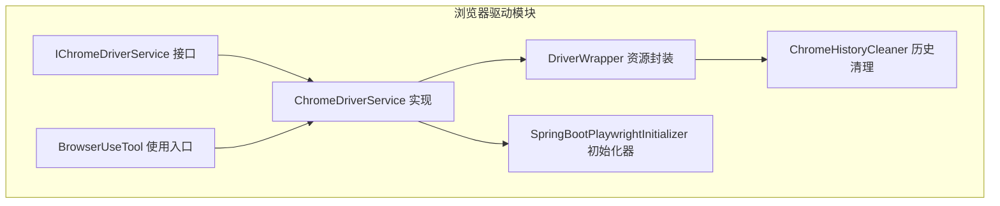
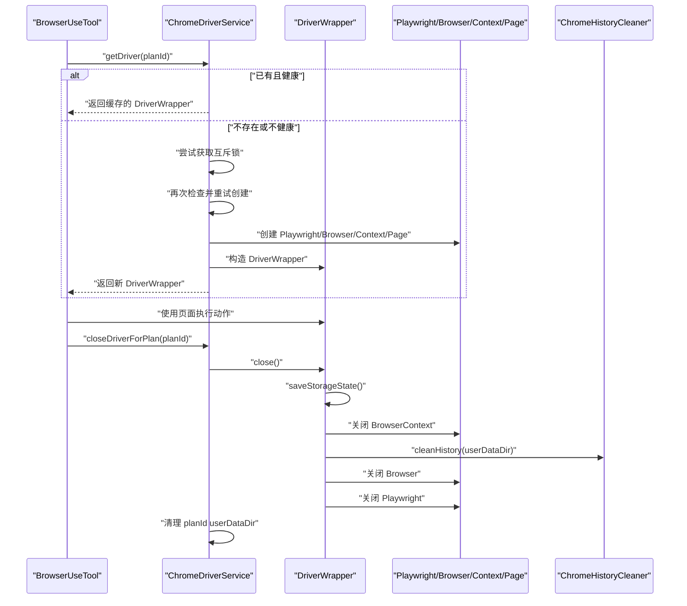
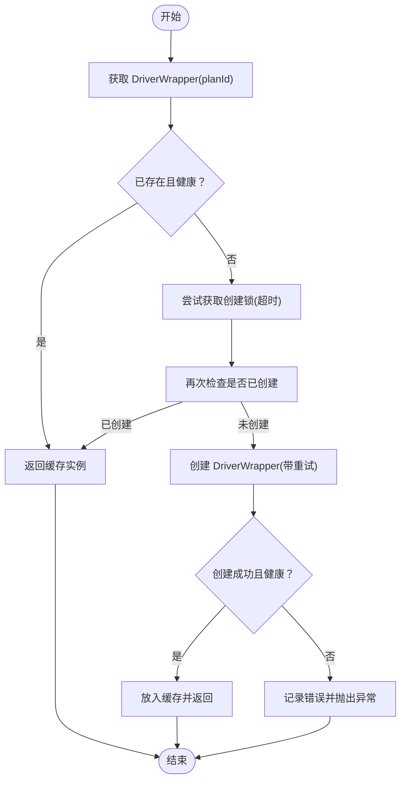
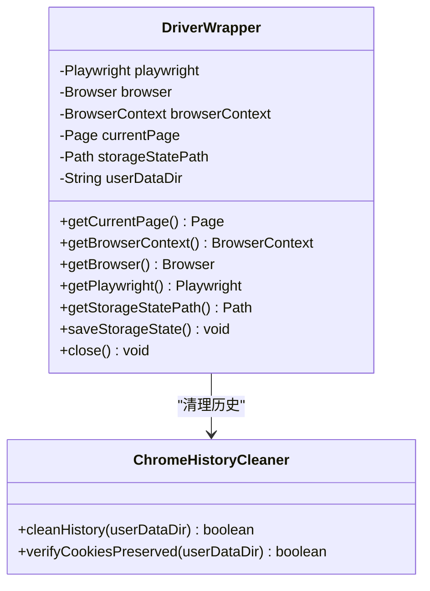
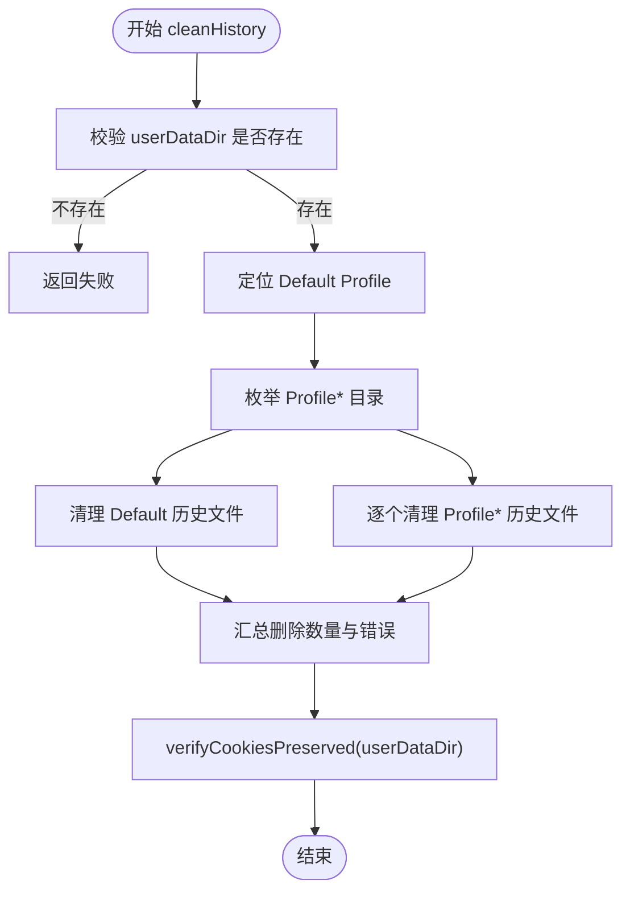
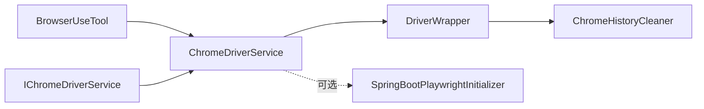

# 浏览器驱动管理

<cite>
**本文引用的文件列表**
- [ChromeDriverService.java](file://src/main/java/com/alibaba/cloud/ai/lynxe/tool/browser/ChromeDriverService.java)
- [IChromeDriverService.java](file://src/main/java/com/alibaba/cloud/ai/lynxe/tool/browser/IChromeDriverService.java)
- [DriverWrapper.java](file://src/main/java/com/alibaba/cloud/ai/lynxe/tool/browser/DriverWrapper.java)
- [ChromeHistoryCleaner.java](file://src/main/java/com/alibaba/cloud/ai/lynxe/tool/browser/ChromeHistoryCleaner.java)
- [SpringBootPlaywrightInitializer.java](file://src/main/java/com/alibaba/cloud/ai/lynxe/tool/browser/SpringBootPlaywrightInitializer.java)
- [BrowserUseTool.java](file://src/main/java/com/alibaba/cloud/ai/lynxe/tool/browser/BrowserUseTool.java)
</cite>

## 目录
1. [简介](#简介)
2. [项目结构](#项目结构)
3. [核心组件](#核心组件)
4. [架构总览](#架构总览)
5. [详细组件分析](#详细组件分析)
6. [依赖关系分析](#依赖关系分析)
7. [性能考量](#性能考量)
8. [故障排查指南](#故障排查指南)
9. [结论](#结论)

## 简介
本文件围绕浏览器驱动的全生命周期管理进行深入解析，重点覆盖以下方面：
- ChromeDriverService 如何通过 DriverWrapper 封装 Playwright 浏览器实例，实现创建、健康检查、资源回收等核心功能；
- ChromeHistoryCleaner 在任务完成后清理浏览历史和缓存的实现逻辑，确保系统资源的有效释放；
- IChromeDriverService 接口定义的服务契约，以及多实例并发访问时的线程安全处理策略；
- 性能优化建议：浏览器实例池化、连接复用和内存管理最佳实践。

## 项目结构
浏览器驱动相关代码位于工具模块的 browser 包内，主要包含服务接口、具体实现、资源封装、历史清理工具以及 Spring Boot 环境下的 Playwright 初始化器。

图表来源
- [ChromeDriverService.java](file://src/main/java/com/alibaba/cloud/ai/lynxe/tool/browser/ChromeDriverService.java#L1-L120)
- [IChromeDriverService.java](file://src/main/java/com/alibaba/cloud/ai/lynxe/tool/browser/IChromeDriverService.java#L1-L76)
- [DriverWrapper.java](file://src/main/java/com/alibaba/cloud/ai/lynxe/tool/browser/DriverWrapper.java#L1-L120)
- [ChromeHistoryCleaner.java](file://src/main/java/com/alibaba/cloud/ai/lynxe/tool/browser/ChromeHistoryCleaner.java#L1-L80)
- [SpringBootPlaywrightInitializer.java](file://src/main/java/com/alibaba/cloud/ai/lynxe/tool/browser/SpringBootPlaywrightInitializer.java#L1-L80)
- [BrowserUseTool.java](file://src/main/java/com/alibaba/cloud/ai/lynxe/tool/browser/BrowserUseTool.java#L1-L120)

章节来源
- [ChromeDriverService.java](file://src/main/java/com/alibaba/cloud/ai/lynxe/tool/browser/ChromeDriverService.java#L1-L120)
- [IChromeDriverService.java](file://src/main/java/com/alibaba/cloud/ai/lynxe/tool/browser/IChromeDriverService.java#L1-L76)

## 核心组件
- IChromeDriverService：定义浏览器驱动服务的契约，包括获取共享目录、按计划 ID 获取 DriverWrapper、关闭指定计划的驱动、全局清理、属性注入等。
- ChromeDriverService：实现 IChromeDriverService，负责：
  - 按 planId 缓存 DriverWrapper；
  - 健康检查与重试创建；
  - 并发控制（锁）；
  - 关闭与清理（含 userDataDir 清理）；
  - JVM 关闭钩子统一回收；
  - 通过 SpringBootPlaywrightInitializer 支持 Spring Boot 环境初始化。
- DriverWrapper：封装 Playwright 的 Playwright/Browser/BrowserContext/Page，提供：
  - 存储状态保存（storage-state.json）；
  - 严格关闭顺序：Context -> Browser -> Playwright；
  - 历史清理前置条件：先关闭 Context，再清理 userDataDir。
- ChromeHistoryCleaner：清理 Chrome 浏览器历史数据库文件，保留 Cookies 等关键数据，避免误删导致登录状态丢失。
- SpringBootPlaywrightInitializer：在 Spring Boot 环境下正确设置 Playwright 的运行环境与浏览器路径，避免打包后无法定位浏览器二进制的问题。
- BrowserUseTool：业务侧调用入口，通过 ChromeDriverService 获取 DriverWrapper 并执行各类浏览器操作。

章节来源
- [IChromeDriverService.java](file://src/main/java/com/alibaba/cloud/ai/lynxe/tool/browser/IChromeDriverService.java#L1-L76)
- [ChromeDriverService.java](file://src/main/java/com/alibaba/cloud/ai/lynxe/tool/browser/ChromeDriverService.java#L100-L232)
- [DriverWrapper.java](file://src/main/java/com/alibaba/cloud/ai/lynxe/tool/browser/DriverWrapper.java#L120-L286)
- [ChromeHistoryCleaner.java](file://src/main/java/com/alibaba/cloud/ai/lynxe/tool/browser/ChromeHistoryCleaner.java#L1-L120)
- [SpringBootPlaywrightInitializer.java](file://src/main/java/com/alibaba/cloud/ai/lynxe/tool/browser/SpringBootPlaywrightInitializer.java#L1-L120)
- [BrowserUseTool.java](file://src/main/java/com/alibaba/cloud/ai/lynxe/tool/browser/BrowserUseTool.java#L70-L120)

## 架构总览
ChromeDriverService 作为中心协调者，结合 DriverWrapper 对 Playwright 资源进行统一封装与生命周期管理；ChromeHistoryCleaner 仅在关闭流程中按约定时机执行，确保历史文件被清理且 Cookies 不受影响；SpringBootPlaywrightInitializer 保障在 Spring Boot 打包场景下 Playwright 正常初始化。

图表来源
- [BrowserUseTool.java](file://src/main/java/com/alibaba/cloud/ai/lynxe/tool/browser/BrowserUseTool.java#L79-L120)
- [ChromeDriverService.java](file://src/main/java/com/alibaba/cloud/ai/lynxe/tool/browser/ChromeDriverService.java#L105-L178)
- [DriverWrapper.java](file://src/main/java/com/alibaba/cloud/ai/lynxe/tool/browser/DriverWrapper.java#L169-L286)
- [ChromeHistoryCleaner.java](file://src/main/java/com/alibaba/cloud/ai/lynxe/tool/browser/ChromeHistoryCleaner.java#L68-L132)

## 详细组件分析

### ChromeDriverService：浏览器驱动全生命周期管理
- 角色与职责
  - 以 planId 为键缓存 DriverWrapper，支持健康检查与自动重建；
  - 提供创建重试、并发锁保护、JVM 关闭钩子统一回收；
  - 通过 SpringBootPlaywrightInitializer 支持 Spring Boot 环境；
  - 为每个 planId 分配独立 userDataDir，便于历史清理与隔离。
- 关键流程
  - 获取驱动：先查缓存并健康检查，不健康则移除并重建；若仍失败则加锁重试并最多重试若干次；
  - 健康检查：验证浏览器连接、上下文有效性、当前页可用性，并进行一次简单评估；
  - 创建实例：设置 Playwright 运行参数、选择浏览器类型、配置启动参数（禁用背景网络、扩展、同步等）、按需加载 storage-state.json、创建持久化上下文；
  - 关闭与清理：移除缓存项、关闭 DriverWrapper、删除 planId 特定 userDataDir；
  - 全局清理：JVM 关闭钩子触发，遍历并关闭所有 DriverWrapper。
- 线程安全
  - 使用可重入锁保护驱动创建过程，避免并发重复创建；
  - 使用并发哈希表存储 DriverWrapper，保证多实例并发访问时的可见性与一致性。

图表来源
- [ChromeDriverService.java](file://src/main/java/com/alibaba/cloud/ai/lynxe/tool/browser/ChromeDriverService.java#L105-L178)
- [ChromeDriverService.java](file://src/main/java/com/alibaba/cloud/ai/lynxe/tool/browser/ChromeDriverService.java#L234-L284)
- [ChromeDriverService.java](file://src/main/java/com/alibaba/cloud/ai/lynxe/tool/browser/ChromeDriverService.java#L302-L351)

章节来源
- [ChromeDriverService.java](file://src/main/java/com/alibaba/cloud/ai/lynxe/tool/browser/ChromeDriverService.java#L105-L232)
- [ChromeDriverService.java](file://src/main/java/com/alibaba/cloud/ai/lynxe/tool/browser/ChromeDriverService.java#L234-L351)
- [ChromeDriverService.java](file://src/main/java/com/alibaba/cloud/ai/lynxe/tool/browser/ChromeDriverService.java#L353-L516)
- [ChromeDriverService.java](file://src/main/java/com/alibaba/cloud/ai/lynxe/tool/browser/ChromeDriverService.java#L516-L858)
- [ChromeDriverService.java](file://src/main/java/com/alibaba/cloud/ai/lynxe/tool/browser/ChromeDriverService.java#L860-L911)

### DriverWrapper：Playwright 资源封装与关闭顺序
- 设计要点
  - 严格遵循关闭顺序：BrowserContext -> Browser -> Playwright，确保事件正确收尾与资源释放；
  - 通过 storage-state.json 保存 Cookies、localStorage、sessionStorage 等状态，避免每次重新登录；
  - 在关闭前异步保存 storage-state，设置超时避免阻塞；
  - 历史清理在关闭 Context 后进行，确保历史文件未被锁定。
- 关闭流程
  - 保存 storage-state；
  - 关闭 BrowserContext；
  - 清理 userDataDir 中的历史文件；
  - 关闭 Browser；
  - 关闭 Playwright。

图表来源
- [DriverWrapper.java](file://src/main/java/com/alibaba/cloud/ai/lynxe/tool/browser/DriverWrapper.java#L1-L120)
- [DriverWrapper.java](file://src/main/java/com/alibaba/cloud/ai/lynxe/tool/browser/DriverWrapper.java#L169-L286)
- [ChromeHistoryCleaner.java](file://src/main/java/com/alibaba/cloud/ai/lynxe/tool/browser/ChromeHistoryCleaner.java#L68-L132)

章节来源
- [DriverWrapper.java](file://src/main/java/com/alibaba/cloud/ai/lynxe/tool/browser/DriverWrapper.java#L120-L286)

### ChromeHistoryCleaner：历史与缓存清理
- 目标
  - 清理 Chrome 浏览器历史数据库文件（History、History-journal、History Provider Cache、History Index 等），同时保留 Cookies 等关键数据；
  - 支持多 Profile 目录清理；
  - 提供清理后 Cookies 存在性校验。
- 行为
  - 遍历默认 Profile(Default) 及其他 Profile 目录；
  - 删除匹配的历史文件/目录；
  - 递归删除目录；
  - 记录删除数量与错误信息；
  - 返回清理结果。

图表来源
- [ChromeHistoryCleaner.java](file://src/main/java/com/alibaba/cloud/ai/lynxe/tool/browser/ChromeHistoryCleaner.java#L68-L132)
- [ChromeHistoryCleaner.java](file://src/main/java/com/alibaba/cloud/ai/lynxe/tool/browser/ChromeHistoryCleaner.java#L134-L212)
- [ChromeHistoryCleaner.java](file://src/main/java/com/alibaba/cloud/ai/lynxe/tool/browser/ChromeHistoryCleaner.java#L214-L237)

章节来源
- [ChromeHistoryCleaner.java](file://src/main/java/com/alibaba/cloud/ai/lynxe/tool/browser/ChromeHistoryCleaner.java#L1-L237)

### IChromeDriverService 接口：服务契约与并发安全
- 服务契约
  - 获取共享目录；
  - 按 planId 获取 DriverWrapper；
  - 关闭指定 plan 的驱动；
  - 全局清理；
  - 注入/获取 LynxeProperties、内部存储服务、统一目录管理器。
- 并发安全
  - ChromeDriverService 内部使用 ReentrantLock 保护创建过程；
  - 使用 ConcurrentHashMap 存储 DriverWrapper，保证多实例并发访问时的可见性；
  - 健康检查与重建逻辑避免竞态条件下重复创建。

章节来源
- [IChromeDriverService.java](file://src/main/java/com/alibaba/cloud/ai/lynxe/tool/browser/IChromeDriverService.java#L1-L76)
- [ChromeDriverService.java](file://src/main/java/com/alibaba/cloud/ai/lynxe/tool/browser/ChromeDriverService.java#L105-L178)

### SpringBootPlaywrightInitializer：Spring Boot 环境初始化
- 目标
  - 在 Spring Boot 打包环境下正确设置 Playwright 的浏览器路径与临时目录；
  - 切换线程上下文 ClassLoader，避免 Playwright 初始化失败；
  - 检测浏览器二进制是否存在，必要时跳过下载或提示首次使用。
- 行为
  - 设置 playwright.browsers.path 与 playwright.driver.tmpdir；
  - 检查浏览器目录与可读性；
  - 记录调试信息并返回 Playwright 实例。

章节来源
- [SpringBootPlaywrightInitializer.java](file://src/main/java/com/alibaba/cloud/ai/lynxe/tool/browser/SpringBootPlaywrightInitializer.java#L1-L198)

### BrowserUseTool：业务侧使用入口
- 角色
  - 通过 ChromeDriverService 获取 DriverWrapper；
  - 执行导航、点击、输入、截图、滚动、标签切换等动作；
  - 统一超时与重试策略；
  - 在清理阶段调用 ChromeDriverService.closeDriverForPlan(planId)。
- 与驱动服务协作
  - 在执行动作前进行驱动可用性校验；
  - 在工具生命周期末尾主动清理资源。

章节来源
- [BrowserUseTool.java](file://src/main/java/com/alibaba/cloud/ai/lynxe/tool/browser/BrowserUseTool.java#L79-L120)
- [BrowserUseTool.java](file://src/main/java/com/alibaba/cloud/ai/lynxe/tool/browser/BrowserUseTool.java#L124-L290)
- [BrowserUseTool.java](file://src/main/java/com/alibaba/cloud/ai/lynxe/tool/browser/BrowserUseTool.java#L351-L400)
- [BrowserUseTool.java](file://src/main/java/com/alibaba/cloud/ai/lynxe/tool/browser/BrowserUseTool.java#L634-L653)

## 依赖关系分析
- 组件耦合
  - BrowserUseTool 依赖 ChromeDriverService 获取 DriverWrapper；
  - ChromeDriverService 依赖 DriverWrapper 管理 Playwright 生命周期；
  - DriverWrapper 依赖 ChromeHistoryCleaner 执行历史清理；
  - ChromeDriverService 可选依赖 SpringBootPlaywrightInitializer；
  - IChromeDriverService 为上层抽象契约，降低耦合度。
- 外部依赖
  - Playwright（Browser/BrowserContext/Page/Playwright）；
  - Spring（上下文、Bean、注解）；
  - Jackson（JSON 解析 storage-state）；
  - 文件系统（userDataDir、storage-state.json、历史文件）。

图表来源
- [BrowserUseTool.java](file://src/main/java/com/alibaba/cloud/ai/lynxe/tool/browser/BrowserUseTool.java#L79-L120)
- [ChromeDriverService.java](file://src/main/java/com/alibaba/cloud/ai/lynxe/tool/browser/ChromeDriverService.java#L105-L178)
- [DriverWrapper.java](file://src/main/java/com/alibaba/cloud/ai/lynxe/tool/browser/DriverWrapper.java#L169-L286)
- [ChromeHistoryCleaner.java](file://src/main/java/com/alibaba/cloud/ai/lynxe/tool/browser/ChromeHistoryCleaner.java#L68-L132)
- [SpringBootPlaywrightInitializer.java](file://src/main/java/com/alibaba/cloud/ai/lynxe/tool/browser/SpringBootPlaywrightInitializer.java#L1-L120)
- [IChromeDriverService.java](file://src/main/java/com/alibaba/cloud/ai/lynxe/tool/browser/IChromeDriverService.java#L1-L76)

## 性能考量
- 实例池化与复用
  - 当前实现按 planId 缓存单个 DriverWrapper，适合多计划并行但每个计划独立浏览器的场景；
  - 若需要更高吞吐，可在业务层引入“计划组”维度的池化策略，减少频繁启动/关闭开销。
- 连接复用
  - 使用持久化上下文（persistent context）与 storage-state.json，避免每次重新登录；
  - 页面级复用：同一上下文内复用 Page，减少上下文切换成本。
- 内存管理
  - 启动参数限制 JS 堆大小，防止 OOM；
  - 禁用不必要的后台网络与扩展，降低内存占用；
  - 合理设置超时，避免长时间挂起导致资源堆积。
- I/O 与清理
  - 关闭顺序严格遵循 Context -> Browser -> Playwright，确保 I/O 线程正确终止；
  - 历史清理在 Context 关闭后进行，避免文件锁定问题。

章节来源
- [ChromeDriverService.java](file://src/main/java/com/alibaba/cloud/ai/lynxe/tool/browser/ChromeDriverService.java#L443-L516)
- [DriverWrapper.java](file://src/main/java/com/alibaba/cloud/ai/lynxe/tool/browser/DriverWrapper.java#L169-L286)

## 故障排查指南
- 浏览器初始化失败
  - 检查浏览器二进制是否存在与可读；
  - 在 Spring Boot 环境下确认 Playwright 初始化器是否生效；
  - 查看日志中的浏览器路径与临时目录配置。
- 驱动获取超时或锁等待
  - 检查是否长时间持有锁；
  - 调整创建重试次数与延迟；
  - 确认 JVM 关闭钩子是否正常触发，避免进程僵死。
- 页面不可用或崩溃
  - 健康检查会检测浏览器连接、上下文与页面状态；
  - 监听浏览器断开事件，及时移除失效驱动；
  - 出现崩溃时，清理 userDataDir 并重建驱动。
- 历史清理失败
  - 确保 Context 已关闭后再清理；
  - 检查目标文件是否存在与权限；
  - 使用 Cookies 校验方法确认关键数据未被误删。

章节来源
- [SpringBootPlaywrightInitializer.java](file://src/main/java/com/alibaba/cloud/ai/lynxe/tool/browser/SpringBootPlaywrightInitializer.java#L104-L178)
- [ChromeDriverService.java](file://src/main/java/com/alibaba/cloud/ai/lynxe/tool/browser/ChromeDriverService.java#L105-L178)
- [ChromeDriverService.java](file://src/main/java/com/alibaba/cloud/ai/lynxe/tool/browser/ChromeDriverService.java#L302-L351)
- [ChromeHistoryCleaner.java](file://src/main/java/com/alibaba/cloud/ai/lynxe/tool/browser/ChromeHistoryCleaner.java#L68-L132)

## 结论
该实现通过 ChromeDriverService + DriverWrapper + ChromeHistoryCleaner 的组合，构建了稳定可靠的浏览器驱动生命周期管理体系。其关键优势在于：
- 明确的健康检查与重试机制；
- 严格的资源关闭顺序与历史清理策略；
- Spring Boot 环境下的可靠初始化；
- 通过 storage-state.json 实现状态持久化，兼顾性能与用户体验。

在高并发与大规模任务场景下，建议进一步引入池化与连接复用策略，配合合理的超时与重试配置，持续优化资源利用率与稳定性。