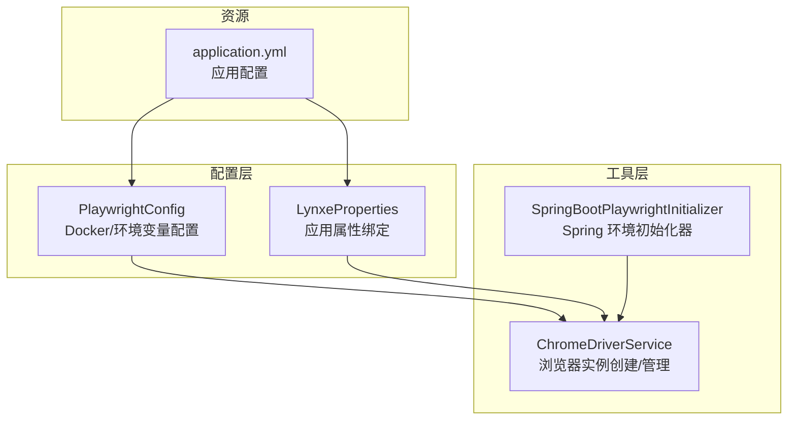
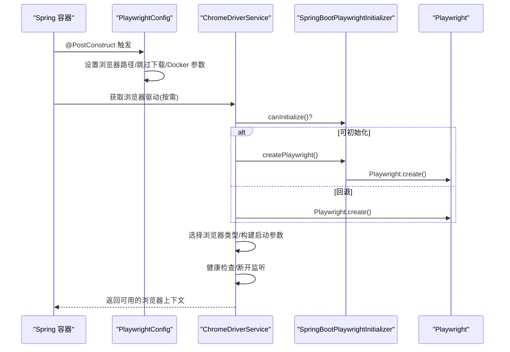
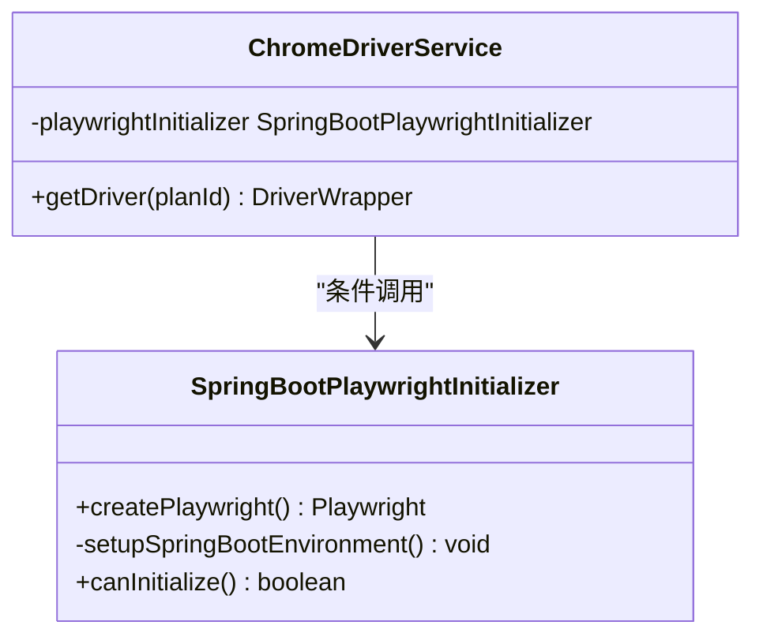
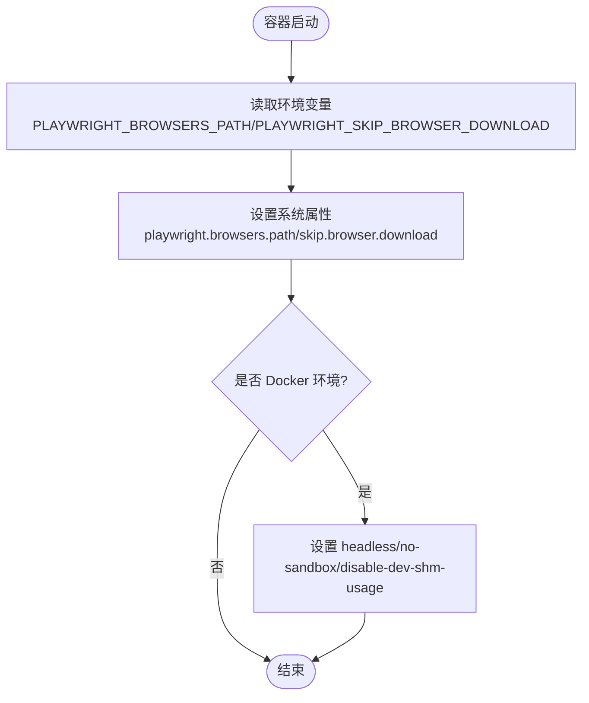
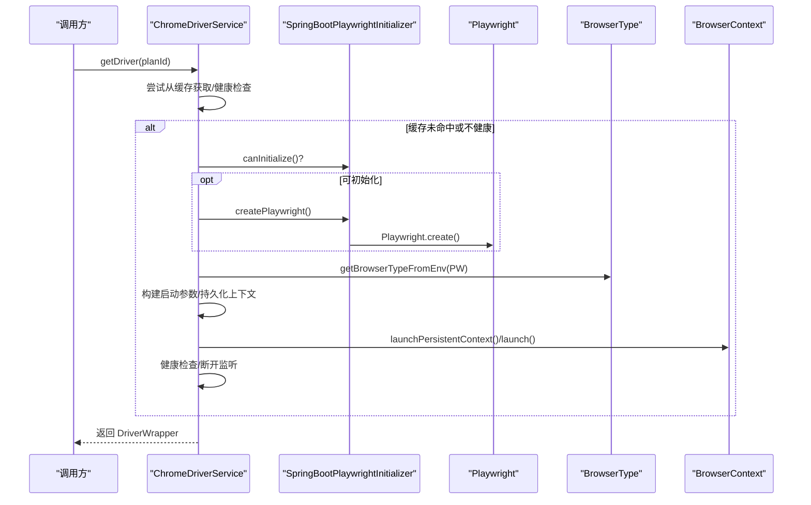
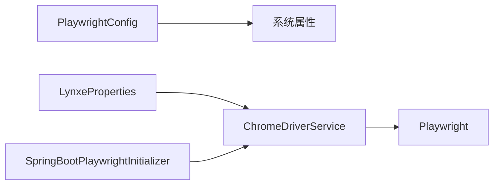

# 系统初始化流程

<cite>
**本文引用的文件列表**
- [SpringBootPlaywrightInitializer.java](file://src/main/java/com/alibaba/cloud/ai/lynxe/tool/browser/SpringBootPlaywrightInitializer.java)
- [ChromeDriverService.java](file://src/main/java/com/alibaba/cloud/ai/lynxe/tool/browser/ChromeDriverService.java)
- [PlaywrightConfig.java](file://src/main/java/com/alibaba/cloud/ai/lynxe/config/PlaywrightConfig.java)
- [LynxeProperties.java](file://src/main/java/com/alibaba/cloud/ai/lynxe/config/LynxeProperties.java)
- [application.yml](file://src/main/resources/application.yml)
</cite>

## 目录
1. [引言](#引言)
2. [项目结构](#项目结构)
3. [核心组件](#核心组件)
4. [架构总览](#架构总览)
5. [详细组件分析](#详细组件分析)
6. [依赖关系分析](#依赖关系分析)
7. [性能考量](#性能考量)
8. [故障排查指南](#故障排查指南)
9. [结论](#结论)

## 引言
本文件围绕 Spring Boot 应用启动过程中 Playwright 初始化流程展开，重点解析 SpringBootPlaywrightInitializer 在 Spring 环境下的初始化职责、与 PlaywrightConfig 的协作、以及 ChromeDriverService 如何读取 LynxeProperties 配置并构建浏览器运行时。文档同时覆盖错误处理与重试策略、与 Spring 生命周期的集成点（如可初始化能力检测）、以及关键配置项（headless、viewport、用户代理、服务工作线程等）对自动化行为的影响。

## 项目结构
与 Playwright 初始化直接相关的模块位于工具层与配置层：
- 工具层：browser 子包提供浏览器驱动与 Playwright 初始化支持
- 配置层：config 子包提供 Playwright 环境配置与应用属性绑定

图表来源
- [PlaywrightConfig.java](file://src/main/java/com/alibaba/cloud/ai/lynxe/config/PlaywrightConfig.java#L37-L77)
- [LynxeProperties.java](file://src/main/java/com/alibaba/cloud/ai/lynxe/config/LynxeProperties.java#L34-L51)
- [SpringBootPlaywrightInitializer.java](file://src/main/java/com/alibaba/cloud/ai/lynxe/tool/browser/SpringBootPlaywrightInitializer.java#L40-L79)
- [ChromeDriverService.java](file://src/main/java/com/alibaba/cloud/ai/lynxe/tool/browser/ChromeDriverService.java#L358-L401)
- [application.yml](file://src/main/resources/application.yml#L1-L98)

章节来源
- [PlaywrightConfig.java](file://src/main/java/com/alibaba/cloud/ai/lynxe/config/PlaywrightConfig.java#L37-L77)
- [LynxeProperties.java](file://src/main/java/com/alibaba/cloud/ai/lynxe/config/LynxeProperties.java#L34-L51)
- [SpringBootPlaywrightInitializer.java](file://src/main/java/com/alibaba/cloud/ai/lynxe/tool/browser/SpringBootPlaywrightInitializer.java#L40-L79)
- [ChromeDriverService.java](file://src/main/java/com/alibaba/cloud/ai/lynxe/tool/browser/ChromeDriverService.java#L358-L401)
- [application.yml](file://src/main/resources/application.yml#L1-L98)

## 核心组件
- SpringBootPlaywrightInitializer：负责在 Spring Boot 环境下为 Playwright 设置正确的类加载器与运行时路径，并判断是否具备初始化条件。
- PlaywrightConfig：在容器启动阶段根据环境变量与 Docker 检测设置 Playwright 的浏览器路径、跳过下载标志及容器安全参数。
- LynxeProperties：提供应用级配置读取入口，其中包含 headless 等浏览器相关开关。
- ChromeDriverService：实际创建 Playwright 实例、选择浏览器类型、配置启动参数（含 viewport、user agent、locale、service worker 策略、headless 模式等），并进行健康检查与异常处理。

章节来源
- [SpringBootPlaywrightInitializer.java](file://src/main/java/com/alibaba/cloud/ai/lynxe/tool/browser/SpringBootPlaywrightInitializer.java#L40-L79)
- [PlaywrightConfig.java](file://src/main/java/com/alibaba/cloud/ai/lynxe/config/PlaywrightConfig.java#L37-L77)
- [LynxeProperties.java](file://src/main/java/com/alibaba/cloud/ai/lynxe/config/LynxeProperties.java#L34-L51)
- [ChromeDriverService.java](file://src/main/java/com/alibaba/cloud/ai/lynxe/tool/browser/ChromeDriverService.java#L358-L401)

## 架构总览
Spring Boot 启动时，Playwright 初始化链路如下：
- PlaywrightConfig 在 @PostConstruct 阶段设置浏览器路径、跳过下载标志与 Docker 安全参数；
- ChromeDriverService 在获取浏览器驱动时，优先通过 SpringBootPlaywrightInitializer 创建 Playwright 实例（若可用），否则回退标准初始化；
- ChromeDriverService 依据 LynxeProperties 与内置逻辑组合浏览器启动参数，包括 headless、viewport、locale、service workers 等；
- 初始化完成后，ChromeDriverService 对浏览器连接与上下文进行健康检查，并注册断开监听以提升稳定性。

图表来源
- [PlaywrightConfig.java](file://src/main/java/com/alibaba/cloud/ai/lynxe/config/PlaywrightConfig.java#L37-L77)
- [ChromeDriverService.java](file://src/main/java/com/alibaba/cloud/ai/lynxe/tool/browser/ChromeDriverService.java#L358-L401)
- [SpringBootPlaywrightInitializer.java](file://src/main/java/com/alibaba/cloud/ai/lynxe/tool/browser/SpringBootPlaywrightInitializer.java#L40-L79)

## 详细组件分析

### SpringBootPlaywrightInitializer 分析
- 职责与目标
  - 在 Spring Boot 打包后的类加载环境下，为 Playwright 正确设置运行时路径与类加载器，避免资源定位失败。
  - 判断当前环境是否满足 Playwright 初始化条件（类路径是否存在 Playwright 类）。
- 关键流程
  - setupSpringBootEnvironment：设置 playwright.browsers.path 与 playwright.driver.tmpdir；检测浏览器缓存目录是否存在并标记跳过下载；打印调试信息。
  - createPlaywright：切换到当前类的 ClassLoader，调用 Playwright.create()，随后恢复原始 ClassLoader；捕获异常并抛出统一错误。
  - canInitialize：尝试加载 Playwright 类，返回是否可初始化。
- 错误处理
  - 初始化失败或异常均记录日志并包装为运行时异常，便于上层捕获与降级。
- 与 Spring 生命周期的关系
  - 该类本身不实现 ApplicationRunner 接口；其作用是被 ChromeDriverService 条件调用，从而在需要时完成 Playwright 初始化。

图表来源
- [SpringBootPlaywrightInitializer.java](file://src/main/java/com/alibaba/cloud/ai/lynxe/tool/browser/SpringBootPlaywrightInitializer.java#L40-L79)
- [ChromeDriverService.java](file://src/main/java/com/alibaba/cloud/ai/lynxe/tool/browser/ChromeDriverService.java#L66-L70)

章节来源
- [SpringBootPlaywrightInitializer.java](file://src/main/java/com/alibaba/cloud/ai/lynxe/tool/browser/SpringBootPlaywrightInitializer.java#L40-L79)
- [SpringBootPlaywrightInitializer.java](file://src/main/java/com/alibaba/cloud/ai/lynxe/tool/browser/SpringBootPlaywrightInitializer.java#L81-L110)
- [SpringBootPlaywrightInitializer.java](file://src/main/java/com/alibaba/cloud/ai/lynxe/tool/browser/SpringBootPlaywrightInitializer.java#L182-L197)

### PlaywrightConfig 分析
- 职责与目标
  - 在容器启动阶段根据环境变量 PLAYWRIGHT_BROWSERS_PATH 与 PLAYWRIGHT_SKIP_BROWSER_DOWNLOAD 设置 Playwright 的浏览器路径与下载策略；
  - 在 Docker 环境下设置 headless、无沙箱、共享内存等参数，提升容器内稳定性。
- 关键流程
  - @PostConstruct 中读取环境变量，设置系统属性；
  - isDockerEnvironment：通过 DOCKER_ENV、/.dockerenv、/proc/1/cgroup 等方式判断容器环境；
  - findAndLogChromiumInstallation/searchForChromiumExecutable：扫描并输出已安装浏览器信息。
- 与 Spring 生命周期的关系
  - 作为 @Configuration，在容器启动早期执行，为后续浏览器初始化提供全局配置。

图表来源
- [PlaywrightConfig.java](file://src/main/java/com/alibaba/cloud/ai/lynxe/config/PlaywrightConfig.java#L37-L77)
- [PlaywrightConfig.java](file://src/main/java/com/alibaba/cloud/ai/lynxe/config/PlaywrightConfig.java#L120-L147)

章节来源
- [PlaywrightConfig.java](file://src/main/java/com/alibaba/cloud/ai/lynxe/config/PlaywrightConfig.java#L37-L77)
- [PlaywrightConfig.java](file://src/main/java/com/alibaba/cloud/ai/lynxe/config/PlaywrightConfig.java#L120-L147)

### ChromeDriverService 初始化流程分析
- 调用链与时机
  - 当业务需要浏览器驱动时，ChromeDriverService.getDriver(planId) 被调用；
  - 若存在 SpringBootPlaywrightInitializer 且 canInitialize() 为真，则优先使用其 createPlaywright()；
  - 否则回退至 Playwright.create()。
- 浏览器类型与启动参数
  - getBrowserTypeFromEnv：从环境变量 BROWSER 选择 chromium/webkit/firefox，默认 chromium；
  - 启动参数构建：包含 user agent、语言、禁用 service workers、禁用背景网络请求、窗口大小、headless 模式（来自 LynxeProperties）、超时等；
  - persistent context：为每个 planId 提供独立 userDataDir，便于历史清理与多实例隔离。
- 健康检查与断开监听
  - isDriverHealthy：检查浏览器连接、上下文有效性与页面可访问性；
  - 注册 onDisconnected 监听，一旦断开则移除对应 planId 的驱动，避免脏状态。
- 错误处理与重试
  - 初始化阶段对 PlaywrightException 与通用异常进行捕获并抛出运行时异常；
  - getDriver 内部使用锁与超时控制，超过时限抛出异常；
  - 对 userDataDir 创建失败等情况提供回退路径（regular launch）。

图表来源
- [ChromeDriverService.java](file://src/main/java/com/alibaba/cloud/ai/lynxe/tool/browser/ChromeDriverService.java#L105-L157)
- [ChromeDriverService.java](file://src/main/java/com/alibaba/cloud/ai/lynxe/tool/browser/ChromeDriverService.java#L358-L401)
- [ChromeDriverService.java](file://src/main/java/com/alibaba/cloud/ai/lynxe/tool/browser/ChromeDriverService.java#L517-L660)
- [ChromeDriverService.java](file://src/main/java/com/alibaba/cloud/ai/lynxe/tool/browser/ChromeDriverService.java#L662-L700)
- [SpringBootPlaywrightInitializer.java](file://src/main/java/com/alibaba/cloud/ai/lynxe/tool/browser/SpringBootPlaywrightInitializer.java#L40-L79)

章节来源
- [ChromeDriverService.java](file://src/main/java/com/alibaba/cloud/ai/lynxe/tool/browser/ChromeDriverService.java#L105-L157)
- [ChromeDriverService.java](file://src/main/java/com/alibaba/cloud/ai/lynxe/tool/browser/ChromeDriverService.java#L358-L401)
- [ChromeDriverService.java](file://src/main/java/com/alibaba/cloud/ai/lynxe/tool/browser/ChromeDriverService.java#L517-L660)
- [ChromeDriverService.java](file://src/main/java/com/alibaba/cloud/ai/lynxe/tool/browser/ChromeDriverService.java#L662-L700)
- [ChromeDriverService.java](file://src/main/java/com/alibaba/cloud/ai/lynxe/tool/browser/ChromeDriverService.java#L860-L896)

### 关键配置项与行为影响
- headless 模式
  - 来源：LynxeProperties.lynxe.browser.headless；
  - 影响：决定浏览器是否以无头模式启动，影响自动化脚本在容器环境下的稳定性与性能。
- viewport 尺寸
  - 默认值：1920x1080；
  - 影响：页面渲染一致性、截图尺寸与元素定位准确性。
- user agent 与 locale
  - user agent：随机选择多个 UA，降低被识别为自动化风险；
  - locale：zh-CN，影响页面语言与本地化行为。
- service workers 策略
  - BLOCK：禁用后台网络请求，减少启动时不必要的网络活动，提高启动速度与稳定性。
- 启动参数优化
  - 禁用扩展、通知、同步、翻译、组件更新等，减少背景任务与崩溃风险；
  - macOS 特定参数：禁用软件光栅化、加速视频解码等，降低崩溃概率。
- 存储状态（cookies/localStorage）
  - 支持从共享 storage-state.json 加载，实现跨实例会话复用与历史清理。

章节来源
- [LynxeProperties.java](file://src/main/java/com/alibaba/cloud/ai/lynxe/config/LynxeProperties.java#L34-L51)
- [ChromeDriverService.java](file://src/main/java/com/alibaba/cloud/ai/lynxe/tool/browser/ChromeDriverService.java#L517-L660)
- [ChromeDriverService.java](file://src/main/java/com/alibaba/cloud/ai/lynxe/tool/browser/ChromeDriverService.java#L662-L700)

## 依赖关系分析
- 组件耦合
  - ChromeDriverService 通过 @Autowired 注入 SpringBootPlaywrightInitializer（可选），用于在 Spring 环境下更稳健地初始化 Playwright；
  - ChromeDriverService 依赖 LynxeProperties 获取 headless 等配置；
  - PlaywrightConfig 为全局配置，影响 Playwright 的浏览器路径与下载策略。
- 外部依赖
  - Playwright SDK；
  - Spring 容器生命周期（@PostConstruct、@PreDestroy）。

图表来源
- [PlaywrightConfig.java](file://src/main/java/com/alibaba/cloud/ai/lynxe/config/PlaywrightConfig.java#L37-L77)
- [LynxeProperties.java](file://src/main/java/com/alibaba/cloud/ai/lynxe/config/LynxeProperties.java#L34-L51)
- [SpringBootPlaywrightInitializer.java](file://src/main/java/com/alibaba/cloud/ai/lynxe/tool/browser/SpringBootPlaywrightInitializer.java#L40-L79)
- [ChromeDriverService.java](file://src/main/java/com/alibaba/cloud/ai/lynxe/tool/browser/ChromeDriverService.java#L358-L401)

章节来源
- [ChromeDriverService.java](file://src/main/java/com/alibaba/cloud/ai/lynxe/tool/browser/ChromeDriverService.java#L66-L70)
- [ChromeDriverService.java](file://src/main/java/com/alibaba/cloud/ai/lynxe/tool/browser/ChromeDriverService.java#L358-L401)
- [PlaywrightConfig.java](file://src/main/java/com/alibaba/cloud/ai/lynxe/config/PlaywrightConfig.java#L37-L77)
- [LynxeProperties.java](file://src/main/java/com/alibaba/cloud/ai/lynxe/config/LynxeProperties.java#L34-L51)

## 性能考量
- 启动优化
  - 禁用 service workers 与背景网络请求，显著缩短首次启动时间；
  - 使用 persistent context 并为每个 planId 提供独立 userDataDir，避免锁争用与 profile 占用。
- 资源管理
  - 注册 JVM shutdown hook 与 @PreDestroy 清理，确保进程与文件句柄释放；
  - 健康检查与断开监听，及时回收异常实例，避免资源泄漏。
- 容器友好
  - Docker 环境下设置 headless、无沙箱、禁用共享内存限制等参数，提升容器内稳定性与兼容性。

[本节为通用指导，无需列出具体文件来源]

## 故障排查指南
- Playwright 初始化失败
  - 现象：抛出 PlaywrightException 或通用异常；
  - 排查：确认浏览器缓存目录存在、类加载器切换成功、环境变量设置正确；
  - 参考路径：[ChromeDriverService.java](file://src/main/java/com/alibaba/cloud/ai/lynxe/tool/browser/ChromeDriverService.java#L371-L401)、[SpringBootPlaywrightInitializer.java](file://src/main/java/com/alibaba/cloud/ai/lynxe/tool/browser/SpringBootPlaywrightInitializer.java#L40-L79)。
- 浏览器类型选择异常
  - 现象：getBrowserTypeFromEnv 抛错；
  - 排查：检查环境变量 BROWSER 是否为 chromium/webkit/firefox；
  - 参考路径：[ChromeDriverService.java](file://src/main/java/com/alibaba/cloud/ai/lynxe/tool/browser/ChromeDriverService.java#L860-L896)。
- headless 模式不符合预期
  - 现象：headless 与期望不符；
  - 排查：确认 LynxeProperties.lynxe.browser.headless 的值与默认值；
  - 参考路径：[LynxeProperties.java](file://src/main/java/com/alibaba/cloud/ai/lynxe/config/LynxeProperties.java#L34-L51)、[ChromeDriverService.java](file://src/main/java/com/alibaba/cloud/ai/lynxe/tool/browser/ChromeDriverService.java#L537-L546)。
- 容器内崩溃或启动缓慢
  - 现象：容器内启动慢或崩溃；
  - 排查：确认 PlaywrightConfig 是否检测到 Docker 环境并设置了相应参数；
  - 参考路径：[PlaywrightConfig.java](file://src/main/java/com/alibaba/cloud/ai/lynxe/config/PlaywrightConfig.java#L67-L77)、[PlaywrightConfig.java](file://src/main/java/com/alibaba/cloud/ai/lynxe/config/PlaywrightConfig.java#L120-L147)。
- 断开监听与资源回收
  - 现象：浏览器断开后仍占用资源；
  - 排查：确认 onDisconnected 监听已注册，且缓存中对应 planId 的驱动已被移除；
  - 参考路径：[ChromeDriverService.java](file://src/main/java/com/alibaba/cloud/ai/lynxe/tool/browser/ChromeDriverService.java#L672-L684)。

章节来源
- [ChromeDriverService.java](file://src/main/java/com/alibaba/cloud/ai/lynxe/tool/browser/ChromeDriverService.java#L371-L401)
- [ChromeDriverService.java](file://src/main/java/com/alibaba/cloud/ai/lynxe/tool/browser/ChromeDriverService.java#L537-L546)
- [ChromeDriverService.java](file://src/main/java/com/alibaba/cloud/ai/lynxe/tool/browser/ChromeDriverService.java#L672-L684)
- [PlaywrightConfig.java](file://src/main/java/com/alibaba/cloud/ai/lynxe/config/PlaywrightConfig.java#L67-L77)
- [PlaywrightConfig.java](file://src/main/java/com/alibaba/cloud/ai/lynxe/config/PlaywrightConfig.java#L120-L147)
- [LynxeProperties.java](file://src/main/java/com/alibaba/cloud/ai/lynxe/config/LynxeProperties.java#L34-L51)

## 结论
SpringBootPlaywrightInitializer 通过在 Spring Boot 环境下设置正确的类加载器与运行时路径，确保 Playwright 能在打包后的应用中稳定初始化。PlaywrightConfig 在容器启动阶段提供全局配置，使浏览器路径与下载策略符合部署环境。ChromeDriverService 则在运行期综合应用配置与启动参数，构建高性能、稳定的浏览器运行时，并通过健康检查与断开监听保障系统可靠性。整体设计体现了“启动期配置 + 运行期优化”的双层保障思路，适合在容器化与高并发场景下稳定运行。