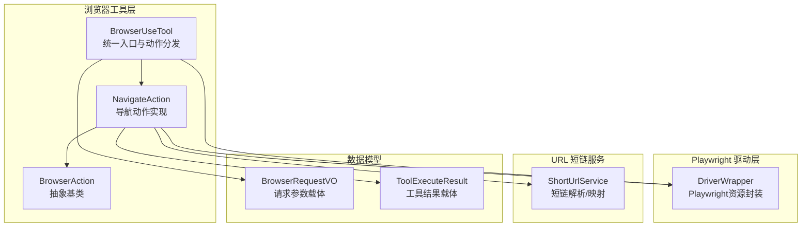
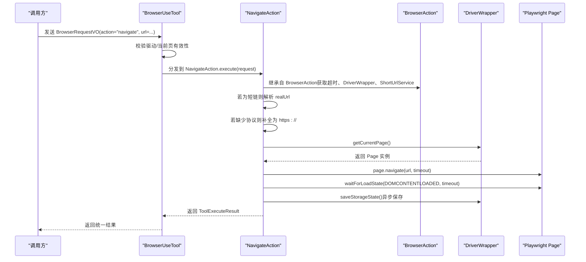
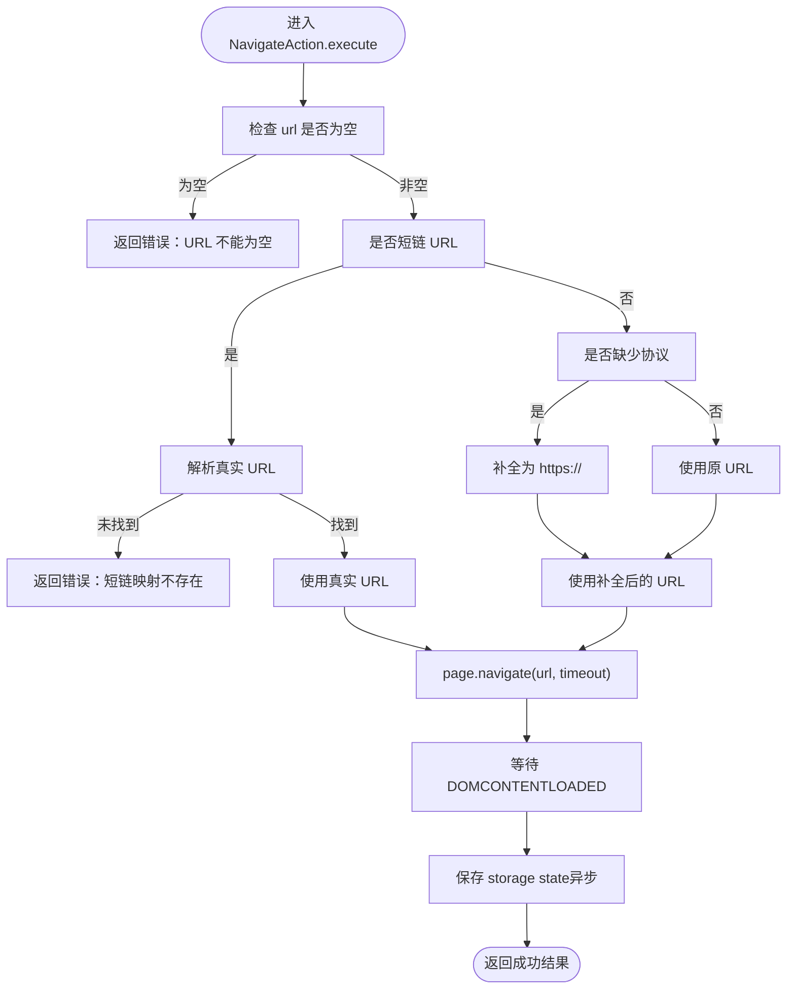
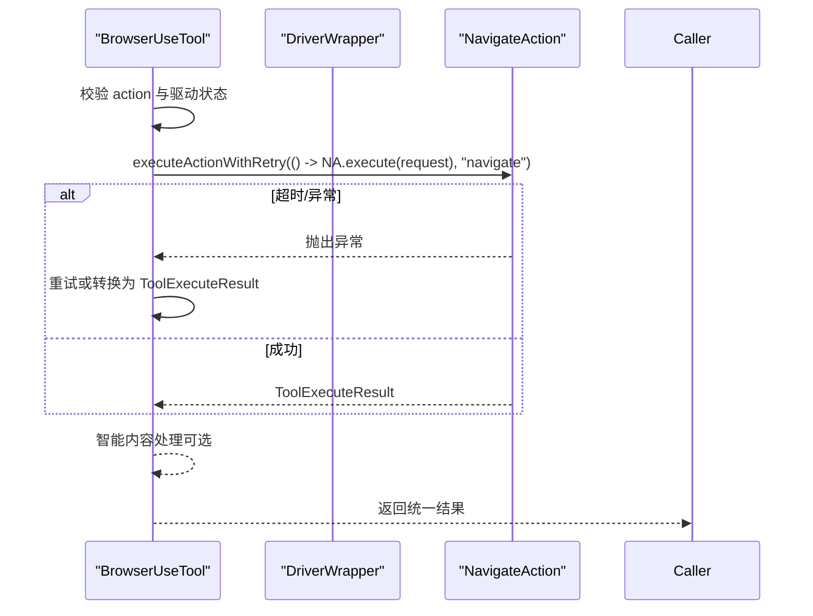
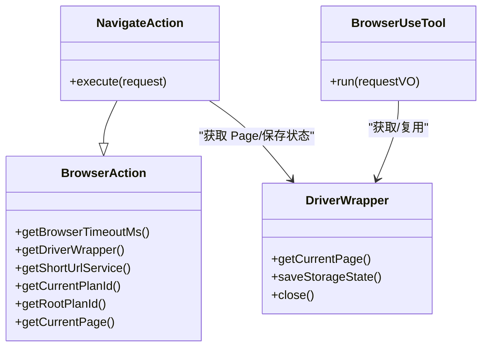
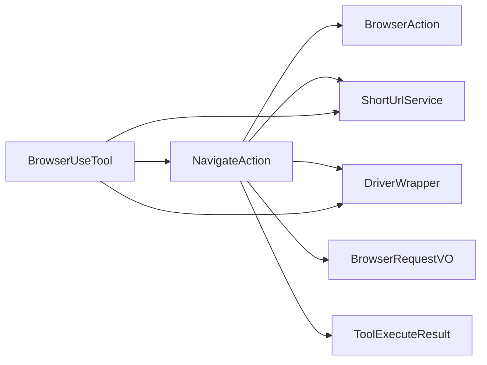

# 导航操作（Navigate）

<cite>
**本文引用的文件列表**
- [NavigateAction.java](file://src/main/java/com/alibaba/cloud/ai/lynxe/tool/browser/actions/NavigateAction.java)
- [BrowserAction.java](file://src/main/java/com/alibaba/cloud/ai/lynxe/tool/browser/actions/BrowserAction.java)
- [BrowserUseTool.java](file://src/main/java/com/alibaba/cloud/ai/lynxe/tool/browser/BrowserUseTool.java)
- [DriverWrapper.java](file://src/main/java/com/alibaba/cloud/ai/lynxe/tool/browser/DriverWrapper.java)
- [BrowserRequestVO.java](file://src/main/java/com/alibaba/cloud/ai/lynxe/tool/browser/actions/BrowserRequestVO.java)
- [ShortUrlService.java](file://src/main/java/com/alibaba/cloud/ai/lynxe/tool/shortUrl/ShortUrlService.java)
- [ToolExecuteResult.java](file://src/main/java/com/alibaba/cloud/ai/lynxe/tool/code/ToolExecuteResult.java)
- [AbstractBaseTool.java](file://src/main/java/com/alibaba/cloud/ai/lynxe/tool/AbstractBaseTool.java)
</cite>

## 目录
1. [简介](#简介)
2. [项目结构](#项目结构)
3. [核心组件](#核心组件)
4. [架构总览](#架构总览)
5. [详细组件分析](#详细组件分析)
6. [依赖关系分析](#依赖关系分析)
7. [性能与稳定性特性](#性能与稳定性特性)
8. [故障排查指南](#故障排查指南)
9. [结论](#结论)
10. [附录](#附录)

## 简介
本文件面向开发者与运维人员，系统化阐述 NavigateAction 的实现与使用，重点覆盖：
- 处理 URL 导航请求，支持短链接自动解析与完整 URL 补全机制
- 通过 BrowserUseTool 获取当前页面实例、执行页面跳转、等待加载状态（DOMContentLoaded、NETWORKIDLE）
- 对相对路径与协议缺失 URL 的处理策略
- 跨域与网络异常时的错误码返回机制
- JSON 请求示例（包含 url 字段）与成功/失败响应结构
- 与 Playwright DriverWrapper 的集成方式
- 常见问题（重定向循环、CORS 拦截）的排查方法

## 项目结构
NavigateAction 所属模块位于浏览器工具链中，围绕 BrowserUseTool 提供统一入口，内部通过 BrowserAction 抽象与 DriverWrapper 集成 Playwright 资源。

图表来源
- [BrowserUseTool.java](file://src/main/java/com/alibaba/cloud/ai/lynxe/tool/browser/BrowserUseTool.java#L124-L291)
- [BrowserAction.java](file://src/main/java/com/alibaba/cloud/ai/lynxe/tool/browser/actions/BrowserAction.java#L34-L134)
- [NavigateAction.java](file://src/main/java/com/alibaba/cloud/ai/lynxe/tool/browser/actions/NavigateAction.java#L30-L75)
- [DriverWrapper.java](file://src/main/java/com/alibaba/cloud/ai/lynxe/tool/browser/DriverWrapper.java#L86-L120)
- [ShortUrlService.java](file://src/main/java/com/alibaba/cloud/ai/lynxe/tool/shortUrl/ShortUrlService.java#L130-L160)
- [BrowserRequestVO.java](file://src/main/java/com/alibaba/cloud/ai/lynxe/tool/browser/actions/BrowserRequestVO.java#L23-L177)
- [ToolExecuteResult.java](file://src/main/java/com/alibaba/cloud/ai/lynxe/tool/code/ToolExecuteResult.java#L18-L60)

章节来源
- [BrowserUseTool.java](file://src/main/java/com/alibaba/cloud/ai/lynxe/tool/browser/BrowserUseTool.java#L124-L291)
- [NavigateAction.java](file://src/main/java/com/alibaba/cloud/ai/lynxe/tool/browser/actions/NavigateAction.java#L30-L75)

## 核心组件
- NavigateAction：负责解析请求、短链解析、URL 补全、调用 Playwright 页面跳转并等待加载状态，最后保存存储状态。
- BrowserUseTool：统一入口，校验驱动可用性与当前页有效性，按 action 分发到具体动作实现（含重试与异常转换）。
- BrowserAction：NavigateAction 的抽象基类，提供超时配置、DriverWrapper/ShortUrlService 访问、当前页获取等通用能力。
- DriverWrapper：封装 Playwright 的 Browser/BrowserContext/Page，提供存储状态持久化与资源关闭顺序管理。
- ShortUrlService：短链前缀识别与映射解析，支持按 planId 隔离。
- BrowserRequestVO：导航动作的输入载体，包含 action 与 url 等字段。
- ToolExecuteResult：工具执行结果载体，包含输出文本与中断标记。

章节来源
- [NavigateAction.java](file://src/main/java/com/alibaba/cloud/ai/lynxe/tool/browser/actions/NavigateAction.java#L30-L75)
- [BrowserUseTool.java](file://src/main/java/com/alibaba/cloud/ai/lynxe/tool/browser/BrowserUseTool.java#L124-L291)
- [BrowserAction.java](file://src/main/java/com/alibaba/cloud/ai/lynxe/tool/browser/actions/BrowserAction.java#L34-L134)
- [DriverWrapper.java](file://src/main/java/com/alibaba/cloud/ai/lynxe/tool/browser/DriverWrapper.java#L86-L120)
- [ShortUrlService.java](file://src/main/java/com/alibaba/cloud/ai/lynxe/tool/shortUrl/ShortUrlService.java#L130-L160)
- [BrowserRequestVO.java](file://src/main/java/com/alibaba/cloud/ai/lynxe/tool/browser/actions/BrowserRequestVO.java#L23-L177)
- [ToolExecuteResult.java](file://src/main/java/com/alibaba/cloud/ai/lynxe/tool/code/ToolExecuteResult.java#L18-L60)

## 架构总览
NavigateAction 的调用链路如下：

图表来源
- [BrowserUseTool.java](file://src/main/java/com/alibaba/cloud/ai/lynxe/tool/browser/BrowserUseTool.java#L161-L170)
- [NavigateAction.java](file://src/main/java/com/alibaba/cloud/ai/lynxe/tool/browser/actions/NavigateAction.java#L30-L75)
- [BrowserAction.java](file://src/main/java/com/alibaba/cloud/ai/lynxe/tool/browser/actions/BrowserAction.java#L126-L133)
- [DriverWrapper.java](file://src/main/java/com/alibaba/cloud/ai/lynxe/tool/browser/DriverWrapper.java#L86-L120)

## 详细组件分析

### NavigateAction 实现逻辑
- 输入校验：要求请求包含 url；否则返回明确错误提示。
- 短链解析：若 url 符合短链前缀，则通过 ShortUrlService 解析真实 URL；未命中映射时返回错误提示。
- URL 补全：若不以 http:// 或 https:// 开头，则自动补全为 https://。
- 页面跳转：从 DriverWrapper 获取当前 Page，调用 navigate 并设置超时。
- 加载等待：先等待 DOMCONTENTLOADED，再尝试等待 NETWORKIDLE；若 NETWORKIDLE 超时，会进行额外等待以确保动态内容稳定。
- 存储状态：导航后异步保存 storage state（cookies、localStorage 等），失败仅记录日志不中断导航。
- 结果返回：返回 ToolExecuteResult，包含成功消息与最终 URL。

图表来源
- [NavigateAction.java](file://src/main/java/com/alibaba/cloud/ai/lynxe/tool/browser/actions/NavigateAction.java#L30-L75)
- [ShortUrlService.java](file://src/main/java/com/alibaba/cloud/ai/lynxe/tool/shortUrl/ShortUrlService.java#L130-L160)
- [DriverWrapper.java](file://src/main/java/com/alibaba/cloud/ai/lynxe/tool/browser/DriverWrapper.java#L133-L167)

章节来源
- [NavigateAction.java](file://src/main/java/com/alibaba/cloud/ai/lynxe/tool/browser/actions/NavigateAction.java#L30-L75)
- [ShortUrlService.java](file://src/main/java/com/alibaba/cloud/ai/lynxe/tool/shortUrl/ShortUrlService.java#L130-L160)

### BrowserUseTool 与重试/异常转换
- 动作分发：根据 action 字符串选择对应动作实现（如 navigate）。
- 驱动校验：获取 DriverWrapper 后检查浏览器连接与当前页有效性，避免无效操作。
- 重试策略：对导航等动作执行带重试的执行器，针对超时与部分可重试异常进行有限次重试。
- 异常转换：将 Playwright/超时等异常转换为统一的 ToolExecuteResult 输出，便于上层感知。

图表来源
- [BrowserUseTool.java](file://src/main/java/com/alibaba/cloud/ai/lynxe/tool/browser/BrowserUseTool.java#L161-L291)
- [BrowserAction.java](file://src/main/java/com/alibaba/cloud/ai/lynxe/tool/browser/actions/BrowserAction.java#L296-L349)

章节来源
- [BrowserUseTool.java](file://src/main/java/com/alibaba/cloud/ai/lynxe/tool/browser/BrowserUseTool.java#L161-L291)
- [BrowserAction.java](file://src/main/java/com/alibaba/cloud/ai/lynxe/tool/browser/actions/BrowserAction.java#L296-L349)

### 与 DriverWrapper 的集成
- 当前页获取：BrowserAction.getCurrentPage() 通过 DriverWrapper.getCurrentPage() 获取 Page。
- 存储状态保存：NavigateAction 在导航完成后调用 DriverWrapper.saveStorageState()，采用异步+超时控制，避免阻塞。
- 关闭顺序：DriverWrapper.close() 严格遵循 BrowserContext -> Browser -> Playwright 的关闭顺序，确保资源正确释放与历史清理。

图表来源
- [BrowserAction.java](file://src/main/java/com/alibaba/cloud/ai/lynxe/tool/browser/actions/BrowserAction.java#L126-L133)
- [NavigateAction.java](file://src/main/java/com/alibaba/cloud/ai/lynxe/tool/browser/actions/NavigateAction.java#L56-L75)
- [DriverWrapper.java](file://src/main/java/com/alibaba/cloud/ai/lynxe/tool/browser/DriverWrapper.java#L86-L120)
- [BrowserUseTool.java](file://src/main/java/com/alibaba/cloud/ai/lynxe/tool/browser/BrowserUseTool.java#L124-L170)

章节来源
- [BrowserAction.java](file://src/main/java/com/alibaba/cloud/ai/lynxe/tool/browser/actions/BrowserAction.java#L126-L133)
- [DriverWrapper.java](file://src/main/java/com/alibaba/cloud/ai/lynxe/tool/browser/DriverWrapper.java#L133-L167)

## 依赖关系分析
- NavigateAction 依赖：
  - BrowserAction（继承，获得超时、DriverWrapper、ShortUrlService 访问）
  - ShortUrlService（短链解析）
  - DriverWrapper（获取 Page、保存 storage state）
  - BrowserRequestVO（输入参数）
  - ToolExecuteResult（输出结果）
- BrowserUseTool 依赖：
  - ChromeDriverService（获取 DriverWrapper）
  - ShortUrlService（短链解析）
  - 智能内容保存服务（可选的结果摘要处理）

图表来源
- [NavigateAction.java](file://src/main/java/com/alibaba/cloud/ai/lynxe/tool/browser/actions/NavigateAction.java#L30-L75)
- [BrowserUseTool.java](file://src/main/java/com/alibaba/cloud/ai/lynxe/tool/browser/BrowserUseTool.java#L124-L170)
- [BrowserAction.java](file://src/main/java/com/alibaba/cloud/ai/lynxe/tool/browser/actions/BrowserAction.java#L34-L134)
- [ShortUrlService.java](file://src/main/java/com/alibaba/cloud/ai/lynxe/tool/shortUrl/ShortUrlService.java#L130-L160)
- [DriverWrapper.java](file://src/main/java/com/alibaba/cloud/ai/lynxe/tool/browser/DriverWrapper.java#L86-L120)
- [BrowserRequestVO.java](file://src/main/java/com/alibaba/cloud/ai/lynxe/tool/browser/actions/BrowserRequestVO.java#L23-L177)
- [ToolExecuteResult.java](file://src/main/java/com/alibaba/cloud/ai/lynxe/tool/code/ToolExecuteResult.java#L18-L60)

章节来源
- [BrowserUseTool.java](file://src/main/java/com/alibaba/cloud/ai/lynxe/tool/browser/BrowserUseTool.java#L124-L170)
- [NavigateAction.java](file://src/main/java/com/alibaba/cloud/ai/lynxe/tool/browser/actions/NavigateAction.java#L30-L75)

## 性能与稳定性特性
- 超时策略
  - 导航超时：由 BrowserAction.getBrowserTimeoutMs() 提供毫秒级超时，用于 page.navigate 与 waitForLoadState。
  - 元素操作超时上限：BrowserAction.getElementTimeoutMs() 将元素等待时间上限限制在 10 秒，避免长等待。
- 加载等待
  - 先等待 DOMCONTENTLOADED，再尝试 NETWORKIDLE；若 NETWORKIDLE 超时，会进行额外短暂等待，提升动态内容稳定概率。
- 重试机制
  - BrowserUseTool.executeActionWithRetry() 对超时与部分异常进行最多两次重试，提高鲁棒性。
- 存储状态持久化
  - 导航后异步保存 storage state，超时容忍，不影响主流程。

章节来源
- [BrowserAction.java](file://src/main/java/com/alibaba/cloud/ai/lynxe/tool/browser/actions/BrowserAction.java#L55-L77)
- [BrowserUseTool.java](file://src/main/java/com/alibaba/cloud/ai/lynxe/tool/browser/BrowserUseTool.java#L296-L349)
- [NavigateAction.java](file://src/main/java/com/alibaba/cloud/ai/lynxe/tool/browser/actions/NavigateAction.java#L56-L75)
- [DriverWrapper.java](file://src/main/java/com/alibaba/cloud/ai/lynxe/tool/browser/DriverWrapper.java#L133-L167)

## 故障排查指南
- URL 缺失或格式错误
  - 现象：返回“URL 不能为空”或短链解析失败。
  - 排查：确认请求包含 url 字段；若为短链，确认映射已建立且 rootPlanId 正确。
- 协议缺失导致跳转失败
  - 现象：导航未生效或被浏览器拒绝。
  - 排查：NavigateAction 已自动补全为 https://，请确认最终 URL 可访问。
- 跨域（CORS）拦截
  - 现象：页面加载成功但资源请求被拦截，控制台出现 CORS 错误。
  - 排查：确认目标站点允许跨域访问；若为受限资源，需在服务端或代理层解决。
- 重定向循环
  - 现象：页面长时间停留在重定向链路中。
  - 排查：检查目标 URL 是否存在循环重定向；必要时在上游进行重写或禁用重定向。
- 网络异常/超时
  - 现象：导航超时或 NETWORKIDLE 超时。
  - 排查：适当增大超时配置；确认网络连通性；观察是否存在大量动态资源导致加载时间过长。
- 存储状态保存失败
  - 现象：日志提示保存失败但仍完成导航。
  - 排查：DriverWrapper.saveStorageState() 采用异步+超时，失败不会中断导航；若需强一致，可在业务侧补充重试或监控。

章节来源
- [NavigateAction.java](file://src/main/java/com/alibaba/cloud/ai/lynxe/tool/browser/actions/NavigateAction.java#L36-L75)
- [BrowserUseTool.java](file://src/main/java/com/alibaba/cloud/ai/lynxe/tool/browser/BrowserUseTool.java#L252-L291)
- [DriverWrapper.java](file://src/main/java/com/alibaba/cloud/ai/lynxe/tool/browser/DriverWrapper.java#L133-L167)

## 结论
NavigateAction 通过短链解析、URL 补全、加载等待与存储状态持久化，提供了稳健的导航能力。配合 BrowserUseTool 的驱动校验、重试与异常转换，能够在复杂网络环境下保持较高成功率。建议在生产环境中合理配置超时、关注 CORS 与重定向问题，并利用智能内容处理优化输出。

## 附录

### JSON 请求示例（包含 url 字段）
- 导航到完整 URL
  - action: "navigate"
  - url: "https://example.com/path?query=value"
- 导航到短链
  - action: "navigate"
  - url: "http://s@Url.a/1"
- 导航到相对路径（将被补全为 https://）
  - action: "navigate"
  - url: "example.com/path"

章节来源
- [BrowserRequestVO.java](file://src/main/java/com/alibaba/cloud/ai/lynxe/tool/browser/actions/BrowserRequestVO.java#L23-L177)
- [ShortUrlService.java](file://src/main/java/com/alibaba/cloud/ai/lynxe/tool/shortUrl/ShortUrlService.java#L130-L160)
- [NavigateAction.java](file://src/main/java/com/alibaba/cloud/ai/lynxe/tool/browser/actions/NavigateAction.java#L52-L55)

### 成功/失败响应结构
- 成功响应
  - 类型：ToolExecuteResult
  - 内容：包含成功消息与最终 URL
- 失败响应
  - 类型：ToolExecuteResult
  - 内容：包含错误信息（如 URL 不能为空、短链映射不存在、超时、Playwright 错误等）

章节来源
- [ToolExecuteResult.java](file://src/main/java/com/alibaba/cloud/ai/lynxe/tool/code/ToolExecuteResult.java#L18-L60)
- [BrowserUseTool.java](file://src/main/java/com/alibaba/cloud/ai/lynxe/tool/browser/BrowserUseTool.java#L252-L291)
- [NavigateAction.java](file://src/main/java/com/alibaba/cloud/ai/lynxe/tool/browser/actions/NavigateAction.java#L36-L46)

### 与 Playwright DriverWrapper 的集成要点
- 获取 Page：BrowserAction.getCurrentPage() 通过 DriverWrapper.getCurrentPage()。
- 导航与等待：NavigateAction 使用 page.navigate 与 waitForLoadState。
- 存储状态：NavigateAction 调用 DriverWrapper.saveStorageState()，异步保存，超时容忍。
- 关闭顺序：DriverWrapper.close() 严格遵循最佳实践顺序，确保历史清理与资源释放。

章节来源
- [BrowserAction.java](file://src/main/java/com/alibaba/cloud/ai/lynxe/tool/browser/actions/BrowserAction.java#L126-L133)
- [NavigateAction.java](file://src/main/java/com/alibaba/cloud/ai/lynxe/tool/browser/actions/NavigateAction.java#L56-L75)
- [DriverWrapper.java](file://src/main/java/com/alibaba/cloud/ai/lynxe/tool/browser/DriverWrapper.java#L133-L167)