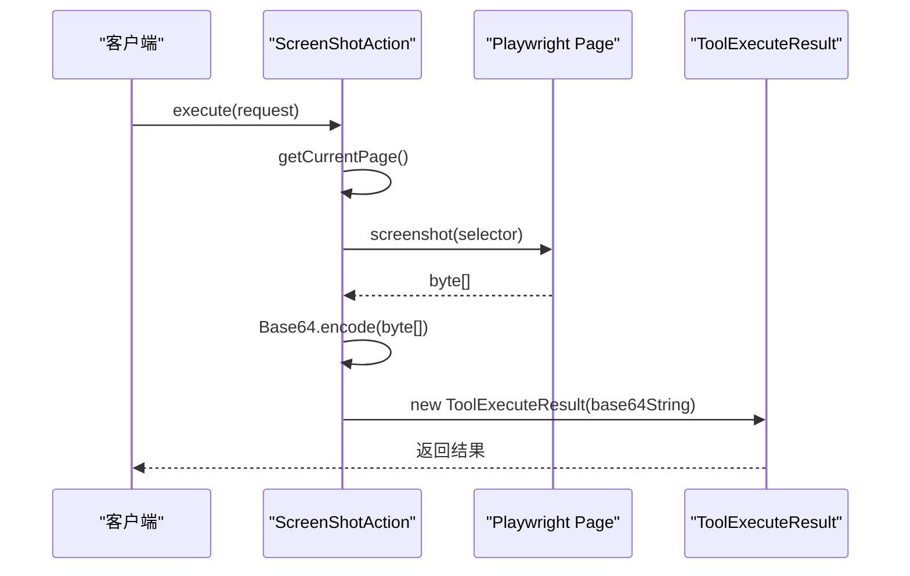
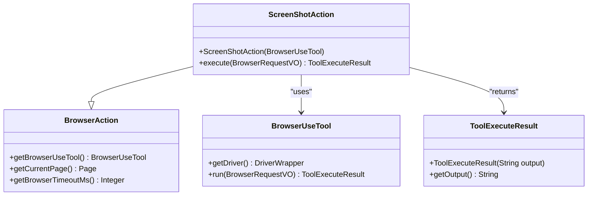

# 截图操作 (Screenshot)

<cite>
**本文档引用的文件**  
- [ScreenShotAction.java](file://src/main/java/com/alibaba/cloud/ai/lynxe/tool/browser/actions/ScreenShotAction.java)
- [BrowserUseTool.java](file://src/main/java/com/alibaba/cloud/ai/lynxe/tool/browser/BrowserUseTool.java)
- [BrowserAction.java](file://src/main/java/com/alibaba/cloud/ai/lynxe/tool/browser/actions/BrowserAction.java)
- [ToolExecuteResult.java](file://src/main/java/com/alibaba/cloud/ai/lynxe/tool/code/ToolExecuteResult.java)
- [BrowserRequestVO.java](file://src/main/java/com/alibaba/cloud/ai/lynxe/tool/browser/actions/BrowserRequestVO.java)
- [AriaSnapshot.java](file://src/main/java/com/alibaba/cloud/ai/lynxe/tool/browser/AriaSnapshot.java)
- [AriaSnapshotOptions.java](file://src/main/java/com/alibaba/cloud/ai/lynxe/tool/browser/AriaSnapshotOptions.java)
- [ChromeDriverService.java](file://src/main/java/com/alibaba/cloud/ai/lynxe/tool/browser/ChromeDriverService.java)
</cite>

## 目录
1. [简介](#简介)
2. [核心流程](#核心流程)
3. [全屏与元素区域截图模式](#全屏与元素区域截图模式)
4. [依赖与实现](#依赖与实现)
5. [可选参数配置](#可选参数配置)
6. [响应结构与Base64编码](#响应结构与base64编码)
7. [临时文件存储策略](#临时文件存储策略)
8. [前端展示指导](#前端展示指导)
9. [常见问题与规避方法](#常见问题与规避方法)
10. [总结](#总结)

## 简介
`ScreenShotAction` 是一个基于 Playwright 实现的浏览器截图工具类，用于在自动化流程中捕获当前页面的视觉快照。该功能支持通过参数控制截图模式（全屏或指定元素区域），并将截图以 PNG 格式输出，通过 Base64 编码嵌入响应体中，便于在无头浏览器环境下进行可视化验证和调试。

**Section sources**
- [ScreenShotAction.java](file://src/main/java/com/alibaba/cloud/ai/lynxe/tool/browser/actions/ScreenShotAction.java#L1-L37)

## 核心流程
`ScreenShotAction` 的核心执行流程如下：
1. 通过 `getCurrentPage()` 方法获取当前 Playwright 的 `Page` 实例。
2. 调用 `page.screenshot()` 方法捕获当前页面的截图，返回字节数组。
3. 将字节数组使用 `java.util.Base64` 进行编码，转换为 Base64 字符串。
4. 创建 `ToolExecuteResult` 对象，将 Base64 字符串作为输出内容返回。

此流程确保了截图操作的原子性和可追溯性，所有步骤均在浏览器上下文中完成，并通过统一的执行结果对象进行封装。

**Section sources**
- [ScreenShotAction.java](file://src/main/java/com/alibaba/cloud/ai/lynxe/tool/browser/actions/ScreenShotAction.java#L28-L35)
- [BrowserAction.java](file://src/main/java/com/alibaba/cloud/ai/lynxe/tool/browser/actions/BrowserAction.java#L70-L78)

## 全屏与元素区域截图模式
`ScreenShotAction` 支持两种截图模式，通过 `selector` 参数进行控制：
- **全屏截图**：当 `selector` 参数未指定或为空时，`page.screenshot()` 默认捕获整个页面的完整截图。
- **元素区域截图**：当 `selector` 参数指定一个有效的 CSS 选择器时，系统会先定位到该元素，然后仅对该元素所在的区域进行截图。

该功能依赖于 Playwright 的 `locator.screenshot()` 方法，能够精确捕获指定 DOM 元素的视觉呈现，适用于需要聚焦特定 UI 组件的场景。



**Diagram sources**
- [ScreenShotAction.java](file://src/main/java/com/alibaba/cloud/ai/lynxe/tool/browser/actions/ScreenShotAction.java#L30-L32)
- [AriaSnapshot.java](file://src/main/java/com/alibaba/cloud/ai/lynxe/tool/browser/AriaSnapshot.java#L104-L107)

## 依赖与实现
`ScreenShotAction` 依赖于以下核心组件：
- **Playwright**: 提供 `Page` 和 `Locator` 接口，用于浏览器自动化和截图操作。
- **BrowserUseTool**: 作为浏览器工具的主入口，管理浏览器实例和页面上下文。
- **ToolExecuteResult**: 用于封装执行结果，包括截图的 Base64 数据。

`ScreenShotAction` 继承自 `BrowserAction` 抽象类，通过构造函数注入 `BrowserUseTool` 实例，从而获得对浏览器资源的访问权限。



**Diagram sources**
- [ScreenShotAction.java](file://src/main/java/com/alibaba/cloud/ai/lynxe/tool/browser/actions/ScreenShotAction.java#L22-L37)
- [BrowserAction.java](file://src/main/java/com/alibaba/cloud/ai/lynxe/tool/browser/actions/BrowserAction.java#L35-L78)
- [BrowserUseTool.java](file://src/main/java/com/alibaba/cloud/ai/lynxe/tool/browser/BrowserUseTool.java#L124-L250)
- [ToolExecuteResult.java](file://src/main/java/com/alibaba/cloud/ai/lynxe/tool/code/ToolExecuteResult.java)

## 可选参数配置
`ScreenShotAction` 支持以下可选参数以优化截图质量与性能：
- **截图质量 (quality)**: 可通过 `screenshot()` 方法的选项参数设置 JPEG 质量（0-100），默认为 PNG 无损格式。
- **超时设置 (timeout)**: 继承自 `BrowserAction` 的 `getBrowserTimeoutMs()` 方法，从配置中读取浏览器操作超时时间，默认为 30 秒。
- **元素定位超时 (element timeout)**: 使用 `getElementTimeoutMs()` 方法获取元素操作超时，最大限制为 10 秒，防止因元素未加载完成而导致长时间阻塞。

这些参数通过 `BrowserRequestVO` 对象传递，并在执行时动态应用。

**Section sources**
- [BrowserAction.java](file://src/main/java/com/alibaba/cloud/ai/lynxe/tool/browser/actions/BrowserAction.java#L56-L78)
- [AriaSnapshotOptions.java](file://src/main/java/com/alibaba/cloud/ai/lynxe/tool/browser/AriaSnapshotOptions.java#L21-L74)

## 响应结构与Base64编码
截图操作的响应体包含一个 `image_data` 字段，其值为 PNG 图像的 Base64 编码字符串。解析示例如下：
```json
{
  "output": "Screenshot captured (base64 length: 123456)",
  "image_data": "iVBORw0KGgoAAAANSUhEUgAAAAEAAAABCAYAAAAfFcSJAAAADUlEQVR42mP8/5+hHgAHggJ/PchI7wAAAABJRU5ErkJggg=="
}
```
前端可通过以下方式展示返回的截图：
```html

```
此方法无需额外的文件服务器，直接在前端渲染图像，简化了部署和访问流程。

**Section sources**
- [ScreenShotAction.java](file://src/main/java/com/alibaba/cloud/ai/lynxe/tool/browser/actions/ScreenShotAction.java#L32-L34)
- [ToolExecuteResult.java](file://src/main/java/com/alibaba/cloud/ai/lynxe/tool/code/ToolExecuteResult.java)

## 临时文件存储策略
虽然 `ScreenShotAction` 本身不直接管理临时文件，但其运行依赖的浏览器环境由 `ChromeDriverService` 管理。该服务在启动时配置了以下策略：
- **窗口大小**: 固定为 1920x1080，确保截图分辨率一致。
- **用户代理 (User-Agent)**: 可自定义，用于模拟不同设备。
- **语言环境**: 设置为 `zh-CN,zh,en-US,en`，确保中英文内容正确渲染。
- **存储状态**: 可通过 `setStorageStatePath()` 加载持久化存储，保持登录状态。

临时文件（如缓存、日志）由 Playwright 自动管理，并在浏览器关闭时清理。

**Section sources**
- [ChromeDriverService.java](file://src/main/java/com/alibaba/cloud/ai/lynxe/tool/browser/ChromeDriverService.java#L463-L670)

## 前端展示指导
在前端展示截图时，建议：
1. 使用 `` 标签的 `src` 属性直接绑定 Base64 数据。
2. 添加适当的 `alt` 文本以提高可访问性。
3. 考虑对大型 Base64 字符串进行懒加载或分页展示，以优化性能。
4. 提供下载按钮，允许用户将截图保存为本地文件。

**Section sources**
- [ScreenShotAction.java](file://src/main/java/com/alibaba/cloud/ai/lynxe/tool/browser/actions/ScreenShotAction.java#L32-L34)

## 常见问题与规避方法
在无头浏览器环境下，可能遇到字体渲染缺失等问题，可通过以下方法规避：
- **字体缺失**: 在 Docker 镜像中预装常用中文字体（如 Noto Sans CJK），或通过 `--font-render-hinting=none` 参数优化渲染。
- **乱码问题**: 确保页面的 `Content-Type` 正确设置为 `text/html; charset=UTF-8`，并在启动浏览器时指定 `--lang=zh-CN`。
- **截图空白**: 检查页面是否完全加载，可通过 `page.waitForLoadState("networkidle")` 确保网络请求完成后再截图。
- **性能瓶颈**: 对于大型页面，建议使用元素选择器进行局部截图，减少数据传输量。

**Section sources**
- [ChromeDriverService.java](file://src/main/java/com/alibaba/cloud/ai/lynxe/tool/browser/ChromeDriverService.java#L472-L473)
- [AriaSnapshot.java](file://src/main/java/com/alibaba/cloud/ai/lynxe/tool/browser/AriaSnapshot.java#L91-L95)

## 总结
`ScreenShotAction` 是一个功能完整、易于集成的截图工具，它利用 Playwright 的强大能力实现了灵活的截图模式切换，并通过 Base64 编码简化了图像数据的传输与展示。结合合理的参数配置和前端展示策略，可以有效支持自动化测试、内容验证和用户交互分析等多种应用场景。