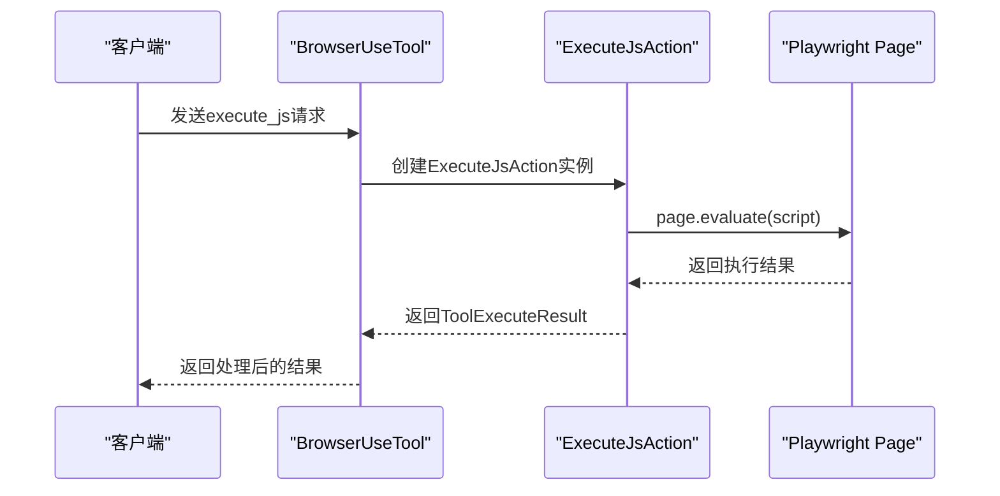
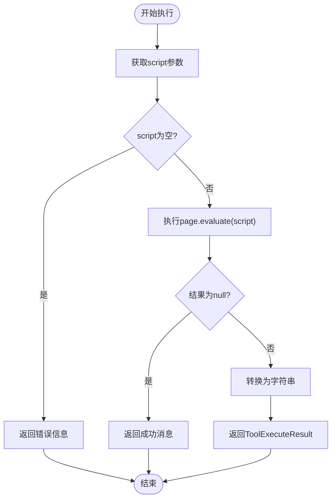

# 执行JavaScript

<cite>
**本文档引用的文件**
- [ExecuteJsAction.java](file://src/main/java/com/alibaba/cloud/ai/lynxe/tool/browser/actions/ExecuteJsAction.java)
- [BrowserUseTool.java](file://src/main/java/com/alibaba/cloud/ai/lynxe/tool/browser/BrowserUseTool.java)
- [BrowserRequestVO.java](file://src/main/java/com/alibaba/cloud/ai/lynxe/tool/browser/actions/BrowserRequestVO.java)
- [LynxeProperties.java](file://src/main/java/com/alibaba/cloud/ai/lynxe/config/LynxeProperties.java)
- [ChromeDriverService.java](file://src/main/java/com/alibaba/cloud/ai/lynxe/tool/browser/ChromeDriverService.java)
- [ToolExecuteResult.java](file://src/main/java/com/alibaba/cloud/ai/lynxe/tool/code/ToolExecuteResult.java)
- [SmartContentSavingService.java](file://src/main/java/com/alibaba/cloud/ai/lynxe/tool/innerStorage/SmartContentSavingService.java)
</cite>

## 目录
1. [简介](#简介)
2. [核心功能](#核心功能)
3. [沙箱执行环境](#沙箱执行环境)
4. [参数传递与返回值处理](#参数传递与返回值处理)
5. [安全机制](#安全机制)
6. [合法用例示例](#合法用例示例)
7. [错误处理](#错误处理)
8. [性能与超时控制](#性能与超时控制)
9. [总结](#总结)

## 简介

`ExecuteJsAction` 是一个高级功能，允许在当前页面上下文中执行自定义的JavaScript代码。该功能通过Playwright库与浏览器进行交互，为自动化任务提供了强大的灵活性。用户可以通过发送包含JavaScript代码的请求来获取DOM信息、修改页面状态或执行其他浏览器操作。

该功能作为 `BrowserUseTool` 工具的一部分，通过 `execute_js` 操作类型被调用。它利用Playwright的 `page.evaluate()` 方法在浏览器上下文中执行JavaScript，并将结果返回给调用者。

**Section sources**
- [ExecuteJsAction.java](file://src/main/java/com/alibaba/cloud/ai/lynxe/tool/browser/actions/ExecuteJsAction.java#L1-L47)
- [BrowserUseTool.java](file://src/main/java/com/alibaba/cloud/ai/lynxe/tool/browser/BrowserUseTool.java#L198-L209)

## 核心功能

`ExecuteJsAction` 的主要功能是执行在 `BrowserRequestVO` 对象中指定的JavaScript代码。其核心逻辑如下：

1. 从 `BrowserRequestVO` 中提取 `script` 字段。
2. 获取当前的Playwright `Page` 实例。
3. 使用 `page.evaluate(script)` 在浏览器上下文中执行JavaScript代码。
4. 处理执行结果并返回。

该功能支持执行任何有效的JavaScript代码，包括获取页面标题、读取localStorage、修改DOM元素等。



**Diagram sources**
- [ExecuteJsAction.java](file://src/main/java/com/alibaba/cloud/ai/lynxe/tool/browser/actions/ExecuteJsAction.java#L29-L44)
- [BrowserUseTool.java](file://src/main/java/com/alibaba/cloud/ai/lynxe/tool/browser/BrowserUseTool.java#L198-L209)

## 沙箱执行环境

`ExecuteJsAction` 在一个由Playwright管理的沙箱环境中执行JavaScript代码。这个环境具有以下特点：

- **隔离性**：每个执行都在独立的浏览器上下文（`BrowserContext`）中进行，确保了不同任务之间的隔离。
- **安全性**：虽然代码在浏览器中执行，但服务端通过配置和审查机制限制了潜在的恶意行为。
- **上下文**：代码在当前页面的上下文中执行，可以访问页面的DOM、JavaScript变量和API。

沙箱环境由 `ChromeDriverService` 创建和管理，确保了浏览器实例的稳定性和安全性。

**Section sources**
- [ChromeDriverService.java](file://src/main/java/com/alibaba/cloud/ai/lynxe/tool/browser/ChromeDriverService.java#L765-L782)
- [ExecuteJsAction.java](file://src/main/java/com/alibaba/cloud/ai/lynxe/tool/browser/actions/ExecuteJsAction.java#L35-L36)

## 参数传递与返回值处理

### 参数传递

JavaScript代码通过 `BrowserRequestVO` 对象的 `script` 字段传递。该字段是一个字符串，包含了要执行的完整JavaScript代码。

```java
public class BrowserRequestVO {
    private String script; // JavaScript代码
    // 其他字段...
}
```

### 返回值处理

`page.evaluate()` 的返回值是一个 `Object` 类型。`ExecuteJsAction` 对返回值进行如下处理：

- 如果返回值为 `null`，则返回成功执行的消息。
- 否则，将返回值转换为字符串并返回。

返回值通过 `ToolExecuteResult` 对象封装，其 `output` 字段包含最终的字符串结果。



**Diagram sources**
- [ExecuteJsAction.java](file://src/main/java/com/alibaba/cloud/ai/lynxe/tool/browser/actions/ExecuteJsAction.java#L30-L43)
- [ToolExecuteResult.java](file://src/main/java/com/alibaba/cloud/ai/lynxe/tool/code/ToolExecuteResult.java#L24-L26)

## 安全机制

为了防止恶意脚本的执行，系统实施了多层安全机制：

1. **代码审查**：服务端会对执行的JavaScript代码进行审查，禁止执行已知的危险操作。
2. **执行超时**：通过 `lynxe.browser.requestTimeout` 配置项设置执行超时时间，默认为180秒。超时后，执行将被终止。
3. **资源限制**：浏览器实例在执行完毕后会被清理，防止资源泄露。

```java
@ConfigProperty(group = "lynxe", subGroup = "browser", key = "requestTimeout",
        path = "lynxe.browser.requestTimeout", description = "浏览器请求超时时间",
        defaultValue = "180", inputType = ConfigInputType.NUMBER)
private volatile Integer browserRequestTimeout;
```

此外，系统还通过 `SmartContentSavingService` 对长输出进行智能处理，防止内存溢出。

**Section sources**
- [LynxeProperties.java](file://src/main/java/com/alibaba/cloud/ai/lynxe/config/LynxeProperties.java#L57-L73)
- [SmartContentSavingService.java](file://src/main/java/com/alibaba/cloud/ai/lynxe/tool/innerStorage/SmartContentSavingService.java#L79-L94)

## 合法用例示例

### 获取页面标题

**请求**
```json
{
  "action": "execute_js",
  "script": "document.title"
}
```

**响应**
```json
{
  "output": "示例页面 - 首页"
}
```

### 修改localStorage

**请求**
```json
{
  "action": "execute_js",
  "script": "localStorage.setItem('user', 'admin'); 'localStorage已更新'"
}
```

**响应**
```json
{
  "output": "localStorage已更新"
}
```

### 获取当前URL

**请求**
```json
{
  "action": "execute_js",
  "script": "window.location.href"
}
```

**响应**
```json
{
  "output": "https://example.com/page"
}
```

**Section sources**
- [ExecuteJsAction.java](file://src/main/java/com/alibaba/cloud/ai/lynxe/tool/browser/actions/ExecuteJsAction.java#L36-L43)
- [BrowserRequestVO.java](file://src/main/java/com/alibaba/cloud/ai/lynxe/tool/browser/actions/BrowserRequestVO.java#L48-L51)

## 错误处理

`ExecuteJsAction` 实现了完善的错误处理机制：

- 如果 `script` 参数为空，返回错误信息。
- 如果浏览器操作超时，捕获 `TimeoutError` 并返回超时错误。
- 如果Playwright发生异常，捕获 `PlaywrightException` 并返回错误信息。
- 对于其他未预期的异常，捕获 `Exception` 并返回通用错误。

错误信息会被记录到日志中，便于调试和监控。

**Section sources**
- [ExecuteJsAction.java](file://src/main/java/com/alibaba/cloud/ai/lynxe/tool/browser/actions/ExecuteJsAction.java#L31-L33)
- [BrowserUseTool.java](file://src/main/java/com/alibaba/cloud/ai/lynxe/tool/browser/BrowserUseTool.java#L252-L263)

## 性能与超时控制

系统的性能和超时控制由 `LynxeProperties` 和 `ChromeDriverService` 共同管理：

- **超时配置**：通过 `lynxe.browser.requestTimeout` 配置项设置超时时间。
- **默认超时**：如果未配置，使用默认的30秒超时。
- **动态设置**：在创建浏览器页面时，动态设置 `setDefaultTimeout` 和 `setDefaultNavigationTimeout`。

```java
Integer timeout = lynxeProperties.getBrowserRequestTimeout();
if (timeout != null && timeout > 0) {
    page.setDefaultTimeout(timeout * 1000);
    page.setDefaultNavigationTimeout(timeout * 1000);
}
```

**Section sources**
- [LynxeProperties.java](file://src/main/java/com/alibaba/cloud/ai/lynxe/config/LynxeProperties.java#L57-L73)
- [ChromeDriverService.java](file://src/main/java/com/alibaba/cloud/ai/lynxe/tool/browser/ChromeDriverService.java#L766-L782)

## 总结

`ExecuteJsAction` 是一个强大且灵活的功能，允许在浏览器上下文中执行自定义JavaScript代码。它通过沙箱环境、参数传递机制和返回值序列化，为自动化任务提供了广泛的可能性。同时，系统通过代码审查、执行超时和资源限制等安全机制，确保了功能的安全性和稳定性。

在使用该功能时，应遵循最佳实践，避免执行恶意或资源密集型的脚本，以确保系统的可靠运行。