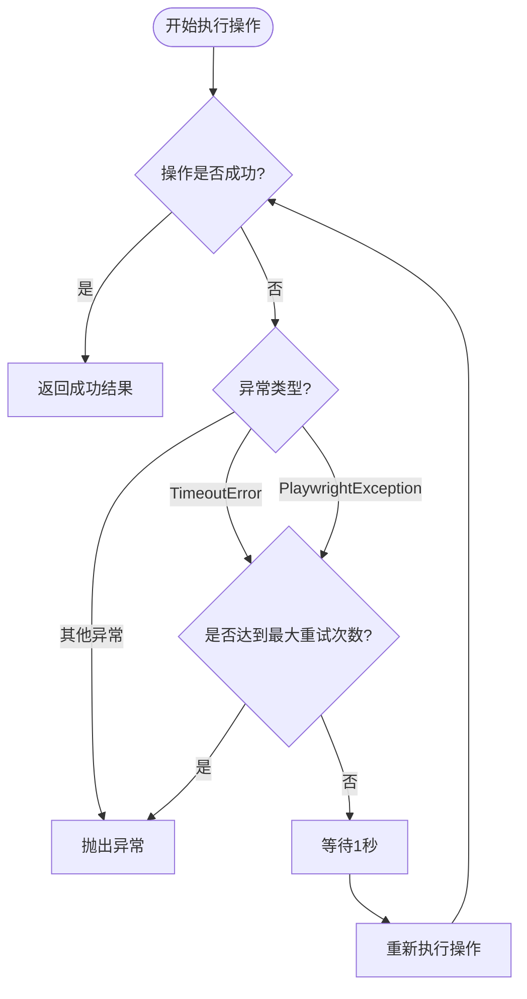
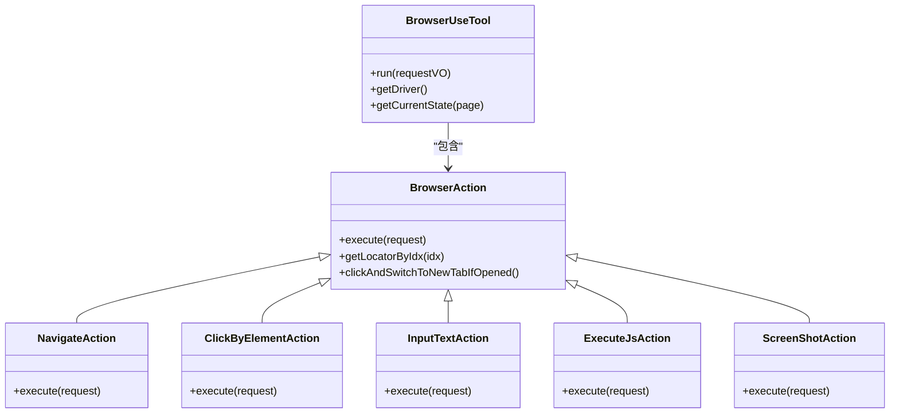

# 浏览器操作指令

<cite>
**本文档引用的文件**  
- [BrowserUseTool.java](file://src/main/java/com/alibaba/cloud/ai/lynxe/tool/browser/BrowserUseTool.java)
- [NavigateAction.java](file://src/main/java/com/alibaba/cloud/ai/lynxe/tool/browser/actions/NavigateAction.java)
- [ClickByElementAction.java](file://src/main/java/com/alibaba/cloud/ai/lynxe/tool/browser/actions/ClickByElementAction.java)
- [InputTextAction.java](file://src/main/java/com/alibaba/cloud/ai/lynxe/tool/browser/actions/InputTextAction.java)
- [ExecuteJsAction.java](file://src/main/java/com/alibaba/cloud/ai/lynxe/tool/browser/actions/ExecuteJsAction.java)
- [ScreenShotAction.java](file://src/main/java/com/alibaba/cloud/ai/lynxe/tool/browser/actions/ScreenShotAction.java)
- [BrowserRequestVO.java](file://src/main/java/com/alibaba/cloud/ai/lynxe/tool/browser/actions/BrowserRequestVO.java)
- [BrowserAction.java](file://src/main/java/com/alibaba/cloud/ai/lynxe/tool/browser/actions/BrowserAction.java)
- [AriaElementHelper.java](file://src/main/java/com/alibaba/cloud/ai/lynxe/tool/browser/AriaElementHelper.java)
- [browser-use-tool-zh.yml](file://src/main/resources/i18n/tools/browser-use-tool-zh.yml)
</cite>

## 目录
1. [简介](#简介)
2. [核心操作类型](#核心操作类型)
3. [参数与执行逻辑](#参数与执行逻辑)
4. [错误处理与重试机制](#错误处理与重试机制)
5. [操作示例](#操作示例)
6. [复杂场景组合使用](#复杂场景组合使用)
7. [状态管理与上下文](#状态管理与上下文)

## 简介
`BrowserUseTool` 是一个基于 Playwright 的浏览器自动化工具，支持多种网页交互操作，包括导航、点击、输入、执行脚本、截图等。该工具通过 `BrowserRequestVO` 接收操作指令，并通过 `BrowserAction` 基类统一管理各类操作的执行逻辑。所有操作均具备超时控制、重试机制和智能内容处理能力，确保操作的稳定性和可靠性。

**Section sources**
- [BrowserUseTool.java](file://src/main/java/com/alibaba/cloud/ai/lynxe/tool/browser/BrowserUseTool.java#L1-L653)
- [browser-use-tool-zh.yml](file://src/main/resources/i18n/tools/browser-use-tool-zh.yml#L1-L188)

## 核心操作类型
`BrowserUseTool` 支持以下核心操作类型：

- **navigate**: 导航到指定 URL
- **click**: 按索引点击元素
- **input_text**: 在指定元素中输入文本
- **key_enter**: 在指定元素上按 Enter 键
- **screenshot**: 捕获当前页面截图
- **get_text**: 获取页面文本内容
- **execute_js**: 执行 JavaScript 代码
- **scroll**: 滚动页面
- **new_tab**: 打开新标签页
- **close_tab**: 关闭标签页
- **switch_tab**: 切换标签页
- **refresh**: 刷新页面
- **get_element_position**: 获取指定文本元素的位置
- **move_to_and_click**: 移动到指定坐标并点击
- **get_web_content**: 获取当前网页内容

这些操作通过 `BrowserRequestVO` 中的 `action` 字段指定，并由 `BrowserUseTool.run()` 方法分发执行。

**Section sources**
- [BrowserUseTool.java](file://src/main/java/com/alibaba/cloud/ai/lynxe/tool/browser/BrowserUseTool.java#L163-L248)
- [BrowserRequestVO.java](file://src/main/java/com/alibaba/cloud/ai/lynxe/tool/browser/actions/BrowserRequestVO.java#L25-L28)

## 参数与执行逻辑

### NavigateAction：URL 导航操作
`NavigateAction` 负责处理页面导航，其执行逻辑如下：

1. **短链接解析**：若 URL 为短链接（如 `http://s@Url.a/1`），则通过 `ShortUrlService` 解析为真实 URL。
2. **URL 自动补全**：若 URL 无协议前缀，则自动补全为 `https://`。
3. **页面导航**：调用 `page.navigate()` 执行跳转。
4. **加载状态等待**：等待 `DOMCONTENTLOADED` 和 `NETWORKIDLE` 状态，确保页面完全加载。
5. **存储状态保存**：保存浏览器上下文的存储状态（cookies、localStorage 等），实现会话持久化。

```json
{
  "action": "navigate",
  "url": "https://example.com"
}
```

**Section sources**
- [NavigateAction.java](file://src/main/java/com/alibaba/cloud/ai/lynxe/tool/browser/actions/NavigateAction.java#L31-L74)

### ClickByElementAction：元素点击操作
`ClickByElementAction` 实现基于索引的元素点击，其执行逻辑如下：

1. **元素定位**：通过 `getLocatorByIdx(index)` 方法，将 `idx` 转换为 `aria-id-num` 格式，并使用 `data-aria-id` 属性定位元素。
2. **可见性检查**：调用 `locator.waitFor()` 等待元素可见，并检查 `isVisible()` 状态。
3. **点击执行**：调用 `locator.click()` 执行点击。
4. **新标签页处理**：使用 `clickAndSwitchToNewTabIfOpened()` 方法检测是否弹出新标签页，并自动切换上下文。

```json
{
  "action": "click",
  "index": 39
}
```

**Section sources**
- [ClickByElementAction.java](file://src/main/java/com/alibaba/cloud/ai/lynxe/tool/browser/actions/ClickByElementAction.java#L31-L82)
- [BrowserAction.java](file://src/main/java/com/alibaba/cloud/ai/lynxe/tool/browser/actions/BrowserAction.java#L175-L257)

### InputTextAction：文本输入操作
`InputTextAction` 支持在指定元素中输入文本，其执行逻辑如下：

1. **元素定位**：通过 `getLocatorByIdx(index)` 获取元素定位器。
2. **输入策略**：优先使用 `pressSequentially()` 模拟逐字输入（带 100ms 延迟），若失败则尝试 `fill()` 方法。
3. **降级处理**：若上述方法均失败，则通过 `evaluate()` 执行 JS 直接赋值并触发 `input` 事件。
4. **延迟等待**：输入后等待 500ms，确保页面响应。

```json
{
  "action": "input_text",
  "index": 42,
  "text": "搜索关键词"
}
```

**Section sources**
- [InputTextAction.java](file://src/main/java/com/alibaba/cloud/ai/lynxe/tool/browser/actions/InputTextAction.java#L28-L84)

### ExecuteJsAction：JavaScript 执行
`ExecuteJsAction` 允许执行任意 JavaScript 代码：

1. **脚本执行**：调用 `page.evaluate(script)` 执行脚本。
2. **结果处理**：若返回值为 `null`，返回成功提示；否则返回结果的字符串表示。

```json
{
  "action": "execute_js",
  "script": "document.title"
}
```

**Section sources**
- [ExecuteJsAction.java](file://src/main/java/com/alibaba/cloud/ai/lynxe/tool/browser/actions/ExecuteJsAction.java#L28-L43)

### ScreenShotAction：截图操作
`ScreenShotAction` 捕获当前页面截图：

1. **截图生成**：调用 `page.screenshot()` 获取字节数组。
2. **Base64 编码**：将截图编码为 Base64 字符串返回。

```json
{
  "action": "screenshot"
}
```

**Section sources**
- [ScreenShotAction.java](file://src/main/java/com/alibaba/cloud/ai/lynxe/tool/browser/actions/ScreenShotAction.java#L28-L34)

## 错误处理与重试机制

### 全局重试机制
`BrowserUseTool` 通过 `executeActionWithRetry()` 方法为所有操作提供重试能力：

- **最大重试次数**：2 次
- **重试间隔**：1 秒
- **可重试异常**：`TimeoutError` 和部分 `PlaywrightException`
- **不可重试异常**：`RuntimeException` 和其他检查型异常



**Diagram sources**
- [BrowserUseTool.java](file://src/main/java/com/alibaba/cloud/ai/lynxe/tool/browser/BrowserUseTool.java#L296-L348)

### 智能内容处理
对于 `get_text` 和 `execute_js` 等可能返回长文本的操作，系统会调用 `SmartContentSavingService.processContent()` 进行智能处理，避免输出过长内容。

**Section sources**
- [BrowserUseTool.java](file://src/main/java/com/alibaba/cloud/ai/lynxe/tool/browser/BrowserUseTool.java#L188-L196)

## 操作示例

### JSON 请求示例
```json
// 导航到百度
{
  "action": "navigate",
  "url": "https://www.baidu.com"
}

// 在搜索框输入文本
{
  "action": "input_text",
  "index": 1,
  "text": "人工智能"
}

// 点击搜索按钮
{
  "action": "click",
  "index": 2
}

// 获取页面文本
{
  "action": "get_text"
}

// 执行JS获取标题
{
  "action": "execute_js",
  "script": "document.title"
}

// 滚动页面
{
  "action": "scroll",
  "direction": "down"
}

// 截图
{
  "action": "screenshot"
}
```

### 预期响应示例
```json
{
  "output": "successfully navigated to https://www.baidu.com"
}

{
  "output": "Successfully input: '人工智能' to the specified element with index: 1"
}

{
  "output": "Successfully clicked element at index 2"
}

{
  "output": "<inner_text>\n百度一下，你就知道\n...</inner_text>"
}

{
  "output": "百度一下，你就知道"
}

{
  "output": "Scrolled down by 500 pixels"
}

{
  "output": "Screenshot captured (base64 length: 123456)"
}
```

**Section sources**
- [browser-use-tool-zh.yml](file://src/main/resources/i18n/tools/browser-use-tool-zh.yml#L20-L185)

## 复杂场景组合使用
在实际应用中，多个操作可组合使用以完成复杂任务。例如，实现“搜索并获取结果”流程：

1. `navigate` 到搜索引擎
2. `input_text` 输入关键词
3. `click` 搜索按钮
4. `get_text` 提取搜索结果
5. `screenshot` 捕获结果页面

此组合模式体现了工具链的灵活性和可编程性。

**Section sources**
- [BrowserUseTool.java](file://src/main/java/com/alibaba/cloud/ai/lynxe/tool/browser/BrowserUseTool.java#L163-L248)

## 状态管理与上下文
`BrowserUseTool` 通过 `DriverWrapper` 管理浏览器实例和页面上下文：

- **多标签页支持**：通过 `page.context().newPage()` 创建新标签页。
- **上下文切换**：`SwitchTabAction` 和 `clickAndSwitchToNewTabIfOpened()` 自动更新当前页面。
- **状态持久化**：导航后自动保存 `storageState`，保持登录状态。
- **ARIA 快照**：通过 `AriaElementHelper.parsePageAndAssignRefs()` 生成带 `[idx=num]` 标记的可交互元素快照，供后续操作使用。



**Diagram sources**
- [BrowserUseTool.java](file://src/main/java/com/alibaba/cloud/ai/lynxe/tool/browser/BrowserUseTool.java#L52-L652)
- [BrowserAction.java](file://src/main/java/com/alibaba/cloud/ai/lynxe/tool/browser/actions/BrowserAction.java#L35-L259)