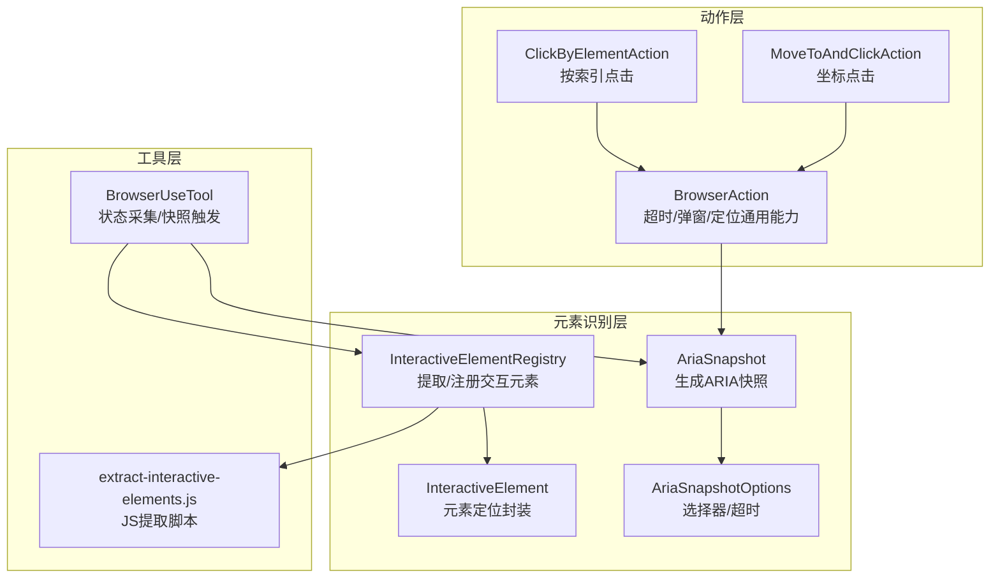
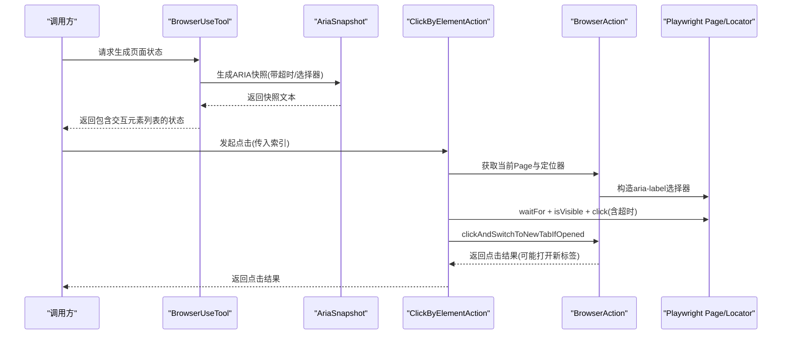
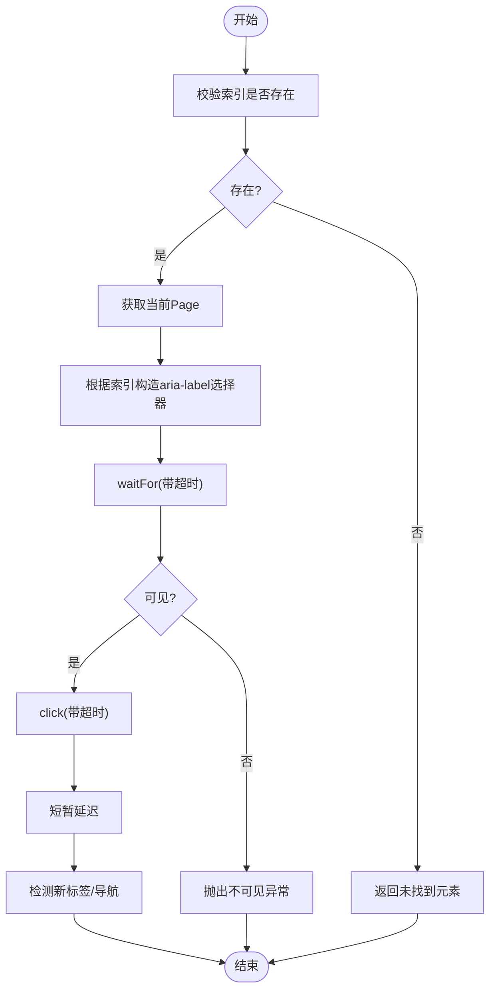
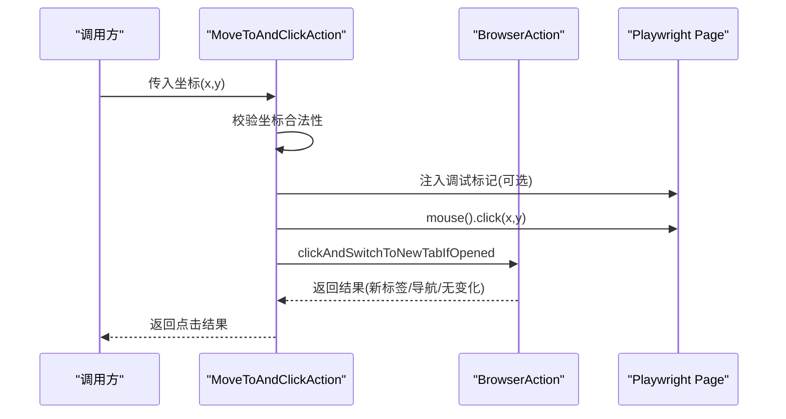
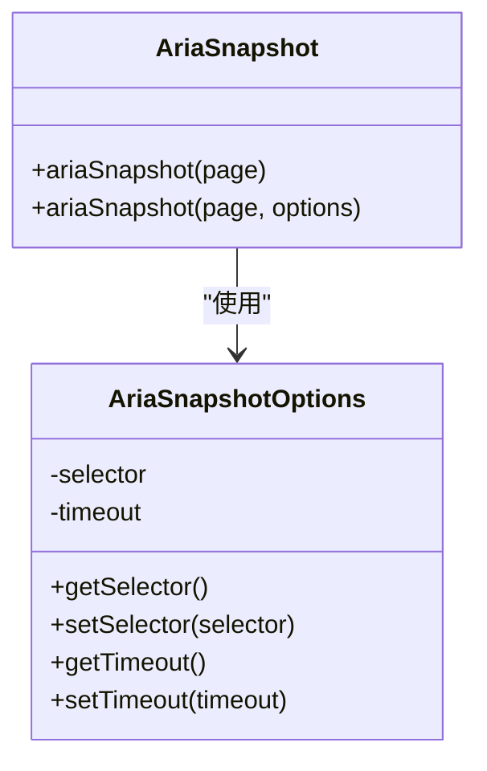
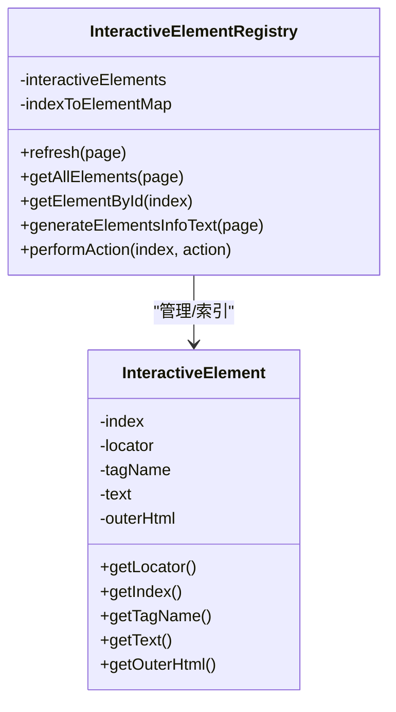
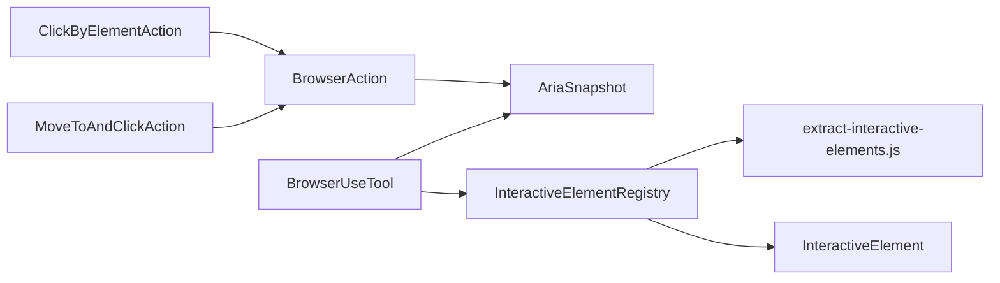

# 点击操作 (Click)

<cite>
**本文引用的文件列表**
- [ClickByElementAction.java](file://src/main/java/com/alibaba/cloud/ai/lynxe/tool/browser/actions/ClickByElementAction.java)
- [MoveToAndClickAction.java](file://src/main/java/com/alibaba/cloud/ai/lynxe/tool/browser/actions/MoveToAndClickAction.java)
- [BrowserAction.java](file://src/main/java/com/alibaba/cloud/ai/lynxe/tool/browser/actions/BrowserAction.java)
- [AriaSnapshot.java](file://src/main/java/com/alibaba/cloud/ai/lynxe/tool/browser/AriaSnapshot.java)
- [AriaSnapshotOptions.java](file://src/main/java/com/alibaba/cloud/ai/lynxe/tool/browser/AriaSnapshotOptions.java)
- [InteractiveElementRegistry.java](file://src/main/java/com/alibaba/cloud/ai/lynxe/tool/browser/InteractiveElementRegistry.java)
- [InteractiveElement.java](file://src/main/java/com/alibaba/cloud/ai/lynxe/tool/browser/InteractiveElement.java)
- [BrowserUseTool.java](file://src/main/java/com/alibaba/cloud/ai/lynxe/tool/browser/BrowserUseTool.java)
- [extract-interactive-elements.js](file://src/main/resources/tool/extract-interactive-elements.js)
</cite>

## 目录
1. [简介](#简介)
2. [项目结构与定位](#项目结构与定位)
3. [核心组件](#核心组件)
4. [架构总览](#架构总览)
5. [详细组件分析](#详细组件分析)
6. [依赖关系分析](#依赖关系分析)
7. [性能与稳定性考量](#性能与稳定性考量)
8. [故障排查指南](#故障排查指南)
9. [结论](#结论)
10. [附录：selector 参数规范与动态加载最佳实践](#附录selector-参数规范与动态加载最佳实践)

## 简介
本文件为“点击类操作”的综合参考文档，聚焦以下目标：
- 深入解析 ClickByElementAction 的元素定位机制，包括基于可访问性树（AriaSnapshot）的语义化选择器匹配逻辑，以及元素可见性、可点击性校验流程。
- 说明 MoveToAndClickAction 作为补充操作，用于处理需要先悬停再点击的复合交互场景；解释其内部如何调用 Playwright 的 click() 方法，并对 TimeoutError 或 ElementNotInteractableError 进行处理。
- 提供 selector 参数的编写规范示例（如 text=登录、role=button），并展示在动态加载页面中等待元素出现的最佳实践。

## 项目结构与定位
点击类操作位于浏览器工具模块中，围绕 Playwright 定位器与 ARIA 可访问性树进行元素识别与交互。关键路径如下：
- 动作层：ClickByElementAction、MoveToAndClickAction 继承自 BrowserAction，统一复用超时控制、弹窗检测等通用能力。
- 元素识别层：AriaSnapshot 生成页面 ARIA 快照；InteractiveElementRegistry 通过注入唯一标识与可见性/可交互性判断，构建全局索引。
- 工具层：BrowserUseTool 负责触发快照生成、状态采集与交互结果汇总。

图表来源
- [ClickByElementAction.java](file://src/main/java/com/alibaba/cloud/ai/lynxe/tool/browser/actions/ClickByElementAction.java#L1-L86)
- [MoveToAndClickAction.java](file://src/main/java/com/alibaba/cloud/ai/lynxe/tool/browser/actions/MoveToAndClickAction.java#L1-L94)
- [BrowserAction.java](file://src/main/java/com/alibaba/cloud/ai/lynxe/tool/browser/actions/BrowserAction.java#L1-L260)
- [AriaSnapshot.java](file://src/main/java/com/alibaba/cloud/ai/lynxe/tool/browser/AriaSnapshot.java#L1-L117)
- [AriaSnapshotOptions.java](file://src/main/java/com/alibaba/cloud/ai/lynxe/tool/browser/AriaSnapshotOptions.java#L1-L75)
- [InteractiveElementRegistry.java](file://src/main/java/com/alibaba/cloud/ai/lynxe/tool/browser/InteractiveElementRegistry.java#L1-L555)
- [InteractiveElement.java](file://src/main/java/com/alibaba/cloud/ai/lynxe/tool/browser/InteractiveElement.java#L1-L126)
- [BrowserUseTool.java](file://src/main/java/com/alibaba/cloud/ai/lynxe/tool/browser/BrowserUseTool.java#L480-L527)
- [extract-interactive-elements.js](file://src/main/resources/tool/extract-interactive-elements.js#L1-L408)

章节来源
- [ClickByElementAction.java](file://src/main/java/com/alibaba/cloud/ai/lynxe/tool/browser/actions/ClickByElementAction.java#L1-L86)
- [MoveToAndClickAction.java](file://src/main/java/com/alibaba/cloud/ai/lynxe/tool/browser/actions/MoveToAndClickAction.java#L1-L94)
- [BrowserAction.java](file://src/main/java/com/alibaba/cloud/ai/lynxe/tool/browser/actions/BrowserAction.java#L1-L260)
- [AriaSnapshot.java](file://src/main/java/com/alibaba/cloud/ai/lynxe/tool/browser/AriaSnapshot.java#L1-L117)
- [AriaSnapshotOptions.java](file://src/main/java/com/alibaba/cloud/ai/lynxe/tool/browser/AriaSnapshotOptions.java#L1-L75)
- [InteractiveElementRegistry.java](file://src/main/java/com/alibaba/cloud/ai/lynxe/tool/browser/InteractiveElementRegistry.java#L1-L555)
- [InteractiveElement.java](file://src/main/java/com/alibaba/cloud/ai/lynxe/tool/browser/InteractiveElement.java#L1-L126)
- [BrowserUseTool.java](file://src/main/java/com/alibaba/cloud/ai/lynxe/tool/browser/BrowserUseTool.java#L480-L527)
- [extract-interactive-elements.js](file://src/main/resources/tool/extract-interactive-elements.js#L1-L408)

## 核心组件
- ClickByElementAction：通过 ARIA 快照中的全局索引定位元素，执行可见性与可点击性校验后发起点击，并处理超时与异常。
- MoveToAndClickAction：在已知坐标处直接触发鼠标点击，支持调试模式下可视化标记，适用于“悬停后再点击”等复合交互。
- BrowserAction：提供统一的超时策略、弹窗检测与切换、定位器构造等通用能力。
- AriaSnapshot / AriaSnapshotOptions：生成页面 ARIA 快照，支持选择器与超时配置。
- InteractiveElementRegistry / InteractiveElement：在页面中提取交互元素并建立全局索引，支持可见性与可交互性判断。
- BrowserUseTool：触发快照生成与状态采集，向外部暴露交互元素列表。

章节来源
- [ClickByElementAction.java](file://src/main/java/com/alibaba/cloud/ai/lynxe/tool/browser/actions/ClickByElementAction.java#L1-L86)
- [MoveToAndClickAction.java](file://src/main/java/com/alibaba/cloud/ai/lynxe/tool/browser/actions/MoveToAndClickAction.java#L1-L94)
- [BrowserAction.java](file://src/main/java/com/alibaba/cloud/ai/lynxe/tool/browser/actions/BrowserAction.java#L1-L260)
- [AriaSnapshot.java](file://src/main/java/com/alibaba/cloud/ai/lynxe/tool/browser/AriaSnapshot.java#L1-L117)
- [AriaSnapshotOptions.java](file://src/main/java/com/alibaba/cloud/ai/lynxe/tool/browser/AriaSnapshotOptions.java#L1-L75)
- [InteractiveElementRegistry.java](file://src/main/java/com/alibaba/cloud/ai/lynxe/tool/browser/InteractiveElementRegistry.java#L1-L555)
- [InteractiveElement.java](file://src/main/java/com/alibaba/cloud/ai/lynxe/tool/browser/InteractiveElement.java#L1-L126)
- [BrowserUseTool.java](file://src/main/java/com/alibaba/cloud/ai/lynxe/tool/browser/BrowserUseTool.java#L480-L527)

## 架构总览
点击类操作的整体流程如下：
- 页面加载完成后，BrowserUseTool 触发 AriaSnapshot 生成快照，同时注入唯一 aria-label 标识，便于后续定位。
- ClickByElementAction 使用全局索引转换为 aria-label 属性选择器，定位元素；随后等待元素可见并启用，再执行点击。
- MoveToAndClickAction 在指定坐标处直接触发点击，适合“悬停后再点击”的场景。
- BrowserAction 统一处理超时、弹窗检测与切换，确保点击后能正确感知新标签页或同页导航。

图表来源
- [BrowserUseTool.java](file://src/main/java/com/alibaba/cloud/ai/lynxe/tool/browser/BrowserUseTool.java#L480-L527)
- [AriaSnapshot.java](file://src/main/java/com/alibaba/cloud/ai/lynxe/tool/browser/AriaSnapshot.java#L1-L117)
- [ClickByElementAction.java](file://src/main/java/com/alibaba/cloud/ai/lynxe/tool/browser/actions/ClickByElementAction.java#L1-L86)
- [BrowserAction.java](file://src/main/java/com/alibaba/cloud/ai/lynxe/tool/browser/actions/BrowserAction.java#L1-L260)

## 详细组件分析

### ClickByElementAction：基于 ARIA 快照的语义化定位与可见性校验
- 元素定位机制
  - 通过 BrowserAction 的 getLocatorByIdx 将全局索引转换为 aria-label 选择器，定位元素。
  - 该选择器依赖 AriaSnapshot 在注入阶段为每个元素设置唯一的 aria-label 标识，从而实现稳定定位。
- 可见性与可点击性校验
  - 先使用 waitFor 等待元素出现（受 getElementTimeoutMs 限制，最大 10 秒）。
  - 再检查元素是否可见（isVisible），仅当可见时才执行点击。
- 异常处理
  - 捕获 TimeoutError 并抛出明确错误信息；其他异常统一包装为运行时异常。
- 新标签页处理
  - 通过 clickAndSwitchToNewTabIfOpened 检测点击是否打开新标签页，或发生同页导航，并更新当前 Page。

图表来源
- [ClickByElementAction.java](file://src/main/java/com/alibaba/cloud/ai/lynxe/tool/browser/actions/ClickByElementAction.java#L1-L86)
- [BrowserAction.java](file://src/main/java/com/alibaba/cloud/ai/lynxe/tool/browser/actions/BrowserAction.java#L136-L207)
- [AriaSnapshot.java](file://src/main/java/com/alibaba/cloud/ai/lynxe/tool/browser/AriaSnapshot.java#L76-L108)

章节来源
- [ClickByElementAction.java](file://src/main/java/com/alibaba/cloud/ai/lynxe/tool/browser/actions/ClickByElementAction.java#L1-L86)
- [BrowserAction.java](file://src/main/java/com/alibaba/cloud/ai/lynxe/tool/browser/actions/BrowserAction.java#L136-L207)
- [AriaSnapshot.java](file://src/main/java/com/alibaba/cloud/ai/lynxe/tool/browser/AriaSnapshot.java#L76-L108)

### MoveToAndClickAction：坐标点击与复合交互
- 坐标点击流程
  - 校验 x/y 坐标合法性；若开启调试模式，会在页面注入红色标记点以辅助定位。
  - 直接调用 page.mouse().click(x, y) 执行点击。
- 弹窗与导航检测
  - 复用 clickAndSwitchToNewTabIfOpened 统一检测新标签页或同页导航，保证后续交互上下文一致。
- 异常处理
  - 捕获异常并统一包装为运行时异常，保留原始错误信息。

图表来源
- [MoveToAndClickAction.java](file://src/main/java/com/alibaba/cloud/ai/lynxe/tool/browser/actions/MoveToAndClickAction.java#L1-L94)
- [BrowserAction.java](file://src/main/java/com/alibaba/cloud/ai/lynxe/tool/browser/actions/BrowserAction.java#L175-L257)

章节来源
- [MoveToAndClickAction.java](file://src/main/java/com/alibaba/cloud/ai/lynxe/tool/browser/actions/MoveToAndClickAction.java#L1-L94)
- [BrowserAction.java](file://src/main/java/com/alibaba/cloud/ai/lynxe/tool/browser/actions/BrowserAction.java#L175-L257)

### AriaSnapshot 与 AriaSnapshotOptions：可访问性树生成与选择器
- AriaSnapshot
  - 在注入阶段为所有元素设置 aria-label 标识，随后使用 Playwright 的原生 ariaSnapshot 能力生成可访问性树文本。
  - 支持选择器与超时配置，等待目标选择器出现后再生成快照。
- AriaSnapshotOptions
  - 默认选择器为 body，超时默认 30 秒；可通过 setSelector/setTimeout 自定义。

图表来源
- [AriaSnapshot.java](file://src/main/java/com/alibaba/cloud/ai/lynxe/tool/browser/AriaSnapshot.java#L1-L117)
- [AriaSnapshotOptions.java](file://src/main/java/com/alibaba/cloud/ai/lynxe/tool/browser/AriaSnapshotOptions.java#L1-L75)

章节来源
- [AriaSnapshot.java](file://src/main/java/com/alibaba/cloud/ai/lynxe/tool/browser/AriaSnapshot.java#L1-L117)
- [AriaSnapshotOptions.java](file://src/main/java/com/alibaba/cloud/ai/lynxe/tool/browser/AriaSnapshotOptions.java#L1-L75)

### InteractiveElementRegistry 与 InteractiveElement：可见性与可交互性判断
- 交互元素提取
  - 通过注入唯一标识（如 lynxe-id）与 XPath，结合可见性与可交互性判断，生成全局索引。
  - 可见性判断依据元素尺寸与样式属性；可交互性判断综合光标样式、禁用状态、ARIA role/属性、事件监听等。
- 元素封装
  - InteractiveElement 封装 Locator、标签名、文本与 outerHtml，便于上层动作使用。

图表来源
- [InteractiveElementRegistry.java](file://src/main/java/com/alibaba/cloud/ai/lynxe/tool/browser/InteractiveElementRegistry.java#L1-L555)
- [InteractiveElement.java](file://src/main/java/com/alibaba/cloud/ai/lynxe/tool/browser/InteractiveElement.java#L1-L126)
- [extract-interactive-elements.js](file://src/main/resources/tool/extract-interactive-elements.js#L1-L408)

章节来源
- [InteractiveElementRegistry.java](file://src/main/java/com/alibaba/cloud/ai/lynxe/tool/browser/InteractiveElementRegistry.java#L1-L555)
- [InteractiveElement.java](file://src/main/java/com/alibaba/cloud/ai/lynxe/tool/browser/InteractiveElement.java#L1-L126)
- [extract-interactive-elements.js](file://src/main/resources/tool/extract-interactive-elements.js#L1-L408)

### BrowserUseTool：状态采集与快照触发
- 在获取浏览器状态时，先等待片刻以确保动态内容渲染完成，再生成 ARIA 快照并注入短链压缩策略，最终将交互元素列表写入状态。
- 该流程为 ClickByElementAction 的索引定位提供了基础数据来源。

章节来源
- [BrowserUseTool.java](file://src/main/java/com/alibaba/cloud/ai/lynxe/tool/browser/BrowserUseTool.java#L489-L527)

## 依赖关系分析
- ClickByElementAction 依赖 BrowserAction 的定位器构造与弹窗检测能力；间接依赖 AriaSnapshot 生成的 aria-label 标识。
- MoveToAndClickAction 依赖 BrowserAction 的弹窗检测能力；直接使用 Playwright 的 mouse().click。
- InteractiveElementRegistry 依赖 extract-interactive-elements.js 中的可见性与可交互性判断逻辑。
- BrowserUseTool 串联 AriaSnapshot 与状态输出，为上层动作提供交互元素索引。

图表来源
- [ClickByElementAction.java](file://src/main/java/com/alibaba/cloud/ai/lynxe/tool/browser/actions/ClickByElementAction.java#L1-L86)
- [MoveToAndClickAction.java](file://src/main/java/com/alibaba/cloud/ai/lynxe/tool/browser/actions/MoveToAndClickAction.java#L1-L94)
- [BrowserAction.java](file://src/main/java/com/alibaba/cloud/ai/lynxe/tool/browser/actions/BrowserAction.java#L1-L260)
- [AriaSnapshot.java](file://src/main/java/com/alibaba/cloud/ai/lynxe/tool/browser/AriaSnapshot.java#L1-L117)
- [InteractiveElementRegistry.java](file://src/main/java/com/alibaba/cloud/ai/lynxe/tool/browser/InteractiveElementRegistry.java#L1-L555)
- [InteractiveElement.java](file://src/main/java/com/alibaba/cloud/ai/lynxe/tool/browser/InteractiveElement.java#L1-L126)
- [BrowserUseTool.java](file://src/main/java/com/alibaba/cloud/ai/lynxe/tool/browser/BrowserUseTool.java#L480-L527)
- [extract-interactive-elements.js](file://src/main/resources/tool/extract-interactive-elements.js#L1-L408)

## 性能与稳定性考量
- 超时策略
  - BrowserAction 提供 getElementTimeoutMs（上限 10 秒）与 getBrowserTimeoutMs（默认 30 秒）两类超时，避免长时间阻塞。
- 弹窗检测
  - clickAndSwitchToNewTabIfOpened 在极短超时内检测新标签页，若超时则回退到 URL 差分与当前 Page 切换，提升鲁棒性。
- 动态内容渲染
  - BrowserUseTool 在生成快照前增加短暂等待，确保动态内容渲染完成，降低“元素不存在”误判概率。

章节来源
- [BrowserAction.java](file://src/main/java/com/alibaba/cloud/ai/lynxe/tool/browser/actions/BrowserAction.java#L56-L78)
- [BrowserAction.java](file://src/main/java/com/alibaba/cloud/ai/lynxe/tool/browser/actions/BrowserAction.java#L175-L257)
- [BrowserUseTool.java](file://src/main/java/com/alibaba/cloud/ai/lynxe/tool/browser/BrowserUseTool.java#L489-L498)

## 故障排查指南
- 现象：点击超时
  - 可能原因：元素未出现、不可见、被遮挡或动画未完成。
  - 排查建议：确认 ARIA 快照中是否存在该索引；适当延长等待时间或在点击前显式等待；检查页面滚动与布局变化。
- 现象：元素不可见或不可交互
  - 可能原因：元素隐藏、display:none、visibility:hidden、禁用状态或被覆盖。
  - 排查建议：使用可见性校验逻辑（如 isVisible）；检查 CSS 样式与层级；必要时采用 MoveToAndClickAction 先悬停再点击。
- 现象：未检测到新标签页
  - 可能原因：点击未触发新标签页；popup 检测超时。
  - 排查建议：使用 clickAndSwitchToNewTabIfOpened 的回退逻辑；确认点击行为是否确实打开新标签页。

章节来源
- [ClickByElementAction.java](file://src/main/java/com/alibaba/cloud/ai/lynxe/tool/browser/actions/ClickByElementAction.java#L56-L84)
- [BrowserAction.java](file://src/main/java/com/alibaba/cloud/ai/lynxe/tool/browser/actions/BrowserAction.java#L175-L257)

## 结论
- ClickByElementAction 通过 ARIA 快照与 aria-label 标识实现了稳定的语义化定位，并在点击前进行可见性与可交互性校验，显著提升了点击成功率与稳定性。
- MoveToAndClickAction 适用于“悬停后再点击”等复合交互场景，配合调试标记可快速定位坐标问题。
- BrowserAction 提供统一的超时与弹窗检测能力，是点击类操作的基础设施。
- 通过 AriaSnapshot 与 InteractiveElementRegistry 的配合，系统在动态加载页面中也能可靠地识别与交互元素。

## 附录：selector 参数规范与动态加载最佳实践
- selector 参数规范示例
  - 文本匹配：text=登录
  - 角色匹配：role=button
  - 组合匹配：role=button 和 text=登录
  - 选择器优先：优先使用 role/text 等语义化选择器，其次使用 CSS 选择器
- 动态加载页面的最佳实践
  - 在生成 ARIA 快照前增加短暂等待，确保动态内容渲染完成。
  - 使用 AriaSnapshotOptions 设置合适的超时，避免过早放弃等待。
  - 对于长列表或异步加载，可在点击前显式等待目标元素出现（例如使用 waitFor）。
  - 若点击后可能打开新标签页，使用 clickAndSwitchToNewTabIfOpened 统一处理上下文切换。

章节来源
- [AriaSnapshotOptions.java](file://src/main/java/com/alibaba/cloud/ai/lynxe/tool/browser/AriaSnapshotOptions.java#L1-L75)
- [AriaSnapshot.java](file://src/main/java/com/alibaba/cloud/ai/lynxe/tool/browser/AriaSnapshot.java#L76-L108)
- [BrowserUseTool.java](file://src/main/java/com/alibaba/cloud/ai/lynxe/tool/browser/BrowserUseTool.java#L489-L498)
- [BrowserAction.java](file://src/main/java/com/alibaba/cloud/ai/lynxe/tool/browser/actions/BrowserAction.java#L175-L257)