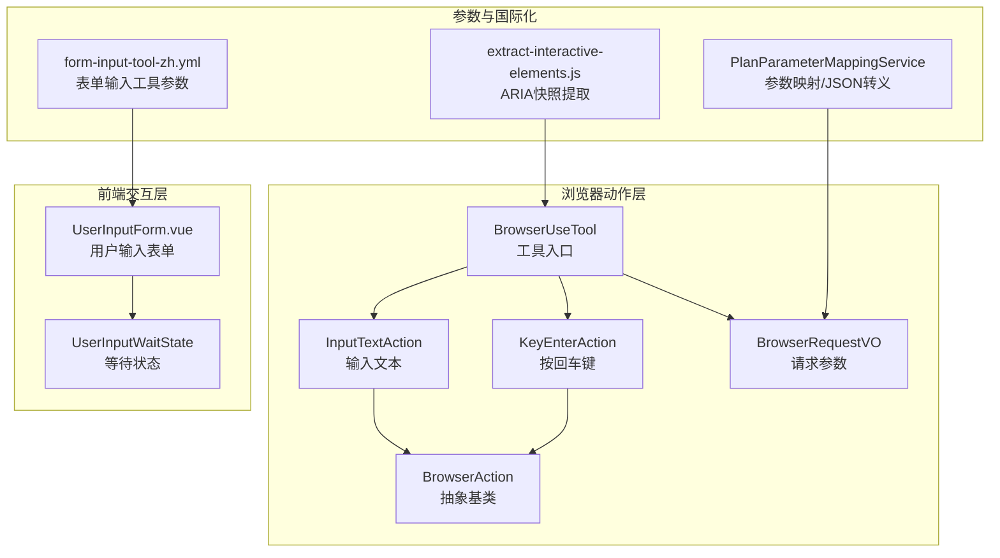
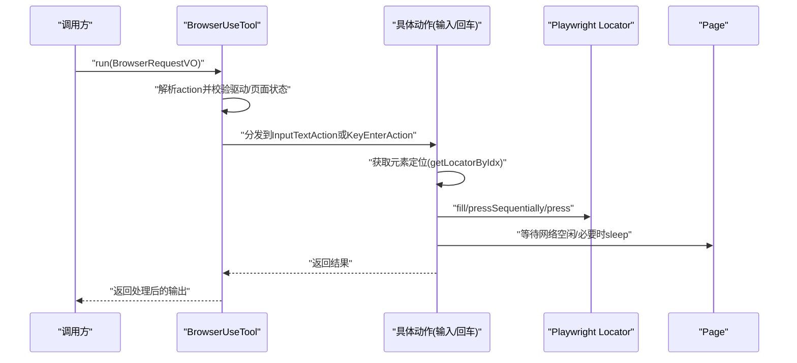
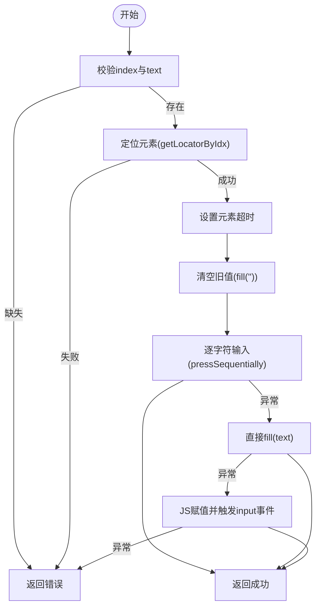
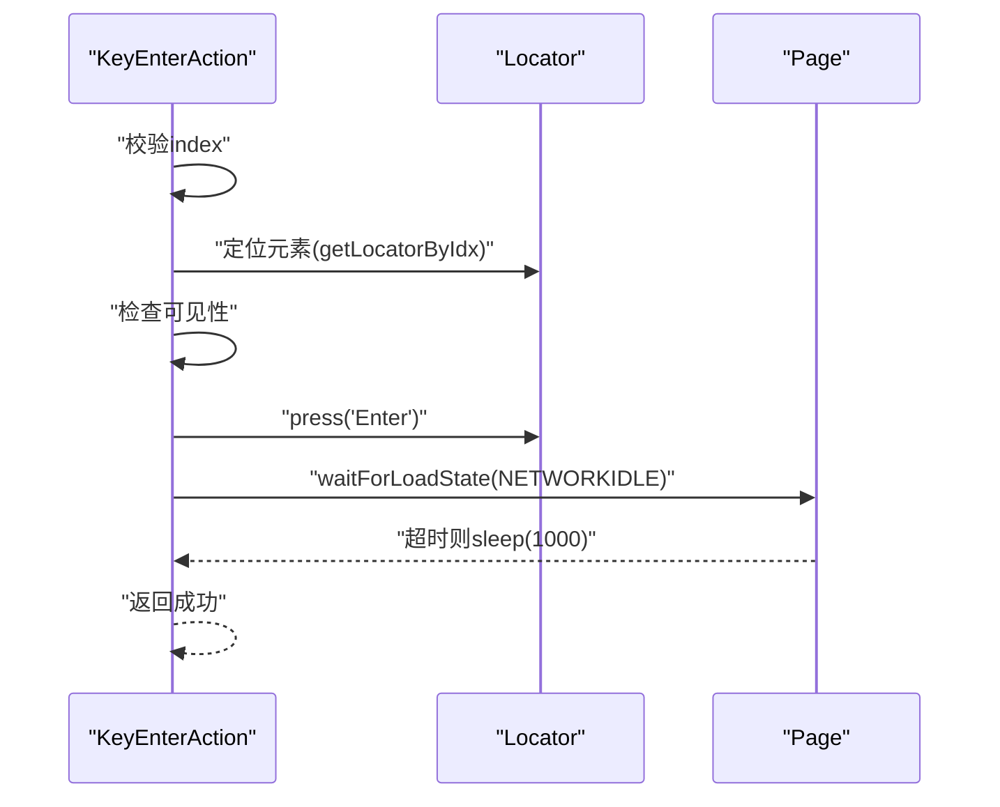
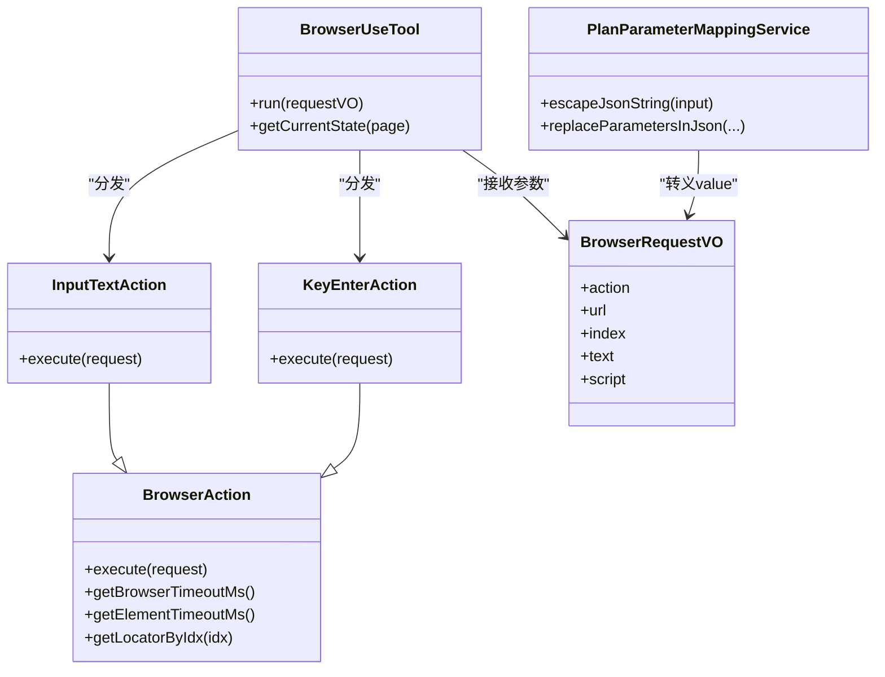

# 输入操作（输入文本）

<cite>
**本文引用的文件列表**
- [InputTextAction.java](file://src/main/java/com/alibaba/cloud/ai/lynxe/tool/browser/actions/InputTextAction.java)
- [KeyEnterAction.java](file://src/main/java/com/alibaba/cloud/ai/lynxe/tool/browser/actions/KeyEnterAction.java)
- [BrowserAction.java](file://src/main/java/com/alibaba/cloud/ai/lynxe/tool/browser/actions/BrowserAction.java)
- [BrowserUseTool.java](file://src/main/java/com/alibaba/cloud/ai/lynxe/tool/browser/BrowserUseTool.java)
- [BrowserRequestVO.java](file://src/main/java/com/alibaba/cloud/ai/lynxe/tool/browser/actions/BrowserRequestVO.java)
- [PlanParameterMappingService.java](file://src/main/java/com/alibaba/cloud/ai/lynxe/planning/service/PlanParameterMappingService.java)
- [extract-interactive-elements.js](file://src/main/resources/tool/extract-interactive-elements.js)
- [form-input-tool-zh.yml](file://src/main/resources/i18n/tools/form-input-tool-zh.yml)
- [UserInputForm.vue](file://ui-vue3/src/components/chat/UserInputForm.vue)
- [UserInputService.java](file://src/main/java/com/alibaba/cloud/ai/lynxe/runtime/service/UserInputService.java)
- [UserInputWaitState.java](file://src/main/java/com/alibaba/cloud/ai/lynxe/runtime/entity/vo/UserInputWaitState.java)
- [check-chinese-content.py](file://tools/scripts/check-chinese-content.py)
</cite>

## 目录
1. [简介](#简介)
2. [项目结构与定位](#项目结构与定位)
3. [核心组件](#核心组件)
4. [架构总览](#架构总览)
5. [详细组件分析](#详细组件分析)
6. [依赖关系分析](#依赖关系分析)
7. [性能与稳定性特性](#性能与稳定性特性)
8. [使用指南与最佳实践](#使用指南与最佳实践)
9. [故障排查](#故障排查)
10. [结论](#结论)

## 简介
本指南围绕“输入文本”能力展开，系统讲解 InputTextAction 如何向表单元素注入文本内容，支持模拟真实用户逐字符输入的行为；说明其对 input、textarea 等不同元素类型的适配与清空策略；并结合 KeyEnterAction 的作用，解释如何通过连续指令实现登录等典型场景。同时给出 value 参数的字符串转义建议、中文输入的编码注意事项与解决方案，帮助开发者在复杂页面中稳定地完成自动化输入与提交。

## 项目结构与定位
- 浏览器自动化输入相关的核心代码位于后端 Java 模块的 browser 动作包中，包含 InputTextAction、KeyEnterAction、BrowserAction 抽象基类、BrowserUseTool 工具入口以及请求参数封装对象 BrowserRequestVO。
- 前端侧的表单输入组件与用户输入等待状态模型，用于理解真实用户输入形态与交互流程，便于设计自动化输入序列。
- 提供了参数映射与 JSON 转义工具，有助于在计划模板中正确传递包含特殊字符的字符串值。

图表来源
- [BrowserUseTool.java](file://src/main/java/com/alibaba/cloud/ai/lynxe/tool/browser/BrowserUseTool.java#L163-L180)
- [InputTextAction.java](file://src/main/java/com/alibaba/cloud/ai/lynxe/tool/browser/actions/InputTextAction.java#L28-L87)
- [KeyEnterAction.java](file://src/main/java/com/alibaba/cloud/ai/lynxe/tool/browser/actions/KeyEnterAction.java#L29-L77)
- [BrowserAction.java](file://src/main/java/com/alibaba/cloud/ai/lynxe/tool/browser/actions/BrowserAction.java#L136-L164)
- [BrowserRequestVO.java](file://src/main/java/com/alibaba/cloud/ai/lynxe/tool/browser/actions/BrowserRequestVO.java#L23-L50)
- [UserInputForm.vue](file://ui-vue3/src/components/chat/UserInputForm.vue#L31-L115)
- [UserInputWaitState.java](file://src/main/java/com/alibaba/cloud/ai/lynxe/runtime/entity/vo/UserInputWaitState.java#L55-L83)
- [PlanParameterMappingService.java](file://src/main/java/com/alibaba/cloud/ai/lynxe/planning/service/PlanParameterMappingService.java#L170-L186)
- [extract-interactive-elements.js](file://src/main/resources/tool/extract-interactive-elements.js#L282-L317)
- [form-input-tool-zh.yml](file://src/main/resources/i18n/tools/form-input-tool-zh.yml#L1-L58)

章节来源
- [BrowserUseTool.java](file://src/main/java/com/alibaba/cloud/ai/lynxe/tool/browser/BrowserUseTool.java#L163-L180)
- [BrowserAction.java](file://src/main/java/com/alibaba/cloud/ai/lynxe/tool/browser/actions/BrowserAction.java#L136-L164)
- [BrowserRequestVO.java](file://src/main/java/com/alibaba/cloud/ai/lynxe/tool/browser/actions/BrowserRequestVO.java#L23-L50)
- [UserInputForm.vue](file://ui-vue3/src/components/chat/UserInputForm.vue#L31-L115)
- [PlanParameterMappingService.java](file://src/main/java/com/alibaba/cloud/ai/lynxe/planning/service/PlanParameterMappingService.java#L170-L186)

## 核心组件
- InputTextAction：负责将文本注入到指定索引的表单元素中，支持清空旧值、逐字符输入、降级填充与事件触发。
- KeyEnterAction：在指定索引元素上按下回车键，等待网络空闲以确保提交/搜索生效。
- BrowserAction：提供通用的元素定位、超时控制、人类行为模拟、弹窗检测等基础能力。
- BrowserUseTool：统一入口，根据 action 分发到具体动作，内置重试与智能内容处理。
- BrowserRequestVO：封装 action、index、text 等参数。
- 前端 UserInputForm.vue 与 UserInputWaitState：展示真实用户输入形态，辅助设计自动化输入序列。
- PlanParameterMappingService：提供 JSON 字符串转义，保障模板中 value 参数安全传入。

章节来源
- [InputTextAction.java](file://src/main/java/com/alibaba/cloud/ai/lynxe/tool/browser/actions/InputTextAction.java#L28-L87)
- [KeyEnterAction.java](file://src/main/java/com/alibaba/cloud/ai/lynxe/tool/browser/actions/KeyEnterAction.java#L29-L77)
- [BrowserAction.java](file://src/main/java/com/alibaba/cloud/ai/lynxe/tool/browser/actions/BrowserAction.java#L56-L78)
- [BrowserUseTool.java](file://src/main/java/com/alibaba/cloud/ai/lynxe/tool/browser/BrowserUseTool.java#L163-L180)
- [BrowserRequestVO.java](file://src/main/java/com/alibaba/cloud/ai/lynxe/tool/browser/actions/BrowserRequestVO.java#L23-L50)
- [UserInputForm.vue](file://ui-vue3/src/components/chat/UserInputForm.vue#L31-L115)
- [UserInputWaitState.java](file://src/main/java/com/alibaba/cloud/ai/lynxe/runtime/entity/vo/UserInputWaitState.java#L55-L83)
- [PlanParameterMappingService.java](file://src/main/java/com/alibaba/cloud/ai/lynxe/planning/service/PlanParameterMappingService.java#L170-L186)

## 架构总览
下图展示了浏览器工具的调用链路与关键步骤：BrowserUseTool 接收请求，按 action 分发至 InputTextAction 或 KeyEnterAction；InputTextAction 使用 BrowserAction 的定位与超时机制，执行清空、逐字符输入、降级填充与事件触发；KeyEnterAction 在可见且启用的元素上按 Enter 并等待网络空闲。

图表来源
- [BrowserUseTool.java](file://src/main/java/com/alibaba/cloud/ai/lynxe/tool/browser/BrowserUseTool.java#L163-L180)
- [InputTextAction.java](file://src/main/java/com/alibaba/cloud/ai/lynxe/tool/browser/actions/InputTextAction.java#L28-L87)
- [KeyEnterAction.java](file://src/main/java/com/alibaba/cloud/ai/lynxe/tool/browser/actions/KeyEnterAction.java#L29-L77)
- [BrowserAction.java](file://src/main/java/com/alibaba/cloud/ai/lynxe/tool/browser/actions/BrowserAction.java#L136-L164)

## 详细组件分析

### InputTextAction 组件分析
- 参数与前置校验：需要 index 与 text；若缺失则直接返回错误。
- 定位与超时：通过 BrowserAction 的 getLocatorByIdx 获取元素定位，并设置元素操作超时上限。
- 清空策略：优先尝试清空后再输入，保证覆盖旧值。
- 逐字符输入：使用 pressSequentially 并设置字符间隔延迟，模拟人类输入节奏。
- 降级策略：
  - 若 fill 失败，尝试直接 fill；
  - 再失败则通过 evaluate 执行 JS 赋值并手动触发 input 事件，确保页面联动正常。
- 后置等待：输入完成后 sleep 500ms，让页面有时间响应与更新。
- 返回结果：封装成功信息，包含注入的文本与目标索引。

图表来源
- [InputTextAction.java](file://src/main/java/com/alibaba/cloud/ai/lynxe/tool/browser/actions/InputTextAction.java#L28-L87)
- [BrowserAction.java](file://src/main/java/com/alibaba/cloud/ai/lynxe/tool/browser/actions/BrowserAction.java#L136-L164)

章节来源
- [InputTextAction.java](file://src/main/java/com/alibaba/cloud/ai/lynxe/tool/browser/actions/InputTextAction.java#L28-L87)

### KeyEnterAction 组件分析
- 参数与前置校验：需要 index；若缺失返回错误。
- 定位与可见性检查：通过 getLocatorByIdx 获取元素；若不可见返回错误。
- 回车操作：对元素执行 press("Enter")，并设置超时。
- 网络等待：等待 NETWORKIDLE，若超时则短暂停顿，确保搜索/提交请求完成。
- 返回结果：封装成功信息，包含索引。

图表来源
- [KeyEnterAction.java](file://src/main/java/com/alibaba/cloud/ai/lynxe/tool/browser/actions/KeyEnterAction.java#L29-L77)

章节来源
- [KeyEnterAction.java](file://src/main/java/com/alibaba/cloud/ai/lynxe/tool/browser/actions/KeyEnterAction.java#L29-L77)

### BrowserAction 基类能力
- 超时配置：提供浏览器与元素操作的超时方法，元素操作超时上限为 10 秒。
- 定位方法：通过 ARIA 快照中的 aria-id 生成 data-aria-id 属性选择器进行定位。
- 人类行为模拟：随机延时，提升自动化行为的真实性。
- 弹窗检测：点击后检测新标签页打开或导航变化，增强鲁棒性。

章节来源
- [BrowserAction.java](file://src/main/java/com/alibaba/cloud/ai/lynxe/tool/browser/actions/BrowserAction.java#L56-L78)
- [BrowserAction.java](file://src/main/java/com/alibaba/cloud/ai/lynxe/tool/browser/actions/BrowserAction.java#L136-L164)
- [BrowserAction.java](file://src/main/java/com/alibaba/cloud/ai/lynxe/tool/browser/actions/BrowserAction.java#L175-L257)

### BrowserUseTool 分发与重试
- 动作分发：根据 action 字段分发到对应动作类（如 input_text、key_enter）。
- 驱动与页面校验：在执行前校验驱动可用、浏览器连接、当前页面有效。
- 重试机制：对超时与可重试异常进行最多两次重试，提升稳定性。
- 智能内容处理：对长输出进行摘要处理，减少传输与存储开销。

章节来源
- [BrowserUseTool.java](file://src/main/java/com/alibaba/cloud/ai/lynxe/tool/browser/BrowserUseTool.java#L163-L180)
- [BrowserUseTool.java](file://src/main/java/com/alibaba/cloud/ai/lynxe/tool/browser/BrowserUseTool.java#L293-L349)
- [BrowserUseTool.java](file://src/main/java/com/alibaba/cloud/ai/lynxe/tool/browser/BrowserUseTool.java#L361-L399)

### 前端交互参考：UserInputForm 与表单类型
- 支持多种输入类型：text、email、number、password、textarea、select、checkbox、radio。
- 通过 v-model 绑定输入值，便于理解真实用户输入形态。
- 结合 UserInputWaitState 的 formInputs 列表，可推导出自动化输入的目标字段与类型。

章节来源
- [UserInputForm.vue](file://ui-vue3/src/components/chat/UserInputForm.vue#L31-L115)
- [UserInputWaitState.java](file://src/main/java/com/alibaba/cloud/ai/lynxe/runtime/entity/vo/UserInputWaitState.java#L55-L83)
- [form-input-tool-zh.yml](file://src/main/resources/i18n/tools/form-input-tool-zh.yml#L1-L58)

## 依赖关系分析
- InputTextAction 与 KeyEnterAction 均继承自 BrowserAction，共享定位、超时与人类行为模拟能力。
- BrowserUseTool 作为统一入口，持有 ChromeDriverService、SmartContentSavingService、ObjectMapper、ShortUrlService、TextFileService、ToolI18nService 等依赖，负责动作调度与结果处理。
- BrowserRequestVO 作为参数载体，承载 action、index、text 等关键字段。
- PlanParameterMappingService 提供 JSON 字符串转义，避免模板中特殊字符导致解析错误。

图表来源
- [BrowserAction.java](file://src/main/java/com/alibaba/cloud/ai/lynxe/tool/browser/actions/BrowserAction.java#L35-L164)
- [InputTextAction.java](file://src/main/java/com/alibaba/cloud/ai/lynxe/tool/browser/actions/InputTextAction.java#L28-L87)
- [KeyEnterAction.java](file://src/main/java/com/alibaba/cloud/ai/lynxe/tool/browser/actions/KeyEnterAction.java#L29-L77)
- [BrowserUseTool.java](file://src/main/java/com/alibaba/cloud/ai/lynxe/tool/browser/BrowserUseTool.java#L163-L180)
- [BrowserRequestVO.java](file://src/main/java/com/alibaba/cloud/ai/lynxe/tool/browser/actions/BrowserRequestVO.java#L23-L50)
- [PlanParameterMappingService.java](file://src/main/java/com/alibaba/cloud/ai/lynxe/planning/service/PlanParameterMappingService.java#L170-L186)

## 性能与稳定性特性
- 超时控制：浏览器默认超时由 LynxeProperties 提供，元素操作超时上限为 10 秒，避免长时间阻塞。
- 重试机制：对超时与部分运行时异常进行最多两次重试，提高成功率。
- 人类行为模拟：随机延时，降低被反爬/风控识别的风险。
- 网络等待：KeyEnterAction 在回车后等待 NETWORKIDLE，确保异步请求完成，再继续后续步骤。

章节来源
- [BrowserAction.java](file://src/main/java/com/alibaba/cloud/ai/lynxe/tool/browser/actions/BrowserAction.java#L56-L78)
- [BrowserUseTool.java](file://src/main/java/com/alibaba/cloud/ai/lynxe/tool/browser/BrowserUseTool.java#L293-L349)
- [KeyEnterAction.java](file://src/main/java/com/alibaba/cloud/ai/lynxe/tool/browser/actions/KeyEnterAction.java#L52-L67)

## 使用指南与最佳实践

### 1. 向表单注入文本（input、textarea）
- 步骤
  - 通过浏览器工具获取 ARIA 快照，确认目标元素的索引。
  - 调用 input_text 动作，传入 index 与 text。
  - 若页面存在只读/禁用状态，需先定位并处理这些属性，或改用 JS 赋值与事件触发。
- 适配策略
  - input：优先 fill 清空后逐字符输入；失败时直接 fill；仍失败则 JS 赋值并触发 input 事件。
  - textarea：与 input 类似，但注意换行符与多行文本的处理。
- 清空策略
  - 在逐字符输入前先执行一次清空，确保覆盖旧值。
- 人类行为模拟
  - 可结合 BrowserAction 的随机延时，提升输入真实性。

章节来源
- [InputTextAction.java](file://src/main/java/com/alibaba/cloud/ai/lynxe/tool/browser/actions/InputTextAction.java#L28-L87)
- [BrowserAction.java](file://src/main/java/com/alibaba/cloud/ai/lynxe/tool/browser/actions/BrowserAction.java#L80-L92)

### 2. 触发表单提交或搜索（KeyEnterAction）
- 步骤
  - 确认目标元素可见且启用。
  - 调用 key_enter 动作，传入 index。
  - 等待 NETWORKIDLE，确保请求完成。
- 适用场景
  - 登录页的“登录/搜索”按钮或输入框按回车。
  - 搜索页的回车触发搜索。

章节来源
- [KeyEnterAction.java](file://src/main/java/com/alibaba/cloud/ai/lynxe/tool/browser/actions/KeyEnterAction.java#L29-L77)

### 3. 连续指令序列示例：登录场景
- 序列
  - input_text：在用户名输入框注入用户名（index 对应用户名字段）。
  - input_text：在密码输入框注入密码（index 对应密码字段）。
  - key_enter：在登录按钮或密码输入框上按回车，触发登录。
- 注意
  - 在调用 key_enter 前，确保页面已加载完成并可交互。
  - 若登录按钮不可见或禁用，需先定位并点击按钮，或使用 JS 触发提交。

章节来源
- [BrowserUseTool.java](file://src/main/java/com/alibaba/cloud/ai/lynxe/tool/browser/BrowserUseTool.java#L163-L180)
- [KeyEnterAction.java](file://src/main/java/com/alibaba/cloud/ai/lynxe/tool/browser/actions/KeyEnterAction.java#L29-L77)
- [UserInputForm.vue](file://ui-vue3/src/components/chat/UserInputForm.vue#L31-L115)

### 4. value 参数的字符串转义要求
- 问题背景
  - 计划模板中使用 <<placeholder>> 占位符，替换时需要对字符串进行 JSON 转义，防止解析错误。
- 解决方案
  - 使用 PlanParameterMappingService 的 escapeJsonString 方法，转义反斜杠、双引号、换行、回车、制表符等。
  - 替换完成后，value 参数可安全传入 input_text 的 text 字段。

章节来源
- [PlanParameterMappingService.java](file://src/main/java/com/alibaba/cloud/ai/lynxe/planning/service/PlanParameterMappingService.java#L170-L186)

### 5. 中文输入的编码问题与解决方案
- 常见问题
  - 页面编码与 Playwright 输入编码不一致，导致中文乱码或输入失败。
  - 模板中直接写入中文，不符合代码规范与国际化要求。
- 解决方案
  - 使用 UTF-8 编码保存源文件与资源文件，确保模板与脚本无 BOM。
  - 将中文文案放入 i18n 配置文件，前端通过 $t(key) 引用，后端通过工具国际化服务获取描述与参数说明。
  - 在模板中使用 <<占位符>> 替代硬编码中文，通过参数映射服务进行转义与替换。
  - 代码注释与测试数据尽量使用英文或占位符，遵循仓库内检查脚本的建议。

章节来源
- [check-chinese-content.py](file://tools/scripts/check-chinese-content.py#L142-L283)
- [form-input-tool-zh.yml](file://src/main/resources/i18n/tools/form-input-tool-zh.yml#L1-L58)

## 故障排查
- 定位失败
  - 现象：提示无法创建元素定位或未找到元素。
  - 处理：确认 ARIA 快照已生成且 index 正确；检查元素是否被隐藏或禁用。
- 超时错误
  - 现象：输入或回车超时。
  - 处理：适当增大 LynxeProperties 的浏览器超时配置；对关键步骤增加等待与重试。
- 无响应/未提交
  - 现象：输入完成但页面无变化。
  - 处理：在 key_enter 后等待 NETWORKIDLE；若仍无响应，检查元素是否可见与启用，必要时改为点击按钮或 JS 提交。
- 中文乱码
  - 现象：中文显示异常或输入无效。
  - 处理：确保模板与脚本 UTF-8 编码；使用 i18n 与参数转义；避免在代码中直接写中文。

章节来源
- [BrowserAction.java](file://src/main/java/com/alibaba/cloud/ai/lynxe/tool/browser/actions/BrowserAction.java#L136-L164)
- [KeyEnterAction.java](file://src/main/java/com/alibaba/cloud/ai/lynxe/tool/browser/actions/KeyEnterAction.java#L52-L67)
- [BrowserUseTool.java](file://src/main/java/com/alibaba/cloud/ai/lynxe/tool/browser/BrowserUseTool.java#L293-L349)
- [PlanParameterMappingService.java](file://src/main/java/com/alibaba/cloud/ai/lynxe/planning/service/PlanParameterMappingService.java#L170-L186)

## 结论
InputTextAction 与 KeyEnterAction 构成了浏览器自动化输入与提交的核心能力。前者通过清空、逐字符输入与降级策略，确保在不同页面与元素类型下的稳定注入；后者通过回车与网络等待，可靠触发提交/搜索。配合 BrowserUseTool 的重试与智能处理、BrowserAction 的定位与超时控制，以及 PlanParameterMappingService 的 JSON 转义与国际化策略，可在复杂场景中实现高可靠、可维护的自动化输入流程。中文输入方面，建议采用 UTF-8 编码、i18n 与参数转义，避免硬编码中文带来的兼容性问题。