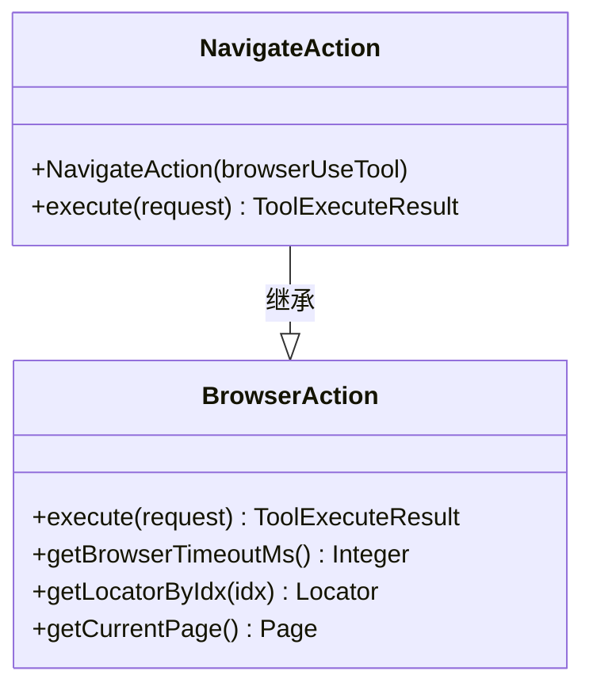
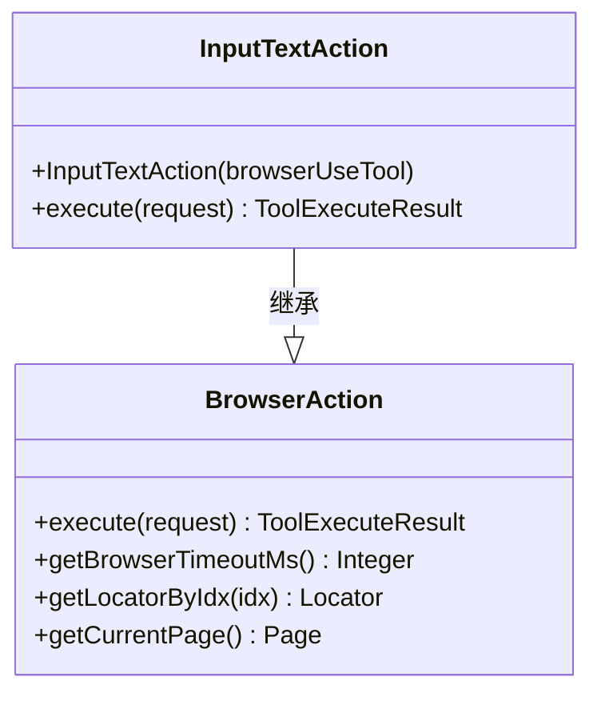
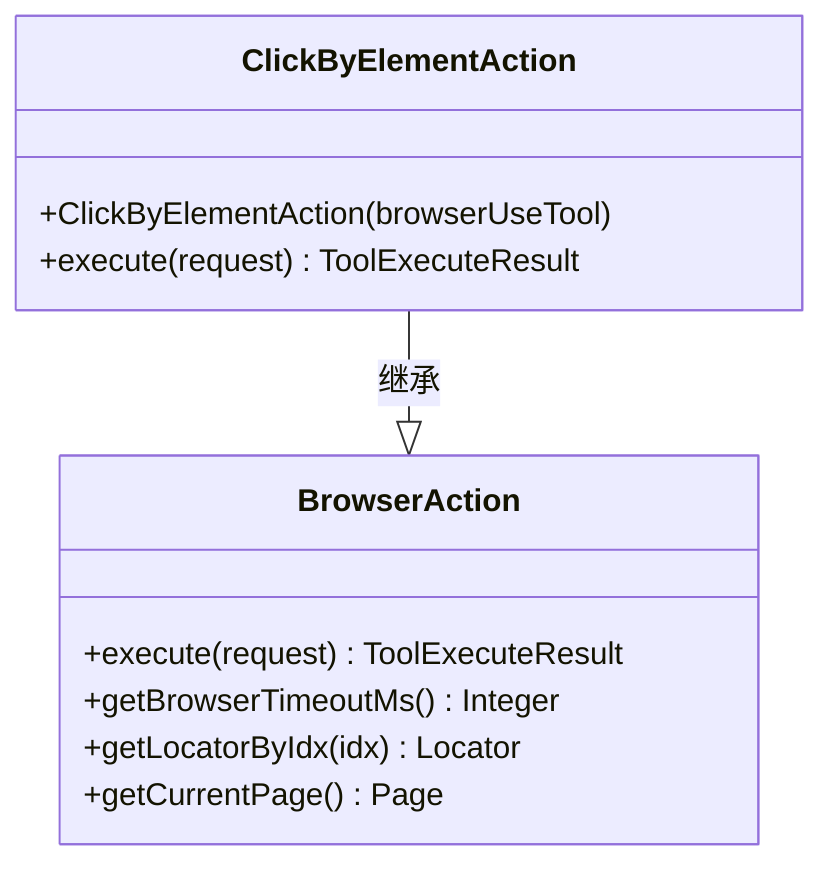
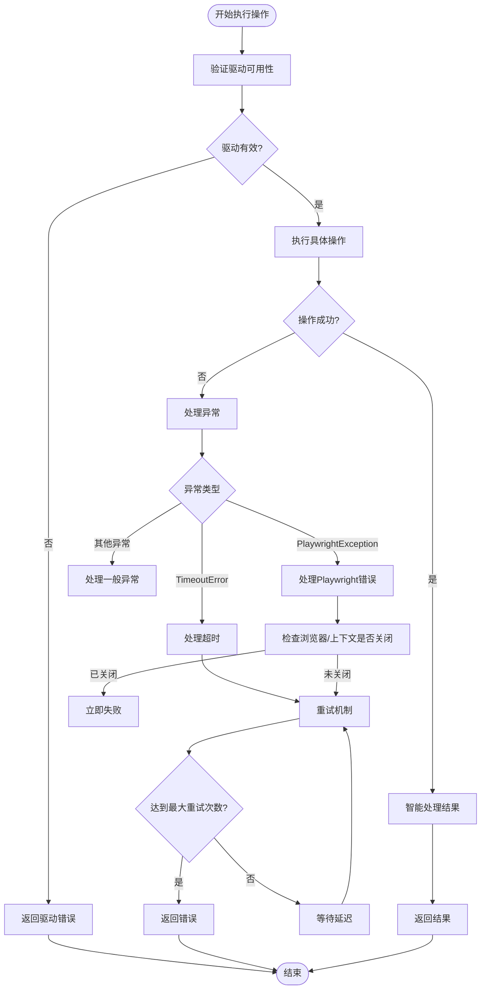
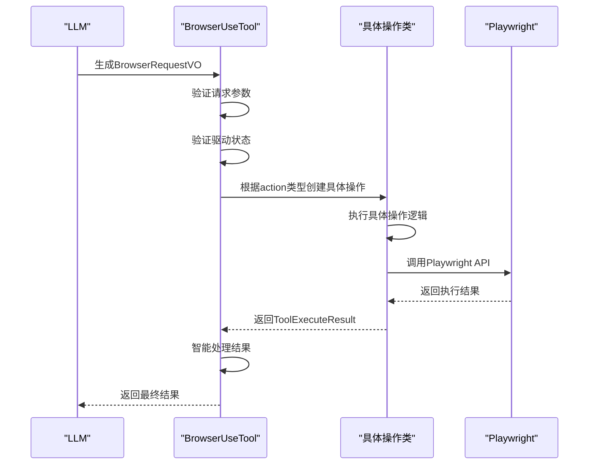
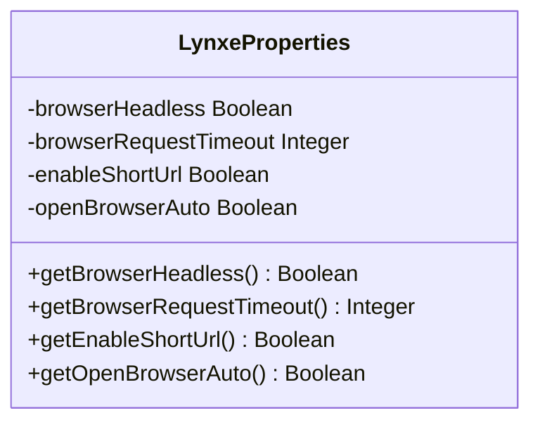

# 浏览器操作请求处理

<cite>
**本文档引用的文件**   
- [BrowserRequestVO.java](file://src/main/java/com/alibaba/cloud/ai/lynxe/tool/browser/actions/BrowserRequestVO.java)
- [BrowserAction.java](file://src/main/java/com/alibaba/cloud/ai/lynxe/tool/browser/actions/BrowserAction.java)
- [BrowserUseTool.java](file://src/main/java/com/alibaba/cloud/ai/lynxe/tool/browser/BrowserUseTool.java)
- [InputTextAction.java](file://src/main/java/com/alibaba/cloud/ai/lynxe/tool/browser/actions/InputTextAction.java)
- [NavigateAction.java](file://src/main/java/com/alibaba/cloud/ai/lynxe/tool/browser/actions/NavigateAction.java)
- [ClickByElementAction.java](file://src/main/java/com/alibaba/cloud/ai/lynxe/tool/browser/actions/ClickByElementAction.java)
- [LynxeProperties.java](file://src/main/java/com/alibaba/cloud/ai/lynxe/config/LynxeProperties.java)
- [KeyEnterAction.java](file://src/main/java/com/alibaba/cloud/ai/lynxe/tool/browser/actions/KeyEnterAction.java)
</cite>

## 目录
1. [简介](#简介)
2. [核心数据模型](#核心数据模型)
3. [操作执行架构](#操作执行架构)
4. [请求验证与异常处理](#请求验证与异常处理)
5. [完整操作链路](#完整操作链路)
6. [配置与超时管理](#配置与超时管理)
7. [结论](#结论)

## 简介
本文档详细说明了浏览器操作请求的处理机制，重点阐述了`BrowserRequestVO`数据模型如何定义标准化的操作指令结构，以及`BrowserAction`接口及其实现类如何解析请求并执行相应操作。文档还解释了请求验证流程、异常处理机制和降级策略，并通过具体示例展示了从LLM生成指令到实际浏览器交互的完整链路。

**Section sources**
- [BrowserUseTool.java](file://src/main/java/com/alibaba/cloud/ai/lynxe/tool/browser/BrowserUseTool.java#L1-L100)

## 核心数据模型

`BrowserRequestVO`类是浏览器操作请求的核心数据模型，它定义了所有浏览器操作的标准化指令结构。该模型通过一系列字段来封装不同类型的操作参数，确保了请求的类型安全和参数校验。

主要字段包括：
- **action**: 操作类型，支持`navigate`、`click`、`input_text`、`key_enter`等15种操作
- **url**: 目标URL，用于`navigate`和`new_tab`操作
- **index**: 元素索引，用于`click`、`input_text`和`key_enter`操作
- **text**: 输入文本，用于`input_text`操作
- **script**: JavaScript代码，用于`execute_js`操作
- **scrollAmount**: 滚动像素，用于`scroll`操作
- **tabId**: 选项卡ID，用于`switch_tab`操作
- **elementName**: 元素名称，用于`get_element_position`操作
- **positionX/positionY**: 坐标，用于`move_to_and_click`操作

该模型通过`@JsonProperty`注解确保了JSON序列化/反序列化的正确性，并为每个字段提供了完整的getter和setter方法。

**Section sources**
- [BrowserRequestVO.java](file://src/main/java/com/alibaba/cloud/ai/lynxe/tool/browser/actions/BrowserRequestVO.java#L23-L178)

## 操作执行架构

浏览器操作的执行基于一个清晰的架构设计，其中`BrowserUseTool`作为主入口，`BrowserAction`作为抽象基类，以及多个具体实现类来处理不同类型的操作。

### 基类设计
`BrowserAction`是一个抽象类，定义了所有浏览器操作的公共行为和工具方法。它提供了以下关键功能：
- `execute`抽象方法，由子类实现具体操作逻辑
- 超时管理方法，包括`getBrowserTimeoutMs()`和`getElementTimeoutMs()`
- 元素定位方法`getLocatorByIdx()`，通过ARIA快照索引定位元素
- 页面状态获取方法`getCurrentPage()`
- 异常处理和重试机制

### 具体实现类
每个操作类型都有对应的实现类，这些类继承自`BrowserAction`并实现具体的业务逻辑：

#### 导航操作 (NavigateAction)


**Diagram sources**
- [NavigateAction.java](file://src/main/java/com/alibaba/cloud/ai/lynxe/tool/browser/actions/NavigateAction.java#L25-L78)
- [BrowserAction.java](file://src/main/java/com/alibaba/cloud/ai/lynxe/tool/browser/actions/BrowserAction.java#L35-L260)

#### 文本输入操作 (InputTextAction)


**Diagram sources**
- [InputTextAction.java](file://src/main/java/com/alibaba/cloud/ai/lynxe/tool/browser/actions/InputTextAction.java#L22-L88)
- [BrowserAction.java](file://src/main/java/com/alibaba/cloud/ai/lynxe/tool/browser/actions/BrowserAction.java#L35-L260)

#### 点击操作 (ClickByElementAction)


**Diagram sources**
- [ClickByElementAction.java](file://src/main/java/com/alibaba/cloud/ai/lynxe/tool/browser/actions/ClickByElementAction.java#L23-L87)
- [BrowserAction.java](file://src/main/java/com/alibaba/cloud/ai/lynxe/tool/browser/actions/BrowserAction.java#L35-L260)

## 请求验证与异常处理

浏览器操作请求的处理包含多层次的验证和异常处理机制，确保系统的稳定性和可靠性。

### 请求验证流程
请求验证在`BrowserUseTool.run()`方法中进行，主要步骤包括：
1. 验证`action`参数是否为空
2. 验证浏览器驱动是否可用
3. 检查浏览器连接状态
4. 验证当前页面是否有效
5. 根据具体操作类型验证必需参数

例如，在`InputTextAction`中，会验证`index`和`text`参数是否为空：
```java
if (index == null || text == null) {
    return new ToolExecuteResult("Index and text are required for 'input_text' action");
}
```

### 异常处理机制
系统实现了全面的异常处理策略，包括：

#### 分层异常处理


**Diagram sources**
- [BrowserUseTool.java](file://src/main/java/com/alibaba/cloud/ai/lynxe/tool/browser/BrowserUseTool.java#L124-L290)

#### 重试机制
系统实现了智能重试机制，通过`executeActionWithRetry`方法实现：
- 最大重试次数：2次
- 重试延迟：1秒
- 对于某些不可恢复的异常（如浏览器已关闭），不会进行重试
- 重试前会等待指定的延迟时间

**Section sources**
- [BrowserUseTool.java](file://src/main/java/com/alibaba/cloud/ai/lynxe/tool/browser/BrowserUseTool.java#L296-L348)

## 完整操作链路

从LLM生成指令到实际浏览器交互的完整链路如下：

### 操作执行流程


**Diagram sources**
- [BrowserUseTool.java](file://src/main/java/com/alibaba/cloud/ai/lynxe/tool/browser/BrowserUseTool.java#L124-L290)
- [InputTextAction.java](file://src/main/java/com/alibaba/cloud/ai/lynxe/tool/browser/actions/InputTextAction.java#L28-L87)

### 具体操作示例
以`input_text`操作为例，其执行流程如下：

1. LLM生成包含`action="input_text"`、`index=5`、`text="搜索关键词"`的`BrowserRequestVO`
2. `BrowserUseTool`接收到请求，验证参数和驱动状态
3. 根据`action`类型创建`InputTextAction`实例
4. `InputTextAction.execute()`方法被调用：
   - 验证`index`和`text`参数
   - 通过`getLocatorByIdx(index)`获取元素定位器
   - 尝试使用`pressSequentially`方法输入文本
   - 如果失败，尝试直接`fill`方法
   - 如果仍然失败，使用JavaScript直接赋值
5. 操作成功后，等待500ms让页面更新
6. 返回成功结果

**Section sources**
- [InputTextAction.java](file://src/main/java/com/alibaba/cloud/ai/lynxe/tool/browser/actions/InputTextAction.java#L28-L87)
- [BrowserUseTool.java](file://src/main/java/com/alibaba/cloud/ai/lynxe/tool/browser/BrowserUseTool.java#L173-L175)

## 配置与超时管理

系统通过配置和超时管理确保浏览器操作的稳定性和性能。

### 配置管理
`LynxeProperties`类管理所有浏览器相关的配置：



**Diagram sources**
- [LynxeProperties.java](file://src/main/java/com/alibaba/cloud/ai/lynxe/config/LynxeProperties.java#L37-L146)

关键配置项包括：
- **browserRequestTimeout**: 浏览器请求超时时间，默认30秒
- **browserHeadless**: 是否以无头模式运行浏览器
- **enableShortUrl**: 是否启用短URL功能
- **openBrowserAuto**: 是否自动打开浏览器

### 超时策略
系统实现了多层次的超时策略：

1. **全局超时**: 从`LynxeProperties`获取，默认30秒
2. **元素操作超时**: 取全局超时和10秒的最小值，防止元素定位时长时间等待
3. **操作重试超时**: 在重试机制中，每次重试都有独立的超时控制

`BrowserAction`基类提供了统一的超时管理方法：
```java
protected Integer getBrowserTimeoutMs() {
    Integer timeout = getBrowserUseTool().getLynxeProperties().getBrowserRequestTimeout();
    return (timeout != null ? timeout : 30) * 1000;
}

protected Integer getElementTimeoutMs() {
    return Math.min(getBrowserTimeoutMs(), 10000);
}
```

**Section sources**
- [BrowserAction.java](file://src/main/java/com/alibaba/cloud/ai/lynxe/tool/browser/actions/BrowserAction.java#L56-L78)
- [LynxeProperties.java](file://src/main/java/com/alibaba/cloud/ai/lynxe/config/LynxeProperties.java#L57-L73)

## 结论
浏览器操作请求处理系统通过`BrowserRequestVO`数据模型实现了标准化的操作指令结构，确保了类型安全和参数校验。`BrowserAction`接口及其实现类提供了清晰的扩展架构，使得新增操作类型变得简单。系统通过多层次的验证、异常处理和重试机制，确保了在各种异常情况下的稳定性和可靠性。配置和超时管理机制使得系统具有良好的可配置性和性能控制能力。整个设计体现了高内聚、低耦合的原则，为LLM与浏览器的交互提供了强大而稳定的基础。