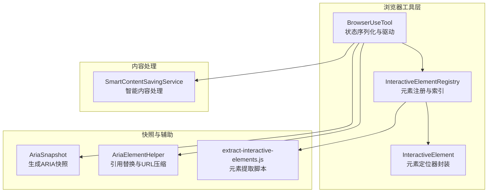
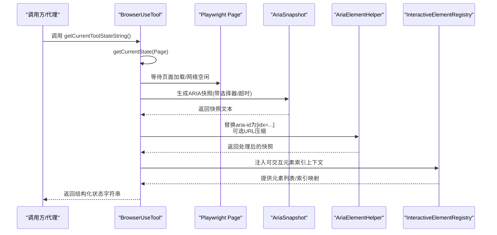
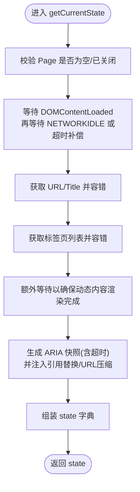
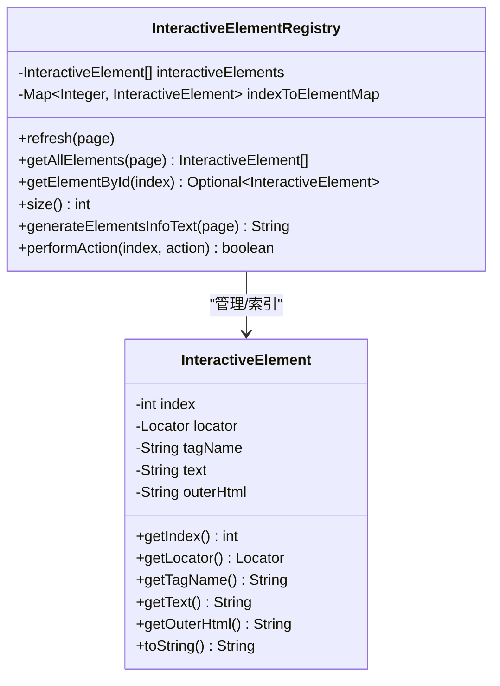
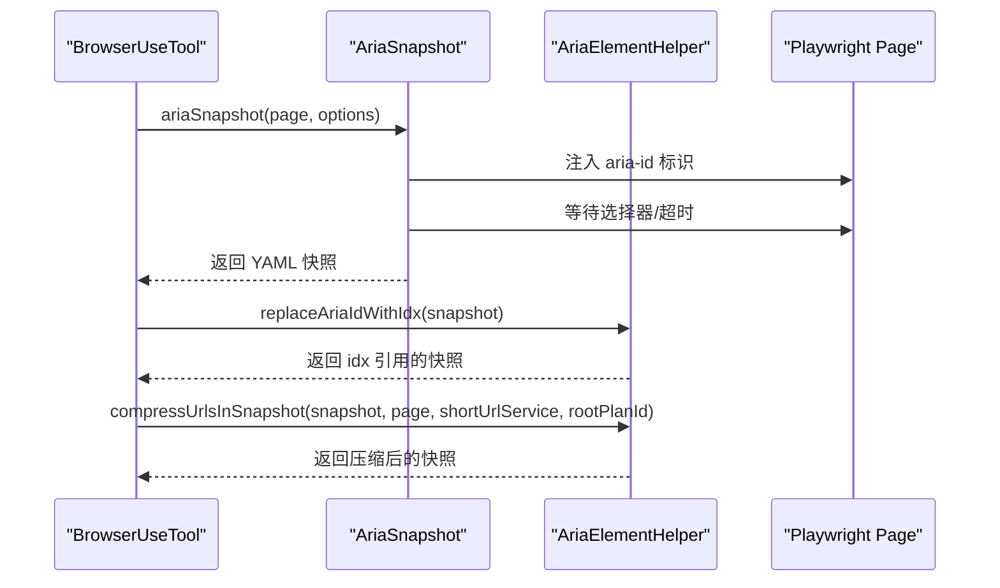
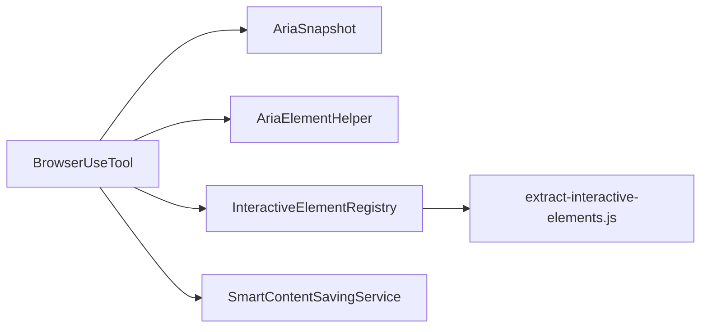

# 浏览器状态序列化

<cite>
**本文引用的文件列表**
- [BrowserUseTool.java](file://src/main/java/com/alibaba/cloud/ai/lynxe/tool/browser/BrowserUseTool.java)
- [InteractiveElementRegistry.java](file://src/main/java/com/alibaba/cloud/ai/lynxe/tool/browser/InteractiveElementRegistry.java)
- [InteractiveElement.java](file://src/main/java/com/alibaba/cloud/ai/lynxe/tool/browser/InteractiveElement.java)
- [AriaElementHelper.java](file://src/main/java/com/alibaba/cloud/ai/lynxe/tool/browser/AriaElementHelper.java)
- [AriaSnapshot.java](file://src/main/java/com/alibaba/cloud/ai/lynxe/tool/browser/AriaSnapshot.java)
- [SmartContentSavingService.java](file://src/main/java/com/alibaba/cloud/ai/lynxe/tool/innerStorage/SmartContentSavingService.java)
- [extract-interactive-elements.js](file://src/main/resources/tool/extract-interactive-elements.js)
</cite>

## 目录
1. [简介](#简介)
2. [项目结构](#项目结构)
3. [核心组件](#核心组件)
4. [架构总览](#架构总览)
5. [详细组件分析](#详细组件分析)
6. [依赖关系分析](#依赖关系分析)
7. [性能考量](#性能考量)
8. [故障排查指南](#故障排查指南)
9. [结论](#结论)
10. [附录：序列化输出示例与多轮对话上下文](#附录：序列化输出示例与多轮对话上下文)

## 简介
本指南聚焦于浏览器状态序列化能力，系统性解析以下关键点：
- getCurrentToolStateString 如何将复杂的浏览器运行时状态转换为 LLM 可读的文本格式
- InteractiveElementRegistry 如何维护页面上可交互元素的唯一标识与位置映射，并在序列化过程中注入上下文信息
- 文本压缩策略与敏感信息过滤机制（URL 压缩、短链替换等），确保输出既完整又安全
- 多轮对话中的上下文连贯性保障与性能优化（增量更新、缓存策略）

## 项目结构
围绕浏览器工具链的关键文件组织如下：
- 工具入口与状态序列化：BrowserUseTool
- 可交互元素注册与索引：InteractiveElementRegistry、InteractiveElement
- ARIA 快照与引用替换：AriaSnapshot、AriaElementHelper
- 内容智能处理与压缩：SmartContentSavingService
- 元素提取脚本：extract-interactive-elements.js

图表来源
- [BrowserUseTool.java](file://src/main/java/com/alibaba/cloud/ai/lynxe/tool/browser/BrowserUseTool.java#L566-L632)
- [InteractiveElementRegistry.java](file://src/main/java/com/alibaba/cloud/ai/lynxe/tool/browser/InteractiveElementRegistry.java#L424-L516)
- [AriaSnapshot.java](file://src/main/java/com/alibaba/cloud/ai/lynxe/tool/browser/AriaSnapshot.java#L46-L116)
- [AriaElementHelper.java](file://src/main/java/com/alibaba/cloud/ai/lynxe/tool/browser/AriaElementHelper.java#L79-L118)
- [SmartContentSavingService.java](file://src/main/java/com/alibaba/cloud/ai/lynxe/tool/innerStorage/SmartContentSavingService.java#L71-L98)
- [extract-interactive-elements.js](file://src/main/resources/tool/extract-interactive-elements.js#L1-L386)

章节来源
- [BrowserUseTool.java](file://src/main/java/com/alibaba/cloud/ai/lynxe/tool/browser/BrowserUseTool.java#L566-L632)
- [InteractiveElementRegistry.java](file://src/main/java/com/alibaba/cloud/ai/lynxe/tool/browser/InteractiveElementRegistry.java#L424-L516)
- [AriaSnapshot.java](file://src/main/java/com/alibaba/cloud/ai/lynxe/tool/browser/AriaSnapshot.java#L46-L116)
- [AriaElementHelper.java](file://src/main/java/com/alibaba/cloud/ai/lynxe/tool/browser/AriaElementHelper.java#L79-L118)
- [SmartContentSavingService.java](file://src/main/java/com/alibaba/cloud/ai/lynxe/tool/innerStorage/SmartContentSavingService.java#L71-L98)
- [extract-interactive-elements.js](file://src/main/resources/tool/extract-interactive-elements.js#L1-L386)

## 核心组件
- BrowserUseTool：负责浏览器动作执行、状态采集与最终的 getCurrentToolStateString 序列化输出；内部通过 AriaSnapshot 与 AriaElementHelper 生成可交互元素上下文，并结合标签页、滚动信息等构建完整状态字符串。
- InteractiveElementRegistry：在页面加载后扫描并注册可交互元素，维护全局索引与快速查找映射，支持按索引执行动作。
- AriaSnapshot/AriaElementHelper：生成 ARIA 快照、替换 aria-id 为 [idx=...]、可选地对快照中的 URL 进行压缩（短链）。
- SmartContentSavingService：对长文本进行智能处理（当前实现返回直接内容，但接口预留后续扩展空间）。

章节来源
- [BrowserUseTool.java](file://src/main/java/com/alibaba/cloud/ai/lynxe/tool/browser/BrowserUseTool.java#L566-L632)
- [InteractiveElementRegistry.java](file://src/main/java/com/alibaba/cloud/ai/lynxe/tool/browser/InteractiveElementRegistry.java#L424-L516)
- [AriaSnapshot.java](file://src/main/java/com/alibaba/cloud/ai/lynxe/tool/browser/AriaSnapshot.java#L46-L116)
- [AriaElementHelper.java](file://src/main/java/com/alibaba/cloud/ai/lynxe/tool/browser/AriaElementHelper.java#L79-L118)
- [SmartContentSavingService.java](file://src/main/java/com/alibaba/cloud/ai/lynxe/tool/innerStorage/SmartContentSavingService.java#L71-L98)

## 架构总览
下图展示从浏览器状态采集到序列化输出的端到端流程，以及与可交互元素注册的关系。

图表来源
- [BrowserUseTool.java](file://src/main/java/com/alibaba/cloud/ai/lynxe/tool/browser/BrowserUseTool.java#L401-L537)
- [AriaSnapshot.java](file://src/main/java/com/alibaba/cloud/ai/lynxe/tool/browser/AriaSnapshot.java#L46-L116)
- [AriaElementHelper.java](file://src/main/java/com/alibaba/cloud/ai/lynxe/tool/browser/AriaElementHelper.java#L79-L118)
- [InteractiveElementRegistry.java](file://src/main/java/com/alibaba/cloud/ai/lynxe/tool/browser/InteractiveElementRegistry.java#L424-L516)

## 详细组件分析

### 组件一：BrowserUseTool 的状态序列化
- 关键职责
  - 驱动浏览器动作执行与结果处理
  - 采集当前页面 URL、标题、标签页列表
  - 生成 ARIA 快照并进行引用替换与 URL 压缩
  - 汇总滚动信息（上方/下方像素）
  - 将上述信息拼接为统一的状态字符串，供 LLM 使用
- 重要方法
  - getCurrentState：等待页面稳定、获取基础信息、生成快照、汇总上下文
  - getCurrentToolStateString：在 hasRunAtLeastOnce 条件满足后，基于 getCurrentState 的结果构建最终输出

图表来源
- [BrowserUseTool.java](file://src/main/java/com/alibaba/cloud/ai/lynxe/tool/browser/BrowserUseTool.java#L401-L537)

章节来源
- [BrowserUseTool.java](file://src/main/java/com/alibaba/cloud/ai/lynxe/tool/browser/BrowserUseTool.java#L401-L537)
- [BrowserUseTool.java](file://src/main/java/com/alibaba/cloud/ai/lynxe/tool/browser/BrowserUseTool.java#L566-L632)

### 组件二：InteractiveElementRegistry 的元素注册与索引
- 关键职责
  - 在页面加载完成后扫描并注册可交互元素
  - 为每个元素分配全局索引，建立索引到元素的映射
  - 支持按索引执行动作（点击、输入等）
  - 生成元素信息文本，便于序列化时注入上下文
- 实现要点
  - 使用 Playwright frames 遍历页面框架
  - 通过 evaluate 执行 extract-interactive-elements.js，筛选可见且可交互的元素
  - 为每个元素设置唯一标识（lynxe-id），并记录 tagName、text、outerHTML、xpath 等
  - 维护线程安全的数据结构（CopyOnWriteArrayList、ConcurrentHashMap）

图表来源
- [InteractiveElementRegistry.java](file://src/main/java/com/alibaba/cloud/ai/lynxe/tool/browser/InteractiveElementRegistry.java#L424-L516)
- [InteractiveElement.java](file://src/main/java/com/alibaba/cloud/ai/lynxe/tool/browser/InteractiveElement.java#L1-L126)

章节来源
- [InteractiveElementRegistry.java](file://src/main/java/com/alibaba/cloud/ai/lynxe/tool/browser/InteractiveElementRegistry.java#L424-L516)
- [InteractiveElement.java](file://src/main/java/com/alibaba/cloud/ai/lynxe/tool/browser/InteractiveElement.java#L1-L126)
- [extract-interactive-elements.js](file://src/main/resources/tool/extract-interactive-elements.js#L1-L386)

### 组件三：AriaSnapshot 与 AriaElementHelper 的快照与引用替换
- AriaSnapshot
  - 为页面注入 aria-label='aria-id-N' 标识
  - 等待指定选择器或超时
  - 调用 Playwright 的 locator.ariaSnapshot 生成 YAML 格式快照
- AriaElementHelper
  - 将快照中的 aria-id-N 替换为 [idx=N]，便于 LLM 识别
  - 可选地对快照中的 URL 进行压缩（短链），并使用 rootPlanId 管理生命周期

图表来源
- [AriaSnapshot.java](file://src/main/java/com/alibaba/cloud/ai/lynxe/tool/browser/AriaSnapshot.java#L46-L116)
- [AriaElementHelper.java](file://src/main/java/com/alibaba/cloud/ai/lynxe/tool/browser/AriaElementHelper.java#L79-L118)

章节来源
- [AriaSnapshot.java](file://src/main/java/com/alibaba/cloud/ai/lynxe/tool/browser/AriaSnapshot.java#L46-L116)
- [AriaElementHelper.java](file://src/main/java/com/alibaba/cloud/ai/lynxe/tool/browser/AriaElementHelper.java#L79-L118)

### 组件四：文本压缩与敏感信息过滤
- URL 压缩
  - 在快照中匹配 /url: 后的链接，解析相对 URL 为绝对 URL
  - 通过 ShortUrlService 为每个绝对 URL 分配短链并替换
  - 使用 rootPlanId 管理短链映射生命周期
- 敏感信息过滤
  - 当前实现未对快照文本进行额外敏感词过滤
  - 建议在业务侧结合配置启用更严格的过滤策略（例如基于规则的白名单/黑名单）

章节来源
- [AriaElementHelper.java](file://src/main/java/com/alibaba/cloud/ai/lynxe/tool/browser/AriaElementHelper.java#L120-L176)

### 组件五：内容智能处理与长文本摘要
- SmartContentSavingService
  - 当前实现直接返回原始内容，不进行截断或摘要
  - 接口预留了 SmartProcessResult(fileName, summary)，可用于后续扩展为“智能存储+摘要”模式
- BrowserUseTool 中对 get_text/execute_js 等长输出会尝试调用该服务进行“智能处理”，若失败则回退原结果

章节来源
- [SmartContentSavingService.java](file://src/main/java/com/alibaba/cloud/ai/lynxe/tool/innerStorage/SmartContentSavingService.java#L71-L98)
- [BrowserUseTool.java](file://src/main/java/com/alibaba/cloud/ai/lynxe/tool/browser/BrowserUseTool.java#L188-L210)

## 依赖关系分析
- BrowserUseTool 依赖
  - Playwright Page：用于等待加载状态、生成快照、获取标签页信息
  - AriaSnapshot/AriaElementHelper：生成并处理 ARIA 快照
  - InteractiveElementRegistry：提供元素索引与上下文
  - SmartContentSavingService：对长文本进行智能处理
- InteractiveElementRegistry 依赖
  - Playwright Frame/Page：遍历 frames、evaluate 执行脚本
  - extract-interactive-elements.js：元素提取与可见性判断逻辑
- AriaElementHelper 依赖
  - ShortUrlService：短链映射与生命周期管理

图表来源
- [BrowserUseTool.java](file://src/main/java/com/alibaba/cloud/ai/lynxe/tool/browser/BrowserUseTool.java#L566-L632)
- [InteractiveElementRegistry.java](file://src/main/java/com/alibaba/cloud/ai/lynxe/tool/browser/InteractiveElementRegistry.java#L424-L516)
- [AriaSnapshot.java](file://src/main/java/com/alibaba/cloud/ai/lynxe/tool/browser/AriaSnapshot.java#L46-L116)
- [AriaElementHelper.java](file://src/main/java/com/alibaba/cloud/ai/lynxe/tool/browser/AriaElementHelper.java#L79-L118)
- [SmartContentSavingService.java](file://src/main/java/com/alibaba/cloud/ai/lynxe/tool/innerStorage/SmartContentSavingService.java#L71-L98)
- [extract-interactive-elements.js](file://src/main/resources/tool/extract-interactive-elements.js#L1-L386)

## 性能考量
- 页面等待策略
  - 先等待 DOMCONTENTLOADED，再等待 NETWORKIDLE，最后在超时情况下做短暂补偿等待，避免在导航/搜索触发的动态内容未就绪时抓取上下文
- 快照生成
  - 通过 AriaSnapshotOptions 控制选择器与超时，减少无效等待
  - 对快照进行引用替换与 URL 压缩，降低传输体积
- 元素注册
  - 使用 CopyOnWriteArrayList 与 ConcurrentHashMap，保证并发安全
  - 仅在需要时刷新（getAllElements 内部调用 refresh），避免重复扫描
- 缓存与增量更新
  - 当前未见针对浏览器状态的专用缓存层
  - 可借鉴双缓冲缓存思想（参考其他模块的双缓冲实现思路），在状态快照层面引入“后台预取 + 原子切换”的策略，以降低序列化开销
- 错误与重试
  - 对 Playwright 超时与异常进行分级处理，必要时重试，提升鲁棒性

章节来源
- [BrowserUseTool.java](file://src/main/java/com/alibaba/cloud/ai/lynxe/tool/browser/BrowserUseTool.java#L401-L537)
- [InteractiveElementRegistry.java](file://src/main/java/com/alibaba/cloud/ai/lynxe/tool/browser/InteractiveElementRegistry.java#L424-L516)
- [AriaSnapshot.java](file://src/main/java/com/alibaba/cloud/ai/lynxe/tool/browser/AriaSnapshot.java#L46-L116)
- [AriaElementHelper.java](file://src/main/java/com/alibaba/cloud/ai/lynxe/tool/browser/AriaElementHelper.java#L79-L118)

## 故障排查指南
- 页面不可用
  - 检查 getDriver 获取是否成功、浏览器连接状态、当前页面是否有效
- 快照为空或报错
  - 确认 AriaSnapshotOptions 的 selector 与 timeout 设置合理
  - 检查 AriaElementHelper 的 URL 压缩依赖（shortUrlService）是否可用
- 元素索引缺失
  - 确保 InteractiveElementRegistry.refresh 已在页面加载后执行
  - 检查 extract-interactive-elements.js 的可见性与交互性判定逻辑是否符合目标页面
- 长文本导致输出过长
  - 利用 SmartContentSavingService 的智能处理能力（当前直接返回，建议后续接入摘要/截断）
- 多轮对话上下文丢失
  - 确保每次调用都基于最新状态（避免跨轮次复用旧状态）
  - 若引入缓存，需保证缓存失效策略与 planId/rootPlanId 生命周期一致

章节来源
- [BrowserUseTool.java](file://src/main/java/com/alibaba/cloud/ai/lynxe/tool/browser/BrowserUseTool.java#L124-L291)
- [AriaElementHelper.java](file://src/main/java/com/alibaba/cloud/ai/lynxe/tool/browser/AriaElementHelper.java#L120-L176)
- [InteractiveElementRegistry.java](file://src/main/java/com/alibaba/cloud/ai/lynxe/tool/browser/InteractiveElementRegistry.java#L424-L516)
- [SmartContentSavingService.java](file://src/main/java/com/alibaba/cloud/ai/lynxe/tool/innerStorage/SmartContentSavingService.java#L71-L98)

## 结论
- getCurrentToolStateString 将浏览器运行时状态（URL/标题/标签页/可交互元素/滚动信息）整合为统一文本，为 LLM 提供稳定的上下文输入
- InteractiveElementRegistry 通过全局索引与定位器封装，确保序列化注入的元素上下文准确、可检索
- AriaSnapshot 与 AriaElementHelper 提供了可靠的快照生成与引用替换能力，并支持 URL 压缩，兼顾完整性与安全性
- SmartContentSavingService 为长文本处理预留了扩展点，建议后续接入摘要/截断策略
- 性能方面，当前已具备合理的等待与容错策略；可进一步引入缓存与增量更新机制，以支撑多轮对话场景下的高效上下文维护

## 附录：序列化输出示例与多轮对话上下文

### 序列化输出示例（结构化字段）
- 当前 URL 与页面标题
- 可用标签页数量与列表
- 可交互元素及其索引（由 ARIA 快照生成并替换为 [idx=...]）
- 视口上方/下方像素指示（滚动信息）
- 任意操作结果或错误提示

示例片段路径
- [BrowserUseTool.java](file://src/main/java/com/alibaba/cloud/ai/lynxe/tool/browser/BrowserUseTool.java#L566-L632)

### 多轮对话中的上下文连贯性
- 每一轮对话开始前，先调用 getCurrentState 生成最新状态
- 将序列化输出作为系统提示的一部分，确保 LLM 基于当前页面真实状态进行推理
- 若引入缓存，应以 planId/rootPlanId 为维度进行失效控制，避免跨轮次污染

章节来源
- [BrowserUseTool.java](file://src/main/java/com/alibaba/cloud/ai/lynxe/tool/browser/BrowserUseTool.java#L566-L632)