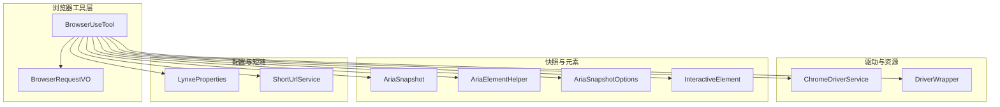
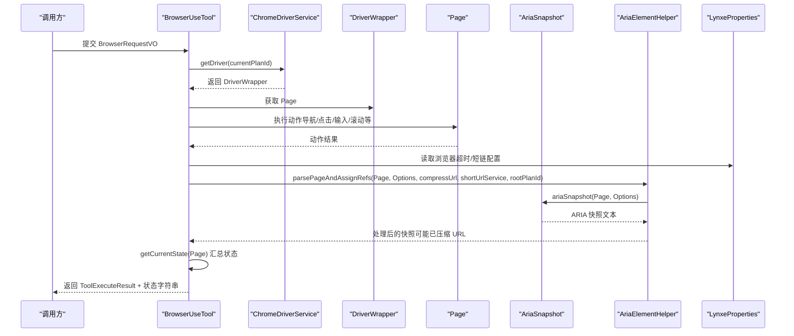
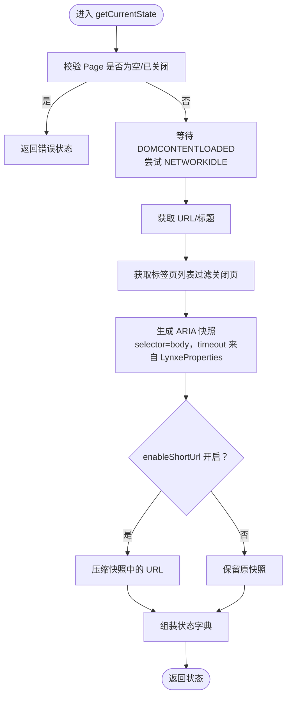
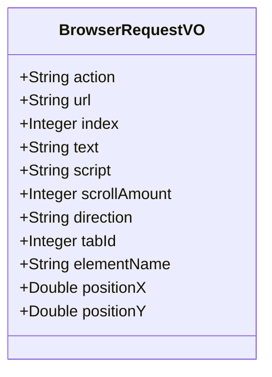
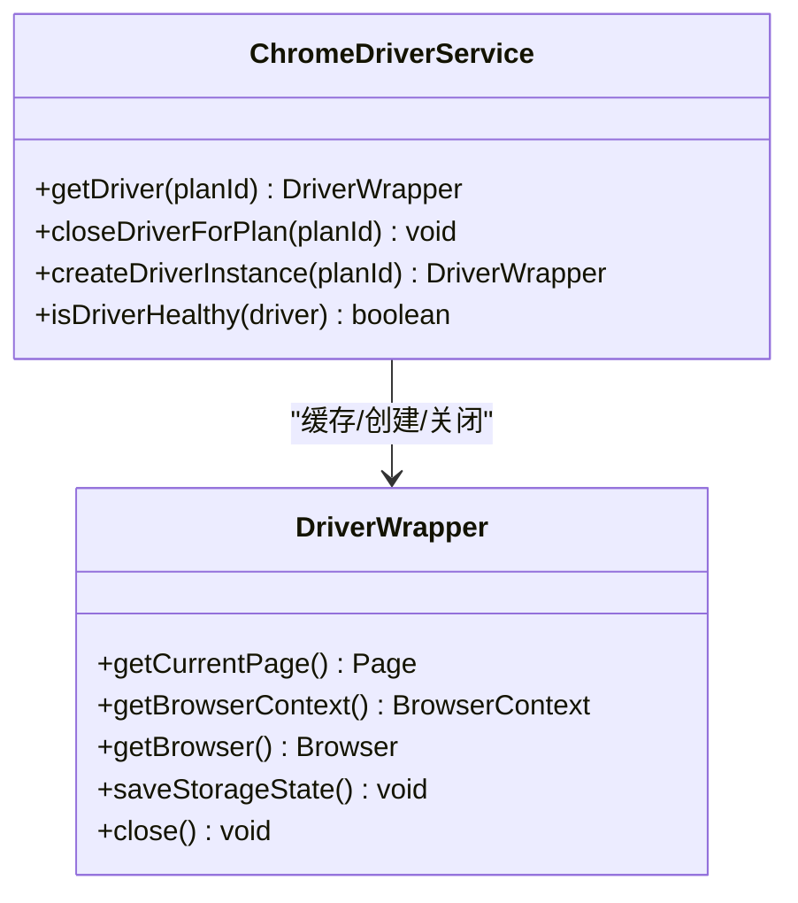
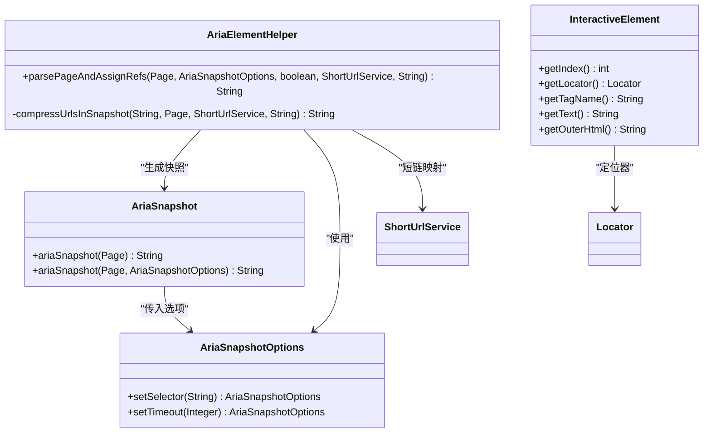
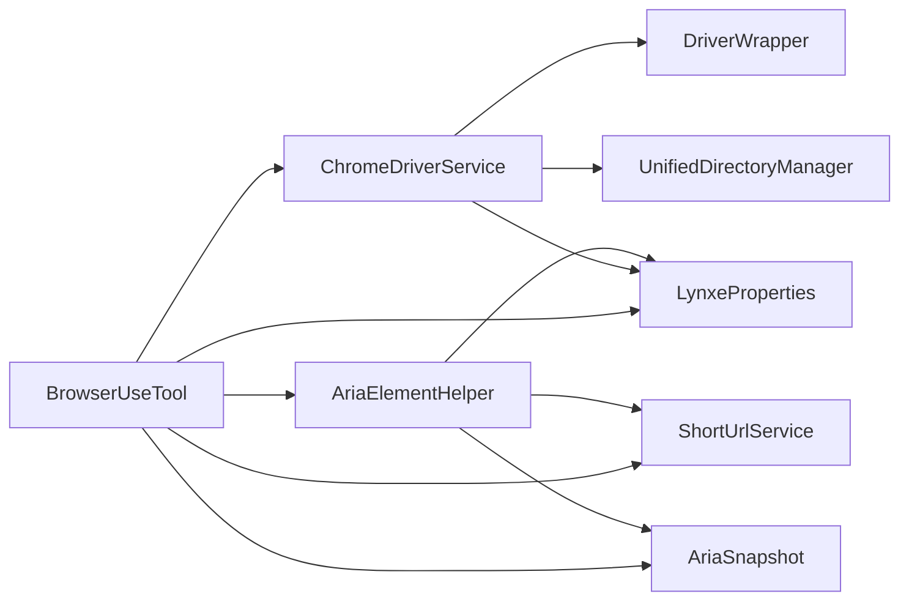

# 浏览器状态管理

<cite>
**本文引用的文件**
- [BrowserUseTool.java](file://src/main/java/com/alibaba/cloud/ai/lynxe/tool/browser/BrowserUseTool.java)
- [BrowserRequestVO.java](file://src/main/java/com/alibaba/cloud/ai/lynxe/tool/browser/actions/BrowserRequestVO.java)
- [LynxeProperties.java](file://src/main/java/com/alibaba/cloud/ai/lynxe/config/LynxeProperties.java)
- [ChromeDriverService.java](file://src/main/java/com/alibaba/cloud/ai/lynxe/tool/browser/ChromeDriverService.java)
- [DriverWrapper.java](file://src/main/java/com/alibaba/cloud/ai/lynxe/tool/browser/DriverWrapper.java)
- [AriaSnapshot.java](file://src/main/java/com/alibaba/cloud/ai/lynxe/tool/browser/AriaSnapshot.java)
- [AriaElementHelper.java](file://src/main/java/com/alibaba/cloud/ai/lynxe/tool/browser/AriaElementHelper.java)
- [AriaSnapshotOptions.java](file://src/main/java/com/alibaba/cloud/ai/lynxe/tool/browser/AriaSnapshotOptions.java)
- [InteractiveElement.java](file://src/main/java/com/alibaba/cloud/ai/lynxe/tool/browser/InteractiveElement.java)
- [ShortUrlService.java](file://src/main/java/com/alibaba/cloud/ai/lynxe/tool/shortUrl/ShortUrlService.java)
- [browser-use-tool-zh.yml](file://src/main/resources/i18n/tools/browser-use-tool-zh.yml)
</cite>

## 目录
1. [简介](#简介)
2. [项目结构](#项目结构)
3. [核心组件](#核心组件)
4. [架构总览](#架构总览)
5. [详细组件分析](#详细组件分析)
6. [依赖关系分析](#依赖关系分析)
7. [性能考量](#性能考量)
8. [故障排查指南](#故障排查指南)
9. [结论](#结论)
10. [附录](#附录)

## 简介
本指南围绕浏览器状态管理展开，重点阐述 BrowserUseTool 如何通过 getCurrentState 和 getCurrentToolStateString 维护与暴露浏览器当前状态；详解 BrowserRequestVO 数据模型的结构与用途；说明 LynxeProperties 中超时与短链接等配置项对工具行为的影响；并给出在长时间任务中保持会话状态、以及页面重定向后进行状态同步的最佳实践建议。

## 项目结构
浏览器相关能力主要集中在 tool/browser 子模块，核心类包括：
- BrowserUseTool：浏览器工具入口，负责动作分发、状态采集与展示
- ChromeDriverService：浏览器驱动生命周期管理，按 planId 隔离上下文
- DriverWrapper：Playwright 资源封装与有序释放
- AriaSnapshot/AriaElementHelper：页面 ARIA 快照生成与 URL 压缩
- BrowserRequestVO：浏览器操作请求的数据载体
- LynxeProperties：全局配置读取（含浏览器超时、短链接开关等）

图表来源
- [BrowserUseTool.java](file://src/main/java/com/alibaba/cloud/ai/lynxe/tool/browser/BrowserUseTool.java#L1-L653)
- [BrowserRequestVO.java](file://src/main/java/com/alibaba/cloud/ai/lynxe/tool/browser/actions/BrowserRequestVO.java#L1-L178)
- [ChromeDriverService.java](file://src/main/java/com/alibaba/cloud/ai/lynxe/tool/browser/ChromeDriverService.java#L1-L911)
- [DriverWrapper.java](file://src/main/java/com/alibaba/cloud/ai/lynxe/tool/browser/DriverWrapper.java#L1-L286)
- [AriaSnapshot.java](file://src/main/java/com/alibaba/cloud/ai/lynxe/tool/browser/AriaSnapshot.java#L1-L117)
- [AriaElementHelper.java](file://src/main/java/com/alibaba/cloud/ai/lynxe/tool/browser/AriaElementHelper.java#L1-L207)
- [AriaSnapshotOptions.java](file://src/main/java/com/alibaba/cloud/ai/lynxe/tool/browser/AriaSnapshotOptions.java#L1-L75)
- [InteractiveElement.java](file://src/main/java/com/alibaba/cloud/ai/lynxe/tool/browser/InteractiveElement.java#L1-L126)
- [LynxeProperties.java](file://src/main/java/com/alibaba/cloud/ai/lynxe/config/LynxeProperties.java#L1-L552)
- [ShortUrlService.java](file://src/main/java/com/alibaba/cloud/ai/lynxe/tool/shortUrl/ShortUrlService.java#L1-L282)

章节来源
- [BrowserUseTool.java](file://src/main/java/com/alibaba/cloud/ai/lynxe/tool/browser/BrowserUseTool.java#L1-L653)
- [ChromeDriverService.java](file://src/main/java/com/alibaba/cloud/ai/lynxe/tool/browser/ChromeDriverService.java#L1-L911)

## 核心组件
- BrowserUseTool：统一入口，负责动作解析、重试策略、错误处理、状态采集与展示字符串生成。其 getCurrentState 采集 URL、标题、标签页列表、交互元素快照；getCurrentToolStateString 将状态汇总为人类可读的字符串。
- BrowserRequestVO：承载 action、url、index、text、script、scrollAmount、direction、tab_id、element_name、position_x、position_y 等字段，用于表达浏览器操作请求。
- LynxeProperties：提供浏览器超时、短链接开关等配置，影响工具行为与快照压缩策略。
- ChromeDriverService：按 planId 创建/复用/健康检查/清理 DriverWrapper，确保多任务隔离与资源回收。
- DriverWrapper：封装 Playwright 的 Browser/BrowserContext/Page 生命周期，提供存储状态保存与历史清理。
- AriaSnapshot/AriaElementHelper：生成页面 ARIA 快照，并将内部 URL 压缩为短链，便于状态输出与传输。
- ShortUrlService：短链映射管理，支持按 planId 隔离短链空间。

章节来源
- [BrowserUseTool.java](file://src/main/java/com/alibaba/cloud/ai/lynxe/tool/browser/BrowserUseTool.java#L1-L653)
- [BrowserRequestVO.java](file://src/main/java/com/alibaba/cloud/ai/lynxe/tool/browser/actions/BrowserRequestVO.java#L1-L178)
- [LynxeProperties.java](file://src/main/java/com/alibaba/cloud/ai/lynxe/config/LynxeProperties.java#L1-L552)
- [ChromeDriverService.java](file://src/main/java/com/alibaba/cloud/ai/lynxe/tool/browser/ChromeDriverService.java#L1-L911)
- [DriverWrapper.java](file://src/main/java/com/alibaba/cloud/ai/lynxe/tool/browser/DriverWrapper.java#L1-L286)
- [AriaSnapshot.java](file://src/main/java/com/alibaba/cloud/ai/lynxe/tool/browser/AriaSnapshot.java#L1-L117)
- [AriaElementHelper.java](file://src/main/java/com/alibaba/cloud/ai/lynxe/tool/browser/AriaElementHelper.java#L1-L207)
- [ShortUrlService.java](file://src/main/java/com/alibaba/cloud/ai/lynxe/tool/shortUrl/ShortUrlService.java#L1-L282)

## 架构总览
浏览器状态管理的关键流程如下：
- 工具入口 BrowserUseTool 接收 BrowserRequestVO，调用 ChromeDriverService 获取 DriverWrapper，再根据 action 分派到具体动作。
- 动作完成后，BrowserUseTool 通过 getCurrentState 采集当前页面状态（URL、标题、标签页、交互元素快照），并通过 getCurrentToolStateString 生成可读状态摘要。
- 状态采集过程中，AriaSnapshot/AriaElementHelper 生成 ARIA 快照，并依据 LynxeProperties 的 enableShortUrl 决定是否压缩快照中的 URL。

图表来源
- [BrowserUseTool.java](file://src/main/java/com/alibaba/cloud/ai/lynxe/tool/browser/BrowserUseTool.java#L120-L653)
- [ChromeDriverService.java](file://src/main/java/com/alibaba/cloud/ai/lynxe/tool/browser/ChromeDriverService.java#L105-L200)
- [AriaElementHelper.java](file://src/main/java/com/alibaba/cloud/ai/lynxe/tool/browser/AriaElementHelper.java#L79-L118)
- [AriaSnapshot.java](file://src/main/java/com/alibaba/cloud/ai/lynxe/tool/browser/AriaSnapshot.java#L51-L117)
- [LynxeProperties.java](file://src/main/java/com/alibaba/cloud/ai/lynxe/config/LynxeProperties.java#L57-L73)

## 详细组件分析

### BrowserUseTool：状态采集与展示
- getCurrentState(Page page)
  - 先等待页面加载状态（DOMCONTENTLOADED、NETWORKIDLE），必要时额外等待以保证动态内容渲染完成
  - 采集当前 URL 与标题，异常时记录错误信息
  - 采集标签页列表（过滤已关闭页签），异常时返回错误提示
  - 生成 ARIA 快照（selector 默认 body，超时来自 LynxeProperties 的浏览器超时配置），并根据 enableShortUrl 决定是否压缩快照中的 URL
  - 返回包含 url、title、tabs、interactive_elements 等键的状态字典
- getCurrentToolStateString()
  - 仅在 hasRunAtLeastOnce=true 时初始化浏览器上下文
  - 从 DriverWrapper 获取当前 Page，调用 getCurrentState 并格式化输出
  - 输出内容包括：当前 URL/标题、可用标签页数量与列表、交互元素摘要、视口上下方内容像素提示、最近一次动作结果或错误

图表来源
- [BrowserUseTool.java](file://src/main/java/com/alibaba/cloud/ai/lynxe/tool/browser/BrowserUseTool.java#L401-L537)
- [LynxeProperties.java](file://src/main/java/com/alibaba/cloud/ai/lynxe/config/LynxeProperties.java#L120-L146)
- [AriaElementHelper.java](file://src/main/java/com/alibaba/cloud/ai/lynxe/tool/browser/AriaElementHelper.java#L79-L118)

章节来源
- [BrowserUseTool.java](file://src/main/java/com/alibaba/cloud/ai/lynxe/tool/browser/BrowserUseTool.java#L401-L653)

### BrowserRequestVO：浏览器操作请求模型
- 字段说明（节选）
  - action：操作类型（navigate、click、input_text、key_enter、screenshot、get_text、execute_js、scroll、switch_tab、new_tab、close_tab、refresh、get_element_position、move_to_and_click、get_web_content 等）
  - url：导航或新建标签页的目标地址
  - index：元素索引（对应 ARIA 快照中的 idx）
  - text：输入文本
  - script：执行脚本
  - scrollAmount：滚动像素（正向下，负向上）
  - direction：滚动方向（up/down）
  - tab_id：标签页 ID
  - element_name：元素名称（用于定位）
  - position_x/position_y：坐标（用于移动并点击）

图表来源
- [BrowserRequestVO.java](file://src/main/java/com/alibaba/cloud/ai/lynxe/tool/browser/actions/BrowserRequestVO.java#L1-L178)

章节来源
- [BrowserRequestVO.java](file://src/main/java/com/alibaba/cloud/ai/lynxe/tool/browser/actions/BrowserRequestVO.java#L1-L178)
- [browser-use-tool-zh.yml](file://src/main/resources/i18n/tools/browser-use-tool-zh.yml#L1-L188)

### LynxeProperties：超时与短链接配置
- 浏览器超时
  - getBrowserRequestTimeout：浏览器请求超时（秒），默认 30 秒；BrowserUseTool 在等待页面加载与快照生成时使用该值
- 短链接开关
  - getEnableShortUrl：是否启用短链接压缩；默认 true；影响 AriaElementHelper 压缩快照中的 URL
- 其他相关配置
  - getBrowserHeadless：无头模式开关
  - getOpenBrowserAuto：自动打开浏览器开关

章节来源
- [LynxeProperties.java](file://src/main/java/com/alibaba/cloud/ai/lynxe/config/LynxeProperties.java#L57-L73)
- [LynxeProperties.java](file://src/main/java/com/alibaba/cloud/ai/lynxe/config/LynxeProperties.java#L120-L146)

### ChromeDriverService 与 DriverWrapper：会话与资源管理
- ChromeDriverService
  - 按 planId 缓存 DriverWrapper，提供健康检查与重试创建
  - 设置页面/上下文默认超时（来自 LynxeProperties）
  - 提供关闭指定 planId 的浏览器资源与 userDataDir 清理
- DriverWrapper
  - 封装 Playwright 的 Browser/BrowserContext/Page
  - 保存 storageState（cookies、localStorage、sessionStorage）并按最佳实践顺序关闭资源
  - 历史清理在上下文关闭后进行，确保历史文件不被锁定

图表来源
- [ChromeDriverService.java](file://src/main/java/com/alibaba/cloud/ai/lynxe/tool/browser/ChromeDriverService.java#L105-L200)
- [ChromeDriverService.java](file://src/main/java/com/alibaba/cloud/ai/lynxe/tool/browser/ChromeDriverService.java#L764-L800)
- [DriverWrapper.java](file://src/main/java/com/alibaba/cloud/ai/lynxe/tool/browser/DriverWrapper.java#L1-L286)

章节来源
- [ChromeDriverService.java](file://src/main/java/com/alibaba/cloud/ai/lynxe/tool/browser/ChromeDriverService.java#L1-L911)
- [DriverWrapper.java](file://src/main/java/com/alibaba/cloud/ai/lynxe/tool/browser/DriverWrapper.java#L1-L286)

### ARIA 快照与交互元素
- AriaSnapshot
  - 基于 Playwright 的 locator.ariaSnapshot 生成页面 ARIA 快照文本
  - 可设置 selector 与 timeout
- AriaElementHelper
  - 将快照中的 aria-id-* 替换为 [idx=...]，便于索引引用
  - 可选压缩快照中的 URL，基于 ShortUrlService 生成短链并替换
- InteractiveElement
  - 表示单个可交互元素，包含全局索引、定位器、标签名、文本、外层 HTML 等信息

图表来源
- [AriaSnapshot.java](file://src/main/java/com/alibaba/cloud/ai/lynxe/tool/browser/AriaSnapshot.java#L51-L117)
- [AriaElementHelper.java](file://src/main/java/com/alibaba/cloud/ai/lynxe/tool/browser/AriaElementHelper.java#L79-L118)
- [AriaSnapshotOptions.java](file://src/main/java/com/alibaba/cloud/ai/lynxe/tool/browser/AriaSnapshotOptions.java#L1-L75)
- [InteractiveElement.java](file://src/main/java/com/alibaba/cloud/ai/lynxe/tool/browser/InteractiveElement.java#L1-L126)

章节来源
- [AriaSnapshot.java](file://src/main/java/com/alibaba/cloud/ai/lynxe/tool/browser/AriaSnapshot.java#L1-L117)
- [AriaElementHelper.java](file://src/main/java/com/alibaba/cloud/ai/lynxe/tool/browser/AriaElementHelper.java#L1-L207)
- [AriaSnapshotOptions.java](file://src/main/java/com/alibaba/cloud/ai/lynxe/tool/browser/AriaSnapshotOptions.java#L1-L75)
- [InteractiveElement.java](file://src/main/java/com/alibaba/cloud/ai/lynxe/tool/browser/InteractiveElement.java#L1-L126)

## 依赖关系分析
- BrowserUseTool 依赖
  - ChromeDriverService：获取 DriverWrapper，验证浏览器连接与当前页有效性
  - LynxeProperties：读取超时与短链配置
  - ShortUrlService：短链映射
  - AriaElementHelper/AriaSnapshot：生成快照
  - SmartContentSavingService：对长输出进行智能截断
- ChromeDriverService 依赖
  - LynxeProperties：超时与 headless 配置
  - UnifiedDirectoryManager：持久化 userDataDir 与 storage-state.json
  - DriverWrapper：封装 Playwright 资源
- AriaElementHelper 依赖
  - AriaSnapshot：生成快照
  - ShortUrlService：短链映射
  - LynxeProperties：短链开关

图表来源
- [BrowserUseTool.java](file://src/main/java/com/alibaba/cloud/ai/lynxe/tool/browser/BrowserUseTool.java#L1-L200)
- [ChromeDriverService.java](file://src/main/java/com/alibaba/cloud/ai/lynxe/tool/browser/ChromeDriverService.java#L1-L200)
- [AriaElementHelper.java](file://src/main/java/com/alibaba/cloud/ai/lynxe/tool/browser/AriaElementHelper.java#L79-L118)

章节来源
- [BrowserUseTool.java](file://src/main/java/com/alibaba/cloud/ai/lynxe/tool/browser/BrowserUseTool.java#L1-L200)
- [ChromeDriverService.java](file://src/main/java/com/alibaba/cloud/ai/lynxe/tool/browser/ChromeDriverService.java#L1-L200)

## 性能考量
- 超时控制
  - 页面加载等待采用两阶段策略：先等待 DOMCONTENTLOADED，再尝试 NETWORKIDLE；若 NETWORKIDLE 超时则短暂等待以让动态内容稳定
  - 快照生成与 URL 压缩均受 LynxeProperties 的浏览器超时限制
- 资源管理
  - DriverWrapper 严格遵循关闭顺序：先保存 storageState，再关闭 BrowserContext，随后清理历史，最后关闭 Browser 与 Playwright，避免资源泄漏
  - ChromeDriverService 对 DriverWrapper 健康检查与重试，降低不稳定环境下的失败率
- 输出优化
  - 对长输出（如 get_text、execute_js）通过 SmartContentSavingService 进行智能截断，减少传输与存储成本

章节来源
- [BrowserUseTool.java](file://src/main/java/com/alibaba/cloud/ai/lynxe/tool/browser/BrowserUseTool.java#L401-L537)
- [ChromeDriverService.java](file://src/main/java/com/alibaba/cloud/ai/lynxe/tool/browser/ChromeDriverService.java#L302-L351)
- [DriverWrapper.java](file://src/main/java/com/alibaba/cloud/ai/lynxe/tool/browser/DriverWrapper.java#L169-L283)

## 故障排查指南
- 浏览器不可用或连接中断
  - 现象：返回“浏览器未连接”或“当前页不可用”
  - 排查：确认 ChromeDriverService.getDriver 成功且 DriverWrapper.getBrowser isConnected；必要时调用 cleanup(planId) 重新初始化
- 页面加载超时
  - 现象：等待 DOMCONTENTLOADED 或 NETWORKIDLE 抛出超时
  - 排查：适当提高 LynxeProperties 的浏览器超时；检查网络与目标站点响应
- 快照生成失败
  - 现象：interactive_elements 返回错误信息
  - 排查：确认 AriaSnapshotOptions 的 selector 与 timeout 设置合理；检查 enableShortUrl 与 ShortUrlService 是否可用
- 状态字符串为空或不完整
  - 现象：getCurrentToolStateString 输出不包含预期信息
  - 排查：确认 hasRunAtLeastOnce 已置位；确保 run 方法至少执行过一次；检查 getCurrentState 的返回键是否存在

章节来源
- [BrowserUseTool.java](file://src/main/java/com/alibaba/cloud/ai/lynxe/tool/browser/BrowserUseTool.java#L124-L291)
- [ChromeDriverService.java](file://src/main/java/com/alibaba/cloud/ai/lynxe/tool/browser/ChromeDriverService.java#L302-L351)
- [DriverWrapper.java](file://src/main/java/com/alibaba/cloud/ai/lynxe/tool/browser/DriverWrapper.java#L169-L283)

## 结论
BrowserUseTool 通过 getCurrentState 与 getCurrentToolStateString 实现了对浏览器当前状态的全面采集与可读化输出，结合 LynxeProperties 的超时与短链接配置，能够在复杂页面与长时间任务中保持稳定的会话状态与状态同步。配合 ChromeDriverService 的资源管理与 DriverWrapper 的有序关闭，系统具备良好的健壮性与可维护性。

## 附录

### 最佳实践清单
- 长时间任务中保持会话状态
  - 使用 ChromeDriverService 按 planId 管理会话，避免跨任务污染
  - 通过 DriverWrapper.saveStorageState 保存 cookies/localStorage/sessionStorage，重启后恢复登录态
  - 在任务结束或异常时调用 cleanup(planId)，释放资源并清理 userDataDir
- 页面重定向后的状态同步
  - 动作完成后调用 getCurrentState，确保等待 NETWORKIDLE 以捕获重定向后的最终状态
  - 若存在新标签页，使用 getTabsInfo 获取所有可用标签页，必要时通过 switch_tab 切换
  - 当启用短链接时，确认 AriaElementHelper 正确压缩快照中的 URL，避免泄露真实地址

章节来源
- [ChromeDriverService.java](file://src/main/java/com/alibaba/cloud/ai/lynxe/tool/browser/ChromeDriverService.java#L190-L232)
- [DriverWrapper.java](file://src/main/java/com/alibaba/cloud/ai/lynxe/tool/browser/DriverWrapper.java#L169-L283)
- [BrowserUseTool.java](file://src/main/java/com/alibaba/cloud/ai/lynxe/tool/browser/BrowserUseTool.java#L401-L537)
- [AriaElementHelper.java](file://src/main/java/com/alibaba/cloud/ai/lynxe/tool/browser/AriaElementHelper.java#L79-L118)