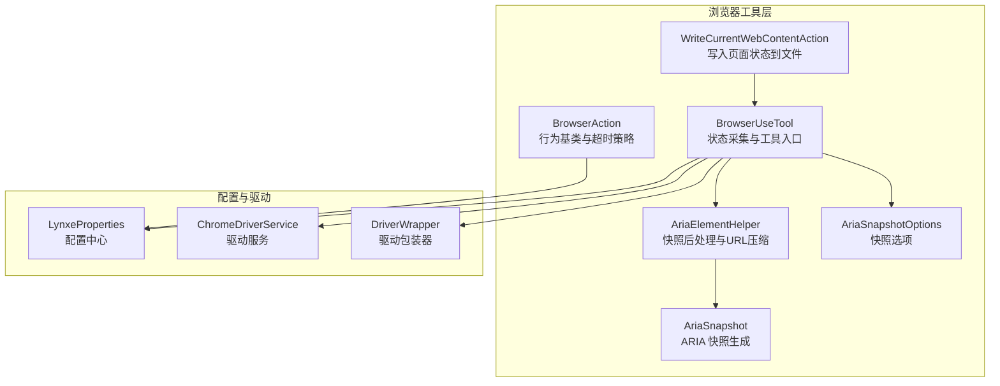
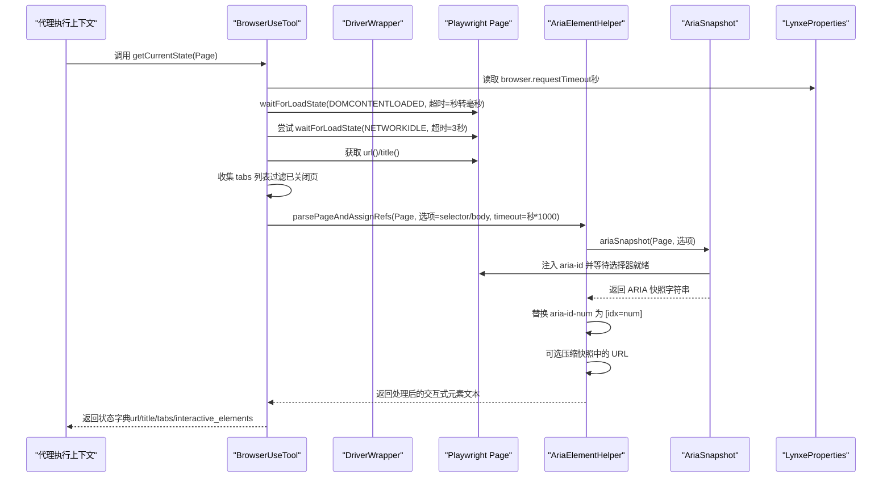
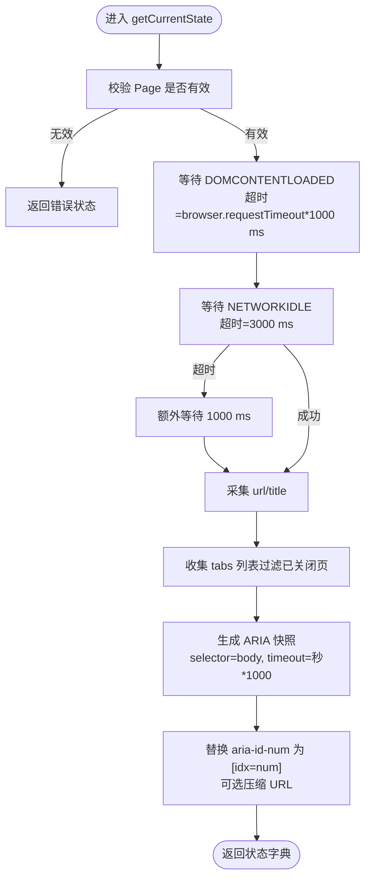
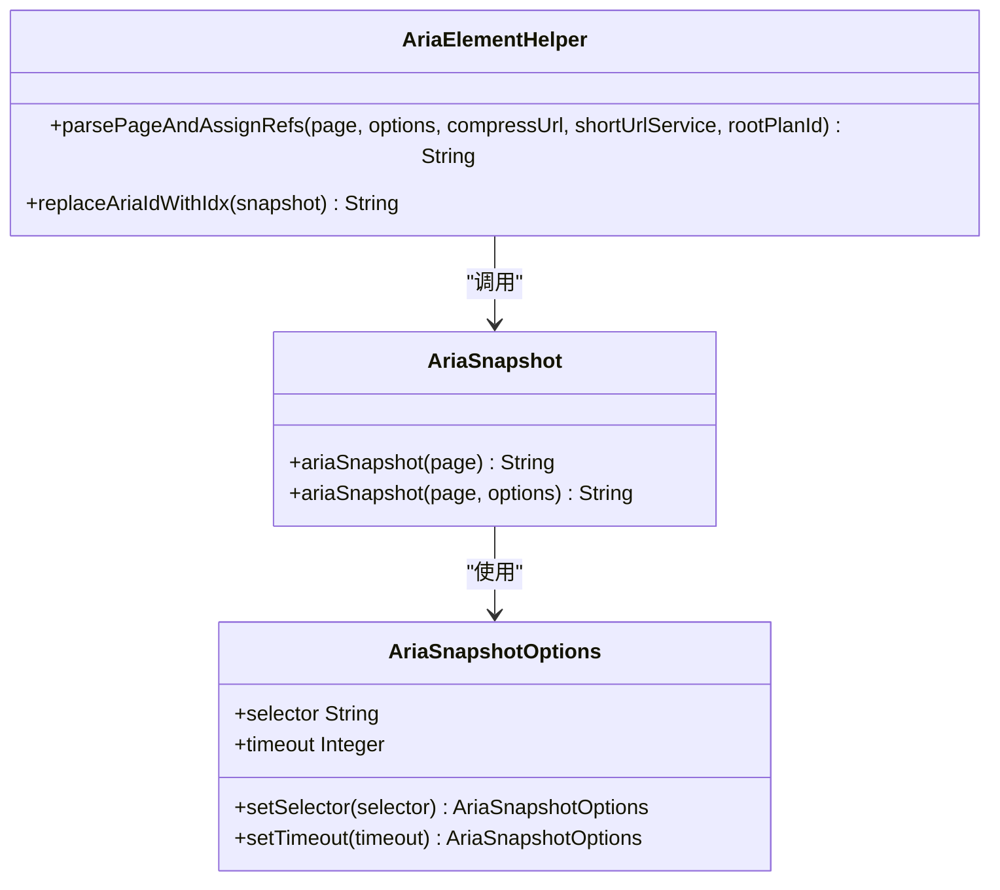
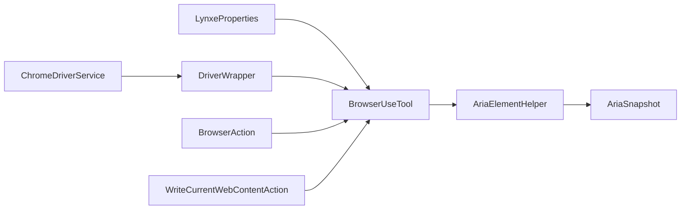

# 浏览器状态获取

<cite>
**本文引用的文件**
- [BrowserUseTool.java](file://src/main/java/com/alibaba/cloud/ai/lynxe/tool/browser/BrowserUseTool.java)
- [AriaSnapshot.java](file://src/main/java/com/alibaba/cloud/ai/lynxe/tool/browser/AriaSnapshot.java)
- [AriaElementHelper.java](file://src/main/java/com/alibaba/cloud/ai/lynxe/tool/browser/AriaElementHelper.java)
- [AriaSnapshotOptions.java](file://src/main/java/com/alibaba/cloud/ai/lynxe/tool/browser/AriaSnapshotOptions.java)
- [LynxeProperties.java](file://src/main/java/com/alibaba/cloud/ai/lynxe/config/LynxeProperties.java)
- [BrowserAction.java](file://src/main/java/com/alibaba/cloud/ai/lynxe/tool/browser/actions/BrowserAction.java)
- [WriteCurrentWebContentAction.java](file://src/main/java/com/alibaba/cloud/ai/lynxe/tool/browser/actions/WriteCurrentWebContentAction.java)
- [ChromeDriverService.java](file://src/main/java/com/alibaba/cloud/ai/lynxe/tool/browser/ChromeDriverService.java)
- [DriverWrapper.java](file://src/main/java/com/alibaba/cloud/ai/lynxe/tool/browser/DriverWrapper.java)
- [extract-interactive-elements.js](file://src/main/resources/tool/extract-interactive-elements.js)
</cite>

## 目录
1. [简介](#简介)
2. [项目结构](#项目结构)
3. [核心组件](#核心组件)
4. [架构总览](#架构总览)
5. [详细组件分析](#详细组件分析)
6. [依赖关系分析](#依赖关系分析)
7. [性能考量](#性能考量)
8. [故障排查指南](#故障排查指南)
9. [结论](#结论)
10. [附录](#附录)

## 简介
本文件聚焦于浏览器状态获取机制，围绕 BrowserUseTool 的 getCurrentState 方法展开，说明其如何通过 Playwright 驱动与浏览器实例交互，采集当前页面的 URL、标题、标签页列表以及 DOM 快照（ARIA 可访问性树）。文档同时解释 AriaSnapshot 类如何生成可访问性树并提取交互式元素（如按钮、输入框）的语义化信息；梳理异步处理与超时控制策略，并结合 LynxeProperties 中的 browser.timeout 配置项说明可调参数。最后给出在代理执行上下文中调用该功能的实际示例路径，并阐述其在动态决策中的作用。

## 项目结构
与浏览器状态获取直接相关的模块主要位于工具层的 browser 包内，包含：
- 工具入口：BrowserUseTool
- ARIA 快照生成：AriaSnapshot、AriaElementHelper、AriaSnapshotOptions
- 行为基类与超时策略：BrowserAction
- 配置中心：LynxeProperties
- 执行上下文与驱动管理：ChromeDriverService、DriverWrapper
- 页面内容写入：WriteCurrentWebContentAction（演示如何在代理执行上下文中使用状态）

图表来源
- [BrowserUseTool.java](file://src/main/java/com/alibaba/cloud/ai/lynxe/tool/browser/BrowserUseTool.java#L401-L537)
- [AriaSnapshot.java](file://src/main/java/com/alibaba/cloud/ai/lynxe/tool/browser/AriaSnapshot.java#L51-L114)
- [AriaElementHelper.java](file://src/main/java/com/alibaba/cloud/ai/lynxe/tool/browser/AriaElementHelper.java#L79-L118)
- [AriaSnapshotOptions.java](file://src/main/java/com/alibaba/cloud/ai/lynxe/tool/browser/AriaSnapshotOptions.java#L21-L74)
- [BrowserAction.java](file://src/main/java/com/alibaba/cloud/ai/lynxe/tool/browser/actions/BrowserAction.java#L51-L78)
- [WriteCurrentWebContentAction.java](file://src/main/java/com/alibaba/cloud/ai/lynxe/tool/browser/actions/WriteCurrentWebContentAction.java#L44-L145)
- [LynxeProperties.java](file://src/main/java/com/alibaba/cloud/ai/lynxe/config/LynxeProperties.java#L57-L69)
- [ChromeDriverService.java](file://src/main/java/com/alibaba/cloud/ai/lynxe/tool/browser/ChromeDriverService.java#L423-L742)
- [DriverWrapper.java](file://src/main/java/com/alibaba/cloud/ai/lynxe/tool/browser/DriverWrapper.java#L139-L266)

章节来源
- [BrowserUseTool.java](file://src/main/java/com/alibaba/cloud/ai/lynxe/tool/browser/BrowserUseTool.java#L401-L537)
- [LynxeProperties.java](file://src/main/java/com/alibaba/cloud/ai/lynxe/config/LynxeProperties.java#L57-L69)

## 核心组件
- BrowserUseTool：提供 getCurrentState 方法，负责等待页面加载、获取 URL/标题/标签页列表、生成 ARIA 快照，并将结果汇总为状态字典。
- AriaSnapshot：封装 Playwright 原生 ariaSnapshot 能力，注入唯一 aria-id 并等待选择器就绪，最终输出可访问性树字符串。
- AriaElementHelper：对 ARIA 快照进行后处理，替换 aria-id-num 为 [idx=num]，并按需压缩快照中的 URL。
- AriaSnapshotOptions：定义快照选择器与超时时间等选项。
- LynxeProperties：读取配置，提供 browser.requestTimeout（秒）作为全局超时基准。
- BrowserAction：提供统一的超时策略（毫秒/秒），并封装元素定位与弹窗检测等通用逻辑。
- ChromeDriverService/DriverWrapper：管理浏览器生命周期、上下文与页面，确保状态采集前后的稳定性。
- WriteCurrentWebContentAction：演示在代理执行上下文中如何调用 getCurrentState 并将状态写入文件。

章节来源
- [BrowserUseTool.java](file://src/main/java/com/alibaba/cloud/ai/lynxe/tool/browser/BrowserUseTool.java#L401-L537)
- [AriaSnapshot.java](file://src/main/java/com/alibaba/cloud/ai/lynxe/tool/browser/AriaSnapshot.java#L51-L114)
- [AriaElementHelper.java](file://src/main/java/com/alibaba/cloud/ai/lynxe/tool/browser/AriaElementHelper.java#L79-L118)
- [AriaSnapshotOptions.java](file://src/main/java/com/alibaba/cloud/ai/lynxe/tool/browser/AriaSnapshotOptions.java#L21-L74)
- [BrowserAction.java](file://src/main/java/com/alibaba/cloud/ai/lynxe/tool/browser/actions/BrowserAction.java#L51-L78)
- [ChromeDriverService.java](file://src/main/java/com/alibaba/cloud/ai/lynxe/tool/browser/ChromeDriverService.java#L423-L742)
- [DriverWrapper.java](file://src/main/java/com/alibaba/cloud/ai/lynxe/tool/browser/DriverWrapper.java#L139-L266)
- [WriteCurrentWebContentAction.java](file://src/main/java/com/alibaba/cloud/ai/lynxe/tool/browser/actions/WriteCurrentWebContentAction.java#L44-L145)

## 架构总览
下图展示了从代理执行上下文调用 BrowserUseTool 获取状态的整体流程，包括超时控制、ARIA 快照生成与 URL 压缩等关键步骤。

图表来源
- [BrowserUseTool.java](file://src/main/java/com/alibaba/cloud/ai/lynxe/tool/browser/BrowserUseTool.java#L401-L537)
- [AriaElementHelper.java](file://src/main/java/com/alibaba/cloud/ai/lynxe/tool/browser/AriaElementHelper.java#L79-L118)
- [AriaSnapshot.java](file://src/main/java/com/alibaba/cloud/ai/lynxe/tool/browser/AriaSnapshot.java#L51-L114)
- [LynxeProperties.java](file://src/main/java/com/alibaba/cloud/ai/lynxe/config/LynxeProperties.java#L57-L69)

## 详细组件分析

### BrowserUseTool.getCurrentState：状态采集主流程
- 页面有效性校验：若 page 为空或已关闭，直接返回错误状态。
- 加载状态等待：
  - 先等待 DOMCONTENTLOADED，超时来自 LynxeProperties.browser.requestTimeout（秒）转换为毫秒。
  - 再尝试等待 NETWORKIDLE，若超时则回退等待 1 秒以允许动态内容更新。
- 基础信息采集：获取 url 与 title，异常时记录错误信息。
- 标签页列表：遍历 context.pages()，过滤已关闭页，收集每个页的 url 与 title。
- ARIA 快照生成：
  - 使用 AriaElementHelper.parsePageAndAssignRefs，传入选项 selector="body" 与 timeout=秒*1000。
  - 可选启用短链压缩（由 LynxeProperties.browser.enableShortUrl 控制，默认开启）。
  - 若快照为空或失败，返回提示信息。
- 返回状态字典：包含 url、title、tabs、interactive_elements（或错误信息）。

图表来源
- [BrowserUseTool.java](file://src/main/java/com/alibaba/cloud/ai/lynxe/tool/browser/BrowserUseTool.java#L401-L537)
- [AriaElementHelper.java](file://src/main/java/com/alibaba/cloud/ai/lynxe/tool/browser/AriaElementHelper.java#L79-L118)

章节来源
- [BrowserUseTool.java](file://src/main/java/com/alibaba/cloud/ai/lynxe/tool/browser/BrowserUseTool.java#L401-L537)

### AriaSnapshot：ARIA 快照生成与注入
- 注入 aria-id：在快照前为所有元素设置唯一 aria-label（aria-id-序号），保证后续索引稳定。
- 等待选择器：若设置了超时，则先等待 selector 就绪，避免快照时机过早。
- 调用 Playwright 原生 locator.ariaSnapshot() 生成可访问性树字符串。
- 异常处理：捕获并抛出运行时异常，便于上层统一处理。

图表来源
- [AriaSnapshot.java](file://src/main/java/com/alibaba/cloud/ai/lynxe/tool/browser/AriaSnapshot.java#L51-L114)
- [AriaSnapshotOptions.java](file://src/main/java/com/alibaba/cloud/ai/lynxe/tool/browser/AriaSnapshotOptions.java#L21-L74)
- [AriaElementHelper.java](file://src/main/java/com/alibaba/cloud/ai/lynxe/tool/browser/AriaElementHelper.java#L79-L118)

章节来源
- [AriaSnapshot.java](file://src/main/java/com/alibaba/cloud/ai/lynxe/tool/browser/AriaSnapshot.java#L51-L114)
- [AriaSnapshotOptions.java](file://src/main/java/com/alibaba/cloud/ai/lynxe/tool/browser/AriaSnapshotOptions.java#L21-L74)
- [AriaElementHelper.java](file://src/main/java/com/alibaba/cloud/ai/lynxe/tool/browser/AriaElementHelper.java#L79-L118)

### AriaElementHelper：快照后处理与 URL 压缩
- 替换规则：将 aria-id-num 模式替换为 [idx=num]，保留原有属性片段，便于后续按索引定位元素。
- URL 压缩：当 compressUrl=true 时，扫描快照中的 /url: 字段，解析相对 URL 至绝对 URL，并通过 ShortUrlService 生成短链映射，替换快照中的长 URL。
- 安全性：对空值与异常进行兜底，失败时返回原始快照。

章节来源
- [AriaElementHelper.java](file://src/main/java/com/alibaba/cloud/ai/lynxe/tool/browser/AriaElementHelper.java#L79-L118)

### 超时控制与异步处理
- 全局超时来源：LynxeProperties.browser.requestTimeout（秒），默认 30 秒；BrowserUseTool 在 getCurrentState 中将其转换为毫秒用于等待 DOMCONTENTLOADED。
- 行为超时策略：BrowserAction 提供 getBrowserTimeoutMs()/getBrowserTimeoutSec()，并限制元素操作超时不超过 10 秒，避免长时间阻塞。
- 网络空闲等待：在 getCurrentState 中对 NETWORKIDLE 设置固定 3 秒超时，若超时则回退等待 1 秒，兼顾动态内容渲染。
- 弹窗检测：BrowserAction.clickAndSwitchToNewTabIfOpened 对弹窗检测采用最小超时（min(配置超时, 2000ms)），并在超时后通过 URL 差分方式兜底判断新标签页。
- 存储状态保存：DriverWrapper 在关闭上下文时异步保存 storageState，设置最多 5 秒等待，防止阻塞。

章节来源
- [BrowserUseTool.java](file://src/main/java/com/alibaba/cloud/ai/lynxe/tool/browser/BrowserUseTool.java#L93-L100)
- [BrowserAction.java](file://src/main/java/com/alibaba/cloud/ai/lynxe/tool/browser/actions/BrowserAction.java#L51-L78)
- [DriverWrapper.java](file://src/main/java/com/alibaba/cloud/ai/lynxe/tool/browser/DriverWrapper.java#L139-L166)

### 在代理执行上下文中调用示例路径
- 通过 WriteCurrentWebContentAction 展示了在代理执行上下文中如何调用 getCurrentState 并将页面状态写入文件：
  - 获取当前 Page：参考 [WriteCurrentWebContentAction.java](file://src/main/java/com/alibaba/cloud/ai/lynxe/tool/browser/actions/WriteCurrentWebContentAction.java#L54-L74)
  - 调用 getCurrentState：参考 [WriteCurrentWebContentAction.java](file://src/main/java/com/alibaba/cloud/ai/lynxe/tool/browser/actions/WriteCurrentWebContentAction.java#L62-L64)
  - 写入文件：参考 [WriteCurrentWebContentAction.java](file://src/main/java/com/alibaba/cloud/ai/lynxe/tool/browser/actions/WriteCurrentWebContentAction.java#L100-L135)

章节来源
- [WriteCurrentWebContentAction.java](file://src/main/java/com/alibaba/cloud/ai/lynxe/tool/browser/actions/WriteCurrentWebContentAction.java#L44-L145)

### 动态决策中的作用
- 页面状态作为决策依据：
  - URL/Title：用于确认当前页面是否为目标页面，或识别跳转/登录/搜索结果等场景。
  - Tabs：用于多标签页导航与切换，辅助选择目标页签。
  - 交互式元素（ARIA 快照）：提供按钮、输入框、下拉菜单等元素的索引与语义，便于后续点击、输入、滚动等操作。
- 与 BrowserAction 协作：
  - 通过 getLocatorByIdx(idx) 将 ARIA 快照中的 [idx=...] 映射为 Playwright 定位器，实现精准交互。
  - 弹窗检测与标签页切换逻辑可配合 getCurrentState 的 tabs 信息，提升自动化鲁棒性。

章节来源
- [BrowserUseTool.java](file://src/main/java/com/alibaba/cloud/ai/lynxe/tool/browser/BrowserUseTool.java#L401-L537)
- [BrowserAction.java](file://src/main/java/com/alibaba/cloud/ai/lynxe/tool/browser/actions/BrowserAction.java#L136-L165)

## 依赖关系分析
- 组件耦合：
  - BrowserUseTool 依赖 LynxeProperties 提供超时配置，依赖 DriverWrapper 获取 Page 实例。
  - AriaElementHelper 依赖 AriaSnapshot 生成快照，并可选依赖 ShortUrlService 进行 URL 压缩。
  - BrowserAction 为具体动作提供统一超时与定位能力，间接被 BrowserUseTool 的动作实现复用。
- 外部依赖：
  - Playwright Page/Locator/TimeoutError：用于页面加载、等待、定位与超时处理。
  - 文件系统：WriteCurrentWebContentAction 将状态写入文件，体现状态持久化能力。

图表来源
- [BrowserUseTool.java](file://src/main/java/com/alibaba/cloud/ai/lynxe/tool/browser/BrowserUseTool.java#L401-L537)
- [AriaElementHelper.java](file://src/main/java/com/alibaba/cloud/ai/lynxe/tool/browser/AriaElementHelper.java#L79-L118)
- [AriaSnapshot.java](file://src/main/java/com/alibaba/cloud/ai/lynxe/tool/browser/AriaSnapshot.java#L51-L114)
- [BrowserAction.java](file://src/main/java/com/alibaba/cloud/ai/lynxe/tool/browser/actions/BrowserAction.java#L51-L78)
- [WriteCurrentWebContentAction.java](file://src/main/java/com/alibaba/cloud/ai/lynxe/tool/browser/actions/WriteCurrentWebContentAction.java#L44-L145)
- [ChromeDriverService.java](file://src/main/java/com/alibaba/cloud/ai/lynxe/tool/browser/ChromeDriverService.java#L423-L742)
- [DriverWrapper.java](file://src/main/java/com/alibaba/cloud/ai/lynxe/tool/browser/DriverWrapper.java#L139-L266)

## 性能考量
- 超时策略：
  - DOMCONTENTLOADED 使用配置超时（秒级），NETWORKIDLE 固定 3 秒，超时后回退等待 1 秒，平衡准确性与响应速度。
  - 元素操作超时上限 10 秒，避免长时间等待导致任务卡死。
- 快照生成：
  - 注入 aria-id 后再生成快照，减少重复计算；仅对 body 选择器生成快照，降低开销。
  - URL 压缩按需启用，避免不必要的字符串处理。
- 生命周期管理：
  - 上下文关闭顺序合理，先关闭 context 再清理历史，避免文件锁问题。
  - 存储状态保存异步且带超时，不影响整体关闭流程。

[本节为通用指导，不直接分析具体文件]

## 故障排查指南
- 页面不可用：
  - 现象：返回“Page is null”或“Page is closed”。
  - 排查：确认 DriverWrapper.getCurrentPage() 是否有效；检查 ChromeDriverService 的启动与连接状态。
- 加载超时：
  - 现象：waitForLoadState 抛出 TimeoutError 或被中断。
  - 排查：适当提高 LynxeProperties.browser.requestTimeout；检查网络环境与页面复杂度。
- ARIA 快照失败：
  - 现象：返回“Error getting interactive elements: ...”。
  - 排查：确认 Page 可用；检查 AriaSnapshotOptions 的 selector 与 timeout；查看日志中异常堆栈。
- URL 压缩失败：
  - 现象：快照中 URL 未被压缩或报错。
  - 排查：确认 ShortUrlService 可用；检查根计划 ID 与当前页面 URL 解析。

章节来源
- [BrowserUseTool.java](file://src/main/java/com/alibaba/cloud/ai/lynxe/tool/browser/BrowserUseTool.java#L401-L537)
- [AriaElementHelper.java](file://src/main/java/com/alibaba/cloud/ai/lynxe/tool/browser/AriaElementHelper.java#L120-L176)
- [ChromeDriverService.java](file://src/main/java/com/alibaba/cloud/ai/lynxe/tool/browser/ChromeDriverService.java#L423-L742)
- [DriverWrapper.java](file://src/main/java/com/alibaba/cloud/ai/lynxe/tool/browser/DriverWrapper.java#L139-L266)

## 结论
BrowserUseTool 的 getCurrentState 通过严谨的加载等待、标签页枚举与 ARIA 快照生成，提供了稳定可靠的浏览器状态采集能力。结合 LynxeProperties 的超时配置与 BrowserAction 的统一超时策略，系统在复杂页面与动态内容场景下仍能保持较高成功率。AriaElementHelper 的后处理与 URL 压缩进一步提升了状态信息的可用性与可读性。在代理执行上下文中，WriteCurrentWebContentAction 展示了如何将状态持久化，为后续自动化决策提供数据基础。

[本节为总结性内容，不直接分析具体文件]

## 附录

### 关键配置项与含义
- lynxe.browser.requestTimeout：浏览器请求超时（秒），默认 180 秒。影响 DOMCONTENTLOADED 等等待的总时长。
- lynxe.browser.enableShortUrl：是否启用快照中 URL 压缩，默认 true。压缩后便于阅读与传输。

章节来源
- [LynxeProperties.java](file://src/main/java/com/alibaba/cloud/ai/lynxe/config/LynxeProperties.java#L57-L69)
- [LynxeProperties.java](file://src/main/java/com/alibaba/cloud/ai/lynxe/config/LynxeProperties.java#L124-L142)

### 交互式元素索引映射
- ARIA 快照中元素以 aria-id-num 标识，AriaElementHelper 将其替换为 [idx=num]，便于后续通过 BrowserAction.getLocatorByIdx(idx) 精确定位。

章节来源
- [AriaElementHelper.java](file://src/main/java/com/alibaba/cloud/ai/lynxe/tool/browser/AriaElementHelper.java#L39-L65)
- [BrowserAction.java](file://src/main/java/com/alibaba/cloud/ai/lynxe/tool/browser/actions/BrowserAction.java#L136-L165)